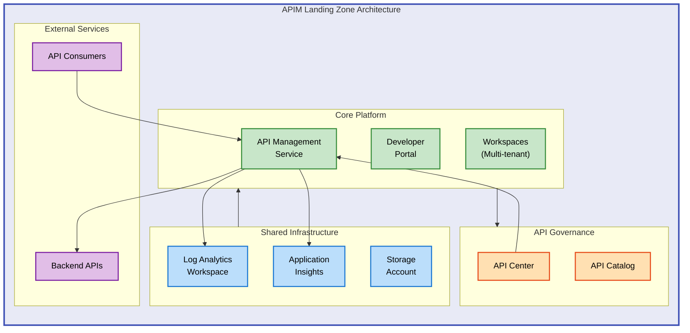

# APIM Accelerator


An enterprise-grade Infrastructure as Code (IaC) solution for deploying Azure API Management landing zones with built-in monitoring, governance, and multi-workspace support.

**Overview**

APIM Accelerator provides a comprehensive, production-ready template for deploying Azure API Management infrastructure at scale. Designed for platform teams managing API-driven architectures, this accelerator eliminates months of infrastructure design work by delivering battle-tested Bicep templates that follow Azure Well-Architected Framework principles. The solution addresses common challenges in API platform deployment: observability integration, security configuration, multi-team isolation, and operational consistency.

Organizations benefit from rapid deployment (minutes vs. weeks), built-in best practices for monitoring and governance, and a modular architecture that scales from proof-of-concept to enterprise production environments. Whether deploying a single APIM instance for development or a multi-region, high-availability platform serving hundreds of APIs, this accelerator provides the foundational infrastructure with enterprise-grade features enabled by default.

The solution integrates Azure Developer CLI (azd) for streamlined deployment automation, Azure API Center for centralized API governance, and comprehensive observability through Log Analytics and Application Insights. Each component is designed for customization while maintaining consistency and security across environments.

---

## 📋 Table of Contents

- [Architecture](#-architecture)
- [Quick Start](#-quick-start)
- [Deployment](#-deployment)
- [Usage](#-usage)
- [Features](#-features)
- [Requirements](#-requirements)
- [Configuration](#-configuration)
- [Contributing](#-contributing)
- [License](#-license)

---

## 🏗️ Architecture

**Overview**

The architecture implements a three-tier landing zone model designed for enterprise API management at scale. Each tier serves a distinct purpose: shared infrastructure provides foundational observability and monitoring capabilities that span multiple workloads; core platform delivers the API Management service with premium features like multi-region deployment, caching, and developer portal; inventory management adds governance through Azure API Center for API discovery and compliance tracking.

This separation enables independent lifecycle management for each component while maintaining clear dependency chains. Shared services deploy first to establish monitoring baselines, followed by the core APIM platform that consumes those monitoring endpoints, and finally the inventory layer that catalogs and governs APIs published to the platform. The architecture supports both single-tenant deployments for smaller teams and multi-workspace configurations for organizations with multiple business units requiring logical isolation.



**Component Details:**

- **Shared Infrastructure**: Provides centralized monitoring with Log Analytics for diagnostics, Application Insights for performance tracking, and Storage Account for log archival
- **Core Platform**: Hosts the API Management service with configurable SKU (Developer to Premium), developer portal for self-service API documentation, and workspace-based multi-tenancy
- **API Governance**: Integrates API Center for centralized API catalog, compliance management, and automatic API discovery from APIM
- **External Services**: Represents backend API endpoints protected by APIM and frontend consumers accessing APIs through the gateway

---

## 🚀 Quick Start

**Overview**

The fastest path to deployment uses Azure Developer CLI (azd), which automates infrastructure provisioning, configuration validation, and resource deployment in a single command. This approach requires minimal prerequisites and handles environment setup, credential management, and lifecycle hooks automatically. Ideal for proof-of-concept deployments or teams new to Azure infrastructure deployment.

```bash
# Install Azure Developer CLI
curl -fsSL https://aka.ms/install-azd.sh | bash

# Clone the repository
git clone https://github.com/Evilazaro/APIM-Accelerator.git
cd APIM-Accelerator

# Initialize environment and deploy
azd up
```

> 💡 **Tip**: The `azd up` command combines `azd provision` (infrastructure deployment) and `azd deploy` (application deployment) into a single operation. For granular control, run these commands separately.

---

## 📦 Deployment

**Overview**

Deployment follows a multi-phase approach designed to ensure consistent, repeatable infrastructure provisioning across environments. The process validates prerequisites, provisions Azure resources using Bicep templates, and configures monitoring integrations automatically. Both automated (azd) and manual (az CLI) deployment paths are supported to accommodate different operational models and CI/CD pipeline integrations.

### Prerequisites

Ensure the following tools and permissions are configured before deployment:

1. **Azure Subscription** with Owner or Contributor + User Access Administrator roles
2. **Azure CLI** version 2.50.0 or higher
3. **Azure Developer CLI (azd)** version 1.5.0 or higher (for automated deployment)
4. **PowerShell 7.2+** or **Bash 4.4+** (for pre-provision hooks)

> ⚠️ **Important**: The deployment creates resources that incur costs. Review Azure API Management [pricing](https://azure.microsoft.com/pricing/details/api-management/) before proceeding.

### Deployment Steps

#### Option 1: Automated Deployment (Recommended)

```bash
# Step 1: Authenticate to Azure
az login

# Step 2: Set target subscription
az account set --subscription <subscription-id>

# Step 3: Initialize azd environment
azd init

# Step 4: Configure environment-specific settings
# Edit infra/settings.yaml to customize deployment parameters

# Step 5: Deploy complete solution
azd up
```

**Expected output:**

```
Provisioning Azure resources...
✓ Resource group created
✓ Shared infrastructure deployed (Log Analytics, Application Insights)
✓ API Management service deployed
✓ API Center deployed and integrated
Deployment completed successfully in 12m 34s
```

#### Option 2: Manual Deployment

```bash
# Step 1: Create resource group
az group create \
  --name rg-apim-accelerator-dev \
  --location eastus

# Step 2: Deploy infrastructure
az deployment group create \
  --resource-group rg-apim-accelerator-dev \
  --template-file infra/main.bicep \
  --parameters envName=dev location=eastus

# Step 3: Verify deployment
az apim show \
  --name apim-accelerator-dev \
  --resource-group rg-apim-accelerator-dev
```

### Post-Deployment Verification

```bash
# Verify API Management service status
az apim show --name <apim-name> --resource-group <rg-name> --query provisioningState

# Test developer portal access
az apim show --name <apim-name> --resource-group <rg-name> --query developerPortalUrl

# Validate API Center integration
az apic show --name <api-center-name> --resource-group <rg-name>
```

---

## 💻 Usage

**Overview**

After deployment, the infrastructure is immediately ready for API integration. The solution exposes several interfaces for API management: the developer portal for self-service API documentation and testing, the Azure portal for administrative operations, and the ARM APIs for programmatic management. Common workflows include registering new APIs, configuring policies, and monitoring API performance through integrated observability tools.

### Accessing the Developer Portal

```bash
# Retrieve developer portal URL
az apim show \
  --name <apim-name> \
  --resource-group <rg-name> \
  --query developerPortalUrl \
  --output tsv
```

**Expected output**: `https://<apim-name>.developer.azure-api.net`

### Managing APIs Programmatically

```bash
# Import an OpenAPI specification
az apim api import \
  --resource-group <rg-name> \
  --service-name <apim-name> \
  --path /petstore \
  --specification-format OpenApi \
  --specification-url https://petstore.swagger.io/v2/swagger.json

# List all APIs in the instance
az apim api list \
  --resource-group <rg-name> \
  --service-name <apim-name> \
  --output table
```

### Monitoring API Performance

Application Insights is pre-configured for all API operations:

```bash
# Query API request metrics (last 24 hours)
az monitor app-insights metrics show \
  --app <app-insights-name> \
  --resource-group <rg-name> \
  --metric requests/count \
  --interval PT1H
```

Access detailed logs and metrics through Azure Portal → Application Insights → Logs.

---

## ✨ Features

**Overview**

The accelerator delivers enterprise-grade capabilities designed to reduce time-to-value for API platform deployments. Each feature addresses a specific operational challenge faced by platform teams: observability gaps, security configuration complexity, multi-team isolation, governance requirements, and deployment automation. Features are production-ready by default but fully customizable through Bicep parameters and configuration files.

Key differentiators include pre-configured monitoring integrations that eliminate observability gaps, workspace-based multi-tenancy that enables logical isolation without infrastructure duplication, and Azure Developer CLI integration that streamlines deployment automation. The modular architecture allows teams to adopt components incrementally while maintaining a consistent infrastructure baseline.

| Feature                        | Description                                                                 | Benefits                                                                 |
| ------------------------------ | --------------------------------------------------------------------------- | ------------------------------------------------------------------------ |
| 📝 **Infrastructure as Code**  | Complete Bicep templates following Azure best practices                     | Repeatable deployments, version control, audit trail, GitOps integration |
| 📊 **Built-in Observability**  | Pre-configured Log Analytics, Application Insights, and diagnostic settings | Immediate visibility into API performance and health metrics             |
| 🏢 **Multi-Workspace Support** | Workspace-based logical isolation for teams                                 | Team independence without infrastructure duplication                     |
| 📚 **API Governance**          | Azure API Center integration for centralized API catalog                    | Compliance tracking, API discovery, lifecycle management                 |
| 🔒 **Security by Default**     | Managed identity, RBAC, and secure credential management                    | Reduced attack surface, simplified credential rotation                   |
| 🚀 **Automated Deployment**    | Azure Developer CLI (azd) integration with pre-provision hooks              | One-command deployment, consistent environments, reduced human error     |
| ⚙️ **Flexible SKU Support**    | Developer, Basic, Standard, Premium, and Consumption tiers                  | Scale from development to enterprise production                          |

---

## 📋 Requirements

**Overview**

Deployment requirements reflect enterprise standards for infrastructure automation and security. Azure CLI and Azure Developer CLI provide the deployment automation layer, while specific service principal permissions ensure proper resource management and RBAC assignment capabilities. Resource requirements scale based on SKU selection: Developer SKU supports proof-of-concept scenarios with minimal resource consumption, while Premium SKU enables multi-region, high-availability deployments with dedicated capacity.

All requirements are validated during the pre-provision hook execution, which checks for tool versions, subscription permissions, and quota availability before initiating resource deployment. Failure at this stage prevents partial deployments and provides clear remediation guidance.

| Category              | Requirements                                           | More Information                                                             |
| --------------------- | ------------------------------------------------------ | ---------------------------------------------------------------------------- |
| **Runtime**           | Azure CLI 2.50.0+, Azure Developer CLI (azd) 1.5.0+    | [Install Azure CLI](https://learn.microsoft.com/cli/azure/install-azure-cli) |
| **System**            | Linux, macOS, Windows with PowerShell 7.2+ or Bash 4.4 | Cross-platform compatible                                                    |
| **Azure Permissions** | Subscription Owner or Contributor + User Access Admin  | Required for resource deployment and role assignments                        |
| **Azure Quotas**      | Standard API Management quota (1 instance per region)  | [Request quota increase](https://aka.ms/apim-quota)                          |
| **Dependencies**      | None (all templates self-contained)                    | No external Bicep module dependencies                                        |
| **Network**           | Outbound HTTPS access to Azure Resource Manager        | Required for deployment and management operations                            |

> ⚠️ **Note**: Premium SKU deployments require additional quota approval for multi-region capacity. Plan for 3-5 business days for quota increase requests.

---

## 🔧 Configuration

**Overview**

Configuration management follows a hierarchical model designed to balance consistency with environment-specific customization. Global settings in `infra/settings.yaml` define resource naming patterns, SKU selections, and feature flags that apply across all environments. Environment-specific overrides (dev, test, production) customize settings like capacity, region selection, and monitoring retention policies without duplicating the entire configuration.

This approach enables teams to maintain a single source of truth for infrastructure definitions while allowing necessary variations for different deployment contexts. Configuration validation occurs during the pre-provision hook, catching common mistakes like invalid SKU combinations or missing required parameters before resource deployment begins.

### Primary Configuration File

All environment-specific settings are managed in `infra/settings.yaml`:

```yaml
# Core solution identifier
solutionName: "apim-accelerator"

# API Management configuration
core:
  apiManagement:
    publisherEmail: "admin@contoso.com"
    publisherName: "Contoso"
    sku:
      name: "Premium" # Developer, Basic, Standard, Premium, Consumption
      capacity: 1 # Scale units (Premium: 1-10)
    identity:
      type: "SystemAssigned" # SystemAssigned, UserAssigned, or Both
    workspaces:
      - name: "workspace1" # Premium SKU only

# Monitoring configuration
shared:
  monitoring:
    logAnalytics:
      retentionInDays: 90 # Log retention period
    applicationInsights:
      samplingPercentage: 100 # Telemetry sampling rate
```

### Environment Variables

For CI/CD integration, override configuration using environment variables:

```bash
# Set deployment environment
export AZURE_ENV_NAME=production

# Override SKU for specific environment
export APIM_SKU_NAME=Premium
export APIM_SKU_CAPACITY=2

# Configure regional deployment
export AZURE_LOCATION=eastus
```

### Advanced Configuration

#### Custom Resource Naming

Modify naming patterns in `src/shared/constants.bicep`:

```bicep
// Customize resource naming convention
var resourceNamePrefix = '${solutionName}-${environment}'
var apimName = '${resourceNamePrefix}-apim'
var logAnalyticsName = '${resourceNamePrefix}-logs'
```

#### Multi-Region Deployment (Premium SKU)

Configure additional regions in `src/core/main.bicep`:

```bicep
resource apim 'Microsoft.ApiManagement/service@2023-05-01-preview' = {
  name: apimName
  properties: {
    additionalLocations: [
      {
        location: 'westus'
        sku: {
          name: 'Premium'
          capacity: 1
        }
      }
    ]
  }
}
```

> 💡 **Best Practice**: Store sensitive values like publisher email and connection strings in Azure Key Vault and reference them via Bicep parameters rather than committing to source control.

---

## 🤝 Contributing

**Overview**

Contributions to APIM Accelerator help the broader Azure community by improving template quality, expanding feature coverage, and documenting best practices. The project welcomes contributions ranging from bug fixes and documentation improvements to new features like additional SKU configurations or integration patterns. All contributions undergo review to ensure alignment with Azure Well-Architected Framework principles and maintain backward compatibility.

The contribution process emphasizes collaboration: propose significant changes through GitHub Issues before implementation to gather feedback and avoid duplicated effort. Smaller improvements like documentation fixes or bug corrections can proceed directly to pull requests. All code changes require passing validation tests, which verify Bicep syntax, template deployments, and adherence to naming conventions.

Contributions are accepted through GitHub pull requests following these guidelines:

1. **Fork the repository** and create a feature branch
2. **Make changes** following existing code style and conventions
3. **Test thoroughly** - validate Bicep templates compile and deploy successfully
4. **Update documentation** to reflect changes or new features
5. **Submit pull request** with clear description of changes and motivation

### Development Setup

```bash
# Clone your fork
git clone https://github.com/<your-username>/APIM-Accelerator.git
cd APIM-Accelerator

# Create feature branch
git checkout -b feature/your-feature-name

# Validate Bicep templates
az bicep build --file infra/main.bicep

# Run pre-deployment validation
./infra/azd-hooks/pre-provision.sh
```

### Code Standards

- Follow [Bicep best practices](https://learn.microsoft.com/azure/azure-resource-manager/bicep/best-practices)
- Use descriptive parameter and variable names
- Include comments for complex logic or non-obvious design decisions
- Maintain backward compatibility for existing parameters

### Reporting Issues

Submit bug reports or feature requests through [GitHub Issues](https://github.com/Evilazaro/APIM-Accelerator/issues) with:

- Clear description of the problem or enhancement
- Steps to reproduce (for bugs)
- Expected vs. actual behavior
- Environment details (Azure CLI version, region, SKU)

---

## 📝 License

This project is licensed under the MIT License - see the [LICENSE](LICENSE) file for details.

Copyright (c) 2025 Evilázaro Alves
