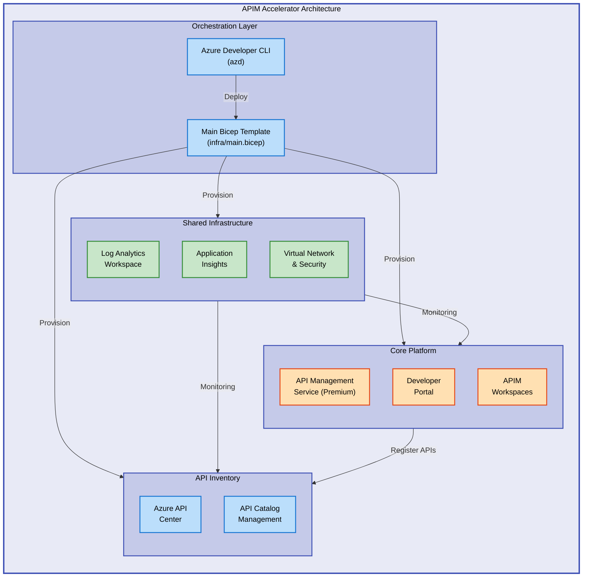

# APIM Accelerator


Enterprise-grade Azure API Management landing zone accelerator delivering production-ready infrastructure through modular Bicep templates and Azure Developer CLI integration.

**Overview**

The APIM Accelerator provides a comprehensive Infrastructure-as-Code solution for deploying Azure API Management following Azure Well-Architected Framework principles. This accelerator streamlines the deployment of enterprise API platforms by combining modular Bicep templates with Azure Developer CLI automation, enabling teams to provision production-ready API Management environments in minutes rather than weeks. The solution emphasizes separation of concerns through a layered architecture: shared monitoring infrastructure for observability, core platform services for API management capabilities, and inventory management for API catalog governance. Built for platform teams managing multi-environment API ecosystems, this accelerator reduces deployment complexity while ensuring consistency, security, and operational excellence across development, staging, and production environments.

## 📑 Table of Contents

- [Quick Start](#-quick-start)
- [Deployment](#-deployment)
- [Usage](#-usage)
- [Architecture](#-architecture)
- [Features](#-features)
- [Requirements](#-requirements)
- [Configuration](#-configuration)
- [Contributing](#-contributing)
- [License](#-license)

## 🚀 Quick Start

Deploy a complete APIM landing zone in three commands:

```bash
azd auth login
azd init --template apim-accelerator
azd up
```

## 📦 Deployment

> ⚠️ **Prerequisites**: Ensure you have Azure CLI 2.50+, Azure Developer CLI 1.5+, and an Azure subscription with Contributor access.

1. **Clone the repository**:

```bash
git clone https://github.com/Evilazaro/APIM-Accelerator.git
cd APIM-Accelerator
```

2. **Authenticate to Azure**:

```bash
azd auth login
```

3. **Initialize the environment**:

```bash
azd init
```

4. **Configure deployment settings** in [`infra/settings.yaml`](infra/settings.yaml):

```yaml
solutionName: "apim-accelerator"
core:
  apiManagement:
    sku: "Premium"
    capacity: 1
```

5. **Deploy the infrastructure**:

```bash
azd up
```

> 💡 **Tip**: Use `azd provision` to deploy infrastructure only without application code, or `azd deploy` to update application components independently.

6. **Verify deployment**:

```bash
az apim show --name <apim-name> --resource-group <resource-group>
```

Expected output: Status "Succeeded", provisioning state "Active"

## 💻 Usage

### Deploy to a specific environment

```bash
azd env new dev
azd up --environment dev
```

### Update API Management configuration

Modify [`infra/settings.yaml`](infra/settings.yaml) and redeploy:

```bash
azd provision
```

### Access Developer Portal

After deployment, retrieve the portal URL:

```bash
az apim show --name <apim-name> --resource-group <resource-group> --query "developerPortalUrl" -o tsv
```

Output: `https://<apim-name>.developer.azure-api.net`

### Monitor API Management health

```bash
az monitor log-analytics query --workspace <workspace-id> \
  --analytics-query "AzureDiagnostics | where ResourceProvider == 'MICROSOFT.APIMANAGEMENT' | top 10 by TimeGenerated desc"
```

## 🏗️ Architecture

The APIM Accelerator follows a modular layered architecture designed for scalability and maintainability:



**Key Components:**

- **Orchestration Layer**: Azure Developer CLI automates deployment through modular Bicep templates
- **Shared Infrastructure**: Centralized monitoring with Log Analytics and Application Insights
- **Core Platform**: Premium API Management service with developer portal and workspace organization
- **API Inventory**: Azure API Center integration for comprehensive API catalog governance

## ✨ Features

**Overview**

The APIM Accelerator delivers enterprise-grade API Management capabilities through a production-hardened infrastructure template. Built on Azure Well-Architected Framework pillars, this solution provides comprehensive monitoring, security, and governance features out-of-the-box. The modular architecture separates concerns across shared infrastructure, core platform services, and inventory management, enabling teams to deploy, scale, and manage API ecosystems with confidence. Each feature is designed for real-world production scenarios, incorporating best practices from Azure customer engagements and field-tested deployment patterns.

| Feature                             | Description                                                                                                                                                                                      | Benefits                                                                                                                                                    |
| ----------------------------------- | ------------------------------------------------------------------------------------------------------------------------------------------------------------------------------------------------ | ----------------------------------------------------------------------------------------------------------------------------------------------------------- |
| **Modular Bicep Architecture**      | Organized into shared, core, and inventory modules with clear separation of concerns. Each module is independently deployable and testable, following Infrastructure-as-Code best practices.     | Simplifies maintenance, enables parallel development, reduces deployment risks through isolated updates, and improves code reusability across environments. |
| **Azure Developer CLI Integration** | Native `azd` support with pre-configured hooks for provisioning, deployment, and environment management. Includes automated resource naming and tagging strategies.                              | Accelerates developer onboarding, standardizes deployments, reduces manual configuration errors, and provides consistent workflows across teams.            |
| **Comprehensive Monitoring**        | Integrated Log Analytics workspace and Application Insights for full-stack observability. Includes diagnostic settings, metric alerts, and dashboard templates for API performance monitoring.   | Enables proactive incident detection, reduces MTTR through centralized logging, provides deep API performance insights, and supports compliance reporting.  |
| **API Inventory Management**        | Azure API Center integration for centralized API catalog with versioning, metadata management, and governance policies. Supports multi-environment API lifecycle tracking.                       | Improves API discoverability, ensures governance compliance, tracks API usage across environments, and reduces shadow API proliferation.                    |
| **Enterprise Security Controls**    | Managed identity for service-to-service authentication, network security groups for traffic control, and Azure Key Vault integration for secrets management. Includes role-based access control. | Reduces security vulnerabilities, eliminates credential sprawl, ensures least-privilege access, and simplifies compliance audits.                           |

## 📋 Requirements

**Overview**

The APIM Accelerator requires specific Azure services, CLI tools, and subscription permissions to deploy successfully. This section outlines the technical prerequisites, system requirements, and dependency versions needed for production deployments. Understanding these requirements upfront prevents deployment failures and ensures optimal performance. The requirements are categorized by runtime environment, Azure subscription capabilities, and local development tooling to provide clear guidance for infrastructure teams preparing their deployment environments.

| Category                 | Requirements                                                                                                                              | More Information                                                                                                                     |
| ------------------------ | ----------------------------------------------------------------------------------------------------------------------------------------- | ------------------------------------------------------------------------------------------------------------------------------------ |
| **Runtime Environment**  | Azure subscription with resource provider registrations: `Microsoft.ApiManagement`, `Microsoft.OperationalInsights`, `Microsoft.Insights` | [Azure Subscription Prerequisites](https://learn.microsoft.com/azure/azure-resource-manager/management/resource-providers-and-types) |
| **System Tools**         | Azure CLI 2.50+, Azure Developer CLI 1.5+, Bicep CLI 0.20+                                                                                | [Install Azure CLI](https://learn.microsoft.com/cli/azure/install-azure-cli)                                                         |
| **Azure Permissions**    | Contributor role on target subscription or resource group, User Access Administrator for managed identity assignment                      | [Azure RBAC Roles](https://learn.microsoft.com/azure/role-based-access-control/built-in-roles)                                       |
| **Network Requirements** | Virtual network with minimum /24 subnet for API Management internal mode (if using VNet integration)                                      | [APIM Networking](https://learn.microsoft.com/azure/api-management/virtual-network-concepts)                                         |
| **Supported Regions**    | All Azure public cloud regions supporting API Management Premium SKU                                                                      | [Azure Geographies](https://azure.microsoft.com/global-infrastructure/geographies/)                                                  |
| **Cost Considerations**  | Minimum $2,700/month for Premium SKU (1 unit). Consider Developer SKU ($50/month) for non-production environments                         | [APIM Pricing Calculator](https://azure.microsoft.com/pricing/details/api-management/)                                               |

## 🔧 Configuration

**Overview**

The APIM Accelerator uses a centralized configuration approach through the [`infra/settings.yaml`](infra/settings.yaml) file, enabling environment-specific customization without modifying infrastructure code. This configuration-driven design supports multi-environment deployments (dev, test, production) with environment-specific SKU sizing, capacity planning, and tagging strategies. The settings file follows a hierarchical structure organized by component (shared, core, inventory), allowing platform teams to manage configuration at scale while maintaining consistency across deployments. All configuration values support parameterization through Azure Developer CLI environment variables for secure credential management and CI/CD integration.

### Core Configuration File

Edit [`infra/settings.yaml`](infra/settings.yaml) to customize your deployment:

```yaml
solutionName: "apim-accelerator"

core:
  apiManagement:
    sku: "Premium" # Options: Developer, Standard, Premium
    capacity: 1 # Number of scale units (1-12 for Premium)
    identity:
      type: "SystemAssigned"

shared:
  tags:
    CostCenter: "CC-1234"
    BusinessUnit: "IT"
    Owner: "platform-team@example.com"
    Environment: "Production"
```

### Environment Variables

Configure Azure Developer CLI environment-specific settings:

```bash
azd env set AZURE_LOCATION eastus2
azd env set AZURE_SUBSCRIPTION_ID <subscription-id>
azd env set APIM_SKU Premium
```

### Deployment Hooks

Pre-provision hook in [`infra/azd-hooks/pre-provision.sh`](infra/azd-hooks/pre-provision.sh) validates region availability:

```bash
#!/bin/sh
# Validates that API Management Premium SKU is available in target region
az provider show --namespace Microsoft.ApiManagement --query "resourceTypes[?resourceType=='service'].zoneMappings"
```

### Advanced Configuration

**Custom Domain Configuration**: Update [`src/core/apim.bicep`](src/core/apim.bicep) with certificate references.

**VNet Integration**: Configure subnet delegation in [`src/shared/networking/main.bicep`](src/shared/networking/main.bicep).

**Diagnostic Settings**: Adjust retention policies in [`src/shared/monitoring/main.bicep`](src/shared/monitoring/main.bicep).

> ℹ️ **Note**: Configuration changes require redeployment with `azd provision` to take effect. Review the [Azure API Management documentation](https://learn.microsoft.com/azure/api-management/) for advanced configuration scenarios.

## 🤝 Contributing

**Overview**

We welcome contributions from the community to improve the APIM Accelerator. This project follows open-source best practices with a focus on code quality, documentation completeness, and comprehensive testing. Contributors should familiarize themselves with Azure Infrastructure-as-Code patterns, Bicep template development, and the Azure Well-Architected Framework. All contributions undergo peer review to ensure alignment with architectural principles and maintain consistency with existing patterns. Whether you're fixing bugs, adding features, improving documentation, or proposing architectural enhancements, your contributions help build a better accelerator for the Azure community.

Contributions are welcome! Please follow these guidelines:

1. **Fork the repository** and create a feature branch
2. **Follow Bicep best practices** as defined in [Azure/bicep](https://github.com/Azure/bicep)
3. **Test deployments** in a non-production subscription before submitting
4. **Update documentation** for any configuration changes
5. **Submit a pull request** with clear description of changes and testing evidence

For major changes, please open an issue first to discuss proposed modifications.

## 📝 License

MIT License - see [LICENSE](LICENSE) file for details.

---

**Project Maintainer**: Evilazaro ([evilazaro@gmail.com](mailto:evilazaro@gmail.com))

**Repository**: [github.com/Evilazaro/APIM-Accelerator](https://github.com/Evilazaro/APIM-Accelerator)
