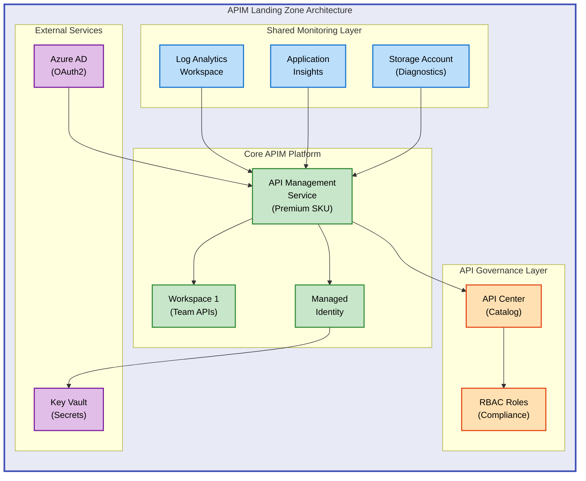

# APIM Accelerator


Enterprise-grade Infrastructure as Code (IaC) solution for deploying and managing Azure API Management landing zones with comprehensive monitoring, governance, and multi-team workspace support.

## Overview

**APIM Accelerator** is a production-ready Azure infrastructure template that automates the deployment of a complete API Management platform with enterprise features. It solves the challenge of setting up complex APIM environments by providing a modular, repeatable deployment architecture that integrates monitoring (Log Analytics, Application Insights), API governance (API Center), and multi-tenant workspace isolation—all configured through a single YAML settings file.

This accelerator is designed for platform engineers, cloud architects, and DevOps teams who need to rapidly deploy secure, observable, and scalable API Management infrastructure across multiple environments (dev, test, staging, production). It eliminates weeks of manual configuration by codifying Azure best practices into reusable Bicep modules that can be deployed in minutes using Azure Developer CLI.

The solution provides three-tier architecture separation: **shared monitoring infrastructure** (centralized logging and diagnostics), **core APIM platform** (API gateway with Premium features like multi-region support and workspaces), and **API inventory management** (centralized catalog and governance via API Center). This separation enables independent scaling, clear ownership boundaries, and simplified compliance auditing while maintaining secure integration between all components through managed identities and role-based access control.

## 🏗️ Architecture

**Overview**

The APIM Accelerator architecture follows Azure Landing Zone principles with clear separation of concerns across three logical layers. The **shared layer** provides foundational observability through Log Analytics and Application Insights, ensuring all components can emit structured logs and telemetry. The **core layer** deploys the API Management service with configurable SKU (Developer through Premium), system-assigned managed identity for secure Azure service integration, and workspace support for team isolation. The **inventory layer** integrates Azure API Center to provide centralized API catalog, governance policies, and compliance management across all APIs.

This layered approach enables organizations to deploy once and scale horizontally by adding workspaces, while maintaining centralized monitoring and governance. Each layer can be independently upgraded or configured through the `settings.yaml` file, supporting different team requirements without requiring template modifications.



## Table of Contents

- [Features](#-features)
- [Requirements](#-requirements)
- [Quick Start](#-quick-start)
- [Deployment](#-deployment)
- [Usage](#-usage)
- [Configuration](#-configuration)
- [Contributing](#-contributing)
- [License](#-license)

## ✨ Features

**Overview**

The APIM Accelerator provides enterprise-ready capabilities designed to accelerate API platform adoption while maintaining security and governance standards. Each feature addresses specific operational challenges: automated infrastructure provisioning reduces deployment time from days to minutes, integrated monitoring eliminates blind spots in API operations, and workspace isolation enables safe multi-team collaboration without cross-contamination.

These features work together to create a cohesive API platform experience. Monitoring integration feeds real-time telemetry into centralized dashboards, while governance policies enforce organizational standards automatically. The modular architecture allows teams to adopt features incrementally—start with basic APIM deployment, then add workspaces as teams grow, and enable API Center for governance when ready.

| Feature                                  | Description                                                                                                   | Benefits                                                                                                                                     |
| ---------------------------------------- | ------------------------------------------------------------------------------------------------------------- | -------------------------------------------------------------------------------------------------------------------------------------------- |
| **Automated Infrastructure Deployment**  | Complete Bicep-based IaC templates for subscription-level deployment with Azure Developer CLI integration     | Reduces deployment time from days to minutes; ensures consistency across environments; enables GitOps workflows                              |
| **Comprehensive Monitoring Integration** | Pre-configured Log Analytics workspace, Application Insights, and diagnostic settings for all APIM components | Provides 360° visibility into API performance, usage patterns, and errors; enables proactive incident response; supports compliance auditing |
| **Multi-Workspace Support**              | Premium SKU workspace isolation for independent team API management with shared infrastructure                | Enables safe multi-tenancy; reduces costs vs. multiple APIM instances; provides logical separation while maintaining centralized governance  |
| **API Governance with API Center**       | Centralized API catalog, compliance management, and discovery through Azure API Center integration            | Ensures API standardization across teams; provides single source of truth for API inventory; automates compliance checks                     |
| **Security by Default**                  | Managed identity integration, Azure AD OAuth2 support, and RBAC role assignments for least-privilege access   | Eliminates credential management overhead; enforces zero-trust principles; simplifies audit compliance                                       |
| **Environment-Agnostic Configuration**   | Single YAML configuration file supports dev, test, staging, production, and UAT environments                  | Promotes configuration consistency; reduces human error during deployments; accelerates environment provisioning                             |
| **Modular Architecture**                 | Separated shared, core, and inventory modules enable independent upgrades and scaling                         | Simplifies maintenance; allows incremental adoption; supports diverse team requirements without code changes                                 |

## 📋 Requirements

**Overview**

The APIM Accelerator requires specific Azure and tooling prerequisites to ensure successful deployment. These requirements are non-negotiable because the accelerator leverages Azure-native services (API Management, Log Analytics, API Center) that have minimum version and permission dependencies. The Premium SKU requirement exists for workspace support—if workspaces aren't needed, the templates can be modified to use Standard or Developer SKUs for non-production environments.

Tool versions matter: Azure CLI 2.50.0+ includes critical Bicep fixes, and Azure Developer CLI 1.5.0+ provides the orchestration commands used in `azure.yaml`. Using older versions may result in deployment failures or missing features. Subscription-level permissions are required because the main template creates resource groups and assigns RBAC roles across scopes.

| Category                | Requirements                                                                          | Details                                                                                                          |
| ----------------------- | ------------------------------------------------------------------------------------- | ---------------------------------------------------------------------------------------------------------------- |
| **Azure Subscription**  | Active Azure subscription with Owner or Contributor + User Access Administrator roles | Subscription-level permissions required for resource group creation and RBAC assignments                         |
| **Azure CLI**           | Azure CLI 2.50.0 or later                                                             | Download from [Microsoft Docs](https://learn.microsoft.com/cli/azure/install-azure-cli)                          |
| **Azure Developer CLI** | Azure Developer CLI (azd) 1.5.0 or later                                              | Download from [Azure Developer CLI](https://learn.microsoft.com/azure/developer/azure-developer-cli/install-azd) |
| **Bicep**               | Bicep CLI 0.20.0+ (bundled with Azure CLI)                                            | Verify with `az bicep version`                                                                                   |
| **API Management SKU**  | Premium SKU recommended for production (Developer/Basic/Standard for non-prod)        | Premium required for workspace support and multi-region deployments                                              |
| **Azure Regions**       | Region must support Azure API Management Premium tier and API Center                  | Check [Azure Products by Region](https://azure.microsoft.com/global-infrastructure/services/)                    |
| **Permissions**         | Subscription-level Owner or Contributor + RBAC admin for role assignments             | Required for creating managed identities and assigning Azure roles                                               |

## 🚀 Quick Start

**Overview**

The quickest path to deployment uses Azure Developer CLI, which orchestrates all provisioning steps defined in `azure.yaml`. This approach is recommended for teams new to the accelerator because it validates prerequisites, executes pre-provision hooks, and handles parameter injection automatically.

```bash
# Clone and deploy in 3 commands
git clone https://github.com/Evilazaro/APIM-Accelerator.git
cd APIM-Accelerator
azd up
```

> ⚠️ **Prerequisites Required**: Ensure Azure CLI and Azure Developer CLI are installed before running `azd up`. Run `az login` to authenticate.

## 📦 Deployment

**Overview**

The APIM Accelerator supports two deployment methods: **Azure Developer CLI** (recommended for full automation) and **Manual Azure CLI** (for custom workflows or CI/CD pipelines). The azd approach handles environment setup, parameter injection, and hooks execution automatically, while manual deployment provides granular control over each step.

Deployment follows a sequential pattern: shared monitoring infrastructure deploys first (required dependency), then core APIM platform, and finally API governance layer. This ordering ensures dependent resources (like Log Analytics workspace IDs) are available when needed by downstream modules.

### Method 1: Azure Developer CLI (Recommended)

> 💡 **Tip**: Use `azd up` for streamlined deployment—it combines provisioning and deployment in a single command.

1. **Authenticate to Azure**

```bash
az login
azd auth login
```

2. **Configure environment settings**

Edit `infra/settings.yaml` with your configuration:

```yaml
solutionName: "your-solution-name"
core:
  apiManagement:
    publisherEmail: "your-email@domain.com"
    publisherName: "Your Organization"
    sku:
      name: "Premium" # Or Developer/Basic/Standard
      capacity: 1
```

3. **Initialize and deploy**

```bash
# Initialize environment (creates .azure folder with state)
azd init

# Provision infrastructure and deploy
azd up
```

4. **Verify deployment**

```bash
# Check APIM service status
az apim show --name <apim-name> --resource-group <rg-name>

# View Application Insights data
az monitor app-insights component show --app <app-insights-name> --resource-group <rg-name>
```

### Method 2: Manual Azure CLI Deployment

For CI/CD pipelines or custom deployment workflows:

```bash
# 1. Set deployment variables
LOCATION="eastus"
ENV_NAME="dev"
SUBSCRIPTION_ID=$(az account show --query id -o tsv)

# 2. Deploy at subscription scope
az deployment sub create \
  --name "apim-accelerator-$(date +%Y%m%d-%H%M%S)" \
  --location $LOCATION \
  --template-file infra/main.bicep \
  --parameters envName=$ENV_NAME location=$LOCATION

# 3. Retrieve outputs
az deployment sub show \
  --name "apim-accelerator-<timestamp>" \
  --query properties.outputs
```

> ⚠️ **Important**: Manual deployment requires parameter validation. Ensure all required fields in `settings.yaml` are populated before deployment.

### Post-Deployment Steps

1. **Configure Developer Portal** (if using OAuth2):

```bash
# Set up Azure AD app registration for developer portal authentication
# Follow: https://learn.microsoft.com/azure/api-management/developer-portal-integrate-azure-ad
```

2. **Test API Management connectivity**:

```bash
# Import sample API for testing
az apim api import \
  --path /test \
  --api-id test-api \
  --service-name <apim-name> \
  --resource-group <rg-name> \
  --specification-format OpenApiJson \
  --specification-url https://petstore.swagger.io/v2/swagger.json
```

3. **Verify monitoring integration**:
   - Open Azure Portal → Application Insights
   - Check for APIM telemetry in last 30 minutes
   - Verify diagnostic logs flowing to Log Analytics

## 💻 Usage

**Overview**

After deployment, the APIM Accelerator provides three primary usage patterns: **managing APIs through workspaces**, **monitoring platform health**, and **enforcing governance policies**. Each pattern serves different user personas—API developers work in workspaces, platform engineers monitor infrastructure, and compliance teams use API Center for audits.

### Managing APIs in Workspaces

```bash
# List available workspaces
az apim workspace list \
  --service-name <apim-name> \
  --resource-group <rg-name>

# Create a new API in a workspace
az apim api create \
  --service-name <apim-name> \
  --resource-group <rg-name> \
  --workspace-id workspace1 \
  --api-id my-api \
  --path /api/v1 \
  --display-name "My API"
```

### Querying Monitoring Data

```bash
# Query APIM request logs in Log Analytics
az monitor log-analytics query \
  --workspace <workspace-id> \
  --analytics-query "ApiManagementGatewayLogs | where TimeGenerated > ago(1h) | summarize count() by ResponseCode"

# View Application Insights metrics
az monitor app-insights metrics show \
  --app <app-insights-name> \
  --resource-group <rg-name> \
  --metric requests/duration
```

### API Governance Operations

```bash
# List APIs registered in API Center
az apic api list \
  --service-name <api-center-name> \
  --resource-group <rg-name>

# Add compliance metadata to API
az apic api update \
  --service-name <api-center-name> \
  --resource-group <rg-name> \
  --api-id <api-id> \
  --custom-properties '{"compliance":"GDPR","dataClassification":"confidential"}'
```

### Expected Outputs

**Successful API deployment**:

```json
{
  "id": "/subscriptions/.../apis/my-api",
  "name": "my-api",
  "path": "/api/v1",
  "serviceUrl": "https://backend.example.com",
  "protocols": ["https"]
}
```

**Monitoring query results**:

```
ResponseCode | count_
200          | 1523
201          | 89
400          | 12
500          | 3
```

## 🔧 Configuration

**Overview**

All deployment configuration is centralized in `infra/settings.yaml`, which uses a three-section structure mirroring the architecture layers: **shared** (monitoring and tags), **core** (APIM service settings), and **inventory** (API Center configuration). This structure promotes separation of concerns—monitoring teams manage shared settings, platform teams manage core APIM configuration, and governance teams manage inventory settings.

Configuration follows environment promotion patterns: use `envName` parameter (`dev`, `test`, `staging`, `prod`, `uat`) to control SKU sizing and feature enablement. For example, use Developer SKU in dev/test for cost savings, then Premium in production for SLA guarantees and advanced features.

### Core Configuration File

The `infra/settings.yaml` file structure:

```yaml
# Solution identifier used across all resource names
solutionName: "apim-accelerator"

# Shared monitoring infrastructure settings
shared:
  monitoring:
    logAnalytics:
      name: "" # Leave empty for auto-generation
      identity:
        type: "SystemAssigned"
    applicationInsights:
      name: "" # Leave empty for auto-generation
  tags:
    CostCenter: "CC-1234"
    BusinessUnit: "IT"
    Owner: "your-email@domain.com"

# Core APIM platform settings
core:
  apiManagement:
    name: "" # Leave empty for auto-generation
    publisherEmail: "api-admin@domain.com"
    publisherName: "Your Organization"
    sku:
      name: "Premium" # Developer | Basic | Standard | Premium
      capacity: 1 # Scale units
    identity:
      type: "SystemAssigned"
    workspaces:
      - name: "team1-apis"
      - name: "team2-apis"

# API governance settings
inventory:
  apiCenter:
    name: "" # Leave empty for auto-generation
    identity:
      type: "SystemAssigned"
```

### Environment Variables

For CI/CD pipelines, override settings using environment variables:

```bash
export AZURE_SUBSCRIPTION_ID="your-subscription-id"
export AZURE_LOCATION="eastus"
export AZURE_ENV_NAME="prod"
export APIM_PUBLISHER_EMAIL="api-team@company.com"
export APIM_PUBLISHER_NAME="Company IT"
```

### SKU Selection Guidelines

| SKU           | Use Case                             | Workspaces | Multi-Region | Cost |
| ------------- | ------------------------------------ | ---------- | ------------ | ---- |
| **Developer** | Local dev/test, non-production       | ❌         | ❌           | $    |
| **Basic**     | Small production workloads           | ❌         | ❌           | $$   |
| **Standard**  | Production APIs, moderate scale      | ❌         | ❌           | $$$  |
| **Premium**   | Enterprise, workspaces, multi-region | ✅         | ✅           | $$$$ |

> 💡 **Tip**: Start with Developer SKU for initial testing, then upgrade to Premium when workspace isolation or multi-region support is required.

### Advanced Configuration Options

**Custom resource naming** (override auto-generated names):

```yaml
core:
  apiManagement:
    name: "contoso-apim-prod-001" # Custom name instead of auto-generated
```

**User-assigned managed identity** (for Key Vault integration):

```yaml
core:
  apiManagement:
    identity:
      type: "UserAssigned"
      userAssignedIdentities:
        - "/subscriptions/<sub-id>/resourceGroups/<rg>/providers/Microsoft.ManagedIdentity/userAssignedIdentities/<identity-name>"
```

**Multiple workspaces for team isolation**:

```yaml
core:
  apiManagement:
    workspaces:
      - name: "finance-apis"
      - name: "sales-apis"
      - name: "customer-apis"
      - name: "internal-apis"
```

## 🤝 Contributing

**Overview**

The APIM Accelerator thrives on community contributions that enhance its functionality, improve documentation, or address edge cases not covered in the base templates. Contributions are valued whether they're bug fixes, new modules (like networking or VNet integration), or improvements to deployment automation.

The project follows standard open-source practices: fork the repository, create a feature branch, implement changes with clear commit messages, and submit a pull request. All contributions undergo code review focusing on Bicep best practices, security implications, and backward compatibility with existing deployments.

We welcome contributions in these areas:

- **New Bicep modules** (networking, VNet integration, custom domains)
- **Deployment automation** (GitHub Actions workflows, Azure Pipelines templates)
- **Documentation improvements** (tutorials, troubleshooting guides, architecture diagrams)
- **Bug fixes and issue reports**

### Contribution Process

1. Fork the repository
2. Create a feature branch: `git checkout -b feature/your-feature-name`
3. Make changes and test locally using `azd up`
4. Commit with descriptive messages: `git commit -m "Add VNet integration module"`
5. Push to your fork: `git push origin feature/your-feature-name`
6. Open a pull request with detailed description

### Development Setup

```bash
# Clone your fork
git clone https://github.com/YOUR-USERNAME/APIM-Accelerator.git
cd APIM-Accelerator

# Test changes locally
azd up --environment dev

# Validate Bicep syntax
az bicep build --file infra/main.bicep
```

> ℹ️ **Note**: Please ensure all Bicep files follow Azure Bicep best practices and include inline documentation comments.

## 📝 License

This project is licensed under the **MIT License** - see the [LICENSE](LICENSE) file for details.

**MIT License Summary**: Free to use, modify, and distribute. Requires copyright notice preservation. Provided "as is" without warranty.

Copyright © 2025 Evilázaro Alves

---

**Built with ❤️ for the Azure API Management community**
