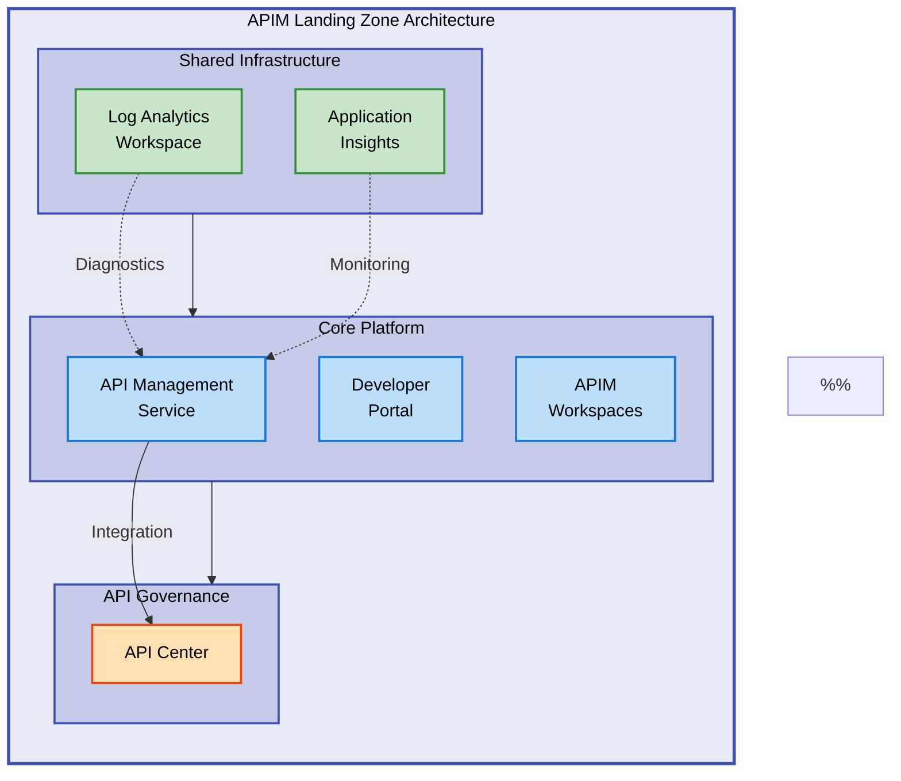

# APIM Accelerator


Enterprise-grade Azure API Management landing zone accelerator for rapid deployment of production-ready API infrastructure with built-in governance, monitoring, and best practices.

**Overview**

The APIM Accelerator is a comprehensive Infrastructure as Code (IaC) solution built with Azure Bicep that automates the deployment of a complete Azure API Management landing zone. It orchestrates the provisioning of API Management services, monitoring infrastructure, API governance capabilities, and networking components following Azure Well-Architected Framework principles. The accelerator is designed for organizations seeking to establish standardized, secure, and scalable API platforms with minimal manual configuration.

This solution provides pre-configured templates for monitoring (Log Analytics, Application Insights), core APIM services with premium features, API Center for centralized governance, and extensible networking options. It integrates seamlessly with Azure Developer CLI (azd) for streamlined deployment workflows and supports multiple environments (dev, test, staging, production) through environment-specific configuration files.

The architecture follows enterprise best practices with separation of concerns, modular design patterns, and comprehensive tagging strategies for cost management and compliance tracking. Whether deploying a simple developer sandbox or a complex multi-region API gateway, the APIM Accelerator reduces time-to-production from weeks to hours.

## 📑 Table of Contents

- [Architecture](#-architecture)
- [Quick Start](#-quick-start)
- [Deployment](#-deployment)
- [Usage](#-usage)
- [Features](#-features)
- [Requirements](#-requirements)
- [Configuration](#-configuration)
- [Contributing](#-contributing)
- [License](#-license)

## 🏗️ Architecture

**Overview**

The APIM Accelerator implements a three-tier architecture pattern designed for scalability and separation of concerns. The deployment model uses subscription-level orchestration to manage resource groups and coordinate dependencies between shared services, core platform components, and inventory management capabilities. This layered approach ensures proper deployment sequencing where monitoring infrastructure is established first, followed by the core APIM platform, and finally governance capabilities.

The architecture supports multiple deployment topologies including isolated development environments, hub-spoke network designs for production workloads, and multi-region configurations for high availability. All components are deployed using declarative Bicep templates with parameterized configurations enabling environment-specific customization without modifying template code. The modular structure allows teams to adopt individual components incrementally or deploy the complete landing zone in a single operation.



## 🚀 Quick Start

Deploy a complete APIM landing zone in minutes using Azure Developer CLI:

```bash
azd auth login
azd up
```

> 💡 **Tip**: Use `azd up` for a complete end-to-end deployment or `azd provision` to deploy infrastructure only without application components.

## 📦 Deployment

**Overview**

The deployment process follows a multi-stage approach leveraging Azure Developer CLI (azd) for automated orchestration. The accelerator includes pre-provision hooks that validate prerequisites, configure environment-specific settings from `infra/settings.yaml`, and prepare the deployment context. The main orchestration template (`infra/main.bicep`) creates resource groups and deploys child modules in sequence, ensuring dependencies are satisfied before dependent resources are provisioned.

Deployment can be executed using standard Azure CLI commands for granular control or through azd workflows for simplified automation. The solution supports both greenfield deployments (new environments) and integration with existing Azure resources by referencing existing workspace and storage account identifiers in the configuration file.

### Prerequisites

1. Install Azure Developer CLI:

```bash
winget install microsoft.azd
```

2. Install Azure CLI:

```bash
winget install Microsoft.AzureCLI
```

3. Authenticate to Azure:

```bash
az login
azd auth login
```

### Deployment Steps

1. Clone the repository:

```bash
git clone https://github.com/Evilazaro/APIM-Accelerator.git
cd APIM-Accelerator
```

2. Configure environment settings:

Edit `infra/settings.yaml` to customize:

- Solution name
- Publisher email and organization name
- SKU configuration (Developer, Basic, Standard, Premium)
- Tagging strategy for governance

3. Deploy the landing zone:

```bash
azd up
```

4. Verify deployment:

```bash
az apim show --name <apim-name> --resource-group <resource-group>
```

> ⚠️ **Important**: Premium SKU deployment takes approximately 30-45 minutes. Developer SKU typically completes in 10-15 minutes.

### Alternative Deployment Methods

Deploy using Azure CLI directly:

```bash
az deployment sub create \
  --location eastus \
  --template-file infra/main.bicep \
  --parameters envName=dev location=eastus
```

## 💻 Usage

**Overview**

After successful deployment, the APIM Accelerator provides multiple interfaces for API management and governance. The primary interaction point is the Azure API Management service accessible through Azure Portal, REST APIs, or Azure CLI. The deployed Developer Portal enables API consumers to discover, test, and subscribe to APIs with self-service onboarding workflows. API Center provides centralized governance dashboards for tracking API inventory, lifecycle stages, and compliance postures.

### Access API Management Service

Navigate to your deployed APIM instance in Azure Portal:

```bash
az apim show --name <apim-name> --resource-group <rg-name> --query "gatewayUrl" -o tsv
```

Expected output:

```
https://<apim-name>.azure-api.net
```

### Import APIs

Use Azure CLI to import OpenAPI specifications:

```bash
az apim api import \
  --resource-group <rg-name> \
  --service-name <apim-name> \
  --path /petstore \
  --specification-url https://petstore.swagger.io/v2/swagger.json \
  --specification-format OpenApiJson
```

### Access Developer Portal

Enable and customize the developer portal:

```bash
az apim show --name <apim-name> --resource-group <rg-name> --query "developerPortalUrl" -o tsv
```

### Monitor with Application Insights

Query API performance metrics:

```bash
az monitor app-insights metrics show \
  --app <app-insights-name> \
  --resource-group <rg-name> \
  --metric requests/count
```

## ✨ Features

**Overview**

The APIM Accelerator delivers a comprehensive suite of capabilities designed to accelerate API platform adoption while maintaining enterprise-grade security, governance, and operational excellence. The feature set addresses common challenges in API management including monitoring gaps, inconsistent governance, complex networking requirements, and manual configuration overhead. Each feature is implemented using Azure-native services with infrastructure-as-code templates that ensure repeatability and consistency across environments.

The solution architecture emphasizes modularity and extensibility, enabling organizations to adopt features incrementally or deploy the complete stack based on their maturity and requirements. All components follow Azure Well-Architected Framework principles with built-in support for reliability, security, cost optimization, operational excellence, and performance efficiency.

| Feature                    | Description                                                                                                                   | Benefits                                                                                                                                                                  |
| -------------------------- | ----------------------------------------------------------------------------------------------------------------------------- | ------------------------------------------------------------------------------------------------------------------------------------------------------------------------- |
| **🔐 Managed Identity**    | System-assigned and user-assigned managed identities for APIM service with automated RBAC assignments                         | Eliminates credential management overhead, enhances security posture, enables seamless integration with Azure services like Key Vault and Storage without storing secrets |
| **📊 Observability**       | Pre-configured Log Analytics workspace, Application Insights integration, and diagnostic settings for comprehensive telemetry | Provides end-to-end visibility into API performance, error rates, and usage patterns with centralized logging and real-time monitoring dashboards                         |
| **🌐 Network Integration** | Virtual network connectivity options with subnet delegation and private endpoint support                                      | Enables secure private connectivity, network isolation for sensitive APIs, and integration with hub-spoke network topologies for enterprise compliance                    |
| **📚 API Governance**      | Azure API Center integration for centralized API catalog with lifecycle management and compliance tracking                    | Establishes API governance framework with versioning controls, deprecation policies, and organization-wide API discovery reducing shadow IT and API sprawl                |
| **🛠️ Developer Portal**    | Customizable developer portal with self-service API subscription and interactive documentation                                | Accelerates developer onboarding, reduces support overhead through self-service capabilities, improves API adoption with interactive testing consoles                     |
| **🏷️ Tagging Strategy**    | Comprehensive tagging framework for cost allocation, compliance tracking, and resource organization                           | Enables accurate cost attribution, supports chargeback/showback models, facilitates compliance reporting for regulatory requirements (GDPR, HIPAA)                        |
| **🚀 Automation**          | Azure Developer CLI integration with lifecycle hooks for automated provisioning and configuration                             | Reduces deployment time from hours to minutes, ensures consistency across environments, enables GitOps workflows with CI/CD integration                                   |

## 📋 Requirements

**Overview**

The APIM Accelerator has specific prerequisites across Azure subscription capabilities, local tooling, and access permissions. These requirements ensure successful deployment and operational readiness of the API management platform. All Azure services deployed by the accelerator are available in most Azure regions, though specific SKU availability should be verified for your target deployment region.

Role-based access control (RBAC) requirements follow least-privilege principles, with deployment operations requiring Contributor-level permissions at subscription or resource group scope. Production deployments typically require additional coordination with network administrators for VNet integration and security teams for network security group configurations.

| Category                  | Requirements                                                                                                                | More Information                                                                                                                  |
| ------------------------- | --------------------------------------------------------------------------------------------------------------------------- | --------------------------------------------------------------------------------------------------------------------------------- |
| **☁️ Azure Subscription** | Active Azure subscription with sufficient quota for APIM service, Log Analytics workspace, and Application Insights         | [Azure Subscription Limits](https://docs.microsoft.com/azure/azure-resource-manager/management/azure-subscription-service-limits) |
| **💻 Local Tooling**      | Azure CLI 2.50+, Azure Developer CLI 1.5+, Bicep CLI 0.20+                                                                  | [Install Azure CLI](https://docs.microsoft.com/cli/azure/install-azure-cli)                                                       |
| **🔑 Permissions**        | Contributor or Owner role at subscription level for resource group creation, User Access Administrator for RBAC assignments | [Azure RBAC Documentation](https://docs.microsoft.com/azure/role-based-access-control/overview)                                   |
| **🌐 Networking**         | (Optional) Existing VNet with dedicated subnet for APIM VNet integration; minimum /27 subnet size recommended               | [APIM VNet Configuration](https://docs.microsoft.com/azure/api-management/api-management-using-with-vnet)                         |
| **📦 Dependencies**       | None for greenfield deployments; existing Log Analytics workspace and Storage Account can be referenced via configuration   | [Bicep Modules Documentation](https://docs.microsoft.com/azure/azure-resource-manager/bicep/modules)                              |

> ⚠️ **Regional Availability**: Premium SKU is required for multi-region deployment and VNet integration. Verify SKU availability in your target region using `az provider show --namespace Microsoft.ApiManagement --query "resourceTypes[?resourceType=='service'].locations"`.

## 🔧 Configuration

**Overview**

Configuration management in the APIM Accelerator follows a layered approach with environment-agnostic defaults defined in Bicep parameters and environment-specific overrides in `infra/settings.yaml`. The configuration file uses YAML format for human readability and supports hierarchical structures for shared services, core platform settings, and governance configurations. Parameter values flow through the deployment pipeline with validation rules enforcing Azure naming conventions and resource constraints.

The solution supports configuration drift detection through azd's state management and enables declarative infrastructure updates by modifying configuration files and rerunning deployment commands. Sensitive configuration values such as connection strings and secrets should be stored in Azure Key Vault and referenced using Bicep's `getSecret()` function rather than embedding in configuration files.

Edit `infra/settings.yaml` to customize deployment:

```yaml
# Core API Management Configuration
core:
  apiManagement:
    name: "" # Leave empty for auto-generated name
    publisherEmail: "admin@contoso.com"
    publisherName: "Contoso"
    sku:
      name: "Premium" # Options: Developer, Basic, Standard, Premium
      capacity: 1 # Scale units (1-10 for Premium)
```

### Environment-Specific Configuration

Set environment-specific parameters:

```bash
azd env set AZURE_LOCATION eastus
azd env set ENVIRONMENT_NAME production
```

### Tagging Strategy

Configure resource tags for governance:

```yaml
shared:
  tags:
    CostCenter: "CC-1234"
    BusinessUnit: "IT"
    Owner: "platform-team@contoso.com"
    ApplicationName: "API Platform"
    ServiceClass: "Critical"
```

> 💡 **Best Practice**: Use consistent tagging strategies across all environments to enable accurate cost allocation and compliance reporting with Azure Cost Management and Azure Policy.

## 🤝 Contributing

**Overview**

The APIM Accelerator is an open-source project welcoming contributions from the community. Contributions can take many forms including bug reports, feature requests, documentation improvements, and code enhancements. The project follows standard GitHub collaboration workflows with pull requests serving as the primary mechanism for proposing changes. All contributions undergo review to ensure alignment with project goals, code quality standards, and documentation completeness.

Contributors are encouraged to engage with the maintainer team through GitHub Issues before starting significant development work to align on approach and avoid duplicate efforts. The project maintains a roadmap of planned features and enhancements, and contributions aligned with roadmap priorities receive expedited review.

Contributions are welcome! Please follow these steps:

1. Fork the repository
2. Create a feature branch: `git checkout -b feature/your-feature-name`
3. Commit your changes: `git commit -m 'Add new feature'`
4. Push to the branch: `git push origin feature/your-feature-name`
5. Open a Pull Request with detailed description

For major changes, please open an issue first to discuss proposed modifications.

## 📝 License

MIT License - see [LICENSE](LICENSE) file for details.

Copyright (c) 2025 Evilázaro Alves
