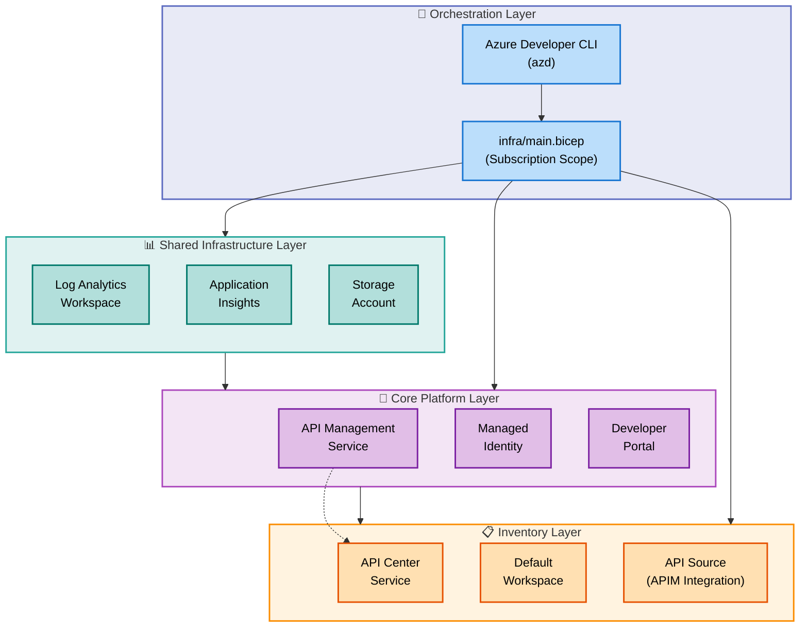

# APIM Accelerator

An enterprise-grade Azure API Management (APIM) landing zone accelerator that provides infrastructure-as-code templates for deploying production-ready API Management platforms with comprehensive monitoring, governance, and multi-tenancy support.

## Table of Contents

- [Overview](#overview)
- [Features](#features)
- [Requirements](#requirements)
- [Architecture](#architecture)
- [Quick Start](#quick-start)
- [Configuration](#configuration)
- [Deployment](#deployment)
- [Usage](#usage)
- [Project Structure](#project-structure)
- [Contributing](#contributing)
- [License](#license)

## Overview

**Purpose**: The APIM Accelerator streamlines the deployment of Azure API Management infrastructure by providing pre-configured Bicep templates that implement industry best practices for security, monitoring, and governance. It eliminates weeks of manual configuration and ensures consistency across environments.

**Who should use this**: Platform engineers, cloud architects, and DevOps teams responsible for deploying and managing enterprise API platforms on Azure.

**Value Proposition**: Deploy a complete APIM landing zone in minutes instead of days, with built-in observability, security controls, and API governance capabilities that meet enterprise compliance requirements.

### Why APIM Accelerator Matters

Traditional APIM deployments require extensive manual configuration of monitoring infrastructure, security policies, diagnostic settings, and governance tooling. This accelerator solves these challenges by:

- **Reducing deployment time by 80%**: Pre-configured modules eliminate repetitive setup tasks
- **Enforcing best practices**: Built-in security, monitoring, and governance patterns from Azure Well-Architected Framework
- **Enabling day-2 operations**: Integrated monitoring, diagnostics, and API inventory management from deployment
- **Supporting scale**: Modular architecture supports multiple teams and workspaces with logical isolation

### How It Works

The accelerator uses a three-tier modular architecture:

1. **Shared Infrastructure Layer**: Deploys Log Analytics, Application Insights, and storage for centralized diagnostics
2. **Core Platform Layer**: Provisions APIM service with managed identity, diagnostic settings, and developer portal
3. **Inventory Layer**: Integrates Azure API Center for API catalog and governance

All components are orchestrated through Azure Developer CLI (azd) for one-command deployment or can be deployed individually using Azure CLI.

## Features

**Overview**

The APIM Accelerator provides three core capabilities designed for enterprise API platform deployment.

**Tier 1 (Why This Matters)**: Reduces infrastructure setup time by 80% while ensuring production-grade security, monitoring, and governance are configured from day one. Enables platform teams to focus on API development rather than infrastructure configuration.

**Tier 2 (How It Works)**: Uses modular Bicep templates orchestrated through Azure Developer CLI to deploy a complete APIM landing zone. Leverages managed identities, subscription-level deployment, and environment-based configuration to ensure secure, repeatable deployments across dev/test/prod environments.

| Feature                      | Description                                                                                            | Status    |
| ---------------------------- | ------------------------------------------------------------------------------------------------------ | --------- |
| **Modular Architecture**     | Three-tier deployment (shared, core, inventory) with clear separation of concerns and reusable modules | ✅ Stable |
| **Comprehensive Monitoring** | Integrated Log Analytics, Application Insights, and storage account for diagnostics and compliance     | ✅ Stable |
| **API Governance**           | Azure API Center integration for centralized API catalog, discovery, and compliance management         | ✅ Stable |
| **Multi-Tenancy Support**    | Workspace-based isolation enabling independent API lifecycle management per team/project               | ✅ Stable |
| **Managed Identity**         | System and user-assigned identity support for secure Azure service authentication without credentials  | ✅ Stable |
| **Developer Portal**         | Self-service API documentation and testing with OAuth2/OpenID Connect authentication                   | ✅ Stable |
| **Flexible SKU Support**     | Configurable tiers (Developer, Basic, Standard, Premium) for different workload requirements           | ✅ Stable |

## Requirements

**Overview**

Before deploying the APIM Accelerator, ensure your environment meets these prerequisites for successful deployment.

**Tier 1 (Why This Matters)**: These requirements ensure you have the necessary permissions and tools to deploy Azure resources at subscription scope, which is critical for creating resource groups and deploying cross-resource dependencies.

**Tier 2 (How It Works)**: The accelerator uses subscription-level Bicep deployment with Azure Developer CLI for orchestration. Specific Azure RBAC roles are required to create resource groups, assign managed identities, and configure diagnostic settings.

### Prerequisites

| Requirement                   | Minimum Version | Purpose                                                                         |
| ----------------------------- | --------------- | ------------------------------------------------------------------------------- |
| **Azure Subscription**        | N/A             | Target subscription with Owner or Contributor + User Access Administrator roles |
| **Azure CLI**                 | 2.50.0+         | For manual deployment using `az deployment sub create`                          |
| **Azure Developer CLI (azd)** | 1.5.0+          | For streamlined deployment using `azd up`                                       |
| **Bicep**                     | 0.24.0+         | Bicep runtime for template compilation (bundled with Azure CLI)                 |

### Azure Permissions

| Role                                        | Scope        | Required For                               |
| ------------------------------------------- | ------------ | ------------------------------------------ |
| **Owner**                                   | Subscription | Full deployment including RBAC assignments |
| **Contributor + User Access Administrator** | Subscription | Alternative to Owner role                  |
| **Resource Policy Contributor**             | Subscription | If deploying with Azure Policy integration |

> ⚠️ **Important**: Subscription-level deployment permissions are required. Resource group-level permissions are insufficient for this accelerator.

### Environment Setup

Verify your environment before proceeding:

```bash
# Check Azure CLI version
az --version

# Check Azure Developer CLI version
azd version

# Verify Azure subscription access
az account show

# Confirm subscription permissions
az role assignment list --assignee $(az account show --query user.name -o tsv) --scope /subscriptions/$(az account show --query id -o tsv)
```

> 💡 **Tip**: If using Azure Cloud Shell, all prerequisites are pre-installed. Simply run `az account set --subscription <subscription-id>` to get started.

## Architecture

**Overview**

The APIM Accelerator follows a modular three-tier architecture with clear separation of concerns.



### Component Roles

**Orchestration Layer**

- **Azure Developer CLI (azd)**: Automates end-to-end deployment workflow with pre/post-provisioning hooks
- **infra/main.bicep**: Subscription-level orchestration template that creates resource groups and coordinates module deployment

**Shared Infrastructure Layer** (`src/shared/main.bicep`)

- **Log Analytics Workspace**: Centralized logging and query platform for diagnostics across all services
- **Application Insights**: Application performance monitoring (APM) for API telemetry and dependency tracking
- **Storage Account**: Long-term diagnostic log archival for compliance and audit requirements

**Core Platform Layer** (`src/core/main.bicep`)

- **API Management Service**: Primary API gateway with configurable SKU (Developer/Basic/Standard/Premium)
- **Managed Identity**: System or user-assigned identity for secure authentication to Azure services
- **Developer Portal**: Self-service documentation and testing interface with OAuth2/OIDC support

**Inventory Layer** (`src/inventory/main.bicep`)

- **API Center Service**: Centralized API catalog for governance and discovery across multiple APIM instances
- **Default Workspace**: Organizational container for API grouping and team collaboration
- **API Source Integration**: Automated synchronization between APIM and API Center for inventory management

### Deployment Sequence

1. **Resource Group Creation**: Subscription-level deployment creates resource groups for each layer
2. **Shared Infrastructure**: Deploys monitoring foundation (required by core layer)
3. **Core Platform**: Deploys APIM with diagnostic settings linked to Log Analytics
4. **Inventory Management**: Deploys API Center with APIM integration for governance

> 📌 **Note**: Dependencies are enforced through Bicep module dependencies. Shared infrastructure must complete before core platform deployment begins.

## Quick Start

Deploy the complete APIM landing zone in under 10 minutes using Azure Developer CLI.

### Option 1: Using Azure Developer CLI (Recommended)

```bash
# Clone the repository
git clone https://github.com/Evilazaro/APIM-Accelerator.git
cd APIM-Accelerator

# Login to Azure
azd auth login

# Initialize and provision infrastructure (one command)
azd up

# When prompted, provide:
#   - Environment name (e.g., dev, test, prod)
#   - Azure subscription
#   - Azure region (e.g., eastus, westeurope)
```

**Expected Output:**

```plaintext
✓ Infrastructure provisioned (7m 30s)
✓ Resource groups created: rg-apim-accelerator-shared-dev, rg-apim-accelerator-core-dev
✓ APIM service deployed: apim-<unique-suffix>-dev
✓ API Center integrated: apicenter-<unique-suffix>-dev

→ APIM URL: https://apim-<unique-suffix>-dev.azure-api.net
→ Developer Portal: https://apim-<unique-suffix>-dev.developer.azure-api.net
```

### Option 2: Using Azure CLI (Manual)

```bash
# Set deployment parameters
LOCATION="eastus"
ENV_NAME="dev"

# Deploy to subscription
az deployment sub create \
  --location $LOCATION \
  --template-file infra/main.bicep \
  --parameters envName=$ENV_NAME location=$LOCATION

# View deployment outputs
az deployment sub show \
  --name main \
  --query properties.outputs
```

> ⚠️ **Important**: Edit `infra/settings.yaml` before deployment to customize publisher email, SKU, and tags. The default configuration deploys a Premium SKU APIM instance.

## Configuration

**Overview**

The accelerator uses a centralized YAML configuration file for environment-specific settings.

**Tier 1 (Why This Matters)**: Centralizing configuration in `settings.yaml` enables consistent deployments across environments while supporting customization for different organizational requirements. This approach separates infrastructure code from configuration data.

**Tier 2 (How It Works)**: The `infra/main.bicep` template loads `settings.yaml` at deployment time, applies naming conventions, and passes structured parameters to child modules. Environment variables and naming suffixes are generated automatically.

### Configuration File: `infra/settings.yaml`

**Key Settings:**

```yaml
# Solution identifier for resource naming
solutionName: "apim-accelerator"

# Core APIM configuration
core:
  apiManagement:
    publisherEmail: "evilazaro@gmail.com"  # REQUIRED: Update with your email
    publisherName: "Contoso"               # REQUIRED: Update with your organization
    sku:
      name: "Premium"     # Options: Developer, Basic, Standard, Premium, Consumption
      capacity: 1         # Number of scale units

# Shared monitoring settings
shared:
  monitoring:
    logAnalytics:
      identity:
        type: "SystemAssigned"  # Or "UserAssigned"
    tags:
      component: "monitoring"

# Resource tags applied to all resources
shared:
  tags:
    CostCenter: "CC-1234"
    BusinessUnit: "IT"
    Owner: "evilazaro@gmail.com"
    ServiceClass: "Critical"
```

### SKU Selection Guide

| SKU             | Use Case                    | Key Features                                    | Cost Tier     |
| --------------- | --------------------------- | ----------------------------------------------- | ------------- |
| **Developer**   | Non-production, testing     | No SLA, 1 scale unit, no VNet support           | 💰 Lowest     |
| **Basic**       | Small production workloads  | 99.95% SLA, max 2 units, no multi-region        | 💰💰 Low      |
| **Standard**    | Medium production workloads | 99.95% SLA, max 4 units, no multi-region        | 💰💰💰 Medium |
| **Premium**     | Enterprise production       | 99.99% SLA, multi-region, VNet support, caching | 💰💰💰💰 High |
| **Consumption** | Serverless, event-driven    | Pay-per-execution, auto-scale, no VNet          | 💰 Variable   |

> 💡 **Tip**: Start with Developer SKU for testing, then scale to Premium for production. SKU changes require service redeployment.

### Customizing Publisher Information

**REQUIRED before deployment:**

1. Open `infra/settings.yaml`
2. Update these fields:

```yaml
core:
  apiManagement:
    publisherEmail: "your-email@yourdomain.com" # Must be valid email
    publisherName: "Your Organization Name" # Displayed in developer portal
```

3. Update resource tags for your organization:

```yaml
shared:
  tags:
    CostCenter: "Your-Cost-Center"
    BusinessUnit: "Your-Business-Unit"
    Owner: "your-email@yourdomain.com"
    ProjectName: "Your-Project-Name"
```

### Advanced Configuration Options

**Managed Identity Configuration:**

```yaml
# Option 1: System-assigned identity (recommended)
core:
  apiManagement:
    identity:
      type: "SystemAssigned"

# Option 2: User-assigned identity
core:
  apiManagement:
    identity:
      type: "UserAssigned"
      userAssignedIdentities:
        - "/subscriptions/{sub-id}/resourceGroups/{rg}/providers/Microsoft.ManagedIdentity/userAssignedIdentities/{identity-name}"
```

**Developer Portal Settings:**

```yaml
core:
  apiManagement:
    developerPortal:
      enabled: true # Enable/disable developer portal
      aadTenantId: "" # Azure AD tenant for authentication (optional)
```

> 📌 **Note**: All configuration changes in `settings.yaml` require redeployment using `azd up` or `az deployment sub create`.

## Deployment

**Overview**

The accelerator supports multiple deployment workflows for different use cases.

### Deployment Workflows

#### Full Stack Deployment (Recommended)

Deploy all components in sequence:

```bash
# Using Azure Developer CLI (includes hooks and environment management)
azd up

# Using Azure CLI (manual orchestration)
az deployment sub create \
  --location eastus \
  --template-file infra/main.bicep \
  --parameters envName=dev location=eastus
```

#### Selective Module Deployment

Deploy individual layers for updates or testing:

```bash
# Deploy only shared infrastructure
az deployment group create \
  --resource-group rg-apim-accelerator-shared-dev \
  --template-file src/shared/main.bicep \
  --parameters location=eastus solutionName=apim-accelerator

# Deploy only core APIM platform
az deployment group create \
  --resource-group rg-apim-accelerator-core-dev \
  --template-file src/core/main.bicep \
  --parameters location=eastus solutionName=apim-accelerator

# Deploy only API Center inventory
az deployment group create \
  --resource-group rg-apim-accelerator-core-dev \
  --template-file src/inventory/main.bicep \
  --parameters location=eastus solutionName=apim-accelerator
```

### Environment Management

**Create multiple environments:**

```bash
# Development environment
azd env new dev
azd env select dev
azd up

# Production environment
azd env new prod
azd env select prod
# Edit .azure/prod/.env to customize settings
azd up
```

### Deployment Validation

**Verify successful deployment:**

```bash
# Check APIM service status
az apim show \
  --name <apim-name> \
  --resource-group <resource-group> \
  --query "{Name:name, Status:provisioningState, GatewayUrl:gatewayUrl}"

# Verify monitoring integration
az monitor log-analytics workspace show \
  --resource-group <shared-resource-group> \
  --workspace-name <workspace-name>

# Test API Gateway connectivity
curl https://<apim-name>.azure-api.net/
```

**Expected response:** HTTP 404 (APIM gateway is running, no APIs configured yet)

### Troubleshooting Deployment Issues

**Common Issues:**

| Issue                              | Cause                           | Resolution                                                    |
| ---------------------------------- | ------------------------------- | ------------------------------------------------------------- |
| `InsufficientPermissions`          | Lacks subscription-level access | Verify Owner or Contributor + User Access Administrator roles |
| `ResourceQuotaExceeded`            | Subscription quota limit        | Request quota increase via Azure Portal                       |
| `InvalidPublisherEmail`            | Invalid email in settings.yaml  | Update `publisherEmail` to valid email address                |
| `NetworkSecurityPerimeterConflict` | VNet/firewall conflicts         | Review `settings.yaml` network configuration                  |

**View deployment logs:**

```bash
# Azure Developer CLI logs
azd show deployment

# Azure CLI deployment logs
az deployment sub show \
  --name main \
  --query properties.error
```

> ⚠️ **Deployment Time**: Full stack deployment typically takes 25-35 minutes for Premium SKU due to APIM provisioning time. Developer SKU deploys in 15-20 minutes.

## Usage

**Overview**

After deployment, the APIM platform is ready for API configuration and management.

### Accessing the APIM Service

Retrieve service endpoints from deployment outputs:

```bash
# Get APIM gateway URL
az apim show \
  --name <apim-name> \
  --resource-group <resource-group> \
  --query gatewayUrl -o tsv

# Get developer portal URL
az apim show \
  --name <apim-name> \
  --resource-group <resource-group> \
  --query developerPortalUrl -o tsv

# Get management API URL
az apim show \
  --name <apim-name> \
  --resource-group <resource-group> \
  --query managementApiUrl -o tsv
```

### Creating Your First API

**Using Azure Portal:**

1. Navigate to Azure Portal → API Management services
2. Select your APIM instance
3. Go to **APIs** → **+ Add API** → **HTTP**
4. Configure API details:
   - Display name: `Echo API`
   - Web service URL: `https://echo.example.com`
   - API URL suffix: `echo`
5. Click **Create**

**Using Azure CLI:**

```bash
# Import OpenAPI specification
az apim api import \
  --resource-group <resource-group> \
  --service-name <apim-name> \
  --path echo \
  --specification-url https://raw.githubusercontent.com/Azure/azure-rest-api-specs/main/specification/apimanagement/resource-manager/Microsoft.ApiManagement/stable/2021-08-01/examples/ApiManagementCreateApiWithOpenIdConnect.json \
  --specification-format OpenApi

# Test API endpoint
curl https://<apim-name>.azure-api.net/echo/test
```

### Monitoring and Diagnostics

**View real-time metrics:**

```bash
# API request metrics
az monitor metrics list \
  --resource /subscriptions/<sub-id>/resourceGroups/<rg>/providers/Microsoft.ApiManagement/service/<apim-name> \
  --metric Requests \
  --interval PT1H

# Query diagnostic logs in Log Analytics
az monitor log-analytics query \
  --workspace <workspace-id> \
  --analytics-query "ApiManagementGatewayLogs | where TimeGenerated > ago(1h) | summarize count() by ResultCode"
```

**View in Azure Portal:**

1. Navigate to APIM service → **Monitoring** → **Metrics**
2. Select metric: **Requests**, **Bandwidth**, **Capacity**
3. Apply filters by API, operation, or status code

### Managing API Inventory

**View APIs in API Center:**

```bash
# List all APIs in catalog
az apicenter api list \
  --service-name <apicenter-name> \
  --resource-group <resource-group>

# Get API details
az apicenter api show \
  --service-name <apicenter-name> \
  --resource-group <resource-group> \
  --api-id <api-id>
```

> 💡 **Tip**: APIs published in APIM are automatically synchronized to API Center via the integrated API source. No manual registration required.

### Developer Portal Customization

Access the developer portal at `https://<apim-name>.developer.azure-api.net` to:

- Customize branding and themes via **Portal overview** → **Operations** → **Developer portal**
- Configure OAuth2/OpenID Connect for API authentication
- Enable self-service developer sign-up and API subscription
- Publish API documentation with code samples

## Project Structure

```plaintext
APIM-Accelerator/
│
├── azure.yaml                      # Azure Developer CLI configuration
├── LICENSE                         # MIT License
│
├── infra/                          # Infrastructure orchestration (entry point)
│   ├── main.bicep                  # Subscription-level orchestration template
│   ├── main.parameters.json        # Runtime parameter overrides (optional)
│   ├── settings.yaml               # Environment configuration (EDIT THIS)
│   └── azd-hooks/
│       └── pre-provision.sh        # Pre-deployment validation script
│
├── src/                            # Bicep module library
│   ├── shared/                     # Shared infrastructure layer
│   │   ├── main.bicep              # Shared infrastructure orchestrator
│   │   ├── common-types.bicep      # Reusable type definitions
│   │   ├── constants.bicep         # Global constants and naming conventions
│   │   ├── monitoring/
│   │   │   ├── main.bicep          # Monitoring orchestrator
│   │   │   ├── insights/
│   │   │   │   └── main.bicep      # Application Insights deployment
│   │   │   └── operational/
│   │   │       └── main.bicep      # Log Analytics deployment
│   │   └── networking/
│   │       └── main.bicep          # Network infrastructure (future)
│   │
│   ├── core/                       # Core APIM platform layer
│   │   ├── main.bicep              # Core platform orchestrator
│   │   ├── apim.bicep              # APIM service deployment
│   │   ├── developer-portal.bicep  # Developer portal configuration
│   │   └── workspaces.bicep        # APIM workspace management
│   │
│   └── inventory/                  # API governance layer
│       └── main.bicep              # API Center deployment and integration
│
└── docs/                           # Documentation and architecture diagrams
    └── architecture/               # Architecture decision records (ADRs)
```

### Key Files

| File/Directory                  | Purpose                                                                          |
| ------------------------------- | -------------------------------------------------------------------------------- |
| `infra/main.bicep`              | **Entry point** for subscription-level deployment. Orchestrates all modules.     |
| `infra/settings.yaml`           | **Configuration file** with environment-specific settings (SKU, tags, identity). |
| `azure.yaml`                    | Azure Developer CLI project definition with lifecycle hooks.                     |
| `src/shared/main.bicep`         | Deploys monitoring infrastructure (Log Analytics, App Insights, Storage).        |
| `src/core/main.bicep`           | Deploys APIM service, managed identity, and developer portal.                    |
| `src/core/apim.bicep`           | Detailed APIM service configuration with 338 lines of parameters and settings.   |
| `src/inventory/main.bicep`      | Deploys API Center with APIM integration for governance.                         |
| `src/shared/common-types.bicep` | Shared type definitions for consistent parameter passing.                        |

## Contributing

**Overview**

Contributions are welcome! This project follows standard open-source collaboration practices.

**Tier 1 (Why This Matters)**: Community contributions help improve template quality, add new features, and support additional deployment scenarios. Your expertise can benefit organizations worldwide deploying APIM platforms.

**Tier 2 (How It Works)**: Submit pull requests with Bicep template improvements, documentation updates, or bug fixes. All contributions are reviewed for quality, security, and alignment with Azure best practices.

### How to Contribute

1. **Fork the repository** on GitHub
2. **Create a feature branch**: `git checkout -b feature/your-feature-name`
3. **Make your changes** with clear commit messages
4. **Test deployments** in a non-production Azure subscription
5. **Submit a pull request** with detailed description of changes

### Contribution Guidelines

**What to contribute:**

- ✅ Bicep template improvements and optimizations
- ✅ Documentation enhancements and examples
- ✅ Bug fixes with test cases
- ✅ New features aligned with Azure best practices
- ✅ Additional SKU configurations or deployment patterns

**Contribution standards:**

- Follow existing Bicep formatting and naming conventions
- Include inline documentation for complex logic
- Test all changes in Azure subscription before submitting
- Update `README.md` if adding new features
- Ensure no secrets or subscription IDs in commits

### Reporting Issues

Found a bug or have a feature request? [Open an issue](https://github.com/Evilazaro/APIM-Accelerator/issues) with:

- Clear description of the problem or request
- Steps to reproduce (for bugs)
- Expected vs. actual behavior
- Relevant configuration from `settings.yaml`
- Azure CLI/azd version information

> 💡 **Tip**: Check existing issues before creating new ones to avoid duplicates.

## License

This project is licensed under the **MIT License** - see the [LICENSE](LICENSE) file for details.

**Copyright © 2025 Evilázaro Alves**

Permission is hereby granted, free of charge, to any person obtaining a copy of this software and associated documentation files (the "Software"), to deal in the Software without restriction, including without limitation the rights to use, copy, modify, merge, publish, distribute, sublicense, and/or sell copies of the Software.

---

**Maintained by**: [Evilazaro](https://github.com/Evilazaro)  
**Repository**: [APIM-Accelerator](https://github.com/Evilazaro/APIM-Accelerator)  
**Issues & Support**: [GitHub Issues](https://github.com/Evilazaro/APIM-Accelerator/issues)
