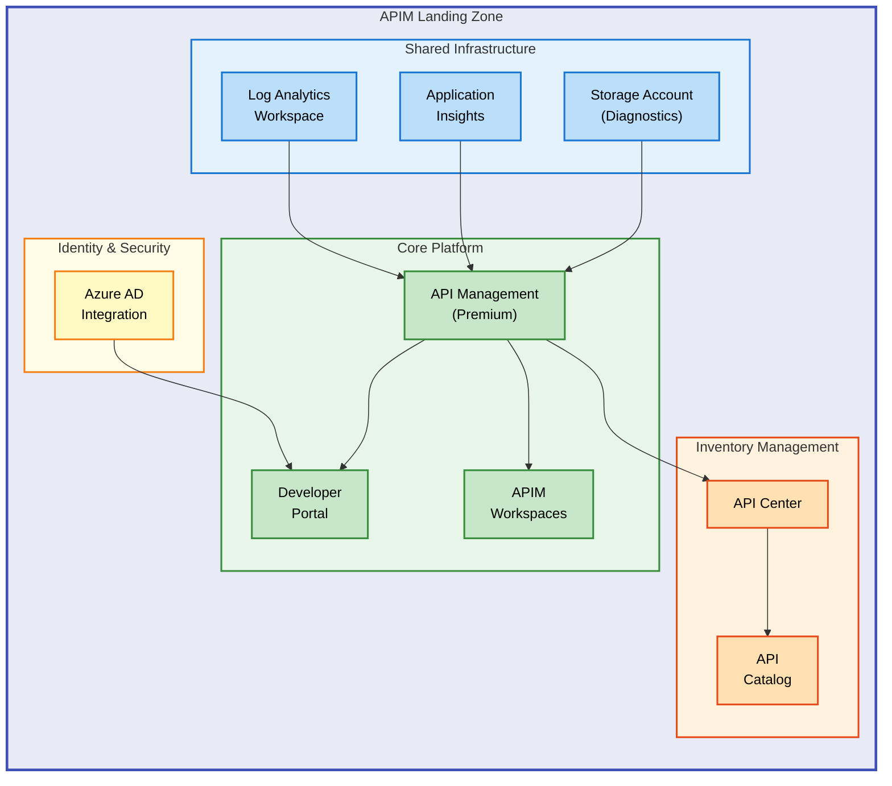
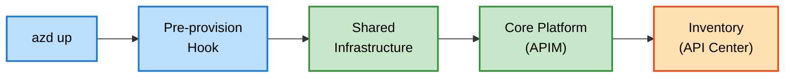

# APIM Accelerator


Deploy a complete Azure API Management landing zone with enterprise-grade monitoring, governance, and multi-team support using **Azure Developer CLI (azd)** and **Bicep infrastructure-as-code**.

**Overview**

The APIM Accelerator provides a **production-ready foundation** for organizations adopting Azure API Management as their centralized API gateway. This accelerator addresses the complexity of deploying enterprise API infrastructure by automating the provisioning of interconnected Azure services through a **single `azd up` command**, reducing deployment time from days to minutes while ensuring consistent, repeatable infrastructure.

Built on **Azure Landing Zone principles**, this solution integrates API Management with Azure API Center for governance, Application Insights for observability, and Log Analytics for centralized diagnostics. The modular Bicep architecture enables teams to customize configurations through a **single YAML settings file**, supporting environments from development through production without modifying infrastructure code.

This accelerator targets platform engineers, cloud architects, and DevOps teams responsible for establishing API-first architectures. It provides the infrastructure foundation that API developers need to publish, secure, and monitor APIs while maintaining organizational governance and compliance requirements.

## Table of Contents

- [Architecture](#-architecture)
- [Features](#-features)
- [Requirements](#-requirements)
- [Quick Start](#-quick-start)
- [Deployment](#-deployment)
- [Usage](#-usage)
- [Configuration](#-configuration)
- [Contributing](#-contributing)
- [License](#-license)

## 🏗️ Architecture

**Overview**

The APIM Accelerator implements a **three-tier modular architecture** that separates shared services, core platform, and inventory management into independent deployment units. This separation enables teams to customize, extend, or replace individual components while maintaining a cohesive landing zone structure that follows **Azure Well-Architected Framework** principles.

> 📌 **Deployment Order**: Monitoring infrastructure deploys first → API Management service → API Center integration. This sequencing ensures dependencies resolve correctly.

The orchestration layer coordinates deployment sequencing to ensure dependencies resolve correctly—monitoring infrastructure deploys first, followed by the API Management service that consumes those monitoring endpoints, and finally the API Center integration that references the APIM service. This layered approach enables **incremental adoption** and simplifies troubleshooting by isolating concerns into discrete modules.



## ✨ Features

**Overview**

The APIM Accelerator delivers enterprise capabilities through carefully integrated Azure services that work together as a cohesive platform. These features address common challenges in API platform adoption: **centralized governance**, **multi-team isolation**, **comprehensive observability**, and **secure developer access**. Each feature maps directly to Azure Well-Architected Framework pillars, ensuring production-grade reliability, security, and operational excellence.

The modular design allows teams to enable or customize features based on organizational requirements. **Premium-tier API Management** unlocks advanced scenarios like VNet integration and multi-region deployment, while the **workspace pattern** enables cost-effective multi-tenancy within a single APIM instance.

| Feature                          | Description                                                                                        | Benefits                                                                                                       |
| -------------------------------- | -------------------------------------------------------------------------------------------------- | -------------------------------------------------------------------------------------------------------------- |
| 🚀 **One-Command Deployment**    | Complete landing zone provisioning via `azd up` with pre-configured Bicep modules                  | Reduces deployment complexity from days to minutes; ensures consistent, repeatable infrastructure              |
| 🏢 **Multi-Team Workspaces**     | APIM Workspaces provide logical isolation for different teams or projects within a single instance | Cost-effective multi-tenancy; independent API lifecycle management; shared infrastructure with team separation |
| 📊 **Integrated Observability**  | Log Analytics, Application Insights, and diagnostic storage deployed as foundational services      | Centralized logging and APM; compliance-ready log retention; end-to-end request tracing                        |
| 🔐 **Azure AD Developer Portal** | Pre-configured developer portal with Azure AD authentication and CORS settings                     | Secure self-service API discovery; organizational SSO; customizable branding                                   |
| 📚 **API Governance**            | Azure API Center integration for centralized API catalog and governance                            | Automatic API discovery; metadata management; compliance and lifecycle tracking                                |
| ⚙️ **Configuration-Driven**      | Single `settings.yaml` file controls all environment-specific parameters                           | Environment promotion without code changes; separation of configuration from infrastructure                    |
| 🏷️ **Enterprise Tagging**        | Comprehensive tag taxonomy for cost allocation, compliance, and governance                         | FinOps chargeback; regulatory compliance tracking; resource ownership visibility                               |

## 📋 Requirements

**Overview**

Deploying the APIM Accelerator requires specific **Azure permissions**, **tooling**, and **service quotas** to ensure successful provisioning. The **Premium SKU requirement** enables advanced features like workspaces and VNet integration, though it represents a significant cost commitment that should be evaluated against organizational needs. Development and testing scenarios may use Developer SKU by modifying the configuration.

Understanding these prerequisites prevents deployment failures and ensures teams can plan for necessary approvals, quota increases, or Azure AD app registrations before initiating deployment.

> ⚠️ **Important**: API Management Premium tier is required for workspace functionality and carries significant hourly costs. Review [Azure API Management pricing](https://azure.microsoft.com/pricing/details/api-management/) before deployment.

| Category                      | Requirements                                             | More Information                                                                                                |
| ----------------------------- | -------------------------------------------------------- | --------------------------------------------------------------------------------------------------------------- |
| **Azure Subscription**        | Active subscription with Contributor or Owner role       | [Azure RBAC](https://learn.microsoft.com/azure/role-based-access-control/)                                      |
| **Azure CLI**                 | Version 2.50.0 or later                                  | [Install Azure CLI](https://learn.microsoft.com/cli/azure/install-azure-cli)                                    |
| **Azure Developer CLI**       | Version 1.5.0 or later (azd)                             | [Install azd](https://learn.microsoft.com/azure/developer/azure-developer-cli/install-azd)                      |
| **API Management Quota**      | Sufficient quota for Premium SKU in target region        | [Request quota increase](https://learn.microsoft.com/azure/azure-portal/supportability/regional-quota-requests) |
| **Azure AD App Registration** | Client ID and secret for developer portal authentication | [Register an app](https://learn.microsoft.com/azure/active-directory/develop/quickstart-register-app)           |
| **Shell Environment**         | Bash (Linux/macOS/WSL) for pre-provision hooks           | [WSL Installation](https://learn.microsoft.com/windows/wsl/install)                                             |

## 🚀 Quick Start

**Overview**

The fastest path to a running APIM landing zone requires **three commands**: authenticate, initialize, and deploy. The Azure Developer CLI handles orchestration, executing **pre-provision hooks to clean soft-deleted resources**, then deploying infrastructure modules in dependency order. Within **30-45 minutes**, you'll have a complete API Management platform with monitoring, governance, and developer portal capabilities.

```bash
# Authenticate to Azure
az login

# Initialize azd environment
azd init

# Deploy complete landing zone
azd up
```

> 💡 **Tip**: Run `azd up --environment dev` to create a named environment for easy management of multiple deployments.

## 📦 Deployment

**Overview**

Deployment follows Azure Developer CLI conventions with environment-based configuration. The **pre-provision hook automatically purges soft-deleted APIM instances** to prevent naming conflicts, enabling clean redeployment cycles. The Bicep modules deploy at **subscription scope**, creating resource groups and coordinating resource deployment through module dependencies.

> 💡 **Tip**: Failed deployments can be restarted without duplicating resources—**Bicep templates are idempotent**.

Step-by-step deployment ensures each component provisions correctly before dependent services begin.



### Step 1: Clone Repository

```bash
git clone https://github.com/Evilazaro/APIM-Accelerator.git
cd APIM-Accelerator
```

### Step 2: Authenticate

```bash
# Login to Azure
az login

# Set target subscription
az account set --subscription "<subscription-id>"
```

### Step 3: Configure Environment

Edit `infra/settings.yaml` to customize your deployment:

```yaml
# Solution name (used for resource naming)
solutionName: "apim-accelerator"

# Core API Management settings
core:
  apiManagement:
    publisherEmail: "your-email@domain.com"
    publisherName: "Your Organization"
    sku:
      name: "Premium" # Required for workspaces
      capacity: 1
```

### Step 4: Deploy

```bash
# Initialize azd (first time only)
azd init

# Deploy to Azure
azd up --environment <env-name> --location <azure-region>
```

### Step 5: Verify Deployment

```bash
# Check deployment status
az deployment sub list --query "[?contains(name,'apim')]" -o table

# Get APIM gateway URL
az apim show --name <apim-name> --resource-group <rg-name> --query "gatewayUrl" -o tsv
```

## 💻 Usage

**Overview**

After deployment, the APIM landing zone provides multiple interaction points: the Azure portal for visual management, Azure CLI for scripted operations, and the developer portal for API discovery and testing. Each **workspace operates as an isolated environment** where teams can manage their APIs independently while sharing underlying infrastructure.

### Access Developer Portal

Navigate to your APIM service in the Azure portal and select **Developer portal** from the overview blade. Users authenticate via Azure AD using credentials configured during deployment.

### Create an API

```bash
# Import an API from OpenAPI specification
az apim api import \
  --resource-group <resource-group> \
  --service-name <apim-name> \
  --path "petstore" \
  --specification-url "https://petstore.swagger.io/v2/swagger.json" \
  --specification-format OpenApi
```

### View API Inventory

```bash
# List APIs registered in API Center
az apic api list \
  --resource-group <resource-group> \
  --service-name <apicenter-name> \
  --output table
```

## 🔧 Configuration

**Overview**

The APIM Accelerator uses a **centralized configuration approach** through `infra/settings.yaml`, enabling environment-specific customization without modifying Bicep templates. This pattern supports **GitOps workflows** where configuration changes are version-controlled and promoted through environments. The settings file defines resource naming, SKU selections, identity configuration, and tagging strategies.

> 📌 **Key File**: All environment-specific parameters are controlled via **`infra/settings.yaml`**—no infrastructure code changes required for environment promotion.

Understanding the configuration structure enables teams to adapt the accelerator to organizational naming conventions, cost centers, and compliance requirements while maintaining upgrade compatibility with future accelerator versions.

### Configuration File Structure

The `infra/settings.yaml` file contains three main sections:

```yaml
# Solution name - prefix for all resources
solutionName: "apim-accelerator"

# Shared services (monitoring infrastructure)
shared:
  monitoring:
    logAnalytics:
      name: "" # Leave empty for auto-generation
      identity:
        type: "SystemAssigned"
    applicationInsights:
      name: "" # Leave empty for auto-generation
  tags:
    CostCenter: "CC-1234"
    BusinessUnit: "IT"
    Owner: "owner@domain.com"

# Core platform (API Management)
core:
  apiManagement:
    publisherEmail: "api-admin@domain.com"
    publisherName: "Organization Name"
    sku:
      name: "Premium"
      capacity: 1
    workspaces:
      - name: "workspace1"

# Inventory (API Center)
inventory:
  apiCenter:
    name: "" # Leave empty for auto-generation
    identity:
      type: "SystemAssigned"
```

### Environment Variables

The following environment variables influence deployment:

| Variable                | Description                        | Default                     |
| ----------------------- | ---------------------------------- | --------------------------- |
| `AZURE_LOCATION`        | Target Azure region                | Required at deploy time     |
| `AZURE_SUBSCRIPTION_ID` | Target subscription                | Current az CLI subscription |
| `AZURE_ENV_NAME`        | Environment name (dev, test, prod) | Required at deploy time     |

### Azure AD Configuration

For developer portal authentication, configure the allowed tenants in `src/core/developer-portal.bicep`:

```bicep
var allowedTenants = [
  'yourtenant.onmicrosoft.com'
]
```

## 🤝 Contributing

**Overview**

Contributions to the APIM Accelerator strengthen the platform for all users. Whether fixing bugs, improving documentation, or adding features, community involvement drives the accelerator's evolution. The modular architecture enables focused contributions—you can enhance a single Bicep module without understanding the entire codebase.

We follow standard GitHub workflows with pull requests, code review, and automated validation. Contributors **MUST ensure changes maintain backward compatibility** with existing deployments and include appropriate documentation updates.

### How to Contribute

1. Fork the repository
2. Create a feature branch: `git checkout -b feature/your-feature`
3. Make your changes following existing code patterns
4. Test deployment in a development environment
5. Submit a pull request with a clear description

### Development Guidelines

- Follow [Bicep best practices](https://learn.microsoft.com/azure/azure-resource-manager/bicep/best-practices)
- Include comprehensive comments in Bicep modules
- Update `settings.yaml` schema when adding new parameters
- Test deployments in isolated subscriptions before submitting PRs

## 📝 License

This project is licensed under the MIT License - see the [LICENSE](LICENSE) file for details.

Copyright (c) 2025 Evilázaro Alves
