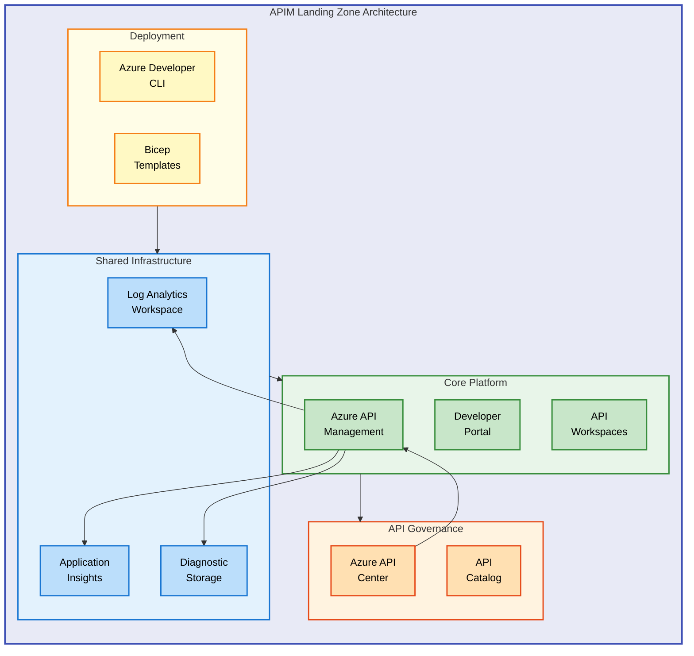

# APIM Accelerator


An enterprise-ready Azure Landing Zone accelerator that deploys a complete API Management platform with centralized governance, monitoring, and multi-team workspace isolation using Infrastructure-as-Code.

**Overview**

The APIM Accelerator provides organizations with a production-ready foundation for deploying Azure API Management at scale. It addresses the common challenges of API governance, team isolation, and operational visibility by combining API Management with API Center for catalog management and a comprehensive monitoring stack. This accelerator is designed for platform engineering teams, cloud architects, and DevOps engineers who need to establish a standardized API platform quickly.

The solution follows Azure Landing Zone principles, deploying resources in a hierarchical structure that enables both centralized governance and distributed team ownership. By leveraging Azure Developer CLI (azd), teams can provision the entire infrastructure with a single command while maintaining full control over environment-specific configurations through YAML-based settings files.

## 📑 Table of Contents

- [Architecture](#-architecture)
- [Features](#-features)
- [Requirements](#-requirements)
- [Quick Start](#-quick-start)
- [Deployment](#-deployment)
- [Usage](#-usage)
- [Configuration](#-configuration)
- [Contributing](#-contributing)
- [License](#-license)

## 🏗️ Architecture

**Overview**

The APIM Accelerator implements a layered architecture that separates shared infrastructure, core API Management services, and API governance capabilities. This design enables independent scaling and management of each layer while maintaining integration through Azure's native service connections. The architecture supports both greenfield deployments and integration with existing Azure environments.

Each layer is deployed as a separate Bicep module, allowing teams to customize or extend individual components without affecting others. The deployment sequence ensures dependencies are resolved correctly, with shared monitoring infrastructure provisioned first, followed by the core APIM platform, and finally the API Center integration.



## ✨ Features

**Overview**

The APIM Accelerator delivers a comprehensive set of capabilities designed to accelerate API platform adoption while maintaining enterprise-grade security and governance. Each feature addresses specific operational challenges faced by organizations managing APIs at scale, from team isolation to centralized observability.

These features work together to provide a cohesive platform experience. The workspace-based isolation enables multiple teams to manage their APIs independently, while the centralized monitoring and API Center integration ensure platform-wide visibility and governance.

| Feature                       | Description                                                             | Benefits                                                                |
| ----------------------------- | ----------------------------------------------------------------------- | ----------------------------------------------------------------------- |
| 🏢 **Multi-Team Workspaces**  | Workspace-based API isolation within a single APIM instance             | Cost-effective team separation without deploying multiple APIM services |
| 📊 **Centralized Monitoring** | Log Analytics, Application Insights, and diagnostic storage integration | Unified observability across all API operations and performance metrics |
| 🔐 **Managed Identity**       | System-assigned or user-assigned identity support                       | Secure, credential-free authentication to Azure services                |
| 🌐 **Developer Portal**       | Azure AD-integrated self-service portal with OAuth2/OIDC                | Streamlined API discovery and onboarding for developers                 |
| 📚 **API Governance**         | Azure API Center integration for catalog and compliance                 | Centralized API inventory with automatic discovery from APIM            |
| ⚡ **One-Command Deployment** | Azure Developer CLI (azd) integration with lifecycle hooks              | Simplified provisioning with `azd up` command                           |

## 📋 Requirements

**Overview**

Before deploying the APIM Accelerator, ensure your environment meets the prerequisites listed below. These requirements exist to ensure successful deployment and optimal operation of the API Management platform. The Azure CLI and Azure Developer CLI are essential for infrastructure provisioning, while the subscription permissions ensure you can create and manage the required Azure resources.

Meeting these requirements upfront prevents deployment failures and ensures you have the necessary access levels for both initial setup and ongoing management.

| Category         | Requirements                                                   | More Information                                                                                                       |
| ---------------- | -------------------------------------------------------------- | ---------------------------------------------------------------------------------------------------------------------- |
| **Runtime**      | Azure CLI 2.50+, Azure Developer CLI (azd) 1.5+                | [Install Azure CLI](https://learn.microsoft.com/cli/azure/install-azure-cli)                                           |
| **Subscription** | Azure subscription with Contributor access                     | [Azure Subscriptions](https://learn.microsoft.com/azure/cost-management-billing/manage/create-subscription)            |
| **Permissions**  | Microsoft.ApiManagement/register, Microsoft.ApiCenter/register | [Resource Providers](https://learn.microsoft.com/azure/azure-resource-manager/management/resource-providers-and-types) |
| **Region**       | Azure region supporting API Management Premium tier            | [Products by Region](https://azure.microsoft.com/explore/global-infrastructure/products-by-region/)                    |

> ⚠️ **Prerequisites**: API Management Premium SKU requires region availability. Verify your target region supports Premium tier before deployment.

## 🚀 Quick Start

**Overview**

Get the APIM Accelerator running in your Azure subscription with minimal configuration. This quick start uses default settings suitable for development and testing environments. For production deployments, review the Configuration section to customize settings for your organization.

The Azure Developer CLI handles the complete provisioning workflow, including resource group creation, infrastructure deployment, and post-provisioning configuration.

```bash
# Clone the repository
git clone https://github.com/Evilazaro/APIM-Accelerator.git
cd APIM-Accelerator

# Authenticate with Azure
azd auth login

# Deploy with default settings
azd up
```

> 💡 **Tip**: Use `azd up --environment dev` to create a named environment for easier management of multiple deployments.

## 📦 Deployment

**Overview**

The APIM Accelerator supports multiple deployment strategies to accommodate different organizational requirements. Whether you need a simple development environment or a production-grade multi-region setup, the modular Bicep architecture allows you to customize the deployment scope and configuration.

The deployment process follows Azure Landing Zone principles, creating a resource group and deploying resources in a specific sequence to ensure dependencies are resolved correctly.

**Step 1: Clone and Configure**

```bash
git clone https://github.com/Evilazaro/APIM-Accelerator.git
cd APIM-Accelerator
```

**Step 2: Initialize Environment**

```bash
azd init
```

**Step 3: Configure Settings**

Edit `infra/settings.yaml` to customize your deployment:

```yaml
solutionName: "apim-accelerator"

core:
  apiManagement:
    publisherEmail: "api-admin@yourcompany.com"
    publisherName: "Your Organization"
    sku:
      name: "Premium"
      capacity: 1
```

**Step 4: Deploy Infrastructure**

```bash
azd provision
```

**Step 5: Verify Deployment**

```bash
az apim show --name <apim-name> --resource-group <resource-group>
```

> ℹ️ **Note**: Initial API Management deployment takes 30-45 minutes. The pre-provision hook automatically purges soft-deleted APIM instances to prevent naming conflicts.

## 💻 Usage

**Overview**

After deployment, you can interact with the APIM Accelerator through the Azure portal, Azure CLI, or directly via the deployed APIs. The platform provides multiple entry points depending on your role: developers use the self-service portal, administrators manage through the Azure portal, and automation pipelines interact via CLI or REST APIs.

The following examples demonstrate common operations for managing your API platform.

**Access the Developer Portal**

```bash
# Get developer portal URL
az apim show --name <apim-name> --resource-group <rg-name> \
  --query "developerPortalUrl" -o tsv
```

**Create a New Workspace**

```bash
az apim workspace create \
  --resource-group <rg-name> \
  --service-name <apim-name> \
  --workspace-id "team-workspace" \
  --display-name "Team Workspace"
```

**View API Center Catalog**

```bash
az apic api list \
  --resource-group <rg-name> \
  --service-name <apicenter-name>
```

## 🔧 Configuration

**Overview**

The APIM Accelerator uses a centralized YAML configuration file (`infra/settings.yaml`) to manage all deployment settings. This approach enables version-controlled, environment-specific configurations while maintaining consistency across deployments. The configuration is organized into logical sections: shared infrastructure, core APIM services, and API inventory.

Understanding the configuration structure allows you to customize the deployment for your specific requirements, from adjusting SKU tiers to configuring governance tags for cost management.

**Configuration File Structure**

```yaml
# infra/settings.yaml
solutionName: "apim-accelerator"

shared:
  monitoring:
    logAnalytics:
      name: "" # Auto-generated if empty
      identity:
        type: "SystemAssigned"
    applicationInsights:
      name: "" # Auto-generated if empty
  tags:
    CostCenter: "CC-1234"
    Owner: "platform-team@company.com"

core:
  apiManagement:
    publisherEmail: "api@company.com"
    publisherName: "Company Name"
    sku:
      name: "Premium" # Developer, Basic, Standard, Premium
      capacity: 1
    workspaces:
      - name: "workspace1"

inventory:
  apiCenter:
    name: "" # Auto-generated if empty
    identity:
      type: "SystemAssigned"
```

**Environment Variables**

| Variable         | Description                        | Default |
| ---------------- | ---------------------------------- | ------- |
| `AZURE_ENV_NAME` | Environment name (dev, test, prod) | -       |
| `AZURE_LOCATION` | Azure region for deployment        | -       |

> 💡 **Tip**: Leave resource names empty in `settings.yaml` to use auto-generated names with unique suffixes, preventing naming conflicts across deployments.

## 🤝 Contributing

**Overview**

Contributions to the APIM Accelerator are welcome and appreciated. Whether you're fixing bugs, adding features, or improving documentation, your contributions help make this accelerator better for the entire community. We follow a standard GitHub workflow with pull requests and code reviews to maintain quality and consistency.

Before contributing, please review the project structure and coding conventions used in the Bicep templates. Consistent style and comprehensive documentation are key priorities for this project.

1. Fork the repository
2. Create a feature branch: `git checkout -b feature/your-feature`
3. Commit changes: `git commit -m "Add your feature"`
4. Push to branch: `git push origin feature/your-feature`
5. Open a Pull Request

## 📝 License

MIT License - see [LICENSE](LICENSE) for details.

Copyright (c) 2025 Evilázaro Alves
