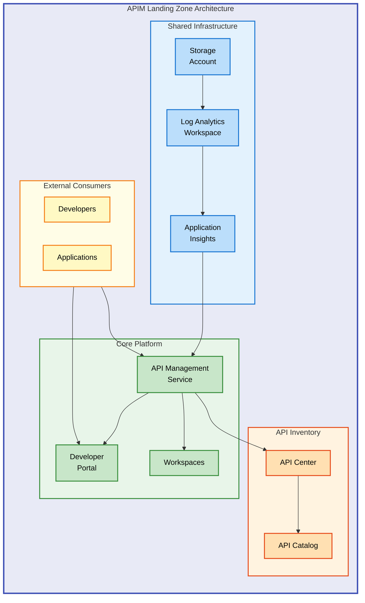

# APIM Accelerator


An enterprise-ready Azure API Management **landing zone accelerator** that deploys a complete API platform with monitoring, governance, and multi-team support using Infrastructure as Code.

**Overview**

The APIM Accelerator provides organizations with a **production-ready foundation** for deploying Azure API Management at scale. It addresses the common challenges of API platform setup—including monitoring integration, team isolation, and governance—by providing a well-architected, repeatable deployment pattern that follows Azure best practices.

This accelerator is designed for **platform teams, cloud architects, and DevOps engineers** who need to establish a centralized API management platform that supports multiple development teams while maintaining operational visibility and governance controls. By leveraging **Azure Developer CLI (azd) and Bicep templates**, deployments are consistent, auditable, and easily customizable to meet specific organizational requirements.

The solution integrates **three core Azure services**: API Management for API gateway and developer portal capabilities, API Center for API governance and discovery, and a comprehensive monitoring stack built on Log Analytics and Application Insights. This integrated approach ensures that from day one, your API platform has the observability and governance controls needed for enterprise operations.

## 📑 Table of Contents

- [Architecture](#-architecture)
- [Features](#-features)
- [Requirements](#-requirements)
- [Quick Start](#-quick-start)
- [Deployment](#-deployment)
- [Usage](#-usage)
- [Configuration](#-configuration)
- [Contributing](#-contributing)
- [License](#-license)

## 🏗️ Architecture

**Overview**

The APIM Accelerator follows a **modular, layered architecture pattern** that separates concerns into distinct deployment modules. This design enables independent scaling, easier troubleshooting, and the flexibility to customize individual components without affecting the entire platform.

The architecture deploys resources at the **subscription level**, creating a dedicated resource group that contains all platform components. The deployment sequence ensures dependencies are resolved correctly: **shared monitoring infrastructure deploys first**, followed by the core API Management platform, and finally the API inventory management layer.



**Component Interactions**:

| Layer                     | Components                                   | Purpose                                                |
| ------------------------- | -------------------------------------------- | ------------------------------------------------------ |
| **Shared Infrastructure** | Log Analytics, Application Insights, Storage | Centralized monitoring, diagnostics, and log retention |
| **Core Platform**         | API Management, Developer Portal, Workspaces | API gateway, developer experience, team isolation      |
| **API Inventory**         | API Center, API Catalog                      | API governance, discovery, and documentation           |

## ✨ Features

**Overview**

The APIM Accelerator delivers a comprehensive set of capabilities designed to accelerate your API platform deployment while maintaining enterprise-grade standards. Each feature addresses specific operational challenges that organizations face when building and managing API infrastructure at scale.

These features work together to provide a cohesive platform experience. The monitoring integration ensures visibility from day one, **workspace isolation enables multi-team collaboration** without infrastructure duplication, and the governance layer through API Center provides the controls needed for compliance and standardization.

| Feature                         | Description                                                                                   | Benefits                                                                                                      |
| ------------------------------- | --------------------------------------------------------------------------------------------- | ------------------------------------------------------------------------------------------------------------- |
| 🚀 **One-Command Deployment**   | Deploy the entire platform using `azd up` with Azure Developer CLI integration                | Reduces deployment time from hours to minutes; ensures consistent, repeatable deployments across environments |
| 📊 **Integrated Monitoring**    | Pre-configured Log Analytics, Application Insights, and diagnostic settings for all resources | Immediate observability without additional setup; centralized logging for troubleshooting and compliance      |
| 👥 **Multi-Team Workspaces**    | API Management workspaces for logical isolation between teams or projects                     | Cost-effective alternative to multiple APIM instances; enables independent API lifecycle management           |
| 🔐 **Managed Identity Support** | System-assigned and user-assigned managed identity configurations                             | Eliminates credential management; enables secure service-to-service authentication                            |
| 📚 **API Governance**           | API Center integration for centralized API catalog and discovery                              | Single source of truth for all APIs; automated API discovery from APIM                                        |

> 💡 **Tip**: Start with a single workspace for initial deployment, then add team-specific workspaces as your platform scales.

## 📋 Requirements

**Overview**

Before deploying the APIM Accelerator, ensure your environment meets the prerequisites listed below. These requirements exist to ensure successful deployment and proper integration with your Azure environment.

The tooling requirements include Azure CLI and Azure Developer CLI, which handle authentication and orchestration respectively. The Azure subscription **must have sufficient quota and permissions** to create the required resources, particularly API Management which requires specific resource provider registrations.

| Category    | Requirement                                 | More Information                                                                           |
| ----------- | ------------------------------------------- | ------------------------------------------------------------------------------------------ |
| **Runtime** | Azure CLI 2.50+                             | [Install Azure CLI](https://docs.microsoft.com/cli/azure/install-azure-cli)                |
| **Runtime** | Azure Developer CLI (azd) 1.5+              | [Install azd](https://learn.microsoft.com/azure/developer/azure-developer-cli/install-azd) |
| **Azure**   | Active Azure subscription                   | [Create free account](https://azure.microsoft.com/free/)                                   |
| **Azure**   | **Contributor role** on subscription        | Required for resource group and resource creation                                          |
| **Azure**   | API Management resource provider registered | Auto-registered on first deployment                                                        |
| **System**  | Bash shell (Linux/macOS/WSL)                | Required for pre-provisioning hooks                                                        |

> ⚠️ **Important**: The **Premium SKU is configured by default**. Ensure your subscription has sufficient quota for API Management Premium tier in your target region.

## 🚀 Quick Start

**Overview**

Get the APIM Accelerator running in your Azure subscription with these minimal steps. This quick start deploys a complete API Management landing zone with default settings suitable for development and evaluation purposes.

```bash
# Clone the repository
git clone https://github.com/Evilazaro/APIM-Accelerator.git
cd APIM-Accelerator

# Login to Azure and Azure Developer CLI
az login
azd auth login

# Deploy the entire solution
azd up
```

After deployment completes (**~30-45 minutes for Premium tier**), you'll have:

- A fully configured API Management instance with developer portal
- Log Analytics workspace with Application Insights
- API Center for governance and discovery
- All resources tagged and monitored

## 📦 Deployment

**Overview**

The deployment process uses **Azure Developer CLI (azd)** to orchestrate the provisioning of all infrastructure components. The solution supports multiple environments (dev, test, staging, prod, uat) with environment-specific configurations controlled through the `infra/settings.yaml` file.

The deployment follows a specific sequence to ensure dependencies are resolved: shared monitoring infrastructure deploys first, then the core API Management platform, and finally the API inventory layer. Pre-provisioning hooks **automatically clean up any soft-deleted APIM instances** that might cause naming conflicts.

### Step 1: Configure Environment

Set your target environment and Azure region:

```bash
# Initialize a new environment
azd env new dev

# Set the Azure location
azd env set AZURE_LOCATION eastus
```

### Step 2: Customize Settings (Optional)

Edit `infra/settings.yaml` to customize your deployment:

```yaml
# Solution identifier
solutionName: "apim-accelerator"

# Core APIM configuration
core:
  apiManagement:
    publisherEmail: "your-email@example.com"
    publisherName: "Your Organization"
    sku:
      name: "Premium" # Options: Developer, Basic, Standard, Premium
      capacity: 1
```

### Step 3: Deploy

```bash
# Provision and deploy all resources
azd up

# Or provision infrastructure only
azd provision
```

### Step 4: Verify Deployment

```bash
# List deployed resources
az resource list --resource-group apim-accelerator-dev-eastus-rg --output table
```

Expected output includes:

- `Microsoft.ApiManagement/service` - API Management instance
- `Microsoft.ApiCenter/services` - API Center instance
- `Microsoft.OperationalInsights/workspaces` - Log Analytics workspace
- `Microsoft.Insights/components` - Application Insights

## 💻 Usage

**Overview**

Once deployed, the APIM Accelerator provides multiple integration points for your development teams. The **API Management developer portal** serves as the primary interface for API consumers, while the Azure portal provides administrative access to all platform components.

Teams can leverage **workspaces for logical isolation**, enabling independent API development lifecycles while sharing the underlying infrastructure. The monitoring stack provides immediate visibility into API traffic, performance, and errors through pre-configured dashboards and alerts.

### Access the Developer Portal

Navigate to your API Management developer portal:

```bash
# Get the developer portal URL
az apim show --name <apim-name> --resource-group <resource-group> --query "developerPortalUrl" -o tsv
```

### Create a New API

```bash
# Import an OpenAPI specification
az apim api import \
  --resource-group apim-accelerator-dev-eastus-rg \
  --service-name <apim-name> \
  --path "/api/v1" \
  --specification-format OpenApiJson \
  --specification-url "https://petstore.swagger.io/v2/swagger.json"
```

### Monitor API Traffic

Access Application Insights for real-time monitoring:

```bash
# Get Application Insights connection details
az monitor app-insights component show \
  --resource-group apim-accelerator-dev-eastus-rg \
  --query "[].{name:name, instrumentationKey:instrumentationKey}"
```

> 💡 **Tip**: Use the **Kusto query language (KQL)** in Log Analytics to create custom dashboards for your specific API monitoring needs.

## 🔧 Configuration

**Overview**

The APIM Accelerator uses a **centralized YAML-based configuration** approach through the `infra/settings.yaml` file. This design philosophy enables environment-specific customization while maintaining a single source of truth for all deployment parameters.

Configuration is organized into logical sections: shared services (monitoring), core platform (API Management), and inventory (API Center). Each section supports both **explicit naming and auto-generated names**, allowing flexibility between standardized naming conventions and custom requirements.

### Configuration File Structure

```yaml
# infra/settings.yaml

# Solution name - used as prefix for all resources
solutionName: "apim-accelerator"

# Shared services configuration
shared:
  monitoring:
    logAnalytics:
      name: "" # Leave empty for auto-generation
      identity:
        type: "SystemAssigned"
    applicationInsights:
      name: "" # Leave empty for auto-generation
  tags:
    CostCenter: "CC-1234"
    BusinessUnit: "IT"
    Owner: "your-email@example.com"

# Core APIM configuration
core:
  apiManagement:
    publisherEmail: "admin@example.com"
    publisherName: "Organization Name"
    sku:
      name: "Premium"
      capacity: 1
    identity:
      type: "SystemAssigned"
    workspaces:
      - name: "workspace1"

# API inventory configuration
inventory:
  apiCenter:
    name: "" # Leave empty for auto-generation
    identity:
      type: "SystemAssigned"
```

### Environment Variables

When deploying with `azd`, the following environment variables are used:

| Variable         | Description                        | Example  |
| ---------------- | ---------------------------------- | -------- |
| `AZURE_ENV_NAME` | Environment name (dev, test, prod) | `dev`    |
| `AZURE_LOCATION` | Azure region for deployment        | `eastus` |

### SKU Options

| SKU         | Use Case                  | SLA        | Multi-Region |
| ----------- | ------------------------- | ---------- | ------------ |
| Developer   | Non-production, testing   | None       | No           |
| Basic       | Small-scale production    | 99.95%     | No           |
| Standard    | Medium-scale production   | 99.95%     | No           |
| **Premium** | **Enterprise production** | **99.99%** | **Yes**      |

> 📌 **Reference**: For detailed SKU comparison including pricing, see [Azure API Management pricing](https://azure.microsoft.com/pricing/details/api-management/).

## 🤝 Contributing

**Overview**

Contributions to the APIM Accelerator are welcome and appreciated. Whether you're fixing bugs, improving documentation, or proposing new features, your input helps make this project better for everyone.

The project follows standard GitHub workflows for contributions. We value clear communication, well-tested changes, and documentation that helps others understand your contributions. **Before starting significant work, please open an issue** to discuss your proposed changes.

### How to Contribute

1. **Fork the repository** and create a feature branch
2. **Make your changes** following the existing code style and patterns
3. **Test your changes** by deploying to a test Azure subscription
4. **Submit a pull request** with a clear description of your changes

### Development Guidelines

- Follow **Bicep best practices** for Infrastructure as Code
- Include comprehensive comments in Bicep templates
- Update documentation for any user-facing changes
- Ensure all deployments complete without errors

### Reporting Issues

Open an issue on GitHub with:

- Clear description of the problem
- Steps to reproduce
- Expected vs actual behavior
- Azure region and subscription tier (if relevant)

## 📝 License

MIT License - see [LICENSE](LICENSE) file for details.

Copyright (c) 2025 Evilázaro Alves
