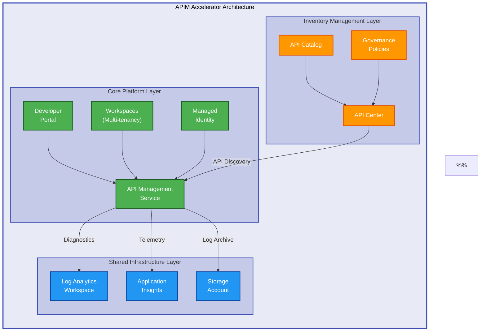

# APIM Accelerator


Enterprise-grade Infrastructure as Code (IaC) solution for deploying Azure API Management landing zones with built-in governance, monitoring, and multi-tenancy support.

**Overview**

APIM Accelerator provides a comprehensive, production-ready infrastructure template for deploying Azure API Management (APIM) at scale. This solution implements best practices for API governance, security, and observability through modular Bicep templates. It orchestrates the deployment of monitoring infrastructure (Log Analytics, Application Insights), core APIM services with premium features, and API Center for centralized catalog management.

The accelerator supports multiple deployment tiers (Developer, Standard, Premium) and enables teams to establish a secure API platform with minimal configuration while maintaining flexibility for enterprise customization. Organizations benefit from automated resource provisioning, standardized tagging strategies, and integrated diagnostic capabilities. The solution addresses common challenges in API platform deployment including identity management, multi-workspace isolation for team collaboration, and compliance tracking through comprehensive tagging taxonomies.

## 📋 Table of Contents

- [Quick Start](#-quick-start)
- [Deployment](#-deployment)
- [Usage](#-usage)
- [Architecture](#-architecture)
- [Features](#-features)
- [Requirements](#-requirements)
- [Configuration](#-configuration)
- [Contributing](#-contributing)
- [License](#-license)

## 🚀 Quick Start

Get started with APIM Accelerator in under 5 minutes using Azure Developer CLI (`azd`):

```bash
# Clone the repository
git clone https://github.com/Evilazaro/APIM-Accelerator.git
cd APIM-Accelerator

# Login to Azure
az login
azd auth login

# Provision and deploy
azd up
```

The `azd up` command provisions all Azure resources, configures monitoring, and deploys the complete API Management platform to your subscription.

## 📦 Deployment

**Overview**

The deployment process follows a structured workflow using either Azure Developer CLI (azd) for automated provisioning or Azure CLI for granular control. The accelerator supports subscription-level deployments that create resource groups and orchestrate multi-module infrastructure. Pre-provision hooks validate prerequisites and configure environment settings before resource creation.

Post-deployment steps include verifying service health, configuring developer portal settings, and validating monitoring integrations. The modular architecture allows selective deployment of components based on organizational needs while maintaining consistency across environments.

### Prerequisites

Ensure the following tools and permissions are configured before deployment:

- Azure subscription with Owner or Contributor + User Access Administrator roles
- Azure CLI version 2.50.0 or higher
- Azure Developer CLI (azd) version 1.0.0 or higher
- Bicep CLI version 0.20.0 or higher (bundled with Azure CLI)

### Step-by-Step Deployment

> ⚠️ **Important**: Deployment provisions Azure resources that incur costs. Review pricing for API Management Premium tier (~$2,700/month) before proceeding.

**Option 1: Automated Deployment (Recommended)**

```bash
# 1. Initialize Azure Developer CLI environment
azd init

# 2. Set deployment parameters
azd env set AZURE_LOCATION eastus
azd env set AZURE_SUBSCRIPTION_ID <your-subscription-id>

# 3. Deploy infrastructure and services
azd up
```

**Option 2: Manual Deployment with Azure CLI**

```bash
# 1. Create deployment at subscription level
az deployment sub create \
  --location eastus \
  --template-file infra/main.bicep \
  --parameters envName=prod location=eastus

# 2. Verify deployment status
az deployment sub show \
  --name main \
  --query properties.provisioningState
```

### Verification Steps

After deployment completes, verify resources:

```bash
# Check API Management service status
az apim show \
  --name <apim-service-name> \
  --resource-group <resource-group-name> \
  --query provisioningState

# Validate Application Insights connection
az monitor app-insights component show \
  --app <app-insights-name> \
  --resource-group <resource-group-name>
```

> 💡 **Tip**: Use `azd monitor` to open Azure Portal monitoring dashboards for your deployed resources.

## 💻 Usage

**Overview**

The accelerator provides declarative configuration through YAML files and modular Bicep templates. Customize your deployment by editing `infra/settings.yaml` to specify SKU tiers, publisher information, tagging strategies, and workspace configurations. The solution supports multi-environment deployments (dev, test, production) with environment-specific settings files.

After provisioning, manage APIs through the Azure Portal, configure policies, and integrate with developer portal for API consumer onboarding. The workspace model enables independent API lifecycle management for different teams while sharing underlying infrastructure.

### Basic Configuration

Edit `infra/settings.yaml` to customize your deployment:

```yaml
solutionName: "apim-accelerator"

core:
  apiManagement:
    publisherEmail: "your-email@example.com"
    publisherName: "Your Organization"
    sku:
      name: "Premium" # Options: Developer, Basic, Standard, Premium
      capacity: 1
```

### Managing API Workspaces

Create isolated workspaces for team-based API management (Premium SKU only):

```yaml
core:
  apiManagement:
    workspaces:
      - name: "team-alpha"
      - name: "team-beta"
```

### Accessing Services

After deployment, access your APIM services:

- **Azure Portal**: Navigate to your API Management service in the created resource group
- **Developer Portal**: `https://<apim-name>.developer.azure-api.net`
- **Management API**: `https://<apim-name>.management.azure-api.net`
- **Gateway URL**: `https://<apim-name>.azure-api.net`

## 🏗️ Architecture

**Overview**

The APIM Accelerator implements a layered architecture with three primary tiers: shared infrastructure, core platform, and inventory management. The shared tier provides foundational monitoring services (Log Analytics, Application Insights, Storage) used across all components. The core tier deploys the API Management service with configurable SKU, managed identity, and workspace support.

The inventory tier establishes API Center for governance and catalog management. All modules integrate through output references and RBAC role assignments, ensuring secure inter-service communication. This modular design enables independent scaling and customization of each layer while maintaining cohesive platform operations.



**Component Interactions:**

- **Shared Infrastructure** provides centralized logging and monitoring for all services via diagnostic settings
- **Core APIM** integrates with shared services through output references and diagnostic configurations
- **API Center** discovers and catalogs APIs from APIM using managed identity authentication with RBAC roles
- **Developer Portal** is automatically configured and deployed with the APIM service
- **Workspaces** enable logical isolation within a single APIM instance for multi-team scenarios

## ✨ Features

**Overview**

The accelerator delivers enterprise-grade capabilities for API platform deployment, including flexible SKU selection from Developer to Premium tiers, comprehensive monitoring integration, and security through managed identities. It supports multi-tenancy via workspaces for team isolation, automated API governance through API Center integration, and declarative configuration via YAML and Bicep.

Built-in diagnostic settings, standardized tagging taxonomies, and Azure Developer CLI integration enable rapid deployment with production-ready configurations. The solution emphasizes infrastructure as code best practices with modular architecture for customization, version control integration, and repeatable deployments across multiple environments.

| Feature                             | Description                                                                                                                                                                                | Benefits                                                                                                                                                  |
| ----------------------------------- | ------------------------------------------------------------------------------------------------------------------------------------------------------------------------------------------ | --------------------------------------------------------------------------------------------------------------------------------------------------------- |
| 🚀 **Multi-Tier SKU Support**       | Supports Developer, Basic, Standard, and Premium API Management SKUs with configurable capacity scaling. Premium tier enables multi-region deployment and advanced caching.                | Choose appropriate tier for development, testing, or production workloads. Scale capacity units independently for cost optimization without redeployment. |
| 🔒 **Managed Identity Integration** | System-assigned and user-assigned managed identity support for secure Azure service authentication without credential management. Integrates with Key Vault, Storage, and downstream APIs. | Eliminates secrets and connection strings from configuration. Enables automatic credential rotation and simplified security model with Azure AD.          |
| 📊 **Comprehensive Monitoring**     | Pre-configured Log Analytics workspace, Application Insights, and diagnostic settings for logs, metrics, and distributed tracing across all APIM components.                               | Gain immediate visibility into API performance, failures, and usage patterns. Centralized logging for compliance auditing and troubleshooting.            |
| 🏢 **Multi-Tenancy Workspaces**     | Workspace-based logical separation for different teams or projects within a single APIM instance (Premium SKU). Each workspace manages its own API lifecycle independently.                | Enable independent API lifecycle management per team while sharing infrastructure. Reduce costs by 60-70% compared to separate APIM instances per team.   |
| 📚 **API Governance & Catalog**     | Azure API Center integration for centralized API inventory, documentation, and governance policy enforcement. Automatic API discovery from APIM service.                                   | Maintain visibility across all APIs in the organization. Enforce standards and compliance requirements through policy definitions.                        |
| ⚙️ **Declarative Configuration**    | YAML-based settings file (`infra/settings.yaml`) for infrastructure configuration without modifying Bicep templates. Environment-specific parameter files supported.                       | Simplify multi-environment deployments with version-controlled configuration. Separate infrastructure code from environment-specific settings.            |
| 🏷️ **Standardized Tagging**         | Built-in tagging taxonomy for cost center, business unit, regulatory compliance, support contacts, and chargeback models across all resources.                                             | Enable cost allocation tracking, compliance auditing, and resource lifecycle management through consistent metadata application.                          |

## 📋 Requirements

**Overview**

The accelerator requires Azure subscription access with appropriate permissions for resource group creation and role assignments at subscription scope. Azure CLI and Azure Developer CLI are mandatory for deployment automation and workflow orchestration. Bicep CLI version 0.20.0+ is required for template compilation and is bundled with Azure CLI.

Network connectivity to Azure public endpoints is necessary unless deploying with private networking configurations. Supported operating systems include Windows, macOS, and Linux distributions. Premium SKU deployments require higher subscription quotas for API Management capacity units, which may need to be requested through Azure support.

| Category               | Requirements                                                                                                                      | More Information                                                                                              |
| ---------------------- | --------------------------------------------------------------------------------------------------------------------------------- | ------------------------------------------------------------------------------------------------------------- |
| **Runtime**            | Azure CLI 2.50.0+, Azure Developer CLI (azd) 1.0.0+, Bicep CLI 0.20.0+                                                            | [Azure CLI Install](https://learn.microsoft.com/cli/azure/install-azure-cli)                                  |
| **Azure Subscription** | Active Azure subscription with Owner or Contributor + User Access Administrator roles for RBAC assignments                        | [Azure Free Account](https://azure.microsoft.com/free/)                                                       |
| **Operating System**   | Windows 10/11, macOS 12+, Linux (Ubuntu 20.04+, RHEL 8+, Debian 11+)                                                              | [Azure CLI Compatibility](https://learn.microsoft.com/cli/azure/install-azure-cli)                            |
| **Network**            | Internet connectivity for Azure public endpoints (or ExpressRoute/VPN for private networking scenarios)                           | [APIM Networking](https://learn.microsoft.com/azure/api-management/virtual-network-concepts)                  |
| **Permissions**        | Subscription-level permissions to create resource groups, assign RBAC roles, and create service principals for managed identities | [Azure RBAC](https://learn.microsoft.com/azure/role-based-access-control/overview)                            |
| **Quotas**             | API Management Premium tier quota (default: 1 instance per subscription per region). Standard/Developer tiers have higher limits. | [Request Quota Increase](https://learn.microsoft.com/azure/azure-portal/supportability/per-vm-quota-requests) |

> ⚠️ **Note**: Premium SKU deployments require sufficient subscription quotas. Contact Azure support to increase limits if deployment fails with quota errors.

## 🔧 Configuration

**Overview**

Configuration management follows a layered approach with environment-agnostic defaults in `infra/settings.yaml` and deployment-specific parameters in `infra/main.parameters.json`. The settings file controls infrastructure topology including SKU selection, identity types, workspace definitions, and tagging strategies for resource governance.

Azure Developer CLI environment variables (`azd env set`) override file-based settings for CI/CD pipelines and automated deployments. Post-deployment configuration includes developer portal customization, policy definitions at API/operation levels, and API import through Azure Portal or Management API REST endpoints.

### Environment Variables

The accelerator supports configuration through environment variables:

```bash
# Set deployment location
azd env set AZURE_LOCATION eastus

# Set subscription ID
azd env set AZURE_SUBSCRIPTION_ID <subscription-id>

# Set environment name (dev, test, prod)
azd env set AZURE_ENV_NAME prod
```

### Infrastructure Settings

Edit `infra/settings.yaml` to customize infrastructure configuration:

```yaml
# Core API Management configuration
core:
  apiManagement:
    publisherEmail: "admin@example.com"
    publisherName: "Contoso"
    sku:
      name: "Premium"
      capacity: 2
    identity:
      type: "SystemAssigned"
```

### Tagging Strategy

Configure resource tags for governance and cost allocation:

```yaml
shared:
  tags:
    CostCenter: "CC-1234"
    BusinessUnit: "IT"
    Owner: "platform-team@example.com"
    ApplicationName: "APIM Platform"
    ServiceClass: "Critical"
    RegulatoryCompliance: "GDPR"
```

### Advanced Configuration

> 💡 **Tip**: For advanced scenarios including VNet integration, custom domains, and certificate management, refer to the [Azure API Management documentation](https://learn.microsoft.com/azure/api-management/).

**Custom SKU Configuration:**

```yaml
core:
  apiManagement:
    sku:
      name: "Developer" # Use Developer SKU for non-production
      capacity: 1
```

**User-Assigned Managed Identity:**

```yaml
core:
  apiManagement:
    identity:
      type: "UserAssigned"
      userAssignedIdentities:
        - "/subscriptions/<sub-id>/resourceGroups/<rg>/providers/Microsoft.ManagedIdentity/userAssignedIdentities/<identity-name>"
```

## 🤝 Contributing

**Overview**

Contributions are welcome and encouraged to enhance the accelerator's capabilities, documentation, and deployment patterns. The project follows standard GitHub workflows with pull requests reviewed for code quality, Bicep best practices, and documentation completeness. Contributors should test changes against multiple Azure environments and ensure backward compatibility with existing deployments.

Maintain consistency with established patterns including modular Bicep structure, comprehensive inline documentation, and declarative configuration principles. All contributions should follow the existing naming conventions, tagging strategies, and security practices defined in the codebase.

We welcome contributions including bug fixes, feature enhancements, documentation improvements, and deployment pattern examples. Before submitting:

1. Fork the repository and create a feature branch from `main`
2. Test your changes in an Azure subscription with multiple SKU tiers
3. Update relevant documentation and inline Bicep comments
4. Ensure Bicep files pass linting with `az bicep build`
5. Submit a pull request with detailed description of changes and testing performed

> 💡 **Tip**: Review existing issues and discussions before starting significant changes to align with project direction and avoid duplicate work.

## 📝 License

This project is licensed under the MIT License - see the [LICENSE](LICENSE) file for details.

**Copyright (c) 2025 Evilázaro Alves**

Permission is granted to use, copy, modify, and distribute this software for any purpose with or without fee, provided that copyright and permission notices are retained. The software is provided "as is" without warranty of any kind.
