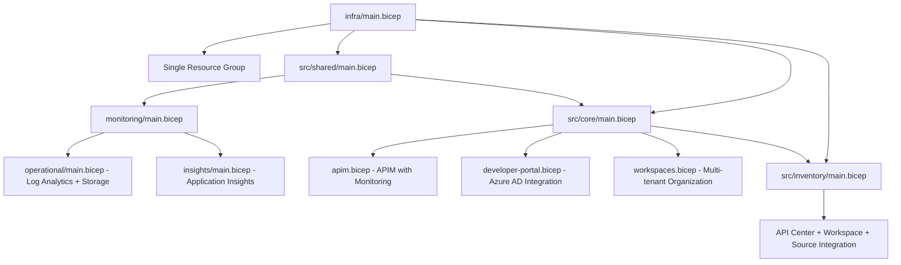

# Azure API Management Accelerator

Provision, configure, and operationalize Azure API Management (APIM) following Azure Landing Zone (ALZ) design areas and enterprise guardrails.

  

## 📁 Repository Structure

```
azure.yaml                   # Azure Developer CLI (azd) project configuration
LICENSE                     # MIT license terms
README.md                   # This file - project overview and documentation
├── infra/                  # Infrastructure orchestration
│   ├── main.bicep         # Subscription-scoped entry point (resource groups + modules)
│   ├── main.parameters.json # Optional parameters file for direct deployment
│   ├── settings.yaml      # Centralized configuration for all environments
│   └── azd-hooks/         # Azure Developer CLI lifecycle hooks
│       └── pre-provision.sh
├── src/                   # Bicep modules organized by functional area
│   ├── shared/            # Shared infrastructure components
│   │   ├── main.bicep     # Shared infrastructure orchestration
│   │   ├── common-types.bicep # Bicep type definitions and schemas
│   │   ├── constants.bicep # Utility functions and constants
│   │   ├── monitoring/    # Monitoring infrastructure
│   │   │   ├── main.bicep # Monitoring orchestration
│   │   │   ├── operational/
│   │   │   │   └── main.bicep # Log Analytics workspace + Storage
│   │   │   └── insights/
│   │   │       └── main.bicep # Application Insights component
│   │   └── networking/    # Network components (placeholder)
│   │       └── main.bicep
│   ├── core/              # Core API Management platform
│   │   ├── main.bicep     # Core platform orchestration
│   │   ├── apim.bicep     # API Management service with monitoring
│   │   ├── developer-portal.bicep # Developer portal + Azure AD config
│   │   └── workspaces.bicep # APIM workspace management
│   └── inventory/         # API inventory and governance
│       └── main.bicep     # API Center service integration
└── docs/                  # Current documentation
    ├── getting-started/   # Prerequisites and setup guides
    ├── architecture/      # Architecture overview and design
    └── reference/         # Technical reference materials
```

### 🏗️ Architecture Components

| Component | Purpose | Location | Dependencies |
|-----------|---------|----------|--------------|
| **Orchestration** | Creates single resource group and coordinates deployment | `infra/main.bicep` | `settings.yaml` |
| **Shared Infrastructure** | Log Analytics, Application Insights, Storage Account | `src/shared/` | Resource group from orchestration |
| **Core Platform** | API Management service with monitoring integration | `src/core/` | Shared infrastructure outputs |
| **API Inventory** | API Center service for API catalog and governance | `src/inventory/` | Core APIM service integration |
| **Configuration** | Centralized settings for all deployment parameters | `infra/settings.yaml` | None (root configuration) |

### 🎯 Deployment Flow



## 🚀 Quick Start

### Prerequisites
- Azure Developer CLI (`azd`) v1.10+
- Azure subscription with Contributor + User Access Administrator rights
- PowerShell 7+ or Bash shell
- Git for repository access

**Optional but Recommended:**
- Azure Developer CLI (`azd`) v1.10+ for simplified deployment

### Deployment Steps

1. **Clone and Setup**
   ```bash
   git clone https://github.com/Evilazaro/APIM-Accelerator.git
   cd APIM-Accelerator
   
   # Login to Azure
   azd auth login
   ```

2. **Configure Deployment**
   ```bash
   # Review and customize configuration
   code infra/settings.yaml
   
   # Update required settings:
   # - solutionName: your organization prefix
   # - core.apiManagement.publisherEmail: your email
   # - core.apiManagement.publisherName: your organization
   ```

3. **Deploy Infrastructure**
   ```bash
   # Deploy using Azure Developer CLI
   azd up
   
   # Preview deployment before running
   azd provision --preview
   ```

4. **Verify Deployment**
   ```bash
   # Monitor deployment status
   azd monitor
   
   # Show deployed resources
   azd show
   ```
   
   **Manual Verification:**
   - Azure Portal: Check all resources in the resource group
   - API Management: Access developer portal and management interface
   - Monitoring: Verify Log Analytics workspace and Application Insights data

## ⚙️ Configuration

All environment-specific settings are centralized in `infra/settings.yaml`:

### Core Configuration Areas

| Section | Purpose | Key Settings |
|---------|---------|--------------|
| `solutionName` | Resource naming prefix | Base name for all resources |
| `shared.monitoring` | Observability stack | Log Analytics, Application Insights |
| `core.apiManagement` | APIM service config | SKU, identity, publisher details |
| `inventory.apiCenter` | API catalog integration | API Center service configuration |
| `tags` | Resource governance | Cost tracking, ownership, compliance |

### Current Implementation Example
```yaml
solutionName: "apim-accelerator"

shared:
  monitoring:
    logAnalytics:
      name: ""                        # Auto-generated: {solutionName}-{uniqueSuffix}-law
      workSpaceResourceId: ""         # Optional: use existing workspace
      identity:
        type: "SystemAssigned"        # SystemAssigned | UserAssigned
        userAssignedIdentities: []    
    applicationInsights:
      name: ""                        # Auto-generated: {solutionName}-{uniqueSuffix}-ai
      logAnalyticsWorkspaceResourceId: "" # Auto-linked to Log Analytics
    tags:
      lz-component-type: "shared"
      component: "monitoring"
  tags:
    CostCenter: "CC-1234"
    BusinessUnit: "IT" 
    Owner: "evilazaro@gmail.com"
    ApplicationName: "APIM Platform"
    ProjectName: "APIMForAll"
    ServiceClass: "Critical"
    RegulatoryCompliance: "GDPR"
    SupportContact: "evilazaro@gmail.com"
    ChargebackModel: "Dedicated"
    BudgetCode: "FY25-Q1-InitiativeX"

core:
  apiManagement: 
    name: ""                          # Auto-generated: {solutionName}-{uniqueSuffix}-apim
    publisherEmail: "evilazaro@gmail.com"  # REQUIRED: Update this
    publisherName: "Contoso"          # REQUIRED: Update this
    sku:
      name: "Premium"                 # Premium for production, Developer for testing
      capacity: 1                     # Scale units (1-3+ for Premium)
    identity:
      type: "SystemAssigned"          # Managed identity for secure authentication
      userAssignedIdentities: []
    workspaces: 
      - name: "workspace1"            # APIM workspaces for organization
  tags:
      lz-component-type: "core"
      component: "apiManagement"

inventory:
  apiCenter:
    name: ""                          # Auto-generated: {solutionName}-apicenter-{uniqueSuffix}
    identity:
      type: "SystemAssigned"          # System identity with Reader + Contributor roles
      userAssignedIdentities: []
  tags:
    lz-component-type: "inventory"
    component: "inventory"
```

## 🏢 Current Features

- **Landing Zone Aligned**: Implements Azure Landing Zone design principles with managed identities and comprehensive monitoring
- **Single Resource Group**: Simplified deployment model with logical component separation through tagging
- **Managed Identity**: System-assigned identities with automated RBAC assignments (no stored secrets)
- **Comprehensive Monitoring**: Log Analytics workspace with Application Insights integration and diagnostic settings
- **API Governance**: API Center integration for centralized API catalog and automated discovery
- **Security by Default**: HTTPS enforcement, managed identities, least-privilege access, comprehensive logging
- **Modular Design**: Well-structured Bicep modules with type safety and utility functions

## 🏗️ Azure Landing Zone Alignment

This accelerator implements Azure Landing Zone design areas with a practical, deployable approach:

| Design Area | Current Implementation | Resources |
|-------------|----------------------|-----------|
| **Identity & Access** | System-assigned managed identities with automated RBAC | Managed identities, role assignments |
| **Network Topology** | Public by default, VNet integration configurable | Optional VNet integration, public endpoints |
| **Security** | Managed identities, HTTPS by default, comprehensive logging | Diagnostic settings, managed identities |
| **Management** | Centralized monitoring with Log Analytics and Application Insights | Log Analytics, Application Insights, diagnostic settings |
| **Governance** | Consistent tagging strategy and centralized configuration | Resource tags, settings.yaml configuration |

## 📚 Additional Resources

### Available Documentation
```
docs/
├── getting-started/          # Prerequisites and setup requirements
├── architecture/            # Architecture overview and design principles
└── reference/              # Technical specifications and reference materials
```

### Key Documentation Files
- **[docs/getting-started/prerequisites.md](docs/getting-started/prerequisites.md)** - Complete setup requirements
- **[docs/architecture/overview.md](docs/architecture/overview.md)** - Architecture design and implementation details
- **[docs/reference/settings-schema.md](docs/reference/settings-schema.md)** - Complete settings.yaml reference
- **[docs/reference/bicep-modules.md](docs/reference/bicep-modules.md)** - All Bicep modules and parameters
- **[docs/reference/azure-resources.md](docs/reference/azure-resources.md)** - Complete resource inventory
- **[docs/reference/permissions.md](docs/reference/permissions.md)** - RBAC and security configuration

## 🔧 Customization & Configuration

### Environment-Specific Deployment
```bash
# Development environment
azd up --environment dev

# Production environment
azd up --environment prod
```

### Custom Resource Naming
```yaml
# Override auto-generated names in settings.yaml
core:
  apiManagement:
    name: "contoso-prod-apim"         # Custom APIM name
shared:
  monitoring:
    logAnalytics:
      name: "contoso-prod-law"        # Custom Log Analytics name
    applicationInsights:
      name: "contoso-prod-ai"         # Custom App Insights name
```

### SKU Configuration for Different Environments
```yaml
# Development - Cost-optimized
core:
  apiManagement:
    sku: { name: "Developer", capacity: 1 }

# Production - High-availability
core:
  apiManagement:
    sku: { name: "Premium", capacity: 3 }
```

## 🔍 Monitoring & Operations

The accelerator includes comprehensive monitoring out-of-the-box:

### Built-in Monitoring Features
- **Diagnostic Settings**: All resources configured with Log Analytics integration
- **Application Insights Logger**: APIM automatically sends telemetry to Application Insights
- **Managed Identity Integration**: Secure monitoring without stored credentials
- **Storage Account**: Long-term log retention and archival

### Key Metrics Available
- **API Management**: Request count, response time, error rates, gateway logs
- **Log Analytics**: Query performance, data ingestion, workspace utilization
- **Application Insights**: Performance counters, dependency tracking, exception analysis
- **API Center**: API discovery, catalog usage, governance metrics

### Sample Diagnostic Queries
```kql
// API request patterns (available immediately after deployment)
ApiManagementGatewayLogs
| where TimeGenerated > ago(1h)
| summarize RequestCount = count() by OperationName, bin(TimeGenerated, 5m)

// Error analysis with response codes
ApiManagementGatewayLogs
| where ResponseCode >= 400
| summarize ErrorCount = count() by ResponseCode, OperationName
| order by ErrorCount desc
```

## 🛠️ Troubleshooting

### Common Issues and Solutions

| Issue | Cause | Solution |
|-------|-------|----------|
| "Insufficient privileges" error | Missing User Access Administrator role | Add User Access Administrator role to deployment user |
| APIM deployment timeout | Premium SKU provisioning time | Premium can take 45+ minutes; use Developer SKU for testing |
| API Center provider not found | API Center not registered | Providers registered automatically during azd deployment |
| Monitoring data missing | Deployment still in progress | Wait for all resources to complete; diagnostic data appears within 5-15 minutes |

### Validation and Debugging
```bash
# Pre-deployment validation
azd provision --preview

# Monitor deployment progress
azd monitor

# Show deployment status and resources
azd show

# View deployment logs
azd logs
```

### Azure Resource Providers
Azure resource providers are automatically registered during `azd up` deployment. No manual registration is required.

## 📋 License

This project is licensed under the [MIT License](LICENSE).

## 🤝 Contributing

1. Fork the repository
2. Create a feature branch: `git checkout -b feature/your-feature`
3. Commit changes: `git commit -am 'Add your feature'`
4. Push to branch: `git push origin feature/your-feature`
5. Submit a Pull Request

Please read our [Contributing Guidelines](CONTRIBUTING.md) and [Code of Conduct](CODE_OF_CONDUCT.md) before contributing.

## 📞 Support

- **Issues**: [GitHub Issues](../../issues)
- **Discussions**: [GitHub Discussions](../../discussions)
- **Security**: [Security Policy](SECURITY.md)

## 🔗 Related Resources

- [Azure API Management Documentation](https://learn.microsoft.com/azure/api-management/)
- [Azure Landing Zones](https://learn.microsoft.com/azure/cloud-adoption-framework/ready/landing-zone/)
- [Azure Bicep Documentation](https://learn.microsoft.com/azure/azure-resource-manager/bicep/)
- [Azure Developer CLI](https://learn.microsoft.com/azure/developer/azure-developer-cli/)