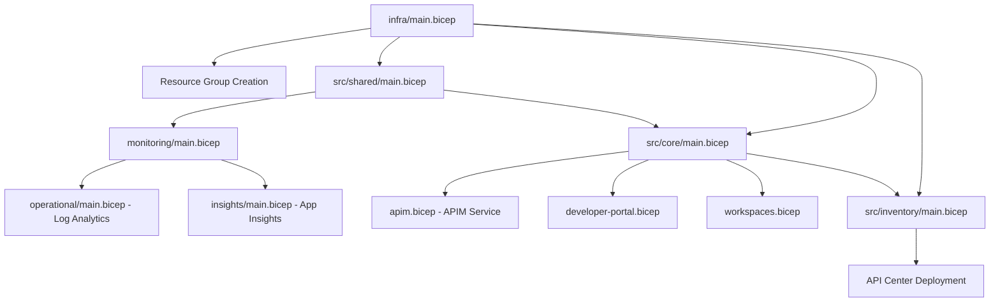

# Azure API Management Accelerator

Provision, configure, and operationalize Azure API Management (APIM) following Azure Landing Zone (ALZ) design areas and enterprise guardrails.

  

## 📁 Repository Structure

```
azure.yaml                   # Azure Developer CLI (azd) project configuration
LICENSE                     # MIT license terms
README.md                   # This file - project overview and documentation
├── infra/                  # Infrastructure orchestration
│   ├── main.bicep         # Subscription-scoped entry point (resource groups + modules)
│   ├── main.parameters.json # Optional parameters file for Azure CLI deployment
│   ├── settings.yaml      # Centralized configuration for all environments
│   └── azd-hooks/         # Azure Developer CLI lifecycle hooks
│       └── pre-provision.sh
├── src/                   # Bicep modules organized by functional area
│   ├── core/              # Core API Management platform components
│   │   ├── main.bicep     # Core orchestration module
│   │   ├── apim.bicep     # API Management service deployment
│   │   ├── developer-portal.bicep # Developer portal configuration
│   │   └── workspaces.bicep # APIM workspace management
│   ├── shared/            # Shared infrastructure components
│   │   ├── main.bicep     # Shared resources orchestration
│   │   ├── common-types.bicep # TypeScript-like type definitions
│   │   ├── monitoring/    # Observability components
│   │   │   ├── main.bicep # Monitoring orchestration
│   │   │   ├── operational/
│   │   │   │   └── main.bicep # Log Analytics workspace
│   │   │   └── insights/
│   │   │       └── main.bicep # Application Insights
│   │   └── networking/    # Network topology (VNet, subnets, NSGs)
│   │       └── main.bicep
│   └── inventory/         # API inventory and catalog management
│       └── main.bicep     # API Center integration
└── docs/                  # Comprehensive documentation
    ├── getting-started/   # Quick start guides and prerequisites
    ├── user-guide/        # Configuration and deployment guides
    ├── architecture/      # Design principles and patterns
    ├── developer-guide/   # Contribution and development guides
    ├── troubleshooting/   # Common issues and solutions
    └── reference/         # Technical reference materials
```

### 🏗️ Architecture Components

| Component | Purpose | Location | Dependencies |
|-----------|---------|----------|--------------|
| **Orchestration** | Creates resource groups and coordinates module deployment | `infra/main.bicep` | `settings.yaml` |
| **Core Platform** | API Management service, developer portal, workspaces | `src/core/` | Shared monitoring outputs |
| **Shared Infrastructure** | Monitoring (Log Analytics, App Insights), networking | `src/shared/` | Resource group from orchestration |
| **API Inventory** | API Center integration for cataloging and governance | `src/inventory/` | Core APIM service outputs |
| **Configuration** | Centralized YAML-based settings for all environments | `infra/settings.yaml` | None (root configuration) |

### 🎯 Module Flow



## � Quick Start

### Prerequisites
- Azure CLI (`az`) v2.61+ with `bicep` extension
- Azure Developer CLI (`azd`) v1.10+
- Azure subscription with Contributor/Owner rights
- PowerShell 7+ or Bash shell

### Deployment Steps

1. **Clone and Initialize**
   ```bash
   git clone <repository-url>
   cd APIM-Accelerator
   azd auth login
   ```

2. **Configure Environment**
   ```bash
   # Review and customize settings
   code infra/settings.yaml
   
   # Set target subscription
   azd env set AZURE_SUBSCRIPTION_ID <your-subscription-id>
   ```

3. **Deploy Infrastructure**
   ```bash
   # Deploy to Azure
   azd up
   
   # Or use Azure CLI directly
   az deployment sub create \
     --location eastus \
     --template-file infra/main.bicep \
     --parameters envName=dev location=eastus
   ```

4. **Verify Deployment**
   - Check Azure portal for created resources
   - Navigate to API Management service → Developer Portal
   - Review Log Analytics workspace for monitoring data

## ⚙️ Configuration

All environment-specific settings are centralized in `infra/settings.yaml`:

### Core Configuration Areas

| Section | Purpose | Key Settings |
|---------|---------|--------------|
| `solutionName` | Resource naming prefix | Base name for all resources |
| `shared.monitoring` | Observability stack | Log Analytics, Application Insights |
| `core.apiManagement` | APIM service config | SKU, identity, publisher details |
| `inventory.apiCenter` | API catalog integration | API Center service configuration |
| `tags` | Resource governance | Cost tracking, ownership, compliance |

### Complete Configuration Example
```yaml
solutionName: "contoso-apim"

shared:
  monitoring:
    logAnalytics:
      name: ""                           # Auto-generated if empty
      workSpaceResourceId: ""           # Optional: use existing workspace
      identity:
        type: "SystemAssigned"          # SystemAssigned | UserAssigned
        userAssignedIdentities: []      # Array of identity resource IDs
    applicationInsights:
      name: ""                          # Auto-generated if empty
      logAnalyticsWorkspaceResourceId: "" # Linked workspace (auto-linked if empty)
    tags:
      lz-component-type: "shared"
      component: "monitoring"
  tags:
    # Governance and compliance tags
    CostCenter: "CC-1234"
    BusinessUnit: "IT"
    Owner: "admin@contoso.com"
    ApplicationName: "APIM Platform"
    ProjectName: "APIManagementInitiative"
    ServiceClass: "Critical"            # Critical | Standard | Experimental
    RegulatoryCompliance: "GDPR"       # GDPR | HIPAA | PCI | None
    SupportContact: "cloudops@contoso.com"
    ChargebackModel: "Dedicated"       # Dedicated | Shared | Hybrid
    BudgetCode: "FY25-Q1-InitiativeX"

core:
  apiManagement:
    name: ""                           # Auto-generated if empty
    publisherEmail: "admin@contoso.com"
    publisherName: "Contoso API Team"
    sku:
      name: "Premium"                  # Basic | BasicV2 | Developer | Standard | StandardV2 | Premium | Consumption
      capacity: 1                     # Scale units (1-10+ depending on SKU)
    identity:
      type: "SystemAssigned"          # SystemAssigned | UserAssigned | None
      userAssignedIdentities: []      # Array of managed identity resource IDs
    workspaces:                       # APIM workspaces for multi-tenancy
      - name: "workspace1"
      - name: "workspace2"
  tags:
    lz-component-type: "core"
    component: "apiManagement"

inventory:
  apiCenter:
    name: ""                          # Auto-generated if empty
    identity:
      type: "SystemAssigned"         # SystemAssigned | UserAssigned | None
      userAssignedIdentities: []     # Array of managed identity resource IDs
  tags:
    lz-component-type: "inventory"
    component: "apiCenter"
```

## 🏢 Enterprise Features

- **Landing Zone Aligned**: Follows Azure Landing Zone design areas (identity, networking, security, monitoring, governance)
- **Multi-Environment**: Support for Dev/Test/Prod with environment-specific configurations
- **Managed Identity**: System and user-assigned identities with proper RBAC assignments
- **Comprehensive Monitoring**: Log Analytics workspace with Application Insights integration
- **API Governance**: API Center integration for catalog management and compliance
- **Security First**: Key Vault integration, network isolation options, diagnostic logging
- **Modular Design**: Composable Bicep modules for customization and extension

## 🏗️ Landing Zone Alignment

This accelerator implements Azure Landing Zone design areas:

| Design Area | Implementation | Resources |
|-------------|----------------|-----------|
| **Identity & Access** | System/User-assigned managed identities with RBAC | Managed identities, role assignments |
| **Network Topology** | VNet integration, subnet delegation, NSGs | Virtual networks, subnets, security groups |
| **Security** | Key Vault integration, diagnostic logging, private endpoints | Key Vault, diagnostic settings, private DNS |
| **Management** | Comprehensive monitoring and alerting | Log Analytics, Application Insights, workbooks |
| **Governance** | Consistent tagging, resource organization, compliance | Resource groups, tags, policies |

## 📚 Additional Resources

### Documentation Structure
```
docs/
├── getting-started/          # Quick start guides and setup
├── user-guide/              # Configuration and operational guides
├── architecture/            # Design principles and patterns
├── developer-guide/         # Contribution and customization
├── troubleshooting/         # Issue resolution and debugging
└── reference/              # Technical specifications and schemas
```

### Key Documentation Files
- **[CONTRIBUTING.md](CONTRIBUTING.md)** - Contribution guidelines and process
- **[CODE_OF_CONDUCT.md](CODE_OF_CONDUCT.md)** - Community standards and expectations
- **[SECURITY.md](SECURITY.md)** - Security policy and vulnerability reporting
- **[docs/reference/settings-schema.md](docs/reference/settings-schema.md)** - Complete settings.yaml reference

## 🔧 Customization & Extension

### Adding New Modules
```bicep
// Create new module in appropriate src/ subdirectory
// Import types from common-types.bicep
import { YourType } from '../shared/common-types.bicep'

// Add to main orchestration
module yourModule '../src/your-area/main.bicep' = {
  name: 'deploy-your-components'
  scope: resourceGroup(rgName)
  params: {
    // Pass configuration and dependencies
  }
}
```

### Environment-Specific Overrides
```bash
# Create environment-specific settings
cp infra/settings.yaml infra/settings.prod.yaml

# Use with azd
azd env set SETTINGS_FILE settings.prod.yaml
azd up
```

### Custom Resource Naming
```yaml
# Override default naming in settings.yaml
shared:
  monitoring:
    logAnalytics:
      name: "your-custom-law-name"
    applicationInsights:
      name: "your-custom-ai-name"
```

## 🔍 Monitoring & Operations

### Key Metrics to Monitor
- **API Management**: Request count, response time, error rates
- **Log Analytics**: Query performance, data ingestion volume
- **Application Insights**: Dependency health, exception rates
- **Resource Health**: Service availability, configuration drift

### Diagnostic Queries
```kql
// API request patterns
ApiManagementGatewayLogs
| where TimeGenerated > ago(1h)
| summarize RequestCount = count() by ApiId, bin(TimeGenerated, 5m)

// Error analysis  
ApiManagementGatewayLogs
| where ResponseCode >= 400
| summarize ErrorCount = count() by ResponseCode, ApiId
```

## � Troubleshooting

### Common Issues

| Issue | Cause | Solution |
|-------|-------|----------|
| Deployment fails with permissions error | Insufficient RBAC | Ensure Contributor role on subscription |
| APIM provisioning timeout | Large SKU deployment | Use smaller SKU for testing, Premium for production |
| Monitoring data missing | Diagnostic settings not configured | Verify Log Analytics workspace connection |
| API Center integration fails | Missing API Center registration | Enable API Center in target subscription |

### Validation Commands
```bash
# Verify Azure CLI and Bicep
az version
az bicep version

# Validate templates
az deployment sub validate \
  --location eastus \
  --template-file infra/main.bicep \
  --parameters envName=dev location=eastus

# Check resource deployment
az resource list --resource-group <your-rg-name> --output table
```

## 📋 License

This project is licensed under the [MIT License](LICENSE).

## 🤝 Contributing

1. Fork the repository
2. Create a feature branch: `git checkout -b feature/your-feature`
3. Commit changes: `git commit -am 'Add your feature'`
4. Push to branch: `git push origin feature/your-feature`
5. Submit a Pull Request

Please read our [Contributing Guidelines](CONTRIBUTING.md) and [Code of Conduct](CODE_OF_CONDUCT.md) before contributing.

## 📞 Support

- **Issues**: [GitHub Issues](../../issues)
- **Discussions**: [GitHub Discussions](../../discussions)
- **Security**: [Security Policy](SECURITY.md)

## 🔗 Related Resources

- [Azure API Management Documentation](https://learn.microsoft.com/azure/api-management/)
- [Azure Landing Zones](https://learn.microsoft.com/azure/cloud-adoption-framework/ready/landing-zone/)
- [Azure Bicep Documentation](https://learn.microsoft.com/azure/azure-resource-manager/bicep/)
- [Azure Developer CLI](https://learn.microsoft.com/azure/developer/azure-developer-cli/)