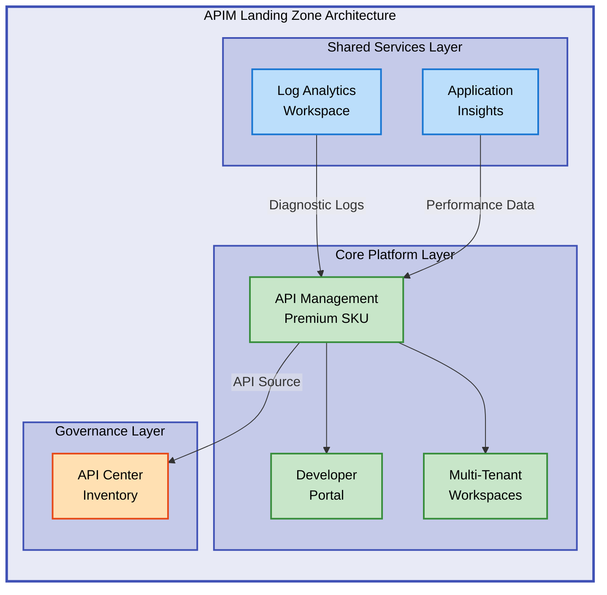

# APIM Accelerator


Enterprise-grade Azure API Management landing zone accelerator built with Infrastructure as Code (Bicep) for rapid, secure, and compliant APIM deployments.

**Overview**

APIM Accelerator provides a production-ready infrastructure foundation for deploying Azure API Management services at scale. This solution implements best practices for multi-tenant API platforms with comprehensive monitoring, security, and governance capabilities. Designed for cloud architects and platform teams, it accelerates cloud adoption by providing pre-configured templates that meet enterprise compliance requirements while maintaining flexibility for customization. The modular architecture enables teams to deploy complete API Management ecosystems in minutes rather than weeks, with built-in support for DevOps workflows through Azure Developer CLI integration.

## 📑 Table of Contents

- [Architecture](#-architecture)
- [Quick Start](#-quick-start)
- [Deployment](#-deployment)
- [Usage](#-usage)
- [Features](#-features)
- [Requirements](#-requirements)
- [Configuration](#-configuration)
- [Contributing](#-contributing)
- [License](#-license)

## 🏗️ Architecture

**Overview**

The APIM Accelerator follows a layered architecture pattern that separates concerns into three primary tiers: shared infrastructure, core platform services, and API governance. This design enables independent scaling and management of each component while maintaining tight integration through Azure Resource Manager. The architecture supports enterprise scenarios including multi-region deployments, disaster recovery, and workspace-based multi-tenancy for different teams or business units.



**Key Components:**

- **Shared Services**: Centralized monitoring with Log Analytics and Application Insights for unified observability
- **Core APIM**: Premium-tier API Management service with managed identity, caching, and multi-region support
- **Developer Portal**: Self-service API documentation and testing environment with Azure AD authentication
- **Workspaces**: Logical isolation for independent team/project API lifecycle management
- **API Center**: Centralized API catalog for governance, discovery, and compliance management

## 🚀 Quick Start

Deploy a complete APIM landing zone in under 5 minutes using Azure Developer CLI:

```bash
azd up
```

> 💡 **Tip**: Running `azd up` provisions all Azure resources, configures monitoring, and deploys the complete landing zone with a single command.

## 📦 Deployment

**Overview**

Deployment leverages Azure Developer CLI (azd) to orchestrate Bicep templates across subscription-level resources. The process creates resource groups, provisions infrastructure in the correct sequence (monitoring first, then APIM, then inventory), and configures all integrations automatically. Pre-provision hooks validate prerequisites and environment settings before deployment begins.

### Prerequisites

> ⚠️ **Important**: Ensure all prerequisites are met before deployment to avoid provisioning failures.

1. **Install Azure Developer CLI**:

```bash
# Windows (PowerShell)
winget install microsoft.azd

# macOS
brew tap azure/azd && brew install azd

# Linux
curl -fsSL https://aka.ms/install-azd.sh | bash
```

2. **Install Azure CLI** (if not already installed):

```bash
# Windows
winget install Microsoft.AzureCLI

# macOS
brew install azure-cli

# Linux
curl -sL https://aka.ms/InstallAzureCLIDeb | sudo bash
```

3. **Authenticate to Azure**:

```bash
az login
azd auth login
```

### Deployment Steps

1. **Clone the repository**:

```bash
git clone https://github.com/Evilazaro/APIM-Accelerator.git
cd APIM-Accelerator
```

2. **Configure your environment** (edit [`infra/settings.yaml`](infra/settings.yaml)):

```yaml
solutionName: "your-solution-name"
core:
  apiManagement:
    publisherEmail: "your-email@example.com"
    publisherName: "Your Organization"
```

3. **Provision and deploy**:

```bash
# Full deployment (provision + deploy)
azd up

# Or step-by-step
azd provision  # Provision infrastructure only
azd deploy     # Deploy application code only
```

4. **Verify deployment**:

```bash
# Get APIM service endpoint
az apim show --resource-group <your-rg> --name <your-apim> --query gatewayUrl -o tsv
```

> 💡 **Tip**: Use `azd down` to tear down all resources when testing is complete to avoid unnecessary costs.

## 💻 Usage

**Overview**

After deployment, teams can immediately begin importing APIs, configuring policies, and managing workspaces through the Azure Portal or CLI. The solution includes preconfigured diagnostic settings that send all telemetry to Log Analytics, enabling real-time monitoring and alerting. Workspaces provide logical isolation for different teams or projects while sharing the same APIM infrastructure.

### Importing Your First API

```bash
# Import an OpenAPI specification
az apim api import \
  --resource-group <your-rg> \
  --service-name <your-apim> \
  --path /petstore \
  --specification-url https://petstore.swagger.io/v2/swagger.json \
  --specification-format OpenApiJson
```

### Creating a Workspace

```bash
# Create a new workspace for team isolation
az apim workspace create \
  --resource-group <your-rg> \
  --service-name <your-apim> \
  --workspace-id sales-apis \
  --display-name "Sales Team APIs"
```

### Configuring API Policies

Edit policies directly in the Azure Portal or apply using Bicep/ARM templates:

```xml
<policies>
    <inbound>
        <rate-limit calls="100" renewal-period="60" />
        <cors allow-credentials="false">
            <allowed-origins>
                <origin>https://example.com</origin>
            </allowed-origins>
        </cors>
    </inbound>
</policies>
```

### Monitoring APIs

Access Application Insights for real-time telemetry:

```bash
# Query recent API requests
az monitor app-insights query \
  --app <your-appinsights> \
  --analytics-query "requests | where timestamp > ago(1h) | summarize count() by name"
```

## ✨ Features

**Overview**

APIM Accelerator delivers enterprise-grade capabilities out of the box, eliminating months of manual configuration and custom development. Each feature integrates seamlessly with Azure's native services, ensuring compliance with Microsoft's Well-Architected Framework principles. The modular design allows teams to enable or disable features based on their specific requirements without modifying core templates.

| Feature                       | Description                                                                                                                                        | Benefits                                                                                                                        |
| ----------------------------- | -------------------------------------------------------------------------------------------------------------------------------------------------- | ------------------------------------------------------------------------------------------------------------------------------- |
| 🚀 **Rapid Deployment**       | Complete APIM landing zone provisioned in under 5 minutes using Azure Developer CLI with automated resource orchestration                          | Reduces setup time from weeks to minutes, accelerates time-to-market for API platforms                                          |
| 🔐 **Enterprise Security**    | Managed identity integration, secure credential management, Azure AD authentication for developer portal, and RBAC-based access control            | Eliminates password management, meets compliance requirements, provides audit trails for all operations                         |
| 📊 **Unified Monitoring**     | Pre-configured Log Analytics, Application Insights, and diagnostic settings with built-in dashboards and alerts                                    | Provides real-time visibility into API performance, enables proactive issue detection, centralizes troubleshooting              |
| 🏢 **Multi-Tenancy Support**  | Workspace-based isolation enables independent API lifecycle management for different teams, business units, or projects on shared infrastructure   | Reduces costs through resource sharing, maintains security boundaries, enables self-service for development teams               |
| 📚 **API Governance**         | Azure API Center integration for centralized API catalog, discovery, and compliance management with automatic synchronization from APIM            | Ensures API consistency across organization, provides single source of truth for API inventory, simplifies governance workflows |
| ⚙️ **Infrastructure as Code** | Declarative Bicep templates with modular architecture, enabling version control, automated testing, and repeatable deployments across environments | Ensures consistency between environments, enables GitOps workflows, reduces configuration drift and manual errors               |

## 📋 Requirements

**Overview**

APIM Accelerator is designed for Azure cloud deployments and requires specific tools and permissions to provision resources. The solution has been tested with the listed versions but may work with newer releases. All Azure resources are provisioned in regions that support API Management Premium SKU and API Center services.

| Category        | Requirements                                                                                                                                                                                             | More Information                                                                                                |
| --------------- | -------------------------------------------------------------------------------------------------------------------------------------------------------------------------------------------------------- | --------------------------------------------------------------------------------------------------------------- |
| **Azure**       | Active Azure subscription with Contributor or Owner role at subscription level for resource group creation                                                                                               | [Azure subscription](https://azure.microsoft.com/free)                                                          |
| **Tools**       | Azure Developer CLI (azd) 1.5.0+, Azure CLI (az) 2.50.0+, Git 2.30.0+ for repository cloning                                                                                                             | [Install azd](https://learn.microsoft.com/azure/developer/azure-developer-cli/install-azd)                      |
| **Permissions** | Azure subscription Contributor role minimum, Azure AD permissions to create app registrations (for developer portal), Resource Provider registration for Microsoft.ApiManagement and Microsoft.ApiCenter | [Azure RBAC roles](https://learn.microsoft.com/azure/role-based-access-control/built-in-roles)                  |
| **Quotas**      | API Management service quota in target region (default 1 per subscription), sufficient vCPU quota for Premium SKU (minimum 4 cores)                                                                      | [Request quota increase](https://learn.microsoft.com/azure/azure-portal/supportability/regional-quota-requests) |
| **Network**     | Outbound internet connectivity for Azure service endpoints, optional VNet integration for Premium SKU private deployments                                                                                | [APIM networking](https://learn.microsoft.com/azure/api-management/virtual-network-concepts)                    |

## 🔧 Configuration

**Overview**

All configuration is centralized in the [`infra/settings.yaml`](infra/settings.yaml) file, which controls resource naming, SKU selection, identity types, tagging strategies, and workspace definitions. The YAML-based approach enables environment-specific configurations through file substitution in CI/CD pipelines. Parameter validation occurs during Bicep compilation, providing immediate feedback on configuration errors before Azure resource provisioning begins.

### Environment Variables

Set these environment variables to customize deployment behavior:

```bash
# Required
export AZURE_SUBSCRIPTION_ID="00000000-0000-0000-0000-000000000000"
export AZURE_LOCATION="eastus"

# Optional (override defaults)
export AZURE_ENV_NAME="prod"
export AZURE_RESOURCE_GROUP="apim-rg"
```

### Settings File Configuration

Edit [`infra/settings.yaml`](infra/settings.yaml) to customize your deployment:

```yaml
# Solution identifier for resource naming
solutionName: "contoso-apis"

core:
  apiManagement:
    publisherEmail: "api-admin@contoso.com"
    publisherName: "Contoso Corporation"
    sku:
      name: "Premium" # Options: Developer, Basic, Standard, Premium, Consumption
      capacity: 1 # Scale units: Premium (1-10), Standard (1-4)
    identity:
      type: "SystemAssigned" # Options: SystemAssigned, UserAssigned
    workspaces:
      - name: "sales-apis"
      - name: "finance-apis"
      - name: "internal-apis"

shared:
  tags:
    CostCenter: "CC-5678"
    Environment: "Production"
    Owner: "api-admin@contoso.com"
```

### Advanced Configuration Options

**SKU Selection Guide:**

- **Developer**: Non-production testing, no SLA, single unit
- **Basic**: Small-scale production, 99.95% SLA, max 2 units
- **Standard**: Medium-scale production, 99.95% SLA, max 4 units
- **Premium**: Enterprise production, 99.99% SLA, multi-region, VNet support, 1-10 units
- **Consumption**: Serverless, pay-per-execution, auto-scaling

**Identity Configuration:**

```yaml
identity:
  type: "UserAssigned"
  userAssignedIdentities:
    - "/subscriptions/{sub-id}/resourceGroups/{rg}/providers/Microsoft.ManagedIdentity/userAssignedIdentities/{identity-name}"
```

## 🤝 Contributing

**Overview**

Contributions are welcome from the community to enhance features, fix bugs, and improve documentation. The project follows standard GitHub workflows with pull requests reviewed by maintainers. All contributions must include appropriate testing and documentation updates to maintain code quality and usability.

> ⚠️ **Note**: Please review the [LICENSE](LICENSE) file to understand the project's MIT license terms before contributing.

To contribute:

1. Fork the repository
2. Create a feature branch: `git checkout -b feature/your-feature-name`
3. Commit your changes with clear messages: `git commit -m "Add feature: description"`
4. Push to your fork: `git push origin feature/your-feature-name`
5. Open a Pull Request with a detailed description of changes

## 📝 License

This project is licensed under the MIT License. See the [LICENSE](LICENSE) file for complete terms and conditions.
