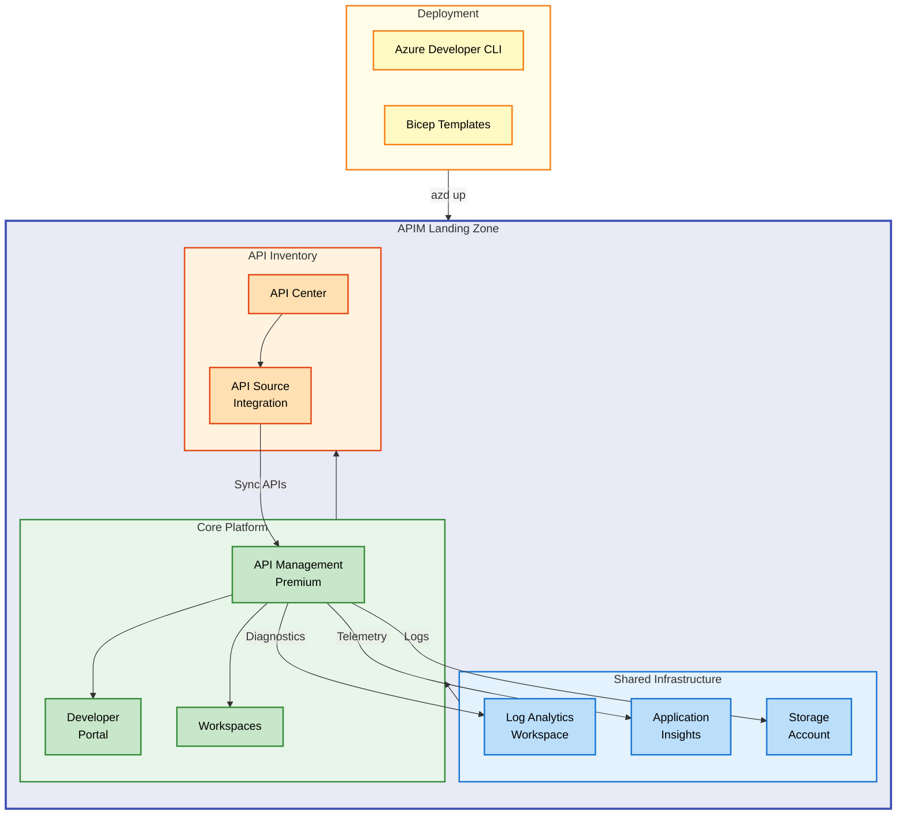

# APIM Accelerator


Deploy a production-ready Azure API Management landing zone with integrated monitoring, governance, and multi-team support using Infrastructure as Code.

**Overview**

The APIM Accelerator provides a complete, enterprise-grade API Management platform on Azure. It solves the challenge of deploying and managing API infrastructure consistently across environments by providing pre-configured Bicep templates that follow Azure best practices and Well-Architected Framework principles.

This accelerator targets platform engineers, DevOps teams, and cloud architects who need to establish a standardized API gateway solution. It delivers immediate value through automated deployment of monitoring infrastructure, API governance capabilities via API Center integration, and workspace-based team isolation—all deployable with a single command.

The solution differentiates itself by providing a holistic landing zone approach rather than individual resource deployments. It handles the complex orchestration between Log Analytics, Application Insights, API Management, and API Center, ensuring proper dependency management and secure configuration out of the box.

## 📑 Table of Contents

- [Architecture](#-architecture)
- [Features](#-features)
- [Requirements](#-requirements)
- [Quick Start](#-quick-start)
- [Deployment](#-deployment)
- [Usage](#-usage)
- [Configuration](#-configuration)
- [Contributing](#-contributing)
- [License](#-license)

## 🏗️ Architecture

**Overview**

The APIM Accelerator implements a layered architecture pattern that separates concerns across three deployment tiers. This design enables independent scaling, simplified troubleshooting, and clear ownership boundaries between infrastructure and application teams.

The architecture prioritizes observability by establishing monitoring infrastructure first, ensuring all subsequent components automatically integrate with Log Analytics and Application Insights. This approach guarantees comprehensive telemetry collection from the moment services are deployed.

The modular structure allows teams to customize individual layers without affecting others, supporting both greenfield deployments and integration with existing Azure environments.



### Component Overview

| Layer | Components | Purpose |
|-------|------------|---------|
| **Shared Infrastructure** | Log Analytics, Application Insights, Storage Account | Centralized monitoring and diagnostic log storage |
| **Core Platform** | API Management, Developer Portal, Workspaces | API gateway, self-service portal, team isolation |
| **API Inventory** | API Center, API Source Integration | API catalog, governance, and automatic discovery |

## ✨ Features

**Overview**

The APIM Accelerator delivers a comprehensive set of capabilities designed to accelerate API platform adoption within enterprise organizations. Each feature addresses specific operational challenges faced by platform teams managing API infrastructure at scale.

The feature set balances immediate deployment needs with long-term governance requirements. Teams can deploy quickly while maintaining visibility, control, and compliance across their API estate.

Integration between features is automatic—deploying the accelerator establishes connections between monitoring, security, and governance components without manual configuration.

| Feature | Description | Benefits |
|---------|-------------|----------|
| 🚀 **One-Command Deployment** | Deploy entire landing zone with `azd up` using Azure Developer CLI integration | Reduces deployment time from hours to minutes with consistent, repeatable infrastructure |
| 📊 **Integrated Monitoring** | Pre-configured Log Analytics, Application Insights, and diagnostic settings | Immediate visibility into API performance, errors, and usage patterns |
| 🏢 **Multi-Team Workspaces** | Logical API grouping with workspace-based isolation (Premium SKU) | Enables independent API lifecycle management per team without infrastructure overhead |
| 📋 **API Governance** | Azure API Center integration for centralized API catalog and compliance | Automatic API discovery, documentation, and governance policy enforcement |
| 🔐 **Managed Identity** | System-assigned and user-assigned identity support for secure Azure integration | Eliminates credential management and enables secure access to Key Vault and other services |
| 🌐 **Developer Portal** | Self-service portal with Azure AD authentication for API consumers | Reduces onboarding friction and enables self-service API discovery and testing |

## 📋 Requirements

**Overview**

The APIM Accelerator requires specific Azure services and tooling to ensure successful deployment and operation. These requirements establish the foundation for a secure, scalable API platform that meets enterprise standards.

Understanding these prerequisites helps teams plan capacity, estimate costs, and prepare their Azure environment before deployment. The Premium SKU requirement specifically enables advanced features like workspaces and multi-region deployment.

Alternative configurations are possible for development environments using Developer SKU, though production deployments should maintain Premium tier for SLA guarantees.

| Category | Requirements | More Information |
|----------|--------------|------------------|
| **Azure Subscription** | Active Azure subscription with Owner or Contributor role | [Azure Subscriptions](https://learn.microsoft.com/azure/cost-management-billing/manage/create-subscription) |
| **Azure CLI** | Version 2.50.0 or higher | [Install Azure CLI](https://learn.microsoft.com/cli/azure/install-azure-cli) |
| **Azure Developer CLI** | Version 1.0.0 or higher (azd) | [Install azd](https://learn.microsoft.com/azure/developer/azure-developer-cli/install-azd) |
| **Bicep CLI** | Version 0.22.0 or higher (included with Azure CLI) | [Bicep Installation](https://learn.microsoft.com/azure/azure-resource-manager/bicep/install) |
| **Permissions** | `Microsoft.ApiManagement/*`, `Microsoft.ApiCenter/*`, `Microsoft.OperationalInsights/*` | Required resource provider permissions |

> ⚠️ **Important**: The Premium SKU is required for workspace functionality. Developer SKU can be used for testing but lacks multi-team isolation features.

## 🚀 Quick Start

**Overview**

The Quick Start provides the fastest path to a running APIM landing zone. These commands deploy the complete infrastructure stack using default settings optimized for development and evaluation scenarios.

```bash
# Clone the repository
git clone https://github.com/Evilazaro/APIM-Accelerator.git
cd APIM-Accelerator

# Authenticate with Azure
azd auth login

# Deploy the landing zone
azd up
```

> 💡 **Tip**: The `azd up` command handles both `azd provision` (infrastructure) and `azd deploy` (configuration) in a single operation.

## 📦 Deployment

**Overview**

Deployment follows a three-phase approach: environment preparation, resource provisioning, and post-deployment validation. This structured process ensures consistent results across development, staging, and production environments.

The Azure Developer CLI orchestrates the entire deployment, executing pre-provision hooks to clean up soft-deleted resources and applying environment-specific configurations from the settings file.

### Step 1: Environment Setup

Configure your target environment and Azure region:

```bash
# Initialize the project with environment name
azd init --environment dev

# Set target Azure region
azd env set AZURE_LOCATION eastus
```

### Step 2: Configure Settings

Modify `infra/settings.yaml` for your environment:

```yaml
solutionName: "apim-accelerator"

core:
  apiManagement:
    publisherEmail: "your-email@domain.com"
    publisherName: "Your Organization"
    sku:
      name: "Premium"
      capacity: 1
```

### Step 3: Provision Infrastructure

```bash
# Provision Azure resources
azd provision
```

Expected output:

```plaintext
Provisioning Azure resources...
  Resource group: apim-accelerator-dev-eastus-rg
  Log Analytics Workspace: Created
  Application Insights: Created
  Storage Account: Created
  API Management: Created (may take 30-45 minutes)
  API Center: Created

SUCCESS: Your Azure resources have been provisioned.
```

### Step 4: Validate Deployment

```bash
# List deployed resources
az resource list --resource-group apim-accelerator-dev-eastus-rg --output table
```

## 💻 Usage

**Overview**

After deployment, the APIM landing zone provides several interaction points for platform administrators and API developers. The Azure portal offers a graphical interface, while CLI commands enable automation and scripting.

### Access the Developer Portal

The Developer Portal URL follows this pattern:

```plaintext
https://{apim-name}.developer.azure-api.net
```

### Manage Workspaces

Create additional workspaces for team isolation:

```bash
az apim workspace create \
  --resource-group apim-accelerator-dev-eastus-rg \
  --service-name {apim-name} \
  --workspace-id team-sales \
  --display-name "Sales Team APIs"
```

### View API Inventory

Access API Center to view discovered APIs:

```bash
az apic api list \
  --resource-group apim-accelerator-dev-eastus-rg \
  --service-name {apicenter-name} \
  --output table
```

## 🔧 Configuration

**Overview**

The APIM Accelerator centralizes all configuration in `infra/settings.yaml`, providing a single source of truth for environment-specific settings. This design simplifies management across multiple deployment targets and enables GitOps workflows.

Configuration follows a hierarchical structure with three main sections: shared infrastructure, core platform, and inventory services. Each section supports customization while maintaining sensible defaults for rapid deployment.

The tagging strategy supports enterprise governance requirements including cost allocation, compliance tracking, and operational ownership.

### Configuration File Structure

```yaml
# infra/settings.yaml

# Solution identifier for naming conventions
solutionName: "apim-accelerator"

# Shared services configuration
shared:
  monitoring:
    logAnalytics:
      identity:
        type: "SystemAssigned"
    applicationInsights:
      name: ""  # Auto-generated if empty
  tags:
    CostCenter: "CC-1234"
    BusinessUnit: "IT"
    Owner: "platform-team@domain.com"
    ServiceClass: "Critical"

# Core platform settings
core:
  apiManagement:
    publisherEmail: "api-admin@domain.com"
    publisherName: "Contoso"
    sku:
      name: "Premium"
      capacity: 1
    identity:
      type: "SystemAssigned"
    workspaces:
      - name: "workspace1"

# Inventory settings
inventory:
  apiCenter:
    identity:
      type: "SystemAssigned"
```

### Environment Variables

Override settings using Azure Developer CLI environment variables:

```bash
azd env set AZURE_LOCATION westus2
azd env set AZURE_SUBSCRIPTION_ID "your-subscription-id"
```

### SKU Options

| SKU | Use Case | Capacity Range |
|-----|----------|----------------|
| `Developer` | Development and testing only | 1 |
| `Basic` | Small-scale production | 1-2 |
| `Standard` | Medium-scale production | 1-4 |
| `Premium` | Enterprise with workspaces, multi-region | 1-10 |

> ⚠️ **Note**: Workspace functionality requires Premium SKU. See [API Management pricing](https://azure.microsoft.com/pricing/details/api-management/) for cost details.

## 🤝 Contributing

**Overview**

Contributions to the APIM Accelerator help improve API platform adoption across organizations. Whether fixing bugs, adding features, or improving documentation, community participation strengthens the accelerator for all users.

The project follows standard open-source practices with pull request reviews, automated testing, and semantic versioning. Contributors should familiarize themselves with the Bicep template structure before making infrastructure changes.

Quality standards include Bicep linting compliance, documentation updates for new features, and alignment with Azure Well-Architected Framework principles.

### How to Contribute

1. Fork the repository
2. Create a feature branch: `git checkout -b feature/your-feature`
3. Make changes following Bicep best practices
4. Test deployment in a development environment
5. Submit a pull request with clear description

### Development Setup

```bash
# Install Bicep linter
az bicep install

# Validate templates
az bicep build --file infra/main.bicep

# Run what-if deployment
az deployment sub what-if \
  --location eastus \
  --template-file infra/main.bicep \
  --parameters envName=dev location=eastus
```

> 💡 **Tip**: Use `az bicep build` to catch syntax errors before committing changes.

## 📝 License

This project is licensed under the MIT License. See the [LICENSE](LICENSE) file for details.

Copyright (c) 2025 Evilázaro Alves
