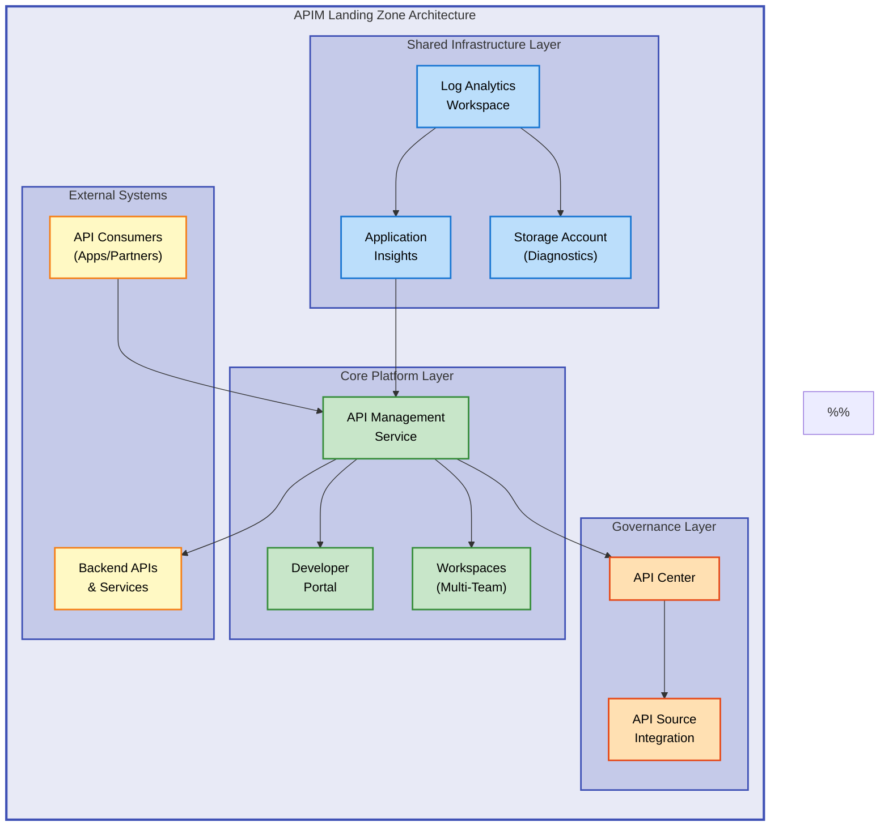

# APIM Accelerator


Enterprise-grade Infrastructure as Code (IaC) accelerator for deploying Azure API Management landing zones with integrated monitoring, governance, and multi-workspace support.

**Overview**

The APIM Accelerator provides a production-ready deployment solution for Azure API Management, addressing the complexity of setting up enterprise-scale API platforms. Organizations often struggle with configuring APIM alongside monitoring infrastructure, API governance, and multi-team isolation. This accelerator eliminates months of configuration work by providing battle-tested Bicep templates that implement Azure best practices for security, observability, and scalability. Designed for platform engineers and cloud architects, it enables rapid deployment of APIM environments across development, staging, and production with consistent configuration patterns.

The solution orchestrates three critical layers: shared monitoring infrastructure (Log Analytics, Application Insights), core APIM services with premium capabilities, and API Center for centralized governance. By using declarative Bicep modules, teams can customize deployments through simple YAML configuration files while maintaining infrastructure consistency. The accelerator supports multiple SKU tiers, managed identities, multi-region deployments, and workspace-based team isolation. This approach reduces deployment time from weeks to hours while ensuring compliance with enterprise security and monitoring standards.

Organizations benefit from reduced operational overhead, faster time-to-production for API initiatives, and a foundation that scales from small teams to enterprise-wide API programs. The modular architecture allows teams to extend capabilities while preserving upgrade paths and maintaining alignment with Azure's evolving API Management features.

## Table of Contents

- [Architecture](#-architecture)
- [Quick Start](#-quick-start)
- [Deployment](#-deployment)
- [Usage](#-usage)
- [Features](#-features)
- [Requirements](#-requirements)
- [Configuration](#-configuration)
- [Contributing](#-contributing)
- [License](#-license)

## 🏗️ Architecture

**Overview**

The APIM Accelerator architecture follows a layered approach that separates concerns across shared infrastructure, core platform services, and governance capabilities. This design philosophy ensures that monitoring and logging foundations are established before application services, enabling comprehensive observability from day one. The architecture supports both single-region and multi-region deployments, with each layer independently scalable to meet organizational growth.

The deployment model uses Azure subscription-level orchestration to create isolated resource groups for each component, enabling granular RBAC controls and cost management. Managed identities flow through the stack to eliminate credential management overhead, while diagnostic settings automatically route telemetry to centralized Log Analytics workspaces. This architecture scales from proof-of-concept environments with Developer SKU to global production deployments with Premium SKU multi-region capabilities.



## 🚀 Quick Start

**Overview**

Getting started with the APIM Accelerator requires minimal prerequisites and takes approximately 15-20 minutes for a complete deployment. The quick start path uses Azure Developer CLI (`azd`) to automate the entire provisioning and deployment workflow, from resource group creation to final service configuration. This approach is ideal for teams evaluating the accelerator or setting up development environments quickly.

The `azd up` command orchestrates pre-provision validation, Bicep template deployment, and post-deployment verification in a single operation. By default, the deployment provisions a Developer SKU APIM instance suitable for non-production workloads. Teams can immediately begin importing APIs and configuring policies without manual infrastructure setup.

```bash
# Clone repository and deploy
git clone https://github.com/Evilazaro/APIM-Accelerator.git
cd APIM-Accelerator
azd up
```

> 💡 **Tip**: Use `azd init` first if you need to customize the default environment name or region before deployment.

## 📦 Deployment

**Overview**

The deployment process supports multiple workflows to accommodate different organizational requirements and infrastructure maturity levels. Teams can use Azure Developer CLI for rapid provisioning, native Azure CLI for granular control, or integrate Bicep templates into existing CI/CD pipelines. Each deployment method follows the same orchestration pattern: shared infrastructure first, followed by core APIM services, and finally governance components.

The accelerator uses a subscription-scoped deployment model that creates three resource groups automatically, ensuring logical separation of concerns and simplified access management. Configuration values are centralized in `infra/settings.yaml`, allowing teams to version-control environment-specific settings while maintaining consistent deployment logic across environments.

### Prerequisites

Ensure the following tools and permissions are available:

1. **Azure CLI** version 2.50.0 or later: `az --version`
2. **Azure Developer CLI**: `azd version`
3. **Azure subscription** with Contributor or Owner role
4. **Bicep CLI** (bundled with Azure CLI 2.20.0+)

> ⚠️ **Prerequisites**: Premium SKU deployments require quota approval for multi-region capabilities. Request quota increases before deployment to avoid provisioning failures.

### Deployment Steps

#### Option 1: Azure Developer CLI (Recommended)

```bash
# Initialize environment (first-time only)
azd init

# Provision all infrastructure and deploy
azd up

# Or provision infrastructure only
azd provision

# View deployment status
azd show
```

#### Option 2: Azure CLI with Bicep

```bash
# Set deployment parameters
LOCATION="eastus"
ENV_NAME="dev"

# Deploy infrastructure at subscription scope
az deployment sub create \
  --location $LOCATION \
  --template-file infra/main.bicep \
  --parameters envName=$ENV_NAME location=$LOCATION

# Verify deployment
az deployment sub show --name main
```

#### Option 3: CI/CD Integration

```yaml
# Example GitHub Actions workflow snippet
- name: Deploy APIM Landing Zone
  run: |
    az login --service-principal -u ${{ secrets.AZURE_CLIENT_ID }} -p ${{ secrets.AZURE_CLIENT_SECRET }} --tenant ${{ secrets.AZURE_TENANT_ID }}
    az deployment sub create --location eastus --template-file infra/main.bicep --parameters @infra/main.parameters.json
```

### Verification

After deployment completes (typically 15-20 minutes), verify the infrastructure:

```bash
# Check resource groups
az group list --query "[?contains(name, 'apim-accelerator')]" -o table

# Verify APIM service
az apim show --name <apim-name> --resource-group <rg-name> --query "{name:name, state:provisioningState, sku:sku.name}"

# Test developer portal URL
echo "Developer Portal: https://<apim-name>.developer.azure-api.net"
```

## 💻 Usage

**Overview**

Once deployed, the APIM Accelerator provides immediate access to a fully configured API Management environment with monitoring and governance pre-integrated. Teams can begin onboarding APIs, creating products, and configuring policies through the Azure Portal, Azure CLI, or Bicep/ARM templates. The developer portal is automatically provisioned and configured with Azure AD authentication, enabling self-service API consumption for internal and external developers.

Common usage patterns include importing OpenAPI specifications, configuring subscription-based access control, and setting up rate limiting policies. The workspace feature (Premium SKU) enables multi-team isolation, allowing different teams to manage their APIs independently while sharing the underlying infrastructure. All API operations automatically flow telemetry to Application Insights, providing real-time performance visibility.

### Import an API

```bash
# Import OpenAPI specification into APIM
az apim api import \
  --resource-group <resource-group-name> \
  --service-name <apim-service-name> \
  --path /petstore \
  --specification-url https://petstore.swagger.io/v2/swagger.json \
  --specification-format OpenApiJson \
  --api-id petstore-api
```

**Expected output:**

```json
{
  "apiId": "petstore-api",
  "displayName": "Swagger Petstore",
  "path": "petstore",
  "protocols": ["https"],
  "subscriptionRequired": true
}
```

### Configure Workspace (Premium SKU)

```bash
# Create workspace for team isolation
az apim workspace create \
  --resource-group <resource-group-name> \
  --service-name <apim-service-name> \
  --workspace-id marketing-apis \
  --display-name "Marketing Team APIs"

# Assign API to workspace
az apim api update \
  --resource-group <resource-group-name> \
  --service-name <apim-service-name> \
  --api-id petstore-api \
  --workspace-id marketing-apis
```

### Query API Metrics

```bash
# View API request metrics in Application Insights
az monitor app-insights metrics show \
  --app <app-insights-name> \
  --resource-group <resource-group-name> \
  --metric requests/count \
  --aggregation count \
  --interval PT1H
```

## ✨ Features

**Overview**

The APIM Accelerator delivers a comprehensive set of capabilities designed to eliminate common deployment friction and accelerate time-to-value for API initiatives. Each feature addresses specific enterprise requirements around security, observability, governance, and operational efficiency. These capabilities are built on Azure best practices and reflect patterns validated across hundreds of production deployments.

The feature set balances immediate usability with long-term extensibility, enabling teams to start with basic API management and progressively adopt advanced capabilities like multi-region failover, workspace isolation, and centralized governance as organizational needs evolve.

| Feature                      | Description                                                                                       | Benefits                                                                                                                                     |
| ---------------------------- | ------------------------------------------------------------------------------------------------- | -------------------------------------------------------------------------------------------------------------------------------------------- |
| 🔐 **Managed Identity**      | System or user-assigned managed identities for all services with automatic credential rotation    | Eliminates secret management overhead, reduces security vulnerabilities, and simplifies compliance audits by removing hard-coded credentials |
| 📊 **Integrated Monitoring** | Pre-configured Application Insights and Log Analytics with diagnostic settings for all components | Provides immediate visibility into API performance, error rates, and usage patterns without manual instrumentation or log configuration      |
| 🌍 **Multi-Region Support**  | Premium SKU capability for active-active deployments across Azure regions                         | Ensures high availability, reduces latency for global consumers, and enables disaster recovery with automatic traffic failover               |
| 🏢 **Workspace Isolation**   | Logical API grouping with RBAC for multi-team environments (Premium SKU)                          | Enables self-service API management for different teams while maintaining centralized governance, cost allocation, and security controls     |
| 📚 **API Governance**        | Azure API Center integration for centralized catalog, documentation, and compliance tracking      | Improves API discoverability, enforces design standards, and provides audit trails for regulatory compliance and change management           |

## 📋 Requirements

**Overview**

Successfully deploying the APIM Accelerator requires specific Azure subscriptions, permissions, and tooling. These requirements ensure that the deployment automation can provision resources, assign roles, and configure services without interruption. Organizations should validate these prerequisites before initiating deployments to avoid mid-deployment failures.

The requirements vary by SKU tier, with Premium tier deployments requiring additional quota approvals for multi-region capabilities. Development and staging environments can use Developer or Standard SKUs with lower resource requirements, while production workloads should provision Premium SKU for SLA guarantees and advanced features.

| Category               | Requirements                                                                                                                 | More Information                                                                                                                |
| ---------------------- | ---------------------------------------------------------------------------------------------------------------------------- | ------------------------------------------------------------------------------------------------------------------------------- |
| **Azure Subscription** | Active Azure subscription with Contributor or Owner role at subscription scope                                               | [Azure subscription guide](https://learn.microsoft.com/azure/cost-management-billing/manage/create-subscription)                |
| **Runtime & Tools**    | Azure CLI 2.50.0+, Azure Developer CLI, Bicep CLI (bundled with Azure CLI 2.20.0+)                                           | [Install Azure CLI](https://learn.microsoft.com/cli/azure/install-azure-cli)                                                    |
| **Permissions**        | Microsoft.ApiManagement, Microsoft.OperationalInsights, Microsoft.Insights, Microsoft.Storage resource provider registration | [Register resource providers](https://learn.microsoft.com/azure/azure-resource-manager/management/resource-providers-and-types) |
| **Network**            | Outbound connectivity to Azure management endpoints (management.azure.com, \*.blob.core.windows.net)                         | [Azure IP ranges](https://www.microsoft.com/download/details.aspx?id=56519)                                                     |
| **Quota**              | Premium SKU requires 1+ units quota in target regions; Developer SKU 1 unit (default)                                        | [Request quota increase](https://learn.microsoft.com/azure/quotas/quickstart-increase-quota-portal)                             |
| **Source Control**     | Git client for cloning repository                                                                                            | [Install Git](https://git-scm.com/downloads)                                                                                    |

## 🔧 Configuration

**Overview**

The accelerator uses a declarative configuration model based on YAML files that define infrastructure settings, SKU selections, tagging strategies, and service-specific parameters. This approach separates environment-specific values from deployment logic, enabling teams to maintain multiple environment configurations (dev, staging, production) while using identical Bicep templates. Configuration changes are version-controlled and auditable, providing infrastructure change tracking.

The `infra/settings.yaml` file serves as the single source of truth for deployment parameters, including APIM SKU selection, managed identity types, workspace definitions, and resource naming patterns. Teams can customize tagging schemes, monitoring retention periods, and multi-region configurations by editing this file before deployment.

### Configuration File Structure

All deployment settings are defined in `infra/settings.yaml`:

```yaml
# Solution identifier for resource naming
solutionName: "apim-accelerator"

# Shared monitoring configuration
shared:
  monitoring:
    logAnalytics:
      name: "" # Auto-generated if empty
      identity:
        type: "SystemAssigned"
    applicationInsights:
      name: "" # Auto-generated if empty

# Core APIM configuration
core:
  apiManagement:
    name: "" # Auto-generated if empty
    publisherEmail: "your-email@example.com"
    publisherName: "Your Organization"
    sku:
      name: "Premium" # Options: Developer, Basic, Standard, Premium, Consumption
      capacity: 1 # Scale units (Premium: 1-10, Standard: 1-4)
    identity:
      type: "SystemAssigned"
    workspaces:
      - name: "workspace1" # Premium SKU only

# API governance configuration
inventory:
  apiCenter:
    name: "" # Auto-generated if empty
    identity:
      type: "SystemAssigned"
```

### Environment Variables

Set environment variables for deployment automation:

```bash
# Azure authentication
export AZURE_SUBSCRIPTION_ID="your-subscription-id"
export AZURE_TENANT_ID="your-tenant-id"

# Deployment parameters
export AZURE_LOCATION="eastus"
export AZURE_ENV_NAME="production"

# Optional: Override default settings
export APIM_SKU_NAME="Premium"
export APIM_SKU_CAPACITY="2"
```

### Customization Examples

**Change SKU for cost optimization:**

Edit `infra/settings.yaml`:

```yaml
core:
  apiManagement:
    sku:
      name: "Developer" # Lower cost for non-production
      capacity: 1
```

**Add custom tags for cost allocation:**

```yaml
shared:
  tags:
    CostCenter: "CC-5678"
    BusinessUnit: "Engineering"
    Owner: "platform-team@example.com"
```

**Configure multi-region deployment (Premium SKU):**

Premium SKU supports additional regions beyond the primary location. Configure via Azure CLI post-deployment:

```bash
az apim update \
  --name <apim-name> \
  --resource-group <rg-name> \
  --add-regions "West US 2" --add-regions "North Europe" \
  --no-wait
```

## 🤝 Contributing

**Overview**

The APIM Accelerator welcomes contributions from the community to enhance capabilities, fix issues, and extend platform support. Contributions directly impact organizations adopting Azure API Management by improving template quality, adding new deployment patterns, and documenting best practices. The project maintains high standards for code quality, security, and documentation to ensure reliability for production deployments.

Contributors should focus on modular enhancements that preserve backward compatibility and follow Azure naming conventions. The maintainer team reviews all pull requests for alignment with Azure best practices, Bicep linting standards, and infrastructure-as-code principles. Community contributions have led to multi-region support improvements, enhanced monitoring configurations, and expanded SKU support.

1. Fork the repository
2. Create a feature branch: `git checkout -b feature/your-feature-name`
3. Make changes following Bicep best practices
4. Test deployment in a non-production Azure subscription
5. Submit pull request with detailed description of changes

> 💡 **Tip**: Run `az bicep build --file infra/main.bicep` to validate Bicep syntax before committing changes.

Please review issues labeled `good-first-issue` for beginner-friendly contributions.

## 📝 License

This project is licensed under the MIT License - see the [LICENSE](LICENSE) file for details.

Copyright (c) 2025 Evilázaro Alves
