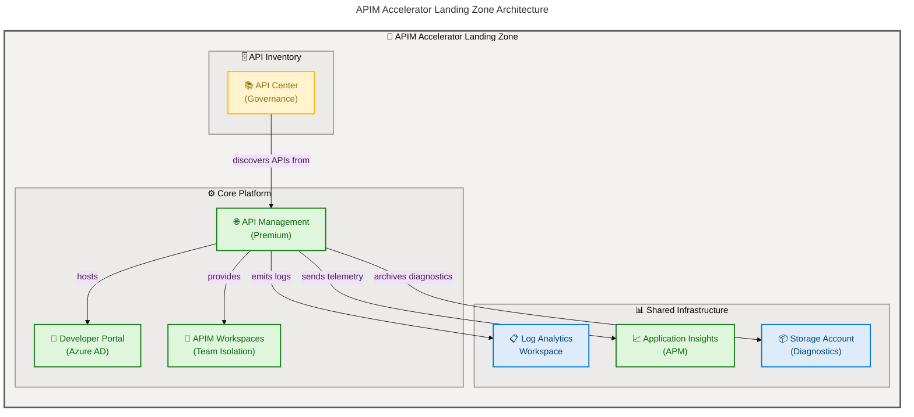

# APIM Accelerator


An enterprise-grade Azure API Management Landing Zone accelerator that automates the deployment of a complete API platform using Infrastructure as Code (Bicep) and Azure Developer CLI (`azd`).

**Overview**

This accelerator eliminates weeks of manual Azure infrastructure setup by providing production-ready Bicep templates that deploy a fully integrated API Management landing zone in a single command. Platform engineering teams, cloud architects, and DevOps engineers use this accelerator to establish a repeatable, governed, and observable API platform that scales across development, staging, and production environments.

The solution uses a modular 3-tier deployment pattern orchestrated by Azure Developer CLI (`azd`). Shared monitoring infrastructure provisions first, followed by the core API Management platform with developer portal and workspaces, and finally the API inventory layer for centralized governance. This layered approach ensures correct dependency resolution, consistent environments, and independent module updates without impacting the entire stack.

> [!NOTE]
> This accelerator follows the [Azure Landing Zone](https://learn.microsoft.com/azure/cloud-adoption-framework/ready/landing-zone/) methodology and targets organizations adopting a platform engineering approach to API management at scale.

## Table of Contents

- [Architecture](#%EF%B8%8F-architecture)
- [Features](#-features)
- [Requirements](#-requirements)
- [Quick Start](#-quick-start)
- [Deployment](#-deployment)
- [Usage](#-usage)
- [Configuration](#-configuration)
- [Contributing](#-contributing)
- [License](#-license)

## 🏗️ Architecture

The APIM Accelerator deploys at the Azure subscription scope, creating a single resource group that contains three deployment tiers. Each tier builds upon the previous one, ensuring that monitoring infrastructure exists before the API gateway starts emitting telemetry, and that the API platform is operational before the inventory layer attempts API discovery.

The architecture separates concerns into independently deployable Bicep modules — shared infrastructure handles observability across the entire landing zone, the core platform manages the API gateway lifecycle, and the inventory layer provides a centralized API catalog for governance and discoverability.


```mermaid
---
title: APIM Accelerator Landing Zone Architecture
config:
  theme: base
  look: classic
  layout: dagre
  flowchart:
    htmlLabels: true
---
flowchart TB
    accTitle: APIM Accelerator Landing Zone Architecture
    accDescr: Shows the 3-tier deployment of shared monitoring, core API Management platform, and API inventory within a single Azure resource group

    %% AZURE / FLUENT v1.1
    %% PHASE 1 - STRUCTURAL: Direction explicit, flat topology, nesting ≤ 3
    %% PHASE 2 - SEMANTIC: Colors justified, max 5 semantic classes, neutral-first
    %% PHASE 3 - FONT: Dark text on light backgrounds, contrast ≥ 4.5:1
    %% PHASE 4 - ACCESSIBILITY: accTitle/accDescr present, icons on all nodes
    %% PHASE 5 - STANDARD: Governance block present, classDefs centralized
    %% ═══════════════════════════════════════════════════════════════════════════

    subgraph landingZone["🏢 APIM Accelerator Landing Zone"]
        direction TB

        subgraph sharedInfra["📊 Shared Infrastructure"]
            law["📋 Log Analytics<br/>Workspace"]:::core
            storage["📦 Storage Account<br/>(Diagnostics)"]:::core
            appInsights["📈 Application Insights<br/>(APM)"]:::success
        end

        subgraph corePlatform["⚙️ Core Platform"]
            apim["🌐 API Management<br/>(Premium)"]:::success
            devPortal["🔑 Developer Portal<br/>(Azure AD)"]:::success
            workspaces["👥 APIM Workspaces<br/>(Team Isolation)"]:::success
        end

        subgraph apiInventory["🗄️ API Inventory"]
            apiCenter["📚 API Center<br/>(Governance)"]:::warning
        end

        apim -->|"emits logs"| law
        apim -->|"sends telemetry"| appInsights
        apim -->|"archives diagnostics"| storage
        apim -->|"hosts"| devPortal
        apim -->|"provides"| workspaces
        apiCenter -->|"discovers APIs from"| apim
    end

    %% SUBGRAPH STYLING (4 subgraphs = 4 style directives)
    style landingZone fill:#F3F2F1,stroke:#605E5C,stroke-width:3px
    style sharedInfra fill:#EDEBE9,stroke:#A19F9D,stroke-width:2px
    style corePlatform fill:#EDEBE9,stroke:#A19F9D,stroke-width:2px
    style apiInventory fill:#EDEBE9,stroke:#A19F9D,stroke-width:2px

    %% Centralized semantic classDefs (Phase 5 compliant)
    classDef core fill:#DEECF9,stroke:#0078D4,stroke-width:2px,color:#004578
    classDef success fill:#DFF6DD,stroke:#107C10,stroke-width:2px,color:#0B6A0B
    classDef warning fill:#FFF4CE,stroke:#FFB900,stroke-width:2px,color:#986F0B

    %% Accessibility: WCAG AA verified (4.5:1 contrast ratio)
```

**Component Responsibilities**

| Component                    | Purpose                                                                         | Key Capabilities                                                                               |
| ---------------------------- | ------------------------------------------------------------------------------- | ---------------------------------------------------------------------------------------------- |
| 📊 **Shared Infrastructure** | Provides the observability foundation for the entire landing zone               | Log Analytics workspace, Storage Account for diagnostic archival, Application Insights for APM |
| ⚙️ **Core Platform**         | Delivers the API gateway, developer experience, and team isolation capabilities | API Management (Premium SKU), Developer Portal with Azure AD, APIM Workspaces                  |
| 🗄️ **API Inventory**         | Enables centralized API governance, discovery, and compliance tracking          | API Center with managed identity, APIM source integration, RBAC role assignments               |

## ✨ Features

**Overview**

This accelerator delivers seven production-ready capabilities that address the full API management lifecycle — from infrastructure observability through API governance. Each feature integrates with Azure-native services to minimize operational overhead and maximize consistency across environments.

The features work together as a cohesive platform: monitoring captures telemetry from the API gateway, the developer portal enables self-service API consumption, workspaces provide team-level isolation, and API Center creates a single catalog for governance and discoverability. This integrated approach ensures that every API published through the gateway is automatically monitored, documented, and governed.

| Feature                         | Description                                                                                                                                                                                                                                                                                                                                                                                                                                                                                                          |
| ------------------------------- | -------------------------------------------------------------------------------------------------------------------------------------------------------------------------------------------------------------------------------------------------------------------------------------------------------------------------------------------------------------------------------------------------------------------------------------------------------------------------------------------------------------------- |
| 📊 **Comprehensive Monitoring** | Deploys Log Analytics, Application Insights, and a Storage Account as a unified observability stack that captures telemetry across the entire landing zone. Without centralized monitoring, teams lose visibility into API performance, error rates, and usage patterns — making incident response reactive instead of proactive. The accelerator configures diagnostic settings on every resource automatically, routing logs to Log Analytics and archiving them to Storage with a single `azd provision` command. |
| 🌐 **API Management**           | Provisions Azure API Management as the central gateway for all API traffic with configurable SKU tiers from Developer through Premium. Organizations need a managed gateway to enforce security policies, rate limiting, and request transformation without burdening individual API teams. The Bicep module accepts SKU, identity, VNet, and public access parameters through `infra/settings.yaml`, enabling environment-specific configurations without modifying infrastructure code.                            |
| 🔑 **Developer Portal**         | Configures the APIM Developer Portal with Azure AD authentication (MSAL 2.0), CORS policies, and customizable sign-in/sign-up settings. API consumers need a self-service portal to discover, test, and subscribe to APIs without requiring direct coordination with platform teams. The `src/core/developer-portal.bicep` module sets up the identity provider, allowed tenants, and terms of service as code — ensuring portal configuration stays consistent across environments.                                 |
| 👥 **APIM Workspaces**          | Creates logical workspaces within the API Management instance for team-level API isolation on a shared gateway. Multiple teams publishing APIs to a single APIM instance need boundaries that prevent configuration conflicts and enable independent lifecycle management. Workspaces are defined as an array in `infra/settings.yaml` under `core.apiManagement.workspaces` and require Premium SKU.                                                                                                                |
| 📚 **API Center Integration**   | Deploys Azure API Center with managed identity and automatic APIM source linking to create a centralized API catalog. Without a governance layer, APIs proliferate across the organization with no visibility into duplicates, compliance gaps, or ownership. The `src/inventory/main.bicep` module creates the API Center, connects it to APIM as a source, and assigns Data Reader and Compliance Manager RBAC roles to the managed identity.                                                                      |
| 🏷️ **Governance Tags**          | Applies 10 enterprise governance tags — including CostCenter, BusinessUnit, Owner, ServiceClass, and RegulatoryCompliance — to every deployed resource. Tagging is critical for cost allocation, compliance audits, and operational accountability in enterprise Azure environments. Tags are defined in `infra/settings.yaml` under `shared.tags` and merged into every module deployment via the `union()` function in `infra/main.bicep`.                                                                         |
| 🧹 **Pre-Provision Cleanup**    | Runs an automated `azd` pre-provision hook that detects and purges soft-deleted APIM instances before deployment. Azure retains soft-deleted APIM resources for 48 hours, which causes name-conflict failures when redeploying to the same subscription. The `infra/azd-hooks/pre-provision.sh` script queries for soft-deleted instances matching the solution name and purges them, ensuring clean reprovisioning.                                                                                                 |

## 📋 Requirements

**Overview**

Meeting these prerequisites ensures a successful first deployment and avoids common provisioning failures. Each requirement addresses a specific dependency in the deployment pipeline — the Azure CLI authenticates against your subscription, `azd` orchestrates the Bicep deployment, and a bash-compatible shell executes the pre-provision hook that purges soft-deleted resources.

Verify all requirements before running `azd up` to prevent partial deployments that require manual cleanup. The Premium SKU specifically requires sufficient subscription quota, and the pre-provision hook requires bash, which means Windows users need Git Bash, WSL, or Azure Cloud Shell.

| Category         | Requirement                        | Details                                                                                    |
| ---------------- | ---------------------------------- | ------------------------------------------------------------------------------------------ |
| ☁️ **Azure**     | Active Azure subscription          | [Create a free account](https://azure.microsoft.com/free/)                                 |
| ☁️ **Azure**     | Subscription-level permissions     | Contributor or Owner role required for resource group creation                             |
| 🔧 **CLI Tools** | Azure CLI 2.67+                    | [Install Azure CLI](https://learn.microsoft.com/cli/azure/install-azure-cli)               |
| 🔧 **CLI Tools** | Azure Developer CLI (`azd`)        | [Install azd](https://learn.microsoft.com/azure/developer/azure-developer-cli/install-azd) |
| 🔧 **CLI Tools** | Bicep CLI (bundled with Azure CLI) | [Bicep overview](https://learn.microsoft.com/azure/azure-resource-manager/bicep/overview)  |
| 🐚 **Shell**     | Bash-compatible shell              | Required for pre-provision hook (Git Bash, WSL, or Azure Cloud Shell on Windows)           |

> [!IMPORTANT]
> The default configuration deploys API Management with **Premium SKU** (1 unit), which incurs significant Azure costs. Change `sku.name` in `infra/settings.yaml` to `Developer` for non-production testing.

## 🚀 Quick Start

Deploy the entire APIM landing zone with a single command. This workflow clones the repository, authenticates with Azure, and provisions all three infrastructure tiers sequentially.

```bash
git clone https://github.com/Evilazaro/APIM-Accelerator.git
cd APIM-Accelerator
```

**Expected output:**

```text
Cloning into 'APIM-Accelerator'...
remote: Enumerating objects: done.
remote: Total 150, reused 150
Receiving objects: 100% (150/150), done.
```

```bash
azd auth login
```

**Expected output:**

```text
Logged in to Azure.
```

```bash
azd up
```

**Expected output:**

```text
? Select an Azure Subscription to use:  <your-subscription>
? Select an Azure location to use:  <your-location>

Packaging services (azd package)
  (✓) Done: Packaging service

Provisioning Azure resources (azd provision)
  Provisioning Azure resources can take some time.

  (✓) Done: Resource group: apim-accelerator-dev-eastus2-rg

SUCCESS: Your application was provisioned in Azure.
```

> [!TIP]
> Run `azd up` from [Azure Cloud Shell](https://learn.microsoft.com/azure/cloud-shell/overview) for the fastest setup experience — all required CLI tools and bash are pre-installed.

## 📦 Deployment

The deployment process executes three sequential phases. The `azd` pre-provision hook runs first to purge any soft-deleted APIM instances, then Bicep modules deploy in dependency order: shared infrastructure, core platform, and API inventory.

### Step 1: Authenticate and Initialize

```bash
az login
azd auth login
azd init
```

**Expected output:**

```text
Initializing an app in '/path/to/APIM-Accelerator'
  (✓) Done: Initialized app
```

### Step 2: Configure Environment

```bash
azd env new dev
azd env set AZURE_LOCATION eastus2
```

**Expected output:**

```text
New environment 'dev' created.
AZURE_LOCATION set to eastus2.
```

### Step 3: Deploy Infrastructure

```bash
azd provision
```

**Expected output:**

```text
Provisioning Azure resources (azd provision)

  Executing preprovision hook => ./infra/azd-hooks/pre-provision.sh
  (✓) Done: Preprovision hook

  Subscription: <your-subscription-id>
  Location: eastus2

  (✓) Done: Resource group: apim-accelerator-dev-eastus2-rg
  (✓) Done: Log Analytics workspace
  (✓) Done: Storage Account
  (✓) Done: Application Insights
  (✓) Done: API Management (this step takes 30-45 minutes for Premium SKU)
  (✓) Done: Developer Portal configuration
  (✓) Done: APIM Workspaces
  (✓) Done: API Center

SUCCESS: Your application was provisioned in Azure.
```

> [!WARNING]
> API Management Premium SKU provisioning takes **30–45 minutes**. Do not cancel the deployment during this time. If provisioning fails, run `azd down` to clean up resources before retrying.

### Step 4: Verify Deployment

```bash
az resource list --resource-group "apim-accelerator-dev-eastus2-rg" --output table
```

**Expected output:**

```text
Name                                    ResourceGroup                        Location    Type
--------------------------------------  -----------------------------------  ----------  ----------------------------------------
apim-accelerator-dev-xxxx               apim-accelerator-dev-eastus2-rg      eastus2     Microsoft.ApiManagement/service
apim-accelerator-dev-law-xxxx           apim-accelerator-dev-eastus2-rg      eastus2     Microsoft.OperationalInsights/workspaces
apim-accelerator-dev-ai-xxxx            apim-accelerator-dev-eastus2-rg      eastus2     Microsoft.Insights/components
apim-accelerator-dev-xxxx               apim-accelerator-dev-eastus2-rg      eastus2     Microsoft.Storage/storageAccounts
apim-accelerator-dev-xxxx               apim-accelerator-dev-eastus2-rg      eastus2     Microsoft.ApiCenter/services
```

## 💻 Usage

After deployment completes, use these operational commands to manage and interact with the provisioned landing zone resources. This section covers day-to-day management tasks, not initial setup (see [Quick Start](#-quick-start)) or infrastructure provisioning (see [Deployment](#-deployment)).

### View API Management Details

```bash
az apim show --name "<apim-name>" --resource-group "apim-accelerator-dev-eastus2-rg" --output table
```

**Expected output:**

```text
Name                          Location    Sku       VirtualNetworkType    ProvisioningState
----------------------------  ----------  --------  --------------------  -------------------
apim-accelerator-dev-xxxx     eastus2     Premium   None                  Succeeded
```

### Access the Developer Portal

```bash
az apim show --name "<apim-name>" --resource-group "apim-accelerator-dev-eastus2-rg" --query "developerPortalUrl" --output tsv
```

**Expected output:**

```text
https://apim-accelerator-dev-xxxx.developer.azure-api.net
```

### Query Application Insights Telemetry

```bash
az monitor app-insights query --app "<app-insights-name>" --resource-group "apim-accelerator-dev-eastus2-rg" --analytics-query "requests | summarize count() by resultCode | order by count_ desc" --output table
```

**Expected output:**

```text
ResultCode    Count
------------  -------
200           1250
404           15
500           3
```

### Update and Redeploy

```bash
azd provision
```

**Expected output:**

```text
Provisioning Azure resources (azd provision)
  (✓) Done: No changes detected. Resources are up to date.

SUCCESS: Your application was provisioned in Azure.
```

### Tear Down the Environment

```bash
azd down --force --purge
```

**Expected output:**

```text
Deleting all resources and purging soft-deleted resources...
  (✓) Done: Deleted resource group: apim-accelerator-dev-eastus2-rg
  (✓) Done: Purged API Management soft-delete

SUCCESS: Your application was removed from Azure.
```

## 🔧 Configuration

**Overview**

All infrastructure settings are centralized in `infra/settings.yaml`, which serves as the single source of truth for resource naming, SKU selection, identity configuration, and governance tags. This file-driven approach ensures that every environment deploys identically — only the `azd` environment variables (`AZURE_ENV_NAME`, `AZURE_LOCATION`) differ between development, staging, and production.

The configuration follows a hierarchical pattern where shared settings (monitoring, tags) apply across all modules, core settings control the API gateway behavior, and inventory settings manage the API catalog. Modify `infra/settings.yaml` to customize the landing zone for your organization's requirements, then run `azd provision` to apply changes incrementally.

### Configuration Files

| File                                  | Purpose                                  | Key Settings                                                    |
| ------------------------------------- | ---------------------------------------- | --------------------------------------------------------------- |
| ⚙️ `infra/settings.yaml`              | Centralized infrastructure configuration | Solution name, monitoring, APIM SKU, identity, workspaces, tags |
| 📍 `infra/main.parameters.json`       | Azure Developer CLI parameter injection  | `AZURE_ENV_NAME`, `AZURE_LOCATION` (populated by `azd`)         |
| 🔗 `azure.yaml`                       | `azd` project definition                 | Project name, pre-provision hook reference                      |
| 🧹 `infra/azd-hooks/pre-provision.sh` | Pre-deployment cleanup script            | Soft-delete detection and purge logic                           |

### API Management Settings

| Setting                 | Path                               | Default          | Options                                                                             |
| ----------------------- | ---------------------------------- | ---------------- | ----------------------------------------------------------------------------------- |
| ⚙️ **SKU Tier**         | `core.apiManagement.sku.name`      | `Premium`        | `Developer`, `Basic`, `BasicV2`, `Standard`, `StandardV2`, `Premium`, `Consumption` |
| 📊 **Scale Units**      | `core.apiManagement.sku.capacity`  | `1`              | `1`–`10` (Premium), `1`–`4` (Standard)                                              |
| 🔐 **Identity Type**    | `core.apiManagement.identity.type` | `SystemAssigned` | `SystemAssigned`, `UserAssigned`, `SystemAssigned,UserAssigned`, `None`             |
| 🌐 **VNet Integration** | `src/core/apim.bicep` parameter    | `None`           | `None`, `External`, `Internal`                                                      |
| 🔓 **Public Network**   | `src/core/apim.bicep` parameter    | `Enabled`        | `Enabled`, `Disabled`                                                               |
| 🖥️ **Developer Portal** | `src/core/apim.bicep` parameter    | `Enabled`        | `Enabled`, `Disabled`                                                               |
| 👥 **Workspaces**       | `core.apiManagement.workspaces`    | `["workspace1"]` | Array of workspace names (Premium SKU only)                                         |

### Monitoring Settings

| Setting                   | Path                                                 | Default        | Description                                        |
| ------------------------- | ---------------------------------------------------- | -------------- | -------------------------------------------------- |
| 📋 **Log Analytics Name** | `shared.monitoring.logAnalytics.name`                | Auto-generated | Leave empty for convention-based naming            |
| 📋 **Existing Workspace** | `shared.monitoring.logAnalytics.workSpaceResourceId` | Empty          | Provide resource ID to reuse an existing workspace |
| 📈 **App Insights Name**  | `shared.monitoring.applicationInsights.name`         | Auto-generated | Leave empty for convention-based naming            |
| 📊 **Retention**          | `src/shared/monitoring/insights/main.bicep`          | `90` days      | Application Insights data retention period         |
| 📦 **Storage SKU**        | `src/shared/constants.bicep`                         | `Standard_LRS` | Diagnostic archive storage redundancy              |

### API Inventory Settings

| Setting                | Path                                | Default                         | Description                                               |
| ---------------------- | ----------------------------------- | ------------------------------- | --------------------------------------------------------- |
| 📚 **API Center Name** | `inventory.apiCenter.name`          | Auto-generated                  | Leave empty for convention-based naming                   |
| 🔐 **Identity**        | `inventory.apiCenter.identity.type` | `SystemAssigned`                | Managed identity for APIM integration                     |
| 🔗 **APIM Source**     | Auto-configured                     | Linked to deployed APIM         | API Center discovers APIs from the deployed APIM instance |
| 🛡️ **RBAC Roles**      | Auto-configured                     | Data Reader, Compliance Manager | Assigned to API Center managed identity                   |

### Governance Tags

All deployed resources receive the following governance tags defined in `infra/settings.yaml`:

| Tag                         | Default Value         | Purpose                                          |
| --------------------------- | --------------------- | ------------------------------------------------ |
| 🏷️ **CostCenter**           | `CC-1234`             | Cost allocation and chargeback tracking          |
| 🏢 **BusinessUnit**         | `IT`                  | Department or business unit ownership            |
| 👤 **Owner**                | `evilazaro@gmail.com` | Resource owner contact                           |
| 📱 **ApplicationName**      | `APIM Platform`       | Workload identification                          |
| 📋 **ProjectName**          | `APIMForAll`          | Project or initiative tracking                   |
| ⚡ **ServiceClass**         | `Critical`            | Workload tier (Critical, Standard, Experimental) |
| 📜 **RegulatoryCompliance** | `GDPR`                | Compliance framework (GDPR, HIPAA, PCI, None)    |
| 📞 **SupportContact**       | `evilazaro@gmail.com` | Incident support contact                         |
| 💰 **ChargebackModel**      | `Dedicated`           | Cost allocation model                            |
| 📊 **BudgetCode**           | `FY25-Q1-InitiativeX` | Budget tracking code                             |

### Developer Portal Settings

The Developer Portal is configured via `src/core/developer-portal.bicep`. These settings control authentication, CORS, and self-service capabilities:

| Setting                  | Location                 | Default              | Description                                |
| ------------------------ | ------------------------ | -------------------- | ------------------------------------------ |
| 🔑 **Identity Provider** | `developer-portal.bicep` | Azure AD (MSAL 2.0)  | Authentication protocol for portal sign-in |
| 🌐 **CORS Origins**      | `developer-portal.bicep` | Developer portal URL | Allowed origins for cross-origin requests  |
| 🏢 **Allowed Tenants**   | `developer-portal.bicep` | Configurable array   | Azure AD tenant IDs permitted to sign in   |
| 📝 **Terms of Service**  | `developer-portal.bicep` | Disabled             | Require user consent before portal access  |
| ✍️ **Sign-Up**           | `developer-portal.bicep` | Enabled              | Allow self-service developer registration  |

### Networking Settings

VNet integration and public access are controlled via Bicep parameters in `src/core/apim.bicep`:

| Setting              | Parameter             | Default   | Description                                                                    |
| -------------------- | --------------------- | --------- | ------------------------------------------------------------------------------ |
| 🌐 **VNet Type**     | `virtualNetworkType`  | `None`    | `None` (public), `External` (VNet with public gateway), `Internal` (VNet-only) |
| 🔓 **Public Access** | `publicNetworkAccess` | `Enabled` | Set to `Disabled` for Internal VNet deployments                                |
| 🔗 **Subnet ID**     | `subnetResourceId`    | Empty     | Required when VNet type is `External` or `Internal`                            |

> [!NOTE]
> Internal VNet mode requires a pre-existing VNet and subnet. The `src/shared/networking/main.bicep` module currently serves as a placeholder — provide your own networking module for production VNet integration.

### Naming Conventions

Resource names are auto-generated using the pattern `{solutionName}-{envName}-{suffix}-{uniqueHash}`. The `src/shared/constants.bicep` module provides utility functions:

| Function                              | Purpose                                                  | Example Output               |
| ------------------------------------- | -------------------------------------------------------- | ---------------------------- |
| ⚙️ `generateUniqueSuffix()`           | Creates a deterministic hash from resource group ID      | `x7k2m`                      |
| 📦 `generateStorageAccountName()`     | Generates a compliant name (max 24 chars, lowercase)     | `apimaccdevx7k2msa`          |
| 📋 `generateDiagnosticSettingsName()` | Creates diagnostic settings resource name                | `apim-accelerator-dev-diag`  |
| 🔐 `createIdentityConfig()`           | Builds the identity object from type + user-assigned IDs | `{ type: "SystemAssigned" }` |

### Diagnostic Settings

Every resource with diagnostic capability is configured to send logs and metrics to both Log Analytics and Storage:

| Resource                    | Logs Sent                     | Metrics Sent               | Archive           |
| --------------------------- | ----------------------------- | -------------------------- | ----------------- |
| 🌐 **API Management**       | Gateway logs, audit logs      | Capacity, requests, errors | Storage Account   |
| 📋 **Log Analytics**        | Workspace audit               | Ingestion metrics          | Storage Account   |
| 📈 **Application Insights** | Traces, exceptions, requests  | Performance counters       | Via Log Analytics |
| 📦 **Storage Account**      | Blob, Queue, Table, File logs | Transaction metrics        | Self-archiving    |

### RBAC Role Assignments

The accelerator automatically assigns Azure built-in roles to managed identities:

| Role                                 | Assignee                    | Scope          | Purpose                           |
| ------------------------------------ | --------------------------- | -------------- | --------------------------------- |
| 🛡️ **Reader**                        | APIM managed identity       | Resource group | Read access to deployed resources |
| 📚 **API Center Data Reader**        | API Center managed identity | API Center     | Read API metadata for catalog     |
| 🔍 **API Center Compliance Manager** | API Center managed identity | API Center     | Enforce API compliance policies   |

### Customization Example

To deploy with Developer SKU and custom workspace names, edit `infra/settings.yaml`:

```yaml
core:
  apiManagement:
    sku:
      name: "Developer"
      capacity: 1
    workspaces:
      - name: "team-alpha"
      - name: "team-beta"
```

**Expected result after running `azd provision`:**

```text
(✓) Done: API Management deployed with Developer SKU
(✓) Done: Workspace 'team-alpha' created
(✓) Done: Workspace 'team-beta' created
```

### Multi-Environment Deployment

Create separate environments for dev, staging, and production using `azd` environment variables:

```bash
# Development
azd env new dev
azd env set AZURE_LOCATION eastus2
azd provision

# Production
azd env new prod
azd env set AZURE_LOCATION westus2
azd provision
```

**Expected output:**

```text
New environment 'prod' created.
AZURE_LOCATION set to westus2.
Provisioning Azure resources...
  (✓) Done: Resource group: apim-accelerator-prod-westus2-rg
```

Each environment gets its own resource group (`{solutionName}-{envName}-{location}-rg`) with identical infrastructure but isolated resources.

## 🤝 Contributing

**Overview**

Contributions strengthen the accelerator by bringing diverse perspectives from platform engineers, cloud architects, and DevOps practitioners working with API Management across different organizations. Every pull request goes through code review to maintain the modular Bicep architecture and ensure changes integrate cleanly across the three deployment tiers.

The contribution process follows a standard fork-and-branch workflow designed for infrastructure-as-code projects. Open an issue to discuss significant changes before implementation, ensure your Bicep modules compile without errors, and validate deployments in a personal Azure subscription before submitting a pull request.

1. Fork the repository
2. Create a feature branch (`git checkout -b feature/add-custom-policy`)
3. Make changes and validate (`az bicep build --file infra/main.bicep`)
4. Commit with descriptive messages (`git commit -m "Add custom API policy module"`)
5. Push to your fork (`git push origin feature/add-custom-policy`)
6. Open a Pull Request against `main`

## 📝 License

This project is licensed under the MIT License. See the [LICENSE](LICENSE) file for full terms.

Copyright (c) 2025 Evilázaro Alves
