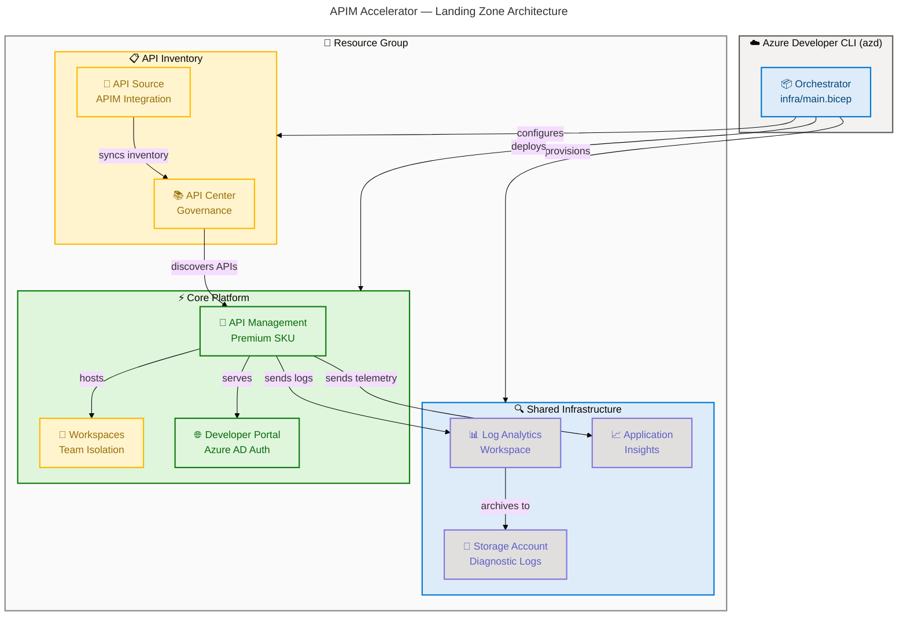

# APIM Accelerator

[](https://azure.microsoft.com/products/api-management)
[](https://learn.microsoft.com/azure/azure-resource-manager/bicep/overview)
[](https://learn.microsoft.com/azure/developer/azure-developer-cli/)
[](LICENSE)

**Production-ready Azure API Management landing zone** built with Bicep and Azure Developer CLI (`azd`). Deploy a complete APIM platform with monitoring, developer portal, API governance, and multi-team workspace isolation in a single command.

> **Tip** — New to Azure API Management? See the [Azure API Management documentation](https://learn.microsoft.com/azure/api-management/api-management-key-concepts) for platform fundamentals before deploying this accelerator.

## Overview

APIM Accelerator provisions an enterprise-grade API Management landing zone on Azure. The solution follows the landing zone pattern to deliver a repeatable, governance-ready deployment that includes centralized monitoring, a self-service developer portal with Azure AD authentication, API Center integration for inventory management, and workspace-based multi-team isolation — all orchestrated through modular Bicep templates and the Azure Developer CLI.

> **Key value** — Eliminates weeks of manual infrastructure setup by codifying Azure best practices into a single `azd up` deployment that handles resource group creation, monitoring infrastructure, APIM provisioning, developer portal configuration, and API inventory integration automatically.

> **Who is this for?** — Platform engineers, cloud architects, and DevOps teams building centralized API platforms that need production-quality infrastructure-as-code with built-in observability and governance.

## Architecture


```mermaid
---
title: "APIM Accelerator — Landing Zone Architecture"
config:
  theme: base
  look: classic
  layout: dagre
  themeVariables:
    fontSize: "16px"
  flowchart:
    htmlLabels: true
---
flowchart TB
    accTitle: APIM Accelerator Landing Zone Architecture
    accDescr: Shows the three-layer deployment architecture — shared monitoring, core APIM platform, and API inventory — orchestrated by Azure Developer CLI

    %% ═══════════════════════════════════════════════════════════════════════════
    %% AZURE / FLUENT ARCHITECTURE PATTERN v1.1
    %% (Semantic + Structural + Font + Accessibility Governance)
    %% ═══════════════════════════════════════════════════════════════════════════

    subgraph azd["☁️ Azure Developer CLI (azd)"]
        direction TB
        orchestrator["📦 Orchestrator<br/>infra/main.bicep"]:::core
    end

    subgraph rg["📁 Resource Group"]
        direction TB

        subgraph shared["🔍 Shared Infrastructure"]
            direction LR
            law["📊 Log Analytics<br/>Workspace"]:::data
            ai["📈 Application<br/>Insights"]:::data
            sa["💾 Storage Account<br/>Diagnostic Logs"]:::data
        end

        subgraph core["⚡ Core Platform"]
            direction LR
            apim["🔗 API Management<br/>Premium SKU"]:::success
            ws["🏢 Workspaces<br/>Team Isolation"]:::warning
            dp["🌐 Developer Portal<br/>Azure AD Auth"]:::success
        end

        subgraph inventory["📋 API Inventory"]
            direction LR
            ac["📚 API Center<br/>Governance"]:::warning
            source["🔄 API Source<br/>APIM Integration"]:::warning
        end
    end

    orchestrator -->|"provisions"| shared
    orchestrator -->|"deploys"| core
    orchestrator -->|"configures"| inventory

    apim -->|"sends logs"| law
    apim -->|"sends telemetry"| ai
    law -->|"archives to"| sa

    apim -->|"hosts"| ws
    apim -->|"serves"| dp
    ac -->|"discovers APIs"| apim
    source -->|"syncs inventory"| ac

    style azd fill:#F3F2F1,stroke:#605E5C,stroke-width:2px
    style rg fill:#FAFAFA,stroke:#8A8886,stroke-width:2px
    style shared fill:#DEECF9,stroke:#0078D4,stroke-width:2px
    style core fill:#DFF6DD,stroke:#107C10,stroke-width:2px
    style inventory fill:#FFF4CE,stroke:#FFB900,stroke-width:2px

    classDef core fill:#DEECF9,stroke:#0078D4,stroke-width:2px,color:#004578
    classDef success fill:#DFF6DD,stroke:#107C10,stroke-width:2px,color:#0B6A0B
    classDef warning fill:#FFF4CE,stroke:#FFB900,stroke-width:2px,color:#986F0B
    classDef data fill:#E1DFDD,stroke:#8378DE,stroke-width:2px,color:#5B5FC7
    classDef process fill:#FFF4CE,stroke:#FFB900,stroke-width:2px,color:#986F0B
```

The deployment follows a layered dependency chain: **Shared Infrastructure** provisions first (Log Analytics, Application Insights, Storage Account), then the **Core Platform** (APIM service, workspaces, developer portal) integrates with monitoring outputs, and finally **API Inventory** (API Center with APIM source integration) connects to the running APIM instance.

## Features

| Feature | Description | Source |
|---|---|---|
| 🔗 **API Management (Premium)** | Fully configured APIM service with configurable SKU, managed identity, VNet support, and CORS policies | [src/core/apim.bicep](src/core/apim.bicep) |
| 🌐 **Developer Portal** | Self-service portal with Azure AD authentication (MSAL 2.0), sign-in/sign-up flows, and terms of service | [src/core/developer-portal.bicep](src/core/developer-portal.bicep) |
| 🏢 **Workspace Isolation** | Logical API groupings for multi-team environments within a single APIM instance | [src/core/workspaces.bicep](src/core/workspaces.bicep) |
| 📚 **API Center Integration** | Centralized API catalog with automatic discovery, governance, and RBAC role assignments | [src/inventory/main.bicep](src/inventory/main.bicep) |
| 📊 **Log Analytics** | Centralized log aggregation with KQL query support, configurable retention, and managed identity | [src/shared/monitoring/operational/main.bicep](src/shared/monitoring/operational/main.bicep) |
| 📈 **Application Insights** | APM with distributed tracing, configurable retention (90–730 days), and workspace-based ingestion | [src/shared/monitoring/insights/main.bicep](src/shared/monitoring/insights/main.bicep) |
| 💾 **Diagnostic Storage** | Long-term log archival with Storage Account integration for compliance and audit | [src/shared/monitoring/operational/main.bicep](src/shared/monitoring/operational/main.bicep) |
| 🏷️ **Governance Tags** | Comprehensive tagging strategy with cost center, business unit, owner, compliance, and budget codes | [infra/settings.yaml](infra/settings.yaml) |
| 🔐 **Managed Identity** | System-assigned and user-assigned identity support across all services with RBAC role assignments | [src/shared/common-types.bicep](src/shared/common-types.bicep) |
| ☁️ **azd Integration** | One-command deployment with `azd up`, lifecycle hooks, and environment-aware parameterization | [azure.yaml](azure.yaml) |

## Requirements

**Overview**

This accelerator deploys Azure infrastructure using Bicep templates orchestrated by the Azure Developer CLI. You need an active Azure subscription with sufficient permissions, the Azure CLI and `azd` tooling installed locally, and a Bash-compatible shell for pre-provisioning hooks.

> **Important** — The default configuration deploys API Management on the **Premium** SKU, which incurs significant costs. For development or testing, change the SKU to `Developer` in [infra/settings.yaml](infra/settings.yaml).

> **Note** — The pre-provision hook script ([infra/azd-hooks/pre-provision.sh](infra/azd-hooks/pre-provision.sh)) requires `Microsoft.ApiManagement/deletedservices/delete` permission to purge soft-deleted APIM instances.

| Requirement | Minimum Version | Purpose |
|---|---|---|
| ☁️ **Azure Subscription** | Active subscription | Resource deployment target |
| 🔧 **Azure CLI** | 2.50+ | Azure resource management and authentication |
| 📦 **Azure Developer CLI (azd)** | 1.0+ | Deployment orchestration and lifecycle management |
| 📝 **Bicep CLI** | 0.22+ | Infrastructure-as-code compilation (bundled with Azure CLI) |
| 🐚 **Bash Shell** | 4.0+ | Pre-provision hook script execution |
| 🔑 **Azure AD App Registration** | — | Developer portal OAuth2 authentication (client ID and secret) |

## Quick Start

### 1. Clone the Repository

```bash
git clone https://github.com/Evilazaro/APIM-Accelerator.git
cd APIM-Accelerator
```

### 2. Authenticate with Azure

```bash
az login
azd auth login
```

### 3. Configure the Environment

Edit [infra/settings.yaml](infra/settings.yaml) to customize your deployment:

```yaml
# Key settings to review before deployment
solutionName: "apim-accelerator"

core:
  apiManagement:
    publisherEmail: "your-email@domain.com"   # Required — your publisher email
    publisherName: "Your Organization"          # Required — organization name
    sku:
      name: "Developer"                         # Use Developer for non-production
      capacity: 1
```

### 4. Deploy

```bash
azd up
```

This single command performs the following steps:

1. Executes the pre-provision hook to purge any soft-deleted APIM instances
2. Creates the resource group following the naming convention `apim-accelerator-{env}-{location}-rg`
3. Deploys shared monitoring infrastructure (Log Analytics, Application Insights, Storage Account)
4. Provisions the API Management service with configured SKU and identity
5. Creates workspaces for team isolation
6. Configures the developer portal with Azure AD authentication
7. Deploys API Center with APIM source integration for API discovery

> **Tip** — To provision infrastructure without deploying application code, run `azd provision` instead of `azd up`.

### Expected Output

After a successful deployment, `azd` outputs:

- `APPLICATION_INSIGHTS_RESOURCE_ID` — Application Insights resource ID for monitoring integration
- `APPLICATION_INSIGHTS_NAME` — Instance name for configuration references
- `APPLICATION_INSIGHTS_INSTRUMENTATION_KEY` — Instrumentation key for SDK configuration (secure output)
- `AZURE_STORAGE_ACCOUNT_ID` — Storage account ID for diagnostic log archival

## Project Structure

```text
APIM-Accelerator/
├── azure.yaml                          # azd project configuration and lifecycle hooks
├── infra/
│   ├── main.bicep                      # Subscription-level orchestration template
│   ├── main.parameters.json            # Environment parameter bindings
│   ├── settings.yaml                   # Centralized configuration (SKU, tags, identity)
│   └── azd-hooks/
│       └── pre-provision.sh            # Purges soft-deleted APIM instances before deploy
└── src/
    ├── core/
    │   ├── main.bicep                  # Core platform orchestrator
    │   ├── apim.bicep                  # APIM service resource with diagnostics and RBAC
    │   ├── workspaces.bicep            # Workspace creation for multi-team isolation
    │   └── developer-portal.bicep      # Developer portal with Azure AD, CORS, sign-in/up
    ├── inventory/
    │   └── main.bicep                  # API Center with APIM source integration and RBAC
    └── shared/
        ├── main.bicep                  # Shared infrastructure orchestrator
        ├── common-types.bicep          # Reusable Bicep type definitions
        ├── constants.bicep             # Utility functions and configuration constants
        ├── monitoring/
        │   ├── main.bicep              # Monitoring orchestrator
        │   ├── insights/
        │   │   └── main.bicep          # Application Insights with diagnostic settings
        │   └── operational/
        │       └── main.bicep          # Log Analytics workspace and storage account
        └── networking/
            └── main.bicep              # Network infrastructure placeholder (future)
```

## Configuration

**Overview**

All deployment configuration is centralized in [infra/settings.yaml](infra/settings.yaml). This file controls resource naming, SKU selection, managed identity types, monitoring settings, tagging strategy, and workspace definitions. Resource names can be explicitly set or left empty for auto-generation using deterministic unique suffixes.

> **Tip** — Leave resource name fields empty (e.g., `name: ""`) to use auto-generated names that include a unique hash derived from the subscription, resource group, solution name, and region. This prevents naming collisions across environments.

### Environment Parameters

The deployment accepts two required parameters, passed automatically by `azd` or manually via CLI:

| Parameter | Values | Description |
|---|---|---|
| `envName` | `dev`, `test`, `staging`, `prod`, `uat` | Determines resource sizing, configuration, and tagging |
| `location` | Any Azure region | Target region (must support APIM Premium tier) |

### SKU Options

| SKU | Use Case | Workspaces | VNet | SLA |
|---|---|---|---|---|
| `Developer` | Development and testing | No | No | None |
| `Basic` / `BasicV2` | Small-scale production | No | No | 99.95% |
| `Standard` / `StandardV2` | Medium-scale production | No | No | 99.95% |
| `Premium` | Enterprise production | Yes | Yes | 99.95–99.99% |
| `Consumption` | Serverless, pay-per-call | No | No | 99.95% |

### Tagging Strategy

The accelerator applies a comprehensive governance tagging strategy to all resources:

```yaml
tags:
  CostCenter: "CC-1234"              # Cost allocation tracking
  BusinessUnit: "IT"                  # Organizational unit
  Owner: "owner@domain.com"          # Resource owner contact
  ApplicationName: "APIM Platform"   # Workload name
  ProjectName: "APIMForAll"          # Project initiative
  ServiceClass: "Critical"           # Workload tier
  RegulatoryCompliance: "GDPR"       # Compliance framework
  SupportContact: "team@domain.com"  # Incident support contact
  ChargebackModel: "Dedicated"       # Billing model
  BudgetCode: "FY25-Q1-InitiativeX"  # Budget code
```

### Managed Identity Configuration

All services support configurable identity types. Set identity in [infra/settings.yaml](infra/settings.yaml):

```yaml
identity:
  type: "SystemAssigned"        # Options: SystemAssigned, UserAssigned, None
  userAssignedIdentities: []    # Provide resource IDs for UserAssigned type
```

## Deployment

### Prerequisites

1. **Install tools**:

   ```bash
   # Azure CLI
   curl -sL https://aka.ms/InstallAzureCLIDeb | sudo bash

   # Azure Developer CLI
   curl -fsSL https://aka.ms/install-azd.sh | bash
   ```

2. **Authenticate**:

   ```bash
   az login
   azd auth login
   ```

3. **Register an Azure AD application** for developer portal authentication (obtain `clientId` and `clientSecret`).

### Deploy with azd

```bash
# Initialize environment and deploy everything
azd up

# Or deploy step by step
azd provision          # Provision infrastructure only
azd deploy             # Deploy application code only
```

### Deploy with Azure CLI

```bash
az deployment sub create \
  --location eastus \
  --template-file infra/main.bicep \
  --parameters envName=dev location=eastus
```

### Multi-Environment Deployment

```bash
# Development
azd env new dev && azd env select dev && azd up

# Production
azd env new prod && azd env select prod && azd up
```

### Pre-Provision Hook

The [pre-provision.sh](infra/azd-hooks/pre-provision.sh) script runs automatically before provisioning to purge any soft-deleted APIM instances in the target region. This prevents naming conflicts during redeployment.

```bash
# Manual execution (if needed)
./infra/azd-hooks/pre-provision.sh "East US"
```

## Contributing

Contributions are welcome. To contribute:

1. Fork the repository
2. Create a feature branch (`git checkout -b feature/your-feature`)
3. Commit changes with descriptive messages
4. Push to your fork and open a pull request

> **Note** — Ensure all Bicep files compile without errors before submitting a pull request. Run `az bicep build --file infra/main.bicep` to validate.

## License

This project is licensed under the [MIT License](LICENSE).

Copyright (c) 2025 Evilázaro Alves.
