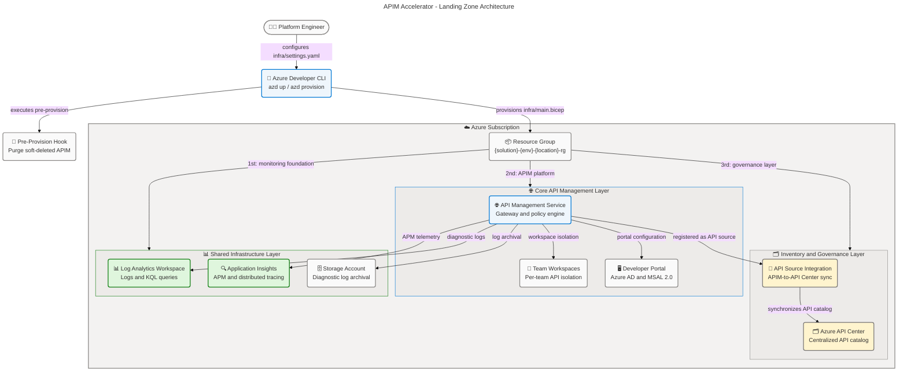

# APIM Accelerator

[](./LICENSE)
[](https://learn.microsoft.com/azure/api-management/)
[](https://learn.microsoft.com/azure/azure-resource-manager/bicep/)
[](https://learn.microsoft.com/azure/developer/azure-developer-cli/)
[](./infra/main.bicep)
[](./infra/main.bicep)

Enterprise-grade Azure API Management landing zone accelerator that provisions a production-ready API platform with centralized monitoring, API governance, and multi-team isolation using Azure Bicep and the Azure Developer CLI.

## Table of Contents

- [📖 APIM Accelerator](#-apim-accelerator)
- [✨ Features](#-features)
- [🏗️ Architecture](#️-architecture)
- [🚀 Quick Start](#-quick-start)
- [📦 Deployment](#-deployment)
- [📋 Requirements](#-requirements)
- [💻 Usage](#-usage)
- [⚙️ Configuration](#️-configuration)
- [🤝 Contributing](#-contributing)
- [📄 License](#-license)

## 📖 APIM Accelerator

**Overview**

The APIM Accelerator delivers a complete Azure API Management landing zone through automated Infrastructure-as-Code templates built with Azure Bicep. It enables platform engineering teams to provision a production-ready API gateway, centralized observability stack, and API governance catalog in a single command, reducing time-to-value from weeks to minutes.

This accelerator is designed for organizations that need consistent, governed API infrastructure across multiple environments and teams. It follows Azure Well-Architected Framework principles and Azure Landing Zone patterns to enforce security, reliability, and operational excellence from day one. Deployment is orchestrated at subscription scope by `infra/main.bicep`, creating all required resource groups and child resources in the correct dependency order.

By combining the Azure Developer CLI (`azd`), modular Bicep templates, and a single `infra/settings.yaml` configuration file, the accelerator gives platform teams a repeatable, auditable workflow for deploying the entire APIM platform — including monitoring, workspaces, developer portal, and API Center integration — across `dev`, `test`, `staging`, `prod`, and `uat` environments.

> [!NOTE]
> The accelerator deploys at **subscription scope**, creating a dedicated resource group named `{solutionName}-{env}-{location}-rg` and all required resources automatically. Ensure you have **Contributor** or **Owner** role on the target subscription before deploying.

## ✨ Features

**Overview**

The APIM Accelerator provides a comprehensive set of enterprise API platform capabilities, each encapsulated in an independent Bicep module. Every component is configurable through `infra/settings.yaml`, auto-generates resource names from a consistent `{solutionName}-{uniqueSuffix}-{resourceType}` pattern, and integrates with Azure Monitor for end-to-end observability.

> [!TIP]
> The `infra/settings.yaml` file is the single configuration entry point for the entire landing zone. Customize it once and every deployed resource reflects your organizational naming conventions, tags, SKU selections, and identity settings.

| 🏷️ Feature                    | 📄 Description                                                                                                                                                                                     | 📁 Module                          | ✅ Status |
| ----------------------------- | -------------------------------------------------------------------------------------------------------------------------------------------------------------------------------------------------- | ---------------------------------- | --------- |
| 🌐 **API Management Service** | Deploy APIM with configurable SKU (`Developer`, `Basic`, `BasicV2`, `Standard`, `StandardV2`, `Premium`, `Consumption`), managed identity, optional VNet integration, and full diagnostic settings | `src/core/apim.bicep`              | ✅ Stable |
| 📊 **Centralized Monitoring** | Log Analytics workspace, Application Insights, and Storage Account providing a full observability stack with auto-linked diagnostics and instrumentation key output                                | `src/shared/monitoring/`           | ✅ Stable |
| 🗂️ **API Center Governance**  | Azure API Center with APIM as an API source, a default workspace, and RBAC assignments (Data Reader + Compliance Manager) for automated API catalog discovery                                      | `src/inventory/main.bicep`         | ✅ Stable |
| 🏢 **Team Workspaces**        | APIM workspace isolation enabling independent API lifecycle management per team or project within a single APIM instance (Premium SKU required)                                                    | `src/core/workspaces.bicep`        | ✅ Stable |
| 🔒 **Managed Identity**       | System-assigned and user-assigned managed identity support across APIM, Log Analytics, and API Center for credential-free Azure resource authentication                                            | `src/core/apim.bicep`              | ✅ Stable |
| 🖥️ **Developer Portal**       | Self-service developer portal with Azure AD (MSAL 2.0) authentication, global CORS policies, and sign-in/sign-up user flow configuration                                                           | `src/core/developer-portal.bicep`  | ✅ Stable |
| 🔄 **Multi-Environment**      | Parameterized deployment supporting `dev`, `test`, `staging`, `prod`, and `uat` via `AZURE_ENV_NAME`, with per-environment tagging applied to all resources                                        | `infra/main.bicep`                 | ✅ Stable |
| 🧹 **Pre-Provision Hook**     | Automatic purge of soft-deleted APIM instances before provisioning to prevent naming conflicts during redeployment cycles                                                                          | `infra/azd-hooks/pre-provision.sh` | ✅ Stable |

## 🏗️ Architecture

**Overview**

The APIM Accelerator follows a modular, layered architecture pattern deployed at Azure subscription scope by `infra/main.bicep`. The infrastructure is organized into three functional layers: the **Shared Infrastructure Layer** (monitoring foundation of Log Analytics, Application Insights, and Storage Account), the **Core API Management Layer** (APIM gateway, team workspaces, and developer portal), and the **Inventory and Governance Layer** (API Center with automated APIM source integration). All layers are orchestrated by `infra/main.bicep` and coordinated through the Azure Developer CLI lifecycle hooks defined in `azure.yaml`.


```mermaid
---
title: "APIM Accelerator - Landing Zone Architecture"
config:
  theme: base
  look: classic
  layout: dagre
  themeVariables:
    fontSize: '16px'
  flowchart:
    htmlLabels: true
---
flowchart TB
    accTitle: APIM Accelerator Landing Zone Architecture
    accDescr: Modular Azure API Management landing zone showing deployment flow from Platform Engineer through Azure Developer CLI and a pre-provision hook to three layers in an Azure subscription. Layer 1 shared monitoring contains Log Analytics Workspace, Application Insights, and Storage Account. Layer 2 core platform contains API Management Service, Team Workspaces, and Developer Portal. Layer 3 inventory contains API Center and API Source Integration. WCAG AA compliant using Fluent UI color palette.

    %% =======================================================================
    %% AZURE / FLUENT ARCHITECTURE PATTERN v2.0
    %% (Semantic + Structural + Font + Accessibility Governance)
    %% =======================================================================
    %% PHASE 1 - FLUENT UI: All styling uses approved Fluent UI palette only
    %% PHASE 2 - GROUPS: Every subgraph has semantic color via style directive
    %% PHASE 3 - COMPONENTS: Every node has semantic classDef + icon prefix
    %% PHASE 4 - ACCESSIBILITY: accTitle/accDescr present, WCAG AA contrast
    %% PHASE 5 - STANDARD: Governance block present, classDefs centralized
    %% =======================================================================

    Engineer(["👨‍💻 Platform Engineer"]):::neutral
    AzdCli("🚀 Azure Developer CLI\nazd up / azd provision"):::core
    PreHook("🔧 Pre-Provision Hook\nPurge soft-deleted APIM"):::neutral

    subgraph AzSub ["☁️ Azure Subscription"]
        RG("📦 Resource Group\n{solution}-{env}-{location}-rg"):::neutral

        subgraph SharedLayer ["📊 Shared Infrastructure Layer"]
            LAW("📊 Log Analytics Workspace\nLogs and KQL queries"):::success
            AppIns("🔍 Application Insights\nAPM and distributed tracing"):::success
            StorAcc("🗄️ Storage Account\nDiagnostic log archival"):::neutral
        end

        subgraph CoreLayer ["🌐 Core API Management Layer"]
            APIMSvc("🌐 API Management Service\nGateway and policy engine"):::core
            TeamWsp("🏢 Team Workspaces\nPer-team API isolation"):::neutral
            DevPort("🖥️ Developer Portal\nAzure AD and MSAL 2.0"):::neutral
        end

        subgraph InvLayer ["🗂️ Inventory and Governance Layer"]
            ApiCtr("🗂️ Azure API Center\nCentralized API catalog"):::warning
            ApiSrc("🔗 API Source Integration\nAPIM-to-API Center sync"):::warning
        end
    end

    Engineer -- "configures infra/settings.yaml" --> AzdCli
    AzdCli -- "executes pre-provision" --> PreHook
    AzdCli -- "provisions infra/main.bicep" --> RG
    RG -- "1st: monitoring foundation" --> SharedLayer
    RG -- "2nd: APIM platform" --> CoreLayer
    RG -- "3rd: governance layer" --> InvLayer
    APIMSvc -- "APM telemetry" --> AppIns
    APIMSvc -- "diagnostic logs" --> LAW
    APIMSvc -- "log archival" --> StorAcc
    APIMSvc -- "workspace isolation" --> TeamWsp
    APIMSvc -- "portal configuration" --> DevPort
    APIMSvc -- "registered as API source" --> ApiSrc
    ApiSrc -- "synchronizes API catalog" --> ApiCtr

    style AzSub fill:#F3F2F1,stroke:#8A8886,stroke-width:2px,color:#323130
    style SharedLayer fill:#EDEBE9,stroke:#107C10,stroke-width:1px,color:#323130
    style CoreLayer fill:#EDEBE9,stroke:#0078D4,stroke-width:1px,color:#323130
    style InvLayer fill:#EDEBE9,stroke:#8A8886,stroke-width:1px,color:#323130

    classDef core fill:#EFF6FC,stroke:#0078D4,stroke-width:2px,color:#323130
    classDef success fill:#DFF6DD,stroke:#107C10,stroke-width:2px,color:#323130
    classDef neutral fill:#FAFAFA,stroke:#8A8886,stroke-width:2px,color:#323130
    classDef warning fill:#FFF4CE,stroke:#797673,stroke-width:2px,color:#323130
```

**Component Roles:**

| 🧩 Component                   | 📄 Purpose                                                                                                                            | 📁 Source Module                               |
| ------------------------------ | ------------------------------------------------------------------------------------------------------------------------------------- | ---------------------------------------------- |
| 🌐 **API Management Service**  | API gateway, policy enforcement, rate limiting, caching, and managed identity for downstream service authentication                   | `src/core/apim.bicep`                          |
| 📊 **Log Analytics Workspace** | Centralized log aggregation, KQL queries, alerting foundation, and diagnostic log sink for all platform resources                     | `src/shared/monitoring/operational/main.bicep` |
| 🔍 **Application Insights**    | Application performance monitoring, request tracing, failure analysis, and instrumentation key export                                 | `src/shared/monitoring/insights/main.bicep`    |
| 🗄️ **Storage Account**         | Long-term diagnostic log archival for compliance and audit retention; also serves as APIM diagnostic storage                          | `src/shared/monitoring/operational/main.bicep` |
| 🏢 **Team Workspaces**         | Logical isolation of APIs and resources within a single APIM instance; enables per-team lifecycle management (Premium SKU only)       | `src/core/workspaces.bicep`                    |
| 🖥️ **Developer Portal**        | Self-service API documentation and testing portal with Azure AD identity provider (MSAL 2.0) and CORS policy configuration            | `src/core/developer-portal.bicep`              |
| 🗂️ **Azure API Center**        | Centralized API catalog with automated APIM discovery, default workspace, governance policies, and compliance management              | `src/inventory/main.bicep`                     |
| 🔗 **API Source Integration**  | Registers the APIM service as an API source within the API Center default workspace for automatic API synchronization                 | `src/inventory/main.bicep`                     |
| 🔒 **RBAC Assignments**        | Grants the API Center managed identity **API Center Data Reader** and **API Center Compliance Manager** roles at resource group scope | `src/inventory/main.bicep`                     |

## 🚀 Quick Start

**Overview**

The fastest path to a running APIM landing zone is three commands: authenticate, then run `azd up`. The entire infrastructure — monitoring foundation, API Management service, workspaces, developer portal, and API Center governance layer — is provisioned in a single automated workflow with no manual Azure Portal steps required.

**Clone the repository:**

```bash
git clone https://github.com/Evilazaro/APIM-Accelerator.git
cd APIM-Accelerator
```

**Authenticate with Azure:**

```bash
az login
azd auth login
```

**Deploy the complete landing zone:**

```bash
azd up
```

When prompted by `azd up`, provide:

- **Environment name**: one of `dev`, `test`, `staging`, `prod`, or `uat`
- **Azure location**: e.g., `eastus`, `westeurope`, `australiaeast`
- **Azure subscription**: select your target subscription from the list

**Expected output:**

```text
SUCCESS: Your up workflow to provision and deploy to Azure completed.

Outputs:
  APPLICATION_INSIGHTS_NAME              = apim-accelerator-abc123-ai
  APPLICATION_INSIGHTS_RESOURCE_ID       = /subscriptions/.../components/apim-accelerator-abc123-ai
  APPLICATION_INSIGHTS_INSTRUMENTATION_KEY = [secured]
  AZURE_STORAGE_ACCOUNT_ID               = /subscriptions/.../storageAccounts/apimacceleratorabc123
```

> [!IMPORTANT]
> The Azure API Management **Premium SKU** provisioning takes **30–45 minutes** to complete. This is a platform constraint imposed by Azure and is expected behavior. The `azd up` command waits and displays live progress until provisioning finishes.

## 📦 Deployment

**Overview**

The APIM Accelerator supports three deployment modes through the Azure Developer CLI: full end-to-end deployment with `azd up`, infrastructure-only provisioning with `azd provision`, and targeted redeployment with `azd provision --environment <name>`. A pre-provision hook (`infra/azd-hooks/pre-provision.sh`) executes automatically before every provisioning run to purge soft-deleted APIM instances and prevent naming conflicts.

Deployment is orchestrated at subscription scope by `infra/main.bicep` and follows a strict three-stage dependency order enforced by Bicep module chaining: shared monitoring infrastructure first, then the core APIM platform, and finally the API Center inventory layer which requires an active APIM instance.

**Full deployment (provision + deploy):**

```bash
azd up
```

**Provision infrastructure only:**

```bash
azd provision
```

**Provision a named environment:**

```bash
azd provision --environment prod
```

**Deploy using the Azure CLI directly (subscription scope):**

```bash
az deployment sub create \
  --location eastus \
  --template-file infra/main.bicep \
  --parameters @infra/main.parameters.json \
  --parameters envName=dev location=eastus
```

**Expected provisioning output:**

```text
Provisioning Azure resources (azd provision)
  (✓) Done: Creating/Updating resource group (apim-accelerator-dev-eastus-rg)
  (✓) Done: Deploying shared monitoring components (Log Analytics, App Insights, Storage)
  (✓) Done: Deploying core API Management platform (APIM, Workspaces, Developer Portal)
  (✓) Done: Deploying inventory management components (API Center, API Source, RBAC)

SUCCESS: Your provision workflow completed.
```

> [!WARNING]
> Deleting an APIM service triggers **soft-delete** in Azure, which retains the resource name for up to 48 hours. The pre-provision hook (`infra/azd-hooks/pre-provision.sh`) purges these soft-deleted instances automatically on every `azd provision` run. To purge manually, execute `./infra/azd-hooks/pre-provision.sh <location>` using the original deployment region.

## 📋 Requirements

**Overview**

The APIM Accelerator requires the Azure Developer CLI and Azure CLI for deployment orchestration, together with an active Azure subscription and Contributor or Owner permissions at subscription scope. The default configuration targets the API Management **Premium SKU**, so the target region must support this tier and your subscription must have sufficient quota available.

Verify all requirements before running `azd up` to avoid mid-deployment failures. The `azd` CLI validates authentication and subscription context automatically at startup.

> [!TIP]
> **Why This Matters**: Installing both CLIs and verifying versions before deployment prevents authentication failures and incompatibility errors that would interrupt a 30–45 minute provisioning run mid-way through resource creation.

> [!IMPORTANT]
> **How It Works**: `azd up` reads `infra/main.parameters.json`, maps `AZURE_ENV_NAME` and `AZURE_LOCATION` environment variables to Bicep parameters `envName` and `location`, then calls `az deployment sub create` at subscription scope on your behalf. Both CLIs must be authenticated and up-to-date for the deployment to succeed.

| 🔧 Requirement                     | 📦 Min. Version      | 📄 Purpose                                                                    | 🔗 Install                                                                                          |
| ---------------------------------- | -------------------- | ----------------------------------------------------------------------------- | --------------------------------------------------------------------------------------------------- |
| ☁️ **Azure Subscription**          | Active               | Target subscription for all resource deployments at subscription scope        | [Azure Portal](https://portal.azure.com)                                                            |
| 🔧 **Azure CLI** (`az`)            | ≥ 2.50.0             | Azure resource management, authentication, and direct CLI deployments         | [Install Guide](https://learn.microsoft.com/cli/azure/install-azure-cli)                            |
| 🚀 **Azure Developer CLI** (`azd`) | ≥ 1.5.0              | Deployment orchestration, environment lifecycle management, and hooks         | [Install Guide](https://learn.microsoft.com/azure/developer/azure-developer-cli/install-azd)        |
| 🔑 **Azure RBAC**                  | Contributor or Owner | Subscription-scope resource group creation and all child resource deployments | [RBAC docs](https://learn.microsoft.com/azure/role-based-access-control/)                           |
| 🌍 **Supported Region**            | —                    | Target Azure region must support APIM Premium SKU and Azure API Center        | [Products by Region](https://azure.microsoft.com/explore/global-infrastructure/products-by-region/) |

**Verify installed tool versions:**

```bash
az version
azd version
```

**Expected output:**

```text
{
  "azure-cli": "2.63.0",
  ...
}
azure-dev-cli
1.11.0 (commit xxxxxxx)
```

## 💻 Usage

**Overview**

After deploying with `azd up`, the accelerator provides a fully operational Azure API Management service accessible through the Azure Portal and its gateway URL. Platform teams use `azd` and `az` CLI commands for day-2 operations: viewing deployment outputs, adding team workspaces, retrieving the developer portal URL, listing API Center services, and tearing down environments when no longer needed.

The Azure API Center catalog is automatically populated with APIs registered in the APIM instance through the API source integration configured in `src/inventory/main.bicep`. The RBAC assignments created during deployment grant the API Center managed identity the **API Center Data Reader** and **API Center Compliance Manager** roles, enabling it to read and synchronize API definitions from APIM.

**View deployed environment outputs:**

```bash
azd env get-values
```

**Expected output:**

```text
APPLICATION_INSIGHTS_NAME=apim-accelerator-abc123-ai
APPLICATION_INSIGHTS_RESOURCE_ID=/subscriptions/.../components/apim-accelerator-abc123-ai
AZURE_STORAGE_ACCOUNT_ID=/subscriptions/.../storageAccounts/apimacceleratorabc123
```

**List all managed environments:**

```bash
azd env list
```

**Add a new team workspace** by editing `infra/settings.yaml` under `core.apiManagement.workspaces`:

```yaml
core:
  apiManagement:
    workspaces:
      - name: "workspace1"
      - name: "finance-team"
      - name: "new-team-workspace"
```

Then re-provision to apply the change:

```bash
azd provision
```

**Retrieve the APIM Developer Portal URL:**

```bash
az apim show \
  --name <apim-name> \
  --resource-group <resource-group-name> \
  --query "properties.developerPortalUrl" \
  --output tsv
```

**Retrieve the APIM Gateway URL:**

```bash
az apim show \
  --name <apim-name> \
  --resource-group <resource-group-name> \
  --query "properties.gatewayUrl" \
  --output tsv
```

**List API Center services in the resource group:**

```bash
az apic service list --resource-group <resource-group-name>
```

**Expected output:**

```text
Name                             Location    ResourceGroup
-------------------------------  ----------  -----------------------------------
apim-accelerator-apicenter       eastus      apim-accelerator-dev-eastus-rg
```

**Switch between environments:**

```bash
azd env select prod
azd env get-values
```

**Tear down the environment and all resources:**

```bash
azd down
```

> [!WARNING]
> Running `azd down` permanently deletes the resource group and all contained resources. The APIM service enters soft-delete for 48 hours after deletion. Confirm the target environment with `azd env list` before proceeding.

## ⚙️ Configuration

**Overview**

All environment-specific configuration is centralized in `infra/settings.yaml`. This file controls the APIM SKU and capacity, monitoring resource naming, managed identity types, governance tags, workspace definitions, and API Center settings. Resource names can be explicitly set or left empty (`""`) for auto-generated names following the pattern `{solutionName}-{uniqueSuffix}-{resourceType}` enforced by `src/shared/constants.bicep`. The `infra/main.parameters.json` file maps the `AZURE_ENV_NAME` and `AZURE_LOCATION` environment variables set by `azd` to the Bicep `envName` and `location` parameters.

**APIM Service Configuration (`infra/settings.yaml` → `core.apiManagement`):**

| ⚙️ Parameter                           | 🔧 Default               | 📄 Description                                                                                         | ✅ Required |
| -------------------------------------- | ------------------------ | ------------------------------------------------------------------------------------------------------ | ----------- |
| 🏷️ `solutionName`                      | `apim-accelerator`       | Base name for all resources; determines resource group and auto-generated resource names               | ✅ Yes      |
| 📧 `core.apiManagement.publisherEmail` | `evilazaro@gmail.com`    | Publisher contact email required by Azure for APIM service creation                                    | ✅ Yes      |
| 🏢 `core.apiManagement.publisherName`  | `Contoso`                | Publisher organization name displayed in the developer portal                                          | ✅ Yes      |
| 💰 `core.apiManagement.sku.name`       | `Premium`                | APIM pricing tier: `Developer`, `Basic`, `BasicV2`, `Standard`, `StandardV2`, `Premium`, `Consumption` | ✅ Yes      |
| 📈 `core.apiManagement.sku.capacity`   | `1`                      | Number of APIM scale units (`Premium` supports 1–10; `Developer` is fixed at 1)                        | ✅ Yes      |
| 🔑 `core.apiManagement.identity.type`  | `SystemAssigned`         | Managed identity type: `SystemAssigned` or `UserAssigned`                                              | ✅ Yes      |
| 🗂️ `core.apiManagement.workspaces`     | `[{name: "workspace1"}]` | Array of APIM workspace definitions for team isolation (Premium SKU only)                              | ⚠️ Optional |
| 📛 `core.apiManagement.name`           | Auto-generated           | APIM service name; leave `""` to auto-generate as `{solutionName}-{uniqueSuffix}-apim`                 | ⚠️ Optional |

**Monitoring Configuration (`infra/settings.yaml` → `shared.monitoring`):**

| ⚙️ Parameter                                            | 🔧 Default       | 📄 Description                                                                              | ✅ Required |
| ------------------------------------------------------- | ---------------- | ------------------------------------------------------------------------------------------- | ----------- |
| 📊 `shared.monitoring.logAnalytics.name`                | Auto-generated   | Log Analytics workspace name; leave `""` to auto-generate as `{solution}-{suffix}-law`      | ⚠️ Optional |
| 🔍 `shared.monitoring.applicationInsights.name`         | Auto-generated   | Application Insights instance name; leave `""` to auto-generate as `{solution}-{suffix}-ai` | ⚠️ Optional |
| 🔑 `shared.monitoring.logAnalytics.identity.type`       | `SystemAssigned` | Managed identity type for the Log Analytics workspace                                       | ✅ Yes      |
| 🗄️ `shared.monitoring.logAnalytics.workSpaceResourceId` | `""`             | Existing Log Analytics workspace resource ID to reuse; leave `""` to create a new one       | ⚠️ Optional |

**API Center Configuration (`infra/settings.yaml` → `inventory.apiCenter`):**

| ⚙️ Parameter                                             | 🔧 Default       | 📄 Description                                                                                     | ✅ Required |
| -------------------------------------------------------- | ---------------- | -------------------------------------------------------------------------------------------------- | ----------- |
| 🗂️ `inventory.apiCenter.name`                            | Auto-generated   | API Center service name; leave `""` to auto-generate as `{solutionName}-apicenter`                 | ⚠️ Optional |
| 🔑 `inventory.apiCenter.identity.type`                   | `SystemAssigned` | Managed identity type: `SystemAssigned`, `UserAssigned`, `SystemAssigned, UserAssigned`, or `None` | ✅ Yes      |
| 👤 `inventory.apiCenter.identity.userAssignedIdentities` | `[]`             | List of user-assigned managed identity resource IDs (when `UserAssigned` type is selected)         | ⚠️ Optional |

**Governance Tags (`infra/settings.yaml` → `shared.tags`):**

> [!NOTE]
> Governance tags defined in `shared.tags` are merged with `managedBy: bicep`, `environment: {envName}`, and `templateVersion: 2.0.0` at deployment time by `infra/main.bicep`, and are applied to every resource in the landing zone. Update these values to match your organization's tagging policy.

| 🏷️ Tag Key                | 🔧 Default Value      | 📄 Purpose                                                           |
| ------------------------- | --------------------- | -------------------------------------------------------------------- |
| 💰 `CostCenter`           | `CC-1234`             | Cost allocation tracking across Azure billing reports                |
| 🏢 `BusinessUnit`         | `IT`                  | Business unit or department identification                           |
| 👤 `Owner`                | `evilazaro@gmail.com` | Resource owner and incident contact                                  |
| 📛 `ApplicationName`      | `APIM Platform`       | Workload or application name for resource grouping                   |
| 📋 `ProjectName`          | `APIMForAll`          | Project or initiative for portfolio tracking                         |
| 🔴 `ServiceClass`         | `Critical`            | Workload tier classification: `Critical`, `Standard`, `Experimental` |
| ✅ `RegulatoryCompliance` | `GDPR`                | Applicable compliance standards: `GDPR`, `HIPAA`, `PCI`, `None`      |
| 📞 `SupportContact`       | `evilazaro@gmail.com` | Incident support team or contact email                               |
| 💳 `ChargebackModel`      | `Dedicated`           | Chargeback or showback model for cost attribution                    |
| 💼 `BudgetCode`           | `FY25-Q1-InitiativeX` | Budget or financial initiative code                                  |

**Complete `infra/settings.yaml` example:**

```yaml
solutionName: "apim-accelerator"

shared:
  monitoring:
    logAnalytics:
      name: "" # leave empty for auto-generation
      workSpaceResourceId: "" # leave empty to create a new workspace
      identity:
        type: "SystemAssigned"
        userAssignedIdentities: []
    applicationInsights:
      name: "" # leave empty for auto-generation
      logAnalyticsWorkspaceResourceId: ""
    tags:
      lz-component-type: "shared"
      component: "monitoring"
  tags:
    CostCenter: "CC-9999"
    BusinessUnit: "Engineering"
    Owner: "platform-team@contoso.com"
    ApplicationName: "APIM Platform"
    ProjectName: "APIMForAll"
    ServiceClass: "Critical"
    RegulatoryCompliance: "GDPR"
    SupportContact: "platform-team@contoso.com"
    ChargebackModel: "Dedicated"
    BudgetCode: "FY26-Q1-APIM"

core:
  apiManagement:
    name: "" # leave empty for auto-generation
    publisherEmail: "api@contoso.com"
    publisherName: "Contoso Ltd"
    sku:
      name: "Premium" # Developer | Basic | BasicV2 | Standard | StandardV2 | Premium | Consumption
      capacity: 1 # Premium supports 1-10 scale units
    identity:
      type: "SystemAssigned" # SystemAssigned | UserAssigned
      userAssignedIdentities: []
    workspaces:
      - name: "sales-apis"
      - name: "finance-apis"
      - name: "partner-integrations"
  tags:
    lz-component-type: "core"
    component: "apiManagement"

inventory:
  apiCenter:
    name: "" # leave empty for auto-generation
    identity:
      type: "SystemAssigned" # SystemAssigned | UserAssigned | SystemAssigned, UserAssigned | None
      userAssignedIdentities: []
  tags:
    lz-component-type: "shared"
    component: "inventory"
```

**Environment variable mapping (`infra/main.parameters.json`):**

The `infra/main.parameters.json` file binds `azd` environment variables to Bicep parameters. `azd` sets `AZURE_ENV_NAME` and `AZURE_LOCATION` automatically based on your selected environment:

```json
{
  "parameters": {
    "envName": { "value": "${AZURE_ENV_NAME}" },
    "location": { "value": "${AZURE_LOCATION}" }
  }
}
```

Override these values manually when using the Azure CLI directly:

```bash
azd env set AZURE_ENV_NAME dev
azd env set AZURE_LOCATION eastus
```

## 🤝 Contributing

**Overview**

Contributions to the APIM Accelerator are welcome from the community. The project uses a modular Bicep architecture where each Azure service is encapsulated in its own module under `src/`, making it straightforward to extend the landing zone with new components or modify existing configurations without changing the orchestration layer in `infra/main.bicep`.

All new modules should follow the established conventions: accept a `tags` parameter, use the `generateUniqueSuffix` helper from `src/shared/constants.bicep` for resource naming, export shared types from `src/shared/common-types.bicep`, and add a `@description()` decorator to every parameter, variable, and resource declaration.

**Contribution workflow:**

1. Fork the repository on GitHub
2. Create a feature branch from `main`:

```bash
git checkout -b feature/your-feature-name
```

3. Make changes following the Bicep module conventions in `src/`
4. Validate your Bicep templates compile without errors:

```bash
az bicep build --file infra/main.bicep
```

**Expected validation output:**

```text
WARNING: no issues were found
```

5. Test your changes against a non-production environment:

```bash
azd provision --environment dev
```

6. Submit a pull request with a clear description of the changes, any new `infra/settings.yaml` configuration keys introduced, and the outputs exposed by new modules

**Project structure conventions:**

| 📁 Directory        | 📄 Purpose                                                                  | 🔧 Module Pattern                                                   |
| ------------------- | --------------------------------------------------------------------------- | ------------------------------------------------------------------- |
| 🏗️ `infra/`         | Orchestration entry point, deployment parameters, and lifecycle hooks       | `main.bicep` calls `src/` modules at subscription scope             |
| 🌐 `src/core/`      | Core APIM platform components — service, workspaces, and developer portal   | One primary resource per `.bicep` file                              |
| 🔗 `src/shared/`    | Cross-cutting shared services — monitoring, type definitions, and constants | `main.bicep` orchestrates `monitoring/`, `networking/` submodules   |
| 🗂️ `src/inventory/` | API governance and catalog components                                       | Single `main.bicep` deploys API Center, workspace, source, and RBAC |

> [!NOTE]
> The `src/shared/networking/` directory is scaffolded as a placeholder for future VNet integration. The networking module is commented out in `src/shared/main.bicep`. Contributions adding VNet, NSG, and private endpoint support are welcome.

## 📄 License

[MIT](./LICENSE) — Copyright © Evilazaro Alves | Principal Cloud Solution Architect | Cloud Platforms and AI Apps | Microsoft
