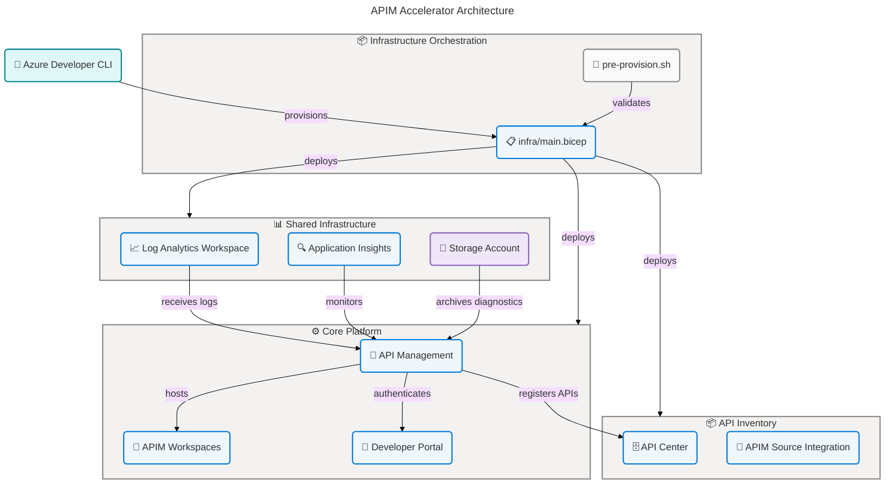

# APIM Accelerator


## 📖 Overview

**Overview**

The APIM Accelerator is an enterprise-grade Azure landing zone that automates the deployment of Azure API Management infrastructure with integrated monitoring, API governance, and multi-team collaboration support. It targets platform engineers and cloud architects who need a repeatable, production-ready foundation for managing APIs at scale across their organization.

Built on modular Azure Bicep templates orchestrated by the Azure Developer CLI (`azd`), the accelerator provisions a complete API Management platform — including API Center for centralized API discovery, Application Insights for observability, and APIM Workspaces for team-based isolation — through a single `azd up` command. The configuration-driven approach enables environment-specific customization without modifying infrastructure code.

> [!NOTE]
> This project deploys Azure resources that incur costs. Review the [Configuration](#️-configuration) section to understand SKU options and adjust capacity before provisioning.

## 📑 Table of Contents

- [Overview](#-overview)
- [Architecture](#️-architecture)
- [Features](#-features)
- [Requirements](#-requirements)
- [Quick Start](#-quick-start)
- [Deployment](#-deployment)
- [Usage](#-usage)
- [Configuration](#️-configuration)
- [Contributing](#-contributing)
- [License](#-license)

## 🏗️ Architecture

**Overview**

The accelerator follows a modular, layered architecture with three deployment tiers — Shared Infrastructure, Core Platform, and API Inventory — each managed as independent Bicep modules. This separation enables teams to evolve monitoring, API gateway, and API governance capabilities independently while maintaining consistent naming, tagging, and security policies across the landing zone.

The orchestration entry point at `infra/main.bicep` deploys at subscription scope, creating a resource group and delegating to each tier. All resources share a deterministic naming convention generated from the subscription, resource group, and location, ensuring uniqueness across environments.


```mermaid
---
title: "APIM Accelerator Architecture"
config:
  theme: base
  look: classic
  layout: dagre
  themeVariables:
    fontSize: '16px'
  flowchart:
    htmlLabels: true
---
flowchart TB
    accTitle: APIM Accelerator Architecture
    accDescr: Shows the three-tier deployment architecture with Shared Infrastructure, Core Platform, and API Inventory layers orchestrated by Azure Developer CLI

    %% ═══════════════════════════════════════════════════════════════════════════
    %% AZURE / FLUENT ARCHITECTURE PATTERN v1.1
    %% (Semantic + Structural + Font + Accessibility Governance)
    %% ═══════════════════════════════════════════════════════════════════════════
    %% PHASE 1 - FLUENT UI: All styling uses approved Fluent UI palette only
    %% PHASE 2 - GROUPS: Every subgraph has semantic color via style directive
    %% PHASE 3 - COMPONENTS: Every node has semantic classDef + icon prefix
    %% PHASE 4 - ACCESSIBILITY: accTitle/accDescr present, WCAG AA contrast
    %% PHASE 5 - STANDARD: Governance block present, classDefs centralized
    %% ═══════════════════════════════════════════════════════════════════════════

    AZD("🚀 Azure Developer CLI"):::external

    subgraph infra["📦 Infrastructure Orchestration"]
        direction TB
        MAIN("📋 infra/main.bicep"):::core
        HOOK("🔧 pre-provision.sh"):::neutral
    end

    subgraph shared["📊 Shared Infrastructure"]
        direction TB
        LA("📈 Log Analytics Workspace"):::core
        AI("🔍 Application Insights"):::core
        SA("💾 Storage Account"):::data
    end

    subgraph coreplatform["⚙️ Core Platform"]
        direction TB
        APIM("🔌 API Management"):::core
        WS("🏢 APIM Workspaces"):::core
        DP("👤 Developer Portal"):::core
    end

    subgraph inventory["📦 API Inventory"]
        direction TB
        AC("🗄️ API Center"):::core
        APIMS("🔗 APIM Source Integration"):::core
    end

    AZD -->|"provisions"| MAIN
    MAIN -->|"deploys"| shared
    MAIN -->|"deploys"| coreplatform
    MAIN -->|"deploys"| inventory
    HOOK -->|"validates"| MAIN
    LA -->|"receives logs"| APIM
    AI -->|"monitors"| APIM
    SA -->|"archives diagnostics"| APIM
    APIM -->|"registers APIs"| AC
    APIM -->|"hosts"| WS
    APIM -->|"authenticates"| DP

    %% Centralized semantic classDefs
    classDef core fill:#EFF6FC,stroke:#0078D4,stroke-width:2px,color:#323130
    classDef data fill:#F0E6FA,stroke:#8764B8,stroke-width:2px,color:#323130
    classDef external fill:#E0F7F7,stroke:#038387,stroke-width:2px,color:#323130
    classDef neutral fill:#FAFAFA,stroke:#8A8886,stroke-width:2px,color:#323130

    style infra fill:#F3F2F1,stroke:#8A8886,stroke-width:2px,color:#323130
    style shared fill:#F3F2F1,stroke:#8A8886,stroke-width:2px,color:#323130
    style coreplatform fill:#F3F2F1,stroke:#8A8886,stroke-width:2px,color:#323130
    style inventory fill:#F3F2F1,stroke:#8A8886,stroke-width:2px,color:#323130
```

**Component Roles:**

| Component                   | Responsibility                                                  | Source Module                                  |
| --------------------------- | --------------------------------------------------------------- | ---------------------------------------------- |
| 📋 **infra/main.bicep**     | Subscription-level orchestration and resource group creation    | `infra/main.bicep`                             |
| 🔌 **API Management**       | API gateway, policy enforcement, and developer portal hosting   | `src/core/apim.bicep`                          |
| 🏢 **APIM Workspaces**      | Logical API isolation for multi-team environments (Premium SKU) | `src/core/workspaces.bicep`                    |
| 👤 **Developer Portal**     | Azure AD authentication and CORS configuration for the portal   | `src/core/developer-portal.bicep`              |
| 🗄️ **API Center**           | Centralized API catalog, discovery, and governance              | `src/inventory/main.bicep`                     |
| 📈 **Log Analytics**        | Centralized log collection and KQL-based querying               | `src/shared/monitoring/operational/main.bicep` |
| 🔍 **Application Insights** | Application performance monitoring and telemetry                | `src/shared/monitoring/insights/main.bicep`    |
| 💾 **Storage Account**      | Long-term diagnostic log archival and compliance retention      | `src/shared/monitoring/operational/main.bicep` |

## ✨ Features

**Overview**

The accelerator provides a complete API Management landing zone with built-in observability, governance, and security capabilities. Each feature maps directly to a Bicep module in the `src/` directory, enabling selective adoption and independent customization.

These features address the core challenges of enterprise API management — centralized governance, multi-team isolation, comprehensive monitoring, and secure authentication — through a single, repeatable deployment.

| Feature                         | Description                                                                                                           |
| ------------------------------- | --------------------------------------------------------------------------------------------------------------------- |
| 🚀 **One-Command Deployment**   | Provision the entire landing zone with a single `azd up` command using Azure Developer CLI                            |
| 🔌 **API Management**           | Deploy Azure API Management with configurable SKU (Developer through Premium), capacity scaling, and managed identity |
| 🏢 **Workspace Isolation**      | Create APIM Workspaces for logical API separation and team-based access control (Premium SKU)                         |
| 👤 **Developer Portal Auth**    | Configure Azure AD (Microsoft Entra ID) authentication with OAuth2 and MSAL 2.0 for the developer portal              |
| 🗄️ **API Inventory**            | Deploy Azure API Center for centralized API discovery, catalog, and governance with automatic APIM integration        |
| 📊 **Comprehensive Monitoring** | Integrated Log Analytics, Application Insights, and Storage Account for real-time and long-term observability         |
| ⚙️ **Configuration-Driven**     | Parameterized Bicep templates with YAML-based configuration for environment-specific customization                    |
| 🔒 **Enterprise Security**      | System-assigned managed identities, RBAC role assignments, and secure secret handling throughout                      |
| 🏷️ **Resource Tagging**         | Standardized tagging strategy with cost center, business unit, compliance, and budget tracking                        |

## 📋 Requirements

**Overview**

Before deploying the APIM Accelerator, ensure your local environment has the required tooling installed and your Azure subscription meets the permission and quota requirements. The accelerator uses Azure Developer CLI for orchestration and Bicep for infrastructure-as-code, both of which must be available on your machine.

Access to features like APIM Workspaces requires the Premium SKU, and API Center may require enabling preview features in your subscription depending on your region.

> [!IMPORTANT]
> You must have sufficient Azure RBAC permissions to create resource groups, deploy API Management, assign roles, and manage monitoring resources. Contributor or Owner role at the subscription level is recommended.

| Requirement                      | Details                                                                                                     | Category |
| -------------------------------- | ----------------------------------------------------------------------------------------------------------- | -------- |
| ☁️ **Azure Subscription**        | Active subscription with quota for APIM, Log Analytics, App Insights, Storage, and API Center               | Cloud    |
| 🛠️ **Azure CLI**                 | Version 2.50 or later — [Install Azure CLI](https://learn.microsoft.com/cli/azure/install-azure-cli)        | Tooling  |
| 📦 **Azure Developer CLI (azd)** | Latest version — [Install azd](https://learn.microsoft.com/azure/developer/azure-developer-cli/install-azd) | Tooling  |
| 🐚 **Bash Shell**                | Required for pre-provision hooks (`sh` compatible)                                                          | Tooling  |
| 🔑 **Azure Permissions**         | Contributor or Owner role at subscription scope for resource deployment and RBAC assignments                | Access   |
| 🌐 **Git**                       | For cloning the repository (optional if downloading as ZIP)                                                 | Tooling  |

## 🚀 Quick Start

**Overview**

Get the APIM Accelerator deployed in your Azure subscription with these steps. The default configuration deploys API Management with Premium SKU, integrated monitoring, and API Center.

**Step 1: Clone the repository**

```bash
git clone https://github.com/Evilazaro/APIM-Accelerator.git
cd APIM-Accelerator
```

**Expected output:**

```text
Cloning into 'APIM-Accelerator'...
remote: Enumerating objects: done.
remote: Counting objects: 100% done.
Receiving objects: 100% done.
```

**Step 2: Authenticate with Azure**

```bash
azd auth login
```

**Expected output:**

```text
Logged in to Azure.
```

**Step 3: Initialize a new environment**

```bash
azd env new dev
```

**Expected output:**

```text
New environment 'dev' created.
```

**Step 4: Provision and deploy**

```bash
azd up
```

**Expected output:**

```text
Provisioning Azure resources (azd provision)
(✓) Done: Resource group: rg-apim-accelerator-dev
(✓) Done: Log Analytics Workspace
(✓) Done: Application Insights
(✓) Done: Storage Account
(✓) Done: API Management Service
(✓) Done: API Center

SUCCESS: Your application was provisioned in Azure.
```

> [!TIP]
> Run `azd env set AZURE_LOCATION eastus` before `azd up` to deploy to a specific Azure region. If no location is set, you will be prompted to select one interactively.

## 📦 Deployment

**Overview**

The deployment process is orchestrated by Azure Developer CLI (`azd`) using the configuration defined in `azure.yaml`. A pre-provision hook script validates the environment and purges any soft-deleted APIM instances before provisioning begins.

**Step 1: Configure environment variables**

```bash
azd env set AZURE_LOCATION eastus
```

**Expected output:** _(no output on success)_

**Step 2: Review configuration**

Edit `infra/settings.yaml` to customize the deployment. Key settings include APIM SKU, publisher details, and workspace configuration.

```bash
cat infra/settings.yaml
```

**Expected output:**

```yaml
solutionName: "apim-accelerator"
shared:
  monitoring:
    logAnalytics:
      identity:
        type: "SystemAssigned"
core:
  apiManagement:
    publisherEmail: "evilazaro@gmail.com"
    publisherName: "Contoso"
    sku:
      name: "Premium"
      capacity: 1
```

**Step 3: Run the pre-provision hook manually (optional)**

```bash
./infra/azd-hooks/pre-provision.sh $AZURE_LOCATION
```

**Expected output:**

```text
Checking for soft-deleted API Management services...
No soft-deleted services found. Proceeding with provisioning.
```

> [!WARNING]
> The pre-provision script purges soft-deleted API Management instances in the target subscription. This action is irreversible. Review the script before running in production subscriptions.

**Step 4: Provision the infrastructure**

```bash
azd provision
```

**Expected output:**

```text
Provisioning Azure resources (azd provision)

Subscription: <your-subscription>
Location: eastus

(✓) Done: Resource group created
(✓) Done: Shared infrastructure deployed
(✓) Done: Core platform deployed
(✓) Done: API inventory deployed

SUCCESS: Your application was provisioned in Azure in X minutes.
```

**Step 5: Verify the deployment**

```bash
az apim show --name <apim-name> --resource-group <rg-name> --query "{name:name, sku:sku.name, state:state}" --output table
```

**Expected output:**

```text
Name                    Sku      State
----------------------  -------  ------
apim-accelerator-xxxxx  Premium  Active
```

## 💻 Usage

**Overview**

After deployment, the APIM Accelerator provides several Azure resources ready for use. Below are common operations for interacting with the deployed infrastructure.

**List deployed API Management workspaces:**

```bash
az apim workspace list --service-name <apim-name> --resource-group <rg-name> --output table
```

**Expected output:**

```text
Name         DisplayName  Description
-----------  -----------  -----------
workspace1   workspace1
```

**Query Log Analytics for APIM diagnostic logs:**

```bash
az monitor log-analytics query --workspace <workspace-id> --analytics-query "AzureDiagnostics | where ResourceProvider == 'MICROSOFT.APIMANAGEMENT' | take 5" --output table
```

**Expected output:**

```text
TimeGenerated            Category         OperationName
-----------------------  ---------------  -------------------------
2026-03-12T10:00:00Z     GatewayLogs      Microsoft.ApiManagement
```

**View API Center inventory:**

```bash
az apic api list --resource-group <rg-name> --service-name <api-center-name> --output table
```

**Expected output:**

```text
Name    Title    Kind    LifecycleStage
------  -------  ------  ---------------
```

> [!CAUTION]
> Replace placeholder values (`<apim-name>`, `<rg-name>`, `<workspace-id>`, `<api-center-name>`) with the actual resource names from your deployment output.

## ⚙️ Configuration

**Overview**

All deployment parameters are centralized in the `infra/settings.yaml` file, enabling environment-specific customization without modifying Bicep templates. The configuration is organized into three sections — Shared, Core, and Inventory — mirroring the architecture tiers.

Parameters with empty string values (e.g., `name: ""`) use auto-generated names based on a deterministic suffix derived from the subscription, resource group, and location. Override these values to use custom resource names.

| Parameter                                         | Description                                         | Default                | Section   |
| ------------------------------------------------- | --------------------------------------------------- | ---------------------- | --------- |
| ⚙️ `solutionName`                                 | Base name used for all resource naming conventions  | `apim-accelerator`     | Root      |
| 📈 `shared.monitoring.logAnalytics.identity.type` | Managed identity type for Log Analytics workspace   | `SystemAssigned`       | Shared    |
| 🔍 `shared.monitoring.applicationInsights.name`   | Application Insights instance name                  | Auto-generated         | Shared    |
| 📧 `core.apiManagement.publisherEmail`            | Publisher contact email (required by Azure)         | `evilazaro@gmail.com`  | Core      |
| 🏢 `core.apiManagement.publisherName`             | Organization name displayed in the developer portal | `Contoso`              | Core      |
| 💎 `core.apiManagement.sku.name`                  | APIM SKU tier                                       | `Premium`              | Core      |
| 📊 `core.apiManagement.sku.capacity`              | Number of APIM scale units                          | `1`                    | Core      |
| 🔒 `core.apiManagement.identity.type`             | Managed identity type for APIM service              | `SystemAssigned`       | Core      |
| 🏗️ `core.apiManagement.workspaces`                | List of workspace definitions for team isolation    | `[{name: workspace1}]` | Core      |
| 🗄️ `inventory.apiCenter.identity.type`            | Managed identity type for API Center                | `SystemAssigned`       | Inventory |

> [!NOTE]
> APIM Workspaces require the Premium SKU. If you change the SKU to a non-Premium tier, remove or empty the `workspaces` array in `infra/settings.yaml` to avoid deployment errors.

**Available APIM SKU Options:**

| SKU                | Use Case                                        |
| ------------------ | ----------------------------------------------- |
| 🧪 **Developer**   | Non-production testing and development          |
| 📦 **Basic**       | Entry-level production workloads                |
| ⚙️ **Standard**    | Medium-scale production environments            |
| 💎 **Premium**     | Enterprise with VNet integration and workspaces |
| ☁️ **Consumption** | Serverless, pay-per-execution pricing           |

**Tagging Strategy:**

All deployed resources include standardized tags defined in `infra/settings.yaml` under the `shared.tags` section. These tags support cost allocation, compliance tracking, and operational governance:

| Tag                       | Purpose                  | Default Value         |
| ------------------------- | ------------------------ | --------------------- |
| 🏷️ `CostCenter`           | Cost allocation tracking | `CC-1234`             |
| 🏢 `BusinessUnit`         | Department or division   | `IT`                  |
| 👤 `Owner`                | Resource owner contact   | `evilazaro@gmail.com` |
| 📋 `ApplicationName`      | Workload name            | `APIM Platform`       |
| 🔒 `RegulatoryCompliance` | Compliance framework     | `GDPR`                |
| 💰 `BudgetCode`           | Budget tracking code     | `FY25-Q1-InitiativeX` |

## 🤝 Contributing

**Overview**

Contributions to the APIM Accelerator are welcome and encouraged. Whether you are fixing a bug, adding a feature, or improving documentation, your contributions help the community build better API management solutions on Azure.

The project follows standard GitHub contribution workflows. Please review the guidelines below before submitting changes.

1. Fork the repository
2. Create a feature branch (`git checkout -b feature/your-feature`)
3. Commit your changes (`git commit -m "Add your feature"`)
4. Push to the branch (`git push origin feature/your-feature`)
5. Open a Pull Request

> [!TIP]
> Follow the existing Bicep module patterns in `src/` when adding new infrastructure components. Each module should have clear parameter definitions, diagnostic settings, and standardized tagging.

## 📄 License

This project is licensed under the MIT License. See the [LICENSE](LICENSE) file for details.
