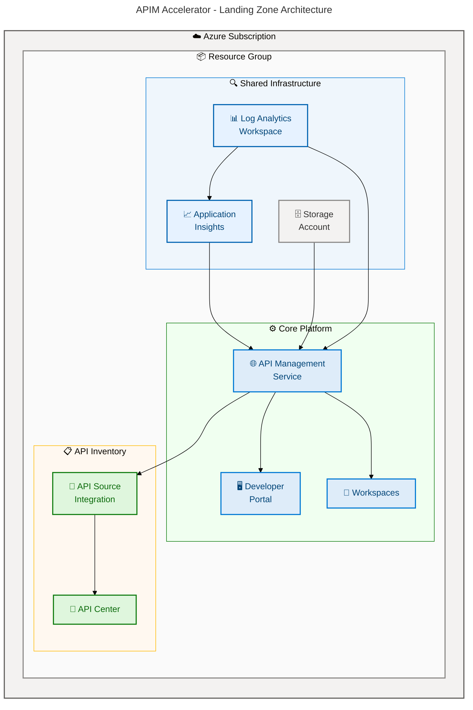

# APIM Accelerator

An enterprise-grade Azure API Management (APIM) Landing Zone accelerator that automates the deployment of a complete API platform using Infrastructure as Code (Bicep) and Azure Developer CLI (`azd`). It provisions API Management with integrated monitoring, developer portal, multi-team workspaces, and centralized API governance through Azure API Center.

> [!NOTE]
> This accelerator follows the [Azure Landing Zone](https://learn.microsoft.com/azure/cloud-adoption-framework/ready/landing-zone/) methodology and is designed for teams adopting a platform engineering approach to API management at scale.

## Table of Contents

- [Overview](#overview)
- [Architecture](#architecture)
- [Features](#features)
- [Requirements](#requirements)
- [Quick Start](#quick-start)
- [Deployment](#deployment)
- [Configuration](#configuration)
- [Project Structure](#project-structure)
- [Contributing](#contributing)
- [License](#license)

## Overview

**Overview**

This accelerator eliminates weeks of manual Azure infrastructure setup by providing production-ready Bicep templates that deploy a fully integrated API Management landing zone in a single command. It targets platform engineering teams, cloud architects, and DevOps engineers who need a repeatable, governed, and observable API platform.

The solution uses a modular, layered deployment pattern — shared monitoring infrastructure is provisioned first, followed by the core API Management platform, and finally the API inventory layer — ensuring correct dependency resolution and consistent environments across dev, test, staging, and production.

> [!TIP]
> Run `azd up` from the repository root to provision the entire landing zone in one step. See [Quick Start](#quick-start) for detailed instructions.

## Architecture

**Overview**

The APIM Accelerator follows a 3-tier modular architecture deployed at the Azure subscription level. Shared infrastructure provides the observability foundation, the core platform delivers API gateway and developer portal capabilities, and the inventory layer enables centralized API governance and discovery.


```mermaid
---
title: "APIM Accelerator - Landing Zone Architecture"
config:
  theme: base
  look: classic
  layout: dagre
  flowchart:
    htmlLabels: true
---
flowchart TB
    accTitle: APIM Accelerator Landing Zone Architecture
    accDescr: Shows the 3-tier deployment architecture with shared monitoring, core API Management platform, and API inventory components deployed into a single resource group

    subgraph subscription["☁️ Azure Subscription"]
        direction TB

        subgraph rg["📦 Resource Group"]
            direction TB

            subgraph shared["🔍 Shared Infrastructure"]
                direction LR
                law["📊 Log Analytics\nWorkspace"]:::core
                ai["📈 Application\nInsights"]:::core
                sa["🗄️ Storage\nAccount"]:::data
            end

            subgraph core["⚙️ Core Platform"]
                direction LR
                apim["🌐 API Management\nService"]:::primary
                portal["🖥️ Developer\nPortal"]:::primary
                ws["📂 Workspaces"]:::primary
            end

            subgraph inventory["📋 API Inventory"]
                direction LR
                apicenter["📑 API Center"]:::success
                apisource["🔗 API Source\nIntegration"]:::success
            end
        end
    end

    law --> ai
    ai --> apim
    sa --> apim
    law --> apim
    apim --> portal
    apim --> ws
    apim --> apisource
    apisource --> apicenter

    style subscription fill:#F3F2F1,stroke:#605E5C,stroke-width:2px
    style rg fill:#FAFAFA,stroke:#8A8886,stroke-width:2px
    style shared fill:#EFF6FC,stroke:#0078D4,stroke-width:1px
    style core fill:#F0FFF0,stroke:#107C10,stroke-width:1px
    style inventory fill:#FFF8F0,stroke:#FFB900,stroke-width:1px

    classDef primary fill:#DEECF9,stroke:#0078D4,stroke-width:2px,color:#004578
    classDef core fill:#E6F2FF,stroke:#0063B1,stroke-width:2px,color:#004578
    classDef success fill:#DFF6DD,stroke:#107C10,stroke-width:2px,color:#0B6A0B
    classDef data fill:#F3F2F1,stroke:#8A8886,stroke-width:2px,color:#323130
```

**Component Roles:**

| Component                  | Purpose                                                             | Module                               |
| -------------------------- | ------------------------------------------------------------------- | ------------------------------------ |
| 📊 Log Analytics Workspace | Centralized log collection, KQL queries, and diagnostics            | `src/shared/monitoring/operational/` |
| 📈 Application Insights    | Application performance monitoring (APM) and distributed tracing    | `src/shared/monitoring/insights/`    |
| 🗄️ Storage Account         | Long-term diagnostic log retention and compliance archival          | `src/shared/monitoring/operational/` |
| 🌐 API Management          | API gateway, policies, rate limiting, and caching                   | `src/core/apim.bicep`                |
| 🖥️ Developer Portal        | Self-service API discovery, testing, and Azure AD authentication    | `src/core/developer-portal.bicep`    |
| 📂 Workspaces              | Multi-team API isolation within a single APIM instance              | `src/core/workspaces.bicep`          |
| 📑 API Center              | Centralized API catalog, governance, and compliance management      | `src/inventory/main.bicep`           |
| 🔗 API Source Integration  | Automatic API discovery and synchronization from APIM to API Center | `src/inventory/main.bicep`           |

**Deployment Sequence:**

1. **Resource Group** — Created at subscription scope
2. **Shared Infrastructure** — Log Analytics, Application Insights, and Storage Account
3. **Core Platform** — API Management service, developer portal, and workspaces (depends on monitoring)
4. **API Inventory** — API Center and API source integration (depends on APIM)

## Features

**Overview**

The accelerator provides six core capabilities that reduce the time to deploy a production-ready API Management platform from weeks to minutes. Each feature is designed for enterprise environments where governance, observability, and multi-team support are requirements, not luxuries.

These capabilities work together as a cohesive platform: monitoring feeds into diagnostics, workspaces enable team isolation, and API Center provides governance across the entire API landscape.

| Feature                   | Description                                                                     | Status    |
| ------------------------- | ------------------------------------------------------------------------------- | --------- |
| 🚀 One-Command Deployment | Provision the entire landing zone with `azd up` using Azure Developer CLI       | ✅ Stable |
| 🔍 Integrated Monitoring  | Log Analytics, Application Insights, and Storage Account deployed automatically | ✅ Stable |
| 🖥️ Developer Portal       | Azure AD-secured self-service portal for API discovery and testing              | ✅ Stable |
| 📂 Workspace Isolation    | Logical multi-team separation within a single APIM instance (Premium SKU)       | ✅ Stable |
| 📑 API Governance         | Centralized API catalog and compliance management via Azure API Center          | ✅ Stable |
| 🔒 Managed Identity       | System-assigned and user-assigned managed identity support across all resources | ✅ Stable |
| 🌍 Multi-Environment      | Support for dev, test, staging, prod, and UAT environment configurations        | ✅ Stable |

## Requirements

**Overview**

Before deploying the APIM Accelerator, you need an active Azure subscription with sufficient permissions and a small set of CLI tools. The accelerator handles all resource provisioning automatically, but the prerequisites below ensure a smooth deployment experience.

All tools listed are freely available and well-documented. The Azure Developer CLI orchestrates the deployment, Azure CLI provides authentication, and Bicep is included with the Azure CLI starting from version 2.20.0.

| Requirement                    | Minimum Version                         | Purpose                                           |
| ------------------------------ | --------------------------------------- | ------------------------------------------------- |
| ☁️ Azure Subscription          | Active subscription                     | Target environment for resource deployment        |
| 🔑 Azure Permissions           | Contributor + User Access Administrator | Create resources and assign RBAC roles            |
| 🛠️ Azure CLI                   | 2.50.0+                                 | Authentication and resource management            |
| ⚡ Azure Developer CLI (`azd`) | 1.0.0+                                  | Deployment orchestration and lifecycle management |
| 🔗 Bicep CLI                   | 0.22.0+ (bundled with Azure CLI)        | Infrastructure as Code compilation                |
| 🌐 Git                         | 2.0+                                    | Repository cloning                                |

> [!IMPORTANT]
> The deployment creates resources using the **Premium** SKU by default, which incurs significant costs. For non-production environments, update the SKU to `Developer` in `infra/settings.yaml`. See [Configuration](#configuration) for details.

## Quick Start

**Overview**

Get the APIM Accelerator running in your Azure subscription in under 10 minutes. This guide walks through the minimal steps to clone the repository, authenticate, and deploy the full landing zone.

```bash
# Clone the repository
git clone https://github.com/Evilazaro/APIM-Accelerator.git
cd APIM-Accelerator

# Authenticate with Azure
az login
azd auth login

# Deploy the entire landing zone (prompts for environment name and region)
azd up
```

The `azd up` command will:

1. Run the pre-provision hook to purge any soft-deleted APIM instances in the target region
2. Create a resource group following the naming convention `apim-accelerator-{env}-{region}-rg`
3. Deploy shared monitoring infrastructure (Log Analytics, Application Insights, Storage Account)
4. Deploy the core API Management service with developer portal and workspaces
5. Deploy API Center with automatic APIM integration

## Deployment

**Overview**

The accelerator supports multiple deployment approaches depending on your workflow. The recommended path uses Azure Developer CLI for full lifecycle management, but direct Bicep deployment is also supported for teams with existing CI/CD pipelines.

### Option 1: Azure Developer CLI (Recommended)

```bash
# Initialize a new environment
azd env new dev

# Set the target Azure region
azd env set AZURE_LOCATION eastus

# Provision infrastructure only
azd provision

# Or provision and deploy in one step
azd up
```

### Option 2: Direct Azure CLI Deployment

```bash
# Deploy using Azure CLI directly
az deployment sub create \
  --location eastus \
  --template-file infra/main.bicep \
  --parameters envName=dev location=eastus
```

### Environment Management

The `azd` CLI supports managing multiple environments for different stages:

```bash
# Create environments for each stage
azd env new dev
azd env new staging
azd env new prod

# Switch between environments
azd env select staging

# Deploy to the selected environment
azd up
```

### Pre-Provision Hook

The deployment includes a pre-provision hook (`infra/azd-hooks/pre-provision.sh`) that automatically purges soft-deleted APIM instances in the target region. This prevents naming conflicts during redeployments.

## Configuration

**Overview**

All environment-specific settings are centralized in a single YAML configuration file at `infra/settings.yaml`. This file controls resource naming, SKU selection, identity configuration, tagging strategy, and workspace definitions. Empty name fields trigger automatic name generation using a deterministic unique suffix.

The configuration is structured into three sections matching the deployment tiers: shared infrastructure, core platform, and API inventory. Each section contains its own tags for granular cost tracking and governance.

### Configuration File Structure

```yaml
# infra/settings.yaml
solutionName: "apim-accelerator"

shared:
  monitoring:
    logAnalytics:
      name: "" # Leave empty for auto-generated name
      identity:
        type: "SystemAssigned"
    applicationInsights:
      name: "" # Leave empty for auto-generated name
  tags:
    CostCenter: "CC-1234"
    Owner: "your-email@domain.com"

core:
  apiManagement:
    name: "" # Leave empty for auto-generated name
    publisherEmail: "admin@contoso.com"
    publisherName: "Contoso"
    sku:
      name: "Premium" # Options: Developer, Basic, Standard, Premium
      capacity: 1 # Scale units (Premium: 1-10)
    identity:
      type: "SystemAssigned"
    workspaces:
      - name: "workspace1"

inventory:
  apiCenter:
    name: "" # Leave empty for auto-generated name
    identity:
      type: "SystemAssigned"
```

### Key Configuration Options

| Setting              | Path                                           | Options                             | Default               |
| -------------------- | ---------------------------------------------- | ----------------------------------- | --------------------- |
| 🏷️ Solution Name     | `solutionName`                                 | Any string                          | `apim-accelerator`    |
| ⚙️ APIM SKU          | `core.apiManagement.sku.name`                  | Developer, Basic, Standard, Premium | `Premium`             |
| 📊 Scale Units       | `core.apiManagement.sku.capacity`              | 1-10 (Premium), 1-4 (Standard)      | `1`                   |
| 🔒 Identity Type     | `core.apiManagement.identity.type`             | SystemAssigned, UserAssigned        | `SystemAssigned`      |
| 📧 Publisher Email   | `core.apiManagement.publisherEmail`            | Valid email address                 | `evilazaro@gmail.com` |
| 📂 Workspaces        | `core.apiManagement.workspaces`                | Array of `{ name: string }`         | 1 workspace           |
| 📈 Log Analytics SKU | `shared.monitoring.logAnalytics.identity.type` | SystemAssigned, UserAssigned        | `SystemAssigned`      |

### Environment Parameters

Deployment parameters are passed via `infra/main.parameters.json` and support Azure Developer CLI variable substitution:

| Parameter     | Description                          | Example                                 |
| ------------- | ------------------------------------ | --------------------------------------- |
| 🌍 `envName`  | Target environment identifier        | `dev`, `test`, `staging`, `prod`, `uat` |
| 📍 `location` | Azure region for resource deployment | `eastus`, `westus2`, `westeurope`       |

## Project Structure

```text
APIM-Accelerator/
├── azure.yaml                        # Azure Developer CLI configuration
├── LICENSE                           # MIT License
├── infra/                            # Infrastructure deployment
│   ├── main.bicep                    # Main orchestration template (subscription scope)
│   ├── main.parameters.json          # Deployment parameters with azd variable support
│   ├── settings.yaml                 # Centralized environment configuration
│   └── azd-hooks/
│       └── pre-provision.sh          # Pre-deployment hook for APIM cleanup
└── src/                              # Modular Bicep source templates
    ├── core/                         # Core API Management platform
    │   ├── main.bicep                # Core module orchestrator
    │   ├── apim.bicep                # APIM service resource definition
    │   ├── developer-portal.bicep    # Developer portal with Azure AD auth
    │   └── workspaces.bicep          # Workspace isolation configuration
    ├── inventory/                    # API governance and catalog
    │   └── main.bicep                # API Center with APIM integration
    └── shared/                       # Shared infrastructure services
        ├── main.bicep                # Shared module orchestrator
        ├── common-types.bicep        # Reusable Bicep type definitions
        ├── constants.bicep           # Shared constants and utility functions
        ├── monitoring/               # Observability infrastructure
        │   ├── main.bicep            # Monitoring orchestrator
        │   ├── insights/
        │   │   └── main.bicep        # Application Insights deployment
        │   └── operational/
        │       └── main.bicep        # Log Analytics and Storage Account
        └── networking/
            └── main.bicep            # Network infrastructure (placeholder)
```

## Contributing

**Overview**

Contributions are welcome and encouraged. Whether you are fixing a bug, improving documentation, or adding a new feature, your input helps make this accelerator better for the entire community. The project follows standard GitHub collaboration workflows.

To contribute, fork the repository, create a feature branch, make your changes, and submit a pull request. Please ensure your Bicep templates follow the existing naming conventions and include descriptive `@description` decorators on all parameters, variables, and resources.

1. **Fork** the repository
2. **Create** a feature branch: `git checkout -b feature/my-improvement`
3. **Commit** your changes: `git commit -m "Add my improvement"`
4. **Push** to your branch: `git push origin feature/my-improvement`
5. **Open** a Pull Request against the `main` branch

### Coding Guidelines

- Use `@description()` decorators on all Bicep parameters, variables, and resources
- Follow the naming convention: `{solutionName}-{uniqueSuffix}-{resourceType}`
- Include module-level documentation comments at the top of each `.bicep` file
- Add tags to all deployed resources for governance and cost tracking

## License

This project is licensed under the **MIT License**. See the [LICENSE](LICENSE) file for details.

Copyright (c) 2025 Evilázaro Alves
