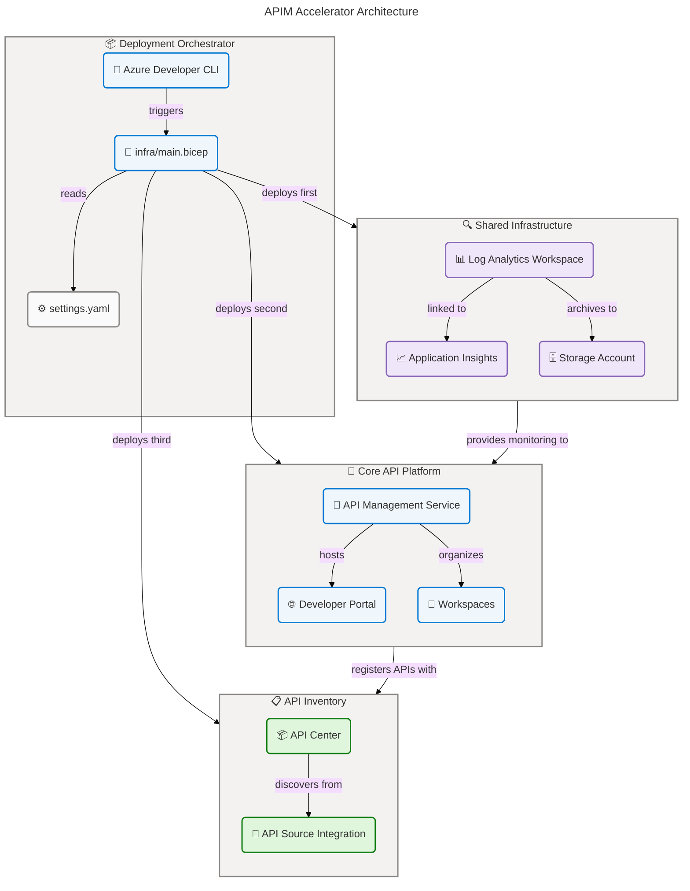

# APIM Accelerator

[](https://learn.microsoft.com/azure/api-management/)
[](https://learn.microsoft.com/azure/azure-resource-manager/bicep/)
[](LICENSE)
[](https://learn.microsoft.com/azure/developer/azure-developer-cli/)


**Overview**

The APIM Accelerator is an Azure API Management landing zone solution that deploys a production-ready API platform on Azure using Infrastructure as Code (Bicep). It provisions a fully configured API Management service, integrated monitoring stack, developer portal with Azure AD authentication, and centralized API governance through API Center.

This accelerator reduces the time to deploy a compliant, enterprise-grade API Management environment from weeks to minutes. It follows Azure landing zone principles with modular Bicep templates, centralized configuration through a single YAML settings file, and one-command provisioning via Azure Developer CLI (`azd`). Teams gain a complete API platform with multi-workspace isolation, comprehensive observability, and built-in governance capabilities.

> [!TIP]
> Run `azd init --template Evilazaro/APIM-Accelerator` followed by `azd provision` to deploy the entire APIM landing zone. The accelerator handles resource group creation, monitoring infrastructure, API Management deployment, and API Center configuration automatically.

## Table of Contents

- [Architecture](#architecture)
- [Features](#features)
- [Requirements](#requirements)
- [Getting Started](#getting-started)
- [Configuration](#configuration)
- [Project Structure](#project-structure)
- [Contributing](#contributing)
- [License](#license)

## Architecture

**Overview**

The APIM Accelerator follows a modular, layered architecture aligned with Azure landing zone principles. The deployment orchestrator provisions resources in a dependency-ordered sequence: shared monitoring infrastructure first, then the core API Management platform, and finally the API inventory layer.

The architecture separates concerns into three tiers. The shared tier provides Log Analytics, Application Insights, and diagnostic storage. The core tier deploys the API Management service with managed identity, developer portal, and workspaces. The inventory tier provisions API Center for centralized API governance and automated discovery from the APIM instance.


```mermaid
---
title: "APIM Accelerator Architecture"
config:
  theme: base
  look: classic
  layout: dagre
  themeVariables:
    fontSize: '16px'
  flowchart:
    htmlLabels: true
---
flowchart TB
    accTitle: APIM Accelerator Architecture
    accDescr: Shows the three-tier architecture of the APIM Accelerator including shared monitoring, core API Management platform, and API inventory layers with deployment dependencies

    %% ═══════════════════════════════════════════════════════════════════════════
    %% AZURE / FLUENT ARCHITECTURE PATTERN v1.1
    %% (Semantic + Structural + Font + Accessibility Governance)
    %% ═══════════════════════════════════════════════════════════════════════════
    %% PHASE 1 - FLUENT UI: All styling uses approved Fluent UI palette only
    %% PHASE 2 - GROUPS: Every subgraph has semantic color via style directive
    %% PHASE 3 - COMPONENTS: Every node has semantic classDef + icon prefix
    %% PHASE 4 - ACCESSIBILITY: accTitle/accDescr present, WCAG AA contrast
    %% PHASE 5 - STANDARD: Governance block present, classDefs centralized
    %% ═══════════════════════════════════════════════════════════════════════════

    subgraph orchestrator["📦 Deployment Orchestrator"]
        direction TB
        azd("🚀 Azure Developer CLI"):::core
        mainBicep("📄 infra/main.bicep"):::core
        settings("⚙️ settings.yaml"):::neutral

        azd -->|"triggers"| mainBicep
        mainBicep -->|"reads"| settings
    end

    subgraph shared["🔍 Shared Infrastructure"]
        direction TB
        law("📊 Log Analytics Workspace"):::data
        appInsights("📈 Application Insights"):::data
        storage("🗄️ Storage Account"):::data

        law -->|"linked to"| appInsights
        law -->|"archives to"| storage
    end

    subgraph coreLayer["🏢 Core API Platform"]
        direction TB
        apim("🔌 API Management Service"):::core
        devPortal("🌐 Developer Portal"):::core
        workspaces("📂 Workspaces"):::core

        apim -->|"hosts"| devPortal
        apim -->|"organizes"| workspaces
    end

    subgraph inventoryLayer["📋 API Inventory"]
        direction TB
        apiCenter("📦 API Center"):::success
        apiSource("🔗 API Source Integration"):::success

        apiCenter -->|"discovers from"| apiSource
    end

    mainBicep -->|"deploys first"| shared
    mainBicep -->|"deploys second"| coreLayer
    mainBicep -->|"deploys third"| inventoryLayer
    shared -->|"provides monitoring to"| coreLayer
    coreLayer -->|"registers APIs with"| inventoryLayer

    %% Centralized semantic classDefs (Phase 5 compliant)
    classDef neutral fill:#FAFAFA,stroke:#8A8886,stroke-width:2px,color:#323130
    classDef core fill:#EFF6FC,stroke:#0078D4,stroke-width:2px,color:#323130
    classDef success fill:#DFF6DD,stroke:#107C10,stroke-width:2px,color:#323130
    classDef data fill:#F0E6FA,stroke:#8764B8,stroke-width:2px,color:#323130

    style orchestrator fill:#F3F2F1,stroke:#8A8886,stroke-width:2px,color:#323130
    style shared fill:#F3F2F1,stroke:#8A8886,stroke-width:2px,color:#323130
    style coreLayer fill:#F3F2F1,stroke:#8A8886,stroke-width:2px,color:#323130
    style inventoryLayer fill:#F3F2F1,stroke:#8A8886,stroke-width:2px,color:#323130
```

**Component Roles:**

| Component                      | Purpose                                                   | Source             |
| ------------------------------ | --------------------------------------------------------- | ------------------ |
| 📦 **Deployment Orchestrator** | Coordinates end-to-end provisioning via `azd` and Bicep   | `infra/main.bicep` |
| 🔍 **Shared Infrastructure**   | Provides centralized monitoring, logging, and diagnostics | `src/shared/`      |
| 🏢 **Core API Platform**       | Deploys API Management with portal and workspaces         | `src/core/`        |
| 📋 **API Inventory**           | Enables API governance and automated discovery            | `src/inventory/`   |

## Features

**Overview**

The APIM Accelerator delivers a complete API Management landing zone with six core capabilities designed for enterprise-grade API platform operations. Each capability is implemented as a modular Bicep template that can be configured independently through `infra/settings.yaml`.

These features address the full lifecycle of API platform management, from infrastructure provisioning and identity security to developer experience and API governance. The modular design enables teams to adopt individual capabilities incrementally while maintaining a consistent deployment pattern.

| Feature                           | Description                                                                                                                                         | Status    |
| --------------------------------- | --------------------------------------------------------------------------------------------------------------------------------------------------- | --------- |
| 🔌 **API Management Service**     | Deploys Azure APIM with configurable SKU (Developer through Premium), managed identity, and optional VNet integration for private deployments       | ✅ Stable |
| 🔒 **Managed Identity & RBAC**    | Supports System-assigned and User-assigned managed identities with automatic role assignments for secure, credential-free Azure service integration | ✅ Stable |
| 📊 **Comprehensive Monitoring**   | Provisions Log Analytics workspace, Application Insights, and diagnostic storage account with full telemetry capture across all deployed resources  | ✅ Stable |
| 🌐 **Developer Portal**           | Configures self-service developer portal with Azure AD authentication, CORS policies, sign-in/sign-up flows, and terms of service enforcement       | ✅ Stable |
| 📂 **Workspace Isolation**        | Creates APIM workspaces for multi-team API isolation, enabling independent API lifecycle management within a shared infrastructure                  | ✅ Stable |
| 📋 **API Inventory & Governance** | Deploys Azure API Center with APIM integration for automated API discovery, centralized catalog, and compliance management via RBAC                 | ✅ Stable |

## Requirements

**Overview**

The APIM Accelerator requires an Azure subscription, Azure CLI, and Azure Developer CLI as core prerequisites. These tools handle authentication, resource provisioning, and deployment orchestration for the entire landing zone.

All infrastructure is defined as Bicep templates with no additional runtime dependencies. The deployment process is fully automated through `azd` lifecycle hooks including a pre-provision script that purges soft-deleted APIM instances to prevent naming conflicts during redeployment.

| Requirement                      | Details                                                                                        | Installation                                                                                   |
| -------------------------------- | ---------------------------------------------------------------------------------------------- | ---------------------------------------------------------------------------------------------- |
| ☁️ **Azure Subscription**        | Active subscription with permissions to create resource groups, APIM, and API Center resources | [Create a free account](https://azure.microsoft.com/free/)                                     |
| 🛠️ **Azure CLI**                 | Version 2.50 or later for Azure resource management and authentication                         | [Install Azure CLI](https://learn.microsoft.com/cli/azure/install-azure-cli)                   |
| 🚀 **Azure Developer CLI**       | `azd` for one-command provisioning and lifecycle management                                    | [Install azd](https://learn.microsoft.com/azure/developer/azure-developer-cli/install-azd)     |
| 📦 **Bicep CLI**                 | Included with Azure CLI; used for compiling Bicep templates to ARM                             | Bundled with Azure CLI                                                                         |
| 🔑 **Azure AD App Registration** | Required for developer portal authentication with client ID and client secret                  | [Register an app](https://learn.microsoft.com/entra/identity-platform/quickstart-register-app) |
| 🐚 **Bash Shell**                | Required for pre-provision hook script execution (Git Bash on Windows)                         | Included with Git for Windows                                                                  |

## Getting Started

**Overview**

Getting started with the APIM Accelerator uses the Azure Developer CLI (`azd`) template workflow. The `azd init` command scaffolds the project locally, and `azd provision` deploys all infrastructure to Azure. There is no application code to deploy — this is a pure Infrastructure as Code project.

The deployment operates at the subscription scope, creating a resource group named `{solutionName}-{envName}-{location}-rg` and deploying all resources within it. A pre-provision hook automatically purges soft-deleted APIM instances to prevent naming conflicts.

### Quick Start

1. **Initialize the project from the template**

```bash
azd init --template Evilazaro/APIM-Accelerator
```

2. **Authenticate with Azure**

```bash
azd auth login
```

3. **Provision the landing zone**

```bash
azd provision
```

> [!NOTE]
> `azd init` prompts for an environment name (e.g., `dev`, `test`, `prod`). `azd provision` prompts for an Azure subscription and region. The environment name maps to the `envName` parameter which controls resource naming and tagging.

### Provisioning Sequence

The `azd provision` command executes the following sequence:

```text
Pre-provision hook (purge soft-deleted APIM instances)
  → Resource group creation ({solutionName}-{envName}-{location}-rg)
    → Shared monitoring deployment (Log Analytics, App Insights, Storage)
      → Core APIM platform deployment (APIM service, portal, workspaces)
        → API inventory deployment (API Center, API source integration)
```

### Lifecycle Commands

| Command            | Purpose                                |
| ------------------ | -------------------------------------- |
| 📦 `azd provision` | Provision all Azure infrastructure     |
| 🗑️ `azd down`      | Remove all provisioned Azure resources |

### Pre-Provision Hook

The `infra/azd-hooks/pre-provision.sh` script runs automatically before provisioning. It purges all soft-deleted APIM instances in the target region to enable clean redeployment:

```bash
# The hook is triggered automatically by azd
# Manual execution (if needed):
./infra/azd-hooks/pre-provision.sh "East US"
```

### Provisioned Resources

After successful provisioning, the following resources are created in your Azure subscription:

| Resource                       | Type                                                 | Purpose                                    |
| ------------------------------ | ---------------------------------------------------- | ------------------------------------------ |
| 📊 **Log Analytics Workspace** | `Microsoft.OperationalInsights/workspaces`           | Centralized log collection and KQL queries |
| 📈 **Application Insights**    | `Microsoft.Insights/components`                      | Application performance monitoring         |
| 🗄️ **Storage Account**         | `Microsoft.Storage/storageAccounts`                  | Diagnostic log archival                    |
| 🔌 **API Management**          | `Microsoft.ApiManagement/service`                    | API gateway, policies, and management      |
| 🌐 **Developer Portal**        | APIM sub-resource                                    | Self-service API documentation and testing |
| 📂 **APIM Workspace**          | `Microsoft.ApiManagement/service/workspaces`         | Team-based API isolation                   |
| 📦 **API Center**              | `Microsoft.ApiCenter/services`                       | API inventory and governance               |
| 🔗 **API Source**              | `Microsoft.ApiCenter/services/workspaces/apiSources` | Automated API discovery from APIM          |

## Configuration

**Overview**

All deployment configuration is centralized in `infra/settings.yaml`. This single file controls every configurable aspect of the landing zone: the APIM service tier and identity, monitoring infrastructure, workspace definitions, API Center settings, and governance tags. The configuration is organized by deployment tier (shared, core, inventory) and each tier maps directly to a feature in the accelerator.

Deployment-level parameters (`envName` and `location`) are passed through `infra/main.parameters.json` and are automatically populated by `azd` from the environment you created during `azd init`. The `envName` value determines the resource group name, is applied as a tag to all resources, and supports five environments: `dev`, `test`, `staging`, `prod`, and `uat`.

### Environment Parameters

The `infra/main.parameters.json` file supplies two parameters that `azd` resolves from your environment:

```json
{
  "parameters": {
    "envName": { "value": "${AZURE_ENV_NAME}" },
    "location": { "value": "${AZURE_LOCATION}" }
  }
}
```

| Parameter     | Type     | Allowed Values                          | Description                                                   |
| ------------- | -------- | --------------------------------------- | ------------------------------------------------------------- |
| ⚙️ `envName`  | `string` | `dev`, `test`, `staging`, `prod`, `uat` | Environment name — controls resource group naming and tagging |
| 🌍 `location` | `string` | Any Azure region                        | Azure region for all resources                                |

To provision separate environments, create additional `azd` environments:

```bash
azd init --template Evilazaro/APIM-Accelerator   # creates "dev" environment
azd env new staging                                # creates "staging" environment
azd provision --environment staging                # provisions staging resources
```

Each environment gets its own resource group (`apim-accelerator-staging-eastus-rg`) and its own set of resources, all from the same `settings.yaml`.

### Settings File

The `infra/settings.yaml` file is the single source of configuration. Every feature in the accelerator has a corresponding section. Resource names left empty are auto-generated using the pattern `{solutionName}-{uniqueSuffix}-{resourceType}`.

```yaml
solutionName: "apim-accelerator"

shared:
  monitoring:
    logAnalytics:
      name: "" # Auto-generated if empty
      workSpaceResourceId: "" # Existing workspace ID (if reusing)
      identity:
        type: "SystemAssigned" # SystemAssigned or UserAssigned
        userAssignedIdentities: [] # Required if UserAssigned
    applicationInsights:
      name: "" # Auto-generated if empty
      logAnalyticsWorkspaceResourceId: "" # Linked Log Analytics workspace
    tags:
      lz-component-type: "shared"
      component: "monitoring"
  tags:
    CostCenter: "CC-1234"
    BusinessUnit: "IT"
    Owner: "evilazaro@gmail.com"
    ApplicationName: "APIM Platform"
    ProjectName: "APIMForAll"
    ServiceClass: "Critical" # Critical, Standard, or Experimental
    RegulatoryCompliance: "GDPR" # GDPR, HIPAA, PCI, or None
    SupportContact: "evilazaro@gmail.com"
    ChargebackModel: "Dedicated"
    BudgetCode: "FY25-Q1-InitiativeX"

core:
  apiManagement:
    name: "" # Auto-generated if empty
    publisherEmail: "evilazaro@gmail.com"
    publisherName: "Contoso"
    sku:
      name: "Premium" # See SKU Options below
      capacity: 1 # Scale units (Premium: 1-10)
    identity:
      type: "SystemAssigned" # SystemAssigned, UserAssigned, or Both
      userAssignedIdentities: []
    workspaces:
      - name: "workspace1"
  tags:
    lz-component-type: "core"
    component: "apiManagement"

inventory:
  apiCenter:
    name: "" # Auto-generated if empty
    identity:
      type: "SystemAssigned" # SystemAssigned, UserAssigned, None, or both
      userAssignedIdentities: []
  tags:
    lz-component-type: "shared"
    component: "inventory"
```

### Feature-to-Configuration Mapping

Each feature listed in the [Features](#features) section maps to a specific configuration block. The table below shows where to configure each capability:

| Feature                           | Configuration Path                                                                                       | Key Settings                                                             |
| --------------------------------- | -------------------------------------------------------------------------------------------------------- | ------------------------------------------------------------------------ |
| 🔌 **API Management Service**     | `core.apiManagement`                                                                                     | `sku.name`, `sku.capacity`, `publisherEmail`, `publisherName`            |
| 🔒 **Managed Identity & RBAC**    | `core.apiManagement.identity`, `shared.monitoring.logAnalytics.identity`, `inventory.apiCenter.identity` | `type` (`SystemAssigned`, `UserAssigned`), `userAssignedIdentities`      |
| 📊 **Comprehensive Monitoring**   | `shared.monitoring`                                                                                      | `logAnalytics.name`, `logAnalytics.identity`, `applicationInsights.name` |
| 🌐 **Developer Portal**           | Azure AD App Registration                                                                                | `clientId` and `clientSecret` passed from APIM managed identity          |
| 📂 **Workspace Isolation**        | `core.apiManagement.workspaces`                                                                          | Array of `{ name: "workspace-name" }` entries (Premium SKU only)         |
| 📋 **API Inventory & Governance** | `inventory.apiCenter`                                                                                    | `name`, `identity.type`, `identity.userAssignedIdentities`               |

### Configuring the APIM Service

The `core.apiManagement` section controls the API Management service deployment:

```yaml
core:
  apiManagement:
    name: "" # Leave empty for auto-generated name
    publisherEmail: "admin@contoso.com" # Required — displayed in APIM portal
    publisherName: "Contoso" # Required — organization name
    sku:
      name: "Developer" # Change SKU for different environments
      capacity: 1
    identity:
      type: "SystemAssigned"
    workspaces:
      - name: "team-a"
      - name: "team-b"
```

### SKU Options

The `core.apiManagement.sku.name` setting controls the service tier. Choose based on your environment and requirements:

| SKU                          | Use Case                              | SLA    | VNet Support | Workspaces |
| ---------------------------- | ------------------------------------- | ------ | ------------ | ---------- |
| 🧪 **Developer**             | Non-production testing and evaluation | No SLA | ❌           | ❌         |
| 📦 **Basic / BasicV2**       | Small-scale production workloads      | ✅     | ❌           | ❌         |
| ⚙️ **Standard / StandardV2** | Medium-scale production workloads     | ✅     | ❌           | ❌         |
| 🏢 **Premium**               | Enterprise with multi-region and VNet | ✅     | ✅           | ✅         |
| ⚡ **Consumption**           | Serverless, pay-per-execution model   | ✅     | ❌           | ❌         |

### Configuring Monitoring

The `shared.monitoring` section controls the observability stack. Both Log Analytics and Application Insights names can be auto-generated or explicitly set:

```yaml
shared:
  monitoring:
    logAnalytics:
      name: "my-custom-workspace" # Or "" for auto-generation
      workSpaceResourceId: "" # Set to reuse an existing workspace
      identity:
        type: "SystemAssigned"
        userAssignedIdentities: []
    applicationInsights:
      name: "" # Auto-generated
      logAnalyticsWorkspaceResourceId: "" # Auto-linked if empty
```

### Configuring Workspaces

Workspaces provide team-level isolation within a single APIM instance. Add entries to `core.apiManagement.workspaces` to create additional workspaces:

```yaml
core:
  apiManagement:
    workspaces:
      - name: "payments-team"
      - name: "identity-team"
      - name: "partner-apis"
```

> [!WARNING]
> Workspaces require Premium SKU. If `sku.name` is set to a non-Premium tier, workspace creation will not be supported. Virtual network integration also requires Premium SKU. Choose the appropriate tier based on your production requirements before provisioning.

### Configuring API Center

The `inventory.apiCenter` section controls API governance. API Center automatically discovers APIs from the deployed APIM instance:

```yaml
inventory:
  apiCenter:
    name: "" # Auto-generated
    identity:
      type: "SystemAssigned" # Required for RBAC-based API discovery
      userAssignedIdentities: []
```

API Center receives two RBAC role assignments automatically:

- **API Center Data Reader** — reads API definitions and metadata from APIM
- **API Center Compliance Manager** — manages governance policies and API lifecycle

### Configuring Tags

Tags are applied per tier and merged with deployment metadata (`environment`, `managedBy`, `templateVersion`). Customize them for your organization's governance requirements:

```yaml
shared:
  tags:
    CostCenter: "CC-5678"
    BusinessUnit: "Engineering"
    Owner: "platform-team@contoso.com"
    ServiceClass: "Standard" # Critical, Standard, or Experimental
    RegulatoryCompliance: "HIPAA" # GDPR, HIPAA, PCI, or None
```

### Environment Configuration Examples

The same `settings.yaml` is used across all environments. Differentiate environments by adjusting settings before provisioning each one.

**Development Environment** — Use `Developer` SKU for cost efficiency, no workspaces or VNet needed:

```yaml
core:
  apiManagement:
    sku:
      name: "Developer" # No SLA, lowest cost
      capacity: 1
    identity:
      type: "SystemAssigned"
    workspaces: [] # No workspaces needed for dev
  tags:
    lz-component-type: "core"
    component: "apiManagement"

shared:
  tags:
    ServiceClass: "Experimental"
    RegulatoryCompliance: "None"
```

```bash
azd env new dev
azd provision --environment dev
```

**Production Environment** — Use `Premium` SKU for SLA, VNet, and workspace isolation:

```yaml
core:
  apiManagement:
    sku:
      name: "Premium" # SLA-backed, VNet + workspaces supported
      capacity: 2 # 2 scale units for high availability
    identity:
      type: "SystemAssigned"
    workspaces:
      - name: "payments-team"
      - name: "identity-team"
      - name: "partner-apis"
  tags:
    lz-component-type: "core"
    component: "apiManagement"

shared:
  tags:
    ServiceClass: "Critical"
    RegulatoryCompliance: "GDPR"
```

```bash
azd env new prod
azd provision --environment prod
```

**Staging / UAT Environment** — Use `Standard` SKU for production validation without Premium costs:

```yaml
core:
  apiManagement:
    sku:
      name: "Standard" # SLA-backed, production-like without VNet
      capacity: 1
    identity:
      type: "SystemAssigned"
    workspaces: [] # Workspaces not supported on Standard
  tags:
    lz-component-type: "core"
    component: "apiManagement"

shared:
  tags:
    ServiceClass: "Standard"
    RegulatoryCompliance: "GDPR"
```

```bash
azd env new staging
azd provision --environment staging
```

### Settings Reference

| Setting                       | Path                                           | Description                                                | Default            |
| ----------------------------- | ---------------------------------------------- | ---------------------------------------------------------- | ------------------ |
| ⚙️ **Solution Name**          | `solutionName`                                 | Base name for all generated resource names                 | `apim-accelerator` |
| 📊 **Log Analytics Name**     | `shared.monitoring.logAnalytics.name`          | Workspace name; empty for auto-generation                  | `""`               |
| 📊 **Log Analytics Identity** | `shared.monitoring.logAnalytics.identity.type` | Managed identity type for Log Analytics                    | `SystemAssigned`   |
| 📈 **App Insights Name**      | `shared.monitoring.applicationInsights.name`   | Instance name; empty for auto-generation                   | `""`               |
| 🔌 **APIM Name**              | `core.apiManagement.name`                      | Service name; empty for auto-generation                    | `""`               |
| 📧 **Publisher Email**        | `core.apiManagement.publisherEmail`            | Contact email displayed in APIM                            | Required           |
| 🏷️ **Publisher Name**         | `core.apiManagement.publisherName`             | Organization name in developer portal                      | `Contoso`          |
| 💎 **SKU Name**               | `core.apiManagement.sku.name`                  | Service tier (see SKU Options)                             | `Premium`          |
| 📏 **SKU Capacity**           | `core.apiManagement.sku.capacity`              | Number of scale units                                      | `1`                |
| 🔒 **APIM Identity**          | `core.apiManagement.identity.type`             | Managed identity: SystemAssigned, UserAssigned, or Both    | `SystemAssigned`   |
| 📂 **Workspaces**             | `core.apiManagement.workspaces`                | List of workspace names (Premium only)                     | `[workspace1]`     |
| 📦 **API Center Name**        | `inventory.apiCenter.name`                     | API Center name; empty for auto-generation                 | `""`               |
| 🔐 **API Center Identity**    | `inventory.apiCenter.identity.type`            | API Center identity: SystemAssigned, UserAssigned, or None | `SystemAssigned`   |
| 🏷️ **Shared Tags**            | `shared.tags`                                  | Governance tags for shared resources                       | See settings file  |
| 🏷️ **Core Tags**              | `core.tags`                                    | Governance tags for core resources                         | See settings file  |
| 🏷️ **Inventory Tags**         | `inventory.tags`                               | Governance tags for inventory resources                    | See settings file  |

## Project Structure

```text
├── azure.yaml                      # Azure Developer CLI configuration
├── LICENSE                         # MIT License
├── infra/
│   ├── main.bicep                  # Main orchestration template (subscription scope)
│   ├── main.parameters.json        # Deployment parameters (azd-resolved)
│   ├── settings.yaml               # Centralized configuration for all services
│   └── azd-hooks/
│       └── pre-provision.sh        # Pre-provision hook for APIM cleanup
└── src/
    ├── core/
    │   ├── main.bicep              # Core platform orchestrator
    │   ├── apim.bicep              # API Management service definition
    │   ├── developer-portal.bicep  # Developer portal with Azure AD
    │   └── workspaces.bicep        # APIM workspace creation
    ├── inventory/
    │   └── main.bicep              # API Center with APIM integration
    └── shared/
        ├── main.bicep              # Shared infrastructure orchestrator
        ├── common-types.bicep      # Reusable type definitions
        ├── constants.bicep         # Shared constants and utility functions
        ├── monitoring/
        │   ├── main.bicep          # Monitoring orchestrator
        │   ├── insights/
        │   │   └── main.bicep      # Application Insights deployment
        │   └── operational/
        │       └── main.bicep      # Log Analytics and storage deployment
        └── networking/
            └── main.bicep          # Networking placeholder (future)
```

## Contributing

**Overview**

Contributions to the APIM Accelerator are welcome and follow the standard GitHub fork-and-pull-request workflow. All contributions must maintain the existing Bicep module structure, follow the established naming conventions, and include comprehensive documentation in template headers.

Before submitting changes, verify that your Bicep templates compile successfully using `az bicep build` and that all parameter descriptions follow the `@description()` decorator pattern used throughout the codebase.

### How to Contribute

1. Fork the repository
2. Create a feature branch from `main`
3. Make your changes following the existing code conventions
4. Validate Bicep templates compile without errors:

```bash
az bicep build --file infra/main.bicep
```

5. Submit a pull request with a clear description of changes

### Code Conventions

- Use `@description()` decorators on all parameters, variables, and resources
- Follow the naming pattern `{solutionName}-{uniqueSuffix}-{resourceType}`
- Organize modules by tier: `src/shared/`, `src/core/`, `src/inventory/`
- Include usage examples in module header comments
- Define reusable types in `src/shared/common-types.bicep`
- Export shared constants through `src/shared/constants.bicep`

## License

This project is licensed under the MIT License. See the [LICENSE](LICENSE) file for details.

Copyright (c) 2025 Evilázaro Alves
