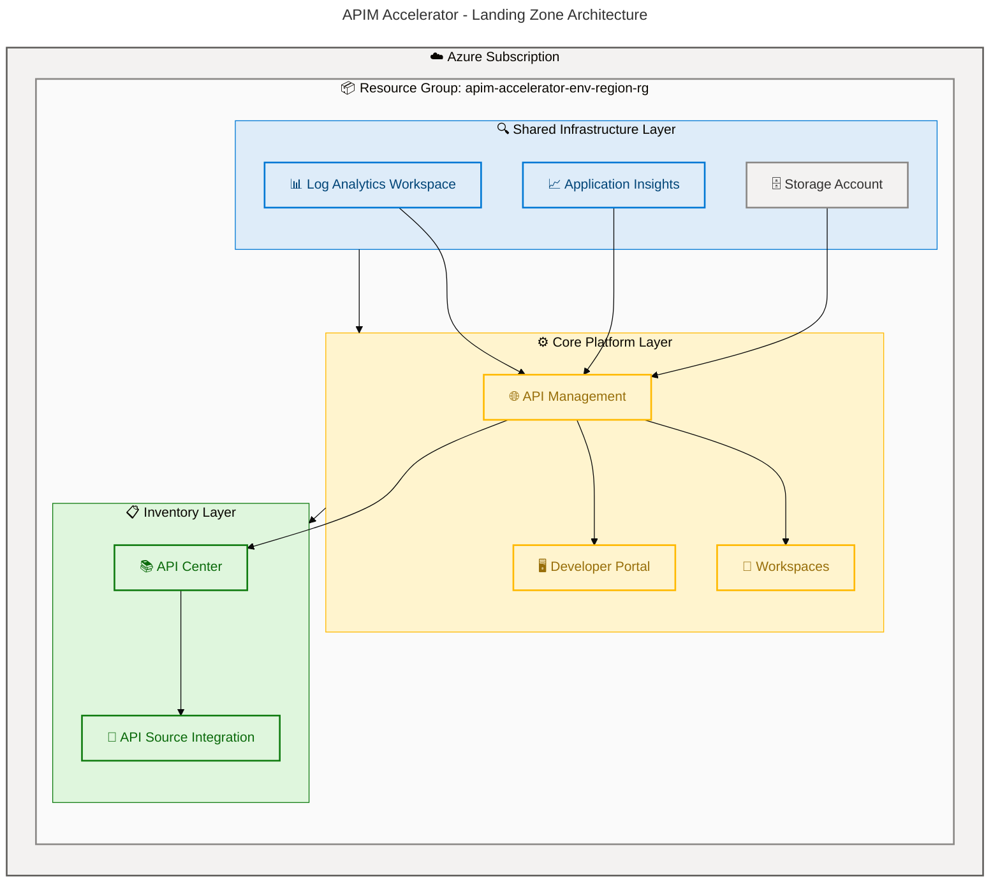

# APIM Accelerator

[](https://learn.microsoft.com/azure/api-management/)
[](https://learn.microsoft.com/azure/azure-resource-manager/bicep/)
[](https://learn.microsoft.com/azure/developer/azure-developer-cli/)
[](LICENSE)
[](https://github.com/Evilazaro/APIM-Accelerator)

## Overview

**Overview**

The APIM Accelerator is a production-ready Azure landing zone accelerator that deploys a complete API Management platform using Bicep Infrastructure-as-Code templates and Azure Developer CLI (`azd`). It provides enterprise teams with a standardized, repeatable foundation for governing, publishing, and monitoring APIs at scale on Azure.

The accelerator follows a modular architecture organized into three deployment layers — shared monitoring infrastructure, core API Management platform, and API inventory governance — each orchestrated through a single subscription-level Bicep template. Deploy the entire solution with a single `azd up` command, receiving a fully configured API Management instance with integrated monitoring, developer portal, workspaces for team isolation, and centralized API governance through Azure API Center.

> [!NOTE]
> This accelerator deploys Azure API Management with the **Premium** SKU by default, which enables features such as multi-region deployments, VNet integration, and workspaces. Review the [Configuration](#configuration) section to adjust the SKU tier for non-production environments.

## Table of Contents

- [Overview](#overview)
- [Architecture](#architecture)
- [Features](#features)
- [Requirements](#requirements)
- [Quick Start](#quick-start)
- [Deployment](#deployment)
- [Configuration](#configuration)
- [Project Structure](#project-structure)
- [Usage](#usage)
- [Troubleshooting](#troubleshooting)
- [Contributing](#contributing)
- [License](#license)

## Architecture

**Overview**

The solution uses a layered deployment model at Azure subscription scope. The orchestration template (`infra/main.bicep`) creates a resource group and deploys three module layers in sequence, with each layer building on the outputs of the previous one.


```mermaid
---
title: "APIM Accelerator - Landing Zone Architecture"
config:
  theme: base
  look: classic
  layout: dagre
  flowchart:
    htmlLabels: true
---
flowchart TB
    accTitle: APIM Accelerator Landing Zone Architecture
    accDescr: Shows the three-layer deployment architecture with shared monitoring, core API Management platform, and API inventory governance components

    subgraph azure["☁️ Azure Subscription"]
        direction TB

        subgraph rg["📦 Resource Group: apim-accelerator-env-region-rg"]
            direction TB

            subgraph shared["🔍 Shared Infrastructure Layer"]
                direction LR
                law["📊 Log Analytics Workspace"]:::core
                ai["📈 Application Insights"]:::core
                sa["🗄️ Storage Account"]:::data
            end

            subgraph core["⚙️ Core Platform Layer"]
                direction LR
                apim["🌐 API Management"]:::primary
                ws["🏢 Workspaces"]:::primary
                dp["🖥️ Developer Portal"]:::primary
            end

            subgraph inventory["📋 Inventory Layer"]
                direction LR
                ac["📚 API Center"]:::success
                acsrc["🔗 API Source Integration"]:::success
            end
        end
    end

    shared --> core
    core --> inventory
    law --> apim
    ai --> apim
    sa --> apim
    apim --> ws
    apim --> dp
    apim --> ac
    ac --> acsrc

    style azure fill:#F3F2F1,stroke:#605E5C,stroke-width:2px
    style rg fill:#FAFAFA,stroke:#8A8886,stroke-width:2px
    style shared fill:#DEECF9,stroke:#0078D4,stroke-width:1px
    style core fill:#FFF4CE,stroke:#FFB900,stroke-width:1px
    style inventory fill:#DFF6DD,stroke:#107C10,stroke-width:1px

    classDef primary fill:#FFF4CE,stroke:#FFB900,stroke-width:2px,color:#986F0B
    classDef core fill:#DEECF9,stroke:#0078D4,stroke-width:2px,color:#004578
    classDef data fill:#F3F2F1,stroke:#8A8886,stroke-width:2px,color:#323130
    classDef success fill:#DFF6DD,stroke:#107C10,stroke-width:2px,color:#0B6A0B
```

**Component Roles:**

| Layer        | Component               | Purpose                                                    |
| ------------ | ----------------------- | ---------------------------------------------------------- |
| 🔍 Shared    | Log Analytics Workspace | Centralized log aggregation and KQL-based analysis         |
| 🔍 Shared    | Application Insights    | Application performance monitoring and distributed tracing |
| 🔍 Shared    | Storage Account         | Long-term diagnostic log archival and compliance retention |
| ⚙️ Core      | API Management          | API gateway, policies, rate limiting, and caching          |
| ⚙️ Core      | Workspaces              | Logical API isolation for multi-team environments          |
| ⚙️ Core      | Developer Portal        | Self-service API discovery with Azure AD authentication    |
| 📋 Inventory | API Center              | Centralized API catalog, governance, and compliance        |
| 📋 Inventory | API Source Integration  | Automatic API discovery and synchronization from APIM      |

## Features

**Overview**

The accelerator provides a comprehensive API Management landing zone with enterprise-grade capabilities spanning governance, security, monitoring, and developer experience. Each feature is implemented as a modular Bicep component that can be customized independently.

These capabilities address the key challenges of API platform management at scale — from consistent infrastructure provisioning and identity management to centralized API discovery and compliance enforcement — enabling platform teams to onboard API producers and consumers efficiently.

| Feature                      | Description                                                                              | Status     |
| ---------------------------- | ---------------------------------------------------------------------------------------- | ---------- |
| 🌐 API Management Service    | Configurable APIM deployment with support for all SKU tiers (Developer through Premium)  | ✅ Stable  |
| 🏢 Workspace Isolation       | Logical API grouping for multi-team environments within a single APIM instance           | ✅ Stable  |
| 🖥️ Developer Portal          | Self-service portal with Azure AD authentication, CORS policies, and terms of service    | ✅ Stable  |
| 📚 API Center Governance     | Centralized API inventory, documentation, and compliance management via Azure API Center | ✅ Stable  |
| 🔗 Automatic API Discovery   | API source integration that synchronizes APIs from APIM to API Center automatically      | ✅ Stable  |
| 📊 Centralized Monitoring    | Log Analytics + Application Insights + Storage Account for full-stack observability      | ✅ Stable  |
| 🔐 Managed Identity          | System-assigned and user-assigned managed identity support across all components         | ✅ Stable  |
| 🔑 RBAC Assignments          | Automated role assignments for API Center Data Reader and Compliance Manager roles       | ✅ Stable  |
| 🚀 One-Command Deployment    | Full landing zone deployment via `azd up` with pre-provision automation hooks            | ✅ Stable  |
| 🏷️ Resource Tagging          | Comprehensive tagging strategy for cost tracking, governance, and compliance             | ✅ Stable  |
| 🌍 Multi-Environment Support | Environment-based configuration (dev, test, staging, prod, uat) with consistent naming   | ✅ Stable  |
| 🛡️ VNet Integration          | Optional virtual network integration for private API gateway deployments (Premium SKU)   | 🔄 Planned |

## Requirements

**Overview**

Before deploying the APIM Accelerator, ensure your environment meets the prerequisites below. The accelerator requires an active Azure subscription with sufficient permissions to create resources at the subscription scope, along with local tooling for infrastructure deployment.

These requirements are the minimum needed for a successful deployment. The Azure Developer CLI handles most of the orchestration, while the Bicep templates are compiled and deployed automatically during provisioning.

| Requirement             | Details                                                                               | Required    |
| ----------------------- | ------------------------------------------------------------------------------------- | ----------- |
| ☁️ Azure Subscription   | Active Azure subscription with Owner or Contributor + User Access Administrator roles | ✅ Yes      |
| 🔑 Azure CLI            | Version 2.50+ — used for authentication and resource management                       | ✅ Yes      |
| 🛠️ Azure Developer CLI  | Version 1.0+ — orchestrates provisioning and deployment via `azd up`                  | ✅ Yes      |
| 📦 Bicep CLI            | Version 0.20+ — compiles Bicep templates (bundled with Azure CLI)                     | ✅ Yes      |
| 🐚 Bash Shell           | Required for pre-provision hook scripts (Git Bash on Windows, native on macOS/Linux)  | ✅ Yes      |
| 🔐 Azure AD Permissions | App registration permissions required for developer portal Azure AD integration       | ⚠️ Optional |
| 🌐 Azure Region         | Region that supports API Management Premium tier and API Center                       | ✅ Yes      |

> [!TIP]
> On Windows, you can use [Git Bash](https://git-scm.com/) or [Windows Subsystem for Linux (WSL)](https://learn.microsoft.com/windows/wsl/) to run the pre-provision shell scripts included in this accelerator.

## Quick Start

**Overview**

Get the APIM Accelerator deployed in your Azure subscription with three commands. This minimal workflow provisions all infrastructure components including API Management, monitoring, and API Center governance.

1. **Clone the repository**

   ```bash
   git clone https://github.com/Evilazaro/APIM-Accelerator.git
   cd APIM-Accelerator
   ```

2. **Authenticate with Azure**

   ```bash
   azd auth login
   ```

3. **Deploy the landing zone**

   ```bash
   azd up
   ```

   When prompted, provide:
   - **Environment name**: A short identifier (e.g., `dev`, `prod`) used in resource naming
   - **Azure location**: The target region (e.g., `eastus`, `westeurope`)
   - **Environment type**: One of `dev`, `test`, `staging`, `prod`, or `uat`

> [!IMPORTANT]
> API Management Premium SKU provisioning can take 30-45 minutes. The `azd up` command will wait for all resources to be fully deployed before completing.

## Deployment

**Overview**

The accelerator supports multiple deployment workflows depending on your needs. Use `azd up` for a full end-to-end deployment, or use individual commands for more granular control over the provisioning process.

### Full Deployment

```bash
azd up
```

This single command executes the following sequence:

1. Runs the pre-provision hook (`infra/azd-hooks/pre-provision.sh`) to purge any soft-deleted APIM instances in the target region
2. Provisions all Azure resources defined in `infra/main.bicep`
3. Creates the resource group following the naming convention `apim-accelerator-{env}-{location}-rg`
4. Deploys shared monitoring infrastructure (Log Analytics, Application Insights, Storage)
5. Deploys core API Management platform with workspaces and developer portal
6. Deploys API Center with APIM integration for API inventory governance

### Provision Only

```bash
azd provision
```

Provisions Azure infrastructure without deploying application code.

### Direct Bicep Deployment

```bash
az deployment sub create \
  --location <region> \
  --template-file infra/main.bicep \
  --parameters envName=<dev|test|staging|prod|uat> location=<azure-region>
```

### Pre-Provision Hook

The pre-provision script automatically purges soft-deleted APIM instances to prevent naming conflicts during redeployment:

```bash
./infra/azd-hooks/pre-provision.sh <location>
```

## Configuration

**Overview**

All environment-specific configuration is centralized in `infra/settings.yaml`. This file controls resource naming, SKU tiers, identity settings, tagging strategies, and monitoring parameters. Modify this file to customize the deployment for your organization's requirements.

The configuration is loaded at deploy time by the orchestration template and distributed to each module. Empty name fields trigger automatic name generation using the solution name and a deterministic unique suffix derived from the subscription and resource group.

### Configuration File

The primary configuration file is `infra/settings.yaml`:

```yaml
# Solution identifier used for naming conventions
solutionName: "apim-accelerator"

# Shared services configuration
shared:
  monitoring:
    logAnalytics:
      name: "" # Leave empty for auto-generation
      identity:
        type: "SystemAssigned"
    applicationInsights:
      name: "" # Leave empty for auto-generation
  tags:
    CostCenter: "CC-1234"
    BusinessUnit: "IT"
    Owner: "your-email@example.com"

# Core API Management configuration
core:
  apiManagement:
    name: "" # Leave empty for auto-generation
    publisherEmail: "admin@example.com"
    publisherName: "Contoso"
    sku:
      name: "Premium" # Options: Developer, Basic, Standard, Premium
      capacity: 1 # Scale units (Premium: 1-10)
    identity:
      type: "SystemAssigned"
    workspaces:
      - name: "workspace1" # Add additional workspaces as needed

# API inventory configuration
inventory:
  apiCenter:
    name: "" # Leave empty for auto-generation
    identity:
      type: "SystemAssigned"
```

### Key Configuration Options

| Setting            | Path                                | Description                                   | Default            |
| ------------------ | ----------------------------------- | --------------------------------------------- | ------------------ |
| ⚙️ Solution Name   | `solutionName`                      | Base name for all resource naming conventions | `apim-accelerator` |
| 🏷️ SKU Tier        | `core.apiManagement.sku.name`       | API Management pricing tier                   | `Premium`          |
| 📊 Scale Units     | `core.apiManagement.sku.capacity`   | Number of APIM scale units                    | `1`                |
| 📧 Publisher Email | `core.apiManagement.publisherEmail` | Contact email shown in developer portal       | Required           |
| 🏢 Publisher Name  | `core.apiManagement.publisherName`  | Organization name in developer portal         | Required           |
| 🔐 Identity Type   | `core.apiManagement.identity.type`  | Managed identity type for APIM                | `SystemAssigned`   |
| 🏢 Workspaces      | `core.apiManagement.workspaces`     | Array of workspace names for API isolation    | `[workspace1]`     |
| 💰 Cost Center     | `shared.tags.CostCenter`            | Cost center tag for billing allocation        | `CC-1234`          |

### Environment Parameters

The deployment accepts two parameters via `infra/main.parameters.json`:

| Parameter     | Description                                      | Allowed Values                                    |
| ------------- | ------------------------------------------------ | ------------------------------------------------- |
| ⚙️ `envName`  | Environment identifier affecting resource sizing | `dev`, `test`, `staging`, `prod`, `uat`           |
| 🌍 `location` | Azure region for all resources                   | Any region supporting APIM Premium and API Center |

## Project Structure

**Overview**

The repository follows a modular layout separating infrastructure orchestration (`infra/`) from source Bicep modules (`src/`). Each module is self-contained with explicit parameter contracts and documented dependencies.

```text
APIM-Accelerator/
├── azure.yaml                          # Azure Developer CLI project configuration
├── LICENSE                             # MIT License
├── infra/
│   ├── main.bicep                      # Orchestration template (subscription scope)
│   ├── main.parameters.json            # Deployment parameters (envName, location)
│   ├── settings.yaml                   # Environment-specific configuration
│   └── azd-hooks/
│       └── pre-provision.sh            # Pre-provision: purge soft-deleted APIM
├── src/
│   ├── core/
│   │   ├── main.bicep                  # Core platform orchestrator
│   │   ├── apim.bicep                  # API Management service resource
│   │   ├── workspaces.bicep            # APIM workspace resources
│   │   └── developer-portal.bicep      # Developer portal with Azure AD
│   ├── inventory/
│   │   └── main.bicep                  # API Center + APIM integration
│   └── shared/
│       ├── main.bicep                  # Shared infrastructure orchestrator
│       ├── common-types.bicep          # Reusable Bicep type definitions
│       ├── constants.bicep             # Shared constants and utility functions
│       ├── monitoring/
│       │   ├── main.bicep              # Monitoring orchestrator
│       │   ├── insights/
│       │   │   └── main.bicep          # Application Insights deployment
│       │   └── operational/
│       │       └── main.bicep          # Log Analytics + Storage Account
│       └── networking/
│           └── main.bicep              # Virtual network (placeholder)
```

## Usage

**Overview**

After deployment, interact with the provisioned resources through the Azure portal, Azure CLI, or the developer portal. The following examples demonstrate common operational tasks.

### Access the Developer Portal

After deployment completes, the API Management developer portal is available at:

```text
https://{apim-name}.developer.azure-api.net
```

The developer portal is configured with Azure AD authentication. Users must sign in with an account from the allowed Azure AD tenant.

### Create a Workspace

Add additional workspaces by updating the `workspaces` array in `infra/settings.yaml`:

```yaml
core:
  apiManagement:
    workspaces:
      - name: "workspace1"
      - name: "sales-apis"
      - name: "partner-apis"
```

Then redeploy:

```bash
azd provision
```

### Query Logs with KQL

Access the Log Analytics workspace to query API Management diagnostic logs:

```kusto
ApiManagementGatewayLogs
| where TimeGenerated > ago(1h)
| summarize count() by ResponseCode
| order by count_ desc
```

### View API Inventory

Browse the centralized API catalog in the Azure portal under the deployed API Center resource. APIs from the connected API Management instance are automatically discovered and synchronized.

## Troubleshooting

**Overview**

Common issues and their resolutions when deploying or operating the APIM Accelerator.

| Issue                                    | Cause                                            | Resolution                                                                                                            |
| ---------------------------------------- | ------------------------------------------------ | --------------------------------------------------------------------------------------------------------------------- |
| ❌ Name conflict during provisioning     | Soft-deleted APIM instance with same name exists | Run `./infra/azd-hooks/pre-provision.sh <location>` to purge                                                          |
| ❌ Deployment timeout                    | Premium SKU provisioning exceeds default timeout | Wait 30-45 minutes; APIM Premium provisioning is expected to take time                                                |
| ⚠️ Developer portal authentication fails | Azure AD app registration misconfigured          | Verify client ID, client secret, and allowed tenants in `developer-portal.bicep`                                      |
| ⚠️ Role assignment errors                | Insufficient permissions on subscription         | Ensure the deploying identity has Owner or User Access Administrator role                                             |
| ⚠️ Workspace creation fails              | Non-Premium SKU selected                         | Workspaces require the Premium SKU tier — update `core.apiManagement.sku.name`                                        |
| 🔧 Storage account name conflict         | Globally unique name collision                   | Storage names are auto-generated using `generateStorageAccountName()` — redeploy with a different resource group name |

## Contributing

**Overview**

Contributions to the APIM Accelerator are welcome. Whether you are fixing a bug, improving documentation, or adding a new feature module, your contributions help the community build better API platforms on Azure.

To contribute, follow the standard GitHub workflow: fork the repository, create a feature branch, make your changes, and submit a pull request. Ensure all Bicep templates compile without errors using `az bicep build` before submitting.

1. Fork the repository
2. Create a feature branch (`git checkout -b feature/my-feature`)
3. Make your changes
4. Validate Bicep templates:

   ```bash
   az bicep build --file infra/main.bicep
   ```

5. Commit your changes (`git commit -m "Add my feature"`)
6. Push to the branch (`git push origin feature/my-feature`)
7. Open a Pull Request

## License

This project is licensed under the **MIT License**. See the [LICENSE](LICENSE) file for details.

Copyright (c) 2025 Evilazaro Alves.
