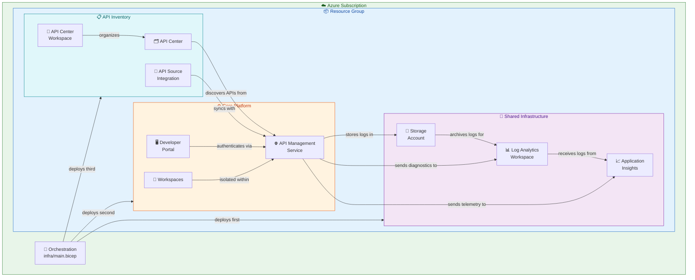

# APIM Accelerator

An Azure API Management (APIM) Landing Zone Accelerator that provisions a production-ready API Management platform on Azure using Bicep infrastructure-as-code templates and the Azure Developer CLI (`azd`). The accelerator deploys a complete landing zone comprising shared monitoring infrastructure, a core API Management service with enterprise features, and an API Center for centralized API governance and inventory management.

<!-- Source: azure.yaml:27, infra/main.bicep:8-10, infra/settings.yaml:7 -->

## Features

- **Subscription-Scoped Deployment** — Orchestrates resource group creation and multi-module deployment at the Azure subscription level with a single entry point (`infra/main.bicep:53`)
- **Configurable API Management Service** — Deploys Azure API Management with support for all SKU tiers (Developer, Basic, Standard, Premium, Consumption) and configurable scale units (`src/core/apim.bicep:88-98`, `infra/settings.yaml:49-51`)
- **Managed Identity Support** — Provides System-assigned, User-assigned, or combined managed identity configurations for secure, credential-free access to Azure services (`src/core/apim.bicep:91-95`, `src/shared/common-types.bicep:41-52`)
- **Developer Portal with Azure AD Authentication** — Configures the API Management developer portal with CORS policies, Azure Active Directory identity provider integration, sign-in/sign-up settings, and terms-of-service enforcement (`src/core/developer-portal.bicep:1-10`)
- **Workspace-Based Multi-Tenancy** — Creates isolated API Management workspaces for team-based or project-based API lifecycle management within a single APIM instance (`src/core/workspaces.bicep:1-10`, `infra/settings.yaml:55-56`)
- **Centralized Monitoring Stack** — Deploys Log Analytics workspace, Application Insights, and a Storage Account for comprehensive logging, application performance monitoring, and long-term log archival (`src/shared/monitoring/main.bicep:1-20`)
- **API Center for Governance** — Provisions Azure API Center with automatic API discovery from the APIM service, RBAC role assignments, and a default workspace for API cataloging (`src/inventory/main.bicep:1-15`)
- **YAML-Driven Configuration** — Externalizes all environment-specific settings (SKU, identity, tags, publisher info) into a single `settings.yaml` file for clean separation of configuration from infrastructure code (`infra/settings.yaml:1-5`)
- **Comprehensive Tagging Strategy** — Applies governance tags (CostCenter, BusinessUnit, Owner, ServiceClass, RegulatoryCompliance, BudgetCode) across all deployed resources for cost tracking and compliance (`infra/settings.yaml:29-39`)
- **Pre-Provisioning Hooks** — Includes an `azd` lifecycle hook that automatically purges soft-deleted APIM instances in the target region before provisioning to prevent naming conflicts (`infra/azd-hooks/pre-provision.sh:1-20`)
- **Reusable Type System** — Defines strongly typed Bicep user-defined types (`ApiManagement`, `Inventory`, `Monitoring`, `Shared`) for type-safe parameter validation across all modules (`src/shared/common-types.bicep:1-15`)
- **Utility Functions** — Provides shared helper functions for deterministic unique suffix generation, storage account name compliance, and diagnostic settings naming (`src/shared/constants.bicep:160-175`)
- **VNet Integration Ready** — Supports External, Internal, or no virtual network integration modes for the API Management service (`src/core/apim.bicep:131-138`)
- **Diagnostic Settings Everywhere** — Configures diagnostic settings on deployed resources to send all logs and metrics to both Log Analytics and archival storage (`src/core/apim.bicep:273-298`)

## Architecture


```mermaid
---
config:
  htmlLabels: true
---
flowchart TB
  accTitle: APIM Accelerator Architecture Diagram
  accDescr: Architecture of the APIM Landing Zone showing the deployment flow from orchestration through shared monitoring, core APIM platform, and API inventory modules.

  subgraph SUB["☁️ Azure Subscription"]
    style SUB fill:#E8F5E9,stroke:#2E7D32,color:#1B5E20

    ORCH["🎯 Orchestration<br/>infra/main.bicep"]

    subgraph RG["📦 Resource Group"]
      style RG fill:#E3F2FD,stroke:#1565C0,color:#0D47A1

      subgraph SHARED["🔧 Shared Infrastructure"]
        style SHARED fill:#F3E5F5,stroke:#7B1FA2,color:#4A148C
        LAW["📊 Log Analytics<br/>Workspace"]
        AI["📈 Application<br/>Insights"]
        SA["💾 Storage<br/>Account"]
      end

      subgraph CORE["⚙️ Core Platform"]
        style CORE fill:#FFF3E0,stroke:#E65100,color:#BF360C
        APIM["🌐 API Management<br/>Service"]
        DP["🖥️ Developer<br/>Portal"]
        WS["📂 Workspaces"]
      end

      subgraph INV["📋 API Inventory"]
        style INV fill:#E0F7FA,stroke:#00838F,color:#006064
        AC["🗂️ API Center"]
        ACWS["📁 API Center<br/>Workspace"]
        ACSRC["🔗 API Source<br/>Integration"]
      end
    end
  end

  ORCH -->|"deploys first"| SHARED
  ORCH -->|"deploys second"| CORE
  ORCH -->|"deploys third"| INV

  LAW -->|"receives logs from"| AI
  SA -->|"archives logs for"| LAW

  APIM -->|"sends telemetry to"| AI
  APIM -->|"sends diagnostics to"| LAW
  APIM -->|"stores logs in"| SA
  DP -->|"authenticates via"| APIM
  WS -->|"isolated within"| APIM

  AC -->|"discovers APIs from"| APIM
  ACSRC -->|"syncs with"| APIM
  ACWS -->|"organizes"| AC
```

<!-- Source: infra/main.bicep:105-181, src/core/main.bicep:150-280, src/shared/main.bicep:60-70, src/inventory/main.bicep:150-175 -->

## Prerequisites

| Requirement                                                                                              | Minimum Version | Purpose                                                      |
| -------------------------------------------------------------------------------------------------------- | --------------- | ------------------------------------------------------------ |
| [Azure CLI](https://learn.microsoft.com/cli/azure/install-azure-cli)                                     | 2.50+           | Azure resource management and authentication                 |
| [Azure Developer CLI (azd)](https://learn.microsoft.com/azure/developer/azure-developer-cli/install-azd) | 1.0+            | Deployment orchestration (`azure.yaml:1-2`)                  |
| [Bicep CLI](https://learn.microsoft.com/azure/azure-resource-manager/bicep/install)                      | 0.22+           | Infrastructure-as-code compilation (included with Azure CLI) |
| Azure Subscription                                                                                       | —               | Target subscription with Contributor or Owner role           |
| API Management Resource Provider                                                                         | —               | `Microsoft.ApiManagement` registered on the subscription     |
| API Center Resource Provider                                                                             | —               | `Microsoft.ApiCenter` registered on the subscription         |

## Getting Started

### 1. Clone the Repository

```bash
git clone https://github.com/Evilazaro/APIM-Accelerator.git
cd APIM-Accelerator
```

### 2. Authenticate with Azure

```bash
az login
azd auth login
```

### 3. Configure the Environment

Review and customize the deployment settings in [infra/settings.yaml](infra/settings.yaml). Key configuration options include:

| Setting         | Path                                | Default               | Description                                                      |
| --------------- | ----------------------------------- | --------------------- | ---------------------------------------------------------------- |
| Solution Name   | `solutionName`                      | `apim-accelerator`    | Base name for all resource naming (`infra/settings.yaml:7`)      |
| APIM SKU        | `core.apiManagement.sku.name`       | `Premium`             | API Management pricing tier (`infra/settings.yaml:50`)           |
| Scale Units     | `core.apiManagement.sku.capacity`   | `1`                   | Number of APIM scale units (`infra/settings.yaml:51`)            |
| Publisher Email | `core.apiManagement.publisherEmail` | `evilazaro@gmail.com` | Publisher contact email (`infra/settings.yaml:47`)               |
| Publisher Name  | `core.apiManagement.publisherName`  | `Contoso`             | Organization name in developer portal (`infra/settings.yaml:48`) |
| Identity Type   | `core.apiManagement.identity.type`  | `SystemAssigned`      | Managed identity configuration (`infra/settings.yaml:53`)        |
| Workspaces      | `core.apiManagement.workspaces`     | `[workspace1]`        | List of APIM workspaces to create (`infra/settings.yaml:56`)     |
| Owner Tag       | `shared.tags.Owner`                 | `evilazaro@gmail.com` | Resource owner tag (`infra/settings.yaml:33`)                    |

### 4. Deploy the Solution

Deploy the complete landing zone using the Azure Developer CLI:

```bash
azd up
```

This command executes the following sequence (`azure.yaml:42-55`):

1. **Pre-provision hook** — Purges soft-deleted APIM instances in the target region
2. **Provision** — Deploys all Azure infrastructure (resource group, monitoring, APIM, API Center)
3. **Deploy** — Completes post-provisioning configuration

Alternatively, provision infrastructure only:

```bash
azd provision
```

Or deploy using the Azure CLI directly (`infra/main.bicep:35-37`):

```bash
az deployment sub create \
  --location <region> \
  --template-file infra/main.bicep \
  --parameters envName=<dev|test|staging|prod|uat> location=<azure-region>
```

### 5. Verify Deployment

After deployment completes, `azd` outputs the following values:

| Output                             | Description                            | Source                 |
| ---------------------------------- | -------------------------------------- | ---------------------- |
| `APPLICATION_INSIGHTS_RESOURCE_ID` | Application Insights resource ID       | `infra/main.bicep:125` |
| `APPLICATION_INSIGHTS_NAME`        | Application Insights instance name     | `infra/main.bicep:128` |
| `AZURE_STORAGE_ACCOUNT_ID`         | Diagnostic storage account resource ID | `infra/main.bicep:135` |

## Project Structure

```text
APIM-Accelerator/
├── azure.yaml                          # Azure Developer CLI project configuration
├── LICENSE                             # MIT License
├── infra/                              # Infrastructure orchestration layer
│   ├── main.bicep                      # Main deployment orchestrator (subscription scope)
│   ├── main.parameters.json            # azd parameter mapping file
│   ├── settings.yaml                   # Environment-specific configuration
│   └── azd-hooks/
│       └── pre-provision.sh            # Pre-provisioning hook for APIM cleanup
├── src/                                # Modular Bicep source modules
│   ├── core/                           # Core API Management platform
│   │   ├── main.bicep                  # Core module orchestrator
│   │   ├── apim.bicep                  # APIM service resource definition
│   │   ├── developer-portal.bicep      # Developer portal configuration
│   │   └── workspaces.bicep            # APIM workspace definitions
│   ├── inventory/                      # API inventory and governance
│   │   └── main.bicep                  # API Center deployment with APIM integration
│   └── shared/                         # Shared infrastructure services
│       ├── main.bicep                  # Shared module orchestrator
│       ├── common-types.bicep          # Reusable Bicep type definitions
│       ├── constants.bicep             # Shared constants and utility functions
│       ├── monitoring/                 # Monitoring infrastructure
│       │   ├── main.bicep              # Monitoring orchestrator
│       │   ├── insights/
│       │   │   └── main.bicep          # Application Insights deployment
│       │   └── operational/
│       │       └── main.bicep          # Log Analytics and Storage deployment
│       └── networking/
│           └── main.bicep              # Virtual network (placeholder)
└── prompts/                            # Documentation generation prompts
```

## Deployment Sequence

The orchestration template (`infra/main.bicep:26-30`) enforces the following deployment order to satisfy resource dependencies:

| Phase | Module                     | Resources Deployed                                             | Dependencies                                                |
| ----- | -------------------------- | -------------------------------------------------------------- | ----------------------------------------------------------- |
| 1     | `src/shared/main.bicep`    | Log Analytics Workspace, Application Insights, Storage Account | None                                                        |
| 2     | `src/core/main.bicep`      | API Management Service, Developer Portal, Workspaces           | Phase 1 outputs (workspace ID, App Insights ID, storage ID) |
| 3     | `src/inventory/main.bicep` | API Center, API Center Workspace, API Source Integration       | Phase 2 outputs (APIM name, APIM resource ID)               |

## Configuration Reference

### Environment Parameters

The deployment accepts two required parameters defined in [infra/main.bicep](infra/main.bicep):

| Parameter  | Type     | Allowed Values                          | Description                                                             |
| ---------- | -------- | --------------------------------------- | ----------------------------------------------------------------------- |
| `envName`  | `string` | `dev`, `test`, `staging`, `prod`, `uat` | Environment name determining resource sizing (`infra/main.bicep:61-63`) |
| `location` | `string` | Any Azure region                        | Target deployment region (`infra/main.bicep:65-66`)                     |

### Resource Naming Convention

Resources follow the pattern `{solutionName}-{envName}-{location}-{resourceType}` for the resource group (`infra/main.bicep:86`) and `{solutionName}-{uniqueSuffix}-{resourceType}` for child resources (`src/core/main.bicep:198-201`). The unique suffix is generated deterministically from the subscription ID, resource group ID, solution name, and location using the `generateUniqueSuffix` function (`src/shared/constants.bicep:163-170`).

### Supported APIM SKUs

The `skuName` parameter in [src/core/apim.bicep](src/core/apim.bicep) accepts the following values (`src/core/apim.bicep:88-98`):

| SKU                       | Use Case                                    |
| ------------------------- | ------------------------------------------- |
| `Developer`               | Non-production environments, no SLA         |
| `Basic` / `BasicV2`       | Small-scale production workloads            |
| `Standard` / `StandardV2` | Medium-scale production workloads           |
| `Premium`                 | Multi-region, VNet integration, highest SLA |
| `Consumption`             | Serverless, pay-per-execution               |

### Tagging Strategy

All resources inherit a comprehensive set of governance tags defined in [infra/settings.yaml](infra/settings.yaml) (`infra/settings.yaml:29-39`):

| Tag                    | Value                 | Purpose                            |
| ---------------------- | --------------------- | ---------------------------------- |
| `CostCenter`           | `CC-1234`             | Cost allocation tracking           |
| `BusinessUnit`         | `IT`                  | Organizational unit identification |
| `Owner`                | `evilazaro@gmail.com` | Resource ownership                 |
| `ApplicationName`      | `APIM Platform`       | Workload identification            |
| `ServiceClass`         | `Critical`            | Service tier classification        |
| `RegulatoryCompliance` | `GDPR`                | Compliance framework tracking      |
| `BudgetCode`           | `FY25-Q1-InitiativeX` | Budget association                 |

## Security

- **Managed Identity** — The APIM service, Log Analytics workspace, and API Center all support System-assigned or User-assigned managed identities for credential-free authentication (`src/core/apim.bicep:91-95`, `src/shared/common-types.bicep:41-45`)
- **RBAC Assignments** — The APIM service receives the Reader role (`src/core/apim.bicep:226-227`), and the API Center receives Data Reader and Compliance Manager roles (`src/inventory/main.bicep:106-107`) scoped to the resource group
- **Secure Outputs** — Sensitive values such as the Application Insights instrumentation key are marked with `@secure()` to prevent exposure in deployment logs (`infra/main.bicep:131-132`)
- **VNet Integration** — The APIM service supports External, Internal, or no virtual network integration to control network access (`src/core/apim.bicep:131-138`)
- **Developer Portal Authentication** — Azure AD is configured as the identity provider with tenant-scoped access and MSAL 2.0 for modern authentication flows (`src/core/developer-portal.bicep:52-57`)

## License

This project is licensed under the MIT License. See [LICENSE](LICENSE) for details.

Copyright (c) 2025 Evilázaro Alves (`LICENSE:3`)
