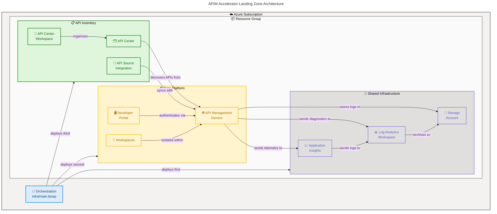

# APIM Accelerator


An Azure API Management (APIM) Landing Zone Accelerator that provisions a production-ready API Management platform on Azure using Bicep infrastructure-as-code templates and the Azure Developer CLI (`azd`). The accelerator deploys a complete landing zone comprising shared monitoring infrastructure, a core API Management service with enterprise features, and an API Center for centralized API governance and inventory management.

**Overview**

<!-- Tier 1: Critical Context -->

APIM Accelerator provides a modular, enterprise-grade infrastructure-as-code solution for deploying Azure API Management as a fully operational landing zone. It targets platform engineers and cloud architects who need a repeatable, governance-compliant APIM deployment with integrated monitoring, developer portal, and API inventory capabilities (`azure.yaml:27`, `infra/main.bicep:8-10`).

<!-- Tier 2: Practical Guidance -->

The accelerator orchestrates three deployment phases — shared monitoring infrastructure, core API Management platform, and API Center inventory — in a dependency-aware sequence managed by a single Bicep orchestration template. All environment-specific configuration is externalized to a YAML settings file, enabling consistent deployments across `dev`, `test`, `staging`, `prod`, and `uat` environments without modifying infrastructure code (`infra/settings.yaml:7`, `infra/main.bicep:61-63`).

<!-- Tier 3: Strategic Context -->

Designed for organizations adopting Azure API Management at scale, the accelerator enforces tagging governance, managed identity security, and centralized observability from day one. It integrates with Azure Developer CLI (`azd`) for one-command provisioning and supports Premium-tier features including VNet integration, multi-region deployment, and workspace-based multi-tenancy (`infra/settings.yaml:29-39`, `src/core/apim.bicep:131-138`).

## 📑 Table of Contents

- [✨ Features](#-features)
- [🏗️ Architecture](#️-architecture)
- [📋 Requirements](#-requirements)
- [🚀 Getting Started](#-getting-started)
- [📁 Project Structure](#-project-structure)
- [🔄 Deployment Sequence](#-deployment-sequence)
- [⚙️ Configuration](#️-configuration)
- [🔒 Security](#-security)
- [🤝 Contributing](#-contributing)
- [📄 License](#-license)

## ✨ Features

**Overview**

APIM Accelerator delivers a comprehensive set of infrastructure capabilities that automate the provisioning of Azure API Management landing zones. These features eliminate manual setup steps and enforce enterprise governance standards across every deployment, reducing time-to-production from days to minutes.

> 💡 **Tip**: Each feature maps directly to a Bicep module in the `src/` directory. Customizations can be made by modifying the corresponding module parameters in `infra/settings.yaml` without altering the infrastructure code itself.

| Feature                               | Description                                                                                                                                              |
| ------------------------------------- | -------------------------------------------------------------------------------------------------------------------------------------------------------- |
| ☁️ **Subscription-Scoped Deployment** | Orchestrates resource group creation and multi-module deployment at the Azure subscription level with a single entry point                               |
| ⚙️ **Configurable APIM Service**      | Deploys Azure API Management with support for all SKU tiers (Developer, Basic, Standard, Premium, Consumption) and configurable scale units              |
| 🔑 **Managed Identity Support**       | Provides System-assigned, User-assigned, or combined managed identity configurations for secure, credential-free access to Azure services                |
| 🖥️ **Developer Portal with Azure AD** | Configures the APIM developer portal with CORS policies, Azure AD identity provider, sign-in/sign-up settings, and terms-of-service enforcement          |
| 📂 **Workspace-Based Multi-Tenancy**  | Creates isolated APIM workspaces for team-based or project-based API lifecycle management within a single APIM instance                                  |
| 📊 **Centralized Monitoring Stack**   | Deploys Log Analytics workspace, Application Insights, and a Storage Account for comprehensive logging, APM, and long-term log archival                  |
| 🗂️ **API Center for Governance**      | Provisions Azure API Center with automatic API discovery from the APIM service, RBAC role assignments, and a default workspace for API cataloging        |
| 📁 **YAML-Driven Configuration**      | Externalizes all environment-specific settings (SKU, identity, tags, publisher info) into a single `settings.yaml` file for clean separation of concerns |
| 🏷️ **Comprehensive Tagging Strategy** | Applies governance tags (CostCenter, BusinessUnit, Owner, ServiceClass, RegulatoryCompliance, BudgetCode) across all deployed resources                  |
| 🔄 **Pre-Provisioning Hooks**         | Includes an `azd` lifecycle hook that automatically purges soft-deleted APIM instances in the target region before provisioning                          |
| 🧩 **Reusable Type System**           | Defines strongly typed Bicep user-defined types (`ApiManagement`, `Inventory`, `Monitoring`, `Shared`) for type-safe parameter validation                |
| 🛠️ **Utility Functions**              | Provides shared helper functions for deterministic unique suffix generation, storage account name compliance, and diagnostic settings naming             |
| 🌐 **VNet Integration Ready**         | Supports External, Internal, or no virtual network integration modes for the API Management service                                                      |
| 📈 **Diagnostic Settings**            | Configures diagnostic settings on deployed resources to send all logs and metrics to both Log Analytics and archival storage                             |

## 🏗️ Architecture

**Overview**

The APIM Accelerator follows a layered deployment architecture where a subscription-scoped orchestration template (`infra/main.bicep`) coordinates three module groups in sequence: shared monitoring infrastructure, the core API Management platform, and the API Center inventory service. Each layer depends on outputs from the previous layer, enforcing a clean dependency chain (`infra/main.bicep:26-30`).


```mermaid
---
title: "APIM Accelerator Landing Zone Architecture"
config:
  theme: base
  look: classic
  layout: dagre
  themeVariables:
    fontSize: '16px'
  flowchart:
    htmlLabels: true
---
flowchart TB
    accTitle: APIM Accelerator Landing Zone Architecture
    accDescr: Architecture diagram showing the three-layer deployment of the APIM Landing Zone including shared monitoring infrastructure, core API Management platform with developer portal and workspaces, and API Center inventory service with automatic API discovery.

    %% ═══════════════════════════════════════════════════════════════════════════
    %% AZURE / FLUENT ARCHITECTURE PATTERN v1.1
    %% (Semantic + Structural + Font + Accessibility Governance)
    %% ═══════════════════════════════════════════════════════════════════════════
    %% PHASE 1 - STRUCTURAL: Direction explicit, flat topology, nesting ≤ 3
    %% PHASE 2 - SEMANTIC: Colors justified, max 5 semantic classes, neutral-first
    %% PHASE 3 - FONT: Dark text on light backgrounds, contrast ≥ 4.5:1
    %% PHASE 4 - ACCESSIBILITY: accTitle/accDescr present, icons on all nodes
    %% PHASE 5 - STANDARD: Governance block present, classDefs centralized
    %% ═══════════════════════════════════════════════════════════════════════════

    subgraph SUB["☁️ Azure Subscription"]
        ORCH["🎯 Orchestration<br/>infra/main.bicep"]:::core

        subgraph RG["📦 Resource Group"]

            subgraph SHARED["🔧 Shared Infrastructure"]
                LAW["📊 Log Analytics<br/>Workspace"]:::data
                AI["📈 Application<br/>Insights"]:::data
                SA["💾 Storage<br/>Account"]:::data
            end

            subgraph CORE["⚙️ Core Platform"]
                APIM["🌐 API Management<br/>Service"]:::warning
                DP["🖥️ Developer<br/>Portal"]:::warning
                WS["📂 Workspaces"]:::warning
            end

            subgraph INV["📋 API Inventory"]
                AC["🗂️ API Center"]:::success
                ACWS["📁 API Center<br/>Workspace"]:::success
                ACSRC["🔗 API Source<br/>Integration"]:::success
            end

        end
    end

    ORCH -->|"deploys first"| SHARED
    ORCH -->|"deploys second"| CORE
    ORCH -->|"deploys third"| INV

    AI -->|"sends logs to"| LAW
    LAW -->|"archives to"| SA

    APIM -->|"sends telemetry to"| AI
    APIM -->|"sends diagnostics to"| LAW
    APIM -->|"stores logs in"| SA
    DP -->|"authenticates via"| APIM
    WS -->|"isolated within"| APIM

    AC -->|"discovers APIs from"| APIM
    ACSRC -->|"syncs with"| APIM
    ACWS -->|"organizes"| AC

    %% Centralized semantic classDefs (approved AZURE/FLUENT v1.1 palette)
    classDef core fill:#DEECF9,stroke:#0078D4,stroke-width:2px,color:#004578
    classDef data fill:#E1DFDD,stroke:#8378DE,stroke-width:2px,color:#5B5FC7
    classDef warning fill:#FFF4CE,stroke:#FFB900,stroke-width:2px,color:#986F0B
    classDef success fill:#DFF6DD,stroke:#107C10,stroke-width:2px,color:#0B6A0B

    %% Subgraph styling (structural parents = neutral, functional siblings = semantic)
    style SUB fill:#F3F2F1,stroke:#605E5C,stroke-width:2px
    style RG fill:#FAFAFA,stroke:#8A8886,stroke-width:2px
    style SHARED fill:#E1DFDD,stroke:#8378DE,stroke-width:2px
    style CORE fill:#FFF4CE,stroke:#FFB900,stroke-width:2px
    style INV fill:#DFF6DD,stroke:#107C10,stroke-width:2px
```

<!-- Source: infra/main.bicep:105-181, src/core/main.bicep:150-280, src/shared/main.bicep:60-70, src/inventory/main.bicep:150-175 -->

## 📋 Requirements

**Overview**

Organizations deploying the APIM Accelerator need a set of Azure CLI tooling, an active Azure subscription with appropriate permissions, and registered resource providers for API Management and API Center. This section defines minimum versions and installation guidance for each prerequisite, organized by tool category to streamline validation before deployment.

> 💡 **Why This Matters**: Missing or outdated prerequisites cause mid-deployment failures that require restarting the provisioning process. The APIM service alone takes 30-45 minutes to provision on Premium SKU, so pre-validating all requirements before running `azd up` avoids costly redeployment cycles.

> 📌 **How It Works**: The `azd` deployment pipeline reads parameters from `infra/main.parameters.json` and passes them to the subscription-scoped `infra/main.bicep` orchestrator. The pre-provision hook (`infra/azd-hooks/pre-provision.sh`) runs first to purge any soft-deleted APIM instances that would cause naming conflicts (`azure.yaml:42-55`).

### Prerequisites

| Requirement                         | Version  | Purpose                                                         | Installation                                                                           |
| ----------------------------------- | -------- | --------------------------------------------------------------- | -------------------------------------------------------------------------------------- |
| ⚙️ **Azure CLI**                    | ≥ 2.50.0 | Azure resource management and authentication                    | [Install](https://learn.microsoft.com/cli/azure/install-azure-cli)                     |
| 🚀 **Azure Developer CLI**          | ≥ 1.0.0  | Deployment orchestration and lifecycle hooks (`azure.yaml:1-2`) | [Install](https://learn.microsoft.com/azure/developer/azure-developer-cli/install-azd) |
| 📦 **Bicep CLI**                    | ≥ 0.22.0 | Infrastructure-as-code compilation (included with Azure CLI)    | [Install](https://learn.microsoft.com/azure/azure-resource-manager/bicep/install)      |
| ☁️ **Azure Subscription**           | —        | Target subscription with Contributor or Owner role              | [Create](https://azure.microsoft.com/free/)                                            |
| 🔌 **APIM Resource Provider**       | —        | `Microsoft.ApiManagement` registered on the subscription        | `az provider register --namespace Microsoft.ApiManagement`                             |
| 🔌 **API Center Resource Provider** | —        | `Microsoft.ApiCenter` registered on the subscription            | `az provider register --namespace Microsoft.ApiCenter`                                 |

### Azure Permissions

| Permission Level         | Scope        | Required Actions                                                                                            |
| ------------------------ | ------------ | ----------------------------------------------------------------------------------------------------------- |
| 🔑 **Contributor**       | Subscription | Create resource groups, deploy APIM, API Center, monitoring resources                                       |
| 🔑 **User Access Admin** | Subscription | Assign RBAC roles to managed identities (`src/core/apim.bicep:226-227`, `src/inventory/main.bicep:106-107`) |

## 🚀 Getting Started

### 1. Clone the Repository

```bash
git clone https://github.com/Evilazaro/APIM-Accelerator.git
cd APIM-Accelerator
```

### 2. Authenticate with Azure

```bash
az login
azd auth login
```

> ⚠️ **Warning**: The authenticated account must have Contributor and User Access Administrator roles on the target subscription. Insufficient permissions will cause RBAC assignment failures during the core platform deployment phase (`src/core/apim.bicep:226-240`).

### 3. Configure the Environment

Review and customize the deployment settings in `infra/settings.yaml`. Key configuration options include:

| Setting            | Path                                | Default               | Description                                                      |
| ------------------ | ----------------------------------- | --------------------- | ---------------------------------------------------------------- |
| ⚙️ Solution Name   | `solutionName`                      | `apim-accelerator`    | Base name for all resource naming (`infra/settings.yaml:7`)      |
| ⚙️ APIM SKU        | `core.apiManagement.sku.name`       | `Premium`             | API Management pricing tier (`infra/settings.yaml:50`)           |
| ⚙️ Scale Units     | `core.apiManagement.sku.capacity`   | `1`                   | Number of APIM scale units (`infra/settings.yaml:51`)            |
| 📧 Publisher Email | `core.apiManagement.publisherEmail` | `evilazaro@gmail.com` | Publisher contact email (`infra/settings.yaml:47`)               |
| 🏢 Publisher Name  | `core.apiManagement.publisherName`  | `Contoso`             | Organization name in developer portal (`infra/settings.yaml:48`) |
| 🔑 Identity Type   | `core.apiManagement.identity.type`  | `SystemAssigned`      | Managed identity configuration (`infra/settings.yaml:53`)        |
| 📂 Workspaces      | `core.apiManagement.workspaces`     | `[workspace1]`        | List of APIM workspaces to create (`infra/settings.yaml:56`)     |
| 🏷️ Owner Tag       | `shared.tags.Owner`                 | `evilazaro@gmail.com` | Resource owner tag (`infra/settings.yaml:33`)                    |

> 💡 **Tip**: For non-production environments, change `core.apiManagement.sku.name` to `Developer` in `infra/settings.yaml` to reduce costs. The Developer SKU has no SLA but provides the same feature set for testing purposes (`src/core/apim.bicep:50-56`).

### 4. Deploy the Solution

Deploy the complete landing zone using the Azure Developer CLI:

```bash
azd up
```

**Expected Output**:

```text
Packaging services (azd package)

  (✓) Done: Packaging service

Provisioning Azure resources (azd provision)
Subscription: <your-subscription-name> (<subscription-id>)
Location: <selected-region>

  (✓) Creating/Updating resources
      Resource group: apim-accelerator-dev-eastus-rg

  (✓) Successfully provisioned Azure resources

SUCCESS: Your application was provisioned in Azure
```

This command executes the following sequence (`azure.yaml:42-55`):

1. **Pre-provision hook** — Purges soft-deleted APIM instances in the target region (`infra/azd-hooks/pre-provision.sh`)
2. **Provision** — Deploys all Azure infrastructure (resource group, monitoring, APIM, API Center)
3. **Deploy** — Completes post-provisioning configuration

Alternatively, provision infrastructure only:

```bash
azd provision
```

Or deploy using the Azure CLI directly (`infra/main.bicep:35-37`):

```bash
az deployment sub create \
  --location eastus \
  --template-file infra/main.bicep \
  --parameters envName=dev location=eastus
```

**Expected Output**:

```json
{
  "properties": {
    "provisioningState": "Succeeded",
    "outputs": {
      "APPLICATION_INSIGHTS_RESOURCE_ID": {
        "type": "String",
        "value": "/subscriptions/.../components/..."
      },
      "APPLICATION_INSIGHTS_NAME": {
        "type": "String",
        "value": "apim-accelerator-<suffix>-ai"
      },
      "AZURE_STORAGE_ACCOUNT_ID": {
        "type": "String",
        "value": "/subscriptions/.../storageAccounts/..."
      }
    }
  }
}
```

### 5. Verify Deployment

After deployment completes, the orchestration template outputs the following values (`infra/main.bicep:121-135`):

| Output                                | Description                            |
| ------------------------------------- | -------------------------------------- |
| 📈 `APPLICATION_INSIGHTS_RESOURCE_ID` | Application Insights resource ID       |
| 📈 `APPLICATION_INSIGHTS_NAME`        | Application Insights instance name     |
| 💾 `AZURE_STORAGE_ACCOUNT_ID`         | Diagnostic storage account resource ID |

## 📁 Project Structure

```text
APIM-Accelerator/
├── azure.yaml                          # Azure Developer CLI project configuration
├── LICENSE                             # MIT License
├── infra/                              # Infrastructure orchestration layer
│   ├── main.bicep                      # Main deployment orchestrator (subscription scope)
│   ├── main.parameters.json            # azd parameter mapping file
│   ├── settings.yaml                   # Environment-specific configuration
│   └── azd-hooks/
│       └── pre-provision.sh            # Pre-provisioning hook for APIM cleanup
├── src/                                # Modular Bicep source modules
│   ├── core/                           # Core API Management platform
│   │   ├── main.bicep                  # Core module orchestrator
│   │   ├── apim.bicep                  # APIM service resource definition
│   │   ├── developer-portal.bicep      # Developer portal configuration
│   │   └── workspaces.bicep            # APIM workspace definitions
│   ├── inventory/                      # API inventory and governance
│   │   └── main.bicep                  # API Center deployment with APIM integration
│   └── shared/                         # Shared infrastructure services
│       ├── main.bicep                  # Shared module orchestrator
│       ├── common-types.bicep          # Reusable Bicep type definitions
│       ├── constants.bicep             # Shared constants and utility functions
│       ├── monitoring/                 # Monitoring infrastructure
│       │   ├── main.bicep              # Monitoring orchestrator
│       │   ├── insights/
│       │   │   └── main.bicep          # Application Insights deployment
│       │   └── operational/
│       │       └── main.bicep          # Log Analytics and Storage deployment
│       └── networking/
│           └── main.bicep              # Virtual network (placeholder)
└── prompts/                            # Documentation generation prompts
```

## 🔄 Deployment Sequence

**Overview**

The orchestration template (`infra/main.bicep`) deploys resources in a strict three-phase sequence to satisfy inter-module dependencies. Each phase produces outputs consumed by subsequent phases, ensuring monitoring infrastructure exists before the APIM service attempts to configure diagnostic settings and Application Insights loggers (`infra/main.bicep:26-30`).

| Phase | Module                     | Resources Deployed                                                      | Dependencies                                                |
| ----- | -------------------------- | ----------------------------------------------------------------------- | ----------------------------------------------------------- |
| 1️⃣    | `src/shared/main.bicep`    | 📊 Log Analytics Workspace, 📈 Application Insights, 💾 Storage Account | None                                                        |
| 2️⃣    | `src/core/main.bicep`      | 🌐 API Management Service, 🖥️ Developer Portal, 📂 Workspaces           | Phase 1 outputs (workspace ID, App Insights ID, storage ID) |
| 3️⃣    | `src/inventory/main.bicep` | 🗂️ API Center, 📁 API Center Workspace, 🔗 API Source Integration       | Phase 2 outputs (APIM name, APIM resource ID)               |

## ⚙️ Configuration

**Overview**

All environment-specific configuration for the APIM Accelerator is centralized in `infra/settings.yaml`, which separates infrastructure parameters from the Bicep module code. This design enables the same infrastructure templates to deploy across multiple environments (`dev`, `test`, `staging`, `prod`, `uat`) by changing only the configuration file and the `envName` parameter (`infra/main.bicep:61-63`).

> 📌 **Important**: Resource names are auto-generated using a deterministic unique suffix when left empty in `infra/settings.yaml`. Setting a custom name (e.g., `core.apiManagement.name`) overrides the auto-generation logic. Auto-generated names follow the pattern `{solutionName}-{uniqueSuffix}-{resourceType}` (`src/core/main.bicep:198-201`, `src/shared/constants.bicep:163-170`).

### Environment Parameters

The deployment accepts two required parameters defined in `infra/main.bicep`:

| Parameter     | Type     | Allowed Values                          | Description                                                             |
| ------------- | -------- | --------------------------------------- | ----------------------------------------------------------------------- |
| ⚙️ `envName`  | `string` | `dev`, `test`, `staging`, `prod`, `uat` | Environment name determining resource sizing (`infra/main.bicep:61-63`) |
| 🌍 `location` | `string` | Any Azure region                        | Target deployment region (`infra/main.bicep:65-66`)                     |

### Resource Naming Convention

Resources follow the pattern `{solutionName}-{envName}-{location}-{resourceType}` for the resource group (`infra/main.bicep:86`) and `{solutionName}-{uniqueSuffix}-{resourceType}` for child resources (`src/core/main.bicep:198-201`). The unique suffix is generated deterministically from the subscription ID, resource group ID, solution name, and location using the `generateUniqueSuffix` function (`src/shared/constants.bicep:163-170`).

### Supported APIM SKUs

The `skuName` parameter in `src/core/apim.bicep` accepts the following values (`src/core/apim.bicep:88-98`):

| SKU                          | Use Case                                    |
| ---------------------------- | ------------------------------------------- |
| ⚙️ `Developer`               | Non-production environments, no SLA         |
| ⚙️ `Basic` / `BasicV2`       | Small-scale production workloads            |
| ⚙️ `Standard` / `StandardV2` | Medium-scale production workloads           |
| ⚙️ `Premium`                 | Multi-region, VNet integration, highest SLA |
| ⚙️ `Consumption`             | Serverless, pay-per-execution               |

### Tagging Strategy

All resources inherit a comprehensive set of governance tags defined in `infra/settings.yaml` (`infra/settings.yaml:29-39`):

| Tag                       | Value                 | Purpose                            |
| ------------------------- | --------------------- | ---------------------------------- |
| 🏷️ `CostCenter`           | `CC-1234`             | Cost allocation tracking           |
| 🏷️ `BusinessUnit`         | `IT`                  | Organizational unit identification |
| 🏷️ `Owner`                | `evilazaro@gmail.com` | Resource ownership                 |
| 🏷️ `ApplicationName`      | `APIM Platform`       | Workload identification            |
| 🏷️ `ServiceClass`         | `Critical`            | Service tier classification        |
| 🏷️ `RegulatoryCompliance` | `GDPR`                | Compliance framework tracking      |
| 🏷️ `BudgetCode`           | `FY25-Q1-InitiativeX` | Budget association                 |

## 🔒 Security

**Overview**

The APIM Accelerator implements defense-in-depth security practices across all deployed resources, including managed identity authentication, least-privilege RBAC assignments, secure output handling, and optional network isolation. These controls are embedded in the Bicep templates and applied automatically during deployment.

- 🔑 **Managed Identity** — The APIM service, Log Analytics workspace, and API Center all support System-assigned or User-assigned managed identities for credential-free authentication (`src/core/apim.bicep:91-95`, `src/shared/common-types.bicep:41-45`)
- 🔑 **RBAC Assignments** — The APIM service receives the Reader role (`src/core/apim.bicep:226-227`), and the API Center receives Data Reader and Compliance Manager roles (`src/inventory/main.bicep:106-107`) scoped to the resource group
- 🔒 **Secure Outputs** — Sensitive values such as the Application Insights instrumentation key are marked with `@secure()` to prevent exposure in deployment logs (`infra/main.bicep:131-132`)
- 🌐 **VNet Integration** — The APIM service supports External, Internal, or no virtual network integration to control network access (`src/core/apim.bicep:131-138`)
- 🛡️ **Developer Portal Authentication** — Azure AD is configured as the identity provider with tenant-scoped access and MSAL 2.0 for modern authentication flows (`src/core/developer-portal.bicep:52-57`)

> ⚠️ **Warning**: For production deployments, set `publicNetworkAccess` to `false` and use `Internal` VNet integration to restrict API Management access to private networks only. The default configuration enables public access for development convenience (`src/core/apim.bicep:123-127`).

## 🤝 Contributing

**Overview**

Contributions to the APIM Accelerator are welcome. This project uses Bicep infrastructure-as-code templates and follows modular design principles. Contributors can extend the accelerator by adding new modules to the `src/` directory or enhancing existing module configurations.

1. Fork the repository
2. Create a feature branch (`git checkout -b feature/my-feature`)
3. Make changes following the existing module patterns in `src/`
4. Test deployments using the `Developer` SKU to minimize costs (`infra/settings.yaml:50`)
5. Submit a pull request

> 💡 **Tip**: Use `azd provision` with `envName=dev` to validate infrastructure changes before submitting a pull request. The Developer SKU provisions in approximately 30-45 minutes.

## 📄 License

This project is licensed under the MIT License. See [LICENSE](LICENSE) for details.

Copyright (c) 2025 Evilázaro Alves (`LICENSE:3`)
