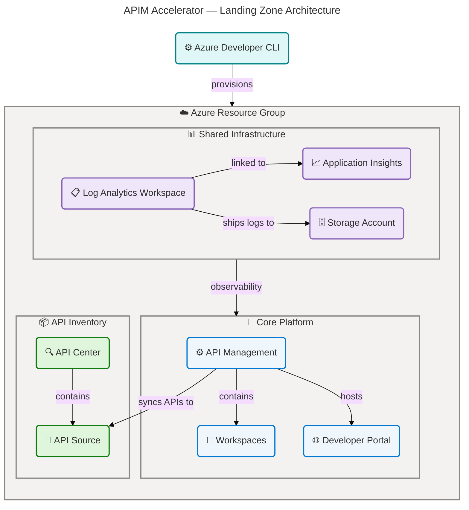
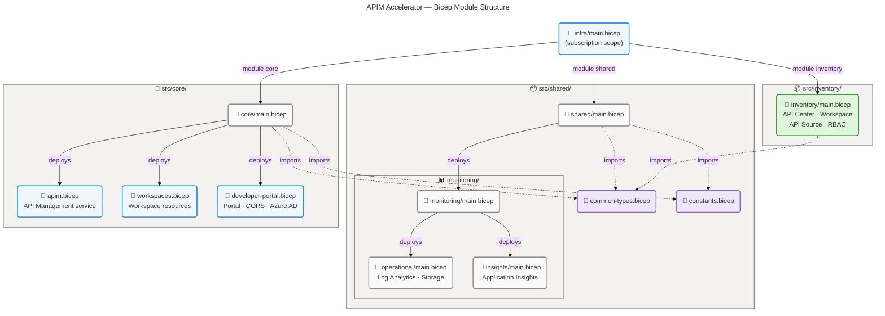

# APIM Accelerator

[](LICENSE)
[](https://learn.microsoft.com/azure/api-management/api-management-key-concepts)
[](https://learn.microsoft.com/azure/azure-resource-manager/bicep/overview)
[](https://learn.microsoft.com/azure/developer/azure-developer-cli/overview)
[](https://github.com/Evilazaro/APIM-Accelerator)

## Overview

**Overview**

The APIM Accelerator is an enterprise-grade Azure infrastructure solution that provisions a complete API Management landing zone — including shared observability, a fully configured API Management service, and API Center governance — from a single `azd up` command. It targets platform engineering teams responsible for delivering production-ready API platforms across multiple Azure environments (`dev`, `test`, `staging`, `prod`, `uat`), eliminating the manual effort of wiring observability, identity, and governance dependencies.

The accelerator orchestrates three modular Bicep layers deployed by `infra/main.bicep` at subscription scope: shared monitoring infrastructure (Log Analytics workspace, Application Insights, diagnostic Storage Account), the core Azure API Management platform with configurable SKU, managed identity, workspace isolation, and developer portal authentication, and Azure API Center for centralized API inventory with automatic APIM synchronization. All configuration is driven by a single `infra/settings.yaml` file, and every resource follows a deterministic naming convention that embeds the solution name, environment, and region.

## Table of Contents

- [Overview](#overview)
- [Quick Start](#quick-start)
- [Architecture](#architecture)
- [Features](#features)
- [Requirements](#requirements)
- [Configuration](#configuration)
- [Deployment](#deployment)
- [Usage](#usage)
- [Contributing](#contributing)
- [License](#license)

## Quick Start

Deploy the complete APIM landing zone with three commands:

```bash
git clone https://github.com/Evilazaro/APIM-Accelerator.git
cd APIM-Accelerator
azd up
```

When prompted, provide an environment name (e.g., `dev`) and an Azure region (e.g., `eastus`). The provisioner creates a resource group named `apim-accelerator-<env>-<location>-rg` containing all landing zone resources.

> [!NOTE]
> Running `azd up` triggers the pre-provision hook at `infra/azd-hooks/pre-provision.sh`, which automatically purges any soft-deleted APIM instances in the target region. This prevents resource name conflicts when redeploying to the same region after a prior teardown.

Expected output on success:

```text
SUCCESS: Your up workflow to provision and deploy to Azure completed in 45 minutes.
```

## Architecture

**Overview**

The APIM Accelerator deploys a three-layer landing zone within a single subscription-scoped Azure resource group. `infra/main.bicep` orchestrates the deployment sequence — shared infrastructure provisions first to establish observability outputs, the core APIM platform provisions second consuming those outputs, and API Center provisions last, automatically connecting to the APIM service as an API source for discovery and governance.


```mermaid
---
title: "APIM Accelerator — Landing Zone Architecture"
config:
  theme: base
  look: classic
  layout: dagre
  flowchart:
    htmlLabels: true
---
flowchart TB
    accTitle: APIM Accelerator Landing Zone Architecture
    accDescr: Three-layer Azure landing zone showing shared monitoring infrastructure, core API Management platform, and API Center inventory all orchestrated and provisioned via Azure Developer CLI

    %% ═══════════════════════════════════════════════════════════════════════════
    %% AZURE / FLUENT ARCHITECTURE PATTERN v1.1
    %% (Semantic + Structural + Font + Accessibility Governance)
    %% ═══════════════════════════════════════════════════════════════════════════
    %% PHASE 1 - FLUENT UI: All styling uses approved Fluent UI palette only
    %% PHASE 2 - GROUPS: Every subgraph has semantic color via style directive
    %% PHASE 3 - COMPONENTS: Every node has semantic classDef + icon prefix
    %% PHASE 4 - ACCESSIBILITY: accTitle/accDescr present, WCAG AA contrast
    %% PHASE 5 - STANDARD: Governance block present, classDefs centralized
    %% ═══════════════════════════════════════════════════════════════════════════

    azdCLI("⚙️ Azure Developer CLI"):::external

    subgraph rg["☁️ Azure Resource Group"]
        direction TB

        subgraph shared["📊 Shared Infrastructure"]
            direction LR
            law("📋 Log Analytics Workspace"):::data
            ai("📈 Application Insights"):::data
            sa("🗄️ Storage Account"):::data
            law -->|"linked to"| ai
            law -->|"ships logs to"| sa
        end

        subgraph core["🔌 Core Platform"]
            direction LR
            apim("⚙️ API Management"):::core
            ws("🏢 Workspaces"):::core
            dp("🌐 Developer Portal"):::core
            apim -->|"contains"| ws
            apim -->|"hosts"| dp
        end

        subgraph inventory["📦 API Inventory"]
            direction LR
            apic("🔍 API Center"):::success
            apicsrc("🔗 API Source"):::success
            apic -->|"contains"| apicsrc
        end

        shared -->|"observability"| core
        apim -->|"syncs APIs to"| apicsrc
    end

    azdCLI -->|"provisions"| rg

    style rg fill:#F3F2F1,stroke:#8A8886,stroke-width:2px,color:#323130
    style shared fill:#F3F2F1,stroke:#8A8886,stroke-width:2px,color:#323130
    style core fill:#F3F2F1,stroke:#8A8886,stroke-width:2px,color:#323130
    style inventory fill:#F3F2F1,stroke:#8A8886,stroke-width:2px,color:#323130

    %% Centralized semantic classDefs (Phase 5 compliant)
    classDef external fill:#E0F7F7,stroke:#038387,stroke-width:2px,color:#323130
    classDef data fill:#F0E6FA,stroke:#8764B8,stroke-width:2px,color:#323130
    classDef core fill:#EFF6FC,stroke:#0078D4,stroke-width:2px,color:#323130
    classDef success fill:#DFF6DD,stroke:#107C10,stroke-width:2px,color:#323130
```

**Component Roles**

| Component               | Module                               | Role                                                           |
| ----------------------- | ------------------------------------ | -------------------------------------------------------------- |
| ⚙️ API Management       | `src/core/apim.bicep`                | API gateway, rate limiting, caching, and managed identity      |
| 🏢 Workspaces           | `src/core/workspaces.bicep`          | Team and project API isolation within a single APIM instance   |
| 🌐 Developer Portal     | `src/core/developer-portal.bicep`    | Self-service API documentation with Azure AD MSAL-2 auth       |
| 📋 Log Analytics        | `src/shared/monitoring/operational/` | Centralized diagnostic logs, retention, and query analysis     |
| 📈 Application Insights | `src/shared/monitoring/insights/`    | Application performance monitoring and request telemetry       |
| 🗄️ Storage Account      | `src/shared/monitoring/operational/` | Long-term diagnostic log archival for compliance               |
| 🔍 API Center           | `src/inventory/main.bicep`           | Centralized API catalog, governance, and RBAC assignments      |
| 🔗 API Source           | `src/inventory/main.bicep`           | Automatic APIM-to-API Center API discovery and synchronization |

### Deployment Sequence

`infra/main.bicep` deploys at subscription scope, enforcing a strict ordering so that each layer consumes the outputs of the previous one. The pre-provision hook runs first to clear any soft-deleted APIM name conflicts before any Bicep resources are provisioned.


```mermaid
---
title: "APIM Accelerator — Deployment Sequence"
config:
  theme: base
  look: classic
  layout: dagre
  flowchart:
    htmlLabels: true
---
flowchart TB
    accTitle: APIM Accelerator Deployment Sequence
    accDescr: Sequential provisioning flow from azd up through pre-provision hook, resource group creation, shared monitoring, core APIM platform, and finally API Center inventory with output dependencies shown between each stage

    %% ═══════════════════════════════════════════════════════════════════════════
    %% AZURE / FLUENT ARCHITECTURE PATTERN v1.1
    %% (Semantic + Structural + Font + Accessibility Governance)
    %% ═══════════════════════════════════════════════════════════════════════════
    %% PHASE 1 - FLUENT UI: All styling uses approved Fluent UI palette only
    %% PHASE 2 - GROUPS: Every subgraph has semantic color via style directive
    %% PHASE 3 - COMPONENTS: Every node has semantic classDef + icon prefix
    %% PHASE 4 - ACCESSIBILITY: accTitle/accDescr present, WCAG AA contrast
    %% PHASE 5 - STANDARD: Governance block present, classDefs centralized
    %% ═══════════════════════════════════════════════════════════════════════════

    subgraph trigger["🚀 Trigger"]
        azdUp("⚙️ azd up"):::external
    end

    subgraph hook["🔧 Pre-Provision Hook"]
        purge("🗑️ Purge soft-deleted APIM\npre-provision.sh"):::warning
    end

    subgraph infra["📄 infra/main.bicep (subscription scope)"]
        rg("☁️ Create Resource Group\napim-accelerator-env-region-rg"):::neutral

        subgraph s1["📊 Stage 1 — Shared"]
            law("📋 Log Analytics Workspace"):::data
            ai("📈 Application Insights"):::data
            sa("🗄️ Storage Account"):::data
        end

        subgraph s2["🔌 Stage 2 — Core Platform"]
            apim("⚙️ API Management"):::core
            ws("🏢 Workspaces"):::core
            dp("🌐 Developer Portal"):::core
        end

        subgraph s3["📦 Stage 3 — Inventory"]
            apic("🔍 API Center"):::success
            apicsrc("🔗 API Source"):::success
            rbac("🔒 RBAC Assignments"):::success
        end

        rg -->|"scope"| s1
        s1 -->|"workspace ID\napp insights ID\nstorage ID"| s2
        s2 -->|"APIM name\nAPIM resource ID"| s3
    end

    azdUp -->|"triggers"| purge
    purge -->|"completes"| infra

    style trigger fill:#F3F2F1,stroke:#8A8886,stroke-width:2px,color:#323130
    style hook fill:#F3F2F1,stroke:#8A8886,stroke-width:2px,color:#323130
    style infra fill:#F3F2F1,stroke:#8A8886,stroke-width:2px,color:#323130
    style s1 fill:#F3F2F1,stroke:#8A8886,stroke-width:2px,color:#323130
    style s2 fill:#F3F2F1,stroke:#8A8886,stroke-width:2px,color:#323130
    style s3 fill:#F3F2F1,stroke:#8A8886,stroke-width:2px,color:#323130

    %% Centralized semantic classDefs (Phase 5 compliant)
    classDef external fill:#E0F7F7,stroke:#038387,stroke-width:2px,color:#323130
    classDef warning fill:#FFF4CE,stroke:#FFB900,stroke-width:2px,color:#323130
    classDef neutral fill:#FAFAFA,stroke:#8A8886,stroke-width:2px,color:#323130
    classDef data fill:#F0E6FA,stroke:#8764B8,stroke-width:2px,color:#323130
    classDef core fill:#EFF6FC,stroke:#0078D4,stroke-width:2px,color:#323130
    classDef success fill:#DFF6DD,stroke:#107C10,stroke-width:2px,color:#323130
```

### Bicep Module Structure

The accelerator is organized into three source layers under `src/`, each corresponding to an orchestration stage in `infra/main.bicep`. Shared type definitions and naming utilities live in `src/shared/` and are imported by all other modules via Bicep's `import` statement.


```mermaid
---
title: "APIM Accelerator — Bicep Module Structure"
config:
  theme: base
  look: classic
  layout: dagre
  flowchart:
    htmlLabels: true
---
flowchart TB
    accTitle: APIM Accelerator Bicep Module Structure
    accDescr: Hierarchical Bicep file dependency tree rooted at infra/main.bicep showing how each orchestration module imports shared types and delegates to leaf resource modules

    %% ═══════════════════════════════════════════════════════════════════════════
    %% AZURE / FLUENT ARCHITECTURE PATTERN v1.1
    %% (Semantic + Structural + Font + Accessibility Governance)
    %% ═══════════════════════════════════════════════════════════════════════════
    %% PHASE 1 - FLUENT UI: All styling uses approved Fluent UI palette only
    %% PHASE 2 - GROUPS: Every subgraph has semantic color via style directive
    %% PHASE 3 - COMPONENTS: Every node has semantic classDef + icon prefix
    %% PHASE 4 - ACCESSIBILITY: accTitle/accDescr present, WCAG AA contrast
    %% PHASE 5 - STANDARD: Governance block present, classDefs centralized
    %% ═══════════════════════════════════════════════════════════════════════════

    entry("📄 infra/main.bicep\n(subscription scope)"):::core

    subgraph sharedLayer["📦 src/shared/"]
        sharedMain("📄 shared/main.bicep"):::neutral
        commonTypes("📄 common-types.bicep"):::data
        constants("📄 constants.bicep"):::data

        subgraph monLayer["📊 monitoring/"]
            monMain("📄 monitoring/main.bicep"):::neutral
            opMain("📄 operational/main.bicep\nLog Analytics · Storage"):::neutral
            insMain("📄 insights/main.bicep\nApplication Insights"):::neutral
            monMain -->|"deploys"| opMain
            monMain -->|"deploys"| insMain
        end

        sharedMain -->|"deploys"| monMain
        sharedMain -.->|"imports"| commonTypes
        sharedMain -.->|"imports"| constants
    end

    subgraph coreLayer["🔌 src/core/"]
        coreMain("📄 core/main.bicep"):::neutral
        apimBicep("📄 apim.bicep\nAPI Management service"):::core
        wsBicep("📄 workspaces.bicep\nWorkspace resources"):::core
        dpBicep("📄 developer-portal.bicep\nPortal · CORS · Azure AD"):::core
        coreMain -->|"deploys"| apimBicep
        coreMain -->|"deploys"| wsBicep
        coreMain -->|"deploys"| dpBicep
        coreMain -.->|"imports"| commonTypes
        coreMain -.->|"imports"| constants
    end

    subgraph inventoryLayer["📦 src/inventory/"]
        invMain("📄 inventory/main.bicep\nAPI Center · Workspace\nAPI Source · RBAC"):::success
        invMain -.->|"imports"| commonTypes
    end

    entry -->|"module shared"| sharedMain
    entry -->|"module core"| coreMain
    entry -->|"module inventory"| invMain

    style sharedLayer fill:#F3F2F1,stroke:#8A8886,stroke-width:2px,color:#323130
    style monLayer fill:#F3F2F1,stroke:#8A8886,stroke-width:2px,color:#323130
    style coreLayer fill:#F3F2F1,stroke:#8A8886,stroke-width:2px,color:#323130
    style inventoryLayer fill:#F3F2F1,stroke:#8A8886,stroke-width:2px,color:#323130

    %% Centralized semantic classDefs (Phase 5 compliant)
    classDef neutral fill:#FAFAFA,stroke:#8A8886,stroke-width:2px,color:#323130
    classDef data fill:#F0E6FA,stroke:#8764B8,stroke-width:2px,color:#323130
    classDef core fill:#EFF6FC,stroke:#0078D4,stroke-width:2px,color:#323130
    classDef success fill:#DFF6DD,stroke:#107C10,stroke-width:2px,color:#323130
```

## Features

**Overview**

The APIM Accelerator packages seven enterprise-grade capabilities into a single zero-configuration deployment. Platform engineers gain a production-ready API Management landing zone without manually wiring observability dependencies, configuring identity, or scripting deployment sequences — all of it is handled declaratively by modular Bicep templates under `src/`.

Each capability is implemented as a discrete, independently versioned Bicep module, enabling teams to adopt only the components required or extend individual layers without modifying the shared orchestration logic in `infra/main.bicep`.

| Feature                               | Description                                                                                                                                                            | SKU Requirement |
| ------------------------------------- | ---------------------------------------------------------------------------------------------------------------------------------------------------------------------- | --------------- |
| ⚙️ **Multi-SKU API Management**       | Configure the pricing tier via `core.apiManagement.sku.name` in `infra/settings.yaml`: `Developer`, `Basic`, `Standard`, `Premium`, or `Consumption`                   | Any             |
| 🏢 **Workspace Isolation**            | Named workspaces within a single APIM instance for team-based API lifecycle management and independent governance (defined in `infra/settings.yaml`)                   | Premium         |
| 🌐 **Developer Portal with Azure AD** | Pre-configured self-service developer portal with Azure Active Directory MSAL-2 authentication, CORS policies, and OAuth2 sign-in/sign-up settings                     | Any             |
| 🔍 **API Center Integration**         | Azure API Center with a default workspace, `API Center Data Reader` and `Compliance Manager` RBAC assignments, and automatic APIM API synchronization                  | Any             |
| 📊 **Full Observability Stack**       | Linked Log Analytics workspace, Application Insights instance, and diagnostic Storage Account provisioned as a single shared module with zero manual dependency wiring | Any             |
| 🔒 **Managed Identity Support**       | `SystemAssigned`, `UserAssigned`, or combined identity types on both APIM and API Center, enabling keyless access to Azure Key Vault, Storage, and other services      | Any             |
| 🏷️ **Governance Tagging**             | Eleven governance tags applied to all resources automatically — `CostCenter`, `BusinessUnit`, `Owner`, `ApplicationName`, `RegulatoryCompliance`, and more             | Any             |

## Requirements

**Overview**

The APIM Accelerator targets Azure subscription-level deployment and requires a small set of local tools plus an active Azure subscription. No pre-existing Azure resources are needed — the accelerator provisions all dependencies, including the resource group itself, from scratch using the target `envName` and `location` values.

The default `Premium` SKU configured in `infra/settings.yaml` takes approximately 45 minutes to provision and is recommended for `staging`, `prod`, and `uat` environments to meet SLA requirements. For `dev` and `test` environments, switching `sku.name` to `Developer` reduces provisioning time to under 5 minutes at a fraction of the cost.

| Prerequisite                     | Minimum Version              | Purpose                                                              |
| -------------------------------- | ---------------------------- | -------------------------------------------------------------------- |
| ☁️ **Azure Subscription**        | Active with Contributor role | Subscription-scope target for all resource deployments               |
| ⚙️ **Azure Developer CLI**       | v1.0.0+                      | Executes `azd up`, `azd provision`, and `azd down`                   |
| 🔑 **Azure CLI**                 | v2.50.0+                     | Required by `az login` and the `pre-provision.sh` purge hook         |
| 🛠️ **Bicep CLI**                 | v0.23.0+                     | Template compilation (bundled with Azure CLI v2.20.0+)               |
| 🔒 **Azure AD App Registration** | N/A                          | Required only when enabling Developer Portal Azure AD authentication |
| 🌐 **API Management Quota**      | ≥1 Premium unit              | Required for `sku.name: Premium` deployments only                    |

## Configuration

**Overview**

All deployment configuration is centralized in `infra/settings.yaml`. This single file controls the solution name, APIM publisher details, SKU tier and capacity, managed identity type, workspace definitions, and all governance tags. The parameters file `infra/main.parameters.json` supplies only the two runtime-dynamic values — `envName` and `location` — which are resolved automatically from `AZURE_ENV_NAME` and `AZURE_LOCATION` environment variables set by `azd`.

Resource names are auto-generated from a deterministic suffix derived from the subscription ID, resource group ID, solution name, and location, ensuring repeatability across deployments. Set any `name` field to a non-empty string to override the auto-generated name for that resource.

**`infra/settings.yaml` reference:**

```yaml
solutionName: "apim-accelerator" # Base prefix for all resource names

shared:
  monitoring:
    logAnalytics:
      name: "" # Empty = auto-generated name
      identity:
        type: "SystemAssigned" # SystemAssigned | UserAssigned
        userAssignedIdentities: []
    applicationInsights:
      name: "" # Empty = auto-generated name
  tags:
    CostCenter: "CC-1234"
    BusinessUnit: "IT"
    Owner: "admin@contoso.com"
    ApplicationName: "APIM Platform"
    RegulatoryCompliance: "GDPR" # GDPR | HIPAA | PCI | None

core:
  apiManagement:
    name: "" # Empty = auto-generated name
    publisherEmail: "admin@contoso.com" # Required by Azure APIM service
    publisherName: "Contoso"
    sku:
      name: "Premium" # Developer | Basic | Standard | Premium | Consumption
      capacity: 1 # Scale units: 1–10 for Premium SKU
    identity:
      type: "SystemAssigned" # SystemAssigned | UserAssigned | None
      userAssignedIdentities: []
    workspaces:
      - name: "workspace1" # Add entries for additional workspaces

inventory:
  apiCenter:
    name: "" # Empty = auto-generated name
    identity:
      type: "SystemAssigned"
      userAssignedIdentities: []
```

**Key configuration parameters:**

| Parameter                             | Default            | Valid Values                                               | Description                                                   |
| ------------------------------------- | ------------------ | ---------------------------------------------------------- | ------------------------------------------------------------- |
| 📁 `solutionName`                     | `apim-accelerator` | String ≤24 chars                                           | Base prefix appended to all auto-generated resource names     |
| ⚙️ `core.apiManagement.sku.name`      | `Premium`          | `Developer`, `Basic`, `Standard`, `Premium`, `Consumption` | APIM pricing tier determining cost, throughput, and SLA       |
| 🔑 `core.apiManagement.sku.capacity`  | `1`                | `1–10` (Premium)                                           | Number of scale units; increase for higher request throughput |
| 🔒 `core.apiManagement.identity.type` | `SystemAssigned`   | `SystemAssigned`, `UserAssigned`, `None`                   | Managed identity type assigned to the APIM service            |
| 🌍 `envName`                          | _(runtime)_        | `dev`, `test`, `staging`, `prod`, `uat`                    | Environment name embedded in resource group naming convention |
| 📍 `location`                         | _(runtime)_        | Any Azure region                                           | Azure region for all resource deployments                     |

## Deployment

### Step 1: Clone the Repository

```bash
git clone https://github.com/Evilazaro/APIM-Accelerator.git
cd APIM-Accelerator
```

### Step 2: Authenticate with Azure

```bash
az login
```

### Step 3: Configure Settings

Open `infra/settings.yaml` and set your publisher email and target SKU:

```yaml
core:
  apiManagement:
    publisherEmail: "your-email@contoso.com"
    publisherName: "Your Organization"
    sku:
      name: "Developer" # Recommended for dev/test — provisions in under 5 minutes
```

### Step 4: Initialize the Environment

```bash
azd init --environment dev
```

This creates a `.azure/dev/` directory storing environment state, including the resolved values for `AZURE_ENV_NAME` and `AZURE_LOCATION` referenced in `infra/main.parameters.json`.

### Step 5: Provision All Resources

```bash
azd provision
```

To provision and finalize in a single command:

```bash
azd up
```

> [!WARNING]
> Deployments using `sku.name: Premium` take approximately 45–60 minutes to complete. To avoid long wait times during initial setup, use `Developer` SKU for `dev` and `test` environments. The Developer SKU carries no SLA and must not be used for production workloads.

### Step 6: Tear Down Resources

```bash
azd down
```

## Usage

### Switching Between Environments

Reinitialize `azd` with a different environment name to deploy to a separate independent resource group:

```bash
azd init --environment prod
azd provision
```

Each environment deploys to its own resource group — `apim-accelerator-prod-eastus-rg` — and maintains independent state under `.azure/prod/`.

### Adding Workspaces

Append workspace entries to the `core.apiManagement.workspaces` array in `infra/settings.yaml`, then re-provision:

```yaml
core:
  apiManagement:
    workspaces:
      - name: "team-payments"
      - name: "team-identity"
      - name: "team-catalog"
```

```bash
azd provision
```

Workspace creation is idempotent — existing workspaces are not modified on subsequent provisions.

### Enabling VNet Integration

Virtual network integration is configured via the `virtualNetworkType` and `subnetResourceId` parameters on `src/core/apim.bicep`. Pass these values from `src/core/main.bicep` to enable integration. VNet integration requires `Premium` SKU.

> [!TIP]
> Use `virtualNetworkType: Internal` for fully private APIM deployments where neither the gateway nor the management endpoint is publicly accessible from the internet. Use `External` when the gateway must remain internet-accessible while the management plane stays private.

### Validating Templates Locally

Before submitting changes or triggering a provision, validate that all Bicep templates compile without errors:

```bash
az bicep build --file infra/main.bicep
```

## Contributing

**Overview**

Contributions to the APIM Accelerator are welcome — whether adding new Azure service modules, improving existing Bicep configurations, or enhancing documentation. The project's modular structure isolates each Azure service in its own `.bicep` file under `src/`, enabling contributors to modify individual modules without impacting other layers or the orchestration logic in `infra/main.bicep`.

Before contributing, review `src/shared/common-types.bicep` for established exported type definitions and `src/shared/constants.bicep` for the deterministic resource naming convention (`{solutionName}-{uniqueSuffix}-{resourceType}`), ensuring new modules integrate consistently with existing patterns.

### Contribution Steps

1. Fork the repository on GitHub.
2. Create a feature branch from `main`:

   ```bash
   git checkout -b feature/your-feature-name
   ```

3. Implement your changes and validate all templates:

   ```bash
   az bicep build --file infra/main.bicep
   ```

4. Commit with a descriptive message following conventional commits:

   ```bash
   git commit -m "feat: add private DNS zone integration for internal VNet"
   ```

5. Open a pull request against the `main` branch with a clear description of the change, the motivation, and any configuration updates required.

### Contribution Guidelines

| Area                   | Guideline                                                                                                                                  |
| ---------------------- | ------------------------------------------------------------------------------------------------------------------------------------------ |
| 🏗️ **Bicep Modules**   | Each new Azure service must be a separate `.bicep` file under `src/` with a corresponding exported type in `src/shared/common-types.bicep` |
| 🏷️ **Resource Naming** | Follow the `{solutionName}-{uniqueSuffix}-{resourceType}` convention implemented in `src/shared/constants.bicep`                           |
| 🔒 **Security**        | All new resources must use managed identity (SystemAssigned minimum); no credentials or connection strings in parameter files              |
| 🧪 **Testing**         | Run `az bicep build` and validate `azd provision` against a `dev` environment before opening a pull request                                |
| 📝 **Documentation**   | Update `infra/settings.yaml` inline comments and this `README.md` for any new configuration parameters                                     |

## License

This project is licensed under the [MIT License](LICENSE).

Copyright © 2025 Evilázaro Alves. See [LICENSE](LICENSE) for the full license text.
