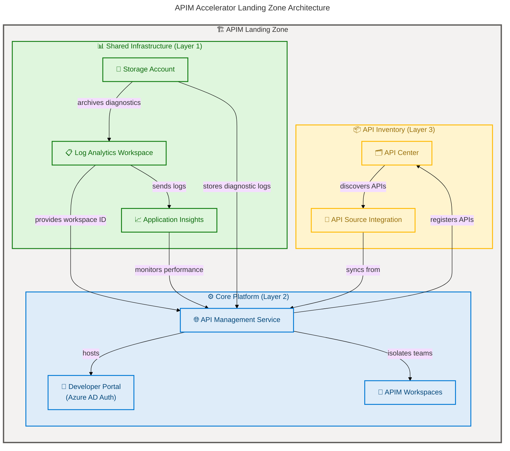

# APIM Accelerator


A production-ready Azure Infrastructure-as-Code accelerator that deploys a complete API Management landing zone with centralized monitoring, API governance, developer portal authentication, and multi-environment support using Azure Bicep and Azure Developer CLI (`azd`).

**Overview**

APIM Accelerator provides enterprise-grade infrastructure templates for provisioning Azure API Management alongside its supporting services — monitoring, API inventory, and identity — in a single, repeatable deployment. It addresses the complexity organizations face when setting up API Management landing zones by automating resource creation, monitoring integration, RBAC assignments, and developer portal configuration through modular Bicep templates.

> 💡 **Why This Matters**: Manually provisioning an API Management landing zone with monitoring, governance, and identity integration typically requires coordinating 10+ Azure resources across multiple service categories. APIM Accelerator reduces this to a single `azd up` command, ensuring consistent configurations across dev, test, staging, and production environments while enforcing organizational tagging and naming conventions.

> 📌 **How It Works**: The accelerator uses a layered deployment architecture orchestrated by a subscription-level Bicep template ([infra/main.bicep](infra/main.bicep)). It first provisions shared monitoring infrastructure (Log Analytics, Application Insights, Storage), then deploys the core API Management service with diagnostic settings and developer portal, and finally creates an API Center instance integrated with APIM for automated API discovery. Configuration is centralized in a single [settings.yaml](infra/settings.yaml) file that controls naming, SKUs, identity, tagging, and workspace definitions.

## 🏗️ Architecture

**Overview**

APIM Accelerator implements a modular, layered deployment architecture that separates infrastructure into three deployment phases: shared services, core platform, and API inventory. Each layer is deployed as an independent Bicep module with explicit dependencies, enabling selective redeployment and clear separation of concerns.

> 💡 **Why This Matters**: The layered approach ensures that foundational services like monitoring are always provisioned before dependent resources, preventing deployment failures and enabling incremental infrastructure updates without full redeployment.

> 📌 **How It Works**: The orchestration template ([infra/main.bicep](infra/main.bicep)) deploys at subscription scope, creates a resource group following the naming convention `{solutionName}-{env}-{location}-rg`, and then deploys three module layers sequentially. Shared monitoring outputs (workspace IDs, instrumentation keys) flow into the core platform module, and core platform outputs (APIM name, resource ID) flow into the inventory module.


```mermaid
---
title: "APIM Accelerator Landing Zone Architecture"
config:
  theme: base
  look: classic
  layout: dagre
  themeVariables:
    fontSize: '16px'
  flowchart:
    htmlLabels: true
---
flowchart TB
    accTitle: APIM Accelerator Landing Zone Architecture
    accDescr: Shows the three-layer deployment architecture with shared monitoring, core API Management platform, and API inventory governance, including 8 components and their integration relationships

    %% ═══════════════════════════════════════════════════════════════════════════
    %% AZURE / FLUENT ARCHITECTURE PATTERN v1.1
    %% (Semantic + Structural + Font + Accessibility Governance)
    %% ═══════════════════════════════════════════════════════════════════════════
    %% PHASE 1 - STRUCTURAL: Direction explicit, flat topology, nesting ≤ 3
    %% PHASE 2 - SEMANTIC: Colors justified, max 5 semantic classes, neutral-first
    %% PHASE 3 - FONT: Dark text on light backgrounds, contrast ≥ 4.5:1
    %% PHASE 4 - ACCESSIBILITY: accTitle/accDescr present, icons on all nodes
    %% PHASE 5 - STANDARD: Governance block present, classDefs centralized
    %% ═══════════════════════════════════════════════════════════════════════════

    subgraph landingZone["🏗️ APIM Landing Zone"]
        direction TB

        subgraph shared["📊 Shared Infrastructure (Layer 1)"]
            direction LR
            law["📋 Log Analytics Workspace"]:::success
            ai["📈 Application Insights"]:::success
            sa["💾 Storage Account"]:::success
        end

        subgraph corePlatform["⚙️ Core Platform (Layer 2)"]
            direction LR
            apim["🌐 API Management Service"]:::core
            portal["🔑 Developer Portal<br/>(Azure AD Auth)"]:::core
            ws["📂 APIM Workspaces"]:::core
        end

        subgraph inventory["📦 API Inventory (Layer 3)"]
            direction LR
            apicenter["🗂️ API Center"]:::warning
            source["🔗 API Source Integration"]:::warning
        end

        law -->|"sends logs"| ai
        sa -->|"archives diagnostics"| law
        law -->|"provides workspace ID"| apim
        ai -->|"monitors performance"| apim
        sa -->|"stores diagnostic logs"| apim
        apim -->|"hosts"| portal
        apim -->|"isolates teams"| ws
        apim -->|"registers APIs"| apicenter
        apicenter -->|"discovers APIs"| source
        source -->|"syncs from"| apim
    end

    %% Centralized semantic classDefs
    classDef core fill:#DEECF9,stroke:#0078D4,stroke-width:2px,color:#004578
    classDef success fill:#DFF6DD,stroke:#107C10,stroke-width:2px,color:#0B6A0B
    classDef warning fill:#FFF4CE,stroke:#FFB900,stroke-width:2px,color:#986F0B

    %% Subgraph styling (style directives, not class — MRM-S001)
    style landingZone fill:#F3F2F1,stroke:#605E5C,stroke-width:3px,color:#323130
    style shared fill:#DFF6DD,stroke:#107C10,stroke-width:2px,color:#0B6A0B
    style corePlatform fill:#DEECF9,stroke:#0078D4,stroke-width:2px,color:#004578
    style inventory fill:#FFF4CE,stroke:#FFB900,stroke-width:2px,color:#986F0B
```

| Color | Semantic Meaning | Components |
|-------|-----------------|------------|
| 🔵 Blue (`#DEECF9`) | Core API services | API Management, Developer Portal, Workspaces |
| 🟢 Green (`#DFF6DD`) | Monitoring and observability | Log Analytics, Application Insights, Storage |
| 🟡 Yellow (`#FFF4CE`) | Governance and inventory | API Center, API Source Integration |

## 📑 Table of Contents

- [Quick Start](#-quick-start)
- [Deployment](#-deployment)
- [Features](#-features)
- [Requirements](#-requirements)
- [Configuration](#-configuration)
- [Project Structure](#-project-structure)
- [Contributing](#-contributing)
- [License](#-license)

## 🚀 Quick Start

**Overview**

Get a fully functional API Management landing zone running on Azure in under 10 minutes. This guide uses Azure Developer CLI (`azd`) to provision all infrastructure with a single command, deploying monitoring, API Management (Premium tier), developer portal, and API Center with default configuration.

> ⚠️ **Prerequisites**: Azure CLI ≥ 2.60.0, Azure Developer CLI ≥ 1.5.0, and an Azure subscription with Contributor + User Access Administrator permissions are required. See [Requirements](#-requirements) for details.

**1. Clone the repository**

```bash
git clone https://github.com/Evilazaro/APIM-Accelerator.git
cd APIM-Accelerator
```

**2. Authenticate with Azure**

```bash
azd auth login
az login
```

**3. Initialize and deploy**

```bash
azd init
azd up
```

When prompted, provide:
- **Environment name**: A name for your deployment (e.g., `dev`, `staging`, `prod`)
- **Azure location**: Target Azure region (e.g., `eastus`, `westeurope`)

**Expected output:**

```text
Provisioning Azure resources (azd provision)
  Creating resource group: apim-accelerator-dev-eastus-rg
  Deploying shared monitoring infrastructure...
  Deploying core API Management platform...
  Deploying API inventory components...

SUCCESS: Your application was provisioned in Azure
```

> 💡 **Tip**: The pre-provision hook automatically purges any soft-deleted APIM instances in the target region to prevent naming conflicts. This runs via [infra/azd-hooks/pre-provision.sh](infra/azd-hooks/pre-provision.sh).

## 📦 Deployment

**Overview**

APIM Accelerator supports two deployment methods: Azure Developer CLI (`azd`) for automated end-to-end provisioning, and direct Azure CLI (`az`) for granular control. Both methods deploy at subscription scope, creating a resource group and all child resources in a single operation. The deployment sequence ensures dependencies are resolved — monitoring infrastructure provisions first, followed by the core APIM platform, then API Center with automatic APIM integration.

> ⚠️ **Important**: API Management Premium tier deployment can take 30-45 minutes on initial provisioning. Subsequent updates are significantly faster.

### Option 1: Azure Developer CLI (Recommended)

```bash
# Provision all Azure resources
azd provision

# Or provision and deploy in one step
azd up
```

### Option 2: Azure CLI (Direct Bicep Deployment)

```bash
az deployment sub create \
  --location eastus \
  --template-file infra/main.bicep \
  --parameters envName=dev location=eastus
```

**Supported environments** (defined in [infra/main.bicep](infra/main.bicep)):

| Environment | Parameter Value | Use Case |
|-------------|----------------|----------|
| 🧪 Development | `dev` | Feature development and testing |
| 🧪 Test | `test` | Integration and regression testing |
| 🔄 Staging | `staging` | Pre-production validation |
| 🚀 Production | `prod` | Live production workloads |
| ✅ UAT | `uat` | User acceptance testing |

### Verify Deployment

After deployment completes, verify the resources were created:

```bash
az resource list --resource-group apim-accelerator-dev-eastus-rg --output table
```

## ✨ Features

**Overview**

APIM Accelerator delivers eight core infrastructure capabilities organized into three deployment layers. Each feature is implemented as a modular Bicep template with explicit input/output contracts, enabling selective customization without modifying the orchestration logic.

> 💡 **Why This Matters**: Modular composition means teams can customize individual components (e.g., swap Premium tier for Developer tier) by changing a single value in `settings.yaml` without understanding the full deployment graph.

> 📌 **How It Works**: Features are composed through Bicep module references in [infra/main.bicep](infra/main.bicep). Each module emits typed outputs that downstream modules consume as inputs, creating an explicit dependency chain validated at deployment time.

| Feature | Description | Module |
|---------|-------------|--------|
| 🌐 **API Management Service** | Configurable APIM instance with Premium tier support, managed identity, VNet integration, and built-in caching | [src/core/apim.bicep](src/core/apim.bicep) |
| 🔑 **Developer Portal** | Self-service portal with Azure AD authentication, CORS policy, sign-in/sign-up configuration, and terms of service | [src/core/developer-portal.bicep](src/core/developer-portal.bicep) |
| 📂 **APIM Workspaces** | Logical isolation for multi-team API development within a single APIM instance | [src/core/workspaces.bicep](src/core/workspaces.bicep) |
| 🗂️ **API Center Integration** | Centralized API catalog with automatic discovery from APIM, governance workflows, and RBAC assignments | [src/inventory/main.bicep](src/inventory/main.bicep) |
| 📋 **Log Analytics Workspace** | Centralized log aggregation with KQL query support, configurable retention, and managed identity | [src/shared/monitoring/operational/main.bicep](src/shared/monitoring/operational/main.bicep) |
| 📈 **Application Insights** | Application performance monitoring with distributed tracing, retention up to 730 days, and LogAnalytics ingestion mode | [src/shared/monitoring/insights/main.bicep](src/shared/monitoring/insights/main.bicep) |
| 💾 **Diagnostic Storage** | Long-term diagnostic log archival using Storage Account with Standard_LRS redundancy | [src/shared/monitoring/operational/main.bicep](src/shared/monitoring/operational/main.bicep) |
| 🏷️ **Enterprise Tagging** | Comprehensive governance tags (CostCenter, BusinessUnit, Owner, ServiceClass, RegulatoryCompliance) applied to all resources | [infra/settings.yaml](infra/settings.yaml) |

### Identity and Security

- **Managed Identity**: System-assigned and user-assigned identity support across all services (APIM, Log Analytics, API Center)
- **Azure AD Authentication**: Developer portal integrated with Azure Active Directory for organizational sign-in
- **RBAC Assignments**: Automated role assignments for API Center (Data Reader, Compliance Manager) using deterministic GUIDs

### Multi-Environment Support

- Five pre-configured environments: `dev`, `test`, `staging`, `prod`, `uat`
- Environment-specific resource naming: `{solution}-{env}-{location}-rg`
- Consistent tagging with environment metadata across all resources

## 📋 Requirements

**Overview**

Deploying APIM Accelerator requires Azure CLI tooling, an active Azure subscription with sufficient permissions, and resource quota for API Management Premium tier. This section defines minimum versions, required permissions, and quota considerations to ensure a successful deployment.

> 💡 **Why This Matters**: Missing prerequisites or insufficient permissions cause deployment failures that can require restarting the 30-45 minute APIM provisioning process. Validating requirements upfront prevents wasted time and Azure compute costs.

> 📌 **How It Works**: The `azd up` command triggers the pre-provision hook ([infra/azd-hooks/pre-provision.sh](infra/azd-hooks/pre-provision.sh)) which validates the environment and cleans up soft-deleted APIM instances before provisioning begins. The Bicep templates enforce parameter constraints (allowed values, minimum lengths) at deployment time.

### Prerequisites

| Requirement | Version | Purpose | Installation |
|-------------|---------|---------|--------------|
| ⚙️ **Azure CLI** | ≥ 2.60.0 | Azure resource management and authentication | [Install](https://learn.microsoft.com/cli/azure/install-azure-cli) |
| 🚀 **Azure Developer CLI** | ≥ 1.5.0 | Infrastructure provisioning automation (`azd up`) | [Install](https://learn.microsoft.com/azure/developer/azure-developer-cli/install-azd) |
| 🐚 **Bash** | ≥ 4.0 | Pre-provision hook script execution | Pre-installed on Linux/macOS |
| 📦 **jq** | ≥ 1.6 | JSON processing in pre-provision scripts | [Install](https://jqlang.github.io/jq/download/) |

### Azure Permissions

| Permission Level | Scope | Required For |
|-----------------|-------|-------------|
| ⚙️ **Contributor** | Subscription | Creating resource groups, APIM, API Center, monitoring resources |
| 🔒 **User Access Administrator** | Subscription | Assigning RBAC roles to API Center managed identity |
| 🔑 **Microsoft.ApiManagement/deletedservices/delete** | Subscription | Pre-provision hook purging soft-deleted APIM instances |

### Azure Resource Quotas

Ensure your subscription has available quota in the target region for:

- **API Management**: 1 Premium tier instance (capacity configurable in [settings.yaml](infra/settings.yaml))
- **API Center**: 1 instance per resource group
- **Log Analytics Workspace**: 1 workspace (PerGB2018 pricing tier)
- **Storage Account**: 1 Standard_LRS account for diagnostic archival
- **Application Insights**: 1 instance with up to 730-day retention

## ⚙️ Configuration

**Overview**

All deployment configuration is centralized in [infra/settings.yaml](infra/settings.yaml), which defines the solution name, monitoring infrastructure settings, API Management SKU and identity, workspace definitions, API Center configuration, and governance tags. Resource names can be explicitly set or left empty for auto-generation using deterministic unique suffixes.

> 💡 **Why This Matters**: Centralizing configuration in a single YAML file eliminates the need to modify Bicep templates directly, reducing the risk of deployment errors and enabling non-IaC engineers to adjust settings for their environment.

> 📌 **How It Works**: The orchestration template ([infra/main.bicep](infra/main.bicep)) loads `settings.yaml` using Bicep's `loadYamlContent()` function and distributes settings to each module through typed parameters defined in [src/shared/common-types.bicep](src/shared/common-types.bicep). Type validation occurs at deployment time, catching configuration errors before Azure resources are created.

### Key Configuration Sections

#### API Management

```yaml
core:
  apiManagement:
    name: ""                        # Leave empty for auto-generated name
    publisherEmail: "admin@org.com" # Required by Azure
    publisherName: "Contoso"        # Organization name in developer portal
    sku:
      name: "Premium"              # Developer | Basic | Standard | Premium | Consumption
      capacity: 1                   # Scale units (Premium: 1-10)
    identity:
      type: "SystemAssigned"        # SystemAssigned | UserAssigned
    workspaces:
      - name: "workspace1"         # Logical API grouping (Premium only)
```

#### Monitoring

```yaml
shared:
  monitoring:
    logAnalytics:
      name: ""                      # Leave empty for auto-generated name
      identity:
        type: "SystemAssigned"
    applicationInsights:
      name: ""                      # Leave empty for auto-generated name
```

#### API Inventory

```yaml
inventory:
  apiCenter:
    name: ""                        # Leave empty for auto-generated name
    identity:
      type: "SystemAssigned"
```

#### Governance Tags

All resources receive governance tags defined in `settings.yaml`:

| Tag | Example Value | Purpose |
|-----|--------------|---------|
| 🏷️ `CostCenter` | `CC-1234` | Cost allocation tracking |
| 🏢 `BusinessUnit` | `IT` | Department ownership |
| 👤 `Owner` | `admin@org.com` | Resource owner contact |
| 📋 `ServiceClass` | `Critical` | Workload tier classification |
| 🔒 `RegulatoryCompliance` | `GDPR` | Compliance requirements |
| 💰 `BudgetCode` | `FY25-Q1-InitiativeX` | Budget or initiative code |

### Resource Naming Convention

Resources follow the pattern: `{solutionName}-{uniqueSuffix}-{resourceType}`

| Resource | Suffix | Example |
|----------|--------|---------|
| Resource Group | `rg` | `apim-accelerator-dev-eastus-rg` |
| API Management | `apim` | `apim-accelerator-abc123-apim` |
| Log Analytics | `law` | `apim-accelerator-abc123-law` |
| Application Insights | `ai` | `apim-accelerator-abc123-ai` |
| API Center | `apicenter` | `apim-accelerator-apicenter` |

The unique suffix is generated deterministically from the subscription ID, resource group ID, solution name, and location using Bicep's `uniqueString()` function (defined in [src/shared/constants.bicep](src/shared/constants.bicep)), ensuring consistent naming across redeployments.

## 📁 Project Structure

```text
APIM-Accelerator/
├── azure.yaml                          # Azure Developer CLI configuration
├── infra/
│   ├── main.bicep                      # Orchestration template (subscription scope)
│   ├── main.parameters.json            # Parameter file for azd
│   ├── settings.yaml                   # Centralized configuration
│   └── azd-hooks/
│       └── pre-provision.sh            # Purges soft-deleted APIM instances
└── src/
    ├── core/
    │   ├── main.bicep                  # Core platform orchestrator
    │   ├── apim.bicep                  # API Management service resource
    │   ├── developer-portal.bicep      # Developer portal + Azure AD auth
    │   └── workspaces.bicep            # APIM workspace isolation
    ├── inventory/
    │   └── main.bicep                  # API Center + APIM integration
    └── shared/
        ├── main.bicep                  # Shared infrastructure orchestrator
        ├── common-types.bicep          # Reusable Bicep type definitions
        ├── constants.bicep             # Constants and utility functions
        ├── monitoring/
        │   ├── main.bicep              # Monitoring orchestrator
        │   ├── insights/
        │   │   └── main.bicep          # Application Insights + diagnostics
        │   └── operational/
        │       └── main.bicep          # Log Analytics + Storage Account
        └── networking/
            └── main.bicep              # Network infrastructure (placeholder)
```

## 🤝 Contributing

**Overview**

Contributions to APIM Accelerator are welcome. This project uses modular Bicep templates with shared type definitions, so understanding the module structure and type system is important before making changes.

> 💡 **Tip**: All custom types are defined in [src/shared/common-types.bicep](src/shared/common-types.bicep). Review the exported types (`ApiManagement`, `Inventory`, `Monitoring`, `Shared`) before adding new parameters to existing modules.

### Getting Started

1. Fork the repository
2. Create a feature branch (`git checkout -b feature/my-improvement`)
3. Make changes following the existing Bicep module patterns
4. Test deployment in a non-production environment
5. Submit a pull request

### Development Guidelines

- **Module pattern**: Each module should accept typed parameters and emit typed outputs
- **Naming**: Follow the `{solutionName}-{uniqueSuffix}-{resourceType}` convention
- **Type safety**: Use custom types from `common-types.bicep` for all configuration objects
- **Documentation**: Include file header comments with purpose, dependencies, and usage examples
- **Tags**: All resources must accept and apply the `tags` parameter

### Validate Bicep Templates

```bash
az bicep build --file infra/main.bicep
```

## 📄 License

This project is licensed under the [MIT License](LICENSE).

Copyright (c) 2025 Evilázaro Alves
