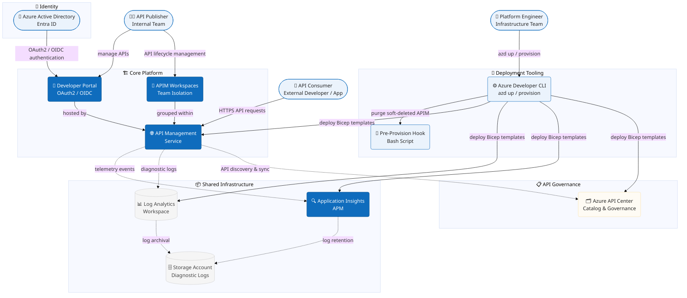

# APIM Accelerator


The **APIM Accelerator** is a production-ready, infrastructure-as-code solution that provisions a complete Azure API Management landing zone using Azure Developer CLI (`azd`) and Bicep templates. It automates the end-to-end deployment of Azure API Management, centralized observability services, and API governance infrastructure, reducing a multi-week manual setup to a single `azd up` command.

API platform teams and cloud engineers frequently spend weeks manually configuring API Management, wiring up monitoring, and establishing governance tooling. This accelerator solves that problem by encoding proven landing-zone patterns — centralized logging, Application Insights telemetry, developer portal authentication, team-based workspace isolation, and API Center integration — into a fully parameterized, environment-aware Bicep template hierarchy that deploys cleanly across `dev`, `test`, `staging`, `uat`, and `prod` environments.

The solution uses **Bicep** as the infrastructure-as-code language, orchestrated by **Azure Developer CLI**, and targets **Azure API Management Premium** by default. It integrates with Azure Monitor (Log Analytics Workspace and Application Insights), Azure API Center for API governance and discovery, and Azure Active Directory (Entra ID) for developer portal authentication.

## Table of Contents

- [Features](#features)
- [Architecture](#architecture)
- [Technologies Used](#technologies-used)
- [Quick Start](#quick-start)
- [Configuration](#configuration)
- [Deployment](#deployment)
- [Usage](#usage)
- [Contributing](#contributing)
- [License](#license)

## Features

- 🚀 **Single-command deployment** — provision the entire APIM landing zone with `azd up`
- 🌐 **Azure API Management** — configurable SKU (Developer, Basic, Standard, Premium, Consumption) with system-assigned or user-assigned managed identity and optional virtual network integration
- 📂 **APIM Workspaces** — logical API grouping and team isolation within a single APIM instance (Premium SKU only)
- 📖 **Developer Portal** — self-service API documentation and testing portal pre-configured with Azure Active Directory (Entra ID) authentication via OAuth 2.0 and OpenID Connect
- 📊 **Centralized Observability** — Log Analytics Workspace, Application Insights APM, and Storage Account for diagnostic log archival, all automatically wired to APIM diagnostic settings
- 🗂️ **API Governance** — Azure API Center integration for automatic API discovery, cataloging, and compliance management linked to the APIM service
- 🔐 **Secure by Default** — system-assigned managed identity on every service, configurable public network access, and least-privilege RBAC role assignments
- 🏷️ **Governance Tagging** — comprehensive resource tags (cost center, business unit, regulatory compliance, chargeback model) applied to all resources via `settings.yaml`
- ♻️ **Environment-aware Configuration** — a single YAML settings file drives all resource sizing and configuration across `dev`, `test`, `staging`, `uat`, and `prod` environments
- 🔄 **Pre-provision Automation** — a Bash hook automatically purges soft-deleted APIM instances before deployment to prevent naming conflicts and enable clean redeployment

## Architecture

The APIM Accelerator deploys a layered landing zone across three logical tiers. A **Platform Engineer** provisions the infrastructure using `azd`, which runs a pre-provision hook to clean up soft-deleted APIM instances and then deploys Bicep templates at subscription scope. At runtime, an **API Consumer** sends HTTPS requests through the API Management gateway, while an **API Publisher** manages the API lifecycle through the Developer Portal or APIM Workspaces. Telemetry and diagnostic logs flow asynchronously to Application Insights and Log Analytics for observability; API metadata synchronizes to Azure API Center for governance and discoverability.


```mermaid
---
config:
  description: "High-level architecture diagram showing actors, primary flows, and major components."
  theme: base
  align: center
  fontFamily: "Segoe UI, Verdana, sans-serif"
  fontSize: 16
  textColor: "#242424"
  primaryColor: "#0f6cbd"
  primaryTextColor: "#FFFFFF"
  primaryBorderColor: "#0f548c"
  secondaryColor: "#ebf3fc"
  secondaryTextColor: "#242424"
  secondaryBorderColor: "#0f6cbd"
  tertiaryColor: "#f5f5f5"
  tertiaryTextColor: "#424242"
  tertiaryBorderColor: "#d1d1d1"
  noteBkgColor: "#fefbf4"
  noteTextColor: "#242424"
  noteBorderColor: "#f9e2ae"
  lineColor: "#616161"
  background: "#FFFFFF"
  edgeLabelBackground: "#FFFFFF"
  clusterBkg: "#fafafa"
  clusterBorder: "#e0e0e0"
  titleColor: "#242424"
  errorBkgColor: "#fdf3f4"
  errorTextColor: "#b10e1c"
---
flowchart TB

  %% ── Actors ──────────────────────────────────────────────────────────────
  consumer(["👤 API Consumer<br/>External Developer / App"])
  publisher(["👩‍💻 API Publisher<br/>Internal Team"])
  engineer(["🔧 Platform Engineer<br/>Infrastructure Team"])

  %% ── Identity ─────────────────────────────────────────────────────────────
  subgraph identity["🔐 Identity"]
    aad(["🪪 Azure Active Directory<br/>Entra ID"])
  end

  %% ── Deployment Tooling ───────────────────────────────────────────────────
  subgraph deploy["🚀 Deployment Tooling"]
    azd("⚙️ Azure Developer CLI<br/>azd up / provision")
    preprovision("📜 Pre-Provision Hook<br/>Bash Script")
  end

  %% ── Shared Infrastructure ────────────────────────────────────────────────
  subgraph shared["📦 Shared Infrastructure"]
    law[("📊 Log Analytics<br/>Workspace")]
    appinsights("🔍 Application Insights<br/>APM")
    storage[("🗄️ Storage Account<br/>Diagnostic Logs")]
  end

  %% ── Core Platform ────────────────────────────────────────────────────────
  subgraph core["🏗️ Core Platform"]
    apim("🌐 API Management<br/>Service")
    devportal("📖 Developer Portal<br/>OAuth2 / OIDC")
    workspaces("📂 APIM Workspaces<br/>Team Isolation")
  end

  %% ── API Governance ───────────────────────────────────────────────────────
  subgraph inventory["📋 API Governance"]
    apicenter("🗂️ Azure API Center<br/>Catalog & Governance")
  end

  %% ── Deployment Flows ─────────────────────────────────────────────────────
  engineer -->|"azd up / provision"| azd
  azd -->|"purge soft-deleted APIM"| preprovision
  azd -->|"deploy Bicep templates"| apim
  azd -->|"deploy Bicep templates"| law
  azd -->|"deploy Bicep templates"| appinsights
  azd -->|"deploy Bicep templates"| apicenter

  %% ── Runtime Flows ────────────────────────────────────────────────────────
  consumer -->|"HTTPS API requests"| apim
  publisher -->|"manage APIs"| devportal
  publisher -->|"API lifecycle management"| workspaces
  devportal -->|"hosted by"| apim
  workspaces -->|"grouped within"| apim

  %% ── Authentication ───────────────────────────────────────────────────────
  aad -->|"OAuth2 / OIDC authentication"| devportal

  %% ── Observability Flows (async) ──────────────────────────────────────────
  apim -.->|"telemetry events"| appinsights
  apim -.->|"diagnostic logs"| law
  appinsights -.->|"log retention"| storage
  law -.->|"log archival"| storage
  apim -.->|"API discovery & sync"| apicenter

  %% ── Class Definitions ────────────────────────────────────────────────────
  classDef actor fill:#ebf3fc,stroke:#0f6cbd,color:#242424
  classDef service fill:#0f6cbd,stroke:#0f548c,color:#FFFFFF
  classDef datastore fill:#f5f5f5,stroke:#d1d1d1,color:#424242
  classDef tooling fill:#ebf3fc,stroke:#0f6cbd,color:#242424
  classDef inventoryStyle fill:#fefbf4,stroke:#f9e2ae,color:#242424

  class consumer,publisher,engineer,aad actor
  class apim,devportal,workspaces,appinsights service
  class law,storage datastore
  class azd,preprovision tooling
  class apicenter inventoryStyle
```

## Technologies Used

| Technology                        | Type            | Purpose                                                                               |
| --------------------------------- | --------------- | ------------------------------------------------------------------------------------- |
| Azure API Management              | Azure Service   | API gateway, policy enforcement, rate limiting, and developer portal                  |
| Azure API Center                  | Azure Service   | Centralized API catalog, governance, and automatic discovery from APIM                |
| Azure Log Analytics Workspace     | Azure Service   | Centralized log collection, querying, and operational analysis                        |
| Azure Application Insights        | Azure Service   | Application performance monitoring, distributed tracing, and diagnostics              |
| Azure Storage Account             | Azure Service   | Long-term diagnostic log retention and archival for compliance                        |
| Azure Active Directory (Entra ID) | Azure Service   | OAuth 2.0 / OIDC authentication for the developer portal                              |
| Bicep                             | IaC Language    | Declarative infrastructure-as-code for all Azure resources                            |
| Azure Developer CLI (`azd`)       | Deployment Tool | End-to-end provisioning, deployment orchestration, and lifecycle management           |
| Azure CLI                         | CLI Tool        | Azure resource management invoked by the pre-provision automation hook                |
| YAML                              | Configuration   | Environment-specific settings defined in `infra/settings.yaml`                        |
| Bash                              | Scripting       | Pre-provision hook (`infra/azd-hooks/pre-provision.sh`) for soft-deleted APIM cleanup |

## Quick Start

### Prerequisites

| Prerequisite                | Version  | Notes                                                                                        |
| --------------------------- | -------- | -------------------------------------------------------------------------------------------- |
| Azure CLI                   | ≥ 2.50.0 | [Install guide](https://learn.microsoft.com/cli/azure/install-azure-cli)                     |
| Azure Developer CLI (`azd`) | ≥ 1.5.0  | [Install guide](https://learn.microsoft.com/azure/developer/azure-developer-cli/install-azd) |
| Azure Subscription          | —        | Contributor or Owner role required at subscription scope                                     |

### Installation

1. Clone the repository:

   ```bash
   git clone https://github.com/Evilazaro/APIM-Accelerator.git
   cd APIM-Accelerator
   ```

2. Authenticate with Azure:

   ```bash
   az login
   azd auth login
   ```

3. Provision and deploy the entire landing zone:

   ```bash
   azd up
   ```

   When prompted, supply:
   - **Subscription** — your Azure subscription ID
   - **Environment name** — one of `dev`, `test`, `staging`, `prod`, or `uat`
   - **Location** — an Azure region that supports API Management Premium (for example, `eastus`)

### Minimal Working Example

```bash
# Provision all resources and deploy in a single command
azd up

# Provision infrastructure only (no application code deployment)
azd provision

# Redeploy after configuration changes
azd deploy
```

> [!NOTE]
> The `azd up` command automatically runs the pre-provision hook defined in `infra/azd-hooks/pre-provision.sh`, which purges any soft-deleted APIM instances in the target region before provisioning begins.

## Configuration

All environment-specific settings are declared in `infra/settings.yaml`. Edit this file before running `azd up` to customize the deployment.

| Option                                       | Default                 | Description                                                                      |
| -------------------------------------------- | ----------------------- | -------------------------------------------------------------------------------- |
| `core.apiManagement.sku.name`                | `"Premium"`             | APIM pricing tier: `Developer`, `Basic`, `Standard`, `Premium`, or `Consumption` |
| `core.apiManagement.sku.capacity`            | `1`                     | Number of APIM scale units (Premium supports 1–10)                               |
| `core.apiManagement.publisherEmail`          | `"evilazaro@gmail.com"` | Publisher contact email required by Azure and shown in the developer portal      |
| `core.apiManagement.publisherName`           | `"Contoso"`             | Organization name displayed in the developer portal                              |
| `core.apiManagement.identity.type`           | `"SystemAssigned"`      | Managed identity type: `SystemAssigned` or `UserAssigned`                        |
| `core.apiManagement.workspaces[0].name`      | `"workspace1"`          | Name of the first APIM workspace (Premium SKU only)                              |
| `shared.monitoring.logAnalytics.name`        | `""`                    | Log Analytics workspace name — leave empty for auto-generation                   |
| `shared.monitoring.applicationInsights.name` | `""`                    | Application Insights name — leave empty for auto-generation                      |
| `inventory.apiCenter.name`                   | `""`                    | API Center name — leave empty for auto-generation                                |
| `shared.tags.CostCenter`                     | `"CC-1234"`             | Cost center tag applied to all shared resources                                  |
| `shared.tags.Owner`                          | `"evilazaro@gmail.com"` | Owner tag for resource governance and incident routing                           |
| `shared.tags.RegulatoryCompliance`           | `"GDPR"`                | Compliance requirement tag (for example, `GDPR`, `HIPAA`, `PCI`, `None`)         |

### Example Override

```yaml
core:
  apiManagement:
    sku:
      name: "Developer"
      capacity: 1
    publisherEmail: "platform@contoso.com"
    publisherName: "Contoso Platform"
    workspaces:
      - name: "dev-team"
  tags:
    lz-component-type: "core"
    component: "apiManagement"

shared:
  tags:
    CostCenter: "CC-9999"
    Owner: "platform-team@contoso.com"
    RegulatoryCompliance: "None"
```

> [!IMPORTANT]
> The `Premium` SKU is required to use APIM Workspaces. Deploying with `Developer` or `Standard` SKU disables workspace isolation. See the [Azure API Management pricing tiers](https://learn.microsoft.com/azure/api-management/api-management-features) for a full feature comparison.

## Deployment

Follow these steps to deploy the APIM Accelerator to a production or staging environment:

1. **Authenticate** with your Azure account and set the target subscription:

   ```bash
   az login
   az account set --subscription "<your-subscription-id>"
   azd auth login
   ```

2. **Update configuration** in `infra/settings.yaml` to set the publisher email, organization name, desired SKU, and governance tags for your environment.

3. **Run the full deployment** using Azure Developer CLI:

   ```bash
   azd up
   ```

   This command executes the following sequence:
   - Runs `infra/azd-hooks/pre-provision.sh` to purge soft-deleted APIM instances.
   - Creates the resource group at subscription scope.
   - Deploys shared monitoring infrastructure (Log Analytics Workspace, Application Insights, Storage Account).
   - Deploys the core APIM service with workspaces and developer portal configuration.
   - Deploys the API Center inventory integration and RBAC role assignments.

4. **Verify the deployment** by reviewing outputs in the terminal or querying the resource group:

   ```bash
   azd show
   ```

5. **Provision infrastructure only** (without triggering application code changes):

   ```bash
   azd provision
   ```

6. **Tear down all resources** when the environment is no longer needed:

   ```bash
   azd down
   ```

> [!WARNING]
> Running `azd down` permanently deletes all provisioned Azure resources. API Management enters a soft-delete state and is retained for up to 48 hours before permanent purge. To redeploy to the same region immediately, run `./infra/azd-hooks/pre-provision.sh "<azure-region>"` manually to purge the soft-deleted instance first.

## Usage

### Access the Developer Portal

After deployment, retrieve the developer portal URL using the Azure CLI:

```bash
az apim show \
  --name "<your-apim-name>" \
  --resource-group "<your-resource-group>" \
  --query "developerPortalUrl" \
  --output tsv
```

Expected output:

```
https://<your-apim-name>.developer.azure-api.net
```

### Publish an API

Import an OpenAPI specification into API Management:

```bash
az apim api import \
  --resource-group "<your-resource-group>" \
  --service-name "<your-apim-name>" \
  --path "orders" \
  --display-name "Orders API" \
  --specification-format OpenApi \
  --specification-path ./orders-api.yaml
```

### Call an API Through the Gateway

Send a request to a published API using a subscription key:

```bash
curl -X GET \
  "https://<your-apim-name>.azure-api.net/orders/v1/items" \
  -H "Ocp-Apim-Subscription-Key: <your-subscription-key>"
```

Expected output:

```json
{
  "items": [{ "id": "001", "name": "Widget A", "quantity": 10 }]
}
```

### Query API Center for Registered APIs

List all APIs synchronized to Azure API Center:

```bash
az apic api list \
  --resource-group "<your-resource-group>" \
  --service-name "<your-apicenter-name>"
```

> [!TIP]
> Use the `--workspace-name` flag with `az apim` commands to scope operations to a specific APIM workspace when running a Premium SKU deployment with workspace isolation enabled.

## Contributing

Contributions are welcome. To contribute to this project:

1. **Fork** the repository on GitHub.
2. **Create a feature branch** from `main`:

   ```bash
   git checkout -b feature/your-feature-name
   ```

3. **Make your changes** following the existing Bicep naming conventions and YAML structure defined in `src/shared/constants.bicep` and `infra/settings.yaml`.
4. **Test your changes** by running `azd provision` against a development environment (`envName=dev`) before submitting.
5. **Submit a pull request** against the `main` branch with a clear description of the changes and the problem they address.

> [!NOTE]
> Open a GitHub issue before submitting large or breaking changes to discuss the approach with the maintainers first. This avoids duplicate work and ensures alignment with the project direction.

## License

This project is licensed under the **MIT License**. See the [LICENSE](LICENSE) file for full terms.

---

_Created by Evilazaro Alves — Principal Cloud Solution Architect, Cloud Platforms and AI Apps, Microsoft._
