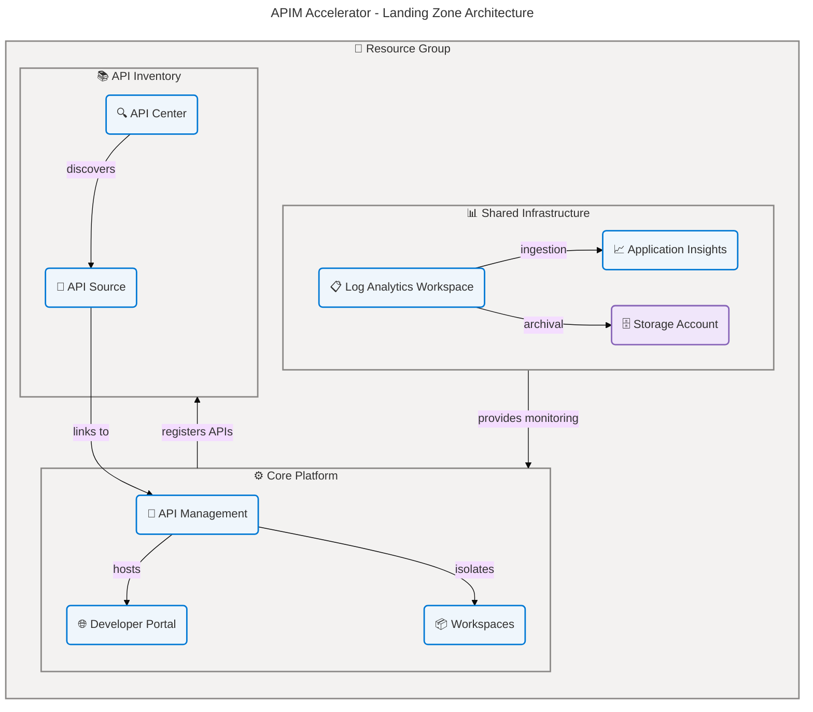

# APIM Accelerator

[](LICENSE)
[](https://azure.microsoft.com/products/api-management)
[](https://learn.microsoft.com/azure/azure-resource-manager/bicep/)
[]()

An enterprise-grade Azure Infrastructure-as-Code (IaC) accelerator that deploys a complete API Management landing zone with monitoring, governance, and API inventory capabilities using Bicep and the Azure Developer CLI (`azd`).

> [!TIP]
> Run `azd up` to provision the entire solution in a single command — no manual Azure Portal configuration required.

## Overview

**Overview**

This accelerator provides a production-ready foundation for organizations adopting Azure API Management at enterprise scale. It automates the deployment of a complete API platform including gateway services, developer portal, centralized monitoring, and API governance — enabling platform teams to establish a fully operational API landing zone in minutes rather than weeks.

The solution uses a modular Bicep architecture with three deployment layers — shared infrastructure, core platform, and API inventory — orchestrated through the Azure Developer CLI (`azd`). Each layer is independently configurable through a centralized YAML settings file, supporting multiple environments (`dev`, `test`, `staging`, `prod`, `uat`) with deterministic resource naming and comprehensive tagging for cost management and compliance.

## Table of Contents

- [Architecture](#architecture)
- [Features](#features)
- [Requirements](#requirements)
- [Quick Start](#quick-start)
- [Configuration](#configuration)
- [Project Structure](#project-structure)
- [Deployment](#deployment)
- [Contributing](#contributing)
- [License](#license)

## Architecture

**Overview**

The solution deploys three coordinated infrastructure layers to Azure, each encapsulated as a Bicep module with explicit dependency ordering. The shared monitoring layer deploys first, followed by the core API Management platform, and finally the API inventory service that links back to APIM for automated discovery.


```mermaid
---
title: "APIM Accelerator - Landing Zone Architecture"
config:
  theme: base
  look: classic
  layout: dagre
  flowchart:
    htmlLabels: true
---
flowchart TB
    accTitle: APIM Accelerator Landing Zone Architecture
    accDescr: Shows the three-layer deployment architecture with shared monitoring, core APIM platform, and API inventory management components and their relationships

    %% ═══════════════════════════════════════════════════════════════════════════
    %% AZURE / FLUENT ARCHITECTURE PATTERN v1.1
    %% (Semantic + Structural + Font + Accessibility Governance)
    %% ═══════════════════════════════════════════════════════════════════════════
    %% PHASE 1 - FLUENT UI: All styling uses approved Fluent UI palette only
    %% PHASE 2 - GROUPS: Every subgraph has semantic color via style directive
    %% PHASE 3 - COMPONENTS: Every node has semantic classDef + icon prefix
    %% PHASE 4 - ACCESSIBILITY: accTitle/accDescr present, WCAG AA contrast
    %% PHASE 5 - STANDARD: Governance block present, classDefs centralized
    %% ═══════════════════════════════════════════════════════════════════════════

    subgraph rg["🏢 Resource Group"]
        direction TB

        subgraph shared["📊 Shared Infrastructure"]
            direction LR
            law("📋 Log Analytics Workspace"):::core
            ai("📈 Application Insights"):::core
            sa("🗄️ Storage Account"):::data
            law -->|"ingestion"| ai
            law -->|"archival"| sa
        end

        subgraph core["⚙️ Core Platform"]
            direction LR
            apim("🔌 API Management"):::core
            dp("🌐 Developer Portal"):::core
            ws("📦 Workspaces"):::core
            apim -->|"hosts"| dp
            apim -->|"isolates"| ws
        end

        subgraph inv["📚 API Inventory"]
            direction LR
            ac("🔍 API Center"):::core
            apisrc("🔗 API Source"):::core
            ac -->|"discovers"| apisrc
        end
    end

    shared -->|"provides monitoring"| core
    core -->|"registers APIs"| inv
    apisrc -->|"links to"| apim

    style rg fill:#F3F2F1,stroke:#8A8886,stroke-width:2px,color:#323130
    style shared fill:#F3F2F1,stroke:#8A8886,stroke-width:2px,color:#323130
    style core fill:#F3F2F1,stroke:#8A8886,stroke-width:2px,color:#323130
    style inv fill:#F3F2F1,stroke:#8A8886,stroke-width:2px,color:#323130

    classDef core fill:#EFF6FC,stroke:#0078D4,stroke-width:2px,color:#323130
    classDef data fill:#F0E6FA,stroke:#8764B8,stroke-width:2px,color:#323130
```

**Component Roles:**

| Component                  | Purpose                                     | Azure Service                   |
| -------------------------- | ------------------------------------------- | ------------------------------- |
| 📋 Log Analytics Workspace | Centralized logging and monitoring hub      | `Microsoft.OperationalInsights` |
| 📈 Application Insights    | Application performance monitoring (APM)    | `Microsoft.Insights`            |
| 🗄️ Storage Account         | Long-term diagnostic log archival           | `Microsoft.Storage`             |
| 🔌 API Management          | API gateway with policy engine and security | `Microsoft.ApiManagement`       |
| 🌐 Developer Portal        | Self-service API portal with Azure AD auth  | `Microsoft.ApiManagement`       |
| 📦 Workspaces              | Logical API isolation by team or project    | `Microsoft.ApiManagement`       |
| 🔍 API Center              | Centralized API catalog and governance      | `Microsoft.ApiCenter`           |
| 🔗 API Source              | Automated API discovery from APIM           | `Microsoft.ApiCenter`           |

## Features

**Overview**

The accelerator bundles the core capabilities needed to operate an API platform at enterprise scale into a single deployable solution. Each feature is implemented through Bicep modules that can be independently configured or extended.

Beyond basic APIM deployment, the solution integrates monitoring, governance, and developer experience into a cohesive landing zone — reducing the operational burden of managing API infrastructure across multiple teams.

| Feature                     | Description                                                                                            | Status    |
| --------------------------- | ------------------------------------------------------------------------------------------------------ | --------- |
| 🔌 Premium API Gateway      | Azure API Management with Premium SKU supporting multi-region, VNet integration, and high availability | ✅ Stable |
| 🌐 Developer Portal         | Self-service portal with Azure AD authentication, CORS policies, and terms of service                  | ✅ Stable |
| 📦 Workspace Isolation      | Logical API grouping for multi-team environments with independent management (Premium only)            | ✅ Stable |
| 🔍 API Inventory            | Centralized API Center with automatic discovery from APIM and governance roles                         | ✅ Stable |
| 📊 Comprehensive Monitoring | Log Analytics + Application Insights + diagnostic storage for full observability                       | ✅ Stable |
| 🔐 Managed Identity         | System-assigned identities for secure, credential-free Azure resource authentication                   | ✅ Stable |
| 🏷️ Governance Tagging       | Enterprise tagging strategy with cost center, compliance, and ownership metadata                       | ✅ Stable |
| ⚙️ Deterministic Naming     | Reproducible resource names derived from subscription, resource group, and solution name               | ✅ Stable |
| 🚀 One-Command Deployment   | Full landing zone provisioned via `azd up` with pre-provision hooks for clean deployments              | ✅ Stable |

## Requirements

**Overview**

Deploying this accelerator requires an active Azure subscription with sufficient permissions to create resource groups, API Management instances, and supporting services. The Azure Developer CLI handles orchestration, while Bicep templates define the infrastructure.

All prerequisites listed below are validated during the pre-provision hook before any Azure resources are created, ensuring a clean deployment experience.

| Requirement            | Details                                                                                                        | Required    |
| ---------------------- | -------------------------------------------------------------------------------------------------------------- | ----------- |
| ☁️ Azure Subscription  | Active subscription with permissions to create Resource Groups, APIM, API Center, Storage, and Log Analytics   | ✅ Yes      |
| 🛠️ Azure CLI           | Version 2.50+ configured and authenticated (`az login`)                                                        | ✅ Yes      |
| 🚀 Azure Developer CLI | `azd` installed ([install guide](https://learn.microsoft.com/azure/developer/azure-developer-cli/install-azd)) | ✅ Yes      |
| 🔑 Azure Permissions   | `Microsoft.ApiManagement/deletedservices/delete` (for pre-provision cleanup of soft-deleted instances)         | ✅ Yes      |
| 🌐 Azure AD Tenant     | Required for Developer Portal authentication (configured in `infra/settings.yaml`)                             | ⚠️ Optional |
| 🔗 Virtual Network     | Existing VNet and subnet for External/Internal VNet integration (Premium SKU)                                  | ⚠️ Optional |

## Quick Start

**Overview**

Get the full API Management landing zone running in your Azure subscription with three commands. The `azd` CLI handles resource group creation, monitoring infrastructure, APIM deployment, and API Center setup automatically.

**1. Clone the repository**

```bash
git clone https://github.com/Evilazaro/APIM-Accelerator.git
cd APIM-Accelerator
```

**2. Initialize the environment**

```bash
azd init
```

> [!NOTE]
> When prompted, provide an environment name (e.g., `dev`, `staging`, `prod`) and select your target Azure region. The environment name maps directly to the `envName` parameter used for resource naming and configuration.

**3. Deploy the landing zone**

```bash
azd up
```

This single command executes the full deployment sequence:

1. **Pre-provision hook** — purges soft-deleted APIM instances to prevent naming conflicts
2. **Resource group creation** — follows the pattern `apim-accelerator-{env}-{region}-rg`
3. **Shared infrastructure** — deploys Log Analytics, Application Insights, and Storage
4. **Core platform** — deploys API Management (Premium), Developer Portal, and Workspaces
5. **API inventory** — deploys API Center with automated APIM discovery

> [!WARNING]
> Azure API Management Premium tier deployment can take 30-45 minutes to complete. The `azd up` command will wait for all resources to be provisioned before returning.

## Configuration

**Overview**

All deployment settings are centralized in a single YAML configuration file at `infra/settings.yaml`. This file controls resource naming, SKU selection, identity configuration, workspace definitions, and tagging strategy — eliminating the need to modify Bicep templates directly.

Resource names left blank in the settings file trigger automatic name generation using a deterministic pattern based on the solution name, subscription, and resource group, ensuring reproducible deployments across environments.

### Core Settings

```yaml
# infra/settings.yaml — Key configuration options

solutionName: "apim-accelerator" # Base name for all resources

core:
  apiManagement:
    name: "" # Leave blank for auto-generation
    publisherEmail: "your@email.com" # Required — publisher contact
    publisherName: "YourOrg" # Shown in Developer Portal
    sku:
      name: "Premium" # Developer | Basic | Standard | Premium | Consumption
      capacity: 1 # Scale units (Premium: 1-10)
    identity:
      type: "SystemAssigned" # SystemAssigned | UserAssigned
    workspaces:
      - name: "workspace1" # Logical API isolation (Premium only)
```

### Monitoring Settings

```yaml
shared:
  monitoring:
    logAnalytics:
      name: "" # Leave blank for auto-generation
      identity:
        type: "SystemAssigned"
    applicationInsights:
      name: "" # Leave blank for auto-generation
```

### Tagging Strategy

The solution applies enterprise governance tags to all deployed resources:

| Tag                       | Purpose                  | Example               |
| ------------------------- | ------------------------ | --------------------- |
| 🏢 `CostCenter`           | Cost allocation tracking | `CC-1234`             |
| 💼 `BusinessUnit`         | Department ownership     | `IT`                  |
| 👤 `Owner`                | Resource owner contact   | `admin@example.com`   |
| 📋 `ApplicationName`      | Workload identifier      | `APIM Platform`       |
| 🏗️ `ProjectName`          | Initiative tracking      | `APIMForAll`          |
| ⚡ `ServiceClass`         | Criticality tier         | `Critical`            |
| 📜 `RegulatoryCompliance` | Compliance framework     | `GDPR`                |
| 📞 `SupportContact`       | Incident contact         | `admin@example.com`   |
| 💰 `ChargebackModel`      | Billing model            | `Dedicated`           |
| 📊 `BudgetCode`           | Budget reference         | `FY25-Q1-InitiativeX` |

### Environment Parameters

Environment-specific values are passed through `infra/main.parameters.json`:

```json
{
  "parameters": {
    "envName": { "value": "${AZURE_ENV_NAME}" },
    "location": { "value": "${AZURE_LOCATION}" }
  }
}
```

Supported environment names: `dev`, `test`, `staging`, `prod`, `uat`

## Project Structure

```text
.
├── azure.yaml                    # azd project configuration and lifecycle hooks
├── infra/
│   ├── main.bicep                # Subscription-level orchestration template
│   ├── main.parameters.json      # Environment parameter bindings
│   ├── settings.yaml             # Centralized deployment configuration
│   └── azd-hooks/
│       └── pre-provision.sh      # Soft-deleted APIM purge script
└── src/
    ├── core/
    │   ├── main.bicep            # Core platform orchestration
    │   ├── apim.bicep            # API Management service definition
    │   ├── developer-portal.bicep # Developer Portal with Azure AD
    │   └── workspaces.bicep      # Workspace isolation module
    ├── inventory/
    │   └── main.bicep            # API Center and API Source definitions
    └── shared/
        ├── main.bicep            # Shared infrastructure orchestration
        ├── common-types.bicep    # Reusable type definitions
        ├── constants.bicep       # Naming conventions and utility functions
        ├── monitoring/
        │   ├── main.bicep        # Monitoring orchestration
        │   ├── insights/
        │   │   └── main.bicep    # Application Insights module
        │   └── operational/
        │       └── main.bicep    # Log Analytics and diagnostic storage
        └── networking/
            └── main.bicep        # Network infrastructure (extensible)
```

## Deployment

**Overview**

The deployment leverages the Azure Developer CLI (`azd`) for end-to-end lifecycle management. Three commands cover the most common deployment scenarios. The pre-provision hook automatically handles cleanup of soft-deleted APIM instances to prevent naming conflicts during redeployment.

### Full Deployment

```bash
azd up
```

### Infrastructure Only

```bash
azd provision
```

### Tear Down

```bash
azd down
```

### Manual Deployment (Alternative)

```bash
az deployment sub create \
  --location eastus \
  --template-file infra/main.bicep \
  --parameters envName=dev location=eastus
```

### Deployment Sequence

The orchestration template (`infra/main.bicep`) deploys resources in this order:

1. **Resource Group** — `{solutionName}-{env}-{region}-rg`
2. **Shared Monitoring** — Log Analytics → Application Insights → Diagnostic Storage
3. **Core Platform** — API Management → Developer Portal → Workspaces
4. **API Inventory** — API Center → API Source (linked to APIM)

> [!NOTE]
> Each layer depends on outputs from the previous layer. The shared monitoring infrastructure must deploy successfully before the core platform can start provisioning.

## Contributing

**Overview**

Contributions to the APIM Accelerator are welcome. Whether you are fixing a bug, adding a feature, or improving documentation, your input helps strengthen the project for the community.

This project follows standard GitHub contribution workflows. All Bicep modules should maintain the existing patterns for type safety (`common-types.bicep`), naming conventions (`constants.bicep`), and tagging strategy.

1. Fork the repository
2. Create a feature branch (`git checkout -b feature/your-feature`)
3. Commit your changes (`git commit -m 'Add your feature'`)
4. Push to the branch (`git push origin feature/your-feature`)
5. Open a Pull Request

## License

This project is licensed under the **MIT License** — see the [LICENSE](LICENSE) file for details.

Copyright (c) 2025 Evilázaro Alves
