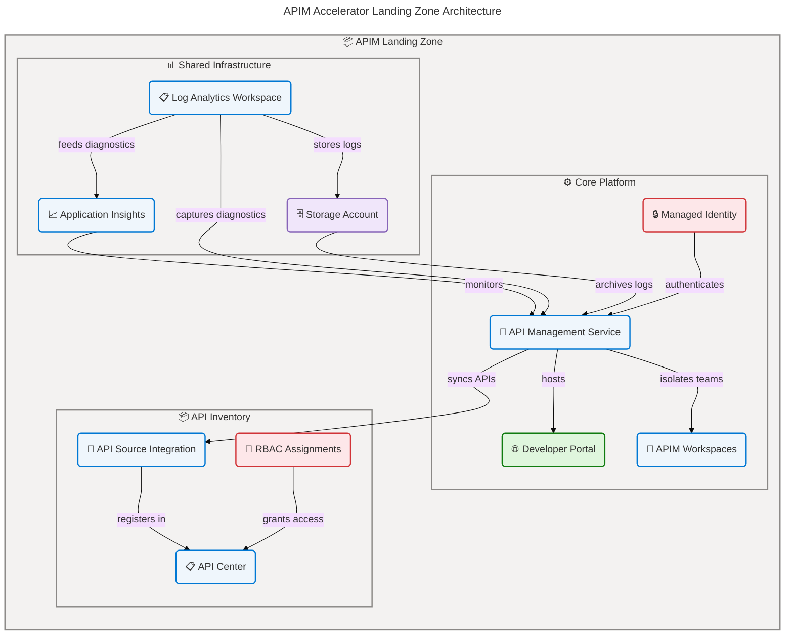

# APIM Accelerator

[](https://azure.microsoft.com/products/api-management)
[](https://learn.microsoft.com/azure/azure-resource-manager/bicep/)
[](LICENSE)
[](https://learn.microsoft.com/azure/developer/azure-developer-cli/)


An enterprise-grade Infrastructure-as-Code (IaC) accelerator that deploys a complete Azure API Management Landing Zone with integrated monitoring, developer portal, workspace-based multi-tenancy, and API governance through Azure API Center.

> [!TIP]
> This accelerator uses Azure Developer CLI (`azd`) for streamlined provisioning. Run `azd up` from the repository root to deploy the entire landing zone in a single command.

## Table of Contents

- [Overview](#overview)
- [Architecture](#architecture)
- [Features](#features)
- [Requirements](#requirements)
- [Getting Started](#getting-started)
- [Configuration](#configuration)
- [Usage](#usage)
- [Project Structure](#project-structure)
- [Deployment](#deployment)
- [Contributing](#contributing)
- [License](#license)

## Overview

**Overview**

This accelerator provides a **production-ready Azure API Management Landing Zone** that follows **Azure Cloud Adoption Framework** best practices. It enables platform engineering teams to deploy a fully configured APIM environment with monitoring, security, and governance capabilities in minutes rather than days.

The solution uses a **modular Bicep architecture** with **three deployment tiers** — Shared Infrastructure, Core Platform, and API Inventory — orchestrated through Azure Developer CLI (`azd`) for repeatable, environment-aware deployments across dev, test, staging, and production.

> [!NOTE]
> The project targets Azure API Management **Premium** SKU by default, which supports multi-region deployments, virtual network integration, and workspaces. Modify `infra/settings.yaml` to select a different SKU tier for non-production environments.

## Architecture

**Overview**

The landing zone follows a **layered deployment architecture** with **clear dependency ordering**. Shared monitoring infrastructure is provisioned first, followed by core API Management services, and finally API inventory management through Azure API Center.

The orchestration template (`infra/main.bicep`) targets **subscription scope**, creates a resource group, and deploys each layer as a Bicep module with **explicit output chaining** for cross-module references.


```mermaid
---
title: "APIM Accelerator Landing Zone Architecture"
config:
  theme: base
  look: classic
  layout: dagre
  themeVariables:
    fontSize: '16px'
  flowchart:
    htmlLabels: true
    curve: cardinal
---
flowchart TB
    accTitle: APIM Accelerator Landing Zone Architecture
    accDescr: Shows the three-tier deployment architecture with shared monitoring, core APIM platform, and API inventory layers including component relationships and data flow

    %% ═══════════════════════════════════════════════════════════════════════════
    %% AZURE / FLUENT ARCHITECTURE PATTERN v1.1
    %% (Semantic + Structural + Font + Accessibility Governance)
    %% ═══════════════════════════════════════════════════════════════════════════
    %% PHASE 1 - FLUENT UI: All styling uses approved Fluent UI palette only
    %% PHASE 2 - GROUPS: Every subgraph has semantic color via style directive
    %% PHASE 3 - COMPONENTS: Every node has semantic classDef + icon prefix
    %% PHASE 4 - ACCESSIBILITY: accTitle/accDescr present, WCAG AA contrast
    %% PHASE 5 - STANDARD: Governance block present, classDefs centralized
    %% ═══════════════════════════════════════════════════════════════════════════

    subgraph landingZone["📦 APIM Landing Zone"]
        direction TB

        subgraph sharedLayer["📊 Shared Infrastructure"]
            logAnalytics("📋 Log Analytics Workspace"):::core
            appInsights("📈 Application Insights"):::core
            storageAcct("🗄️ Storage Account"):::data
        end

        subgraph coreLayer["⚙️ Core Platform"]
            apimService("🔌 API Management Service"):::core
            devPortal("🌐 Developer Portal"):::success
            workspaces("📂 APIM Workspaces"):::core
            managedId("🔒 Managed Identity"):::danger
        end

        subgraph inventoryLayer["📦 API Inventory"]
            apiCenter("📋 API Center"):::core
            apiSource("🔗 API Source Integration"):::core
            rbacRoles("🔑 RBAC Assignments"):::danger
        end
    end

    logAnalytics -->|"feeds diagnostics"| appInsights
    logAnalytics -->|"stores logs"| storageAcct
    appInsights -->|"monitors"| apimService
    logAnalytics -->|"captures diagnostics"| apimService
    storageAcct -->|"archives logs"| apimService
    apimService -->|"hosts"| devPortal
    apimService -->|"isolates teams"| workspaces
    managedId -->|"authenticates"| apimService
    apimService -->|"syncs APIs"| apiSource
    apiSource -->|"registers in"| apiCenter
    rbacRoles -->|"grants access"| apiCenter

    style landingZone fill:#F3F2F1,stroke:#8A8886,stroke-width:2px,color:#323130
    style sharedLayer fill:#F3F2F1,stroke:#8A8886,stroke-width:2px,color:#323130
    style coreLayer fill:#F3F2F1,stroke:#8A8886,stroke-width:2px,color:#323130
    style inventoryLayer fill:#F3F2F1,stroke:#8A8886,stroke-width:2px,color:#323130

    classDef core fill:#EFF6FC,stroke:#0078D4,stroke-width:2px,color:#323130
    classDef success fill:#DFF6DD,stroke:#107C10,stroke-width:2px,color:#323130
    classDef danger fill:#FDE7E9,stroke:#D13438,stroke-width:2px,color:#323130
    classDef data fill:#F0E6FA,stroke:#8764B8,stroke-width:2px,color:#323130
```

**Component Roles:**

| Component                  | Purpose                                                       | Module                                         |
| -------------------------- | ------------------------------------------------------------- | ---------------------------------------------- |
| 📋 Log Analytics Workspace | Centralized log collection and query analysis                 | `src/shared/monitoring/operational/main.bicep` |
| 📈 Application Insights    | Application performance monitoring and distributed tracing    | `src/shared/monitoring/insights/main.bicep`    |
| 🗄️ Storage Account         | Long-term diagnostic log retention and compliance archival    | `src/shared/monitoring/operational/main.bicep` |
| 🔌 API Management Service  | API gateway, policies, rate limiting, and caching             | `src/core/apim.bicep`                          |
| 🌐 Developer Portal        | Self-service API documentation and testing with Azure AD auth | `src/core/developer-portal.bicep`              |
| 📂 APIM Workspaces         | Team-based isolation within a single APIM instance            | `src/core/workspaces.bicep`                    |
| 🔒 Managed Identity        | Credential-free authentication to Azure services              | `src/core/apim.bicep`                          |
| 📋 API Center              | Centralized API catalog, discovery, and governance            | `src/inventory/main.bicep`                     |
| 🔗 API Source Integration  | Automatic API synchronization from APIM to API Center         | `src/inventory/main.bicep`                     |
| 🔑 RBAC Assignments        | Role-based access control for API Center operations           | `src/inventory/main.bicep`                     |

## Features

**Overview**

The accelerator delivers a complete API Management platform with enterprise capabilities out of the box. Each feature is implemented as a **composable Bicep module**, enabling teams to adopt the full solution or individual components based on their needs.

These features address common platform engineering challenges — from multi-team API isolation to centralized governance — reducing the time to establish an enterprise API platform from weeks to hours.

| Feature                            | Description                                                                                          | Status    |
| ---------------------------------- | ---------------------------------------------------------------------------------------------------- | --------- |
| 🔌 API Management Deployment       | Configurable APIM service with support for Developer, Basic, Standard, Premium, and Consumption SKUs | ✅ Stable |
| 📂 Workspace-Based Multi-Tenancy   | Logical isolation for teams and projects within a single APIM instance using workspaces              | ✅ Stable |
| 🌐 Developer Portal                | Self-service portal with Azure AD authentication, CORS configuration, and OAuth2 integration         | ✅ Stable |
| 📊 Comprehensive Monitoring        | Integrated Log Analytics, Application Insights, and Storage Account for full observability           | ✅ Stable |
| 🔒 Managed Identity Support        | System-assigned and user-assigned managed identity for credential-free Azure service access          | ✅ Stable |
| 📋 API Inventory & Governance      | Azure API Center integration with automatic API discovery and RBAC-based access control              | ✅ Stable |
| 🚀 Azure Developer CLI Integration | One-command deployment with `azd up`, environment-aware configuration, and lifecycle hooks           | ✅ Stable |
| 🌐 Virtual Network Integration     | Optional VNet integration with External and Internal deployment modes for private APIs               | ✅ Stable |
| 🏷️ Enterprise Tagging Strategy     | Comprehensive resource tagging for cost tracking, compliance, and governance                         | ✅ Stable |

## Requirements

**Overview**

Before deploying the APIM Accelerator, ensure your environment meets the following prerequisites. The solution **requires an active Azure subscription** with sufficient permissions and the **Azure Developer CLI** for automated provisioning.

All infrastructure is defined in Bicep templates and deployed through `azd`, so no additional IaC tooling is needed beyond Azure CLI and Azure Developer CLI.

| Requirement             | Details                                                                                                             | Required                |
| ----------------------- | ------------------------------------------------------------------------------------------------------------------- | ----------------------- |
| ☁️ Azure Subscription   | Active subscription with Contributor or Owner role at the subscription level                                        | ✅ Yes                  |
| 🛠️ Azure CLI            | Version 2.50.0 or later — [Install Azure CLI](https://learn.microsoft.com/cli/azure/install-azure-cli)              | ✅ Yes                  |
| 🚀 Azure Developer CLI  | Version 1.0.0 or later — [Install azd](https://learn.microsoft.com/azure/developer/azure-developer-cli/install-azd) | ✅ Yes                  |
| 🔑 Azure AD Permissions | App registration permissions for developer portal authentication (client ID and secret)                             | ⚠️ For Developer Portal |
| 🌐 Network Access       | Network connectivity to Azure Resource Manager APIs                                                                 | ✅ Yes                  |
| 📦 Bash Shell           | Required for pre-provision hook script execution                                                                    | ✅ Yes                  |

## Getting Started

**Overview**

Deploy the complete APIM Landing Zone with a **single command** using Azure Developer CLI. The deployment provisions all three infrastructure tiers — shared monitoring, core platform, and API inventory — in the correct dependency order.

The deployment reads configuration from `infra/settings.yaml` and creates all resources in a new resource group following the naming convention `{solutionName}-{envName}-{location}-rg`. Resource names within the group are either explicitly set in `settings.yaml` or auto-generated using a deterministic unique suffix derived from the subscription ID, resource group, solution name, and location.

### Step 1: Clone the Repository

```bash
git clone https://github.com/Evilazaro/APIM-Accelerator.git
cd APIM-Accelerator
```

### Step 2: Install Prerequisites

Install [Azure CLI](https://learn.microsoft.com/cli/azure/install-azure-cli) and [Azure Developer CLI](https://learn.microsoft.com/azure/developer/azure-developer-cli/install-azd):

```bash
# Verify Azure CLI installation
az version

# Verify Azure Developer CLI installation
azd version
```

### Step 3: Authenticate with Azure

```bash
# Login with Azure Developer CLI (opens browser for interactive login)
azd auth login

# Or login with Azure CLI if you need to run az commands separately
az login
```

### Step 4: Review Configuration

Before deploying, review and customize the settings in `infra/settings.yaml`. At minimum, **update the publisher email and organization name**:

```yaml
core:
  apiManagement:
    publisherEmail: "your-email@your-domain.com" # Required: your contact email
    publisherName: "Your Organization" # Required: your org name
    sku:
      name: "Developer" # Use Developer for testing
      capacity: 1
```

> [!TIP]
> Use `Developer` SKU for initial testing — it has no SLA but deploys faster and costs less. Switch to `Premium` for production deployments that require workspaces, VNet integration, or multi-region support.

### Step 5: Deploy the Landing Zone

Run a single command to provision all infrastructure:

```bash
azd up
```

`azd up` prompts for:

| Prompt                | Description                          | Example                           |
| --------------------- | ------------------------------------ | --------------------------------- |
| 🌐 Environment name   | Logical name for this deployment     | `dev`, `staging`, `prod`          |
| 📍 Azure location     | Target Azure region                  | `eastus`, `westus2`, `westeurope` |
| 🔑 Azure subscription | Subscription for resource deployment | Select from list                  |

The command executes the following sequence automatically:

1. **Pre-provision hook** — Runs `infra/azd-hooks/pre-provision.sh` to purge any soft-deleted APIM instances in the target region, preventing naming conflicts
2. **Resource group creation** — Creates `apim-accelerator-{envName}-{location}-rg`
3. **Shared infrastructure** — Deploys Log Analytics Workspace, Application Insights, and Storage Account
4. **Core platform** — Deploys APIM service with managed identity, diagnostic settings, RBAC assignments, workspaces, and developer portal
5. **API inventory** — Deploys API Center with APIM integration, default workspace, and RBAC role assignments

> [!WARNING]
> The pre-provision hook permanently purges all soft-deleted APIM instances in the target region. If you have soft-deleted instances that need recovery, restore them before running the deployment. The script calls `az apim deletedservice purge` which is irreversible.

### Step 6: Verify the Deployment

After deployment completes, `azd` outputs the key resource identifiers:

```text
APPLICATION_INSIGHTS_RESOURCE_ID = /subscriptions/.../components/...
APPLICATION_INSIGHTS_NAME = apim-accelerator-abc123-appinsights
AZURE_STORAGE_ACCOUNT_ID = /subscriptions/.../storageAccounts/...
```

Verify the deployed resources through Azure CLI:

```bash
# List all resources in the deployment resource group
az resource list \
  --resource-group apim-accelerator-dev-eastus-rg \
  --output table

# Verify the APIM service is running
az apim show \
  --resource-group apim-accelerator-dev-eastus-rg \
  --name <apim-service-name> \
  --query "{name:name, state:properties.provisioningState, sku:sku.name}" \
  --output table
```

### Step 7: Developer Portal Setup (Optional)

The developer portal requires an Azure AD app registration for authentication. The template automatically configures the identity provider using the APIM managed identity credentials, but you can customize the allowed tenants by editing `src/core/developer-portal.bicep`:

```bicep
// Update with your Azure AD tenant domain(s)
var allowedTenants = [
  'yourtenant.onmicrosoft.com'
]
```

Access the developer portal at `https://<apim-service-name>.developer.azure-api.net` after deployment.

## Configuration

**Overview**

All deployment settings are **centralized in `infra/settings.yaml`**, which defines the solution name, monitoring configuration, APIM service parameters, API inventory settings, and enterprise tagging strategy. This **single configuration file** drives the entire landing zone deployment.

The configuration uses YAML format with four top-level sections — `solutionName`, `shared`, `core`, and `inventory`. Resource names can be explicitly set or left empty for automatic generation using a deterministic unique suffix derived from the subscription ID, resource group ID, resource group name, solution name, and location (computed by the `generateUniqueSuffix` function in `src/shared/constants.bicep`).

### Full Configuration Reference

The complete `infra/settings.yaml` structure with all configurable options:

```yaml
# ─── Solution Identifier ─────────────────────────────────────────────
solutionName: "apim-accelerator" # Base name for resource group and resource naming

# ─── Shared Infrastructure ───────────────────────────────────────────
shared:
  monitoring:
    logAnalytics:
      name: "" # Leave empty for auto-generated name
      workSpaceResourceId: "" # Set to reuse an existing Log Analytics workspace
      identity:
        type: "SystemAssigned" # SystemAssigned or UserAssigned
        userAssignedIdentities: []
    applicationInsights:
      name: "" # Leave empty for auto-generated name
      logAnalyticsWorkspaceResourceId: "" # Auto-linked to deployed workspace
    tags:
      lz-component-type: "shared"
      component: "monitoring"

  # Enterprise tagging strategy — applied to all resources
  tags:
    CostCenter: "CC-1234" # Cost allocation tracking
    BusinessUnit: "IT" # Department or business unit
    Owner: "your-email@domain.com" # Resource owner contact
    ApplicationName: "APIM Platform" # Workload or application name
    ProjectName: "APIMForAll" # Project or initiative name
    ServiceClass: "Critical" # Critical, Standard, or Experimental
    RegulatoryCompliance: "GDPR" # GDPR, HIPAA, PCI, or None
    SupportContact: "your-email@domain.com" # Incident support contact
    ChargebackModel: "Dedicated" # Chargeback or Showback model
    BudgetCode: "FY25-Q1-InitiativeX" # Budget or initiative code

# ─── Core Platform ───────────────────────────────────────────────────
core:
  apiManagement:
    name: "" # Leave empty for auto-generated name
    publisherEmail: "admin@contoso.com" # Required: publisher contact email
    publisherName: "Contoso" # Required: organization name in portal
    sku:
      name:
        "Premium" # Developer, Basic, BasicV2, Standard,
        # StandardV2, Premium, Consumption, Isolated
      capacity: 1 # Scale units (Premium: 1-10, Standard: 1-4)
    identity:
      type: "SystemAssigned" # SystemAssigned, UserAssigned, or None
      userAssignedIdentities: [] # Resource IDs of user-assigned identities
    workspaces:
      - name: "workspace1" # Premium SKU only — add entries for each team
  tags:
    lz-component-type: "core"
    component: "apiManagement"

# ─── API Inventory ───────────────────────────────────────────────────
inventory:
  apiCenter:
    name: "" # Leave empty for auto-generated name
    identity:
      type: "SystemAssigned" # SystemAssigned, UserAssigned, or None
      userAssignedIdentities: []
  tags:
    lz-component-type: "shared"
    component: "inventory"
```

### Key Configuration Options

| Option             | Path                                         | Description                                           | Default               |
| ------------------ | -------------------------------------------- | ----------------------------------------------------- | --------------------- |
| ⚙️ Solution Name   | `solutionName`                               | Base name for resource group and all resources        | `apim-accelerator`    |
| 📧 Publisher Email | `core.apiManagement.publisherEmail`          | Required APIM publisher contact (Azure requires this) | `evilazaro@gmail.com` |
| 🏢 Publisher Name  | `core.apiManagement.publisherName`           | Organization name displayed in developer portal       | `Contoso`             |
| 📦 SKU Tier        | `core.apiManagement.sku.name`                | APIM pricing tier (affects available features)        | `Premium`             |
| 🔢 Scale Units     | `core.apiManagement.sku.capacity`            | Number of APIM scale units (affects throughput)       | `1`                   |
| 🔒 Identity Type   | `core.apiManagement.identity.type`           | Managed identity for Azure service authentication     | `SystemAssigned`      |
| 📂 Workspaces      | `core.apiManagement.workspaces`              | Team isolation workspaces (Premium SKU only)          | `[workspace1]`        |
| 📊 Log Analytics   | `shared.monitoring.logAnalytics.name`        | Workspace name (empty for auto-generation)            | `""`                  |
| 📈 App Insights    | `shared.monitoring.applicationInsights.name` | Instance name (empty for auto-generation)             | `""`                  |
| 📋 API Center      | `inventory.apiCenter.name`                   | API Center name (empty for auto-generation)           | `""`                  |
| 🏷️ Cost Center     | `shared.tags.CostCenter`                     | Cost allocation tag applied to all resources          | `CC-1234`             |
| 🛡️ Service Class   | `shared.tags.ServiceClass`                   | Workload criticality tier                             | `Critical`            |

### Resource Naming

When a resource name is left empty in `settings.yaml`, the accelerator generates a unique name using this pattern:

```text
{solutionName}-{uniqueSuffix}-{resourceType}
```

The `uniqueSuffix` is computed deterministically from `uniqueString(subscriptionId, resourceGroupId, resourceGroupName, solutionName, location)`, ensuring names are **globally unique but reproducible** across repeated deployments to the same environment. Resource type suffixes include `apim`, `appinsights`, `loganalytics`, and `apicenter`.

### Environment Parameters

The deployment accepts two environment parameters passed via `azd` (defined in `infra/main.parameters.json`):

| Parameter     | Source           | Allowed Values                          | Description                                                             |
| ------------- | ---------------- | --------------------------------------- | ----------------------------------------------------------------------- |
| ⚙️ `envName`  | `AZURE_ENV_NAME` | `dev`, `test`, `staging`, `prod`, `uat` | Environment name — determines resource group naming and environment tag |
| 🌐 `location` | `AZURE_LOCATION` | Any Azure region                        | Target deployment region — must support APIM Premium tier               |

Set these explicitly with `azd env set`:

```bash
azd env new prod
azd env set AZURE_LOCATION westeurope
azd env set AZURE_ENV_NAME prod
```

### VNet Integration

The APIM service supports optional virtual network integration via the `virtualNetworkType` parameter in `src/core/apim.bicep`. To enable VNet integration, pass the appropriate parameters when customizing the deployment:

| Mode       | Behavior                                                        |
| ---------- | --------------------------------------------------------------- |
| `None`     | Public access only (default)                                    |
| `External` | APIM gateway accessible from internet, management plane on VNet |
| `Internal` | Both gateway and management plane on VNet (fully private)       |

> [!NOTE]
> VNet integration requires **Premium** SKU and an existing VNet with a dedicated subnet. The `src/shared/networking/main.bicep` module is a placeholder for future VNet provisioning — currently, the subnet resource ID must be provided externally.

## Usage

**Overview**

After deployment, the landing zone provides a fully operational API Management platform with monitoring, a developer portal, workspace-based isolation, and centralized API governance. This section covers common operational tasks for managing the deployed environment.

### Accessing the APIM Service

View your deployed APIM service in the Azure Portal or via CLI:

```bash
# Get APIM service details
az apim show \
  --resource-group apim-accelerator-dev-eastus-rg \
  --name <apim-service-name> \
  --output table

# List all APIs registered in the APIM service
az apim api list \
  --resource-group apim-accelerator-dev-eastus-rg \
  --service-name <apim-service-name> \
  --output table
```

The APIM gateway URL follows the pattern: `https://<apim-service-name>.azure-api.net`

### Managing Workspaces

Workspaces provide logical isolation for teams within a single APIM instance. Add or modify workspaces by editing the `core.apiManagement.workspaces` array in `infra/settings.yaml`:

```yaml
core:
  apiManagement:
    workspaces:
      - name: "sales-apis"
      - name: "finance-apis"
      - name: "partner-apis"
```

Redeploy to apply workspace changes:

```bash
azd provision
```

Each workspace entry deploys a `Microsoft.ApiManagement/service/workspaces` resource using the `src/core/workspaces.bicep` module, creating an isolated container where teams can independently manage their APIs, products, and subscriptions.

### Developer Portal

The developer portal is automatically enabled and configured with Azure AD authentication. It provides:

- **API documentation** — Auto-generated interactive API reference
- **API testing** — Built-in test console for trying APIs directly in the browser
- **Subscription management** — Self-service API key management for consumers
- **Azure AD sign-in** — Organizational authentication via MSAL-2 library

Access the portal at: `https://<apim-service-name>.developer.azure-api.net`

CORS is configured at the global level to allow the developer portal to make authenticated cross-origin requests to the APIM gateway. The configuration in `src/core/developer-portal.bicep` sets allowed credentials, HTTP methods, and headers with a 300-second preflight cache.

### Monitoring and Diagnostics

The deployment configures comprehensive observability across all components:

```bash
# Query Log Analytics for APIM diagnostic logs
az monitor log-analytics query \
  --workspace <log-analytics-workspace-id> \
  --analytics-query "AzureDiagnostics | where ResourceProvider == 'MICROSOFT.APIMANAGEMENT' | take 10" \
  --output table

# View Application Insights metrics
az monitor app-insights metrics show \
  --app <app-insights-name> \
  --resource-group apim-accelerator-dev-eastus-rg \
  --metric requests/count \
  --output table
```

| Monitoring Component           | Data Collected                                    | Destination                               |
| ------------------------------ | ------------------------------------------------- | ----------------------------------------- |
| 📊 Diagnostic Settings         | All metrics and logs (`AllMetrics`, `allLogs`)    | Log Analytics Workspace + Storage Account |
| 📈 Application Insights Logger | API performance telemetry and distributed tracing | Application Insights                      |
| 🗄️ Storage Account             | Long-term log archival for compliance and audit   | Azure Blob Storage                        |

Diagnostic settings are deployed by `src/core/apim.bicep` and send both metrics and logs to Log Analytics for real-time querying, while simultaneously archiving to the Storage Account for long-term retention.

### API Center and Governance

Azure API Center provides a centralized catalog for discovering and governing APIs across the organization:

```bash
# List APIs registered in API Center
az apic api list \
  --resource-group apim-accelerator-dev-eastus-rg \
  --service-name <api-center-name> \
  --output table
```

The API Center deployment in `src/inventory/main.bicep` automatically:

1. Creates a default workspace for organizing APIs
2. Links the APIM service as an API source for automatic API discovery and synchronization
3. Assigns two RBAC roles to the API Center managed identity:
   - **API Center Data Reader** — Allows reading API definitions and metadata
   - **API Center Compliance Manager** — Allows managing compliance and governance policies

### Managing Multiple Environments

Create separate environments for different stages of the deployment lifecycle:

```bash
# Create and configure a development environment
azd env new dev
azd env set AZURE_LOCATION eastus
azd up

# Switch to a production environment
azd env new prod
azd env set AZURE_LOCATION westeurope
azd up

# List all configured environments
azd env list

# Select an existing environment
azd env select dev
```

Each environment maintains its own set of parameters and deployed resources. The resource group name includes the environment name, so multiple environments can coexist in the same subscription: `apim-accelerator-dev-eastus-rg`, `apim-accelerator-prod-westeurope-rg`.

## Project Structure

```text
├── azure.yaml                    # Azure Developer CLI configuration
├── LICENSE                       # MIT License
├── infra/
│   ├── main.bicep                # Landing zone orchestration (subscription scope)
│   ├── main.parameters.json      # Environment parameter mapping
│   ├── settings.yaml             # Centralized deployment configuration
│   └── azd-hooks/
│       └── pre-provision.sh      # Soft-deleted APIM cleanup script
└── src/
    ├── core/
    │   ├── main.bicep            # Core platform orchestrator
    │   ├── apim.bicep            # APIM service deployment
    │   ├── workspaces.bicep      # Workspace creation
    │   └── developer-portal.bicep # Developer portal with Azure AD
    ├── inventory/
    │   └── main.bicep            # API Center and governance
    └── shared/
        ├── main.bicep            # Shared infrastructure orchestrator
        ├── common-types.bicep    # Type definitions
        ├── constants.bicep       # Utility functions and constants
        ├── monitoring/
        │   ├── main.bicep        # Monitoring orchestrator
        │   ├── insights/
        │   │   └── main.bicep    # Application Insights
        │   └── operational/
        │       └── main.bicep    # Log Analytics and Storage
        └── networking/
            └── main.bicep        # VNet placeholder
```

## Deployment

**Overview**

The deployment uses Azure Developer CLI (`azd`) to orchestrate a **subscription-scoped Bicep deployment**. The orchestration template (`infra/main.bicep`) targets `subscription` scope, creates a dedicated resource group, and deploys **three module layers** with explicit output chaining. Each layer depends on outputs from the previous layer, ensuring **correct provisioning order**.

### Deployment Sequence

The `infra/main.bicep` template executes these phases sequentially:

| Phase                    | Module                             | Resources Created                                                                                      | Depends On     |
| ------------------------ | ---------------------------------- | ------------------------------------------------------------------------------------------------------ | -------------- |
| 0️⃣ Pre-provision         | `infra/azd-hooks/pre-provision.sh` | None — purges soft-deleted APIM instances                                                              | Azure CLI auth |
| 1️⃣ Resource Group        | `infra/main.bicep`                 | `{solutionName}-{envName}-{location}-rg`                                                               | Pre-provision  |
| 2️⃣ Shared Infrastructure | `src/shared/main.bicep`            | Log Analytics Workspace, Application Insights, Storage Account                                         | Resource Group |
| 3️⃣ Core Platform         | `src/core/main.bicep`              | APIM service, RBAC assignments, diagnostic settings, App Insights logger, workspaces, developer portal | Shared outputs |
| 4️⃣ API Inventory         | `src/inventory/main.bicep`         | API Center, default workspace, API source integration, RBAC roles                                      | Core outputs   |

The deployment applies consolidated tags from `shared.tags` in `settings.yaml` merged with deployment metadata (`environment`, `managedBy: bicep`, `templateVersion: 2.0.0`) to all resources.

### Deploy with Azure Developer CLI

**Full deployment (recommended):**

```bash
# Creates environment, prompts for location and subscription, then provisions
azd up
```

**Deploy to a named environment:**

```bash
azd env new dev
azd env set AZURE_LOCATION eastus
azd up
```

**Provision infrastructure only (skip app deployment):**

```bash
azd provision
```

**Re-provision after configuration changes:**

```bash
# After editing infra/settings.yaml
azd provision
```

### Deploy with Azure CLI

You can bypass `azd` and deploy the Bicep templates directly:

```bash
az deployment sub create \
  --location eastus \
  --template-file infra/main.bicep \
  --parameters envName=dev location=eastus
```

> [!WARNING]
> When deploying with `az deployment sub create`, the pre-provision hook does **not** run automatically. Manually purge soft-deleted APIM instances before deploying to avoid name conflicts:
>
> ```bash
> # List soft-deleted APIM instances
> az apim deletedservice list --query "[].name" -o tsv
>
> # Purge a specific soft-deleted instance
> az apim deletedservice purge --service-name <name> --location <location>
> ```

### Pre-Provision Hook

The `infra/azd-hooks/pre-provision.sh` script runs automatically before each `azd up` or `azd provision` execution. It:

1. Calls `az apim deletedservice list` to discover all soft-deleted APIM instances
2. Iterates through each discovered instance
3. Calls `az apim deletedservice purge` for each instance in the target region
4. Logs all operations with timestamps for audit trail

This prevents the common deployment error where Azure rejects a new APIM service name that matches a soft-deleted instance in the same region.

### Deployment Outputs

After successful deployment, the following outputs are available:

| Output                                        | Source Module | Description                                           |
| --------------------------------------------- | ------------- | ----------------------------------------------------- |
| 📈 `APPLICATION_INSIGHTS_RESOURCE_ID`         | `shared`      | Full ARM resource ID of Application Insights          |
| 📈 `APPLICATION_INSIGHTS_NAME`                | `shared`      | Application Insights instance name                    |
| 🔑 `APPLICATION_INSIGHTS_INSTRUMENTATION_KEY` | `shared`      | Instrumentation key for SDK configuration (sensitive) |
| 🗄️ `AZURE_STORAGE_ACCOUNT_ID`                 | `shared`      | ARM resource ID of the diagnostic Storage Account     |
| 🔌 `API_MANAGEMENT_RESOURCE_ID`               | `core`        | ARM resource ID of the APIM service                   |
| 🔌 `API_MANAGEMENT_NAME`                      | `core`        | APIM service name for CLI and SDK operations          |

Access outputs after deployment:

```bash
# View all deployment outputs
azd env get-values
```

### Teardown

Remove all deployed resources:

```bash
# Delete all resources and the resource group
azd down

# Force delete without confirmation prompt
azd down --force

# Purge soft-deleted resources after teardown
azd down --purge
```

### SKU Recommendations

| SKU                      | Use Case                 | SLA       | Multi-Region | VNet | Workspaces |
| ------------------------ | ------------------------ | --------- | ------------ | ---- | ---------- |
| 🧪 Developer             | Non-production, testing  | ❌ No SLA | ❌           | ❌   | ❌         |
| 📦 Basic / BasicV2       | Small-scale production   | ✅ 99.95% | ❌           | ❌   | ❌         |
| ⚙️ Standard / StandardV2 | Medium-scale production  | ✅ 99.95% | ❌           | ❌   | ❌         |
| 🏢 Premium               | Enterprise production    | ✅ 99.99% | ✅           | ✅   | ✅         |
| ⚡ Consumption           | Serverless, pay-per-call | ✅ 99.95% | ❌           | ❌   | ❌         |

> [!TIP]
> Use `Developer` SKU for local development and testing. Workspace support requires **Premium** SKU. Switch SKU tiers by updating `core.apiManagement.sku.name` in `infra/settings.yaml`.

### Troubleshooting

| Issue                               | Cause                                            | Resolution                                                                     |
| ----------------------------------- | ------------------------------------------------ | ------------------------------------------------------------------------------ |
| ❌ Name conflict on APIM deployment | Soft-deleted APIM instance exists with same name | Run `az apim deletedservice purge --service-name <name> --location <location>` |
| ❌ Identity errors on APIM          | Managed identity not yet propagated              | Wait and retry — identity propagation can take 1-2 minutes                     |
| ❌ Developer portal auth failure    | Azure AD app registration misconfigured          | Verify `clientId` and allowed tenants in `src/core/developer-portal.bicep`     |
| ❌ Workspace creation fails         | Non-Premium SKU selected                         | Set `core.apiManagement.sku.name` to `Premium` in `infra/settings.yaml`        |
| ❌ API Center role assignment fails | API Center identity set to `None`                | Set `inventory.apiCenter.identity.type` to `SystemAssigned`                    |
| ❌ Pre-provision hook fails         | Missing bash or Azure CLI not authenticated      | Ensure `az login` and bash shell are available                                 |

## Contributing

**Overview**

Contributions to the APIM Accelerator are welcome. **All infrastructure changes should be made through Bicep templates** in the `src/` directory, with shared type definitions in `src/shared/common-types.bicep` and constants in `src/shared/constants.bicep`.

Follow the existing modular architecture pattern when adding new components: create a dedicated Bicep module, define types in `common-types.bicep`, and wire the module into the orchestration template at `infra/main.bicep`.

1. Fork the repository
2. Create a feature branch: `git checkout -b feature/my-feature`
3. Make changes following the existing Bicep module patterns
4. Test deployment with `azd up` in a development environment
5. Submit a pull request

## License

This project is licensed under the MIT License. See [LICENSE](LICENSE) for details.

Copyright (c) 2025 Evilázaro Alves
