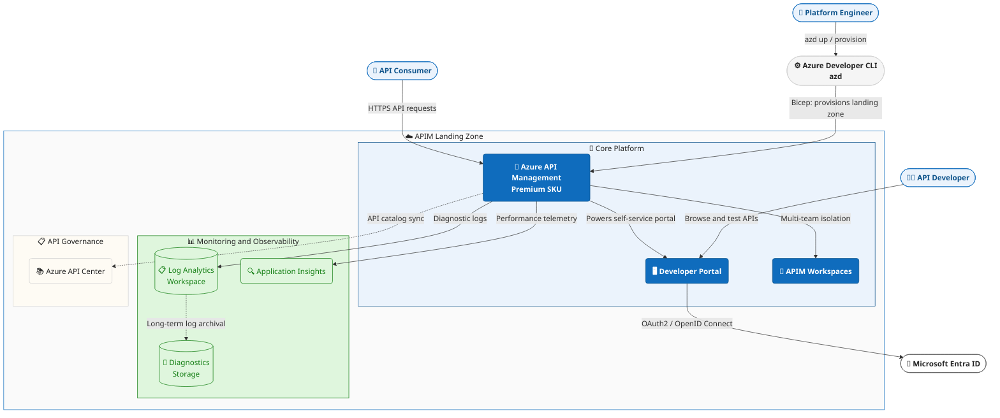

# APIM Accelerator

[](LICENSE)
[](https://azure.microsoft.com/products/api-management)
[](https://learn.microsoft.com/azure/azure-resource-manager/bicep/)
[](https://learn.microsoft.com/azure/developer/azure-developer-cli/)

The **APIM Accelerator** is an infrastructure-as-code solution that provisions a complete Azure API Management landing zone on Azure. It delivers an enterprise-grade API gateway, developer portal, API governance catalog, and an integrated monitoring stack—all configurable through a single `settings.yaml` file and deployable with one command.

Organizations managing multiple API teams often struggle to establish consistent governance, observability, and multi-tenant isolation across their API platforms. The APIM Accelerator addresses this by providing a production-ready landing zone that enforces organizational standards from day one, reducing the time to a governed API platform from weeks to minutes.

The solution is built entirely with **Azure Bicep** for infrastructure templating and **Azure Developer CLI (azd)** for lifecycle automation. It leverages native Azure services including Azure API Management (Premium SKU), Azure API Center, Azure Log Analytics, Application Insights, and Microsoft Entra ID for secure developer portal authentication.

## Table of Contents

- [Features](#features)
- [Architecture](#architecture)
- [Technologies Used](#technologies-used)
- [Quick Start](#quick-start)
- [Configuration](#configuration)
- [Deployment](#deployment)
- [Usage](#usage)
- [Contributing](#contributing)
- [License](#license)

## Features

- 🚀 **One-command deployment** via `azd up` that provisions all Azure resources end-to-end.
- 🏗️ **Multi-environment support** for `dev`, `test`, `staging`, `prod`, and `uat` environments.
- 🔐 **Enterprise security** with system-assigned managed identity and optional private network integration.
- 📂 **Multi-team isolation** through APIM Workspaces, enabling independent API lifecycle management per team.
- 🖥️ **Self-service developer portal** with Microsoft Entra ID OAuth2 / OpenID Connect authentication.
- 📚 **API governance and discovery** via Azure API Center with automatic API catalog synchronization from APIM.
- 📊 **Integrated observability** including Log Analytics workspace, Application Insights, and diagnostic log archival to Azure Storage.
- ♻️ **Idempotent provisioning** with a pre-provision hook that purges soft-deleted APIM instances to enable clean redeployments.
- 📐 **Modular Bicep architecture** with reusable type definitions (`common-types.bicep`), shared constants, and layered orchestration modules.
- 🏷️ **Built-in resource tagging** for cost tracking, compliance, and organizational governance alignment.

## Architecture

The APIM Accelerator deploys a layered landing zone. A **Platform Engineer** uses the Azure Developer CLI to trigger Bicep-based provisioning of all resources. **API Developers** access a self-service developer portal authenticated via Microsoft Entra ID. **API Consumers** call APIs through the gateway. All platform telemetry flows to the integrated monitoring stack, with long-term log archival and automatic API catalog synchronization to Azure API Center.


```mermaid
---
config:
  primaryColor: "#0f6cbd"
  primaryTextColor: "#FFFFFF"
  primaryBorderColor: "#0f548c"
  secondaryColor: "#ebf3fc"
  secondaryTextColor: "#242424"
  secondaryBorderColor: "#0f6cbd"
  tertiaryColor: "#f5f5f5"
  tertiaryTextColor: "#424242"
  tertiaryBorderColor: "#d1d1d1"
  noteBkgColor: "#fefbf4"
  noteTextColor: "#242424"
  noteBorderColor: "#f9e2ae"
  lineColor: "#616161"
  background: "#FFFFFF"
  edgeLabelBackground: "#FFFFFF"
  clusterBkg: "#fafafa"
  clusterBorder: "#e0e0e0"
  titleColor: "#242424"
  errorBkgColor: "#fdf3f4"
  errorTextColor: "#b10e1c"
  fontFamily: "Segoe UI, Verdana, sans-serif"
  fontSize: 16
  align: center
  description: "High-level architecture diagram showing actors, primary flows, and major components."
---
flowchart TB

%% ============================================================
%% EXTERNAL ACTORS AND SYSTEMS
%% ============================================================
PlatformEng(["👷 Platform Engineer"])
APIDev(["👨‍💻 API Developer"])
APIConsumer(["📱 API Consumer"])
AzdTool(["⚙️ Azure Developer CLI<br/>azd"])
AzureAD(["🔑 Microsoft Entra ID"])

%% ============================================================
%% APIM LANDING ZONE
%% ============================================================
subgraph LANDING_ZONE["☁️ APIM Landing Zone"]

    %% Core Platform
    subgraph CORE_PLATFORM["🔧 Core Platform"]
        APIM("🚪 Azure API Management<br/>Premium SKU")
        DevPortal("🖥️ Developer Portal")
        Workspaces("📂 APIM Workspaces")
    end

    %% Monitoring and Observability
    subgraph MONITORING_ZONE["📊 Monitoring and Observability"]
        LogAnalytics[("📋 Log Analytics<br/>Workspace")]
        AppInsights("🔍 Application Insights")
        StorageAcct[("💾 Diagnostics<br/>Storage")]
    end

    %% API Governance
    subgraph GOVERNANCE_ZONE["📋 API Governance"]
        APICenter("📚 Azure API Center")
    end

end

%% ============================================================
%% INTERACTIONS — DEPLOYMENT FLOW
%% ============================================================
PlatformEng -->|"azd up / provision"| AzdTool
AzdTool -->|"Bicep: provisions landing zone"| APIM

%% ============================================================
%% INTERACTIONS — API ACCESS FLOW
%% ============================================================
APIDev -->|"Browse and test APIs"| DevPortal
DevPortal -->|"OAuth2 / OpenID Connect"| AzureAD
APIConsumer -->|"HTTPS API requests"| APIM

%% ============================================================
%% INTERACTIONS — INTERNAL SERVICE FLOWS
%% ============================================================
APIM -->|"Multi-team isolation"| Workspaces
APIM -->|"Powers self-service portal"| DevPortal
APIM -->|"Diagnostic logs"| LogAnalytics
APIM -->|"Performance telemetry"| AppInsights
LogAnalytics -.->|"Long-term log archival"| StorageAcct
APIM -.->|"API catalog sync"| APICenter

%% ============================================================
%% STYLES — NODE CLASS DEFINITIONS
%% ============================================================
classDef actor fill:#ebf3fc,stroke:#0f6cbd,color:#0f548c,font-weight:bold
classDef tool fill:#f5f5f5,stroke:#d1d1d1,color:#242424,font-weight:bold
classDef apimCore fill:#0f6cbd,stroke:#0f548c,color:#FFFFFF,font-weight:bold
classDef monitoring fill:#dff6dd,stroke:#107c10,color:#107c10
classDef governance fill:#fefbf4,stroke:#d1d1d1,color:#242424
classDef identity fill:#FFFFFF,stroke:#616161,color:#242424,font-weight:bold

%% ============================================================
%% STYLES — NODE CLASS ASSIGNMENTS
%% ============================================================
class PlatformEng,APIDev,APIConsumer actor
class AzdTool tool
class APIM,DevPortal,Workspaces apimCore
class LogAnalytics,AppInsights,StorageAcct monitoring
class APICenter governance
class AzureAD identity

%% ============================================================
%% STYLES — SUBGRAPH CLASS DEFINITIONS
%% ============================================================
classDef landingZoneStyle fill:#fafafa,stroke:#0f6cbd,color:#242424
classDef coreStyle fill:#ebf3fc,stroke:#0f548c,color:#242424
classDef monitoringStyle fill:#dff6dd,stroke:#107c10,color:#242424
classDef governanceStyle fill:#fefbf4,stroke:#d1d1d1,color:#242424

%% ============================================================
%% STYLES — SUBGRAPH CLASS ASSIGNMENTS
%% ============================================================
class LANDING_ZONE landingZoneStyle
class CORE_PLATFORM coreStyle
class MONITORING_ZONE monitoringStyle
class GOVERNANCE_ZONE governanceStyle
```

## Technologies Used

| Technology                    | Type                   | Purpose                                                             |
| ----------------------------- | ---------------------- | ------------------------------------------------------------------- |
| Azure API Management          | Azure Service          | API gateway, policy enforcement, caching, and rate limiting         |
| Azure API Center              | Azure Service          | Centralized API catalog, governance, and automatic discovery        |
| Azure Log Analytics           | Azure Service          | Centralized logging, diagnostic queries, and long-term retention    |
| Azure Application Insights    | Azure Service          | Application performance monitoring (APM) and telemetry              |
| Azure Storage Account         | Azure Service          | Long-term diagnostic log archival and compliance                    |
| Azure Bicep                   | Infrastructure as Code | Declarative, type-safe resource templating across all modules       |
| Azure Developer CLI (azd)     | Deployment Tooling     | Lifecycle automation: provision, configure, deploy, and tear down   |
| Microsoft Entra ID (Azure AD) | Identity and Security  | OAuth2 / OpenID Connect authentication for the developer portal     |
| YAML                          | Configuration          | Environment-specific settings managed through `infra/settings.yaml` |
| Bash / Shell                  | Scripting              | Pre-provision hook for soft-deleted APIM resource cleanup           |

## Quick Start

### Prerequisites

| Prerequisite                                                                                             | Minimum Version | Notes                                                         |
| -------------------------------------------------------------------------------------------------------- | --------------- | ------------------------------------------------------------- |
| [Azure CLI](https://learn.microsoft.com/cli/azure/install-azure-cli)                                     | 2.60            | Required for direct `az` deployments and authentication       |
| [Azure Developer CLI (azd)](https://learn.microsoft.com/azure/developer/azure-developer-cli/install-azd) | 1.9             | Orchestrates end-to-end provisioning via `azd up`             |
| Azure Subscription                                                                                       | —               | Contributor or Owner role required on the target subscription |
| Bash / Git Bash                                                                                          | —               | Required to execute the pre-provision hook script             |

### Installation

1. Clone the repository:

```bash
git clone https://github.com/Evilazaro/APIM-Accelerator.git
cd APIM-Accelerator
```

2. Authenticate with Azure:

```bash
azd auth login
az login
```

3. Open `infra/settings.yaml` and update the required publisher fields:

```yaml
core:
  apiManagement:
    publisherEmail: "your-email@example.com" # Required by Azure APIM
    publisherName: "Your Organization"
```

4. Provision and deploy all Azure resources:

```bash
azd up
```

> [!TIP]
> Run `azd env new <env-name>` before `azd up` to give your environment a descriptive name such as `dev` or `prod`. The environment name is used as a resource naming prefix.

## Configuration

All environment-specific settings are stored in `infra/settings.yaml`. The table below lists the key configuration options.

| Option                                       | Default                | Description                                                                      |
| -------------------------------------------- | ---------------------- | -------------------------------------------------------------------------------- |
| `solutionName`                               | `apim-accelerator`     | Base name applied to all Azure resource naming conventions                       |
| `core.apiManagement.sku.name`                | `Premium`              | APIM pricing tier: `Developer`, `Basic`, `Standard`, `Premium`, or `Consumption` |
| `core.apiManagement.sku.capacity`            | `1`                    | Number of APIM scale units (Premium: 1–10, Standard: 1–4)                        |
| `core.apiManagement.identity.type`           | `SystemAssigned`       | Managed identity type: `SystemAssigned` or `UserAssigned`                        |
| `core.apiManagement.workspaces`              | `[{name: workspace1}]` | List of workspace names for team isolation (Premium SKU only)                    |
| `shared.monitoring.logAnalytics.name`        | `""`                   | Log Analytics workspace name; leave empty for auto-generation                    |
| `shared.monitoring.applicationInsights.name` | `""`                   | Application Insights name; leave empty for auto-generation                       |
| `inventory.apiCenter.name`                   | `""`                   | Azure API Center name; leave empty for auto-generation                           |
| `shared.tags.CostCenter`                     | `CC-1234`              | Cost center tag applied to all provisioned resources                             |
| `shared.tags.RegulatoryCompliance`           | `GDPR`                 | Compliance tag applied to all resources (`GDPR`, `HIPAA`, `PCI`, `None`)         |

### Example: Production override

```yaml
solutionName: "contoso-apis"
core:
  apiManagement:
    publisherEmail: "api-admin@contoso.com"
    publisherName: "Contoso Ltd"
    sku:
      name: "Premium"
      capacity: 2
    workspaces:
      - name: "sales-apis"
      - name: "finance-apis"
```

> [!IMPORTANT]
> The `workspaces` feature and virtual network integration require the `Premium` SKU. Use the `Developer` SKU for non-production environments to reduce costs.

## Deployment

The following steps deploy the APIM Accelerator to a target Azure environment.

1. Ensure all [prerequisites](#prerequisites) are installed and you are authenticated:

```bash
az login
azd auth login
```

2. Create a new environment and set the target Azure region:

```bash
azd env new <env-name>
azd env set AZURE_LOCATION eastus
```

3. Review and update `infra/settings.yaml` with your organization's values (see [Configuration](#configuration)).

4. Run the full end-to-end provisioning and deployment:

```bash
azd up
```

5. To provision infrastructure only:

```bash
azd provision
```

6. To re-provision after configuration changes without interactive prompts:

```bash
azd provision --no-prompt
```

> [!NOTE]
> The pre-provision hook (`infra/azd-hooks/pre-provision.sh`) automatically purges any soft-deleted APIM instances in the target region before provisioning. This prevents naming conflicts on redeployment and makes the process idempotent.

> [!WARNING]
> The Premium SKU incurs significant Azure costs. Use the `Developer` SKU for non-production environments to reduce spend, keeping in mind it carries no SLA.

## Usage

### Deploy directly with the Azure CLI

Use the following command to deploy without `azd`, targeting an Azure subscription:

```bash
az deployment sub create \
  --location eastus \
  --template-file infra/main.bicep \
  --parameters envName=dev location=eastus
```

### List deployed resources

```bash
az resource list \
  --resource-group apim-accelerator-dev-eastus-rg \
  --output table
```

Expected output:

```
Name                                  ResourceType                                       Location
------------------------------------  -------------------------------------------------  ----------
apim-accelerator-xxxxx-apim           Microsoft.ApiManagement/service                    eastus
apim-accelerator-xxxxx-law            Microsoft.OperationalInsights/workspaces           eastus
apim-accelerator-xxxxx-ai             Microsoft.Insights/components                      eastus
apim-accelerator-xxxxx-apic           Microsoft.ApiCenter/services                       eastus
```

### Retrieve the APIM gateway URL

```bash
az apim show \
  --name apim-accelerator-xxxxx-apim \
  --resource-group apim-accelerator-dev-eastus-rg \
  --query "gatewayUrl" \
  --output tsv
```

### Tear down the environment

```bash
azd down
```

> [!CAUTION]
> `azd down` permanently deletes all provisioned Azure resources. Azure API Management enters a 48-hour soft-delete state after deletion. Run the pre-provision hook manually or re-run `azd up` to purge the soft-deleted instance if you redeploy to the same region.

## Contributing

Contributions are welcome. To contribute to this project:

1. Fork the repository and create a feature branch from `main`.
2. Open an [issue](https://github.com/Evilazaro/APIM-Accelerator/issues) describing the bug or enhancement before submitting a pull request.
3. Submit a pull request with a clear description of the change, referencing any related issues.
4. Validate Bicep templates before opening a pull request:

```bash
az bicep lint --file infra/main.bicep
```

> [!NOTE]
> This repository does not currently include a `CONTRIBUTING.md` or `CODE_OF_CONDUCT.md`. Check the [issues](https://github.com/Evilazaro/APIM-Accelerator/issues) page for open contribution opportunities or to request these files be added.

## License

This project is licensed under the **MIT License**. See the [LICENSE](LICENSE) file for full terms.
