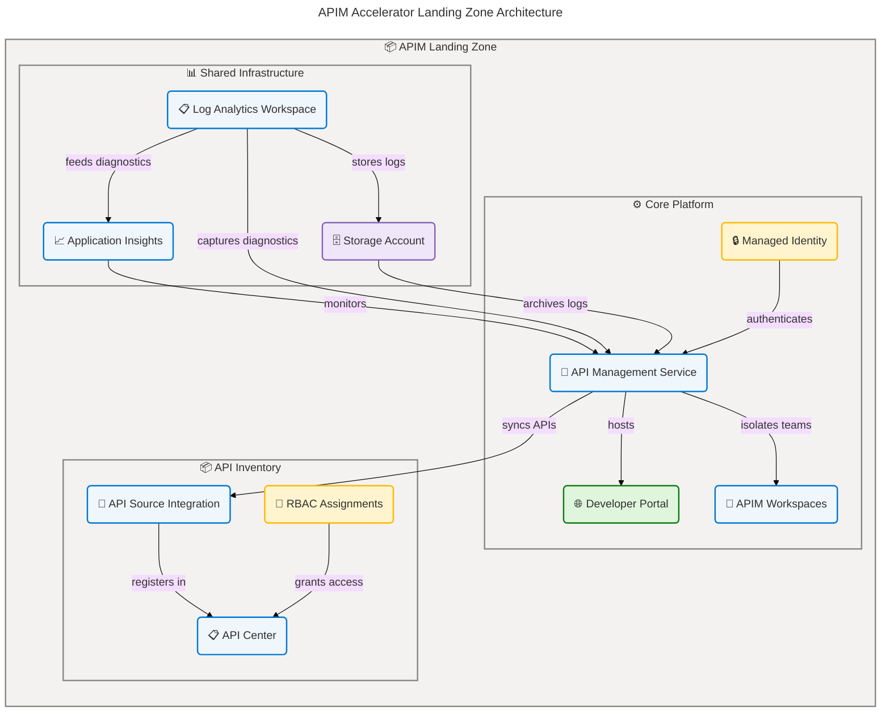

# APIM Accelerator

[](https://azure.microsoft.com/products/api-management)
[](https://learn.microsoft.com/azure/azure-resource-manager/bicep/)
[](LICENSE)
[](https://learn.microsoft.com/azure/developer/azure-developer-cli/)


An enterprise-grade Infrastructure-as-Code (IaC) accelerator that deploys a complete Azure API Management Landing Zone with integrated monitoring, developer portal, workspace-based multi-tenancy, and API governance through Azure API Center.

> [!TIP]
> This accelerator uses Azure Developer CLI (`azd`) for streamlined provisioning. Run `azd up` from the repository root to deploy the entire landing zone in a single command.

## Table of Contents

- [Overview](#overview)
- [Architecture](#architecture)
- [Features](#features)
- [Requirements](#requirements)
- [Getting Started](#getting-started)
- [Configuration](#configuration)
- [Project Structure](#project-structure)
- [Deployment](#deployment)
- [Contributing](#contributing)
- [License](#license)

## Overview

**Overview**

This accelerator provides a production-ready Azure API Management Landing Zone that follows Azure Cloud Adoption Framework best practices. It enables platform engineering teams to deploy a fully configured APIM environment with monitoring, security, and governance capabilities in minutes rather than days.

The solution uses a modular Bicep architecture with three deployment tiers — Shared Infrastructure, Core Platform, and API Inventory — orchestrated through Azure Developer CLI (`azd`) for repeatable, environment-aware deployments across dev, test, staging, and production.

> [!NOTE]
> The project targets Azure API Management **Premium** SKU by default, which supports multi-region deployments, virtual network integration, and workspaces. Modify `infra/settings.yaml` to select a different SKU tier for non-production environments.

## Architecture

**Overview**

The landing zone follows a layered deployment architecture with clear dependency ordering. Shared monitoring infrastructure is provisioned first, followed by core API Management services, and finally API inventory management through Azure API Center.

The orchestration template (`infra/main.bicep`) targets subscription scope, creates a resource group, and deploys each layer as a Bicep module with explicit output chaining for cross-module references.


```mermaid
---
title: "APIM Accelerator Landing Zone Architecture"
config:
  theme: base
  look: classic
  layout: dagre
  flowchart:
    htmlLabels: true
---
flowchart TB
    accTitle: APIM Accelerator Landing Zone Architecture
    accDescr: Shows the three-tier deployment architecture with shared monitoring, core APIM platform, and API inventory layers including component relationships and data flow

    %% ═══════════════════════════════════════════════════════════════════════════
    %% AZURE / FLUENT ARCHITECTURE PATTERN v1.1
    %% (Semantic + Structural + Font + Accessibility Governance)
    %% ═══════════════════════════════════════════════════════════════════════════
    %% PHASE 1 - FLUENT UI: All styling uses approved Fluent UI palette only
    %% PHASE 2 - GROUPS: Every subgraph has semantic color via style directive
    %% PHASE 3 - COMPONENTS: Every node has semantic classDef + icon prefix
    %% PHASE 4 - ACCESSIBILITY: accTitle/accDescr present, WCAG AA contrast
    %% PHASE 5 - STANDARD: Governance block present, classDefs centralized
    %% ═══════════════════════════════════════════════════════════════════════════

    subgraph landingZone["📦 APIM Landing Zone"]
        direction TB

        subgraph sharedLayer["📊 Shared Infrastructure"]
            logAnalytics("📋 Log Analytics Workspace"):::core
            appInsights("📈 Application Insights"):::core
            storageAcct("🗄️ Storage Account"):::data
        end

        subgraph coreLayer["⚙️ Core Platform"]
            apimService("🔌 API Management Service"):::core
            devPortal("🌐 Developer Portal"):::success
            workspaces("📂 APIM Workspaces"):::core
            managedId("🔒 Managed Identity"):::warning
        end

        subgraph inventoryLayer["📦 API Inventory"]
            apiCenter("📋 API Center"):::core
            apiSource("🔗 API Source Integration"):::core
            rbacRoles("🔑 RBAC Assignments"):::warning
        end
    end

    logAnalytics -->|"feeds diagnostics"| appInsights
    logAnalytics -->|"stores logs"| storageAcct
    appInsights -->|"monitors"| apimService
    logAnalytics -->|"captures diagnostics"| apimService
    storageAcct -->|"archives logs"| apimService
    apimService -->|"hosts"| devPortal
    apimService -->|"isolates teams"| workspaces
    managedId -->|"authenticates"| apimService
    apimService -->|"syncs APIs"| apiSource
    apiSource -->|"registers in"| apiCenter
    rbacRoles -->|"grants access"| apiCenter

    style landingZone fill:#F3F2F1,stroke:#8A8886,stroke-width:2px,color:#323130
    style sharedLayer fill:#F3F2F1,stroke:#8A8886,stroke-width:2px,color:#323130
    style coreLayer fill:#F3F2F1,stroke:#8A8886,stroke-width:2px,color:#323130
    style inventoryLayer fill:#F3F2F1,stroke:#8A8886,stroke-width:2px,color:#323130

    classDef core fill:#EFF6FC,stroke:#0078D4,stroke-width:2px,color:#323130
    classDef success fill:#DFF6DD,stroke:#107C10,stroke-width:2px,color:#323130
    classDef warning fill:#FFF4CE,stroke:#FFB900,stroke-width:2px,color:#323130
    classDef data fill:#F0E6FA,stroke:#8764B8,stroke-width:2px,color:#323130
```

**Component Roles:**

| Component                  | Purpose                                                       | Module                                         |
| -------------------------- | ------------------------------------------------------------- | ---------------------------------------------- |
| 📋 Log Analytics Workspace | Centralized log collection and query analysis                 | `src/shared/monitoring/operational/main.bicep` |
| 📈 Application Insights    | Application performance monitoring and distributed tracing    | `src/shared/monitoring/insights/main.bicep`    |
| 🗄️ Storage Account         | Long-term diagnostic log retention and compliance archival    | `src/shared/monitoring/operational/main.bicep` |
| 🔌 API Management Service  | API gateway, policies, rate limiting, and caching             | `src/core/apim.bicep`                          |
| 🌐 Developer Portal        | Self-service API documentation and testing with Azure AD auth | `src/core/developer-portal.bicep`              |
| 📂 APIM Workspaces         | Team-based isolation within a single APIM instance            | `src/core/workspaces.bicep`                    |
| 🔒 Managed Identity        | Credential-free authentication to Azure services              | `src/core/apim.bicep`                          |
| 📋 API Center              | Centralized API catalog, discovery, and governance            | `src/inventory/main.bicep`                     |
| 🔗 API Source Integration  | Automatic API synchronization from APIM to API Center         | `src/inventory/main.bicep`                     |
| 🔑 RBAC Assignments        | Role-based access control for API Center operations           | `src/inventory/main.bicep`                     |

## Features

**Overview**

The accelerator delivers a complete API Management platform with enterprise capabilities out of the box. Each feature is implemented as a composable Bicep module, enabling teams to adopt the full solution or individual components based on their needs.

These features address common platform engineering challenges — from multi-team API isolation to centralized governance — reducing the time to establish an enterprise API platform from weeks to hours.

| Feature                            | Description                                                                                          | Status    |
| ---------------------------------- | ---------------------------------------------------------------------------------------------------- | --------- |
| 🔌 API Management Deployment       | Configurable APIM service with support for Developer, Basic, Standard, Premium, and Consumption SKUs | ✅ Stable |
| 📂 Workspace-Based Multi-Tenancy   | Logical isolation for teams and projects within a single APIM instance using workspaces              | ✅ Stable |
| 🌐 Developer Portal                | Self-service portal with Azure AD authentication, CORS configuration, and OAuth2 integration         | ✅ Stable |
| 📊 Comprehensive Monitoring        | Integrated Log Analytics, Application Insights, and Storage Account for full observability           | ✅ Stable |
| 🔒 Managed Identity Support        | System-assigned and user-assigned managed identity for credential-free Azure service access          | ✅ Stable |
| 📋 API Inventory & Governance      | Azure API Center integration with automatic API discovery and RBAC-based access control              | ✅ Stable |
| 🚀 Azure Developer CLI Integration | One-command deployment with `azd up`, environment-aware configuration, and lifecycle hooks           | ✅ Stable |
| 🌐 Virtual Network Integration     | Optional VNet integration with External and Internal deployment modes for private APIs               | ✅ Stable |
| 🏷️ Enterprise Tagging Strategy     | Comprehensive resource tagging for cost tracking, compliance, and governance                         | ✅ Stable |

## Requirements

**Overview**

Before deploying the APIM Accelerator, ensure your environment meets the following prerequisites. The solution requires an active Azure subscription with sufficient permissions and the Azure Developer CLI for automated provisioning.

All infrastructure is defined in Bicep templates and deployed through `azd`, so no additional IaC tooling is needed beyond Azure CLI and Azure Developer CLI.

| Requirement             | Details                                                                                                             | Required                |
| ----------------------- | ------------------------------------------------------------------------------------------------------------------- | ----------------------- |
| ☁️ Azure Subscription   | Active subscription with Contributor or Owner role at the subscription level                                        | ✅ Yes                  |
| 🛠️ Azure CLI            | Version 2.50.0 or later — [Install Azure CLI](https://learn.microsoft.com/cli/azure/install-azure-cli)              | ✅ Yes                  |
| 🚀 Azure Developer CLI  | Version 1.0.0 or later — [Install azd](https://learn.microsoft.com/azure/developer/azure-developer-cli/install-azd) | ✅ Yes                  |
| 🔑 Azure AD Permissions | App registration permissions for developer portal authentication (client ID and secret)                             | ⚠️ For Developer Portal |
| 🌐 Network Access       | Network connectivity to Azure Resource Manager APIs                                                                 | ✅ Yes                  |
| 📦 Bash Shell           | Required for pre-provision hook script execution                                                                    | ✅ Yes                  |

## Getting Started

**Overview**

Deploy the complete APIM Landing Zone with a single command using Azure Developer CLI. The deployment provisions all three infrastructure tiers — shared monitoring, core platform, and API inventory — in the correct dependency order.

Clone the repository and use `azd up` to provision the entire solution. The deployment reads configuration from `infra/settings.yaml` and creates all resources in a new resource group following the naming convention `{solutionName}-{envName}-{location}-rg`.

**Quick Start**

1. Clone the repository:

```bash
git clone https://github.com/Evilazaro/APIM-Accelerator.git
cd APIM-Accelerator
```

2. Authenticate with Azure:

```bash
azd auth login
```

3. Initialize and deploy the landing zone:

```bash
azd up
```

> [!WARNING]
> The pre-provision hook script (`infra/azd-hooks/pre-provision.sh`) automatically purges any soft-deleted APIM instances in the target region to prevent naming conflicts. Ensure no soft-deleted instances need to be recovered before running the deployment.

**Expected Output**

When deployment completes, `azd` outputs the following key resource identifiers:

```text
APPLICATION_INSIGHTS_RESOURCE_ID = /subscriptions/.../components/...
APPLICATION_INSIGHTS_NAME = apim-accelerator-...-appinsights
AZURE_STORAGE_ACCOUNT_ID = /subscriptions/.../storageAccounts/...
```

## Configuration

**Overview**

All deployment settings are centralized in `infra/settings.yaml`, which defines the solution name, monitoring configuration, APIM service parameters, and API inventory settings. This single configuration file drives the entire landing zone deployment.

The configuration uses YAML format with nested sections for each deployment tier. Resource names can be explicitly set or left empty for automatic generation using a deterministic unique suffix derived from the subscription, resource group, and solution name.

**Configuration File:** `infra/settings.yaml`

```yaml
# Solution identifier used for naming conventions
solutionName: "apim-accelerator"

# Core APIM configuration
core:
  apiManagement:
    name: "" # Leave empty for auto-generated name
    publisherEmail: "admin@contoso.com" # Publisher contact email
    publisherName: "Contoso" # Organization name
    sku:
      name: "Premium" # SKU: Developer, Basic, Standard, Premium, Consumption
      capacity: 1 # Scale units (Premium: 1-10)
    identity:
      type: "SystemAssigned" # SystemAssigned or UserAssigned
      userAssignedIdentities: []
    workspaces:
      - name: "workspace1" # Workspace names (Premium SKU only)
```

**Key Configuration Options:**

| Option             | Path                                         | Description                     | Default               |
| ------------------ | -------------------------------------------- | ------------------------------- | --------------------- |
| ⚙️ Solution Name   | `solutionName`                               | Base name for all resources     | `apim-accelerator`    |
| 📧 Publisher Email | `core.apiManagement.publisherEmail`          | Required APIM publisher contact | `evilazaro@gmail.com` |
| 📦 SKU Tier        | `core.apiManagement.sku.name`                | APIM pricing tier               | `Premium`             |
| 🔢 Scale Units     | `core.apiManagement.sku.capacity`            | Number of APIM scale units      | `1`                   |
| 🔒 Identity Type   | `core.apiManagement.identity.type`           | Managed identity configuration  | `SystemAssigned`      |
| 📂 Workspaces      | `core.apiManagement.workspaces`              | Team isolation workspaces       | `[workspace1]`        |
| 📊 Log Analytics   | `shared.monitoring.logAnalytics.name`        | Workspace name (empty for auto) | `""`                  |
| 📈 App Insights    | `shared.monitoring.applicationInsights.name` | Instance name (empty for auto)  | `""`                  |

**Environment Parameters:** `infra/main.parameters.json`

The deployment accepts two environment parameters passed via `azd`:

| Parameter     | Source           | Description                                                  |
| ------------- | ---------------- | ------------------------------------------------------------ |
| ⚙️ `envName`  | `AZURE_ENV_NAME` | Environment name: `dev`, `test`, `staging`, `prod`, or `uat` |
| 🌐 `location` | `AZURE_LOCATION` | Azure region for deployment                                  |

## Project Structure

```text
├── azure.yaml                    # Azure Developer CLI configuration
├── LICENSE                       # MIT License
├── infra/
│   ├── main.bicep                # Landing zone orchestration (subscription scope)
│   ├── main.parameters.json      # Environment parameter mapping
│   ├── settings.yaml             # Centralized deployment configuration
│   └── azd-hooks/
│       └── pre-provision.sh      # Soft-deleted APIM cleanup script
└── src/
    ├── core/
    │   ├── main.bicep            # Core platform orchestrator
    │   ├── apim.bicep            # APIM service deployment
    │   ├── workspaces.bicep      # Workspace creation
    │   └── developer-portal.bicep # Developer portal with Azure AD
    ├── inventory/
    │   └── main.bicep            # API Center and governance
    └── shared/
        ├── main.bicep            # Shared infrastructure orchestrator
        ├── common-types.bicep    # Type definitions
        ├── constants.bicep       # Utility functions and constants
        ├── monitoring/
        │   ├── main.bicep        # Monitoring orchestrator
        │   ├── insights/
        │   │   └── main.bicep    # Application Insights
        │   └── operational/
        │       └── main.bicep    # Log Analytics and Storage
        └── networking/
            └── main.bicep        # VNet placeholder
```

## Deployment

**Overview**

The deployment uses Azure Developer CLI (`azd`) to orchestrate a subscription-scoped Bicep deployment. Resources are provisioned in three sequential phases with explicit dependency chaining to ensure correct ordering.

**Deployment Sequence:**

1. **Resource Group** — Creates `{solutionName}-{envName}-{location}-rg`
2. **Shared Infrastructure** — Log Analytics, Application Insights, Storage Account
3. **Core Platform** — APIM service, developer portal, workspaces, managed identity
4. **API Inventory** — API Center, API source integration, RBAC assignments

**Deploy to a specific environment:**

```bash
azd env new dev
azd env set AZURE_LOCATION eastus
azd up
```

**Provision infrastructure only (without app deployment):**

```bash
azd provision
```

**Deploy using Azure CLI directly:**

```bash
az deployment sub create \
  --location eastus \
  --template-file infra/main.bicep \
  --parameters envName=dev location=eastus
```

**SKU Recommendations:**

| SKU                      | Use Case                 | SLA       | Multi-Region | VNet |
| ------------------------ | ------------------------ | --------- | ------------ | ---- |
| 🧪 Developer             | Non-production, testing  | ❌ No SLA | ❌           | ❌   |
| 📦 Basic / BasicV2       | Small-scale production   | ✅ 99.95% | ❌           | ❌   |
| ⚙️ Standard / StandardV2 | Medium-scale production  | ✅ 99.95% | ❌           | ❌   |
| 🏢 Premium               | Enterprise production    | ✅ 99.99% | ✅           | ✅   |
| ⚡ Consumption           | Serverless, pay-per-call | ✅ 99.95% | ❌           | ❌   |

> [!TIP]
> Use `Developer` SKU for local development and testing. Workspace support requires **Premium** SKU. Switch SKU tiers by updating `core.apiManagement.sku.name` in `infra/settings.yaml`.

## Contributing

**Overview**

Contributions to the APIM Accelerator are welcome. All infrastructure changes should be made through Bicep templates in the `src/` directory, with shared type definitions in `src/shared/common-types.bicep` and constants in `src/shared/constants.bicep`.

Follow the existing modular architecture pattern when adding new components: create a dedicated Bicep module, define types in `common-types.bicep`, and wire the module into the orchestration template at `infra/main.bicep`.

1. Fork the repository
2. Create a feature branch: `git checkout -b feature/my-feature`
3. Make changes following the existing Bicep module patterns
4. Test deployment with `azd up` in a development environment
5. Submit a pull request

## License

This project is licensed under the MIT License. See [LICENSE](LICENSE) for details.

Copyright (c) 2025 Evilázaro Alves
