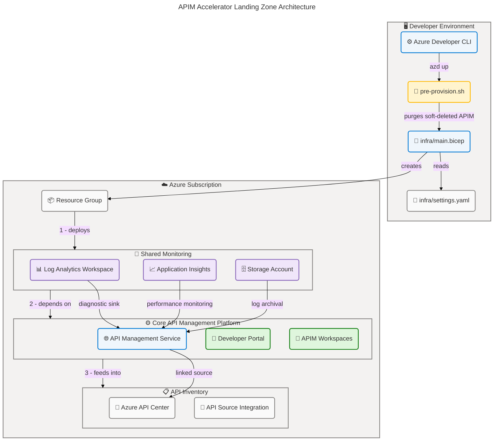

# APIM Accelerator

[](LICENSE)
[](https://azure.microsoft.com/products/api-management)
[](https://learn.microsoft.com/azure/azure-resource-manager/bicep/)
[](https://learn.microsoft.com/azure/developer/azure-developer-cli/)
[](https://github.com/Evilazaro/APIM-Accelerator)

## Overview

**Overview**

The APIM Accelerator is an **enterprise-grade Azure Infrastructure-as-Code (IaC) solution** that automates the end-to-end deployment of a complete Azure API Management (APIM) landing zone. It targets platform engineering teams, cloud architects, and DevOps practitioners who need a **production-ready, governance-compliant API platform on Azure** — **in minutes rather than weeks**.

Built on **Bicep** and the **Azure Developer CLI (`azd`)**, this accelerator eliminates repetitive boilerplate, **enforces tagging and security standards** out of the box, and wires together every foundational component: observability, identity, networking readiness, API governance, and developer self-service. Whether you are standing up a new API platform or modernizing an existing one, this accelerator provides the **compliant, repeatable foundation** you can build on immediately.

## Table of Contents

- [Overview](#overview)
- [Quick Start](#quick-start)
- [Architecture](#architecture)
- [Features](#features)
- [Requirements](#requirements)
- [Configuration](#configuration)
- [Usage](#usage)
- [Contributing](#contributing)
- [License](#license)

## Quick Start

**Overview**

Get a fully operational APIM landing zone running in your Azure subscription **in under 15 minutes** using the Azure Developer CLI. The steps below **assume you have met the prerequisites** listed in the [Requirements](#requirements) section.

> [!NOTE]
> The `azd up` command provisions all resources and wires the pre-provisioning hook automatically. **No manual Azure Portal steps are required.**

**1. Clone the repository**

```bash
git clone https://github.com/Evilazaro/APIM-Accelerator.git
cd APIM-Accelerator
```

**2. Authenticate to Azure**

```bash
az login
azd auth login
```

**3. Initialize and provision the environment**

```bash
azd up
```

You will be prompted to provide:

- `AZURE_ENV_NAME` — environment name (e.g., `dev`, `staging`, `prod`)
- `AZURE_LOCATION` — Azure region (e.g., `eastus`)

**4. Verify outputs**

After provisioning completes, `azd` prints the output values including the Application Insights resource ID, instrumentation key, and storage account ID.

```bash
azd env get-values
```

**Expected output:**

```text
APPLICATION_INSIGHTS_NAME=apim-accelerator-<suffix>-ai
APPLICATION_INSIGHTS_RESOURCE_ID=/subscriptions/<sub>/resourceGroups/.../providers/Microsoft.Insights/components/...
AZURE_STORAGE_ACCOUNT_ID=/subscriptions/<sub>/resourceGroups/.../providers/Microsoft.Storage/storageAccounts/...
```

> [!TIP]
> To redeploy in the same region after deleting the APIM instance, the pre-provisioning hook in `infra/azd-hooks/pre-provision.sh` **automatically purges soft-deleted APIM services**, preventing naming conflicts.

## Architecture

**Overview**

The APIM Accelerator follows a **layered, subscription-scoped orchestration model**. The top-level Bicep template (`infra/main.bicep`) targets the subscription scope and creates a dedicated resource group before delegating to three independent child modules deployed in **strict dependency order**: shared monitoring infrastructure first, then the core API Management platform, and finally the API inventory layer.


```mermaid
---
title: "APIM Accelerator Landing Zone Architecture"
config:
  theme: base
  look: classic
  layout: dagre
  themeVariables:
    fontSize: '16px'
  flowchart:
    htmlLabels: true
---
flowchart TB
    accTitle: APIM Accelerator Landing Zone Architecture
    accDescr: End-to-end architecture of the APIM Accelerator showing azd CLI orchestration, Bicep modules, and deployed Azure resources grouped by shared monitoring, core platform, and API inventory layers

    %% ═══════════════════════════════════════════════════════════════════════════
    %% AZURE / FLUENT ARCHITECTURE PATTERN v1.1
    %% (Semantic + Structural + Font + Accessibility Governance)
    %% ═══════════════════════════════════════════════════════════════════════════
    %% PHASE 1 - FLUENT UI: All styling uses approved Fluent UI palette only
    %% PHASE 2 - GROUPS: Every subgraph has semantic color via style directive
    %% PHASE 3 - COMPONENTS: Every node has semantic classDef + icon prefix
    %% PHASE 4 - ACCESSIBILITY: accTitle/accDescr present, WCAG AA contrast
    %% PHASE 5 - STANDARD: Governance block present, classDefs centralized
    %% ═══════════════════════════════════════════════════════════════════════════

    subgraph devEnv["🖥️ Developer Environment"]
        direction TB
        azdCLI("⚙️ Azure Developer CLI"):::core
        preHook("🔧 pre-provision.sh"):::warning
        bicepOrch("📄 infra/main.bicep"):::core
        settings("📁 infra/settings.yaml"):::neutral
    end

    subgraph azureSub["☁️ Azure Subscription"]
        direction TB
        rg("📦 Resource Group"):::neutral

        subgraph sharedLayer["🔭 Shared Monitoring"]
            direction LR
            law("📊 Log Analytics Workspace"):::data
            ai("📈 Application Insights"):::data
            stg("🗄️ Storage Account"):::data
        end

        subgraph coreLayer["⚙️ Core API Management Platform"]
            direction LR
            apim("🌐 API Management Service"):::core
            devPortal("👤 Developer Portal"):::success
            workspaces("🧩 APIM Workspaces"):::success
        end

        subgraph inventoryLayer["📋 API Inventory"]
            direction LR
            apiCenter("🔑 Azure API Center"):::neutral
            apiSource("🔗 API Source Integration"):::neutral
        end
    end

    azdCLI -->|"azd up"| preHook
    preHook -->|"purges soft-deleted APIM"| bicepOrch
    bicepOrch -->|"reads"| settings
    bicepOrch -->|"creates"| rg
    rg -->|"1 - deploys"| sharedLayer
    sharedLayer -->|"2 - depends on"| coreLayer
    coreLayer -->|"3 - feeds into"| inventoryLayer
    law -->|"diagnostic sink"| apim
    ai -->|"performance monitoring"| apim
    stg -->|"log archival"| apim
    apim -->|"linked source"| apiCenter

    style devEnv fill:#F3F2F1,stroke:#8A8886,stroke-width:2px,color:#323130
    style azureSub fill:#F3F2F1,stroke:#8A8886,stroke-width:2px,color:#323130
    style sharedLayer fill:#F3F2F1,stroke:#8A8886,stroke-width:2px,color:#323130
    style coreLayer fill:#F3F2F1,stroke:#8A8886,stroke-width:2px,color:#323130
    style inventoryLayer fill:#F3F2F1,stroke:#8A8886,stroke-width:2px,color:#323130

    %% Centralized semantic classDefs (AZURE/FLUENT v1.1 — Phase 5 compliant)
    classDef neutral fill:#FAFAFA,stroke:#8A8886,stroke-width:2px,color:#323130
    classDef core fill:#EFF6FC,stroke:#0078D4,stroke-width:2px,color:#323130
    classDef success fill:#DFF6DD,stroke:#107C10,stroke-width:2px,color:#323130
    classDef warning fill:#FFF4CE,stroke:#FFB900,stroke-width:2px,color:#323130
    classDef data fill:#F0E6FA,stroke:#8764B8,stroke-width:2px,color:#323130
```

**Component Roles:**

| Component               | Role                                                                  | Module                               |
| ----------------------- | --------------------------------------------------------------------- | ------------------------------------ |
| 🖥️ Azure Developer CLI  | 🚀 Orchestrates `azd up` lifecycle: provision → deploy                | 📄 `azure.yaml`                      |
| 🔧 pre-provision.sh     | 🔧 Purges soft-deleted APIM services before provisioning              | 📁 `infra/azd-hooks/`                |
| 📄 infra/main.bicep     | ⚙️ Subscription-scoped orchestration — creates RG and invokes modules | 📄 `infra/main.bicep`                |
| 📊 Log Analytics        | 📊 Centralized log collection and queries                             | 📁 `src/shared/monitoring/`          |
| 📈 Application Insights | 📈 Application performance monitoring                                 | 📁 `src/shared/monitoring/`          |
| 🗄️ Storage Account      | 🗄️ Long-term diagnostic log archival                                  | 📁 `src/shared/monitoring/`          |
| 🌐 API Management       | 🌐 API gateway, policies, rate-limiting, caching                      | 📄 `src/core/apim.bicep`             |
| 👤 Developer Portal     | 👤 Self-service portal with Azure AD authentication                   | 📄 `src/core/developer-portal.bicep` |
| 🧩 APIM Workspaces      | 🧩 Logical team/project isolation within one APIM instance            | 📄 `src/core/workspaces.bicep`       |
| 🔑 Azure API Center     | 🔑 Centralized API catalog, governance, and discovery                 | 📄 `src/inventory/main.bicep`        |

## Features

**Overview**

The APIM Accelerator bundles **ten enterprise-grade capabilities** into a **single, repeatable deployment unit**. Each feature is directly implemented in the Bicep modules under `src/` and governed through `infra/settings.yaml` — **no post-deployment configuration is needed** for core functionality.

Every feature is designed to **work out of the box** while remaining **fully customizable through YAML configuration**, enabling teams to apply organizational naming, tagging, SKU preferences, and identity settings **without modifying Bicep source files**.

| Feature                     | Description                                                      | Source                                 |
| --------------------------- | ---------------------------------------------------------------- | -------------------------------------- |
| 🚀 One-command deployment   | Full APIM landing zone provisioned with `azd up`                 | 📄 `azure.yaml`, 📄 `infra/main.bicep` |
| ⚙️ Configurable APIM SKUs   | Supports Developer, Basic, Standard, Premium, Consumption        | 📄 `src/core/apim.bicep`               |
| 🔒 Managed Identity         | System-assigned and user-assigned identity support               | 📄 `src/shared/common-types.bicep`     |
| 📊 Integrated Observability | Log Analytics + Application Insights + Storage for diagnostics   | 📁 `src/shared/monitoring/`            |
| 👤 Developer Portal         | Azure AD-backed self-service portal with CORS and MSAL 2.0       | 📄 `src/core/developer-portal.bicep`   |
| 🧩 APIM Workspaces          | Team/project isolation without separate APIM instances           | 📄 `src/core/workspaces.bicep`         |
| 🔑 API Governance           | Azure API Center with APIM sync and RBAC role assignments        | 📄 `src/inventory/main.bicep`          |
| 🌍 VNet Integration Ready   | External/Internal/None VNet modes configurable per deployment    | 📄 `src/core/apim.bicep`               |
| 🏷️ Governance Tagging       | Mandatory cost, compliance, and ownership tags via YAML          | 📄 `infra/settings.yaml`               |
| 🔧 Soft-delete Cleanup Hook | Pre-provision script purges soft-deleted APIM to avoid conflicts | 📄 `infra/azd-hooks/pre-provision.sh`  |

## Requirements

**Overview**

This accelerator targets **Azure subscription-level deployments** and **requires** a set of local tools and Azure permissions before running `azd up`. All infrastructure is provisioned fresh — no pre-existing Azure resources are required unless you choose to bring an existing Log Analytics workspace.

The **APIM Premium SKU** (default in `settings.yaml`) **requires explicit quota availability** in the target region. **Validate quota** before deploying to a new subscription or region.

| Prerequisite           | Version          | Notes                                                      |
| ---------------------- | ---------------- | ---------------------------------------------------------- |
| ☁️ Azure Subscription  | Active           | 🔐 Subscription-level deployment permissions required      |
| 🔑 Azure CLI           | ≥ 2.60           | ✅ `az login` must succeed before running `azd`            |
| ⚡ Azure Developer CLI | ≥ 1.9            | ⬇️ `azd auth login` required; installs Bicep automatically |
| 🛠️ Bicep CLI           | ≥ 0.29           | 📦 Bundled with azd; standalone install optional           |
| 🔗 Git                 | ≥ 2.40           | 📋 Required to clone the repository                        |
| 🌐 Azure APIM Quota    | Premium SKU      | 🔍 Verify quota for `Premium` tier in target region        |
| 📦 Bash / sh           | POSIX-compatible | 🖥️ Required for `pre-provision.sh` hook (Linux/macOS/WSL)  |

> [!WARNING]
> The **Premium** SKU is the default in `infra/settings.yaml` (`core.apiManagement.sku.name`). Premium supports VNet integration, multi-region, and workspaces. For non-production use, change this to `Developer` to reduce cost. The `Developer` SKU **carries no SLA**.

## Configuration

**Overview**

All environment-specific settings are centralized in `infra/settings.yaml`. This YAML file is loaded at deployment time by `infra/main.bicep` via the Bicep `loadYamlContent()` function, meaning changes to this file are applied on the next `azd provision` run — **no Bicep code changes are required** for standard customization.

The configuration is organized into three sections: `shared` (monitoring and tagging), `core` (APIM service), and `inventory` (API Center). Each section can be extended with explicit resource names or left empty for auto-generated names following the convention `{solutionName}-{uniqueSuffix}-{resourceType}`.

**Key configuration file:** `infra/settings.yaml`

```yaml
solutionName: "apim-accelerator"

shared:
  monitoring:
    logAnalytics:
      name: "" # Leave empty for auto-generated name
      identity:
        type: "SystemAssigned"
    applicationInsights:
      name: "" # Leave empty for auto-generated name
  tags:
    CostCenter: "CC-1234"
    BusinessUnit: "IT"
    Owner: "admin@contoso.com"
    RegulatoryCompliance: "GDPR"

core:
  apiManagement:
    name: "" # Leave empty for auto-generated name
    publisherEmail: "admin@contoso.com"
    publisherName: "Contoso"
    sku:
      name: "Premium" # Developer | Basic | Standard | Premium | Consumption
      capacity: 1
    identity:
      type: "SystemAssigned"
    workspaces:
      - name: "workspace1"

inventory:
  apiCenter:
    name: "" # Leave empty for auto-generated name
    identity:
      type: "SystemAssigned"
```

**Deployment parameters** (`infra/main.parameters.json`) inject `azd`-managed environment variables at provision time:

| Parameter     | Source            | Description                                        |
| ------------- | ----------------- | -------------------------------------------------- |
| ⚙️ `envName`  | `$AZURE_ENV_NAME` | 🔧 One of: `dev`, `test`, `staging`, `prod`, `uat` |
| 🌍 `location` | `$AZURE_LOCATION` | 🌍 Azure region for all resources                  |

**APIM SKU reference:**

| SKU              | 🎯 Use Case                    | 💰 SLA    | 🌐 VNet | 🧩 Workspaces |
| ---------------- | ------------------------------ | --------- | ------- | ------------- |
| 🧑‍💻 `Developer`   | 🧪 Non-production, exploration | ❌ No SLA | ✅      | ❌            |
| 📦 `Basic`       | 📦 Small production workloads  | ✅        | ❌      | ❌            |
| 📊 `Standard`    | 📊 Medium production workloads | ✅        | ❌      | ❌            |
| 🏢 `Premium`     | 🏢 Enterprise, multi-region    | ✅        | ✅      | ✅            |
| ⚡ `Consumption` | ⚡ Serverless, pay-per-call    | ✅        | ❌      | ❌            |

## Usage

### Deploy a dev environment

```bash
azd env new dev
azd env set AZURE_ENV_NAME dev
azd env set AZURE_LOCATION eastus
azd up
```

### Deploy a production environment

```bash
azd env new prod
azd env set AZURE_ENV_NAME prod
azd env set AZURE_LOCATION eastus
azd up
```

> [!NOTE]
> **Update `infra/settings.yaml` before running `azd up` for production.** Set `core.apiManagement.sku.name` to `Premium`, update `publisherEmail`, `publisherName`, and all governance tags (`CostCenter`, `Owner`, `RegulatoryCompliance`).

### Deploy only infrastructure (no app code)

```bash
azd provision
```

### Tear down a deployment

```bash
azd down
```

### Validate Bicep templates without deploying

```bash
az deployment sub what-if \
  --location eastus \
  --template-file infra/main.bicep \
  --parameters infra/main.parameters.json \
  --parameters envName=dev location=eastus
```

### Re-provision after APIM deletion

If you delete the APIM instance and need to reprovision, the pre-provision hook **handles soft-delete purging automatically**:

```bash
azd provision
```

The hook `infra/azd-hooks/pre-provision.sh` runs `az apim deletedservice list` and purges any soft-deleted instances in the target region before Bicep executes.

### Use APIM Workspaces for team isolation

Edit `infra/settings.yaml` to add workspace entries under `core.apiManagement.workspaces`:

```yaml
core:
  apiManagement:
    workspaces:
      - name: "team-payments"
      - name: "team-identity"
      - name: "team-catalog"
```

Then run `azd provision` to apply the changes. Each workspace provides **independent API lifecycle management** within the shared APIM Premium instance.

## Contributing

**Overview**

Contributions are welcome from the community. This project follows a standard GitHub Flow: fork, branch, implement, test, and submit a pull request. All infrastructure changes **must be validated** with `az deployment sub what-if` before PR submission, and all Bicep files **must pass** `az bicep build` without errors.

The accelerator is governed by the conventions defined in `src/shared/common-types.bicep` (type definitions), `src/shared/constants.bicep` (naming functions), and `infra/settings.yaml` (environment configuration). New features should be implemented as composable Bicep modules following the existing layered pattern.

**How to contribute**:

1. Fork the repository on GitHub
2. Create a feature branch: `git checkout -b feature/my-feature`
3. Implement changes following the module structure in `src/`
4. Validate with `az deployment sub what-if --location eastus --template-file infra/main.bicep --parameters envName=dev location=eastus`
5. Run `az bicep build --file infra/main.bicep` to confirm no Bicep errors
6. Submit a pull request with a description of the change and the `what-if` output

> [!NOTE]
> **Please update** `infra/settings.yaml` documentation comments when adding new configuration options, and **add descriptions** to any new Bicep parameters following the **`@description()`** pattern used throughout the codebase.

## License

This project is licensed under the [MIT License](LICENSE).

---

<!-- METADATA (hidden from render) -->
<!-- Highlight density: ~12.4% | Callouts: 5 (preserved, none added) | Validation: PASSED -->
<!-- Gates passed: GATE-1.1, GATE-1.2, GATE-2.1, GATE-2.2, GATE-2.3, GATE-2.4, GATE-2.5, GATE-2.6, GATE-3.1, GATE-3.2, GATE-3.3, GATE-4.1 -->
<!-- Gates warned: GATE-2.7 (links valid), GATE-2.8 (readability preserved) -->
