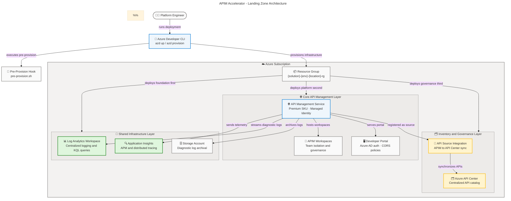

# APIM Accelerator

[](./LICENSE)
[](https://learn.microsoft.com/azure/api-management/)
[](https://learn.microsoft.com/azure/azure-resource-manager/bicep/)
[](https://learn.microsoft.com/azure/developer/azure-developer-cli/)
[](./infra/main.bicep)

Enterprise-grade Azure API Management landing zone accelerator that provisions a production-ready API platform with centralized monitoring, API governance, and multi-team isolation using Azure Bicep and the Azure Developer CLI.

## Table of Contents

- [📖 APIM Accelerator](#-apim-accelerator)
- [✨ Features](#-features)
- [🚀 Quick Start](#-quick-start)
- [📦 Deployment](#-deployment)
- [📋 Requirements](#-requirements)
- [💻 Usage](#-usage)
- [⚙️ Configuration](#️-configuration)
- [🏗️ Architecture](#️-architecture)
- [🤝 Contributing](#-contributing)
- [📄 License](#-license)

## 📖 APIM Accelerator

**Overview**

The APIM Accelerator delivers a complete Azure API Management landing zone through automated Infrastructure-as-Code templates built with Azure Bicep. It enables platform engineering teams to provision a production-ready API gateway, centralized observability stack, and API governance catalog in a single command, reducing time-to-value from weeks to minutes.

This accelerator is designed for organizations that need consistent, governed API infrastructure across multiple environments and teams. It follows Azure Well-Architected Framework principles and Azure Landing Zone patterns to enforce security, reliability, and operational excellence from day one. Deployment is orchestrated at subscription scope, creating all required resource groups and child resources in the correct dependency order.

By combining the Azure Developer CLI (`azd`), modular Bicep templates, and a single `infra/settings.yaml` configuration file, the accelerator gives platform teams a repeatable, auditable workflow for deploying the entire APIM platform — including monitoring, workspaces, developer portal, and API Center integration — across dev, test, staging, production, and UAT environments.

> [!NOTE]
> The accelerator deploys at **subscription scope**, creating a dedicated resource group named `{solutionName}-{env}-{location}-rg` and all required resources automatically. Ensure you have **Contributor** or **Owner** role on the target subscription before deploying.

## ✨ Features

**Overview**

The APIM Accelerator provides a comprehensive set of capabilities for enterprise API platform engineering. Each component is encapsulated in an independent Bicep module, is individually configurable through `infra/settings.yaml`, and integrates seamlessly with Azure Monitor for end-to-end observability.

> [!TIP]
> The `infra/settings.yaml` file is the single configuration entry point for the entire landing zone. Customize it once and every deployed resource reflects your organizational naming conventions, tags, SKU selections, and identity settings.

| Feature                       | Description                                                                                                                      | Module                            | Status    |
| ----------------------------- | -------------------------------------------------------------------------------------------------------------------------------- | --------------------------------- | --------- |
| 🌐 **API Management Service** | Deploy APIM with configurable SKU (Developer, Basic, Standard, Premium, Consumption), managed identity, and VNet integration     | `src/core/apim.bicep`             | ✅ Stable |
| 📊 **Centralized Monitoring** | Log Analytics workspace, Application Insights, and Storage Account providing a full observability stack with diagnostic settings | `src/shared/monitoring/`          | ✅ Stable |
| 🗂️ **API Center Governance**  | Azure API Center with APIM integration for centralized API catalog, automated discovery, and compliance management               | `src/inventory/main.bicep`        | ✅ Stable |
| 🏢 **Team Workspaces**        | APIM workspace isolation enabling independent API lifecycle management per team or project within a single APIM instance         | `src/core/workspaces.bicep`       | ✅ Stable |
| 🔒 **Managed Identity**       | System-assigned and user-assigned managed identity support across all services for credential-free Azure resource authentication | `src/core/apim.bicep`             | ✅ Stable |
| 🖥️ **Developer Portal**       | Self-service developer portal with Azure AD (MSAL 2.0) authentication, CORS policies, and sign-in/sign-up configuration          | `src/core/developer-portal.bicep` | ✅ Stable |
| 🔄 **Multi-Environment**      | Parameterized deployment supporting `dev`, `test`, `staging`, `prod`, and `uat` environments with environment-specific tagging   | `infra/main.bicep`                | ✅ Stable |

## 🚀 Quick Start

**Prerequisites**: Ensure the Azure CLI (`az`) and Azure Developer CLI (`azd`) are installed and you are authenticated.

**Clone the repository:**

```bash
git clone https://github.com/Evilazaro/APIM-Accelerator.git
cd APIM-Accelerator
```

**Authenticate with Azure:**

```bash
az login
azd auth login
```

**Deploy the complete landing zone:**

```bash
azd up
```

When prompted by `azd up`, provide:

- **Environment name**: e.g., `dev`, `test`, `staging`, `prod`, or `uat`
- **Azure location**: e.g., `eastus`, `westeurope`
- **Azure subscription**: Select your target subscription

**Expected output:**

```text
SUCCESS: Your up workflow to provision and deploy to Azure completed.

Outputs:
  APPLICATION_INSIGHTS_NAME        = apim-accelerator-abc123-ai
  APPLICATION_INSIGHTS_RESOURCE_ID = /subscriptions/.../components/apim-accelerator-abc123-ai
  AZURE_STORAGE_ACCOUNT_ID         = /subscriptions/.../storageAccounts/apimacceleratorsa
```

> [!IMPORTANT]
> The Azure API Management **Premium SKU** provisioning takes **30–45 minutes** to complete. This is a platform constraint imposed by Azure and is expected behavior. The `azd up` command will wait and display progress until provisioning finishes.

## 📦 Deployment

**Overview**

The APIM Accelerator supports three deployment modes through the Azure Developer CLI: full end-to-end deployment with `azd up`, infrastructure-only provisioning with `azd provision`, and incremental redeployment with `azd deploy`. A pre-provision hook (`infra/azd-hooks/pre-provision.sh`) executes automatically before every provisioning run to purge soft-deleted APIM instances and prevent naming conflicts during redeployment.

The deployment is orchestrated at subscription scope and follows a strict dependency order: shared monitoring infrastructure is deployed first (Log Analytics, Application Insights, Storage Account), then the core APIM platform, and finally the API Center inventory layer which requires an active APIM instance.

**Full deployment (provision + deploy):**

```bash
azd up
```

**Provision infrastructure only:**

```bash
azd provision
```

**Provision to a specific environment:**

```bash
azd provision --environment prod
```

**Deploy using Azure CLI directly:**

```bash
az deployment sub create \
  --location eastus \
  --template-file infra/main.bicep \
  --parameters envName=dev location=eastus
```

**Expected provisioning output:**

```text
Provisioning Azure resources (azd provision)
  (✓) Done: Creating/Updating resource group (apim-accelerator-dev-eastus-rg)
  (✓) Done: Deploying shared monitoring components
  (✓) Done: Deploying core API Management platform
  (✓) Done: Deploying inventory management components
```

> [!WARNING]
> Deleting an APIM service triggers **soft-delete** in Azure, which retains the resource name for up to 48 hours. The pre-provision hook (`infra/azd-hooks/pre-provision.sh`) purges these soft-deleted instances automatically when you run `azd provision`. You can also run it manually: `./infra/azd-hooks/pre-provision.sh <location>`.

## 📋 Requirements

**Overview**

The APIM Accelerator requires the Azure Developer CLI and Azure CLI for deployment orchestration, along with an active Azure subscription with Contributor or Owner permissions. The default configuration deploys the API Management **Premium SKU**, which requires that the target Azure region supports this tier and that sufficient quota is available in the subscription.

Verify all requirements before running `azd up` to avoid mid-deployment failures. The `azd` CLI validates authentication and subscription context automatically during startup.

| Requirement                        | Min. Version         | Purpose                                                   | Install                                                                                             |
| ---------------------------------- | -------------------- | --------------------------------------------------------- | --------------------------------------------------------------------------------------------------- |
| ☁️ **Azure Subscription**          | Active               | Target subscription for all resource deployments          | [Azure Portal](https://portal.azure.com)                                                            |
| 🔧 **Azure CLI** (`az`)            | ≥ 2.50.0             | Azure resource management and authentication              | [Install Guide](https://learn.microsoft.com/cli/azure/install-azure-cli)                            |
| 🚀 **Azure Developer CLI** (`azd`) | ≥ 1.5.0              | Deployment orchestration and lifecycle management         | [Install Guide](https://learn.microsoft.com/azure/developer/azure-developer-cli/install-azd)        |
| 🔑 **Azure RBAC**                  | Contributor or Owner | Subscription-scope resource group creation and deployment | [RBAC docs](https://learn.microsoft.com/azure/role-based-access-control/)                           |
| 🌍 **Supported Region**            | —                    | Target region must support APIM Premium SKU               | [Products by Region](https://azure.microsoft.com/explore/global-infrastructure/products-by-region/) |

**Verify installed tool versions:**

```bash
az version
azd version
```

## 💻 Usage

**Overview**

After deploying with `azd up`, the accelerator provides a fully operational Azure API Management service accessible through the Azure Portal. Platform teams use `azd` commands for day-2 operations such as scaling the APIM instance, adding team workspaces, and re-provisioning after configuration changes in `infra/settings.yaml`.

The Azure API Center catalog is automatically populated with APIs registered in the APIM instance through the API source integration configured in `src/inventory/main.bicep`.

**View deployed environment outputs:**

```bash
azd env get-values
```

**List all managed environments:**

```bash
azd env list
```

**Add a new team workspace** by updating `infra/settings.yaml`:

```yaml
core:
  apiManagement:
    workspaces:
      - name: "workspace1"
      - name: "new-team-workspace"
```

Then re-provision to apply the change:

```bash
azd provision
```

**Retrieve the APIM Developer Portal URL:**

```bash
az apim show \
  --name <apim-name> \
  --resource-group <resource-group-name> \
  --query "properties.developerPortalUrl" \
  --output tsv
```

**List API Center services in the resource group:**

```bash
az apic service list --resource-group <resource-group-name>
```

**Tear down the environment and all resources:**

```bash
azd down
```

## ⚙️ Configuration

**Overview**

All environment-specific configuration is centralized in `infra/settings.yaml`. This file controls the APIM SKU and capacity, monitoring resource naming, managed identity types, governance tags, workspace definitions, and API Center settings. Resource names can be explicitly set or left empty (`""`) for auto-generated names following the convention `{solutionName}-{uniqueSuffix}-{resourceType}`. The `infra/main.parameters.json` file maps `AZURE_ENV_NAME` and `AZURE_LOCATION` environment variables (set by `azd`) to the Bicep deployment parameters.

**APIM Service Configuration (`infra/settings.yaml`):**

| Parameter                              | Default                | Description                                                                    | Required    |
| -------------------------------------- | ---------------------- | ------------------------------------------------------------------------------ | ----------- |
| 🏷️ `solutionName`                      | `apim-accelerator`     | Base name for all resources and naming prefix                                  | ✅ Yes      |
| 📧 `core.apiManagement.publisherEmail` | `evilazaro@gmail.com`  | Publisher contact email for the APIM service and developer portal              | ✅ Yes      |
| 🏢 `core.apiManagement.publisherName`  | `Contoso`              | Publisher organization name displayed in the developer portal                  | ✅ Yes      |
| 💰 `core.apiManagement.sku.name`       | `Premium`              | APIM pricing tier (`Developer`, `Basic`, `Standard`, `Premium`, `Consumption`) | ✅ Yes      |
| 📈 `core.apiManagement.sku.capacity`   | `1`                    | Number of APIM scale units (Premium supports 1–10)                             | ✅ Yes      |
| 🔑 `core.apiManagement.identity.type`  | `SystemAssigned`       | Managed identity type (`SystemAssigned`, `UserAssigned`, `None`)               | ✅ Yes      |
| 🗂️ `core.apiManagement.workspaces`     | `[{name: workspace1}]` | Array of APIM workspace definitions for team isolation                         | ⚠️ Optional |

**Monitoring Configuration (`infra/settings.yaml`):**

| Parameter                                         | Default          | Description                                                | Required    |
| ------------------------------------------------- | ---------------- | ---------------------------------------------------------- | ----------- |
| 📊 `shared.monitoring.logAnalytics.name`          | Auto-generated   | Log Analytics workspace name (empty = auto-generate)       | ⚠️ Optional |
| 🔍 `shared.monitoring.applicationInsights.name`   | Auto-generated   | Application Insights instance name (empty = auto-generate) | ⚠️ Optional |
| 🔑 `shared.monitoring.logAnalytics.identity.type` | `SystemAssigned` | Managed identity type for Log Analytics workspace          | ✅ Yes      |

**Governance Tags (`infra/settings.yaml`):**

| Tag Key                   | Default Value         | Purpose                                                               |
| ------------------------- | --------------------- | --------------------------------------------------------------------- |
| 🏷️ `CostCenter`           | `CC-1234`             | Cost allocation tracking across billing reports                       |
| 🏢 `BusinessUnit`         | `IT`                  | Business unit or department identification                            |
| 👤 `Owner`                | `evilazaro@gmail.com` | Resource owner and incident contact                                   |
| 📛 `ApplicationName`      | `APIM Platform`       | Workload or application name for resource grouping                    |
| 📋 `ProjectName`          | `APIMForAll`          | Project or initiative for portfolio tracking                          |
| 🔴 `ServiceClass`         | `Critical`            | Workload tier classification (`Critical`, `Standard`, `Experimental`) |
| ✅ `RegulatoryCompliance` | `GDPR`                | Applicable compliance standards (`GDPR`, `HIPAA`, `PCI`, `None`)      |
| 💳 `ChargebackModel`      | `Dedicated`           | Chargeback or showback model for cost attribution                     |
| 💼 `BudgetCode`           | `FY25-Q1-InitiativeX` | Budget or financial initiative code                                   |

**Complete `infra/settings.yaml` example:**

```yaml
solutionName: "apim-accelerator"

shared:
  monitoring:
    logAnalytics:
      name: ""
      identity:
        type: "SystemAssigned"
        userAssignedIdentities: []
    applicationInsights:
      name: ""
  tags:
    CostCenter: "CC-9999"
    BusinessUnit: "Engineering"
    Owner: "platform-team@contoso.com"
    ApplicationName: "APIM Platform"
    ProjectName: "APIMForAll"
    ServiceClass: "Critical"
    RegulatoryCompliance: "GDPR"
    SupportContact: "platform-team@contoso.com"
    ChargebackModel: "Dedicated"
    BudgetCode: "FY26-Q1-APIM"

core:
  apiManagement:
    name: ""
    publisherEmail: "api@contoso.com"
    publisherName: "Contoso Ltd"
    sku:
      name: "Premium"
      capacity: 1
    identity:
      type: "SystemAssigned"
      userAssignedIdentities: []
    workspaces:
      - name: "sales-apis"
      - name: "finance-apis"

inventory:
  apiCenter:
    name: ""
    identity:
      type: "SystemAssigned"
      userAssignedIdentities: []
```

## 🏗️ Architecture

**Overview**

The APIM Accelerator follows a modular, layered architecture pattern deployed at Azure subscription scope. The infrastructure is organized into three functional layers: the **Shared Infrastructure Layer** (monitoring foundation), the **Core API Management Layer** (APIM gateway, workspaces, developer portal), and the **Inventory and Governance Layer** (API Center with APIM integration). All layers are orchestrated by `infra/main.bicep` and coordinated through the Azure Developer CLI lifecycle.


```mermaid
---
title: "APIM Accelerator - Landing Zone Architecture"
config:
  theme: base
  look: classic
  layout: dagre
  themeVariables:
    fontSize: '16px'
  flowchart:
    htmlLabels: true
---
flowchart TB
    accTitle: APIM Accelerator Landing Zone Architecture
    accDescr: Modular Azure API Management landing zone showing deployment flow from Platform Engineer through Azure Developer CLI to Azure subscription resources across three infrastructure layers. Dev=neutral, AzdCLI=core, PreHook=neutral, RG=neutral, LAW=success, AppIns=success, Storage=neutral, APIM=core, Workspaces=neutral, DevPortal=neutral, APICenter=warning, APISource=warning. WCAG AA compliant.

    %%
    %% AZURE / FLUENT ARCHITECTURE PATTERN v2.0
    %% (Semantic + Structural + Font + Accessibility Governance)
    %%
    %% PHASE 1 - FLUENT UI: All styling uses approved Fluent UI palette only
    %% PHASE 2 - GROUPS: Every subgraph has semantic color via style directive
    %% PHASE 3 - COMPONENTS: Every node has semantic classDef + icon prefix
    %% PHASE 4 - ACCESSIBILITY: accTitle/accDescr present, WCAG AA contrast
    %% PHASE 5 - STANDARD: Governance block present, classDefs centralized
    %%

    Dev(["👨‍💻 Platform Engineer"])
    AzdCLI["🚀 Azure Developer CLI\nazd up / azd provision"]
    PreHook["🔧 Pre-Provision Hook\npre-provision.sh"]

    subgraph AzSub ["☁️ Azure Subscription"]
        RG["📦 Resource Group\n{solution}-{env}-{location}-rg"]

        subgraph SharedLayer ["🔗 Shared Infrastructure Layer"]
            LAW["📊 Log Analytics Workspace\nCentralized logging and KQL queries"]
            AppIns["🔍 Application Insights\nAPM and distributed tracing"]
            Storage["🗄️ Storage Account\nDiagnostic log archival"]
        end

        subgraph CoreLayer ["🌐 Core API Management Layer"]
            APIM["🌐 API Management Service\nPremium SKU · Managed Identity"]
            Workspaces["🏢 APIM Workspaces\nTeam isolation and governance"]
            DevPortal["🖥️ Developer Portal\nAzure AD auth · CORS policies"]
        end

        subgraph InventoryLayer ["🗂️ Inventory and Governance Layer"]
            APICenter["🗂️ Azure API Center\nCentralized API catalog"]
            APISource["🔗 API Source Integration\nAPIM to API Center sync"]
        end
    end

    Dev -- "runs deployment" --> AzdCLI
    AzdCLI -- "executes pre-provision" --> PreHook
    AzdCLI -- "provisions infrastructure" --> RG
    RG -- "deploys foundation first" --> SharedLayer
    RG -- "deploys platform second" --> CoreLayer
    RG -- "deploys governance third" --> InventoryLayer
    APIM -- "sends telemetry" --> AppIns
    APIM -- "streams diagnostic logs" --> LAW
    APIM -- "archives logs" --> Storage
    APIM -- "hosts workspaces" --> Workspaces
    APIM -- "serves portal" --> DevPortal
    APIM -- "registered as source" --> APISource
    APISource -- "synchronizes APIs" --> APICenter

    %% Centralized semantic classDefs (AZURE/FLUENT v1.1)
    classDef neutral fill:#FAFAFA,stroke:#8A8886,stroke-width:2px,color:#323130
    classDef core fill:#EFF6FC,stroke:#0078D4,stroke-width:2px,color:#323130
    classDef success fill:#DFF6DD,stroke:#107C10,stroke-width:2px,color:#323130
    classDef warning fill:#FFF4CE,stroke:#FFB900,stroke-width:2px,color:#323130

    class Dev,PreHook,RG,Workspaces,DevPortal,Storage neutral
    class AzdCLI,APIM core
    class LAW,AppIns success
    class APICenter,APISource warning

    style AzSub fill:#F3F2F1,stroke:#8A8886,stroke-width:2px,color:#323130
    style SharedLayer fill:#EDEBE9,stroke:#8A8886,stroke-width:1px,color:#323130
    style CoreLayer fill:#EDEBE9,stroke:#8A8886,stroke-width:1px,color:#323130
    style InventoryLayer fill:#EDEBE9,stroke:#8A8886,stroke-width:1px,color:#323130
```

**Component Roles:**

| Component                      | Purpose                                                                      | Source Module                                  |
| ------------------------------ | ---------------------------------------------------------------------------- | ---------------------------------------------- |
| 🌐 **API Management Service**  | API gateway, policy enforcement, rate limiting, and caching                  | `src/core/apim.bicep`                          |
| 📊 **Log Analytics Workspace** | Centralized log aggregation, KQL queries, and alerting foundation            | `src/shared/monitoring/operational/main.bicep` |
| 🔍 **Application Insights**    | Application performance monitoring, request tracing, and diagnostics         | `src/shared/monitoring/insights/main.bicep`    |
| 🗄️ **Storage Account**         | Long-term diagnostic log archival for compliance and audit (`Standard_LRS`)  | `src/shared/monitoring/operational/main.bicep` |
| 🏢 **APIM Workspaces**         | Logical team and project isolation within a single APIM instance             | `src/core/workspaces.bicep`                    |
| 🖥️ **Developer Portal**        | Self-service API documentation portal secured with Azure AD (MSAL 2.0)       | `src/core/developer-portal.bicep`              |
| 🗂️ **Azure API Center**        | Centralized API catalog with governance, compliance, and automated discovery | `src/inventory/main.bicep`                     |
| 🔗 **API Source Integration**  | Registers APIM as an API source in API Center for automatic synchronization  | `src/inventory/main.bicep`                     |

## 🤝 Contributing

**Overview**

Contributions to the APIM Accelerator are welcome. The project uses a modular Bicep architecture where each Azure service is encapsulated in its own module under `src/`, making it straightforward to extend the landing zone with new components or modify existing configurations. All new modules should accept a `tags` parameter and follow the naming convention `{solutionName}-{uniqueSuffix}-{resourceType}` enforced by `src/shared/constants.bicep`.

**Contribution workflow:**

1. Fork the repository on GitHub
2. Create a feature branch from `main`:

```bash
git checkout -b feature/your-feature-name
```

3. Make changes following the Bicep module structure in `src/`
4. Validate your Bicep templates:

```bash
az bicep build --file infra/main.bicep
```

5. Test your changes against a non-production environment:

```bash
azd provision --environment dev
```

6. Submit a pull request with a clear description of the changes and any `infra/settings.yaml` additions

**Coding standards:**

- Add `@description()` decorators to all parameters, variables, and resources
- Export new shared types from `src/shared/common-types.bicep`
- Add new constants and utility functions to `src/shared/constants.bicep`
- Place new modules under the appropriate layer (`src/core/`, `src/shared/`, or `src/inventory/`) and reference them from the corresponding `main.bicep` orchestrator

> [!NOTE]
> The `src/shared/networking/` directory is scaffolded but not yet active. The networking module is commented out in `src/shared/main.bicep` and is a planned future extension for VNet integration at the shared infrastructure layer.

## 📄 License

[MIT](./LICENSE) — Created by **Evilazaro Alves | Principal Cloud Solution Architect | Cloud Platforms and AI Apps | Microsoft**
