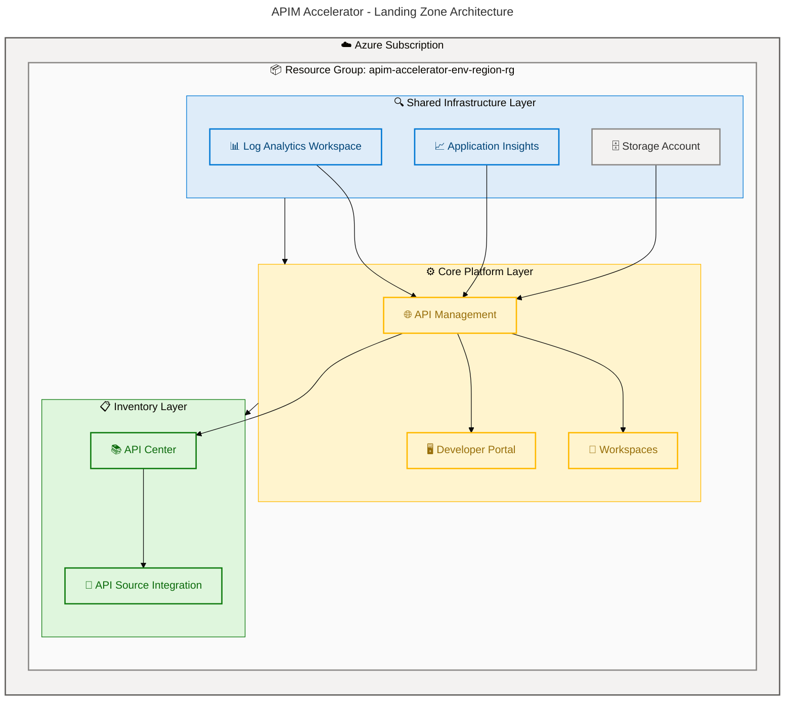

# APIM Accelerator

[](https://learn.microsoft.com/azure/api-management/)
[](https://learn.microsoft.com/azure/azure-resource-manager/bicep/)
[](https://learn.microsoft.com/azure/developer/azure-developer-cli/)
[](LICENSE)
[](https://github.com/Evilazaro/APIM-Accelerator)

## Overview

The APIM Accelerator is a **production-ready** Azure landing zone accelerator that deploys a complete API Management platform using Bicep Infrastructure-as-Code templates and Azure Developer CLI (`azd`). It provides enterprise teams with a **standardized, repeatable foundation** for governing, publishing, and monitoring APIs at scale on Azure.

The accelerator follows a **modular architecture** organized into **three deployment layers** — shared monitoring infrastructure, core API Management platform, and API inventory governance — each orchestrated through a single **subscription-level** Bicep template. Deploy the entire solution with a single `azd up` command, receiving a fully configured API Management instance with integrated monitoring, developer portal, workspaces for team isolation, and centralized API governance through Azure API Center.

> [!NOTE]
> This accelerator deploys Azure API Management with the **Premium** SKU by default, which enables features such as multi-region deployments, VNet integration, and workspaces. Review the [Configuration](#configuration) section to adjust the SKU tier for non-production environments.

## Table of Contents

- [Overview](#overview)
- [Architecture](#architecture)
- [Features](#features)
- [Requirements](#requirements)
- [Quick Start](#quick-start)
- [Deployment](#deployment)
- [Configuration](#configuration)
- [Project Structure](#project-structure)
- [Usage](#usage)
- [Troubleshooting](#troubleshooting)
- [Contributing](#contributing)
- [License](#license)

## Architecture

The solution uses a **layered deployment model** at Azure **subscription scope**. The orchestration template (`infra/main.bicep`) creates a resource group and deploys three module layers in sequence, with each layer building on the outputs of the previous one.


```mermaid
---
title: "APIM Accelerator - Landing Zone Architecture"
config:
  theme: base
  look: classic
  layout: dagre
  flowchart:
    htmlLabels: true
---
flowchart TB
    accTitle: APIM Accelerator Landing Zone Architecture
    accDescr: Shows the three-layer deployment architecture with shared monitoring, core API Management platform, and API inventory governance components

    subgraph azure["☁️ Azure Subscription"]
        direction TB

        subgraph rg["📦 Resource Group: apim-accelerator-env-region-rg"]
            direction TB

            subgraph shared["🔍 Shared Infrastructure Layer"]
                direction LR
                law["📊 Log Analytics Workspace"]:::core
                ai["📈 Application Insights"]:::core
                sa["🗄️ Storage Account"]:::data
            end

            subgraph core["⚙️ Core Platform Layer"]
                direction LR
                apim["🌐 API Management"]:::primary
                ws["🏢 Workspaces"]:::primary
                dp["🖥️ Developer Portal"]:::primary
            end

            subgraph inventory["📋 Inventory Layer"]
                direction LR
                ac["📚 API Center"]:::success
                acsrc["🔗 API Source Integration"]:::success
            end
        end
    end

    shared --> core
    core --> inventory
    law --> apim
    ai --> apim
    sa --> apim
    apim --> ws
    apim --> dp
    apim --> ac
    ac --> acsrc

    style azure fill:#F3F2F1,stroke:#605E5C,stroke-width:2px
    style rg fill:#FAFAFA,stroke:#8A8886,stroke-width:2px
    style shared fill:#DEECF9,stroke:#0078D4,stroke-width:1px
    style core fill:#FFF4CE,stroke:#FFB900,stroke-width:1px
    style inventory fill:#DFF6DD,stroke:#107C10,stroke-width:1px

    classDef primary fill:#FFF4CE,stroke:#FFB900,stroke-width:2px,color:#986F0B
    classDef core fill:#DEECF9,stroke:#0078D4,stroke-width:2px,color:#004578
    classDef data fill:#F3F2F1,stroke:#8A8886,stroke-width:2px,color:#323130
    classDef success fill:#DFF6DD,stroke:#107C10,stroke-width:2px,color:#0B6A0B
```

**Component Roles:**

| Layer        | Component               | Purpose                                                    |
| ------------ | ----------------------- | ---------------------------------------------------------- |
| 🔍 Shared    | Log Analytics Workspace | Centralized log aggregation and KQL-based analysis         |
| 🔍 Shared    | Application Insights    | Application performance monitoring and distributed tracing |
| 🔍 Shared    | Storage Account         | Long-term diagnostic log archival and compliance retention |
| ⚙️ Core      | API Management          | API gateway, policies, rate limiting, and caching          |
| ⚙️ Core      | Workspaces              | Logical API isolation for multi-team environments          |
| ⚙️ Core      | Developer Portal        | Self-service API discovery with Azure AD authentication    |
| 📋 Inventory | API Center              | Centralized API catalog, governance, and compliance        |
| 📋 Inventory | API Source Integration  | Automatic API discovery and synchronization from APIM      |

## Features

The accelerator provides a comprehensive API Management landing zone with **enterprise-grade capabilities** spanning governance, security, monitoring, and developer experience. Each feature is implemented as a **modular Bicep component** that can be customized independently.

These capabilities address the key challenges of API platform management **at scale** — from consistent infrastructure provisioning and identity management to centralized API discovery and compliance enforcement — enabling platform teams to onboard API producers and consumers efficiently.

| Feature                      | Description                                                                              | Status     |
| ---------------------------- | ---------------------------------------------------------------------------------------- | ---------- |
| 🌐 API Management Service    | Configurable APIM deployment with support for all SKU tiers (Developer through Premium)  | ✅ Stable  |
| 🏢 Workspace Isolation       | Logical API grouping for multi-team environments within a single APIM instance           | ✅ Stable  |
| 🖥️ Developer Portal          | Self-service portal with Azure AD authentication, CORS policies, and terms of service    | ✅ Stable  |
| 📚 API Center Governance     | Centralized API inventory, documentation, and compliance management via Azure API Center | ✅ Stable  |
| 🔗 Automatic API Discovery   | API source integration that synchronizes APIs from APIM to API Center automatically      | ✅ Stable  |
| 📊 Centralized Monitoring    | Log Analytics + Application Insights + Storage Account for full-stack observability      | ✅ Stable  |
| 🔐 Managed Identity          | System-assigned and user-assigned managed identity support across all components         | ✅ Stable  |
| 🔑 RBAC Assignments          | Automated role assignments for API Center Data Reader and Compliance Manager roles       | ✅ Stable  |
| 🚀 One-Command Deployment    | Full landing zone deployment via `azd up` with pre-provision automation hooks            | ✅ Stable  |
| 🏷️ Resource Tagging          | Comprehensive tagging strategy for cost tracking, governance, and compliance             | ✅ Stable  |
| 🌍 Multi-Environment Support | Environment-based configuration (dev, test, staging, prod, uat) with consistent naming   | ✅ Stable  |
| 🛡️ VNet Integration          | Optional virtual network integration for private API gateway deployments (Premium SKU)   | 🔄 Planned |

## Requirements

Before deploying the APIM Accelerator, ensure your environment meets the prerequisites below. The accelerator requires an **active Azure subscription** with **sufficient permissions** to create resources at the **subscription scope**, along with local tooling for infrastructure deployment.

These requirements are the minimum needed for a successful deployment. The Azure Developer CLI handles most of the orchestration, while the Bicep templates are compiled and deployed automatically during provisioning.

| Requirement             | Details                                                                               | Required    |
| ----------------------- | ------------------------------------------------------------------------------------- | ----------- |
| ☁️ Azure Subscription   | Active Azure subscription with Owner or Contributor + User Access Administrator roles | ✅ Yes      |
| 🔑 Azure CLI            | Version 2.50+ — used for authentication and resource management                       | ✅ Yes      |
| 🛠️ Azure Developer CLI  | Version 1.0+ — orchestrates provisioning and deployment via `azd up`                  | ✅ Yes      |
| 📦 Bicep CLI            | Version 0.20+ — compiles Bicep templates (bundled with Azure CLI)                     | ✅ Yes      |
| 🐚 Bash Shell           | Required for pre-provision hook scripts (Git Bash on Windows, native on macOS/Linux)  | ✅ Yes      |
| 🔐 Azure AD Permissions | App registration permissions required for developer portal Azure AD integration       | ⚠️ Optional |
| 🌐 Azure Region         | Region that supports API Management Premium tier and API Center                       | ✅ Yes      |

> [!TIP]
> On Windows, you can use [Git Bash](https://git-scm.com/) or [Windows Subsystem for Linux (WSL)](https://learn.microsoft.com/windows/wsl/) to run the pre-provision shell scripts included in this accelerator.

## Quick Start

Get the APIM Accelerator deployed in your Azure subscription with **three commands**. This minimal workflow provisions all infrastructure components including API Management, monitoring, and API Center governance.

1. **Clone the repository**

   ```bash
   git clone https://github.com/Evilazaro/APIM-Accelerator.git
   cd APIM-Accelerator
   ```

2. **Authenticate with Azure**

   ```bash
   azd auth login
   ```

3. **Deploy the landing zone**

   ```bash
   azd up
   ```

   When prompted, provide:
   - **Environment name**: A short identifier (e.g., `dev`, `prod`) used in resource naming
   - **Azure location**: The target region (e.g., `eastus`, `westeurope`)
   - **Environment type**: One of `dev`, `test`, `staging`, `prod`, or `uat`

> [!IMPORTANT]
> API Management Premium SKU provisioning can take 30-45 minutes. The `azd up` command will wait for all resources to be fully deployed before completing.

## Deployment

The accelerator supports **multiple deployment workflows** depending on your needs. Use `azd up` for a **full end-to-end deployment**, or use individual commands for more granular control over the provisioning process.

### Full Deployment

```bash
azd up
```

This single command executes the following sequence:

1. Runs the pre-provision hook (`infra/azd-hooks/pre-provision.sh`) to purge any soft-deleted APIM instances in the target region
2. Provisions all Azure resources defined in `infra/main.bicep`
3. Creates the resource group following the naming convention `apim-accelerator-{env}-{location}-rg`
4. Deploys shared monitoring infrastructure (Log Analytics, Application Insights, Storage)
5. Deploys core API Management platform with workspaces and developer portal
6. Deploys API Center with APIM integration for API inventory governance

### Provision Only

```bash
azd provision
```

Provisions Azure infrastructure without deploying application code.

### Direct Bicep Deployment

```bash
az deployment sub create \
  --location <region> \
  --template-file infra/main.bicep \
  --parameters envName=<dev|test|staging|prod|uat> location=<azure-region>
```

### Pre-Provision Hook

The pre-provision script automatically purges soft-deleted APIM instances to prevent naming conflicts during redeployment:

```bash
./infra/azd-hooks/pre-provision.sh <location>
```

## Configuration

All environment-specific configuration is **centralized** in `infra/settings.yaml`, which controls resource naming, SKU tiers, identity settings, tagging strategies, monitoring parameters, and component-level tuning. The orchestration template loads this file at deploy time and distributes settings to each module. Empty name fields trigger **automatic name generation** using the solution name and a deterministic unique suffix derived from the subscription and resource group.

The configuration is organized into four sections — global settings, shared infrastructure, core platform, and inventory services — each mapping directly to the corresponding deployment module. Additional parameters for networking, developer portal authentication, and Application Insights tuning are available as Bicep parameters in their respective modules.

### Configuration File

The primary configuration file is `infra/settings.yaml`:

```yaml
# Solution identifier used for naming conventions and resource grouping
solutionName: "apim-accelerator"

# Shared services configuration - monitoring, logging, and diagnostics
shared:
  monitoring:
    logAnalytics:
      name: "" # Leave empty for auto-generation
      workSpaceResourceId: "" # Set to reuse an existing workspace
      identity:
        type: "SystemAssigned" # Options: SystemAssigned, UserAssigned
        userAssignedIdentities: [] # Resource IDs for user-assigned identities
    applicationInsights:
      name: "" # Leave empty for auto-generation
      logAnalyticsWorkspaceResourceId: "" # Linked workspace (auto-linked if empty)
    tags:
      lz-component-type: "shared"
      component: "monitoring"
  tags:
    CostCenter: "CC-1234" # Cost allocation tracking
    BusinessUnit: "IT" # Business unit or department
    Owner: "your-email@example.com" # Resource/application owner
    ApplicationName: "APIM Platform" # Workload/application name
    ProjectName: "APIMForAll" # Project or initiative name
    ServiceClass: "Critical" # Workload tier: Critical, Standard, Experimental
    RegulatoryCompliance: "GDPR" # Compliance: GDPR, HIPAA, PCI, None
    SupportContact: "your-email@example.com" # Incident support contact
    ChargebackModel: "Dedicated" # Chargeback/Showback model
    BudgetCode: "FY25-Q1-InitiativeX" # Budget or initiative code

# Core platform configuration - API Management service
core:
  apiManagement:
    name: "" # Leave empty for auto-generation
    publisherEmail: "admin@example.com" # Required by Azure
    publisherName: "Contoso" # Organization name in developer portal
    sku:
      name: "Premium" # Options: Developer, Basic, BasicV2, Standard, StandardV2, Premium, Consumption
      capacity: 1 # Scale units (Premium: 1-10, Standard: 1-4)
    identity:
      type: "SystemAssigned" # Options: SystemAssigned, UserAssigned, None
      userAssignedIdentities: [] # Resource IDs for user-assigned identities
    workspaces:
      - name: "workspace1" # Add more entries for multi-team isolation
  tags:
    lz-component-type: "core"
    component: "apiManagement"

# Inventory configuration - API Center governance
inventory:
  apiCenter:
    name: "" # Leave empty for auto-generation
    identity:
      type: "SystemAssigned" # Options: SystemAssigned, UserAssigned, SystemAssigned+UserAssigned, None
      userAssignedIdentities: [] # Resource IDs for user-assigned identities
  tags:
    lz-component-type: "shared"
    component: "inventory"
```

### Environment Parameters

The deployment accepts two parameters via `infra/main.parameters.json`:

| Parameter     | Description                                                | Allowed Values                                      |
| ------------- | ---------------------------------------------------------- | --------------------------------------------------- |
| ⚙️ `envName`  | Environment identifier used in resource naming and tagging | `dev`, `test`, `staging`, `prod`, `uat`             |
| 🌍 `location` | Azure region for all resource deployments                  | Any region supporting API Management and API Center |

### API Management Configuration

Settings under `core.apiManagement` control the APIM service deployment. The APIM module (`src/core/apim.bicep`) also exposes additional parameters for networking and portal behavior.

| Setting                  | Path / Parameter                                     | Description                                                                                    | Default          | Allowed Values                                                                                  |
| ------------------------ | ---------------------------------------------------- | ---------------------------------------------------------------------------------------------- | ---------------- | ----------------------------------------------------------------------------------------------- |
| 📛 Service Name          | `core.apiManagement.name`                            | APIM instance name; leave empty for auto-generation using `{solutionName}-{uniqueSuffix}-apim` | Auto-generated   | Any valid APIM name                                                                             |
| 🏷️ SKU Tier              | `core.apiManagement.sku.name`                        | Pricing tier determining features, SLA, and scaling limits                                     | `Premium`        | `Developer`, `Basic`, `BasicV2`, `Standard`, `StandardV2`, `Premium`, `Consumption`, `Isolated` |
| 📊 Scale Units           | `core.apiManagement.sku.capacity`                    | Number of scale units (affects throughput and cost)                                            | `1`              | `1`–`10` (Premium), `1`–`4` (Standard)                                                          |
| 📧 Publisher Email       | `core.apiManagement.publisherEmail`                  | Contact email displayed in developer portal and notifications                                  | Required         | Valid email address                                                                             |
| 🏢 Publisher Name        | `core.apiManagement.publisherName`                   | Organization name shown in developer portal                                                    | Required         | Any string                                                                                      |
| 🔐 Identity Type         | `core.apiManagement.identity.type`                   | Managed identity for Azure service authentication                                              | `SystemAssigned` | `SystemAssigned`, `UserAssigned`, `None`                                                        |
| 🔑 User Identities       | `core.apiManagement.identity.userAssignedIdentities` | Resource IDs of pre-created user-assigned identities                                           | `[]`             | Array of ARM resource IDs                                                                       |
| 🌐 Public Network Access | `publicNetworkAccess` (Bicep param)                  | Allow public internet access to the APIM gateway                                               | `true`           | `true`, `false`                                                                                 |
| 🛡️ VNet Integration      | `virtualNetworkType` (Bicep param)                   | Network mode for private deployments                                                           | `None`           | `None`, `External`, `Internal`                                                                  |
| 🔗 Subnet ID             | `subnetResourceId` (Bicep param)                     | Subnet resource ID for VNet integration                                                        | `""`             | Valid ARM subnet resource ID                                                                    |
| 🖥️ Developer Portal      | `enableDeveloperPortal` (Bicep param)                | Enable or disable the self-service developer portal                                            | `true`           | `true`, `false`                                                                                 |

> [!NOTE]
> The `publicNetworkAccess`, `virtualNetworkType`, `subnetResourceId`, and `enableDeveloperPortal` parameters are Bicep-level parameters in `src/core/apim.bicep`. To customize them, pass values through the module call in `src/core/main.bicep` or override via a parameters file.

### Workspace Configuration

Workspaces provide **logical isolation** for APIs within a single APIM instance. Each workspace entry in the settings creates a separate `Microsoft.ApiManagement/service/workspaces` resource.

```yaml
core:
  apiManagement:
    workspaces:
      - name: "workspace1" # Default workspace
      - name: "sales-apis" # Team-specific workspace
      - name: "partner-apis" # External partner workspace
```

| Setting           | Description                                                                | Constraint                              |
| ----------------- | -------------------------------------------------------------------------- | --------------------------------------- |
| 🏢 Workspace Name | Identifier for the workspace (used as both resource name and display name) | Must be unique within the APIM instance |

> [!IMPORTANT]
> Workspaces require the **Premium** SKU tier. If a non-Premium SKU is configured, workspace deployment will fail. Use the `Developer` SKU only for non-production environments that do not need workspace isolation.

### Developer Portal & Azure AD Authentication

The developer portal module (`src/core/developer-portal.bicep`) configures **Azure AD** as the identity provider, CORS policies, and sign-in/sign-up settings. Customization requires **editing the Bicep module directly**.

| Setting              | Location                                              | Description                                        | Default                                               |
| -------------------- | ----------------------------------------------------- | -------------------------------------------------- | ----------------------------------------------------- |
| 🔑 Client ID         | `clientId` param in `developer-portal.bicep`          | Azure AD app registration client ID (36-char GUID) | Passed from APIM identity output                      |
| 🔒 Client Secret     | `clientSecret` param in `developer-portal.bicep`      | Azure AD app registration client secret            | Passed from APIM identity output                      |
| 🏢 Allowed Tenants   | `allowedTenants` variable in `developer-portal.bicep` | Azure AD tenant domains permitted to sign in       | `['MngEnvMCAP341438.onmicrosoft.com']`                |
| 🌐 Identity Provider | `identityProviderAuthority` variable                  | Azure AD authentication endpoint                   | `login.windows.net`                                   |
| 📚 Auth Library      | `identityProviderClientLibrary` variable              | MSAL library version for authentication flows      | `MSAL-2`                                              |
| ✅ Sign-In Enabled   | `devPortalSignInSetting` resource                     | Allow user authentication via configured providers | `true`                                                |
| 📝 Sign-Up Enabled   | `devPortalSignUpSetting` resource                     | Allow new user registration                        | `true`                                                |
| 📋 Terms of Service  | `termsOfService` property                             | Require users to accept terms during registration  | `enabled: true, consentRequired: true`                |
| 🔗 CORS Origins      | `devPortalConfig` resource                            | Allowed origins for cross-origin requests          | Developer portal URL, gateway URL, management API URL |

> [!WARNING]
> Update the `allowedTenants` array in `src/core/developer-portal.bicep` with your organization's Azure AD tenant domain(s) before deploying. The default value is a sample tenant and will not work for your environment.

### Monitoring Configuration

Monitoring settings are split between `infra/settings.yaml` (for resource identity and naming) and the Bicep module defaults (for operational parameters).

#### Log Analytics Workspace

| Setting               | Path / Parameter                                                 | Description                                         | Default           |
| --------------------- | ---------------------------------------------------------------- | --------------------------------------------------- | ----------------- |
| 📛 Workspace Name     | `shared.monitoring.logAnalytics.name`                            | Custom name; leave empty for auto-generation        | Auto-generated    |
| 🔗 Existing Workspace | `shared.monitoring.logAnalytics.workSpaceResourceId`             | Reuse an existing workspace instead of creating one | `""` (create new) |
| 🔐 Identity Type      | `shared.monitoring.logAnalytics.identity.type`                   | Managed identity for secure resource access         | `SystemAssigned`  |
| 🔑 User Identities    | `shared.monitoring.logAnalytics.identity.userAssignedIdentities` | User-assigned identity resource IDs                 | `[]`              |
| 🏷️ SKU                | `skuName` param in `operational/main.bicep`                      | Log Analytics pricing tier                          | `PerGB2018`       |

**Available Log Analytics SKU tiers:**

| SKU                      | Use Case                                                             |
| ------------------------ | -------------------------------------------------------------------- |
| 📊 `PerGB2018`           | Pay-per-GB ingestion — most flexible, recommended for most workloads |
| 💰 `CapacityReservation` | Commitment-based pricing for high-volume scenarios (100+ GB/day)     |
| 🆓 `Free`                | Limited to 500 MB/day with 7-day retention — testing only            |
| 🏢 `LACluster`           | Dedicated cluster for 500+ GB/day scenarios                          |

#### Application Insights

| Setting             | Path / Parameter                                                        | Description                                  | Default        |
| ------------------- | ----------------------------------------------------------------------- | -------------------------------------------- | -------------- |
| 📛 Instance Name    | `shared.monitoring.applicationInsights.name`                            | Custom name; leave empty for auto-generation | Auto-generated |
| 🔗 Linked Workspace | `shared.monitoring.applicationInsights.logAnalyticsWorkspaceResourceId` | Log Analytics workspace for data storage     | Auto-linked    |
| 📦 Application Kind | `kind` param in `insights/main.bicep`                                   | Type of application being monitored          | `web`          |
| 📋 Application Type | `applicationType` param in `insights/main.bicep`                        | Telemetry categorization                     | `web`          |
| 🔄 Ingestion Mode   | `ingestionMode` param in `insights/main.bicep`                          | Where telemetry data is stored               | `LogAnalytics` |
| 📅 Retention (Days) | `retentionInDays` param in `insights/main.bicep`                        | Data retention period (90–730 days)          | `90`           |
| 🌐 Public Ingestion | `publicNetworkAccessForIngestion` param                                 | Public network access for data ingestion     | `Enabled`      |
| 🔍 Public Query     | `publicNetworkAccessForQuery` param                                     | Public network access for data queries       | `Enabled`      |

> [!TIP]
> For production environments with strict security requirements, set both `publicNetworkAccessForIngestion` and `publicNetworkAccessForQuery` to `Disabled` and configure Azure Private Link for Application Insights.

#### Diagnostic Storage Account

A storage account is automatically provisioned for long-term diagnostic log archival. Its name is auto-generated using a centralized naming function to ensure global uniqueness.

| Setting   | Value          | Notes                                                          |
| --------- | -------------- | -------------------------------------------------------------- |
| 🗄️ SKU    | `Standard_LRS` | Locally-redundant storage — cost-effective for diagnostic logs |
| 📦 Kind   | `StorageV2`    | Current-generation general-purpose storage                     |
| 📛 Naming | Auto-generated | Uses `generateStorageAccountName()` with unique hash           |

### API Center & Inventory Configuration

API Center provides **centralized API governance**, catalog, and compliance management. It **automatically integrates** with the deployed APIM instance for API discovery.

| Setting              | Path                                                  | Description                                                                   | Default          |
| -------------------- | ----------------------------------------------------- | ----------------------------------------------------------------------------- | ---------------- |
| 📛 API Center Name   | `inventory.apiCenter.name`                            | Custom name; leave empty for auto-generation using `{solutionName}-apicenter` | Auto-generated   |
| 🔐 Identity Type     | `inventory.apiCenter.identity.type`                   | Managed identity for API Center operations                                    | `SystemAssigned` |
| 🔑 User Identities   | `inventory.apiCenter.identity.userAssignedIdentities` | User-assigned identity resource IDs                                           | `[]`             |
| 🏢 Default Workspace | Hardcoded in `src/inventory/main.bicep`               | Default workspace name for API organization                                   | `default`        |

**Automatic RBAC assignments** created for API Center:

| Role                             | Role Definition ID                     | Purpose                                   |
| -------------------------------- | -------------------------------------- | ----------------------------------------- |
| 🔍 API Center Data Reader        | `71522526-b88f-4d52-b57f-d31fc3546d0d` | Read API definitions and metadata         |
| 📋 API Center Compliance Manager | `6cba8790-29c5-48e5-bab1-c7541b01cb04` | Manage compliance and governance policies |

### Resource Tagging Strategy

Tags defined under `shared.tags` are applied to all resources across the landing zone. Additional component-level tags are merged at deploy time.

| Tag                       | Purpose                                         | Example Value                          |
| ------------------------- | ----------------------------------------------- | -------------------------------------- |
| 💰 `CostCenter`           | Cost allocation and chargeback tracking         | `CC-1234`                              |
| 🏢 `BusinessUnit`         | Business unit or department identification      | `IT`                                   |
| 👤 `Owner`                | Resource/application owner email                | `admin@example.com`                    |
| 📦 `ApplicationName`      | Workload or application name                    | `APIM Platform`                        |
| 📋 `ProjectName`          | Project or initiative name                      | `APIMForAll`                           |
| 🏷️ `ServiceClass`         | Workload tier classification                    | `Critical`, `Standard`, `Experimental` |
| 🛡️ `RegulatoryCompliance` | Compliance framework applicable to the workload | `GDPR`, `HIPAA`, `PCI`, `None`         |
| 📞 `SupportContact`       | Incident support team or contact email          | `support@example.com`                  |
| 💳 `ChargebackModel`      | Chargeback/showback billing model               | `Dedicated`, `Shared`                  |
| 📊 `BudgetCode`           | Budget or initiative tracking code              | `FY25-Q1-InitiativeX`                  |

Additional component-level tags (`lz-component-type`, `component`) are automatically applied by each module to identify the landing zone layer (shared, core, inventory).

### Resource Naming Conventions

All resources follow a **consistent naming pattern**. When a name is left empty in `infra/settings.yaml`, the accelerator generates one **automatically**.

| Resource                | Naming Pattern                           | Example                               |
| ----------------------- | ---------------------------------------- | ------------------------------------- |
| 📦 Resource Group       | `{solutionName}-{envName}-{location}-rg` | `apim-accelerator-dev-eastus-rg`      |
| 🌐 API Management       | `{solutionName}-{uniqueSuffix}-apim`     | `apim-accelerator-a1b2c3-apim`        |
| 📚 API Center           | `{solutionName}-apicenter`               | `apim-accelerator-apicenter`          |
| 🗄️ Storage Account      | `{name}{uniqueHash}sa` (max 24 chars)    | `apimaccelsa7x2k`                     |
| 📊 Log Analytics        | Auto-generated from solution name        | `apim-accelerator-{uniqueSuffix}-law` |
| 📈 Application Insights | Auto-generated from solution name        | `apim-accelerator-{uniqueSuffix}-ai`  |

> [!NOTE]
> The `uniqueSuffix` is a deterministic hash derived from the subscription ID, resource group ID, resource group name, solution name, and location. This ensures names are globally unique but reproducible across repeated deployments to the same environment.

## Project Structure

The repository follows a **modular layout** separating infrastructure orchestration (`infra/`) from source Bicep modules (`src/`). Each module is **self-contained** with explicit parameter contracts and documented dependencies.

```text
APIM-Accelerator/
├── azure.yaml                          # Azure Developer CLI project configuration
├── LICENSE                             # MIT License
├── infra/
│   ├── main.bicep                      # Orchestration template (subscription scope)
│   ├── main.parameters.json            # Deployment parameters (envName, location)
│   ├── settings.yaml                   # Environment-specific configuration
│   └── azd-hooks/
│       └── pre-provision.sh            # Pre-provision: purge soft-deleted APIM
├── src/
│   ├── core/
│   │   ├── main.bicep                  # Core platform orchestrator
│   │   ├── apim.bicep                  # API Management service resource
│   │   ├── workspaces.bicep            # APIM workspace resources
│   │   └── developer-portal.bicep      # Developer portal with Azure AD
│   ├── inventory/
│   │   └── main.bicep                  # API Center + APIM integration
│   └── shared/
│       ├── main.bicep                  # Shared infrastructure orchestrator
│       ├── common-types.bicep          # Reusable Bicep type definitions
│       ├── constants.bicep             # Shared constants and utility functions
│       ├── monitoring/
│       │   ├── main.bicep              # Monitoring orchestrator
│       │   ├── insights/
│       │   │   └── main.bicep          # Application Insights deployment
│       │   └── operational/
│       │       └── main.bicep          # Log Analytics + Storage Account
│       └── networking/
│           └── main.bicep              # Virtual network (placeholder)
```

## Usage

After deployment, interact with the provisioned resources through the Azure portal, Azure CLI, or the developer portal. The following examples demonstrate common **operational tasks** across all provisioned components — API Management, developer portal, workspaces, monitoring, API Center, and networking.

### Access the Developer Portal

After deployment completes, the API Management developer portal is available at:

```text
https://{apim-name}.developer.azure-api.net
```

The developer portal is configured with **Azure AD authentication**. Users **must sign in** with an account from a tenant listed in the `allowedTenants` array in `src/core/developer-portal.bicep`. Update this array with your organization's tenant domain(s) before first use.

To customize sign-in and sign-up behavior:

- **Disable self-registration** — set the `enabled` property on the `devPortalSignUpSetting` resource to `false` in `src/core/developer-portal.bicep`
- **Remove terms of service** — set `termsOfService.enabled` to `false` in the same file
- **Add CORS origins** — update the `origins` array in the `devPortalConfig` resource to include additional frontend domains

To disable the developer portal entirely, set `enableDeveloperPortal` to `false` in the APIM module parameters.

### Manage Workspaces

Add, remove, or rename workspaces by updating the `workspaces` array in `infra/settings.yaml`:

```yaml
core:
  apiManagement:
    workspaces:
      - name: "workspace1"
      - name: "sales-apis"
      - name: "partner-apis"
```

Then redeploy:

```bash
azd provision
```

> [!IMPORTANT]
> Workspaces require the **Premium** SKU tier. If `core.apiManagement.sku.name` is set to a non-Premium SKU, workspace deployment will fail.

### Configure VNet Integration

To deploy APIM behind a virtual network, override the Bicep parameters in `src/core/main.bicep` when calling the APIM module:

```bicep
// External mode — gateway accessible via public IP, backend services via VNet
virtualNetworkType: 'External'
subnetResourceId: '/subscriptions/{sub}/resourceGroups/{rg}/providers/Microsoft.Network/virtualNetworks/{vnet}/subnets/{subnet}'
publicNetworkAccess: true

// Internal mode — gateway accessible only within the VNet
virtualNetworkType: 'Internal'
subnetResourceId: '/subscriptions/{sub}/resourceGroups/{rg}/providers/Microsoft.Network/virtualNetworks/{vnet}/subnets/{subnet}'
publicNetworkAccess: false
```

### Change APIM SKU and Scaling

Update the SKU and capacity in `infra/settings.yaml`:

```yaml
core:
  apiManagement:
    sku:
      name: "Standard" # Developer, Basic, BasicV2, Standard, StandardV2, Premium, Consumption
      capacity: 2 # Scale units
```

Then redeploy:

```bash
azd provision
```

> [!NOTE]
> Changing from `Premium` to a lower SKU will remove workspace support and VNet integration capabilities. Plan accordingly.

### Customize the Tagging Strategy

All 10 governance tags under `shared.tags` in `infra/settings.yaml` are applied to every resource. Update them to match your organization's cost management and compliance requirements:

```yaml
shared:
  tags:
    CostCenter: "CC-5678"
    BusinessUnit: "Engineering"
    Owner: "platform-team@contoso.com"
    ApplicationName: "API Gateway"
    ProjectName: "Digital Transformation"
    ServiceClass: "Critical"
    RegulatoryCompliance: "HIPAA"
    SupportContact: "oncall@contoso.com"
    ChargebackModel: "Shared"
    BudgetCode: "FY26-Q2-APIProgram"
```

Component-level tags (`lz-component-type`, `component`) are automatically added by each module and do not need manual configuration.

### Reuse an Existing Log Analytics Workspace

To connect to a pre-existing Log Analytics workspace instead of creating a new one, set the `workSpaceResourceId` property:

```yaml
shared:
  monitoring:
    logAnalytics:
      name: ""
      workSpaceResourceId: "/subscriptions/{sub}/resourceGroups/{rg}/providers/Microsoft.OperationalInsights/workspaces/{name}"
```

### Tune Application Insights Retention and Access

Override Application Insights Bicep parameters in `src/shared/monitoring/insights/main.bicep` for production hardening:

| Parameter                            | Production Recommendation              |
| ------------------------------------ | -------------------------------------- |
| 📅 `retentionInDays`                 | `365` (up from default `90`)           |
| 🔒 `publicNetworkAccessForIngestion` | `Disabled`                             |
| 🔍 `publicNetworkAccessForQuery`     | `Disabled`                             |
| 🔄 `ingestionMode`                   | `LogAnalytics` (default — recommended) |

### Configure API Center Identity

Update the API Center managed identity in `infra/settings.yaml`:

```yaml
inventory:
  apiCenter:
    identity:
      type: "SystemAssigned" # Options: SystemAssigned, UserAssigned, SystemAssigned+UserAssigned, None
      userAssignedIdentities:
        - "/subscriptions/{sub}/resourceGroups/{rg}/providers/Microsoft.ManagedIdentity/userAssignedIdentities/{name}"
```

The API Center module automatically creates RBAC role assignments (Data Reader and Compliance Manager) for the API Center's managed identity on the connected APIM instance.

### Query Logs with KQL

Access the Log Analytics workspace to query API Management diagnostic logs:

```kusto
ApiManagementGatewayLogs
| where TimeGenerated > ago(1h)
| summarize count() by ResponseCode
| order by count_ desc
```

Track request latencies by API:

```kusto
ApiManagementGatewayLogs
| where TimeGenerated > ago(24h)
| summarize avg(TotalTime), percentile(TotalTime, 95), percentile(TotalTime, 99) by ApiId
| order by avg_TotalTime desc
```

### View API Inventory

Browse the centralized API catalog in the Azure portal under the deployed API Center resource. APIs from the connected API Management instance are automatically discovered and synchronized through the APIM source integration configured in `src/inventory/main.bicep`.

## Troubleshooting

Common issues and their resolutions when deploying or operating the APIM Accelerator.

| Issue                                    | Cause                                            | Resolution                                                                                                            |
| ---------------------------------------- | ------------------------------------------------ | --------------------------------------------------------------------------------------------------------------------- |
| ❌ Name conflict during provisioning     | Soft-deleted APIM instance with same name exists | Run `./infra/azd-hooks/pre-provision.sh <location>` to purge                                                          |
| ❌ Deployment timeout                    | Premium SKU provisioning exceeds default timeout | Wait 30-45 minutes; APIM Premium provisioning is expected to take time                                                |
| ⚠️ Developer portal authentication fails | Azure AD app registration misconfigured          | Verify client ID, client secret, and allowed tenants in `developer-portal.bicep`                                      |
| ⚠️ Role assignment errors                | Insufficient permissions on subscription         | Ensure the deploying identity has Owner or User Access Administrator role                                             |
| ⚠️ Workspace creation fails              | Non-Premium SKU selected                         | Workspaces require the Premium SKU tier — update `core.apiManagement.sku.name`                                        |
| 🔧 Storage account name conflict         | Globally unique name collision                   | Storage names are auto-generated using `generateStorageAccountName()` — redeploy with a different resource group name |

## Contributing

Contributions to the APIM Accelerator are welcome. Whether you are fixing a bug, improving documentation, or adding a new feature module, your contributions help the community build better API platforms on Azure.

To contribute, follow the **standard GitHub workflow**: fork the repository, create a feature branch, make your changes, and submit a pull request. Ensure all Bicep templates **compile without errors** using `az bicep build` before submitting.

1. Fork the repository
2. Create a feature branch (`git checkout -b feature/my-feature`)
3. Make your changes
4. Validate Bicep templates:

   ```bash
   az bicep build --file infra/main.bicep
   ```

5. Commit your changes (`git commit -m "Add my feature"`)
6. Push to the branch (`git push origin feature/my-feature`)
7. Open a Pull Request

## License

This project is licensed under the **MIT License**. See the [LICENSE](LICENSE) file for details.

Copyright (c) 2025 Evilazaro Alves.
