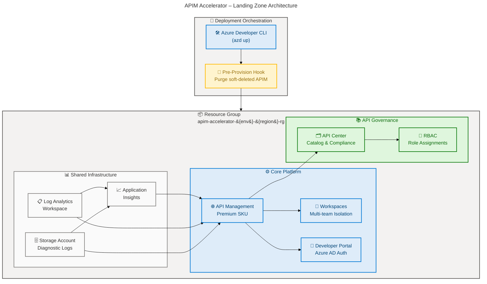

# APIM Accelerator

[](LICENSE)
[](https://azure.microsoft.com/products/api-management)
[](https://learn.microsoft.com/azure/azure-resource-manager/bicep/)
[](https://learn.microsoft.com/azure/developer/azure-developer-cli/)
[](https://github.com/Evilazaro/APIM-Accelerator)

An enterprise-ready landing zone accelerator for **Azure API Management** that deploys a complete API platform with centralized monitoring, multi-team workspace isolation, a self-service developer portal, and API inventory governance — all orchestrated through modular Bicep templates and the Azure Developer CLI (`azd`).

> 💡 **Why This Accelerator?** Standing up a production-grade APIM environment typically requires coordinating dozens of Azure resources across monitoring, networking, identity, and governance. This accelerator codifies Microsoft best practices into a single `azd up` deployment, reducing weeks of manual setup to under an hour.

## Table of Contents

- [Overview](#overview)
- [Architecture](#architecture)
- [Features](#features)
- [Requirements](#requirements)
- [Quick Start](#quick-start)
- [Configuration](#configuration)
- [Usage](#usage)
- [Project Structure](#project-structure)
- [Deployment](#deployment)
- [Environments](#environments)
- [Troubleshooting](#troubleshooting)
- [Contributing](#contributing)
- [License](#license)

## Overview

**Overview**

The APIM Accelerator is a production-ready landing zone that provisions a complete Azure API Management platform in a single command. It targets platform engineers and API teams who need a governed, observable, and multi-tenant API gateway without weeks of manual Azure resource configuration.

> 💡 **Why This Matters**: Organizations adopting API-first strategies need a consistent, repeatable platform foundation. This accelerator eliminates configuration drift and enforces best practices across environments, letting teams focus on APIs instead of infrastructure plumbing.

> 📌 **How It Works**: A subscription-scoped Bicep orchestrator deploys resources in strict dependency order — shared monitoring first, then core APIM with workspaces and developer portal, then API Center for governance — ensuring each layer receives validated outputs from the previous one.

## Architecture

**Overview**

The accelerator follows a layered landing zone pattern with clear separation between shared infrastructure, core platform services, and API governance capabilities. This architecture ensures independent lifecycle management for each layer while maintaining centralized observability.

> 💡 **Why This Matters**: A layered architecture prevents blast-radius issues during updates — changes to monitoring do not impact the API gateway, and governance policies evolve independently of platform configuration.


```mermaid
---
title: "APIM Accelerator – Landing Zone Architecture"
config:
  theme: base
  look: classic
  layout: dagre
  themeVariables:
    fontSize: '16px'
  flowchart:
    htmlLabels: true
---
flowchart TB
    accTitle: APIM Accelerator Landing Zone Architecture
    accDescr: Shows deployment orchestration flowing into three layers - shared infrastructure, core platform, and API governance - within a single resource group

    %% ═══════════════════════════════════════════════════════════════════════════
    %% AZURE / FLUENT ARCHITECTURE PATTERN v1.1
    %% (Semantic + Structural + Font + Accessibility Governance)
    %% ═══════════════════════════════════════════════════════════════════════════
    %% PHASE 1 - STRUCTURAL: Direction explicit, flat topology, nesting ≤ 3
    %% PHASE 2 - SEMANTIC: Colors justified, max 5 semantic classes, neutral-first
    %% PHASE 3 - FONT: Dark text on light backgrounds, contrast ≥ 4.5:1
    %% PHASE 4 - ACCESSIBILITY: accTitle/accDescr present, icons on all nodes
    %% PHASE 5 - STANDARD: Governance block present, classDefs centralized
    %% ═══════════════════════════════════════════════════════════════════════════

    subgraph Orchestration["🚀 Deployment Orchestration"]
        AZD["🛠️ Azure Developer CLI<br/>(azd up)"]:::core
        HOOK["🔄 Pre-Provision Hook<br/>Purge soft-deleted APIM"]:::warning
    end

    subgraph RG["📦 Resource Group<br/>apim-accelerator-&#123;env&#125;-&#123;region&#125;-rg"]
        subgraph Shared["📊 Shared Infrastructure"]
            LAW["📋 Log Analytics<br/>Workspace"]:::neutral
            AI["📈 Application<br/>Insights"]:::neutral
            SA["🗄️ Storage Account<br/>Diagnostic Logs"]:::neutral
        end

        subgraph Core["⚙️ Core Platform"]
            APIM["🌐 API Management<br/>Premium SKU"]:::core
            WS["🏢 Workspaces<br/>Multi-team Isolation"]:::core
            DP["🔑 Developer Portal<br/>Azure AD Auth"]:::core
        end

        subgraph Inventory["📚 API Governance"]
            AC["🗂️ API Center<br/>Catalog & Compliance"]:::success
            RBAC["🔐 RBAC<br/>Role Assignments"]:::success
        end
    end

    AZD --> HOOK --> RG
    LAW --> AI
    SA --> AI
    AI --> APIM
    LAW --> APIM
    SA --> APIM
    APIM --> WS
    APIM --> DP
    APIM --> AC
    AC --> RBAC

    style Orchestration fill:#F3F2F1,stroke:#605E5C,stroke-width:2px,color:#323130
    style RG fill:#F3F2F1,stroke:#605E5C,stroke-width:2px,color:#323130
    style Shared fill:#FAFAFA,stroke:#8A8886,stroke-width:2px,color:#323130
    style Core fill:#DEECF9,stroke:#0078D4,stroke-width:2px,color:#004578
    style Inventory fill:#DFF6DD,stroke:#107C10,stroke-width:2px,color:#0B6A0B

    %% Centralized semantic classDefs (Phase 5 compliant)
    classDef core fill:#DEECF9,stroke:#0078D4,stroke-width:2px,color:#004578
    classDef success fill:#DFF6DD,stroke:#107C10,stroke-width:2px,color:#0B6A0B
    classDef warning fill:#FFF4CE,stroke:#FFB900,stroke-width:2px,color:#986F0B
    classDef neutral fill:#FAFAFA,stroke:#8A8886,stroke-width:2px,color:#323130
```

**Component Roles:**

| Component                      | Purpose                                                          |
| ------------------------------ | ---------------------------------------------------------------- |
| 📋 **Log Analytics Workspace** | Centralized logging, KQL queries, and diagnostic data            |
| 📈 **Application Insights**    | APM telemetry, distributed tracing, and performance monitoring   |
| 🗄️ **Storage Account**         | Long-term diagnostic log retention and compliance archival       |
| 🌐 **API Management**          | Gateway, policies, rate limiting, caching, and API lifecycle     |
| 🏢 **Workspaces**              | Logical isolation for teams to manage APIs independently         |
| 🔑 **Developer Portal**        | Self-service API discovery, testing, and subscription management |
| 🗂️ **API Center**              | Centralized API catalog, governance, and compliance management   |

## Features

**Overview**

The accelerator provides production-ready capabilities out of the box, following Azure Well-Architected Framework principles for reliability, security, and operational excellence.

> 💡 **Why This Matters**: Each feature addresses a specific operational gap — from eliminating manual resource provisioning to enforcing consistent governance across API teams — so platform engineers can deliver a self-service API platform with confidence.

> 📌 **How It Works**: Modular Bicep templates are composed by a subscription-scoped orchestrator that deploys resources in dependency order — shared monitoring first, then core APIM, then API governance — with each layer receiving outputs from the previous one.

| Feature                      | Description                                                             | Status    |
| ---------------------------- | ----------------------------------------------------------------------- | --------- |
| 🧩 **Modular Bicep IaC**     | Composable templates with typed parameters and shared constants         | ✅ Stable |
| 🚀 **One-Command Deploy**    | Full provisioning via `azd up` with pre-provision hooks                 | ✅ Stable |
| 🌍 **Multi-Environment**     | Support for `dev`, `test`, `staging`, `prod`, and `uat` environments    | ✅ Stable |
| 📊 **Observability Stack**   | Log Analytics + Application Insights + Storage diagnostics              | ✅ Stable |
| 🏢 **Multi-Team Workspaces** | Isolated APIM workspaces for independent API lifecycle management       | ✅ Stable |
| 🔑 **Developer Portal**      | Azure AD–integrated portal with CORS, sign-in, and sign-up              | ✅ Stable |
| 📚 **API Governance**        | API Center integration with automated discovery from APIM               | ✅ Stable |
| 🔐 **Managed Identity**      | System-assigned and user-assigned identity support across all resources | ✅ Stable |
| ⚙️ **RBAC Automation**       | Deterministic role assignments for API Center operations                | ✅ Stable |
| 🛠️ **Type-Safe Config**      | Custom Bicep type definitions for validated, consistent configuration   | ✅ Stable |

## Requirements

**Overview**

The accelerator depends on a small set of Azure and CLI tooling prerequisites. All tools are free, cross-platform, and can be installed in minutes. Meeting these requirements ensures a smooth single-command deployment experience.

> ⚠️ **Why These Requirements**: The accelerator uses subscription-scoped Bicep deployments with RBAC assignments. Without the correct CLI versions and permissions, provisioning will fail at the resource group or role assignment stage.

| Requirement                                                                                                 | Minimum Version | Purpose                            |
| ----------------------------------------------------------------------------------------------------------- | --------------- | ---------------------------------- |
| ☁️ [Azure Subscription](https://azure.microsoft.com/free/)                                                  | —               | Target for resource deployment     |
| 🛠️ [Azure CLI](https://learn.microsoft.com/cli/azure/install-azure-cli)                                     | 2.60+           | Azure resource management          |
| 🚀 [Azure Developer CLI (azd)](https://learn.microsoft.com/azure/developer/azure-developer-cli/install-azd) | 1.5+            | Deployment orchestration           |
| 📦 [Bicep CLI](https://learn.microsoft.com/azure/azure-resource-manager/bicep/install)                      | 0.25+           | Infrastructure-as-Code compilation |

> ⚠️ **Permissions**: You need **Owner** or **Contributor + User Access Administrator** at the subscription level to create resource groups and assign RBAC roles.

## Quick Start

### 1. Clone the Repository

```bash
git clone https://github.com/Evilazaro/APIM-Accelerator.git
cd APIM-Accelerator
```

### 2. Authenticate with Azure

```bash
az login
azd auth login
```

### 3. Initialize and Deploy

```bash
azd up
# Expected: Provisioning completes with "SUCCESS: Your application was provisioned in Azure"
```

You will be prompted for:

- **Environment name** — a label for this deployment (e.g., `dev`, `prod`)
- **Azure location** — the target region (e.g., `eastus`, `westeurope`)

> 💡 **What happens**: `azd up` runs the pre-provision hook to purge soft-deleted APIM instances, then deploys shared monitoring, core APIM (Premium SKU), and API Center in dependency order.

### 4. Verify Deployment

```bash
az apim show \
  --name apim-accelerator-dev-eastus \
  --resource-group apim-accelerator-dev-eastus-rg \
  --query "{name:name, sku:sku.name, state:provisioningState}" \
  -o table
```

**Expected Output:**

```text
Name                          Sku       State
----------------------------  --------  -----------
apim-accelerator-dev-eastus   Premium   Succeeded
```

## Configuration

**Overview**

All environment-specific settings are centralized in a single YAML file, giving operators full control over SKU tiers, identity, and workspace topology without modifying Bicep templates. Resource names are auto-generated when left empty, following a consistent naming convention.

> 📌 **How It Works**: The `infra/main.bicep` orchestrator reads `infra/settings.yaml` at deployment time via the `loadYamlContent()` Bicep function, making every setting available as a typed parameter across all modules.

```yaml
solutionName: "apim-accelerator"

core:
  apiManagement:
    name: "" # Auto-generated if empty
    publisherEmail: "admin@contoso.com"
    publisherName: "Contoso"
    sku:
      name: "Premium" # Developer | Basic | Standard | Premium
      capacity: 1 # Scale units (Premium: 1–10)
    identity:
      type: "SystemAssigned" # SystemAssigned | UserAssigned
      userAssignedIdentities: []
    workspaces:
      - name: "workspace1" # Premium SKU only
```

### Key Configuration Options

| Setting                | Path                                | Description                                                         |
| ---------------------- | ----------------------------------- | ------------------------------------------------------------------- |
| ⚙️ **SKU Tier**        | `core.apiManagement.sku.name`       | APIM pricing tier — `Premium` required for workspaces and VNet      |
| 📊 **Scale Units**     | `core.apiManagement.sku.capacity`   | Number of gateway units (affects throughput and cost)               |
| 📬 **Publisher Email** | `core.apiManagement.publisherEmail` | Required by Azure for APIM service notifications                    |
| 🔐 **Identity Type**   | `core.apiManagement.identity.type`  | Managed identity for secure Azure service integration               |
| 🏷️ **Tags**            | `shared.tags.*`                     | Governance tags applied to all resources (cost center, owner, etc.) |

## Usage

**Overview**

Once deployed, the accelerator provides a fully operational API Management platform. Teams interact with the platform through the Azure portal, the developer portal, or CLI commands for day-to-day API operations.

> 💡 **Why This Matters**: Understanding the primary interaction patterns helps teams onboard faster and adopt self-service API publishing workflows from day one.

### Accessing the Developer Portal

After deployment, the developer portal is available at:

```text
https://{apim-name}.developer.azure-api.net
```

Sign in with Azure AD credentials to discover, test, and subscribe to published APIs.

### Publishing an API

Import an API specification into the deployed APIM instance:

```bash
az apim api import \
  --resource-group apim-accelerator-dev-eastus-rg \
  --service-name apim-accelerator-dev-eastus \
  --path "/petstore" \
  --specification-format OpenApi \
  --specification-url "https://petstore3.swagger.io/api/v3/openapi.json" \
  --display-name "Petstore API"
# Expected: API "Petstore API" created with path "/petstore"
```

### Listing Workspace APIs

```bash
az apim api list \
  --resource-group apim-accelerator-dev-eastus-rg \
  --service-name apim-accelerator-dev-eastus \
  --query "[].{Name:displayName, Path:path}" \
  -o table
```

**Expected Output:**

```text
Name            Path
--------------  ----------
Petstore API    /petstore
```

## Project Structure

```text
├── azure.yaml                    # azd project configuration
├── infra/
│   ├── main.bicep                # Subscription-scoped orchestrator
│   ├── main.parameters.json      # Parameter file for azd
│   ├── settings.yaml             # Environment configuration
│   └── azd-hooks/
│       └── pre-provision.sh      # Purge soft-deleted APIM instances
└── src/
    ├── core/
    │   ├── main.bicep            # Core platform orchestrator
    │   ├── apim.bicep            # APIM service + diagnostics + RBAC
    │   ├── workspaces.bicep      # Multi-team workspace isolation
    │   └── developer-portal.bicep # Azure AD portal configuration
    ├── inventory/
    │   └── main.bicep            # API Center + governance + RBAC
    └── shared/
        ├── main.bicep            # Shared infra orchestrator
        ├── common-types.bicep    # Reusable Bicep type definitions
        ├── constants.bicep       # Shared constants and utilities
        ├── monitoring/
        │   ├── main.bicep        # Monitoring orchestrator
        │   ├── insights/
        │   │   └── main.bicep    # Application Insights
        │   └── operational/
        │       └── main.bicep    # Log Analytics + Storage
        └── networking/
            └── main.bicep        # Networking (placeholder)
```

## Deployment

**Overview**

The accelerator supports two deployment methods: the recommended Azure Developer CLI (`azd`) workflow and direct Azure CLI for advanced scenarios. Both methods use the same Bicep templates and produce identical infrastructure.

> 📌 **How It Works**: The `infra/main.bicep` orchestrator runs at subscription scope, creating the resource group first, then deploying modules in strict dependency order using Bicep module outputs to chain configuration across layers.

### Using Azure Developer CLI (Recommended)

```bash
# Provision infrastructure only
azd provision

# Full provision + deploy
azd up

# Tear down all resources
azd down
```

### Using Azure CLI Directly

```bash
az deployment sub create \
  --location eastus \
  --template-file infra/main.bicep \
  --parameters envName=dev location=eastus
```

### Deployment Sequence

The orchestrator deploys resources in strict dependency order:

1. 📦 **Resource Group** — Container for all landing zone resources
2. 📊 **Shared Monitoring** — Log Analytics, Application Insights, Storage Account
3. ⚙️ **Core APIM Platform** — API Management service, workspaces, developer portal
4. 🗂️ **API Inventory** — API Center with APIM integration and RBAC

> ⚠️ **Deployment Time**: Initial APIM provisioning (especially Premium SKU) can take **30–60 minutes**. Subsequent deployments are incremental and significantly faster.

## Environments

**Overview**

The accelerator supports five environment tiers mapped to different SKU recommendations. Select the tier that matches your workload stage to balance cost and capability.

| Environment  | Use Case                        | Recommended SKU    |
| ------------ | ------------------------------- | ------------------ |
| 🧪 `dev`     | Development and experimentation | Developer          |
| 🧪 `test`    | Automated testing and CI        | Basic / Standard   |
| 🔄 `staging` | Pre-production validation       | Standard / Premium |
| ✅ `uat`     | User acceptance testing         | Standard / Premium |
| 🚀 `prod`    | Production workloads            | Premium            |

## Troubleshooting

**Overview**

Common issues and their resolutions are listed below. Most problems stem from soft-deleted resource conflicts, SKU limitations, or insufficient permissions.

| Issue                           | Cause                                   | Resolution                                                               |
| ------------------------------- | --------------------------------------- | ------------------------------------------------------------------------ |
| ❌ Name conflict on APIM deploy | Soft-deleted APIM with same name exists | Re-run `azd up` — the pre-provision hook purges soft-deleted instances   |
| ❌ Workspace creation fails     | Non-Premium SKU selected                | Set `sku.name` to `Premium` in `infra/settings.yaml`                     |
| 🔐 Developer portal auth error  | Missing Azure AD app registration       | Register an app in Azure AD and provide `clientId`/`clientSecret`        |
| 🔑 Role assignment denied       | Insufficient subscription permissions   | Ensure you have **Owner** or **Contributor + User Access Administrator** |
| ⏱️ Deployment timeout           | Premium SKU initial provisioning        | Wait up to 60 minutes; check status with `az apim show`                  |

## Contributing

**Overview**

Contributions are welcome and valued. Whether you are fixing a bug, improving documentation, or adding a new feature, every contribution strengthens the accelerator for the community.

> 💡 **Contribution Impact**: This accelerator is used by platform teams across organizations. Your improvements directly reduce setup time and increase reliability for every downstream deployment.

1. Fork the repository
2. Create a feature branch (`git checkout -b feature/my-feature`)
3. Commit your changes (`git commit -m 'Add my feature'`)
4. Push to the branch (`git push origin feature/my-feature`)
5. Open a Pull Request

## License

This project is licensed under the MIT License — see the [LICENSE](LICENSE) file for details.
