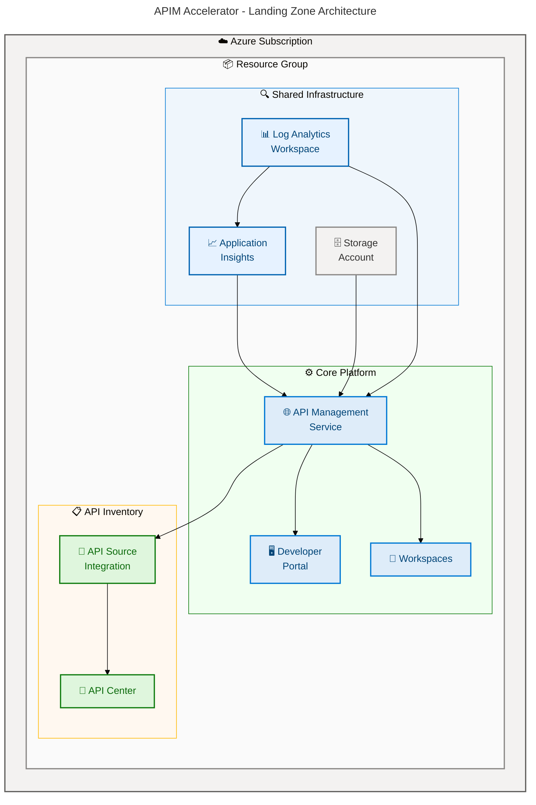

# APIM Accelerator

An enterprise-grade Azure API Management (APIM) Landing Zone accelerator that automates the deployment of a complete API platform using Infrastructure as Code (Bicep) and Azure Developer CLI (`azd`). It provisions API Management with integrated monitoring, developer portal, multi-team workspaces, and centralized API governance through Azure API Center.

> [!NOTE]
> This accelerator follows the [Azure Landing Zone](https://learn.microsoft.com/azure/cloud-adoption-framework/ready/landing-zone/) methodology and is designed for teams adopting a platform engineering approach to API management at scale.

## Table of Contents

- [Overview](#overview)
- [Architecture](#architecture)
- [Features](#features)
- [Requirements](#requirements)
- [Quick Start](#quick-start)
- [Deployment](#deployment)
- [Configuration](#configuration)
- [Project Structure](#project-structure)
- [Contributing](#contributing)
- [License](#license)

## Overview

**Overview**

This accelerator eliminates weeks of manual Azure infrastructure setup by providing production-ready Bicep templates that deploy a fully integrated API Management landing zone in a single command. It targets platform engineering teams, cloud architects, and DevOps engineers who need a repeatable, governed, and observable API platform.

The solution uses a modular, layered deployment pattern — shared monitoring infrastructure is provisioned first, followed by the core API Management platform, and finally the API inventory layer — ensuring correct dependency resolution and consistent environments across dev, test, staging, and production.

> [!TIP]
> Run `azd up` from the repository root to provision the entire landing zone in one step. See [Quick Start](#quick-start) for detailed instructions.

## Architecture

**Overview**

The APIM Accelerator follows a 3-tier modular architecture deployed at the Azure subscription level. Shared infrastructure provides the observability foundation, the core platform delivers API gateway and developer portal capabilities, and the inventory layer enables centralized API governance and discovery.


```mermaid
---
title: "APIM Accelerator - Landing Zone Architecture"
config:
  theme: base
  look: classic
  layout: dagre
  flowchart:
    htmlLabels: true
---
flowchart TB
    accTitle: APIM Accelerator Landing Zone Architecture
    accDescr: Shows the 3-tier deployment architecture with shared monitoring, core API Management platform, and API inventory components deployed into a single resource group

    subgraph subscription["☁️ Azure Subscription"]
        direction TB

        subgraph rg["📦 Resource Group"]
            direction TB

            subgraph shared["🔍 Shared Infrastructure"]
                direction LR
                law["📊 Log Analytics\nWorkspace"]:::core
                ai["📈 Application\nInsights"]:::core
                sa["🗄️ Storage\nAccount"]:::data
            end

            subgraph core["⚙️ Core Platform"]
                direction LR
                apim["🌐 API Management\nService"]:::primary
                portal["🖥️ Developer\nPortal"]:::primary
                ws["📂 Workspaces"]:::primary
            end

            subgraph inventory["📋 API Inventory"]
                direction LR
                apicenter["📑 API Center"]:::success
                apisource["🔗 API Source\nIntegration"]:::success
            end
        end
    end

    law --> ai
    ai --> apim
    sa --> apim
    law --> apim
    apim --> portal
    apim --> ws
    apim --> apisource
    apisource --> apicenter

    style subscription fill:#F3F2F1,stroke:#605E5C,stroke-width:2px
    style rg fill:#FAFAFA,stroke:#8A8886,stroke-width:2px
    style shared fill:#EFF6FC,stroke:#0078D4,stroke-width:1px
    style core fill:#F0FFF0,stroke:#107C10,stroke-width:1px
    style inventory fill:#FFF8F0,stroke:#FFB900,stroke-width:1px

    classDef primary fill:#DEECF9,stroke:#0078D4,stroke-width:2px,color:#004578
    classDef core fill:#E6F2FF,stroke:#0063B1,stroke-width:2px,color:#004578
    classDef success fill:#DFF6DD,stroke:#107C10,stroke-width:2px,color:#0B6A0B
    classDef data fill:#F3F2F1,stroke:#8A8886,stroke-width:2px,color:#323130
```

**Component Roles:**

| Component                  | Purpose                                                             | Module                               |
| -------------------------- | ------------------------------------------------------------------- | ------------------------------------ |
| 📊 Log Analytics Workspace | Centralized log collection, KQL queries, and diagnostics            | `src/shared/monitoring/operational/` |
| 📈 Application Insights    | Application performance monitoring (APM) and distributed tracing    | `src/shared/monitoring/insights/`    |
| 🗄️ Storage Account         | Long-term diagnostic log retention and compliance archival          | `src/shared/monitoring/operational/` |
| 🌐 API Management          | API gateway, policies, rate limiting, and caching                   | `src/core/apim.bicep`                |
| 🖥️ Developer Portal        | Self-service API discovery, testing, and Azure AD authentication    | `src/core/developer-portal.bicep`    |
| 📂 Workspaces              | Multi-team API isolation within a single APIM instance              | `src/core/workspaces.bicep`          |
| 📑 API Center              | Centralized API catalog, governance, and compliance management      | `src/inventory/main.bicep`           |
| 🔗 API Source Integration  | Automatic API discovery and synchronization from APIM to API Center | `src/inventory/main.bicep`           |

**Deployment Sequence:**

1. **Resource Group** — Created at subscription scope
2. **Shared Infrastructure** — Log Analytics, Application Insights, and Storage Account
3. **Core Platform** — API Management service, developer portal, and workspaces (depends on monitoring)
4. **API Inventory** — API Center and API source integration (depends on APIM)

## Features

**Overview**

The accelerator provides six core capabilities that reduce the time to deploy a production-ready API Management platform from weeks to minutes. Each feature is designed for enterprise environments where governance, observability, and multi-team support are requirements, not luxuries.

These capabilities work together as a cohesive platform: monitoring feeds into diagnostics, workspaces enable team isolation, and API Center provides governance across the entire API landscape.

| Feature                   | Description                                                                                                                                                                                                                                                                                                                         | Status    |
| ------------------------- | ----------------------------------------------------------------------------------------------------------------------------------------------------------------------------------------------------------------------------------------------------------------------------------------------------------------------------------- | --------- |
| 🚀 One-Command Deployment | Full landing zone provisioning via Azure Developer CLI. Eliminates manual multi-step Azure setup so teams can go from zero to a running API platform in minutes. A single `azd up` orchestrates resource group creation, monitoring, APIM, and API Center in the correct dependency order.                                          | ✅ Stable |
| 🔍 Integrated Monitoring  | End-to-end observability stack combining Log Analytics, Application Insights, and a Storage Account. Ensures every API call, performance metric, and diagnostic log is captured from day one for troubleshooting and compliance. Deploys automatically as the first tier so all downstream resources emit telemetry immediately.    | ✅ Stable |
| 🖥️ Developer Portal       | Self-service API discovery and testing portal secured with Azure Active Directory. Empowers API consumers to onboard independently, reducing support burden on platform teams. Configures CORS, Azure AD identity provider, sign-in/sign-up flows, and terms of service through Bicep templates.                                    | ✅ Stable |
| 📂 Workspace Isolation    | Logical multi-team separation within a single APIM instance using Premium-tier workspaces. Avoids the cost and operational overhead of running multiple APIM instances while giving each team independent API lifecycle management. Each workspace is created as a child resource with its own APIs, products, and subscriptions.   | ✅ Stable |
| 📑 API Governance         | Centralized API catalog and compliance management powered by Azure API Center. Provides organization-wide visibility into all APIs, preventing sprawl and enforcing governance policies. Automatically registers APIM as an API source and assigns Data Reader and Compliance Manager RBAC roles for discovery and synchronization. | ✅ Stable |
| 🔒 Managed Identity       | Credential-free authentication for all deployed resources using Azure Managed Identities. Eliminates secrets rotation and reduces the attack surface for service-to-service communication. Supports both system-assigned and user-assigned identity types, configured per resource through `infra/settings.yaml`.                   | ✅ Stable |
| 🌍 Multi-Environment      | Single codebase deployable across dev, test, staging, prod, and UAT environments. Enables consistent infrastructure promotion through the release pipeline without template duplication. Environment name and region are injected at deployment time via `azd` parameters, and all resource names and tags adapt automatically.     | ✅ Stable |

## Requirements

**Overview**

Before deploying the APIM Accelerator, you need an active Azure subscription with sufficient permissions and a small set of CLI tools. The accelerator handles all resource provisioning automatically, but the prerequisites below ensure a smooth deployment experience.

All tools listed are freely available and well-documented. The Azure Developer CLI orchestrates the deployment, Azure CLI provides authentication, and Bicep is included with the Azure CLI starting from version 2.20.0.

| Requirement                    | Minimum Version                         | Purpose                                           |
| ------------------------------ | --------------------------------------- | ------------------------------------------------- |
| ☁️ Azure Subscription          | Active subscription                     | Target environment for resource deployment        |
| 🔑 Azure Permissions           | Contributor + User Access Administrator | Create resources and assign RBAC roles            |
| 🛠️ Azure CLI                   | 2.50.0+                                 | Authentication and resource management            |
| ⚡ Azure Developer CLI (`azd`) | 1.0.0+                                  | Deployment orchestration and lifecycle management |
| 🔗 Bicep CLI                   | 0.22.0+ (bundled with Azure CLI)        | Infrastructure as Code compilation                |
| 🌐 Git                         | 2.0+                                    | Repository cloning                                |

> [!IMPORTANT]
> The deployment creates resources using the **Premium** SKU by default, which incurs significant costs. For non-production environments, update the SKU to `Developer` in `infra/settings.yaml`. See [Configuration](#configuration) for details.

## Quick Start

**Overview**

Get the APIM Accelerator running in your Azure subscription in under 10 minutes. This guide walks through the minimal steps to clone the repository, authenticate, and deploy the full landing zone.

```bash
# Clone the repository
git clone https://github.com/Evilazaro/APIM-Accelerator.git
cd APIM-Accelerator

# Authenticate with Azure
az login
azd auth login

# Deploy the entire landing zone (prompts for environment name and region)
azd up
```

The `azd up` command will:

1. Run the pre-provision hook to purge any soft-deleted APIM instances in the target region
2. Create a resource group following the naming convention `apim-accelerator-{env}-{region}-rg`
3. Deploy shared monitoring infrastructure (Log Analytics, Application Insights, Storage Account)
4. Deploy the core API Management service with developer portal and workspaces
5. Deploy API Center with automatic APIM integration

## Deployment

**Overview**

The accelerator supports multiple deployment approaches depending on your workflow. The recommended path uses Azure Developer CLI for full lifecycle management, but direct Bicep deployment is also supported for teams with existing CI/CD pipelines.

### Option 1: Azure Developer CLI (Recommended)

```bash
# Initialize a new environment
azd env new dev

# Set the target Azure region
azd env set AZURE_LOCATION eastus

# Provision infrastructure only
azd provision

# Or provision and deploy in one step
azd up
```

### Option 2: Direct Azure CLI Deployment

```bash
# Deploy using Azure CLI directly
az deployment sub create \
  --location eastus \
  --template-file infra/main.bicep \
  --parameters envName=dev location=eastus
```

### Environment Management

The `azd` CLI supports managing multiple environments for different stages:

```bash
# Create environments for each stage
azd env new dev
azd env new staging
azd env new prod

# Switch between environments
azd env select staging

# Deploy to the selected environment
azd up
```

### Pre-Provision Hook

The deployment includes a pre-provision hook (`infra/azd-hooks/pre-provision.sh`) that automatically purges soft-deleted APIM instances in the target region. This prevents naming conflicts during redeployments.

## Configuration

**Overview**

All environment-specific settings are centralized in `infra/settings.yaml`, while deployment-time parameters are passed through `infra/main.parameters.json`. Together, these two files control every aspect of the landing zone: resource naming, SKU selection, scaling, identity, networking, developer portal, monitoring, API governance, and tagging. Empty name fields trigger automatic name generation using a deterministic unique suffix derived from the subscription, resource group, solution name, and region.

The configuration is organized into three tiers matching the deployment architecture — shared infrastructure, core platform, and API inventory — each with dedicated tags for granular cost tracking and governance. The sections below document every configurable property, its allowed values, and common scenarios.

### Configuration File Structure

```yaml
# infra/settings.yaml — Complete reference
solutionName: "apim-accelerator"

shared:
  monitoring:
    logAnalytics:
      name: "" # Leave empty for auto-generated name
      workSpaceResourceId: "" # Existing workspace ID (empty = create new)
      identity:
        type: "SystemAssigned" # SystemAssigned | UserAssigned
        userAssignedIdentities: [] # Resource IDs of user-assigned identities
    applicationInsights:
      name: "" # Leave empty for auto-generated name
      logAnalyticsWorkspaceResourceId: "" # Auto-linked to deployed workspace if empty
    tags:
      lz-component-type: "shared"
      component: "monitoring"
  tags:
    CostCenter: "CC-1234"
    BusinessUnit: "IT"
    Owner: "your-email@domain.com"
    ApplicationName: "APIM Platform"
    ProjectName: "APIMForAll"
    ServiceClass: "Critical"
    RegulatoryCompliance: "GDPR"
    SupportContact: "your-email@domain.com"
    ChargebackModel: "Dedicated"
    BudgetCode: "FY25-Q1-InitiativeX"

core:
  apiManagement:
    name: "" # Leave empty for auto-generated name
    publisherEmail: "admin@contoso.com" # Required by Azure — shown in portal
    publisherName: "Contoso" # Organization name in developer portal
    sku:
      name: "Premium" # Developer | Basic | BasicV2 | Standard | StandardV2 | Premium | Consumption
      capacity: 1 # Scale units (Premium: 1-10, Standard: 1-4)
    identity:
      type: "SystemAssigned" # SystemAssigned | UserAssigned
      userAssignedIdentities: [] # Resource IDs of user-assigned identities
    workspaces:
      - name: "workspace1" # Premium SKU only — add more entries for additional teams
  tags:
    lz-component-type: "core"
    component: "apiManagement"

inventory:
  apiCenter:
    name: "" # Leave empty for auto-generated name
    identity:
      type: "SystemAssigned" # SystemAssigned | UserAssigned | SystemAssigned, UserAssigned | None
      userAssignedIdentities: [] # Resource IDs of user-assigned identities
  tags:
    lz-component-type: "shared"
    component: "inventory"
```

### Environment Parameters

Deployment parameters are passed via `infra/main.parameters.json` and support Azure Developer CLI variable substitution:

| Parameter     | Description                                                               | Allowed Values                          | Example                           |
| ------------- | ------------------------------------------------------------------------- | --------------------------------------- | --------------------------------- |
| 🌍 `envName`  | Target environment identifier — controls resource sizing and tagging      | `dev`, `test`, `staging`, `prod`, `uat` | `dev`                             |
| 📍 `location` | Azure region for all resource deployment — must support APIM Premium tier | Any Azure region                        | `eastus`, `westus2`, `westeurope` |

```bash
# Set parameters via azd
azd env set AZURE_ENV_NAME dev
azd env set AZURE_LOCATION eastus
```

### API Management Configuration

The core APIM service is configured under `core.apiManagement` in `infra/settings.yaml`.

| Setting            | Path                                                 | Options                                                               | Default               | Notes                                                  |
| ------------------ | ---------------------------------------------------- | --------------------------------------------------------------------- | --------------------- | ------------------------------------------------------ |
| 🏷️ Service Name    | `core.apiManagement.name`                            | Any string (or empty for auto)                                        | `""` (auto)           | Auto-generated as `{solutionName}-{uniqueSuffix}-apim` |
| 📧 Publisher Email | `core.apiManagement.publisherEmail`                  | Valid email address                                                   | `evilazaro@gmail.com` | Required by Azure — used for notifications             |
| 🏢 Publisher Name  | `core.apiManagement.publisherName`                   | Any string                                                            | `Contoso`             | Displayed in the developer portal header               |
| ⚙️ SKU Tier        | `core.apiManagement.sku.name`                        | Developer, Basic, BasicV2, Standard, StandardV2, Premium, Consumption | `Premium`             | See [SKU Selection Guide](#sku-selection-guide) below  |
| 📊 Scale Units     | `core.apiManagement.sku.capacity`                    | 1-10 (Premium), 1-4 (Standard), 0 (Consumption)                       | `1`                   | Each unit adds throughput capacity                     |
| 🔒 Identity Type   | `core.apiManagement.identity.type`                   | SystemAssigned, UserAssigned                                          | `SystemAssigned`      | Controls how APIM authenticates to Azure services      |
| 🔑 User Identities | `core.apiManagement.identity.userAssignedIdentities` | Array of resource IDs                                                 | `[]`                  | Required when identity type is UserAssigned            |

#### SKU Selection Guide

| SKU                      | Use Case                                 | SLA          | Key Capabilities                           | Estimated Cost |
| ------------------------ | ---------------------------------------- | ------------ | ------------------------------------------ | -------------- |
| 🧪 Developer             | Non-production, testing, prototyping     | No SLA       | Full feature set, no scaling               | 💲 Low         |
| 📦 Basic / BasicV2       | Small-scale production workloads         | 99.95%       | Limited scale, no VNet                     | 💲💲 Moderate  |
| ⚙️ Standard / StandardV2 | Medium-scale production workloads        | 99.95%       | 1-4 units, external VNet                   | 💲💲💲 Medium  |
| 🏢 Premium               | Enterprise production with full features | 99.95-99.99% | Multi-region, VNet, workspaces, 1-10 units | 💲💲💲💲 High  |
| ⚡ Consumption           | Serverless, pay-per-execution            | 99.95%       | Auto-scale, no fixed cost                  | 💲 Variable    |

> [!WARNING]
> Changing the SKU tier on an existing deployment may cause service downtime. Plan SKU changes during maintenance windows.

```yaml
# Example: Switch to Developer SKU for non-production
core:
  apiManagement:
    sku:
      name: "Developer"
      capacity: 1
```

### Workspace Configuration

Workspaces provide logical isolation within a single APIM instance, enabling different teams or projects to manage APIs independently while sharing infrastructure. Workspaces require the **Premium** SKU.

| Setting       | Path                            | Type                        | Notes                            |
| ------------- | ------------------------------- | --------------------------- | -------------------------------- |
| 📂 Workspaces | `core.apiManagement.workspaces` | Array of `{ name: string }` | Each entry creates one workspace |

```yaml
# Example: Configure workspaces for multiple teams
core:
  apiManagement:
    sku:
      name: "Premium" # Required for workspaces
      capacity: 1
    workspaces:
      - name: "sales-apis"
      - name: "finance-apis"
      - name: "partner-apis"
```

Each workspace acts as a self-contained environment with its own APIs, products, and subscriptions. The workspace name must be unique within the APIM instance and is used both as the resource name and display name.

### Networking Configuration

The APIM Bicep template (`src/core/apim.bicep`) supports three networking modes. These parameters are configurable at deployment time via the Bicep template but are not currently exposed in `infra/settings.yaml` — extend the settings file or pass them as Bicep parameter overrides.

| Setting             | Parameter               | Options                  | Default | Notes                                                             |
| ------------------- | ----------------------- | ------------------------ | ------- | ----------------------------------------------------------------- |
| 🌐 Public Access    | `publicNetworkAccess`   | `true`, `false`          | `true`  | Set `false` for private-only deployments                          |
| 🔗 VNet Type        | `virtualNetworkType`    | None, External, Internal | `None`  | External: gateway public, portal private. Internal: fully private |
| 🏗️ Subnet ID        | `subnetResourceId`      | ARM resource ID          | `""`    | Required when VNet type is External or Internal                   |
| 🖥️ Developer Portal | `enableDeveloperPortal` | `true`, `false`          | `true`  | Enables/disables the self-service developer portal                |

```bash
# Example: Deploy with VNet integration using Azure CLI parameter overrides
az deployment sub create \
  --location eastus \
  --template-file infra/main.bicep \
  --parameters envName=prod location=eastus \
  --parameters virtualNetworkType=Internal \
  --parameters subnetResourceId="/subscriptions/{sub}/resourceGroups/{rg}/providers/Microsoft.Network/virtualNetworks/{vnet}/subnets/{subnet}" \
  --parameters publicNetworkAccess=false
```

> [!NOTE]
> The `src/shared/networking/main.bicep` module is currently a placeholder. For production VNet integration, provision your virtual network and subnet separately, then pass the subnet resource ID to the APIM deployment.

### Developer Portal Configuration

The developer portal is configured through `src/core/developer-portal.bicep` and supports Azure AD authentication, CORS policies, and user registration controls.

| Setting                   | Location                                            | Description                                                    |
| ------------------------- | --------------------------------------------------- | -------------------------------------------------------------- |
| 🔑 Azure AD Client ID     | `developer-portal.bicep` → `clientId` param         | App registration client ID from Azure AD                       |
| 🔒 Azure AD Client Secret | `developer-portal.bicep` → `clientSecret` param     | App registration client secret (secure)                        |
| 🏢 Allowed Tenants        | `developer-portal.bicep` → `allowedTenants` var     | Array of Azure AD tenant domains authorized to sign in         |
| ✅ Sign-In Enabled        | `developer-portal.bicep` → `devPortalSignInSetting` | Enables user authentication on the portal                      |
| 📝 Sign-Up Enabled        | `developer-portal.bicep` → `devPortalSignUpSetting` | Enables new user self-registration                             |
| 📜 Terms of Service       | `developer-portal.bicep` → `termsOfService`         | Requires consent to terms during sign-up                       |
| 🌐 CORS Origins           | `developer-portal.bicep` → `devPortalConfig`        | Auto-configured from APIM portal, gateway, and management URLs |

To customize the allowed Azure AD tenants, edit the `allowedTenants` variable in `src/core/developer-portal.bicep`:

```bicep
// Replace with your organization's tenant domain(s)
var allowedTenants = [
  'contoso.onmicrosoft.com'
  'fabrikam.onmicrosoft.com'
]
```

### Monitoring Configuration

Monitoring settings under `shared.monitoring` control the observability infrastructure deployed before all other resources.

#### Log Analytics Workspace

| Setting               | Path                                                             | Default          | Notes                                                                                            |
| --------------------- | ---------------------------------------------------------------- | ---------------- | ------------------------------------------------------------------------------------------------ |
| 📊 Name               | `shared.monitoring.logAnalytics.name`                            | `""` (auto)      | Auto-generated as `{solutionName}-{uniqueSuffix}-law`                                            |
| 🔗 Existing Workspace | `shared.monitoring.logAnalytics.workSpaceResourceId`             | `""`             | Provide to reuse an existing workspace instead of creating one                                   |
| 🔒 Identity Type      | `shared.monitoring.logAnalytics.identity.type`                   | `SystemAssigned` | SystemAssigned or UserAssigned                                                                   |
| 🔑 User Identities    | `shared.monitoring.logAnalytics.identity.userAssignedIdentities` | `[]`             | Resource IDs for UserAssigned identity                                                           |
| 💰 Pricing Tier       | Bicep default in `operational/main.bicep`                        | `PerGB2018`      | Options: Free, PerGB2018, CapacityReservation, PerNode, Premium, Standard, Standalone, LACluster |

#### Application Insights

| Setting                  | Path                                                                    | Default     | Notes                                                |
| ------------------------ | ----------------------------------------------------------------------- | ----------- | ---------------------------------------------------- |
| 📈 Name                  | `shared.monitoring.applicationInsights.name`                            | `""` (auto) | Auto-generated as `{solutionName}-{uniqueSuffix}-ai` |
| 🔗 Linked Workspace      | `shared.monitoring.applicationInsights.logAnalyticsWorkspaceResourceId` | `""`        | Auto-linked to the deployed Log Analytics workspace  |
| 🌐 Application Type      | Bicep default in `insights/main.bicep`                                  | `web`       | Options: web, ios, other, store, java, phone         |
| 📅 Retention Days        | Bicep default in `insights/main.bicep`                                  | `90`        | Data retention period in days                        |
| 🔐 Public Network Access | Bicep default in `insights/main.bicep`                                  | `Enabled`   | Set to Disabled for private-only ingestion           |

#### Storage Account (Diagnostic Logs)

A storage account is automatically provisioned for long-term log retention. Its name is auto-generated using the `generateStorageAccountName()` utility function with a 24-character limit enforced by Azure.

| Setting            | Source                                             | Default         |
| ------------------ | -------------------------------------------------- | --------------- |
| 🗄️ Redundancy      | `constants.bicep` → `storageAccount.standardLRS`   | `Standard_LRS`  |
| 📦 Account Type    | `constants.bicep` → `storageAccount.storageV2`     | `StorageV2`     |
| 🔤 Max Name Length | `constants.bicep` → `storageAccount.maxNameLength` | `24` characters |

#### Monitoring Tags

```yaml
shared:
  monitoring:
    tags:
      lz-component-type: "shared"
      component: "monitoring"
```

These tags are merged with the shared-level tags and applied to all monitoring resources for cost attribution and resource filtering in the Azure portal.

### API Inventory Configuration

The API inventory layer deploys Azure API Center for centralized API governance and automatic discovery from the APIM service.

| Setting            | Path                                                  | Options                                                           | Default          | Notes                                        |
| ------------------ | ----------------------------------------------------- | ----------------------------------------------------------------- | ---------------- | -------------------------------------------- |
| 📑 API Center Name | `inventory.apiCenter.name`                            | Any string (or empty for auto)                                    | `""` (auto)      | Auto-generated as `{solutionName}-apicenter` |
| 🔒 Identity Type   | `inventory.apiCenter.identity.type`                   | SystemAssigned, UserAssigned, SystemAssigned + UserAssigned, None | `SystemAssigned` | Controls RBAC role assignments               |
| 🔑 User Identities | `inventory.apiCenter.identity.userAssignedIdentities` | Array of resource IDs                                             | `[]`             | Required for UserAssigned identity           |

The deployment automatically:

- Creates a default workspace inside API Center for organizing APIs
- Registers the APIM service as an API source for automatic discovery and synchronization
- Assigns **API Center Data Reader** and **API Center Compliance Manager** RBAC roles to the API Center's managed identity

### Tagging Strategy

Tags are applied at three levels for governance, cost tracking, and compliance. Tags defined at higher levels are inherited by child resources through the `union()` function.

#### Shared Tags (Applied to All Resources)

```yaml
shared:
  tags:
    CostCenter: "CC-1234" # Tracks cost allocation to budget center
    BusinessUnit: "IT" # Business unit or department
    Owner: "your-email@domain.com" # Resource/application owner for accountability
    ApplicationName: "APIM Platform" # Workload or application identifier
    ProjectName: "APIMForAll" # Project or initiative name
    ServiceClass: "Critical" # Workload tier: Critical, Standard, Experimental
    RegulatoryCompliance: "GDPR" # Compliance requirements: GDPR, HIPAA, PCI, None
    SupportContact: "your-email@domain.com" # Incident support contact
    ChargebackModel: "Dedicated" # Chargeback/Showback billing model
    BudgetCode: "FY25-Q1-InitiativeX" # Budget or initiative tracking code
```

#### Component-Level Tags

Each deployment tier adds component-specific tags:

| Tier          | Tags                                                      | Purpose                             |
| ------------- | --------------------------------------------------------- | ----------------------------------- |
| 🔍 Monitoring | `lz-component-type: "shared"`, `component: "monitoring"`  | Identifies monitoring resources     |
| ⚙️ Core APIM  | `lz-component-type: "core"`, `component: "apiManagement"` | Identifies API Management resources |
| 📋 Inventory  | `lz-component-type: "shared"`, `component: "inventory"`   | Identifies API Center resources     |

#### Deployment-Injected Tags

The orchestration template automatically adds these tags at deployment time:

| Tag                  | Value                                   | Source                          |
| -------------------- | --------------------------------------- | ------------------------------- |
| 🌍 `environment`     | `dev`, `test`, `staging`, `prod`, `uat` | `envName` parameter             |
| 🔧 `managedBy`       | `bicep`                                 | Hardcoded in `infra/main.bicep` |
| 📌 `templateVersion` | `2.0.0`                                 | Hardcoded in `infra/main.bicep` |

### Resource Naming Conventions

Resources follow a consistent naming pattern. When a name is left empty in `infra/settings.yaml`, names are auto-generated using a deterministic unique suffix produced by the `generateUniqueSuffix()` function (based on subscription ID, resource group ID, solution name, and region).

| Resource           | Naming Pattern                              | Suffix      | Example                          |
| ------------------ | ------------------------------------------- | ----------- | -------------------------------- |
| 📦 Resource Group  | `{solutionName}-{envName}-{location}-rg`    | `rg`        | `apim-accelerator-dev-eastus-rg` |
| 🌐 API Management  | `{solutionName}-{uniqueSuffix}-apim`        | `apim`      | `apim-accelerator-abc123-apim`   |
| 📊 Log Analytics   | `{solutionName}-{uniqueSuffix}-law`         | `law`       | `apim-accelerator-abc123-law`    |
| 📈 App Insights    | `{solutionName}-{uniqueSuffix}-ai`          | `ai`        | `apim-accelerator-abc123-ai`     |
| 🗄️ Storage Account | `{baseName}sa{uniqueSuffix}` (max 24 chars) | `sa`        | `apimacceleratorsa4f2c`          |
| 📑 API Center      | `{solutionName}-apicenter`                  | `apicenter` | `apim-accelerator-apicenter`     |

> [!TIP]
> To use explicit resource names instead of auto-generated ones, set the `name` field in the corresponding `infra/settings.yaml` section. This is useful when your organization enforces specific naming policies.

### Common Configuration Scenarios

#### Non-Production / Cost-Optimized Deployment

```yaml
solutionName: "apim-accelerator"
core:
  apiManagement:
    sku:
      name: "Developer" # No SLA, lowest cost
      capacity: 1
    workspaces: [] # Workspaces not supported on Developer SKU
```

#### Multi-Team Production Deployment

```yaml
solutionName: "enterprise-apis"
core:
  apiManagement:
    publisherEmail: "api-platform@contoso.com"
    publisherName: "Contoso API Platform"
    sku:
      name: "Premium"
      capacity: 2 # 2 scale units for higher throughput
    identity:
      type: "SystemAssigned"
      userAssignedIdentities: []
    workspaces:
      - name: "payments-team"
      - name: "logistics-team"
      - name: "mobile-team"
      - name: "partner-integrations"
```

#### User-Assigned Managed Identity

```yaml
core:
  apiManagement:
    identity:
      type: "UserAssigned"
      userAssignedIdentities:
        - "/subscriptions/{sub-id}/resourceGroups/{rg}/providers/Microsoft.ManagedIdentity/userAssignedIdentities/{identity-name}"

inventory:
  apiCenter:
    identity:
      type: "UserAssigned"
      userAssignedIdentities:
        - "/subscriptions/{sub-id}/resourceGroups/{rg}/providers/Microsoft.ManagedIdentity/userAssignedIdentities/{identity-name}"
```

#### Reusing an Existing Log Analytics Workspace

```yaml
shared:
  monitoring:
    logAnalytics:
      name: "existing-workspace-name"
      workSpaceResourceId: "/subscriptions/{sub}/resourceGroups/{rg}/providers/Microsoft.OperationalInsights/workspaces/{name}"
    applicationInsights:
      logAnalyticsWorkspaceResourceId: "/subscriptions/{sub}/resourceGroups/{rg}/providers/Microsoft.OperationalInsights/workspaces/{name}"
```

## Project Structure

```text
APIM-Accelerator/
├── azure.yaml                        # Azure Developer CLI configuration
├── LICENSE                           # MIT License
├── infra/                            # Infrastructure deployment
│   ├── main.bicep                    # Main orchestration template (subscription scope)
│   ├── main.parameters.json          # Deployment parameters with azd variable support
│   ├── settings.yaml                 # Centralized environment configuration
│   └── azd-hooks/
│       └── pre-provision.sh          # Pre-deployment hook for APIM cleanup
└── src/                              # Modular Bicep source templates
    ├── core/                         # Core API Management platform
    │   ├── main.bicep                # Core module orchestrator
    │   ├── apim.bicep                # APIM service resource definition
    │   ├── developer-portal.bicep    # Developer portal with Azure AD auth
    │   └── workspaces.bicep          # Workspace isolation configuration
    ├── inventory/                    # API governance and catalog
    │   └── main.bicep                # API Center with APIM integration
    └── shared/                       # Shared infrastructure services
        ├── main.bicep                # Shared module orchestrator
        ├── common-types.bicep        # Reusable Bicep type definitions
        ├── constants.bicep           # Shared constants and utility functions
        ├── monitoring/               # Observability infrastructure
        │   ├── main.bicep            # Monitoring orchestrator
        │   ├── insights/
        │   │   └── main.bicep        # Application Insights deployment
        │   └── operational/
        │       └── main.bicep        # Log Analytics and Storage Account
        └── networking/
            └── main.bicep            # Network infrastructure (placeholder)
```

## Contributing

**Overview**

Contributions are welcome and encouraged. Whether you are fixing a bug, improving documentation, or adding a new feature, your input helps make this accelerator better for the entire community. The project follows standard GitHub collaboration workflows.

To contribute, fork the repository, create a feature branch, make your changes, and submit a pull request. Please ensure your Bicep templates follow the existing naming conventions and include descriptive `@description` decorators on all parameters, variables, and resources.

1. **Fork** the repository
2. **Create** a feature branch: `git checkout -b feature/my-improvement`
3. **Commit** your changes: `git commit -m "Add my improvement"`
4. **Push** to your branch: `git push origin feature/my-improvement`
5. **Open** a Pull Request against the `main` branch

### Coding Guidelines

- Use `@description()` decorators on all Bicep parameters, variables, and resources
- Follow the naming convention: `{solutionName}-{uniqueSuffix}-{resourceType}`
- Include module-level documentation comments at the top of each `.bicep` file
- Add tags to all deployed resources for governance and cost tracking

## License

This project is licensed under the **MIT License**. See the [LICENSE](LICENSE) file for details.

Copyright (c) 2025 Evilázaro Alves
