# APIM Accelerator

A production-ready Azure API Management landing zone accelerator that deploys enterprise-grade API infrastructure using Infrastructure as Code (Bicep) with integrated monitoring, governance, and multi-tenancy support.

## Overview

**APIM Accelerator** is a comprehensive Infrastructure as Code (IaC) solution that automates the deployment of Azure API Management (APIM) landing zones with best-practice configurations. Built with Azure Bicep and integrated with Azure Developer CLI (`azd`), this accelerator provides organizations with a rapid, standardized approach to deploying secure, observable, and governable API infrastructure.

> 💡 **Why This Matters**: Traditional APIM deployments can take weeks to configure with monitoring, security, and governance. This accelerator reduces deployment time to under 30 minutes while ensuring enterprise compliance, comprehensive observability, and API governance through Azure API Center integration.

> 📌 **How It Works**: The accelerator uses a modular Bicep architecture that orchestrates the deployment of three core layers: shared monitoring infrastructure (Log Analytics, Application Insights), core APIM platform with workspace isolation, and API inventory management through Azure API Center. All components are deployed with pre-configured diagnostic settings, RBAC roles, and enterprise tagging strategies.

### Key Value Propositions

- **Rapid Deployment**: Deploy production-ready APIM infrastructure in minutes using `azd up`
- **Enterprise Compliance**: Built-in governance tags, diagnostic logging, and regulatory compliance patterns (GDPR, HIPAA, PCI)
- **Multi-Tenancy Ready**: Workspace-based isolation enables multiple teams to share APIM infrastructure securely
- **Full Observability**: Integrated Log Analytics and Application Insights with comprehensive diagnostic settings
- **API Governance**: Automated integration with Azure API Center for centralized API catalog and compliance management
- **Flexible Configuration**: YAML-based settings enable environment-specific customization without modifying templates

## Architecture

**Overview**

The APIM Accelerator implements a 3-tier modular architecture following Azure landing zone best practices. Resources are organized into shared services, core platform, and governance layers with clear dependencies and deployment sequencing.

```mermaid
---
title: "APIM Accelerator - 3-Tier Landing Zone Architecture"
---
flowchart TB
    subgraph azure["☁️ Azure Subscription"]
        subgraph rg["📦 Resource Group: apim-accelerator-{env}-{location}-rg"]

            subgraph shared["🔧 Shared Services Layer"]
                direction TB
                law["📊 Log Analytics Workspace<br/>Centralized logging"]
                ai["📈 Application Insights<br/>APM & diagnostics"]
                sa["💾 Storage Account<br/>Log archival"]
                law --> ai
                law --> sa
            end

            subgraph core["🎯 Core Platform Layer"]
                direction TB
                apim["🚀 API Management Service<br/>Premium SKU<br/>Managed Identity"]
                portal["🌐 Developer Portal<br/>OAuth2 / OpenID Connect"]
                ws["👥 Workspaces<br/>Multi-tenant isolation"]
                apim --> portal
                apim --> ws
            end

            subgraph inventory["📋 Governance Layer"]
                direction TB
                apic["📚 API Center<br/>Centralized catalog"]
                apis["🔗 API Source<br/>APIM integration"]
                rbac["🔐 RBAC Roles<br/>Data Reader & Compliance Manager"]
                apic --> apis
                apic --> rbac
            end

            shared -.->|Diagnostic Logs| core
            core -.->|API Discovery| inventory
            core -.->|Telemetry| ai
            core -.->|Logs| law
        end
    end

    subgraph deployment["🚀 Deployment Tools"]
        azd["Azure Developer CLI<br/>azd up"]
        bicep["Bicep Templates<br/>IaC Orchestration"]
        hooks["Pre-provision Hooks<br/>Validation & Setup"]
        azd --> hooks
        hooks --> bicep
    end

    deployment ==>|Provisions| azure

    style azure fill:#E8F4FD,stroke:#0078D4,stroke-width:2px
    style shared fill:#D4EDDA,stroke:#28A745,stroke-width:2px
    style core fill:#FFF3CD,stroke:#FFC107,stroke-width:2px
    style inventory fill:#F8D7DA,stroke:#DC3545,stroke-width:2px
    style deployment fill:#E7E9EB,stroke:#5C636A,stroke-width:2px
```



**Component Roles:**

- **Shared Services Layer**: Provides foundational monitoring infrastructure (Log Analytics, Application Insights, Storage) used by all downstream services
- **Core Platform Layer**: Hosts the API Management service with developer portal, managed identity authentication, and workspace-based multi-tenancy
- **Governance Layer**: Delivers centralized API catalog and compliance management through Azure API Center with automated APIM integration
- **Deployment Tools**: Automates infrastructure provisioning using Azure Developer CLI with Bicep templates and validation hooks

## Features

**Overview**

APIM Accelerator provides five core capabilities designed for enterprise API platform teams. Each feature addresses critical requirements in modern API management: rapid deployment, security, observability, governance, and flexibility.

> 💡 **Why Features Matter**: Manual APIM setup requires extensive Azure expertise and 40+ hours of configuration. These features encapsulate Azure best practices into automated, repeatable deployments that ensure consistency across environments while reducing human error and deployment time by 95%.

> 📌 **How They Work**: Features are implemented as modular Bicep templates with declarative YAML configuration. Each module deploys Azure resources with pre-configured security baselines, diagnostic settings, and RBAC assignments. The orchestration layer manages dependencies and validates prerequisites automatically through `azd` lifecycle hooks.

| Feature                                   | Description                                                                                                          |  Status   | Evidence                                                                                                                  |
| :---------------------------------------- | :------------------------------------------------------------------------------------------------------------------- | :-------: | :------------------------------------------------------------------------------------------------------------------------ |
| 🚀 **One-Command Deployment**             | Deploy complete APIM landing zone using `azd up` with automated resource provisioning, validation, and configuration | ✅ Stable | [`azure.yaml`](azure.yaml) lifecycle hooks                                                                                |
| 🔐 **Security-First Design**              | Managed Identity authentication, RBAC role assignments, and secure credential management without hardcoded secrets   | ✅ Stable | [`src/core/apim.bicep`](src/core/apim.bicep) identity config, [`src/inventory/main.bicep`](src/inventory/main.bicep) RBAC |
| 📊 **Comprehensive Observability**        | Integrated Log Analytics, Application Insights, and diagnostic settings across all services with log archival        | ✅ Stable | [`src/shared/monitoring/main.bicep`](src/shared/monitoring/main.bicep)                                                    |
| 🏢 **Multi-Tenancy Support**              | Workspace-based isolation enabling multiple teams to share infrastructure with independent API lifecycle management  | ✅ Stable | [`src/core/workspaces.bicep`](src/core/workspaces.bicep)                                                                  |
| 📋 **API Governance & Catalog**           | Automated Azure API Center integration for centralized API inventory, versioning, and compliance tracking            | ✅ Stable | [`src/inventory/main.bicep`](src/inventory/main.bicep) API source integration                                             |
| ⚙️ **Environment-Specific Configuration** | YAML-based settings supporting dev, test, staging, prod, and UAT environments with flexible SKU sizing               | ✅ Stable | [`infra/settings.yaml`](infra/settings.yaml)                                                                              |
| 🏷️ **Enterprise Tagging Strategy**        | Built-in governance tags for cost allocation, compliance tracking, and resource ownership management                 | ✅ Stable | [`infra/settings.yaml`](infra/settings.yaml) tags section                                                                 |

## Requirements

**Overview**

Successful deployment requires specific Azure permissions, installed tooling, and network connectivity. All prerequisites can be validated using the pre-provision hook script included in the accelerator.

> ⚠️ **Important**: The Premium SKU (default configuration) requires sufficient Azure subscription quota. Developer SKU can be used for testing environments with reduced capacity requirements.

### Azure Prerequisites

| Requirement                 | Minimum Version | Purpose                                                                                          | Validation                                            |
| :-------------------------- | :-------------- | :----------------------------------------------------------------------------------------------- | :---------------------------------------------------- |
| ☁️ **Azure Subscription**   | N/A             | Active subscription with Owner or Contributor + User Access Administrator roles                  | `az account show`                                     |
| 🔑 **Azure Permissions**    | N/A             | Ability to create resource groups, assign RBAC roles, and deploy resources at subscription scope | `az role assignment list --scope /subscriptions/{id}` |
| 📦 **API Management Quota** | 1 Premium unit  | Sufficient quota for Premium SKU APIM service (or adjust to Developer SKU in settings)           | Azure Portal → Quotas                                 |
| 🌐 **Network Access**       | N/A             | Connectivity to Azure management endpoints (management.azure.com) and Azure DevOps (if using)    | `curl https://management.azure.com`                   |

### Local Development Tools

| Tool                       | Minimum Version              | Installation Command                                                                                                                    | Purpose                                           |
| :------------------------- | :--------------------------- | :-------------------------------------------------------------------------------------------------------------------------------------- | :------------------------------------------------ |
| 🛠️ **Azure CLI**           | 2.50.0+                      | [Install Azure CLI](https://learn.microsoft.com/cli/azure/install-azure-cli)                                                            | Deploy Bicep templates and manage Azure resources |
| 🚀 **Azure Developer CLI** | 1.5.0+                       | `winget install Microsoft.Azd` (Windows) or [azd install](https://learn.microsoft.com/azure/developer/azure-developer-cli/install-azd)  | Orchestrate deployment with lifecycle hooks       |
| 📜 **Bicep CLI**           | 0.25.0+                      | Installed with Azure CLI 2.20.0+                                                                                                        | Compile and validate Bicep templates              |
| 🐚 **Bash / PowerShell**   | Bash 4.0+ or PowerShell 7.0+ | Pre-installed on Linux/macOS, [PowerShell 7](https://learn.microsoft.com/powershell/scripting/install/installing-powershell) on Windows | Execute pre-provision hooks                       |

### Supported Azure Regions

The accelerator supports all Azure regions with API Management Premium tier availability. Recommended regions for production:

- 🌍 **Americas**: `eastus`, `eastus2`, `westus`, `westus2`, `centralus`
- 🌍 **Europe**: `westeurope`, `northeurope`, `uksouth`, `francecentral`
- 🌏 **Asia Pacific**: `southeastasia`, `australiaeast`, `japaneast`

**Region Selection Guidance**: Choose regions close to API consumers to minimize latency. Premium SKU supports multi-region deployment for disaster recovery.

## Quick Start

Get your APIM landing zone running in under 10 minutes with Azure Developer CLI.

> 💡 **Before You Begin**: Ensure Azure CLI and Azure Developer CLI (`azd`) are installed. Login to Azure using `az login` and verify you have Contributor + User Access Administrator permissions.

### 1. Clone and Initialize

```bash
# Clone the repository
git clone https://github.com/Evilazaro/APIM-Accelerator.git
cd APIM-Accelerator

# Login to Azure (if not already authenticated)
azd auth login

# Initialize the environment (prompts for subscription and region)
azd init
```

**Expected Output:**

```
? Select an Azure Subscription: [Use arrows to move, type to filter]
> My Subscription (xxxx-xxxx-xxxx)
? Select an Azure location to use: eastus
SUCCESS: Environment initialized
```

### 2. Configure Settings (Optional)

Edit [`infra/settings.yaml`](infra/settings.yaml) to customize your deployment:

```yaml
# Key settings to review before deployment
solutionName: "apim-accelerator" # Change to match your naming convention

core:
  apiManagement:
    publisherEmail: "youremail@company.com" # Required: APIM publisher email
    publisherName: "Your Organization" # Organization name in developer portal
    sku:
      name: "Premium" # Options: Developer, Basic, Standard, Premium
      capacity: 1 # Number of scale units (Premium: 1-10)

shared:
  tags:
    CostCenter: "CC-1234" # Update for your cost allocation model
    Owner: "yourteam@company.com" # Resource ownership contact
    RegulatoryCompliance: "GDPR" # Compliance requirements (GDPR, HIPAA, PCI, None)
```

> ⚠️ **Important**: Update `publisherEmail` and `publisherName` before deployment as these are required APIM configuration fields.

### 3. Deploy Infrastructure

```bash
# Provision and deploy all resources with a single command
azd up

# Alternative: Step-by-step deployment
azd provision  # Provision infrastructure only
azd deploy     # Deploy application code (if applicable)
```

**Expected Output:**

```
Provisioning Azure resources (azd provision)
  ✓ Running pre-provision hook
  ✓ Creating resource group: apim-accelerator-dev-eastus-rg
  ✓ Deploying shared monitoring infrastructure
  ✓ Deploying core API Management service (this may take 20-30 minutes)
  ✓ Deploying API Center inventory

SUCCESS: Your infrastructure is ready!

🔗 API Management portal: https://apim-accelerator-dev-eastus.portal.azure-api.net
📊 Application Insights: apim-accelerator-dev-eastus-ai
```

> 📌 **Note**: APIM provisioning can take 20-40 minutes depending on SKU and region. Monitor progress in [Azure Portal](https://portal.azure.com) or use `az deployment group show` to check status.

### 4. Verify Deployment

```bash
# Show deployed resources
azd show

# Open developer portal in browser
azd open apim-portal
```

**Verification Checklist:**

- ✅ API Management service in "Online" state (Azure Portal)
- ✅ Developer portal accessible at displayed URL
- ✅ Log Analytics workspace receiving logs (may take 5-10 minutes)
- ✅ API Center shows connected APIM source

**Next Steps**: See [Usage](#usage) section to configure APIs, policies, and subscriptions.

## Deployment

This section provides detailed deployment guidance for different scenarios and environments.

### Standard Deployment (Azure Developer CLI)

**Recommended Approach**: Use `azd` for automated deployment with lifecycle hooks.

```bash
# Full deployment lifecycle
azd up

# Individual commands for granular control
azd provision  # Infrastructure only
azd package    # Package application artifacts (if applicable)
azd deploy     # Deploy application code
```

**Environment Variables**: `azd` automatically manages environment variables. View current config:

```bash
azd env get-values
```

**Output Example:**

```
AZURE_SUBSCRIPTION_ID="xxxx-xxxx-xxxx"
AZURE_LOCATION="eastus"
AZURE_RESOURCE_GROUP="apim-accelerator-dev-eastus-rg"
AZURE_LOG_ANALYTICS_WORKSPACE_ID="/subscriptions/.../resourceGroups/.../providers/..."
APPLICATION_INSIGHTS_NAME="apim-accelerator-dev-eastus-ai"
```

### Manual Deployment (Azure CLI with Bicep)

For CI/CD integration or custom deployment pipelines:

```bash
# Set variables
SUBSCRIPTION_ID="your-subscription-id"
LOCATION="eastus"
ENV_NAME="dev"  # Options: dev, test, staging, prod, uat

# Create deployment
az deployment sub create \
  --location $LOCATION \
  --template-file infra/main.bicep \
  --parameters envName=$ENV_NAME location=$LOCATION \
  --subscription $SUBSCRIPTION_ID \
  --name "apim-accelerator-$(date +%Y%m%d-%H%M%S)"
```

**Monitor Deployment Progress:**

```bash
# Watch deployment status (replace with actual deployment name)
az deployment sub show \
  --name apim-accelerator-20260212-143000 \
  --query "properties.provisioningState" \
  --output table
```

### Multi-Environment Deployment

Deploy separate environments (dev, test, prod) with environment-specific configurations:

```bash
# Create separate azd environments
azd env new dev
azd env new test
azd env new prod

# Deploy to specific environment
azd env select dev
azd up

# Switch to production environment
azd env select prod
# Review settings.yaml for prod-specific configs
azd up
```

**Environment Isolation**: Each `azd` environment maintains separate:

- Resource groups (naming: `{solution}-{env}-{location}-rg`)
- Configuration values (stored in `.azure/{env}/.env`)
- Deployment history and state

### CI/CD Integration

**GitHub Actions Example:**

```yaml
name: Deploy APIM Accelerator

on:
  push:
    branches: [main]

jobs:
  deploy:
    runs-on: ubuntu-latest
    steps:
      - uses: actions/checkout@v4

      - name: Login to Azure
        uses: azure/login@v1
        with:
          creds: ${{ secrets.AZURE_CREDENTIALS }}

      - name: Install azd
        uses: Azure/setup-azd@v1

      - name: Deploy infrastructure
        run: azd up --no-prompt
        env:
          AZURE_SUBSCRIPTION_ID: ${{ secrets.AZURE_SUBSCRIPTION_ID }}
          AZURE_ENV_NAME: prod
```

**Azure DevOps Example:**

```yaml
trigger:
  branches:
    include:
      - main

pool:
  vmImage: ubuntu-latest

steps:
  - task: AzureCLI@2
    displayName: Deploy APIM Infrastructure
    inputs:
      azureSubscription: $(azureServiceConnection)
      scriptType: bash
      scriptLocation: inlineScript
      inlineScript: |
        curl -fsSL https://aka.ms/install-azd.sh | bash
        azd up --no-prompt
    env:
      AZURE_ENV_NAME: prod
```

### Post-Deployment Configuration

After successful deployment, configure API Management settings:

```bash
# Get APIM management URL
APIM_NAME=$(azd env get-values | grep APIM_NAME | cut -d'=' -f2 | tr -d '"')
az apim show --name $APIM_NAME --resource-group $RESOURCE_GROUP --query "gatewayUrl" -o tsv

# Import sample API (optional)
az apim api import \
  --resource-group $RESOURCE_GROUP \
  --service-name $APIM_NAME \
  --path "/petstore" \
  --specification-url "https://petstore.swagger.io/v2/swagger.json" \
  --specification-format OpenApiJson
```

**Developer Portal Setup**: Publish the developer portal for external access:

1. Navigate to APIM service in Azure Portal
2. Select **Developer portal** → **Portal overview**
3. Click **Publish** to make portal publicly available
4. Configure OAuth2/OpenID Connect for user authentication (see [Configuration](#configuration) section)

### Troubleshooting Deployments

**Common Issues and Solutions:**

| Issue                            | Symptom                                                                             | Solution                                                                                                    |
| :------------------------------- | :---------------------------------------------------------------------------------- | :---------------------------------------------------------------------------------------------------------- |
| 🔴 **Quota Exceeded**            | Error: "Operation could not be completed as it results in exceeding approved quota" | Request quota increase in Azure Portal or switch to Developer SKU in settings.yaml                          |
| 🔴 **APIM Provisioning Timeout** | Deployment stuck >45 minutes                                                        | APIM Premium can take 30-40 min; check Azure Portal for actual status; Premium creates VNet which adds time |
| 🔴 **Insufficient Permissions**  | Error: "does not have authorization to perform action"                              | Ensure identity has Contributor + User Access Administrator roles on subscription                           |
| 🔴 **Region Capacity**           | Error: "Region does not have capacity"                                              | Try alternative region (e.g., eastus2 instead of eastus)                                                    |
| 🟡 **Settings.yaml Not Found**   | Error: "Failed to load YAML"                                                        | Ensure `infra/settings.yaml` exists; run from repository root directory                                     |

**Debug Commands:**

```bash
# View deployment logs
azd provision --debug

# Check Azure deployment operations
az deployment sub operation list \
  --name {deployment-name} \
  --query "[?properties.provisioningState=='Failed']"

# View resource group deployment status
az deployment group list \
  --resource-group $RESOURCE_GROUP \
  --query "[].{Name:name, State:properties.provisioningState}" \
  --output table
```

## Configuration

**Overview**

APIM Accelerator uses a centralized YAML configuration file ([`infra/settings.yaml`](infra/settings.yaml)) to manage all deployment settings. This approach enables environment-specific customization without modifying Bicep templates, supporting Infrastructure as Code best practices.

> 💡 **Why YAML Configuration**: Separating configuration from infrastructure definitions (Bicep) allows teams to version control environment-specific settings independently, enables GitOps workflows, and supports automated deployments with parameter substitution in CI/CD pipelines.

> 📌 **How It Works**: The main Bicep orchestrator ([`infra/main.bicep`](infra/main.bicep)) loads `settings.yaml` using Bicep's `loadYamlContent()` function and passes structured configuration objects to child modules. All resources inherit settings automatically through the deployment hierarchy.

### Configuration File Structure

The [`infra/settings.yaml`](infra/settings.yaml) file is organized into three sections:

```yaml
# Global solution naming
solutionName: "apim-accelerator"

# Shared services configuration (monitoring, networking)
shared:
  monitoring:
    logAnalytics: { ... }
    applicationInsights: { ... }
  tags: { ... }

# Core APIM service configuration
core:
  apiManagement: { ... }
  workspaces: [...]
  tags: { ... }

# API inventory/governance configuration
inventory:
  apiCenter: { ... }
  tags: { ... }
```

### Key Configuration Options

#### 1. API Management Service Settings

**Location**: `core.apiManagement`

```yaml
core:
  apiManagement:
    name: "" # Leave empty for auto-generation: {solutionName}-{env}-{location}-apim
    publisherEmail: "admin@contoso.com" # Required: Contact email shown in portal
    publisherName: "Contoso" # Required: Organization name
    sku:
      name: "Premium" # Options: Developer, Basic, Standard, Premium, Consumption
      capacity: 1 # Scale units (Premium: 1-10, Standard: 1-4, Basic: 1-2)
    identity:
      type: "SystemAssigned" # Options: SystemAssigned, UserAssigned, SystemAssigned,UserAssigned
      userAssignedIdentities: [] # List of user-assigned identity resource IDs
```

**SKU Selection Guidance:**

| SKU             | Use Case                      | SLA    | Features                            | Recommended For                |
| :-------------- | :---------------------------- | :----- | :---------------------------------- | :----------------------------- |
| **Developer**   | Development/testing           | None   | Limited throughput, no SLA          | Dev/test environments          |
| **Basic**       | Small production workloads    | 99.95% | Limited features, no VNet support   | POC, small APIs                |
| **Standard**    | Standard production workloads | 99.95% | Full features except multi-region   | Most production scenarios      |
| **Premium**     | Enterprise production         | 99.99% | Multi-region, VNet, caching, backup | Mission-critical, high traffic |
| **Consumption** | Serverless, event-driven      | 99.95% | Pay-per-execution, auto-scale       | Sporadic traffic patterns      |

#### 2. Monitoring Configuration

**Location**: `shared.monitoring`

```yaml
shared:
  monitoring:
    logAnalytics:
      name: "" # Auto-generated if empty
      workSpaceResourceId: "" # Use existing workspace (optional)
      identity:
        type: "SystemAssigned"
    applicationInsights:
      name: "" # Auto-generated if empty
      logAnalyticsWorkspaceResourceId: "" # Links to Log Analytics workspace
```

**Monitoring Best Practices:**

- ✅ Use dedicated Log Analytics workspace per environment (dev, test, prod)
- ✅ Enable Application Insights for APIM request/response telemetry
- ✅ Configure log retention based on compliance requirements (90-730 days typical)
- ✅ Set up alerts on key metrics: response time, failure rate, quota usage

#### 3. Tagging Strategy

**Location**: `shared.tags`, `core.tags`, `inventory.tags`

Tags are applied hierarchically: shared tags → component-specific tags → Azure-generated tags.

```yaml
shared:
  tags:
    CostCenter: "CC-1234" # Required: Cost allocation
    BusinessUnit: "IT" # Required: Organizational unit
    Owner: "platform@contoso.com" # Required: Resource ownership
    ApplicationName: "APIM Platform"
    ProjectName: "API-Modernization"
    ServiceClass: "Critical" # Options: Critical, Standard, Experimental
    RegulatoryCompliance: "GDPR" # Options: GDPR, HIPAA, PCI, None
    SupportContact: "support@contoso.com"
    ChargebackModel: "Dedicated" # Options: Dedicated, Shared, Showback
    BudgetCode: "FY26-Q1-Initiative"
```

#### 4. Workspace Configuration (Multi-Tenancy)

**Location**: `core.workspaces`

Workspaces provide logical isolation for different teams or API products:

```yaml
core:
  workspaces:
    - name: "internal-apis"
      displayName: "Internal APIs Workspace"
      description: "APIs for internal services and microservices"
    - name: "partner-apis"
      displayName: "Partner Integration APIs"
      description: "APIs exposed to external partners"
    - name: "public-apis"
      displayName: "Public Developer APIs"
      description: "Publicly available APIs with free tier"
```

**Workspace Capabilities:**

- ✅ Independent API lifecycle management (dev, test, prod per workspace)
- ✅ Separate subscriptions and access control per workspace
- ✅ Isolated policies and rate limiting configurations
- ✅ Team-specific developer portal views

#### 5. API Center (Inventory) Settings

**Location**: `inventory.apiCenter`

```yaml
inventory:
  apiCenter:
    name: "" # Auto-generated: {solutionName}-{env}-{location}-apicenter
    identity:
      type: "SystemAssigned" # Managed identity for RBAC operations
```

API Center automatically discovers APIs from connected APIM service and provides:

- 📋 Centralized API catalog across multiple APIM instances
- 🔍 API versioning and lifecycle tracking
- ✅ Compliance scanning and governance reporting
- 📊 API usage analytics and adoption metrics

### Environment-Specific Configurations

Use separate `settings.yaml` files or parameter overrides for each environment:

**Option 1: Environment-Specific Files** (Recommended)

```bash
# Directory structure
infra/
  settings.dev.yaml
  settings.test.yaml
  settings.prod.yaml
  main.bicep  # Modified to load settings based on envName parameter
```

**Option 2: Parameter Overrides** (CI/CD Pipelines)

```bash
# Override critical settings at deployment time
az deployment sub create \
  --template-file infra/main.bicep \
  --parameters envName=prod \
               location=eastus \
               publisherEmail=prod-admin@contoso.com \
               skuName=Premium \
               skuCapacity=3
```

### Advanced Configuration Options

#### Managed Identity Configuration

Configure user-assigned managed identities for enhanced security:

```yaml
core:
  apiManagement:
    identity:
      type: "SystemAssigned,UserAssigned"
      userAssignedIdentities:
        - "/subscriptions/{sub}/resourceGroups/{rg}/providers/Microsoft.ManagedIdentity/userAssignedIdentities/{name}"
```

**Use Cases:**

- Cross-subscription API calls requiring specific identity
- Integration with services expecting pre-registered identities
- Compliance requirements for identity lifecycle management

#### Custom Resource Naming

Override auto-generated names for specific resources:

```yaml
core:
  apiManagement:
    name: "contoso-prod-apim" # Explicit name instead of auto-generated

shared:
  monitoring:
    logAnalytics:
      name: "contoso-prod-logs"
    applicationInsights:
      name: "contoso-prod-ai"
```

> ⚠️ **Warning**: Custom names must follow Azure naming restrictions (length, allowed characters) and should maintain consistency across environments using naming conventions.

### Validation and Safe Rollouts

**Pre-Deployment Validation:**

```bash
# Validate Bicep templates without deploying
az deployment sub validate \
  --location eastus \
  --template-file infra/main.bicep \
  --parameters envName=prod location=eastus

# Preview changes before deployment (What-If)
az deployment sub what-if \
  --location eastus \
  --template-file infra/main.bicep \
  --parameters envName=prod location=eastus
```

**Configuration Best Practices:**

- ✅ Version control all `settings.yaml` files
- ✅ Use pull request reviews for configuration changes
- ✅ Test configuration changes in dev environment first
- ✅ Document organization-specific tags and naming conventions
- ✅ Use Azure Policy to enforce required tags and naming patterns

## Usage

After deployment, configure and manage your API Management instance using Azure Portal, Azure CLI, or Infrastructure as Code.

### Accessing APIM Services

**Developer Portal** (API consumers):

```bash
# Get developer portal URL
azd env get-values | grep DEVELOPER_PORTAL_URL

# Open in browser
azd open apim-portal
```

URL format: `https://{apim-name}.developer.azure-api.net`

**Management Portal** (API publishers):

- Navigate to Azure Portal → API Management service
- Use Azure CLI: `az apim show --name {apim-name} --resource-group {rg-name}`

**Gateway Endpoint** (API consumers):

```bash
# Get API gateway URL
azd env get-values | grep GATEWAY_URL
```

URL format: `https://{apim-name}.azure-api.net`

### Importing APIs

**Option 1: Import OpenAPI Specification**

```bash
# Import from URL
az apim api import \
  --resource-group apim-accelerator-dev-eastus-rg \
  --service-name apim-accelerator-dev-eastus-apim \
  --path "/petstore" \
  --display-name "Pet Store API" \
  --api-id "petstore-api" \
  --specification-url "https://petstore.swagger.io/v2/swagger.json" \
  --specification-format OpenApiJson

# Import from local file
az apim api import \
  --resource-group $RESOURCE_GROUP \
  --service-name $APIM_NAME \
  --path "/myapi" \
  --api-id "my-api" \
  --specification-path "./openapi.yaml" \
  --specification-format OpenApiYaml
```

**Option 2: Import Azure Function App**

```bash
az apim api import \
  --resource-group $RESOURCE_GROUP \
  --service-name $APIM_NAME \
  --path "/functions" \
  --api-id "azure-functions" \
  --specification-url "https://{function-app}.azurewebsites.net/api/swagger.json" \
  --specification-format OpenApiJson
```

### Managing API Policies

Apply XML policies to control API behavior (authentication, caching, transformation):

**Example: Add JWT Validation Policy**

```bash
# Create policy file
cat > jwt-validation-policy.xml <<EOF
<policies>
  <inbound>
    <validate-jwt header-name="Authorization" failed-validation-httpcode="401">
      <openid-config url="https://login.microsoftonline.com/{tenant}/.well-known/openid-configuration" />
      <audiences>
        <audience>api://{client-id}</audience>
      </audiences>
    </validate-jwt>
  </inbound>
  <backend>
    <forward-request />
  </backend>
  <outbound />
  <on-error />
</policies>
EOF

# Apply policy to API
az apim api policy create \
  --resource-group $RESOURCE_GROUP \
  --service-name $APIM_NAME \
  --api-id petstore-api \
  --policy-file jwt-validation-policy.xml
```

**Common Policy Scenarios:**

- 🔐 **Authentication**: JWT validation, OAuth2, basic auth, client certificates
- 🚦 **Rate Limiting**: `rate-limit` and `quota` policies per subscription/IP
- 🔄 **Transformation**: Request/response header manipulation, body transformation
- 💾 **Caching**: `cache-lookup` and `cache-store` for improved performance
- 🛡️ **Security**: IP filtering, CORS, request throttling

### Creating Subscriptions

Subscriptions provide API access keys for consumers:

```bash
# Create product-scoped subscription
az apim api subscription create \
  --resource-group $RESOURCE_GROUP \
  --service-name $APIM_NAME \
  --subscription-id "webapp-subscription" \
  --scope "/apis" \
  --display-name "Web Application Subscription" \
  --state active

# Get subscription keys
az apim api subscription show \
  --resource-group $RESOURCE_GROUP \
  --service-name $APIM_NAME \
  --subscription-id "webapp-subscription" \
  --query "{primary:primaryKey, secondary:secondaryKey}"
```

### Testing APIs

**Using curl:**

```bash
# Get subscription key
SUBSCRIPTION_KEY=$(az apim api subscription show \
  --resource-group $RESOURCE_GROUP \
  --service-name $APIM_NAME \
  --subscription-id "webapp-subscription" \
  --query "primaryKey" -o tsv)

# Test API call with subscription key
curl -X GET "https://{apim-name}.azure-api.net/petstore/pet/1" \
  -H "Ocp-Apim-Subscription-Key: $SUBSCRIPTION_KEY"
```

**Using Developer Portal:**

1. Navigate to developer portal URL
2. Sign in with Azure AD credentials
3. Browse APIs and generate test keys
4. Use built-in API console for testing

### Monitoring and Diagnostics

**View Request Logs in Log Analytics:**

```kusto
// Query APIM requests in last 24 hours
ApiManagementGatewayLogs
| where TimeGenerated > ago(24h)
| project TimeGenerated, ApiId, OperationId, ResponseCode, ResponseSize, BackendResponseTime
| order by TimeGenerated desc
```

**Application Insights Metrics:**

```bash
# Get Application Insights resource ID
AI_ID=$(azd env get-values | grep APPLICATION_INSIGHTS_RESOURCE_ID | cut -d'=' -f2 | tr -d '"')

# Query request metrics
az monitor app-insights metrics show \
  --app $AI_ID \
  --metric "requests/count" \
  --aggregation "sum" \
  --interval PT1H
```

**Common Monitoring Queries:**

- Failed requests: `ResponseCode >= 400`
- Slow API operations: `BackendResponseTime > 5000` (ms)
- Rate limit violations: `IsThrottled == true`
- Most used APIs: `count by ApiId`

### Managing API Center Inventory

**View Discovered APIs:**

```bash
# List APIs in API Center
az apic api list \
  --resource-group $RESOURCE_GROUP \
  --service-name "${APIM_NAME}-apicenter"

# Get API details including versions
az apic api show \
  --resource-group $RESOURCE_GROUP \
  --service-name "${APIM_NAME}-apicenter" \
  --api-id "petstore-api"
```

**API Governance Workflows:**

- APIs automatically sync from APIM to API Center within 5 minutes
- Tag APIs with compliance metadata (security level, data classification)
- Generate compliance reports showing API coverage and documentation status
- Set up approval workflows for API lifecycle transitions (dev → test → prod)

### Workspace Management (Multi-Tenancy)

```bash
# List workspaces
az apim workspace list \
  --resource-group $RESOURCE_GROUP \
  --service-name $APIM_NAME

# Create additional workspace
az apim workspace create \
  --resource-group $RESOURCE_GROUP \
  --service-name $APIM_NAME \
  --workspace-id "mobile-apis" \
  --display-name "Mobile App APIs"

# Assign APIs to workspace
az apim api create \
  --resource-group $RESOURCE_GROUP \
  --service-name $APIM_NAME \
  --workspace-id "mobile-apis" \
  --api-id "mobile-backend" \
  --path "/mobile" \
  --display-name "Mobile Backend API"
```

### Backup and Disaster Recovery (Premium SKU)

```bash
# Create backup
az apim backup \
  --resource-group $RESOURCE_GROUP \
  --name $APIM_NAME \
  --backup-name "apim-backup-$(date +%Y%m%d)" \
  --storage-account-name $STORAGE_ACCOUNT \
  --storage-account-container "apim-backups"

# Restore from backup
az apim restore \
  --resource-group $RESOURCE_GROUP \
  --name $APIM_NAME \
  --backup-name "apim-backup-20260212" \
  --storage-account-name $STORAGE_ACCOUNT \
  --storage-account-container "apim-backups"
```

### Scaling and Performance

**Manual Scaling (Standard/Premium):**

```bash
# Scale out to 3 units
az apim update \
  --resource-group $RESOURCE_GROUP \
  --name $APIM_NAME \
  --set sku.capacity=3
```

**Multi-Region Deployment (Premium only):**

```bash
# Add secondary region
az apim update \
  --resource-group $RESOURCE_GROUP \
  --name $APIM_NAME \
  --add additionalLocations location=westeurope sku.name=Premium sku.capacity=1
```

## Contributing

**Overview**

APIM Accelerator welcomes contributions from the community! Whether you're fixing bugs, adding features, improving documentation, or sharing feedback, your input helps make this accelerator better for everyone.

> 💡 **Why Contribute**: Infrastructure accelerators benefit from diverse use cases and real-world experience. Your contributions help address edge cases, improve deployment patterns, and expand Azure region/service coverage.

> 📌 **How to Contribute**: Contributions follow a standard GitHub workflow: fork the repository, create a feature branch, make changes, and submit a pull request. All contributions are reviewed by maintainers to ensure quality and consistency with project goals.

### Ways to Contribute

| Contribution Type         | Description                                   | Examples                                                          |
| :------------------------ | :-------------------------------------------- | :---------------------------------------------------------------- |
| 🐛 **Bug Reports**        | Report issues, errors, or unexpected behavior | Deployment failures, configuration errors, documentation gaps     |
| ✨ **Feature Requests**   | Suggest new capabilities or improvements      | Additional Azure services, policy templates, automation scripts   |
| 📝 **Documentation**      | Improve clarity, add examples, fix typos      | README updates, inline comments, architecture diagrams            |
| 💻 **Code Contributions** | Fix bugs, add features, optimize templates    | Bicep modules, deployment scripts, validation hooks               |
| 🧪 **Testing**            | Validate deployments in new scenarios         | Different Azure regions, SKU configurations, integration patterns |

### Contribution Workflow

1. **Fork and Clone**

   ```bash
   # Fork via GitHub UI, then clone your fork
   git clone https://github.com/YOUR-USERNAME/APIM-Accelerator.git
   cd APIM-Accelerator

   # Add upstream remote
   git remote add upstream https://github.com/Evilazaro/APIM-Accelerator.git
   ```

2. **Create Feature Branch**

   ```bash
   # Sync with upstream
   git fetch upstream
   git checkout main
   git merge upstream/main

   # Create feature branch
   git checkout -b feature/add-api-versioning-policy
   ```

3. **Make Changes**
   - Follow existing code style and Bicep conventions
   - Add inline comments for complex logic
   - Update relevant documentation (README, inline docs)
   - Test changes locally using `azd up` in a dev environment

4. **Commit and Push**

   ```bash
   # Commit with descriptive message
   git add .
   git commit -m "feat: Add API versioning policy template to core module"

   # Push to your fork
   git push origin feature/add-api-versioning-policy
   ```

5. **Submit Pull Request**
   - Open PR from your fork to `main` branch
   - Provide clear description of changes and motivation
   - Link related issues using `Fixes #123` syntax
   - Ensure all checks pass (if CI/CD is configured)

### Contribution Guidelines

**Code Standards:**

- ✅ Use consistent Bicep formatting (2-space indentation, lowercase resource names)
- ✅ Add metadata and documentation to all Bicep modules
- ✅ Follow Azure naming conventions and tagging strategies
- ✅ Parameterize hardcoded values using `settings.yaml`
- ✅ Include validation logic in Bicep (allowed values, min/max constraints)

**Documentation Standards:**

- ✅ Update README.md for user-facing changes
- ✅ Add inline comments for complex Bicep expressions
- ✅ Include examples for new configuration options
- ✅ Update architecture diagrams if structure changes

**Testing Requirements:**

- ✅ Validate Bicep templates using `az deployment sub validate`
- ✅ Test deployments in dev/test environment before submitting PR
- ✅ Verify no breaking changes to existing configurations
- ✅ Document any new Azure service dependencies or quota requirements

### Reporting Issues

**Before submitting an issue:**

- Search existing issues to avoid duplicates
- Verify issue occurs with latest code from `main` branch
- Test with minimal configuration to isolate problem

**Issue Template:**

```markdown
**Description**: Brief summary of the issue

**Expected Behavior**: What should happen

**Actual Behavior**: What actually happens (include error messages)

**Steps to Reproduce**:

1. Step one
2. Step two
3. Step three

**Environment**:

- Azure CLI version: `az --version`
- Azure Developer CLI version: `azd version`
- Operating System: Windows 11 / Ubuntu 22.04 / macOS 14
- Azure Region: eastus
- APIM SKU: Premium

**Configuration** (if relevant):
Paste relevant sections from `settings.yaml`

**Logs**:
Paste output from `azd provision --debug` or deployment error details
```

### Communication Channels

- 💬 **GitHub Discussions**: General questions, feature ideas, design discussions
- 🐛 **GitHub Issues**: Bug reports, feature requests, documentation issues
- 📧 **Email**: For security vulnerabilities, contact maintainer directly at evilazaro@gmail.com

### Code of Conduct

- ✅ Be respectful and professional in all interactions
- ✅ Focus on constructive feedback and collaborative problem-solving
- ✅ Welcome diverse perspectives and experience levels
- 🚫 Harassment, discrimination, or unprofessional conduct will not be tolerated

### Recognition

Contributors are recognized in project documentation and release notes. Significant contributions may result in collaborator status with commit access.

**Thank you for contributing to APIM Accelerator!** 🎉

## License

This project is licensed under the **MIT License** - see the [`LICENSE`](LICENSE) file for full details.

### MIT License Summary

**Permissions:**

- ✅ Commercial use
- ✅ Modification
- ✅ Distribution
- ✅ Private use

**Conditions:**

- 📄 License and copyright notice must be included

**Limitations:**

- ❌ No liability
- ❌ No warranty

**Copyright**: © 2025 Evilázaro Alves

---

**Questions or Issues?** Open a [GitHub Issue](https://github.com/Evilazaro/APIM-Accelerator/issues) or start a [Discussion](https://github.com/Evilazaro/APIM-Accelerator/discussions).
