# APIM Accelerator


Deploy a complete, enterprise-grade Azure API Management landing zone with a single command using Azure Developer CLI (azd) and modular Bicep templates.

**Overview**

The APIM Accelerator provides a production-ready foundation for organizations looking to centralize API governance, enable developer self-service, and implement enterprise-grade monitoring. It follows Azure Landing Zone principles and best practices to deliver a secure, scalable, and maintainable API platform.

This accelerator addresses the challenge of deploying a complete API Management ecosystem by automating the provisioning of interconnected Azure services. It eliminates manual configuration errors, enforces consistent tagging strategies for cost management, and establishes observability from day one. Whether you're building a new API platform or modernizing existing infrastructure, this accelerator reduces deployment time from weeks to minutes.

The solution targets platform engineers, DevOps teams, and cloud architects who need to deploy Azure API Management with comprehensive monitoring, multi-team workspace isolation, and API governance capabilities. It supports multiple environments (dev, test, staging, prod, uat) with environment-specific configurations managed through a centralized settings file.

## 📋 Table of Contents

- [Architecture](#%EF%B8%8F-architecture)
- [Features](#-features)
- [Requirements](#-requirements)
- [Quick Start](#-quick-start)
- [Deployment](#-deployment)
- [Usage](#-usage)
- [Configuration](#-configuration)
- [Contributing](#-contributing)
- [License](#-license)

## 🏗️ Architecture

**Overview**

The APIM Accelerator implements a three-tier architecture pattern that separates concerns between shared infrastructure, core platform services, and API inventory management. This design enables independent scaling, simplified troubleshooting, and clear ownership boundaries.

The architecture leverages subscription-level deployments to create resource groups and orchestrate module dependencies automatically. Each tier builds upon the previous one: shared monitoring infrastructure provides observability for core services, while API Center integrates with API Management for centralized governance.

```mermaid
---
title: APIM Accelerator Landing Zone Architecture
config:
  theme: base
  flowchart:
    htmlLabels: false
---
flowchart TB
    accTitle: APIM Accelerator Landing Zone Architecture
    accDescr: Shows the three-tier deployment architecture with shared monitoring, core APIM platform, and API inventory management

    %% ═══════════════════════════════════════════════════════════════════════════
    %% STANDARD COLOR SCHEME v2.1 - Material Design Compliant
    %% ═══════════════════════════════════════════════════════════════════════════
    %% HIERARCHICAL (structural nesting):
    %%   Level 1: #E8EAF6 (Indigo 50) - Main container
    %% SEMANTIC (functional purpose):
    %%   Blue=#BBDEFB (API/Input) | Green=#C8E6C9 (Workload/Success)
    %%   Orange=#FFE0B2 (Validation) | Teal=#B2DFDB (Data)
    %%   Yellow=#FFF9C4 (Infrastructure)
    %% ═══════════════════════════════════════════════════════════════════════════

    classDef level1Group fill:#E8EAF6,stroke:#3F51B5,stroke-width:3px,color:#000
    classDef mdBlue fill:#BBDEFB,stroke:#1976D2,stroke-width:2px,color:#000
    classDef mdGreen fill:#C8E6C9,stroke:#388E3C,stroke-width:2px,color:#000
    classDef mdTeal fill:#B2DFDB,stroke:#00796B,stroke-width:2px,color:#000
    classDef mdYellow fill:#FFF9C4,stroke:#F57F17,stroke-width:2px,color:#000
    classDef mdOrange fill:#FFE0B2,stroke:#E64A19,stroke-width:2px,color:#000

    subgraph system["🏢 APIM Accelerator Landing Zone"]
        direction TB

        subgraph shared["📊 Shared Infrastructure"]
            direction TD
            law["📈 Log Analytics<br/>Workspace"]:::mdTeal
            appins["📊 Application<br/>Insights"]:::mdTeal
            storage["💾 Storage<br/>Account"]:::mdTeal
        end

        subgraph core["⚙️ Core Platform"]
            direction TD
            apim["🌐 API Management<br/>Service"]:::mdBlue
            portal["👤 Developer<br/>Portal"]:::mdBlue
            workspaces["📁 APIM<br/>Workspaces"]:::mdBlue
        end

        subgraph inventory["📋 API Inventory"]
            direction TD
            apicenter["🗂️ Azure API<br/>Center"]:::mdGreen
            apisource["🔗 API Source<br/>Integration"]:::mdGreen
        end

        subgraph deploy["🚀 Deployment"]
            direction TD
            azd["⚡ Azure Developer<br/>CLI (azd)"]:::mdYellow
            bicep["📝 Bicep<br/>Templates"]:::mdYellow
        end
    end

    %% Relationships with verb labels
    deploy -->|"provisions"| shared
    deploy -->|"deploys"| core
    deploy -->|"configures"| inventory
    shared -->|"monitors"| core
    shared -->|"logs to"| storage
    core -->|"registers with"| inventory
    apim -->|"authenticates via"| portal
    apim -->|"isolates teams in"| workspaces
    apicenter -->|"discovers from"| apisource

    %% SUBGRAPH STYLING (5 subgraphs = 5 style directives)
    style system fill:#E8EAF6,stroke:#3F51B5,stroke-width:3px
    style shared fill:#B2DFDB,stroke:#00796B,stroke-width:2px
    style core fill:#BBDEFB,stroke:#1976D2,stroke-width:2px
    style inventory fill:#C8E6C9,stroke:#388E3C,stroke-width:2px
    style deploy fill:#FFF9C4,stroke:#F57F17,stroke-width:2px

    %% Accessibility: WCAG AA verified (4.5:1 contrast ratio)
```



### Component Details

| Layer         | Component               | Purpose                                    |
| ------------- | ----------------------- | ------------------------------------------ |
| **Shared**    | Log Analytics Workspace | Centralized logging and query analysis     |
| **Shared**    | Application Insights    | Application performance monitoring (APM)   |
| **Shared**    | Storage Account         | Diagnostic log retention and compliance    |
| **Core**      | API Management Service  | API gateway, policies, and rate limiting   |
| **Core**      | Developer Portal        | Self-service API documentation and testing |
| **Core**      | APIM Workspaces         | Team isolation and independent lifecycle   |
| **Inventory** | Azure API Center        | API catalog, governance, and discovery     |
| **Inventory** | API Source Integration  | Automatic API synchronization from APIM    |

## ✨ Features

**Overview**

The APIM Accelerator delivers a comprehensive set of capabilities designed to accelerate API platform adoption while maintaining enterprise-grade standards. Each feature addresses specific operational challenges that organizations face when scaling their API programs.

These features work together to provide end-to-end API lifecycle management. From initial deployment through ongoing governance, the accelerator handles infrastructure complexity so teams can focus on building and consuming APIs. The modular architecture allows you to adopt features incrementally based on your organization's maturity.

| Feature                       | Description                                                 | Benefits                                      |
| ----------------------------- | ----------------------------------------------------------- | --------------------------------------------- |
| 🚀 **One-Command Deployment** | Deploy complete landing zone using `azd up`                 | Reduces deployment time from weeks to minutes |
| 📊 **Integrated Monitoring**  | Log Analytics, Application Insights, and diagnostic storage | Full observability from day one               |
| 🔐 **Azure AD Integration**   | Developer portal with OAuth2/OpenID Connect                 | Secure authentication without custom code     |
| 👥 **Multi-Team Workspaces**  | Logical API isolation within single APIM instance           | Cost-effective team separation                |
| 🗂️ **API Governance**         | Azure API Center for catalog and compliance                 | Centralized API discovery and standards       |
| ⚙️ **Configurable SKU**       | Support for Developer through Premium tiers                 | Right-size for development or production      |
| 🏷️ **Enterprise Tagging**     | Consistent cost allocation and governance tags              | Simplified chargeback and compliance          |

## 📋 Requirements

**Overview**

The APIM Accelerator requires specific tooling and permissions to deploy successfully. These prerequisites ensure the automated deployment can provision resources at the subscription level and configure all dependent services.

Before deployment, verify that your environment meets these requirements. The Azure CLI and Azure Developer CLI handle authentication and deployment orchestration, while appropriate RBAC permissions enable resource creation across the subscription.

| Category     | Requirement                                 | More Information                                                                           |
| ------------ | ------------------------------------------- | ------------------------------------------------------------------------------------------ |
| **Runtime**  | Azure CLI 2.50+                             | [Install Azure CLI](https://docs.microsoft.com/cli/azure/install-azure-cli)                |
| **Runtime**  | Azure Developer CLI (azd) 1.5+              | [Install azd](https://learn.microsoft.com/azure/developer/azure-developer-cli/install-azd) |
| **Runtime**  | Bicep CLI (bundled with Azure CLI)          | [Bicep Documentation](https://docs.microsoft.com/azure/azure-resource-manager/bicep/)      |
| **Azure**    | Active Azure subscription                   | [Create Free Account](https://azure.microsoft.com/free/)                                   |
| **Azure**    | Contributor role at subscription level      | Required for resource group creation                                                       |
| **Azure**    | API Management resource provider registered | Auto-registered on first deployment                                                        |
| **Optional** | Azure AD tenant for developer portal        | Required for portal authentication                                                         |

> ⚠️ **Important**: Premium SKU is required for multi-region deployments, virtual network integration, and higher SLA guarantees.

## 🚀 Quick Start

**Overview**

Get started with the APIM Accelerator in under 5 minutes using Azure Developer CLI. This quick start deploys a development environment with all core components configured and ready for API development.

```bash
# Clone the repository
git clone https://github.com/Evilazaro/APIM-Accelerator.git
cd APIM-Accelerator

# Authenticate with Azure
azd auth login

# Deploy the complete landing zone
azd up
```

Expected output after successful deployment:

```text
SUCCESS: Your application was provisioned in Azure in X minutes.

You can view the resources created under the resource group:
  apim-accelerator-dev-eastus-rg

Outputs:
  APPLICATION_INSIGHTS_NAME: apim-accelerator-xyz-ai
  API_MANAGEMENT_NAME: apim-accelerator-xyz-apim
```

## 📦 Deployment

**Overview**

The APIM Accelerator supports multiple deployment methods to accommodate different operational workflows. Azure Developer CLI provides the simplest experience, while direct Bicep deployment offers more control for CI/CD integration.

The deployment creates resources at the subscription scope, automatically provisioning resource groups and orchestrating dependencies between shared infrastructure, core platform, and inventory services.

### Option 1: Azure Developer CLI (Recommended)

```bash
# Initialize environment (first time only)
azd init

# Deploy to Azure
azd up

# Deploy to specific environment
azd up --environment prod
```

### Option 2: Direct Bicep Deployment

```bash
# Deploy using Azure CLI
az deployment sub create \
  --location eastus \
  --template-file infra/main.bicep \
  --parameters envName=dev location=eastus
```

### Option 3: Azure Portal

1. Navigate to the [Azure Portal](https://portal.azure.com)
2. Search for "Deploy a custom template"
3. Select "Build your own template in the editor"
4. Upload `infra/main.bicep`
5. Configure parameters and deploy

> 💡 **Tip**: Use `azd down` to clean up all deployed resources when testing is complete.

### Deployment Sequence

The deployment follows this sequence automatically:

1. **Resource Group Creation** - Creates container for all resources
2. **Shared Infrastructure** - Deploys monitoring (Log Analytics, App Insights, Storage)
3. **Core Platform** - Provisions API Management with workspaces
4. **API Inventory** - Configures API Center with APIM integration

## 💻 Usage

**Overview**

After deployment, you can begin using the API Management platform immediately. The developer portal provides self-service API documentation, while workspaces enable team isolation for API development.

### Accessing the Developer Portal

```bash
# Get the developer portal URL
az apim show \
  --name <your-apim-name> \
  --resource-group <your-rg-name> \
  --query developerPortalUrl \
  --output tsv
```

### Creating an API Workspace

```bicep
// Example: Add a new workspace in settings.yaml
core:
  apiManagement:
    workspaces:
      - name: "sales-team"
      - name: "finance-team"
      - name: "mobile-apps"
```

### Publishing an API

```bash
# Import an OpenAPI specification
az apim api import \
  --resource-group <your-rg-name> \
  --service-name <your-apim-name> \
  --path "/petstore" \
  --specification-format OpenApi \
  --specification-url "https://petstore.swagger.io/v2/swagger.json"
```

### Viewing Monitoring Data

```bash
# Query API request logs
az monitor log-analytics query \
  --workspace <workspace-id> \
  --analytics-query "ApiManagementGatewayLogs | take 10"
```

## 🔧 Configuration

**Overview**

The APIM Accelerator centralizes all configuration in `infra/settings.yaml`. This file controls resource naming, SKU selection, identity configuration, tagging strategies, and workspace definitions. Changes to this file are applied during the next deployment.

The configuration philosophy favors convention over complexity. Reasonable defaults are provided for most settings, while critical values like publisher email require explicit configuration. Empty name fields trigger automatic name generation with unique suffixes to prevent naming conflicts.

### Configuration File Structure

Edit `infra/settings.yaml` to customize your deployment:

```yaml
# Solution identifier for resource naming
solutionName: "apim-accelerator"

# Shared infrastructure settings
shared:
  monitoring:
    logAnalytics:
      name: "" # Leave empty for auto-generation
      identity:
        type: "SystemAssigned"
    applicationInsights:
      name: "" # Leave empty for auto-generation

# Core APIM configuration
core:
  apiManagement:
    name: "" # Leave empty for auto-generation
    publisherEmail: "your-email@company.com" # Required
    publisherName: "Your Organization"
    sku:
      name: "Premium" # Developer, Basic, Standard, Premium
      capacity: 1 # Scale units (Premium: 1-10)
    workspaces:
      - name: "workspace1"
```

### Environment Variables

| Variable                | Description                        | Default              |
| ----------------------- | ---------------------------------- | -------------------- |
| `AZURE_ENV_NAME`        | Environment name (dev, test, prod) | dev                  |
| `AZURE_LOCATION`        | Azure region for deployment        | eastus               |
| `AZURE_SUBSCRIPTION_ID` | Target subscription ID             | Current subscription |

### SKU Recommendations

| Environment | Recommended SKU | Capacity | Use Case                    |
| ----------- | --------------- | -------- | --------------------------- |
| Development | Developer       | 1        | Testing and development     |
| Staging     | Standard        | 1        | Pre-production validation   |
| Production  | Premium         | 2+       | High availability workloads |

> ⚠️ **Note**: Developer SKU has no SLA and is not suitable for production workloads.

## 🤝 Contributing

**Overview**

Contributions to the APIM Accelerator are welcome and appreciated. Whether you're fixing bugs, adding features, or improving documentation, your input helps make this project better for everyone.

The project follows standard GitHub contribution workflows. Fork the repository, create feature branches, and submit pull requests for review. All contributions are evaluated for code quality, test coverage, and alignment with project goals.

### Getting Started

1. Fork the repository
2. Create a feature branch: `git checkout -b feature/your-feature-name`
3. Make your changes following the existing code style
4. Test your changes: `azd up --environment test`
5. Commit with descriptive messages: `git commit -m "Add: description of change"`
6. Push to your fork: `git push origin feature/your-feature-name`
7. Open a Pull Request

### Code Standards

- Follow existing Bicep module patterns in `src/`
- Include comprehensive comments for complex logic
- Update `settings.yaml` schema when adding new parameters
- Add appropriate tags for new resources

### Issue Templates

The repository includes templates for:

- 🐛 Bug reports
- ✨ Feature requests
- 📖 Documentation improvements
- ❓ Questions

> 💡 **Tip**: Check existing issues before opening a new one to avoid duplicates.

## 📝 License

This project is licensed under the MIT License - see the [LICENSE](LICENSE) file for details.

```plaintext
MIT License

Copyright (c) 2025 Evilázaro Alves

Permission is hereby granted, free of charge, to any person obtaining a copy
of this software and associated documentation files (the "Software"), to deal
in the Software without restriction, including without limitation the rights
to use, copy, modify, merge, publish, distribute, sublicense, and/or sell
copies of the Software, and to permit persons to whom the Software is
furnished to do so, subject to the following conditions:

The above copyright notice and this permission notice shall be included in all
copies or substantial portions of the Software.
```
