# APIM Accelerator


A production-ready Azure API Management Landing Zone accelerator that deploys enterprise-grade API infrastructure using Infrastructure as Code (Bicep) and Azure Developer CLI.

## 📑 Table of Contents

- [Architecture](#-architecture)
- [Features](#-features)
- [Requirements](#-requirements)
- [Quick Start](#-quick-start)
- [Deployment](#-deployment)
- [Usage](#-usage)
- [Configuration](#-configuration)
- [Contributing](#-contributing)
- [License](#-license)

**Overview**

The APIM Accelerator provides a complete, opinionated deployment solution for organizations looking to establish a robust API Management platform on Azure. It eliminates the complexity of manually configuring API Management services by providing pre-configured templates that follow Azure best practices and enterprise security standards.

This accelerator targets platform engineering teams, cloud architects, and DevOps engineers who need to rapidly deploy and manage API infrastructure at scale. Whether you're building a new API platform or modernizing existing API management capabilities, this solution provides the foundational infrastructure components needed for production workloads.

The solution orchestrates three primary layers: shared monitoring infrastructure for observability, core API Management services with premium features, and API Center integration for governance and catalog management. Each layer is modular, allowing teams to customize deployments while maintaining consistency across environments.

## 🏗️ Architecture

**Overview**

The APIM Accelerator implements a layered architecture that separates concerns between monitoring, core services, and governance. This design enables independent scaling and management of each layer while ensuring seamless integration through Azure's native service connections.

The architecture follows Azure Landing Zone principles, deploying resources at the subscription scope with proper resource group isolation. Dependencies flow from shared infrastructure (monitoring) through core platform (API Management) to inventory management (API Center), ensuring resources are provisioned in the correct sequence.

```mermaid
---
title: APIM Accelerator Architecture
config:
  theme: base
  flowchart:
    htmlLabels: false
---
flowchart TB
    accTitle: APIM Accelerator Architecture
    accDescr: Shows the three-layer architecture with shared monitoring, core APIM, and inventory components

    %% ═══════════════════════════════════════════════════════════════════════════
    %% STANDARD COLOR SCHEME v2.1 - Material Design Compliant
    %% ═══════════════════════════════════════════════════════════════════════════
    %% HIERARCHICAL: Level 1=#E8EAF6 (Indigo 50)
    %% SEMANTIC: Blue=#BBDEFB (API) | Green=#C8E6C9 (Workload)
    %%   Orange=#FFE0B2 (Security) | Teal=#B2DFDB (Data)
    %% ═══════════════════════════════════════════════════════════════════════════

    classDef level1Group fill:#E8EAF6,stroke:#3F51B5,stroke-width:3px,color:#000
    classDef mdBlue fill:#BBDEFB,stroke:#1976D2,stroke-width:2px,color:#000
    classDef mdGreen fill:#C8E6C9,stroke:#388E3C,stroke-width:2px,color:#000
    classDef mdTeal fill:#B2DFDB,stroke:#00796B,stroke-width:2px,color:#000
    classDef mdOrange fill:#FFE0B2,stroke:#E64A19,stroke-width:2px,color:#000

    subgraph system["🏢 APIM Landing Zone Architecture"]
        direction TB

        subgraph shared["📊 Shared Infrastructure"]
            logAnalytics["📋 Log Analytics<br/>Workspace"]:::mdTeal
            appInsights["📈 Application<br/>Insights"]:::mdTeal
            storage["💾 Diagnostic<br/>Storage"]:::mdTeal
        end

        subgraph core["⚙️ Core Platform"]
            apim["🌐 API Management<br/>Service"]:::mdBlue
            devPortal["👤 Developer<br/>Portal"]:::mdBlue
            workspaces["📁 Workspaces"]:::mdBlue
        end

        subgraph inventory["📚 Inventory Management"]
            apiCenter["📖 API Center"]:::mdGreen
            apiSource["🔗 API Source<br/>Integration"]:::mdGreen
        end

        logAnalytics -->|"sends logs"| appInsights
        logAnalytics -->|"archives to"| storage
        apim -->|"monitors via"| appInsights
        apim -->|"logs to"| logAnalytics
        apim -->|"hosts"| devPortal
        apim -->|"contains"| workspaces
        apiCenter -->|"discovers from"| apim
        apiSource -->|"syncs APIs"| apiCenter
    end

    %% SUBGRAPH STYLING (4 subgraphs = 4 style directives)
    style system fill:#E8EAF6,stroke:#3F51B5,stroke-width:3px
    style shared fill:#B2DFDB,stroke:#00796B,stroke-width:2px
    style core fill:#BBDEFB,stroke:#1976D2,stroke-width:2px
    style inventory fill:#C8E6C9,stroke:#388E3C,stroke-width:2px

    %% Accessibility: WCAG AA verified (4.5:1 contrast ratio)
```



## ✨ Features

**Overview**

The APIM Accelerator delivers enterprise-grade capabilities out of the box, designed to reduce time-to-production for API platforms. Each feature has been architected to integrate seamlessly with Azure's native services while providing the flexibility needed for diverse organizational requirements.

These features address common enterprise needs including multi-team isolation, comprehensive observability, security compliance, and governance. The modular design allows teams to adopt features incrementally based on their maturity and requirements.

| Feature                   | Description                                                 | Benefits                                     |
| ------------------------- | ----------------------------------------------------------- | -------------------------------------------- |
| 🚀 One-Command Deployment | Deploy complete APIM landing zone with `azd up`             | Reduces deployment time from days to minutes |
| 🔐 Managed Identity       | System-assigned and user-assigned identity support          | Eliminates credential management overhead    |
| 📊 Integrated Monitoring  | Log Analytics, Application Insights, and diagnostic storage | Full observability from day one              |
| 👥 Workspace Isolation    | Logical separation for different teams/projects             | Enables multi-team API management            |
| 📖 API Governance         | API Center integration for catalog and discovery            | Centralized API inventory and compliance     |
| 🌐 Developer Portal       | Azure AD authentication with CORS configuration             | Self-service API consumption for developers  |
| 🔄 Multi-Environment      | Support for dev, test, staging, prod, and UAT               | Consistent deployments across environments   |

## 📋 Requirements

**Overview**

Before deploying the APIM Accelerator, ensure your environment meets the following prerequisites. These requirements ensure successful deployment and proper integration with Azure services.

The accelerator requires specific Azure permissions and CLI tools to orchestrate the deployment. Additionally, certain Azure resource providers must be registered in your subscription to create the required resources.

| Category    | Requirements                                            | More Information                                                                           |
| ----------- | ------------------------------------------------------- | ------------------------------------------------------------------------------------------ |
| Runtime     | Azure CLI 2.50+                                         | [Install Azure CLI](https://learn.microsoft.com/cli/azure/install-azure-cli)               |
| Runtime     | Azure Developer CLI (azd) 1.5+                          | [Install azd](https://learn.microsoft.com/azure/developer/azure-developer-cli/install-azd) |
| Permissions | Contributor + User Access Administrator on subscription | Required for RBAC assignments                                                              |
| Azure       | API Management resource provider registered             | `Microsoft.ApiManagement`                                                                  |
| Azure       | API Center resource provider registered                 | `Microsoft.ApiCenter`                                                                      |

> ⚠️ **Important**: Premium SKU is required for workspace functionality. Developer SKU is suitable for non-production testing.

## 🚀 Quick Start

**Overview**

Get started with the APIM Accelerator in minutes using Azure Developer CLI. The following commands initialize, configure, and deploy the complete infrastructure to your Azure subscription.

```bash
# Clone the repository
git clone https://github.com/Evilazaro/APIM-Accelerator.git
cd APIM-Accelerator

# Authenticate with Azure
azd auth login

# Deploy the complete solution
azd up
# Output: SUCCESS: Your Azure resources have been provisioned and deployed
```

## 📦 Deployment

**Overview**

The deployment process provisions a complete APIM landing zone including monitoring infrastructure, core API Management services, and API Center integration. The Azure Developer CLI orchestrates the deployment sequence to ensure dependencies are resolved correctly.

Deployment uses Bicep templates organized into three modules: shared infrastructure, core platform, and inventory management. Pre-provisioning hooks automatically clean up soft-deleted APIM resources to prevent naming conflicts.

### Step-by-Step Deployment

1. **Clone and navigate to repository**:

   ```bash
   git clone https://github.com/Evilazaro/APIM-Accelerator.git
   cd APIM-Accelerator
   ```

2. **Authenticate with Azure**:

   ```bash
   azd auth login
   ```

3. **Configure environment** (optional):

   ```bash
   # Set environment name (dev, test, staging, prod, uat)
   azd env set AZURE_ENV_NAME dev

   # Set target location
   azd env set AZURE_LOCATION eastus
   ```

4. **Deploy infrastructure**:

   ```bash
   azd up
   ```

5. **Verify deployment**:

   ```bash
   # List deployed resources
   az resource list --resource-group apim-accelerator-dev-eastus-rg --output table
   ```

> 💡 **Tip**: Use `azd provision` to deploy infrastructure only, or `azd deploy` to update application components without reprovisioning.

## 💻 Usage

**Overview**

After deployment, you can interact with your API Management instance through the Azure portal, Azure CLI, or directly via the Bicep modules for customization. The modular structure allows you to extend or modify specific components without affecting others.

### Managing Workspaces

Create additional workspaces for team isolation by modifying the `settings.yaml` configuration:

```yaml
# infra/settings.yaml
core:
  apiManagement:
    workspaces:
      - name: "sales-apis"
      - name: "finance-apis"
      - name: "partner-apis"
```

### Deploying Individual Modules

Deploy specific modules independently using Azure CLI:

```bash
# Deploy only the core APIM platform
az deployment group create \
  --resource-group apim-accelerator-dev-eastus-rg \
  --template-file src/core/main.bicep \
  --parameters @infra/main.parameters.json
# Output: Deployment succeeded
```

### Accessing the Developer Portal

After deployment, access the developer portal at:

```text
https://{apim-name}.developer.azure-api.net
```

## 🔧 Configuration

**Overview**

The APIM Accelerator uses a centralized YAML configuration file (`infra/settings.yaml`) that controls all deployment parameters. This approach allows you to maintain environment-specific configurations while keeping the Bicep templates generic and reusable.

Configuration covers four main areas: solution identity, shared infrastructure settings, core API Management parameters, and inventory management options. Each section includes tags for governance and cost tracking.

### Configuration File Structure

```yaml
# infra/settings.yaml - Primary configuration file

# Solution identifier for naming conventions
solutionName: "apim-accelerator"

# Shared services configuration
shared:
  monitoring:
    logAnalytics:
      name: "" # Leave empty for auto-generation
      identity:
        type: "SystemAssigned"
    applicationInsights:
      name: "" # Leave empty for auto-generation
  tags:
    CostCenter: "CC-1234"
    Owner: "platform-team@contoso.com"

# Core APIM configuration
core:
  apiManagement:
    publisherEmail: "api-admin@contoso.com"
    publisherName: "Contoso"
    sku:
      name: "Premium" # Premium required for workspaces
      capacity: 1
    identity:
      type: "SystemAssigned"
    workspaces:
      - name: "workspace1"
```

### Environment Variables

| Variable         | Description                                  | Default  |
| ---------------- | -------------------------------------------- | -------- |
| `AZURE_ENV_NAME` | Environment name (dev/test/staging/prod/uat) | Required |
| `AZURE_LOCATION` | Azure region for deployment                  | Required |

> 💡 **Tip**: Resource names are auto-generated when left empty in configuration, ensuring global uniqueness across Azure.

## 🤝 Contributing

**Overview**

Contributions to the APIM Accelerator are welcome and appreciated. Whether you're fixing bugs, improving documentation, or proposing new features, your contributions help make this project better for everyone.

The project follows standard GitHub contribution workflows. Before contributing, please review the existing issues to avoid duplicate work and ensure your changes align with the project's architecture and goals.

### How to Contribute

1. Fork the repository
2. Create a feature branch (`git checkout -b feature/amazing-feature`)
3. Commit your changes (`git commit -m 'Add amazing feature'`)
4. Push to the branch (`git push origin feature/amazing-feature`)
5. Open a Pull Request

### Guidelines

- Follow existing Bicep coding conventions and naming patterns
- Include comprehensive comments in Bicep modules
- Update documentation for any user-facing changes
- Test deployments in a non-production subscription before submitting

## 📝 License

This project is licensed under the MIT License - see the [LICENSE](LICENSE) file for details.

Copyright (c) 2025 Evilázaro Alves
