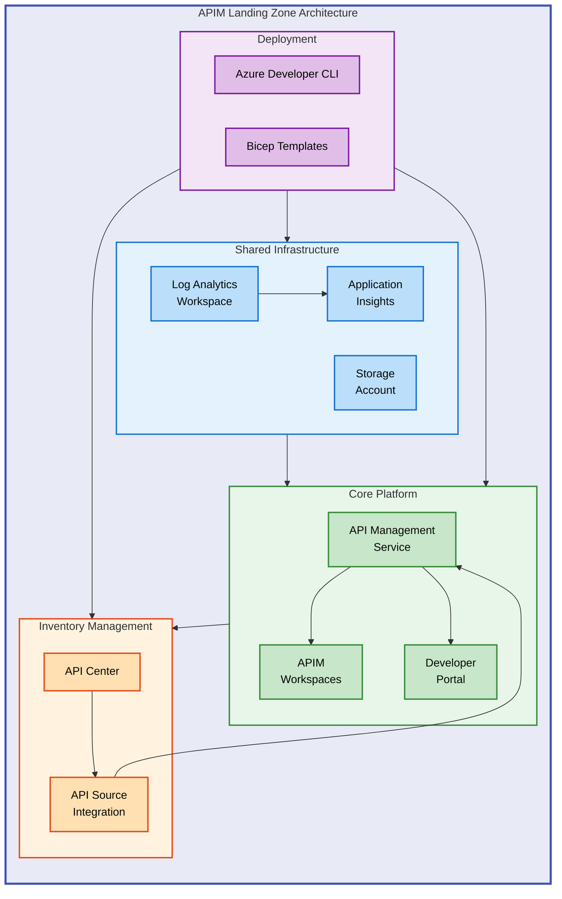

# APIM Accelerator


A production-ready Infrastructure as Code (IaC) accelerator for deploying Azure API Management Landing Zones with enterprise-grade monitoring, multi-team workspaces, and API governance capabilities.

**Overview**

Organizations adopting API-first strategies require a robust, scalable foundation for managing APIs across multiple teams and environments. This accelerator addresses the complexity of deploying Azure API Management at enterprise scale by providing pre-configured Bicep templates that implement Azure best practices for security, observability, and governance.

The APIM Accelerator delivers a complete landing zone architecture through modular, reusable Bicep modules orchestrated by Azure Developer CLI (azd). It enables platform teams to provision consistent API Management infrastructure across development, staging, and production environments with minimal configuration, while providing the flexibility to customize every aspect of the deployment for organization-specific requirements.

## 📑 Table of Contents

- [Architecture](#️-architecture)
- [Features](#-features)
- [Requirements](#-requirements)
- [Quick Start](#-quick-start)
- [Deployment](#-deployment)
- [Usage](#-usage)
- [Configuration](#-configuration)
- [Contributing](#-contributing)
- [License](#-license)

## 🏗️ Architecture

**Overview**

The APIM Accelerator implements a layered architecture that separates shared infrastructure concerns from core platform services and API governance. This design enables independent scaling and lifecycle management of each layer while maintaining tight integration for observability and security.

The architecture follows Azure Landing Zone principles with subscription-level deployments that create dedicated resource groups containing logically grouped resources. Each module is designed for idempotent deployment, enabling safe re-runs and incremental updates without disrupting existing workloads.



### Component Overview

| Layer                     | Components                                           | Purpose                                               |
| ------------------------- | ---------------------------------------------------- | ----------------------------------------------------- |
| **Shared Infrastructure** | Log Analytics, Application Insights, Storage Account | Centralized monitoring, diagnostics, and log archival |
| **Core Platform**         | API Management, Workspaces, Developer Portal         | API gateway, team isolation, self-service portal      |
| **Inventory Management**  | API Center, API Source Integration                   | API governance, catalog, and automatic discovery      |

## ✨ Features

**Overview**

The accelerator provides a comprehensive set of capabilities designed for enterprise API management at scale. Each feature is implemented through modular Bicep templates that can be enabled, disabled, or customized based on organizational requirements.

These features work together to deliver a production-ready API platform that balances centralized governance with distributed team autonomy. The modular design ensures organizations pay only for the capabilities they need while maintaining upgrade paths for future enhancements.

| Feature                        | Description                                                                                | Benefits                                                                                |
| ------------------------------ | ------------------------------------------------------------------------------------------ | --------------------------------------------------------------------------------------- |
| 🔐 **Managed Identity**        | System-assigned and user-assigned identity support for secure Azure service authentication | Eliminates credential management, enables automatic rotation, integrates with Key Vault |
| 📊 **Full Observability**      | Pre-configured Log Analytics, Application Insights, and diagnostic settings                | Unified monitoring dashboards, proactive alerting, compliance-ready audit logs          |
| 👥 **Multi-Team Workspaces**   | Isolated workspaces within a single APIM instance for different teams or projects          | Cost-effective multi-tenancy, independent API lifecycles, centralized governance        |
| 🌐 **Developer Portal**        | Self-service portal with Azure AD authentication and OAuth2/OpenID Connect                 | API discovery, interactive documentation, developer onboarding                          |
| 📋 **API Governance**          | Azure API Center integration for centralized API catalog and inventory                     | API discovery across environments, compliance tracking, lifecycle management            |
| ⚡ **Azure Developer CLI**     | First-class `azd` integration with lifecycle hooks for automated deployments               | One-command deployment, environment management, CI/CD ready                             |
| 🔄 **Environment Flexibility** | Support for dev, test, staging, prod, and UAT environments with YAML configuration         | Consistent deployments, environment-specific sizing, configuration as code              |

## 📋 Requirements

**Overview**

Deploying the APIM Accelerator requires specific Azure permissions, CLI tooling, and subscription configurations to ensure successful provisioning. The requirements are designed to be minimal while providing the flexibility needed for enterprise deployments. Understanding these prerequisites before deployment prevents common issues related to permissions, quotas, and regional availability.

The accelerator uses Azure Developer CLI as the primary deployment mechanism, which orchestrates Bicep template deployment and manages environment configuration. This approach provides a consistent experience across local development and CI/CD pipelines while abstracting the complexity of Azure Resource Manager deployments.

| Category         | Requirement                                                             | More Information                                                                                                      |
| ---------------- | ----------------------------------------------------------------------- | --------------------------------------------------------------------------------------------------------------------- |
| **Subscription** | Azure subscription with Contributor or Owner role                       | [Azure RBAC](https://learn.microsoft.com/azure/role-based-access-control/)                                            |
| **CLI Tools**    | Azure CLI 2.50+ and Azure Developer CLI (azd) 1.5+                      | [Install Azure CLI](https://learn.microsoft.com/cli/azure/install-azure-cli)                                          |
| **Quotas**       | API Management Premium SKU quota in target region                       | [Azure Quotas](https://learn.microsoft.com/azure/azure-resource-manager/management/azure-subscription-service-limits) |
| **Permissions**  | Microsoft.ApiManagement/deletedservices/delete (for pre-provision hook) | Required for soft-delete cleanup                                                                                      |
| **Region**       | Azure region supporting API Management Premium tier                     | [Azure Products by Region](https://azure.microsoft.com/explore/global-infrastructure/products-by-region/)             |

> ⚠️ **Important**: API Management Premium tier deployment can take 30-45 minutes. Plan accordingly for initial provisioning and ensure your subscription has sufficient quota.

## 🚀 Quick Start

**Overview**

The fastest path to deploying the APIM Accelerator uses Azure Developer CLI's single-command workflow. This approach handles authentication, resource group creation, infrastructure provisioning, and configuration in one cohesive operation. The quick start is ideal for evaluation, development environments, and teams familiar with azd workflows.

Get started with three commands:

```bash
# Clone the repository
git clone https://github.com/Evilazaro/APIM-Accelerator.git
cd APIM-Accelerator

# Authenticate with Azure
azd auth login

# Deploy the complete landing zone
azd up
```

> 💡 **Tip**: Use `azd up --environment dev` to create a named environment, enabling multiple deployments (dev, test, prod) from the same codebase.

## 📦 Deployment

**Overview**

The deployment process follows a structured workflow that ensures resources are provisioned in the correct order with proper dependencies. The APIM Accelerator leverages Azure Developer CLI hooks to perform pre-deployment validation and cleanup, preventing common issues such as naming conflicts from soft-deleted resources. Understanding this workflow helps troubleshoot deployment issues and customize the process for specific requirements.

The deployment creates resources at the subscription scope, establishing a resource group following the naming convention `{solutionName}-{environment}-{location}-rg`. All subsequent resources inherit this organizational structure and tagging strategy defined in `settings.yaml`.

### Step 1: Prerequisites

Ensure you have the required tools installed:

```bash
# Verify Azure CLI installation
az --version

# Verify Azure Developer CLI installation
azd version

# Login to Azure
az login
azd auth login
```

### Step 2: Configure Environment

Review and customize the configuration in `infra/settings.yaml`:

```bash
# Open settings file for customization
code infra/settings.yaml
```

### Step 3: Initialize Environment

```bash
# Create a new azd environment
azd init --environment <env-name>

# Set the target Azure location
azd env set AZURE_LOCATION <region>
```

### Step 4: Deploy Infrastructure

```bash
# Provision all Azure resources
azd provision

# Or use azd up for combined provision and deploy
azd up
```

### Step 5: Verify Deployment

```bash
# List deployed resources
az resource list --resource-group apim-accelerator-<env>-<location>-rg --output table
```

### Deployment Sequence

The provisioning follows this sequence:

1. **Pre-provision hook**: Purges soft-deleted APIM resources in target region
2. **Resource group**: Creates `{solutionName}-{env}-{location}-rg`
3. **Shared infrastructure**: Log Analytics, Application Insights, Storage Account
4. **Core platform**: API Management service with workspaces and developer portal
5. **API inventory**: API Center with APIM integration for automatic API discovery

## 💻 Usage

**Overview**

After deployment, the APIM Accelerator provides several integration points for managing APIs and monitoring platform health. The primary interfaces include the Azure Portal for configuration, the Developer Portal for API consumers, and Azure CLI for automation scenarios. This section covers common operational tasks and how to interact with the deployed infrastructure.

### Access the Developer Portal

Navigate to the developer portal URL (available in APIM properties):

```bash
# Get APIM service details
az apim show --name <apim-name> --resource-group <rg-name> --query "developerPortalUrl" -o tsv
```

### Create an API Workspace

Workspaces organize APIs by team or project:

```bash
# List existing workspaces
az apim workspace list --service-name <apim-name> --resource-group <rg-name>
```

### Monitor with Application Insights

Query API performance metrics:

```bash
# Open Application Insights in portal
az monitor app-insights component show --app <ai-name> --resource-group <rg-name>
```

### View API Inventory

Access API Center to browse discovered APIs:

```bash
# List APIs in API Center
az apic api list --service-name <apicenter-name> --resource-group <rg-name>
```

## 🔧 Configuration

**Overview**

The APIM Accelerator centralizes configuration in `infra/settings.yaml`, providing a single source of truth for all deployment parameters. This approach separates configuration from infrastructure code, enabling environment-specific customization without modifying Bicep templates. The configuration structure mirrors the deployment layers, with sections for shared infrastructure, core platform, and inventory management.

Configuration values support both explicit naming (for compliance requirements) and auto-generation (for development agility). Empty name fields trigger automatic name generation using a deterministic suffix based on subscription and resource group identifiers, ensuring unique but reproducible resource names across deployments.

### Configuration File Structure

The `infra/settings.yaml` file contains all customizable parameters:

```yaml
# Solution identifier for naming conventions
solutionName: "apim-accelerator"

# Shared services configuration
shared:
  monitoring:
    logAnalytics:
      name: "" # Auto-generated if empty
      identity:
        type: "SystemAssigned"
    applicationInsights:
      name: "" # Auto-generated if empty

# Core APIM configuration
core:
  apiManagement:
    name: "" # Auto-generated if empty
    publisherEmail: "admin@contoso.com"
    publisherName: "Contoso"
    sku:
      name: "Premium"
      capacity: 1
    workspaces:
      - name: "workspace1"

# API inventory configuration
inventory:
  apiCenter:
    name: "" # Auto-generated if empty
    identity:
      type: "SystemAssigned"
```

### Key Configuration Options

| Parameter       | Path                                | Description                    | Default            |
| --------------- | ----------------------------------- | ------------------------------ | ------------------ |
| Solution Name   | `solutionName`                      | Base name for all resources    | `apim-accelerator` |
| Publisher Email | `core.apiManagement.publisherEmail` | Required by Azure APIM         | -                  |
| SKU Name        | `core.apiManagement.sku.name`       | APIM pricing tier              | `Premium`          |
| SKU Capacity    | `core.apiManagement.sku.capacity`   | Scale units (1-10 for Premium) | `1`                |
| Identity Type   | `*.identity.type`                   | Managed identity configuration | `SystemAssigned`   |

### Environment Variables

Set environment-specific values using azd:

```bash
# Set deployment location
azd env set AZURE_LOCATION eastus

# Set environment name (dev, test, prod)
azd env set AZURE_ENV_NAME dev
```

## 🤝 Contributing

**Overview**

Contributions to the APIM Accelerator are welcome and help improve the solution for the broader community. Whether you're fixing bugs, adding features, or improving documentation, your input is valuable. The contribution process follows standard GitHub workflows with pull requests reviewed by maintainers before merging.

We encourage contributors to open an issue before starting significant work to discuss the approach and ensure alignment with project goals. This helps avoid duplicate efforts and ensures your contribution can be integrated smoothly.

### How to Contribute

1. Fork the repository
2. Create a feature branch: `git checkout -b feature/your-feature`
3. Make your changes following Bicep best practices
4. Test your changes with `azd provision --preview`
5. Commit with descriptive messages: `git commit -m "Add feature description"`
6. Push to your fork: `git push origin feature/your-feature`
7. Open a Pull Request

### Code Standards

- Follow [Bicep best practices](https://learn.microsoft.com/azure/azure-resource-manager/bicep/best-practices)
- Include descriptive comments and metadata in templates
- Add parameter descriptions using `@description()` decorator
- Update documentation for any new features

## 📝 License

This project is licensed under the MIT License - see the [LICENSE](LICENSE) file for details.

Copyright (c) 2025 Evilázaro Alves
