# APIM Accelerator


Deploy a **production-ready Azure API Management landing zone** with **enterprise-grade monitoring**, **governance**, and **multi-team support** using Infrastructure as Code.

**Overview**

The APIM Accelerator provides a **comprehensive, modular Bicep-based solution** for deploying Azure API Management infrastructure following **Azure landing zone best practices**. It enables organizations to establish a **secure, scalable API platform** with built-in observability, developer portal integration, and **centralized API governance through Azure API Center**.

This accelerator addresses the complexity of setting up enterprise API infrastructure by providing pre-configured templates that implement **security best practices**, **monitoring integration**, and **workspace-based multi-tenancy**. Teams can deploy a complete API Management ecosystem in **minutes rather than days**, with all components properly connected and configured for production workloads.

> 📌 **Key Integration**: The solution integrates seamlessly with **Azure Developer CLI (`azd`)** for streamlined deployment workflows, supports **multiple environments** (dev, test, staging, prod, UAT), and includes **automated pre-provisioning hooks** to handle soft-deleted resource cleanup.

## 📑 Table of Contents

- [Architecture](#️-architecture)
- [Features](#-features-1)
- [Requirements](#-requirements-1)
- [Quick Start](#-quick-start)
- [Deployment](#-deployment)
- [Usage](#-usage)
- [Configuration](#-configuration)
- [Contributing](#-contributing)
- [License](#-license)

## 🏗️ Architecture

**Overview**

The APIM Accelerator implements a **three-tier landing zone architecture** that separates **shared infrastructure**, **core API Management services**, and **API inventory capabilities**. This modular design enables **independent scaling**, **simplified maintenance**, and **clear separation of concerns** between monitoring, runtime services, and governance layers.

> 📌 **Design Principle**: The architecture follows **Azure Well-Architected Framework principles**, deploying resources at **subscription scope** while organizing components into logical resource groups. Each tier can be extended or customized **without impacting other layers**, providing flexibility for organizations with varying requirements.

```mermaid
---
title: APIM Landing Zone Architecture
config:
  theme: base
  flowchart:
    htmlLabels: false
---
flowchart TB
    accTitle: APIM Landing Zone Architecture
    accDescr: Azure API Management Landing Zone showing shared infrastructure, core platform, and inventory services

    %% ═══════════════════════════════════════════════════════════════════════════
    %% STANDARD COLOR SCHEME v2.1 - Material Design Compliant
    %% ═══════════════════════════════════════════════════════════════════════════
    %% HIERARCHICAL (structural nesting):
    %%   Level 1: #E8EAF6 (Indigo 50) - Main container
    %% SEMANTIC (functional purpose):
    %%   Blue=#BBDEFB (API/Gateway) | Green=#C8E6C9 (Workload)
    %%   Orange=#FFE0B2 (Security) | Teal=#B2DFDB (Data/Storage)
    %%   Yellow=#FFF9C4 (Monitoring)
    %% ═══════════════════════════════════════════════════════════════════════════

    classDef level1Group fill:#E8EAF6,stroke:#3F51B5,stroke-width:3px,color:#000
    classDef level2Group fill:#C5CAE9,stroke:#3F51B5,stroke-width:2px,color:#000
    classDef level3Group fill:#9FA8DA,stroke:#3F51B5,stroke-width:2px,color:#000
    classDef level4Group fill:#7986CB,stroke:#3F51B5,stroke-width:1px,color:#000
    classDef mainGroup fill:#E8EAF6,stroke:#3F51B5,stroke-width:3px,color:#000
    classDef subGroup fill:#C5CAE9,stroke:#3F51B5,stroke-width:2px,color:#000
    classDef mdBlue fill:#BBDEFB,stroke:#1976D2,stroke-width:2px,color:#000
    classDef mdGreen fill:#C8E6C9,stroke:#388E3C,stroke-width:2px,color:#000
    classDef mdYellow fill:#FFF9C4,stroke:#F57F17,stroke-width:2px,color:#000
    classDef mdRed fill:#FFCDD2,stroke:#D32F2F,stroke-width:2px,color:#000
    classDef mdOrange fill:#FFE0B2,stroke:#E64A19,stroke-width:2px,color:#000
    classDef mdPurple fill:#E1BEE7,stroke:#7B1FA2,stroke-width:2px,color:#000
    classDef mdTeal fill:#B2DFDB,stroke:#00796B,stroke-width:2px,color:#000
    classDef mdGrey fill:#F5F5F5,stroke:#616161,stroke-width:2px,color:#000

    subgraph landingZone["🏢 APIM Landing Zone"]
        direction TB

        subgraph shared["📊 Shared Infrastructure"]
            direction LR
            logAnalytics["📈 Log Analytics<br/>Workspace"]:::mdYellow
            appInsights["📉 Application<br/>Insights"]:::mdYellow
            storage["💾 Storage<br/>Account"]:::mdTeal
        end

        subgraph core["⚙️ Core Platform"]
            direction LR
            apim["🌐 API Management<br/>Service"]:::mdBlue
            devPortal["👥 Developer<br/>Portal"]:::mdGreen
            workspaces["📁 Workspaces"]:::mdGreen
        end

        subgraph inventory["📚 API Inventory"]
            direction LR
            apiCenter["📋 API Center"]:::mdTeal
            apiSource["🔗 API Source<br/>Integration"]:::mdTeal
        end

        %% Relationships with verb labels
        apim -->|"sends logs"| logAnalytics
        apim -->|"sends metrics"| appInsights
        apim -->|"archives to"| storage
        apim -->|"hosts"| devPortal
        apim -->|"contains"| workspaces
        apiCenter -->|"syncs from"| apim
        apiSource -->|"discovers APIs in"| apim
    end

    %% SUBGRAPH STYLING (4 subgraphs = 4 style directives)
    style landingZone fill:#E8EAF6,stroke:#3F51B5,stroke-width:3px
    style shared fill:#FFF9C4,stroke:#F57F17,stroke-width:2px
    style core fill:#C8E6C9,stroke:#388E3C,stroke-width:2px
    style inventory fill:#B2DFDB,stroke:#00796B,stroke-width:2px

    %% Accessibility: WCAG AA verified (4.5:1 contrast ratio)
```



### Deployment Flow

```mermaid
---
title: APIM Accelerator Deployment Flow
config:
  theme: base
  flowchart:
    htmlLabels: false
---
flowchart LR
    accTitle: APIM Accelerator Deployment Flow
    accDescr: Shows the sequential deployment process using Azure Developer CLI

    %% ═══════════════════════════════════════════════════════════════════════════
    %% STANDARD COLOR SCHEME v2.1 - Material Design Compliant
    %% ═══════════════════════════════════════════════════════════════════════════
    %% HIERARCHICAL (structural nesting):
    %%   Level 1: #E8EAF6 (Indigo 50) - Main container
    %%   Level 2: #C5CAE9 (Indigo 100) - Sub-containers
    %% SEMANTIC (functional purpose):
    %%   Blue=#BBDEFB (Info) | Green=#C8E6C9 (Success)
    %%   Orange=#FFE0B2 (Process) | Red=#FFCDD2 (Error)
    %% ═══════════════════════════════════════════════════════════════════════════

    classDef level1Group fill:#E8EAF6,stroke:#3F51B5,stroke-width:3px,color:#000
    classDef level2Group fill:#C5CAE9,stroke:#3F51B5,stroke-width:2px,color:#000
    classDef level3Group fill:#9FA8DA,stroke:#3F51B5,stroke-width:2px,color:#000
    classDef level4Group fill:#7986CB,stroke:#3F51B5,stroke-width:1px,color:#000
    classDef mainGroup fill:#E8EAF6,stroke:#3F51B5,stroke-width:3px,color:#000
    classDef subGroup fill:#C5CAE9,stroke:#3F51B5,stroke-width:2px,color:#000
    classDef mdBlue fill:#BBDEFB,stroke:#1976D2,stroke-width:2px,color:#000
    classDef mdGreen fill:#C8E6C9,stroke:#388E3C,stroke-width:2px,color:#000
    classDef mdYellow fill:#FFF9C4,stroke:#F57F17,stroke-width:2px,color:#000
    classDef mdRed fill:#FFCDD2,stroke:#D32F2F,stroke-width:2px,color:#000
    classDef mdOrange fill:#FFE0B2,stroke:#E64A19,stroke-width:2px,color:#000
    classDef mdPurple fill:#E1BEE7,stroke:#7B1FA2,stroke-width:2px,color:#000
    classDef mdTeal fill:#B2DFDB,stroke:#00796B,stroke-width:2px,color:#000
    classDef mdGrey fill:#F5F5F5,stroke:#616161,stroke-width:2px,color:#000

    subgraph deployment["🚀 Deployment Process"]
        direction LR
        init["⚙️ azd init"]:::mdBlue
        preprov["🧹 Pre-Provision<br/>Cleanup"]:::mdOrange
        prov["📦 azd provision"]:::mdGreen
        complete["✅ Deployment<br/>Complete"]:::mdGreen

        init -->|"configures"| preprov
        preprov -->|"purges soft-deleted"| prov
        prov -->|"deploys resources"| complete
    end

    style deployment fill:#E8EAF6,stroke:#3F51B5,stroke-width:3px
```



## ✨ Features

**Overview**

The APIM Accelerator delivers **enterprise-grade API Management capabilities** through a carefully designed set of features that address common organizational challenges. Each feature has been implemented following **Azure best practices** and is **production-ready out of the box**.

These features work together to provide a complete API platform that **scales from small teams to large enterprises**. The modular architecture ensures you can **adopt features incrementally** while maintaining consistency across your API infrastructure.

| Feature                          | Description                                                                                                                                 | Benefits                                                                             |
| -------------------------------- | ------------------------------------------------------------------------------------------------------------------------------------------- | ------------------------------------------------------------------------------------ |
| 🌐 **API Management Deployment** | Deploys Azure API Management with **configurable SKUs** (Developer, Basic, Standard, Premium, Consumption) and **managed identity support** | Provides secure API gateway with built-in caching, rate limiting, and authentication |
| 📊 **Integrated Monitoring**     | **Pre-configured Log Analytics workspace** and **Application Insights** with diagnostic settings                                            | Enables centralized logging, performance monitoring, and compliance auditing         |
| 👥 **Developer Portal**          | **Azure AD-authenticated** developer portal with CORS policies and self-service capabilities                                                | Accelerates API adoption through documentation, testing, and onboarding              |
| 📁 **Workspace Isolation**       | **Multi-team workspaces** for logical API separation within a single APIM instance                                                          | Reduces costs while enabling distributed API management across teams                 |
| 📋 **API Governance**            | **Azure API Center integration** for API catalog, discovery, and governance                                                                 | Provides centralized API inventory with automatic synchronization                    |
| 🔐 **Security by Default**       | **System-assigned or user-assigned managed identities** with RBAC assignments                                                               | Eliminates credential management and implements **zero-trust principles**            |
| ⚙️ **azd Integration**           | **Full Azure Developer CLI support** with pre-provision hooks                                                                               | Enables repeatable, automated deployments across environments                        |

## 📋 Requirements

**Overview**

Before deploying the APIM Accelerator, ensure your environment meets the following prerequisites. These requirements apply to **both local development machines and CI/CD pipeline agents** that will execute the deployment.

The accelerator is designed to work with **standard Azure tooling** and requires minimal setup. Most requirements can be satisfied by installing the Azure CLI with the Bicep extension, which bundles the necessary components.

| Category                | Requirement                                                                                         | More Information                                                                           |
| ----------------------- | --------------------------------------------------------------------------------------------------- | ------------------------------------------------------------------------------------------ |
| **Azure Subscription**  | Active Azure subscription with **Owner or Contributor role** (**MUST have**)                        | [Create subscription](https://azure.microsoft.com/free/)                                   |
| **Azure CLI**           | **Version 2.50.0 or later** with Bicep extension (**MUST install**)                                 | [Install Azure CLI](https://learn.microsoft.com/cli/azure/install-azure-cli)               |
| **Azure Developer CLI** | **Version 1.5.0 or later** (`azd`) (**MUST install**)                                               | [Install azd](https://learn.microsoft.com/azure/developer/azure-developer-cli/install-azd) |
| **Permissions**         | `Microsoft.ApiManagement/*`, `Microsoft.Insights/*`, `Microsoft.Storage/*`, `Microsoft.ApiCenter/*` | **REQUIRED for resource deployment**                                                       |
| **Shell Environment**   | Bash (Linux/macOS) or PowerShell (Windows)                                                          | Pre-provision scripts require shell access                                                 |

> ⚠️ **Important**: For **Premium SKU deployments**, ensure your subscription has **sufficient quota** for API Management scale units in the target region.

## 🚀 Quick Start

**Overview**

Get a complete API Management landing zone running in your Azure subscription with **just three commands**. The Quick Start uses **Azure Developer CLI** to handle authentication, resource provisioning, and configuration automatically.

> ⚠️ **Before You Begin**: This deployment creates all components in a **single resource group with sensible defaults**. For **production deployments**, review the [Configuration](#-configuration) section to **customize settings for your organization's requirements**.

```bash
# Clone the repository
git clone https://github.com/Evilazaro/APIM-Accelerator.git
cd APIM-Accelerator

# Initialize and deploy with Azure Developer CLI
azd up
```

> 💡 **Tip**: The `azd up` command combines `azd auth login`, `azd init`, and `azd provision` into a single workflow. You'll be prompted to select your Azure subscription and target region.

## 📦 Deployment

**Overview**

The APIM Accelerator supports **multiple deployment approaches** depending on your operational requirements. All methods use the same Bicep templates and produce **identical infrastructure**, ensuring **consistency across development, testing, and production environments**.

> 💡 **Automatic Cleanup**: The deployment process includes a **pre-provision hook that automatically purges** any soft-deleted API Management instances in the target region, **preventing naming conflicts** during redeployment scenarios.

### Using Azure Developer CLI (Recommended)

```bash
# Authenticate with Azure
azd auth login

# Initialize the project (first time only)
azd init

# Deploy to a specific environment
azd up --environment dev
```

### Using Azure CLI Directly

```bash
# Login to Azure
az login

# Set the target subscription
az account set --subscription "<subscription-id>"

# Deploy at subscription scope
az deployment sub create \
  --location eastus \
  --template-file infra/main.bicep \
  --parameters envName=dev location=eastus
```

### Environment Options

| Environment | Description               | Recommended SKU |
| ----------- | ------------------------- | --------------- |
| `dev`       | Development and testing   | Developer       |
| `test`      | Integration testing       | Basic           |
| `staging`   | Pre-production validation | Standard        |
| `prod`      | **Production workloads**  | **Premium**     |
| `uat`       | User acceptance testing   | Standard        |

> ⚠️ **Critical Requirement**: **Premium SKU is REQUIRED** for multi-region deployments, virtual network integration, and higher SLA guarantees. **Do not use Developer SKU** for production workloads.

## 💻 Usage

**Overview**

After deployment, the APIM Accelerator provides a **fully configured API Management platform** ready for use. This section covers common post-deployment tasks including **accessing the management portal**, **configuring APIs**, and **working with workspaces**.

The infrastructure outputs **essential connection information** needed for integrating applications with the deployed services. Use the Azure CLI or portal to retrieve these values for your development and operations workflows.

### Accessing Deployed Resources

```bash
# Get deployment outputs
az deployment sub show \
  --name deploy-core-platform \
  --query properties.outputs

# Open API Management portal
az apim show --name <apim-name> --resource-group <rg-name> \
  --query "portalUrl" --output tsv
```

### Creating an API

```bash
# Import an OpenAPI specification
az apim api import \
  --resource-group <rg-name> \
  --service-name <apim-name> \
  --path "/api/v1" \
  --specification-format OpenAPI \
  --specification-url "https://petstore.swagger.io/v2/swagger.json"
```

### Working with Workspaces

Workspaces provide **logical isolation** for different teams or projects within a single APIM instance:

```bicep
// Example: Add a new workspace in settings.yaml
core:
  apiManagement:
    workspaces:
      - name: "sales-team"
      - name: "engineering-team"
      - name: "partner-apis"
```

## 🔧 Configuration

**Overview**

The APIM Accelerator uses a **centralized YAML configuration file** (`infra/settings.yaml`) that defines all deployment parameters. This approach **separates configuration from infrastructure code**, enabling **environment-specific customizations** without modifying Bicep templates.

> 📌 **Best Practice**: Configuration options are organized by component (shared, core, inventory) with **sensible defaults** that work for most deployments. Override **only** specific values as needed while inheriting defaults for unchanged settings.

### Configuration File Structure

```yaml
# infra/settings.yaml - Primary configuration file
solutionName: "apim-accelerator"

shared:
  monitoring:
    logAnalytics:
      name: "" # Auto-generated if empty
      identity:
        type: "SystemAssigned"
    applicationInsights:
      name: "" # Auto-generated if empty

core:
  apiManagement:
    publisherEmail: "admin@contoso.com"
    publisherName: "Contoso"
    sku:
      name: "Premium"
      capacity: 1
    identity:
      type: "SystemAssigned"
    workspaces:
      - name: "workspace1"

inventory:
  apiCenter:
    identity:
      type: "SystemAssigned"
```

### Key Configuration Options

| Setting             | Path                                | Description                 | Default          |
| ------------------- | ----------------------------------- | --------------------------- | ---------------- |
| **SKU**             | `core.apiManagement.sku.name`       | API Management pricing tier | `Premium`        |
| **Capacity**        | `core.apiManagement.sku.capacity`   | Number of scale units       | `1`              |
| **Identity**        | `core.apiManagement.identity.type`  | Managed identity type       | `SystemAssigned` |
| **Publisher Email** | `core.apiManagement.publisherEmail` | Admin contact email         | **REQUIRED**     |
| **Workspaces**      | `core.apiManagement.workspaces`     | Team isolation workspaces   | `[]`             |

> ⚠️ **Validation**: The `publisherEmail` setting **MUST be configured** before deployment. Deployments will fail without a valid admin contact email.

### Resource Tags

All resources **inherit governance tags** defined in `shared.tags`:

```yaml
tags:
  CostCenter: "CC-1234"
  BusinessUnit: "IT"
  Owner: "platform-team@contoso.com"
  ApplicationName: "APIM Platform"
  ServiceClass: "Critical"
```

> 💡 **Governance Tip**: Use **consistent tagging across all environments** for cost tracking, compliance reporting, and resource organization.

## 🤝 Contributing

**Overview**

Contributions to the APIM Accelerator are welcome and appreciated. Whether you're fixing bugs, adding features, or improving documentation, your contributions help make this project better for everyone. We follow **standard open-source practices** to ensure code quality and maintain project consistency.

Before contributing, please review the project structure and **coding conventions** used in the Bicep templates. All submissions go through **code review** to maintain quality and ensure compatibility with existing functionality.

### How to Contribute

1. **Fork the repository**
2. Create a feature branch (`git checkout -b feature/amazing-feature`)
3. Make your changes following the existing code style
4. **Validate your changes** with `az deployment sub validate` (**MUST pass**)
5. Commit your changes (`git commit -m 'Add amazing feature'`)
6. Push to your branch (`git push origin feature/amazing-feature`)
7. **Open a Pull Request**

### Development Guidelines

- Follow **Bicep best practices** and naming conventions
- Include **descriptive comments** for complex logic
- **Update `settings.yaml` schema** if adding new parameters
- Ensure all modules have **complete parameter documentation**
- **MUST test deployments** in a non-production subscription before submitting

## 📝 License

This project is licensed under the MIT License - see the [LICENSE](LICENSE) file for details.

Copyright (c) 2025 Evilázaro Alves
