# APIM Accelerator

[](https://opensource.org/licenses/MIT)
[](https://azure.microsoft.com/products/api-management/)
[](https://learn.microsoft.com/azure/azure-resource-manager/bicep/overview)
[](https://learn.microsoft.com/azure/developer/azure-developer-cli/)
[](https://github.com/Evilazaro/APIM-Accelerator)

## Overview

**Overview**

APIM Accelerator is an enterprise-grade Infrastructure-as-Code (IaC) solution that deploys a complete Azure API Management landing zone using Bicep templates and the Azure Developer CLI (`azd`). It provides a production-ready foundation for organizations to centralize API governance, enable developer self-service through a portal, and establish comprehensive monitoring — all from a single `azd up` command.

The accelerator follows a modular, layered architecture that separates shared infrastructure (monitoring, storage) from core platform services (API Management, Developer Portal) and API inventory management (API Center). By leveraging reusable Bicep modules with strong type definitions, deterministic naming conventions, and YAML-driven configuration, teams can customize deployments across `dev`, `test`, `staging`, `prod`, and `uat` environments without modifying template code.

> 💡 **Why This Matters**: Standing up a production API Management platform with monitoring, governance, and developer portal integration typically requires weeks of manual Azure configuration. This accelerator automates the entire process with validated, repeatable infrastructure deployments.

> ⚠️ **Important**: This project deploys Azure resources that incur costs. Review the [Configuration](#configuration) section to understand SKU selections and scaling options before provisioning.

## 📋 Table of Contents

- [Overview](#overview)
- [Architecture](#architecture)
- [Features](#features)
- [Requirements](#requirements)
- [Quick Start](#quick-start)
- [Deployment](#deployment)
- [Usage](#usage)
- [Configuration](#configuration)
- [Project Structure](#project-structure)
- [Contributing](#contributing)
- [License](#license)

## Architecture

**Overview**

The APIM Accelerator deploys a three-tier landing zone architecture orchestrated at the Azure subscription level. The deployment creates a single resource group containing shared monitoring infrastructure, a core API Management platform with developer portal, and an API Center for centralized API inventory and governance.

The deployment sequence ensures dependency resolution: shared monitoring components deploy first, providing Log Analytics and Application Insights identifiers to the core APIM platform, which in turn provides service references needed by the API Center integration.

```mermaid
---
title: "APIM Accelerator - Landing Zone Architecture"
config:
  theme: base
  look: classic
  layout: dagre
  themeVariables:
    fontSize: '16px'
  flowchart:
    htmlLabels: true
---
flowchart TB
    accTitle: APIM Accelerator Landing Zone Architecture
    accDescr: Shows the three-tier deployment architecture with shared monitoring, core APIM platform, and API inventory management layers

    %% ═══════════════════════════════════════════════════════════════════════════
    %% AZURE / FLUENT ARCHITECTURE PATTERN v1.1
    %% (Semantic + Structural + Font + Accessibility Governance)
    %% ═══════════════════════════════════════════════════════════════════════════
    %% PHASE 1 - STRUCTURAL: Direction explicit, flat topology, nesting ≤ 3
    %% PHASE 2 - SEMANTIC: Colors justified, max 5 semantic classes, neutral-first
    %% PHASE 3 - FONT: Dark text on light backgrounds, contrast ≥ 4.5:1
    %% PHASE 4 - ACCESSIBILITY: accTitle/accDescr present, icons on all nodes
    %% PHASE 5 - STANDARD: Governance block present, classDefs centralized
    %% ═══════════════════════════════════════════════════════════════════════════

    subgraph subscription["☁️ Azure Subscription"]
        direction TB

        subgraph rg["📦 Resource Group (apim-accelerator-{env}-{region}-rg)"]
            direction TB

            subgraph shared["🔍 Shared Infrastructure"]
                direction LR
                law["📊 Log Analytics\nWorkspace"]:::monitoring
                ai["📈 Application\nInsights"]:::monitoring
                sa["🗄️ Storage\nAccount"]:::monitoring
            end

            subgraph core["⚙️ Core Platform"]
                direction LR
                apim["🌐 API Management\n(Premium SKU)"]:::primary
                ws["📂 Workspaces"]:::primary
                dp["🖥️ Developer\nPortal"]:::primary
            end

            subgraph inventory["📋 API Inventory"]
                direction LR
                ac["📚 API Center"]:::governance
                acsrc["🔗 API Source\nIntegration"]:::governance
            end
        end
    end

    law --> ai
    sa --> ai
    law --> apim
    ai --> apim
    sa --> apim
    apim --> ws
    apim --> dp
    apim --> ac
    ac --> acsrc

    style subscription fill:#F3F2F1,stroke:#605E5C,stroke-width:2px
    style rg fill:#FAFAFA,stroke:#8A8886,stroke-width:2px
    style shared fill:#EFF6FC,stroke:#0078D4,stroke-width:1px
    style core fill:#F0FFF0,stroke:#107C10,stroke-width:1px
    style inventory fill:#FFF8F0,stroke:#FFB900,stroke-width:1px

    classDef monitoring fill:#DEECF9,stroke:#0078D4,stroke-width:2px,color:#004578
    classDef primary fill:#DFF6DD,stroke:#107C10,stroke-width:2px,color:#0B6A0B
    classDef governance fill:#FFF4CE,stroke:#FFB900,stroke-width:2px,color:#986F0B
```



**Component Roles:**

| Component | Purpose | Source Module |
|---|---|---|
| 📊 Log Analytics Workspace | Centralized log aggregation, KQL-based querying, and alerting | `src/shared/monitoring/operational/main.bicep` |
| 📈 Application Insights | Application performance monitoring, distributed tracing, and telemetry | `src/shared/monitoring/insights/main.bicep` |
| 🗄️ Storage Account | Long-term diagnostic log archival and compliance retention | `src/shared/monitoring/operational/main.bicep` |
| 🌐 API Management | API gateway, policy enforcement, rate limiting, and caching | `src/core/apim.bicep` |
| 📂 Workspaces | Logical API isolation for different teams or business domains | `src/core/workspaces.bicep` |
| 🖥️ Developer Portal | Self-service API discovery, documentation, and testing with Azure AD auth | `src/core/developer-portal.bicep` |
| 📚 API Center | Centralized API catalog, governance, and inventory management | `src/inventory/main.bicep` |
| 🔗 API Source Integration | Automatic API discovery and synchronization from APIM to API Center | `src/inventory/main.bicep` |

## Features

**Overview**

The accelerator provides a comprehensive set of capabilities designed for enterprise API platform teams. Each feature is implemented as a modular Bicep component, enabling teams to customize or extend individual capabilities without affecting the rest of the platform.

> 💡 **How It Works**: The modular architecture uses Bicep's module system with strongly-typed inputs (defined in `src/shared/common-types.bicep`) and a centralized configuration file (`infra/settings.yaml`) to drive all deployments through a single orchestration template.

| Feature | Description | Status |
|---|---|---|
| 🌐 API Management Platform | Full Azure APIM deployment with configurable SKU (Developer through Premium), managed identity, VNet integration support, and CORS policies | ✅ Stable |
| 🖥️ Developer Portal | Self-service portal with Azure AD authentication, sign-in/sign-up controls, terms of service, and CORS configuration | ✅ Stable |
| 📂 Workspace Isolation | APIM workspaces for team-based or domain-based API isolation within a single instance, enabling independent API lifecycle management | ✅ Stable |
| 📊 Unified Monitoring | Log Analytics workspace with Application Insights integration, diagnostic settings across all resources, and storage-based log archival | ✅ Stable |
| 📚 API Governance | Azure API Center with automatic APIM integration, RBAC-based access control, and centralized API cataloging | ✅ Stable |
| 🔒 Managed Identity | System-assigned and user-assigned managed identity support across APIM, API Center, and Log Analytics resources | ✅ Stable |
| ⚡ One-Command Deploy | Full landing zone provisioning via `azd up` with pre-provision hooks for soft-deleted resource cleanup | ✅ Stable |
| 🏷️ Tag Governance | Comprehensive tagging strategy with cost center, business unit, owner, compliance, and budget tracking applied to all resources | ✅ Stable |

## Requirements

**Overview**

Before deploying the APIM Accelerator, ensure your environment meets the following prerequisites. The accelerator targets Azure subscription-level deployments and requires appropriate permissions to create resource groups and provision Azure services.

> 📌 **Note**: The default configuration uses the Premium SKU for API Management, which supports workspaces, multi-region deployment, and VNet integration. Adjust the SKU in `infra/settings.yaml` if a lower tier is appropriate for your environment.

| Requirement | Details | Documentation |
|---|---|---|
| ☁️ Azure Subscription | Active Azure subscription with permissions to create resource groups and deploy resources | [Create an Azure account](https://azure.microsoft.com/free/) |
| 🔑 Azure CLI | Version 2.60+ installed and authenticated with `az login` | [Install Azure CLI](https://learn.microsoft.com/cli/azure/install-azure-cli) |
| 🛠️ Azure Developer CLI | `azd` installed for deployment orchestration and lifecycle management | [Install azd](https://learn.microsoft.com/azure/developer/azure-developer-cli/install-azd) |
| ⚡ Bicep CLI | Included with Azure CLI 2.60+; used for template compilation and validation | [Bicep documentation](https://learn.microsoft.com/azure/azure-resource-manager/bicep/) |
| 🔗 Azure AD App Registration | Required for Developer Portal authentication — client ID and client secret | [Register an application](https://learn.microsoft.com/entra/identity-platform/quickstart-register-app) |
| 🌐 Azure Region | Target region must support API Management Premium tier and API Center | [Azure products by region](https://azure.microsoft.com/explore/global-infrastructure/products-by-region/) |

## Quick Start

**Overview**

Get the APIM Accelerator deployed in minutes with three commands. This section provides the fastest path to a running environment for developers familiar with Azure tooling.

> 💡 **Why This Matters**: A full API Management landing zone typically requires configuring dozens of Azure resources individually. The accelerator reduces this to a single command that provisions the entire stack with production-ready defaults.

```bash
git clone https://github.com/Evilazaro/APIM-Accelerator.git
cd APIM-Accelerator
azd auth login
azd up
```

**Expected output:**

```text
Provisioning Azure resources (azd provision)
  (✓) Done: Resource group: apim-accelerator-dev-eastus-rg

SUCCESS: Your application was provisioned in Azure.
```

> 📌 **Note**: When prompted by `azd up`, select your target Azure region and provide an environment name (e.g., `dev`, `staging`, `prod`). See the [Deployment](#deployment) section for the full step-by-step walkthrough.

## Deployment

**Overview**

The deployment process uses the Azure Developer CLI (`azd`) to orchestrate a subscription-level Bicep template. The pipeline creates a resource group, provisions shared monitoring infrastructure, deploys the core APIM platform, and registers APIs in API Center — all in a deterministic, repeatable sequence.

> 💡 **How It Works**: The `azd up` command reads `azure.yaml` for project configuration, loads parameters from `infra/main.parameters.json`, and executes lifecycle hooks (such as purging soft-deleted APIM instances) before provisioning infrastructure defined in `infra/main.bicep`.

### Step 1: Clone the Repository

```bash
git clone https://github.com/Evilazaro/APIM-Accelerator.git
cd APIM-Accelerator
```

### Step 2: Authenticate with Azure

```bash
az login
azd auth login
```

### Step 3: Initialize the Environment

```bash
azd init
```

When prompted, provide an environment name (e.g., `dev`, `staging`, `prod`). This value maps to the `envName` parameter and determines resource naming and configuration.

### Step 4: Deploy the Landing Zone

```bash
azd up
```

When prompted, select your target Azure region. The command executes the following sequence:

1. Runs the pre-provision hook (`infra/azd-hooks/pre-provision.sh`) to purge any soft-deleted APIM instances in the target region
2. Provisions all Azure resources defined in `infra/main.bicep`
3. Deploys shared monitoring infrastructure (Log Analytics, Application Insights, Storage)
4. Deploys the core APIM platform with workspaces and developer portal
5. Deploys API Center with APIM integration

### Step 5: Verify the Deployment

```bash
az apim show --name <apim-name> --resource-group <resource-group-name> --query "{name:name, sku:sku.name, state:properties.provisioningState}" --output table
```

**Expected output:**

```text
Name                                    Sku       State
--------------------------------------  --------  ---------
apim-accelerator-abc123-apim            Premium   Succeeded
```

> 💡 **Tip**: To provision infrastructure only without application deployment, use `azd provision`. To tear down all resources, use `azd down`.

## Usage

**Overview**

After deployment, the accelerator provides a fully operational API Management platform with a developer portal and centralized API governance. This section covers common post-deployment operations for managing APIs, accessing the portal, and monitoring platform health.

> 💡 **Why This Matters**: Deploying infrastructure is only the first step. Understanding how to interact with the provisioned resources ensures your team can onboard APIs, configure policies, and leverage the full platform effectively.

### Access the Developer Portal

The Developer Portal is deployed with Azure AD authentication enabled. Navigate to the portal URL output by the deployment:

```bash
az apim show --name <apim-name> --resource-group <resource-group-name> --query "properties.developerPortalUrl" --output tsv
```

### Query Monitoring Data

Use the Log Analytics workspace to query API Management diagnostic logs:

```bash
az monitor log-analytics query --workspace <workspace-id> --analytics-query "ApiManagementGatewayLogs | summarize count() by ResultType | order by count_ desc" --output table
```

### Manage Workspaces

List the configured APIM workspaces for team-based API isolation:

```bash
az apim workspace list --service-name <apim-name> --resource-group <resource-group-name> --output table
```

### View API Inventory

Access the API Center to review registered APIs and governance status:

```bash
az apic api list --service-name <api-center-name> --resource-group <resource-group-name> --output table
```

## Configuration

**Overview**

All deployment settings are centralized in `infra/settings.yaml`, providing a single source of truth for environment-specific configuration. The YAML-driven approach enables infrastructure customization without modifying Bicep templates, making it straightforward to manage multiple environments.

> 📌 **Note**: Resource names left empty in the configuration file (e.g., `name: ""`) are auto-generated using a deterministic naming convention: `{solutionName}-{uniqueSuffix}-{resourceType}`. The unique suffix is derived from the subscription and resource group identifiers, ensuring globally unique but reproducible names.

### Core Settings

The `infra/settings.yaml` file contains all configurable parameters:

```yaml
# Solution identifier used for naming conventions
solutionName: "apim-accelerator"

# Core API Management configuration
core:
  apiManagement:
    name: ""                          # Leave empty for auto-generation
    publisherEmail: "admin@contoso.com"
    publisherName: "Contoso"
    sku:
      name: "Premium"                 # Options: Developer, Basic, Standard, Premium, Consumption
      capacity: 1                     # Scale units (Premium: 1-10)
    identity:
      type: "SystemAssigned"          # Options: SystemAssigned, UserAssigned
    workspaces:
      - name: "workspace1"            # Add additional workspaces as needed
```

### Deployment Parameters

Parameters are passed via `infra/main.parameters.json`:

| Parameter | Type | Description |
|---|---|---|
| ⚙️ `envName` | `string` | Environment identifier: `dev`, `test`, `staging`, `prod`, or `uat` |
| 🌐 `location` | `string` | Azure region for resource deployment (e.g., `eastus`, `westeurope`) |

### Tag Governance

All resources receive governance tags defined in `infra/settings.yaml`:

| Tag | Purpose | Example Value |
|---|---|---|
| 🏢 `CostCenter` | Cost allocation tracking | `CC-1234` |
| 💼 `BusinessUnit` | Department identification | `IT` |
| 👤 `Owner` | Resource owner contact | `admin@contoso.com` |
| 📋 `ApplicationName` | Workload identification | `APIM Platform` |
| 🔒 `RegulatoryCompliance` | Compliance requirements | `GDPR` |
| 📊 `ServiceClass` | Workload tier classification | `Critical` |

## Project Structure

**Overview**

The repository follows a modular structure separating infrastructure orchestration (`infra/`) from reusable Bicep modules (`src/`). Each module is self-contained with explicit parameter contracts and typed inputs.

```text
APIM-Accelerator/
├── azure.yaml                          # Azure Developer CLI project configuration
├── LICENSE                             # MIT License
├── infra/
│   ├── main.bicep                      # Subscription-level orchestration template
│   ├── main.parameters.json            # Deployment parameters (envName, location)
│   ├── settings.yaml                   # Centralized configuration for all components
│   └── azd-hooks/
│       └── pre-provision.sh            # Purges soft-deleted APIM instances before deploy
├── src/
│   ├── core/
│   │   ├── main.bicep                  # Core platform orchestrator
│   │   ├── apim.bicep                  # API Management service deployment
│   │   ├── workspaces.bicep            # APIM workspace creation
│   │   └── developer-portal.bicep      # Developer portal with Azure AD integration
│   ├── inventory/
│   │   └── main.bicep                  # API Center deployment with APIM integration
│   └── shared/
│       ├── main.bicep                  # Shared infrastructure orchestrator
│       ├── common-types.bicep          # Reusable type definitions (ApiManagement, Inventory, etc.)
│       ├── constants.bicep             # Utility functions and shared constants
│       ├── monitoring/
│       │   ├── main.bicep              # Monitoring orchestrator
│       │   ├── insights/
│       │   │   └── main.bicep          # Application Insights deployment
│       │   └── operational/
│       │       └── main.bicep          # Log Analytics and Storage Account deployment
│       └── networking/
│           └── main.bicep              # Virtual network placeholder (future expansion)
└── prompts/                            # AI prompt engineering templates (documentation tooling)
```

## Contributing

**Overview**

Contributions to the APIM Accelerator are welcome. Whether you are fixing a bug, adding a new Bicep module, or improving documentation, your input helps the community build better API platforms on Azure.

> 💡 **Getting Started**: Fork the repository, create a feature branch, and submit a pull request. Ensure all Bicep templates compile without errors using `az bicep build` before submitting.

### How to Contribute

1. **Fork** the repository on GitHub
2. **Create** a feature branch from `main`:

   ```bash
   git checkout -b feature/your-feature-name
   ```

3. **Make** your changes following the existing module patterns and naming conventions
4. **Validate** Bicep templates compile successfully:

   ```bash
   az bicep build --file infra/main.bicep
   ```

5. **Commit** with a descriptive message and **push** your branch
6. **Open** a pull request against the `main` branch

### Development Guidelines

- Follow the existing naming convention: `{solutionName}-{uniqueSuffix}-{resourceType}`
- Add `@description` decorators to all parameters, variables, and resources
- Define reusable types in `src/shared/common-types.bicep`
- Add shared constants and utility functions to `src/shared/constants.bicep`
- Include comprehensive module header comments documenting purpose, dependencies, and usage

## License

This project is licensed under the **MIT License**. See the [LICENSE](LICENSE) file for details.

Copyright (c) 2025 Evilázaro Alves
