# APIM Accelerator


A comprehensive **Infrastructure as Code (IaC) accelerator** for deploying enterprise-grade Azure API Management landing zones with integrated monitoring, governance, and API inventory management.

**Overview**

The APIM Accelerator provides a **production-ready foundation** for organizations looking to establish a robust API management platform on Azure. It addresses the common challenges of **API governance, centralized monitoring, and multi-team collaboration** by deploying a complete landing zone with pre-configured best practices.

This accelerator is designed for **platform engineers, DevOps teams, and cloud architects** who need to rapidly deploy and manage Azure API Management infrastructure. It eliminates weeks of manual configuration by providing a modular, extensible Bicep-based solution that follows **Azure Well-Architected Framework** principles.

> 💡 **Tip**: The solution leverages **Azure Developer CLI (azd)** for streamlined deployment workflows, enabling teams to go from zero to a fully operational API platform in **minutes rather than days**.

## 🏗️ Architecture

**Overview**

The APIM Accelerator follows a **layered architecture pattern** that separates concerns across three distinct tiers: **shared infrastructure, core platform, and API inventory management**. This design enables independent scaling, simplified troubleshooting, and clear ownership boundaries.

Each layer builds upon the previous one, with shared monitoring infrastructure providing the observability foundation, the core platform delivering API management capabilities, and the inventory layer enabling governance and discovery.

```mermaid
---
title: APIM Accelerator Architecture
config:
  theme: base
  flowchart:
    htmlLabels: false
---
flowchart TB
    accTitle: APIM Accelerator Landing Zone Architecture
    accDescr: Shows the layered architecture of APIM Accelerator with shared infrastructure, core platform, and inventory management components

    %% ═══════════════════════════════════════════════════════════════════════════
    %% STANDARD COLOR SCHEME v2.1 - Material Design Compliant
    %% ═══════════════════════════════════════════════════════════════════════════
    %% HIERARCHICAL: Level 1=#E8EAF6 (Indigo 50) for main container
    %% SEMANTIC: Blue=#BBDEFB (API) | Green=#C8E6C9 (Compute)
    %%   Teal=#B2DFDB (Data) | Yellow=#FFF9C4 (Monitoring)
    %% ═══════════════════════════════════════════════════════════════════════════

    classDef level1Group fill:#E8EAF6,stroke:#3F51B5,stroke-width:3px,color:#000
    classDef mdBlue fill:#BBDEFB,stroke:#1976D2,stroke-width:2px,color:#000
    classDef mdGreen fill:#C8E6C9,stroke:#388E3C,stroke-width:2px,color:#000
    classDef mdTeal fill:#B2DFDB,stroke:#00796B,stroke-width:2px,color:#000
    classDef mdYellow fill:#FFF9C4,stroke:#F57F17,stroke-width:2px,color:#000

    subgraph system["🏢 APIM Accelerator Landing Zone"]
        direction TB

        subgraph shared["📊 Shared Infrastructure"]
            direction LR
            law["📈 Log Analytics<br/>Workspace"]:::mdYellow
            ai["🔍 Application<br/>Insights"]:::mdYellow
            storage[("💾 Storage<br/>Account")]:::mdTeal
        end

        subgraph core["⚙️ Core Platform"]
            direction LR
            apim["🌐 API Management<br/>Service"]:::mdBlue
            portal["👨‍💻 Developer<br/>Portal"]:::mdBlue
            ws["📁 Workspaces"]:::mdGreen
        end

        subgraph inventory["📋 API Inventory"]
            direction LR
            apicenter["📘 API Center"]:::mdTeal
            governance["🔒 API Governance"]:::mdTeal
        end

        shared -->|"provides monitoring"| core
        core -->|"registers APIs"| inventory
        apim -->|"sends diagnostics"| law
        apim -->|"sends telemetry"| ai
        apim -->|"archives logs"| storage
        apicenter -->|"discovers APIs"| apim
    end

    %% SUBGRAPH STYLING (4 subgraphs = 4 style directives)
    style system fill:#E8EAF6,stroke:#3F51B5,stroke-width:3px
    style shared fill:#FFF9C4,stroke:#F57F17,stroke-width:2px
    style core fill:#BBDEFB,stroke:#1976D2,stroke-width:2px
    style inventory fill:#B2DFDB,stroke:#00796B,stroke-width:2px
```



## ✨ Features

**Overview**

The APIM Accelerator delivers **enterprise-grade capabilities out of the box**, reducing the time to production from weeks to minutes. These features are designed to address real-world API management challenges faced by organizations of all sizes.

Each feature is modular and can be customized through the **`settings.yaml` configuration file**, allowing teams to tailor the deployment to their specific requirements while maintaining consistency with organizational standards.

| Feature                       | Description                                                                                                               | Benefits                                                                                          |
| ----------------------------- | ------------------------------------------------------------------------------------------------------------------------- | ------------------------------------------------------------------------------------------------- |
| 🌐 **API Management Service** | Deploys Azure API Management with **configurable SKU** (Developer, Basic, Standard, Premium) and managed identity support | Centralized API gateway with built-in caching, rate limiting, and security policies               |
| 📊 **Integrated Monitoring**  | Pre-configured Log Analytics workspace and Application Insights for comprehensive observability                           | **Real-time diagnostics**, performance monitoring, and compliance-ready logging                   |
| 📘 **API Center Integration** | Azure API Center for API discovery, cataloging, and governance                                                            | Centralized API inventory with **automatic synchronization** from APIM                            |
| 📁 **Workspace Isolation**    | Multi-workspace support for team-based API organization                                                                   | Enables **independent API lifecycle management** with shared infrastructure                       |
| 🔐 **Managed Identity**       | System-assigned and user-assigned identity support for secure Azure service integration                                   | **Eliminates credential management** while enabling secure access to Key Vault and other services |

## 📋 Requirements

**Overview**

Before deploying the APIM Accelerator, ensure your environment meets the prerequisites listed below. These requirements ensure a smooth deployment experience and prevent common configuration issues.

> 📌 **Important**: The accelerator is designed to work with standard Azure subscriptions that have sufficient quota for API Management resources. **Premium tier deployments require additional quota approval** in some regions.

| Category                | Requirements                                                       | More Information                                                                           |
| ----------------------- | ------------------------------------------------------------------ | ------------------------------------------------------------------------------------------ |
| **Azure Subscription**  | Active Azure subscription with **Contributor access**              | [Create subscription](https://azure.microsoft.com/free/)                                   |
| **Azure CLI**           | **Version 2.50.0 or later**                                        | [Install Azure CLI](https://docs.microsoft.com/cli/azure/install-azure-cli)                |
| **Azure Developer CLI** | **Version 1.5.0 or later** (`azd`)                                 | [Install azd](https://learn.microsoft.com/azure/developer/azure-developer-cli/install-azd) |
| **Permissions**         | Ability to create resource groups, APIM, and **assign RBAC roles** | Microsoft.ApiManagement/\* and Microsoft.Authorization/\*                                  |

## 🚀 Quick Start

**Overview**

Get started with the APIM Accelerator in **under 5 minutes** using Azure Developer CLI. This streamlined workflow handles authentication, resource provisioning, and configuration automatically.

The deployment creates all required Azure resources including the resource group, monitoring infrastructure, API Management service, and API Center in a **single command**.

```bash
# Clone the repository
git clone https://github.com/Evilazaro/APIM-Accelerator.git
cd APIM-Accelerator

# Authenticate with Azure
azd auth login

# Deploy the complete solution
azd up
```

> 💡 **Tip**: The **`azd up`** command combines `azd provision` and `azd deploy` into a single workflow. You'll be prompted to select an environment name and Azure region.

## 📦 Deployment

**Overview**

The deployment process leverages **Azure Developer CLI (azd)** to orchestrate infrastructure provisioning. The accelerator supports multiple deployment strategies including full deployment, incremental updates, and environment-specific configurations.

> 💡 **Tip**: Pre-provision hooks **automatically clean up soft-deleted APIM resources** to prevent naming conflicts, ensuring reliable redeployments.

### Step-by-Step Deployment

1. **Configure the environment**

   Edit **`infra/settings.yaml`** to customize your deployment:

   ```yaml
   solutionName: "apim-accelerator"

   core:
     apiManagement:
       publisherEmail: "your-email@company.com"
       publisherName: "Your Organization"
       sku:
         name: "Developer" # Options: Developer, Basic, Standard, Premium
         capacity: 1
   ```

2. **Initialize the environment**

   ```bash
   azd init
   ```

3. **Provision Azure resources**

   ```bash
   azd provision
   ```

4. **Verify deployment**

   ```bash
   az apim show --name <your-apim-name> --resource-group <your-rg-name>
   ```

> ⚠️ **Warning**: **Premium SKU deployment may take 30-45 minutes**. Developer SKU typically completes in 15-20 minutes.

## 💻 Usage

**Overview**

After deployment, you can manage your API Management infrastructure through the **Azure portal, Azure CLI, or by modifying the Bicep templates**. The modular structure allows for easy customization and extension.

Common operations include adding new workspaces for team isolation, configuring additional APIs, and adjusting monitoring settings.

### Adding a New Workspace

```bicep
// In infra/settings.yaml, add to the workspaces array:
core:
  apiManagement:
    workspaces:
      - name: "sales-apis"
      - name: "finance-apis"
      - name: "partner-apis"
```

### Redeploying After Changes

```bash
# Apply infrastructure changes
azd provision

# View deployment outputs
azd show
```

> 💡 **Tip**: Use **`azd monitor`** to open Application Insights and view **real-time telemetry** from your API Management service.

## 🔧 Configuration

**Overview**

All configuration options are centralized in the **`infra/settings.yaml`** file, providing a **single source of truth** for your deployment. This approach simplifies environment management and enables consistent deployments across development, staging, and production.

The configuration follows a **hierarchical structure** with sections for shared infrastructure, core platform, and inventory settings. Each section supports extensive customization while providing sensible defaults.

### Environment Variables

```bash
# Required for azd deployment
AZURE_LOCATION=eastus           # Target Azure region
AZURE_ENV_NAME=dev              # Environment name (dev, test, staging, prod)
```

### Configuration File Structure

```yaml
# infra/settings.yaml - Key configuration options

solutionName: "apim-accelerator"

shared:
  monitoring:
    logAnalytics:
      identity:
        type: "SystemAssigned"
  tags:
    CostCenter: "CC-1234"
    Owner: "platform-team@company.com"

core:
  apiManagement:
    publisherEmail: "api-admin@company.com"
    publisherName: "Contoso"
    sku:
      name: "Premium"
      capacity: 1
    identity:
      type: "SystemAssigned"

inventory:
  apiCenter:
    identity:
      type: "SystemAssigned"
```

> ⚠️ **Warning**: The **`publisherEmail` field is required** by Azure and **MUST be a valid email address**. This email receives service notifications and alerts.

## 🤝 Contributing

**Overview**

Contributions to the APIM Accelerator are welcome and appreciated. Whether you're fixing bugs, improving documentation, or adding new features, your contributions help make this accelerator better for everyone.

The project follows **standard GitHub workflows** with pull requests for all changes. We value clear communication, well-tested code, and comprehensive documentation for any modifications.

### How to Contribute

1. Fork the repository
2. Create a feature branch (`git checkout -b feature/amazing-feature`)
3. Commit your changes (`git commit -m 'Add amazing feature'`)
4. Push to the branch (`git push origin feature/amazing-feature`)
5. Open a Pull Request

### Development Guidelines

- Follow existing **Bicep coding conventions**
- Include comments for complex logic
- Update documentation for new features
- **Test deployments in a non-production environment**

## 📝 License

This project is licensed under the MIT License - see the [LICENSE](LICENSE) file for details.

---

**Maintained by**: [Evilázaro Alves](https://github.com/Evilazaro)
