# APIM Accelerator

[](https://opensource.org/licenses/MIT)
[](https://azure.microsoft.com)
[](https://learn.microsoft.com/azure/azure-resource-manager/bicep/)
[](https://learn.microsoft.com/azure/developer/azure-developer-cli/)
[](https://learn.microsoft.com/azure/azure-resource-manager/bicep/overview)

A production-ready Azure landing zone accelerator that provisions a complete **API Management** platform — including centralized observability, enterprise-grade API governance, developer portal, and multi-team workspace isolation — using Azure Bicep and the Azure Developer CLI (`azd`).

## Table of Contents

- [Features](#features)
- [Architecture](#architecture)
- [Requirements](#requirements)
- [Quick Start](#quick-start)
- [Configuration](#configuration)
- [Contributing](#contributing)
- [License](#license)

## Features

**Overview**

The APIM Accelerator eliminates the undifferentiated heavy lifting of standing up a production-grade Azure API Management landing zone. It provides a repeatable, modular Bicep deployment that wires together monitoring, the core API Management service, and a centralized API inventory in a single `azd up` command — enabling teams to focus on building APIs rather than platform plumbing.

| Feature                        | Description                                                                                                             | Source                             |
| ------------------------------ | ----------------------------------------------------------------------------------------------------------------------- | ---------------------------------- |
| Azure API Management (Premium) | Deploys API Management with configurable SKU, scale units, managed identity, and full diagnostic integration            | `src/core/apim.bicep`              |
| Developer Portal               | Self-service developer portal with OAuth2/OpenID Connect authentication and API documentation                           | `src/core/developer-portal.bicep`  |
| APIM Workspaces                | Workspace-based isolation for multiple teams or projects within a single APIM instance                                  | `src/core/workspaces.bicep`        |
| Centralized Observability      | Log Analytics workspace, Application Insights, and Storage Account wired as diagnostic sinks for all platform resources | `src/shared/monitoring/main.bicep` |
| API Center Governance          | Azure API Center with automated API source integration for centralized API catalog, discovery, and compliance           | `src/inventory/main.bicep`         |
| Managed Identity               | System-assigned or user-assigned managed identity support across all services for credential-free Azure integration     | `src/shared/common-types.bicep`    |
| Governance Tagging             | Comprehensive resource tagging strategy covering cost center, business unit, regulatory compliance, and support contact | `infra/settings.yaml`              |
| Soft-Delete Cleanup            | Pre-provision hook that purges soft-deleted APIM instances to prevent naming conflicts during redeployment              | `infra/azd-hooks/pre-provision.sh` |
| azd Integration                | Full Azure Developer CLI lifecycle support: `azd up`, `azd provision`, `azd deploy` with pre-provision hooks            | `azure.yaml`                       |

## Architecture

```mermaid
---
title: APIM Accelerator Landing Zone
config:
  theme: base
  themeVariables:
    fontSize: '16px'
  flowchart:
    htmlLabels: false
---
flowchart TB
    accTitle: APIM Accelerator Architecture Diagram
    accDescr: Azure API Management landing zone with shared monitoring, core APIM platform with developer portal and workspaces, and API Center for centralized API governance

    %% ═══════════════════════════════════════════════════════════════════════════
    %% AZURE / FLUENT ARCHITECTURE PATTERN v1.1
    %% (Semantic + Structural + Font + Accessibility Governance)
    %% ═══════════════════════════════════════════════════════════════════════════
    %% Structural: #F3F2F1 neutral containers (Neutral Gray 10) for subgraphs
    %% Semantic: Info/Blue (monitoring), Neutral/Gray (core), Success/Green (inventory)
    %% Warning/Yellow (external developer), Neutral white (inner nodes)
    %% Font governance: Dark text for WCAG AA contrast compliance
    %% Direction: TB for layered deployment sequence (top to bottom)
    %% Max semantic colors: 4 within 5-color limit
    %% ═══════════════════════════════════════════════════════════════════════════

    classDef external   fill:#FFF4CE,stroke:#986F0B,stroke-width:2px,color:#3B2C00
    classDef monitoring fill:#DEECF9,stroke:#0078D4,stroke-width:2px,color:#004578
    classDef core       fill:#FAFAFA,stroke:#8A8886,stroke-width:2px,color:#323130
    classDef inventory  fill:#DFF6DD,stroke:#107C10,stroke-width:2px,color:#054B16

    Dev["👤 Developer /\nAPI Consumer"]:::external

    subgraph azure["☁️ Azure Subscription — apim-accelerator"]
        direction TB

        subgraph shared["📊 Shared Monitoring Infrastructure"]
            direction LR
            LAW["📋 Log Analytics\nWorkspace"]:::monitoring
            AI["📈 Application\nInsights"]:::monitoring
            SA["💾 Storage\nAccount"]:::monitoring
            AI -->|"Linked workspace"| LAW
            AI -->|"Log archival"| SA
        end

        subgraph apimcore["⚙️ Core API Management Platform"]
            direction LR
            APIM["🔧 API Management\nPremium SKU"]:::core
            Portal["🌐 Developer\nPortal"]:::core
            WS["🗂️ Workspaces"]:::core
            APIM -->|"Serves"| Portal
            APIM -->|"Isolates teams"| WS
        end

        subgraph inv["📚 API Inventory & Governance"]
            direction LR
            APC["🗃️ API Center"]:::inventory
        end

        shared      -->|"Diagnostics & metrics"| apimcore
        apimcore    -->|"API source integration"| inv
    end

    Dev -->|"HTTPS"| APIM

    style azure     fill:#F3F2F1,stroke:#8A8886,stroke-width:2px
    style shared    fill:#F3F2F1,stroke:#0078D4,stroke-width:1px
    style apimcore  fill:#F3F2F1,stroke:#8A8886,stroke-width:1px
    style inv       fill:#F3F2F1,stroke:#107C10,stroke-width:1px
```



**Deployment Sequence**: The orchestration template (`infra/main.bicep`) deploys at subscription scope in four ordered steps:

1. Resource group provisioning
2. Shared monitoring infrastructure (Log Analytics → Application Insights → Storage)
3. Core API Management platform (depends on monitoring outputs)
4. API Center inventory module (depends on APIM outputs)

## Requirements

**Overview**

The accelerator targets Azure subscription owners or contributors who need to stand up a governed API Management landing zone. The toolchain is intentionally minimal — the Azure Developer CLI handles authentication, subscription selection, and the full provisioning lifecycle, while the Azure CLI is required only for the soft-delete cleanup hook.

| Requirement                                                                                                | Version                                 | Notes                                                                           |
| ---------------------------------------------------------------------------------------------------------- | --------------------------------------- | ------------------------------------------------------------------------------- |
| [Azure subscription](https://azure.microsoft.com/free/)                                                    | Active                                  | Must support API Management Premium SKU in target region                        |
| [Azure Developer CLI (`azd`)](https://learn.microsoft.com/azure/developer/azure-developer-cli/install-azd) | ≥ 1.5.0                                 | Used for `azd up`, `azd provision`, `azd deploy`                                |
| [Azure CLI (`az`)](https://learn.microsoft.com/cli/azure/install-azure-cli)                                | ≥ 2.55.0                                | Required by the pre-provision soft-delete cleanup hook                          |
| [Bicep CLI](https://learn.microsoft.com/azure/azure-resource-manager/bicep/install)                        | ≥ 0.26.0                                | Bundled with Azure CLI ≥ 2.55.0; used for template compilation                  |
| RBAC permissions                                                                                           | Contributor + User Access Administrator | Required at subscription scope for resource group creation and role assignments |

> **Note**: The `infra/azd-hooks/pre-provision.sh` hook runs on POSIX shells (`sh`/`bash`). On Windows, `azd` executes hooks inside WSL or Git Bash. Ensure one of these environments is available before running `azd up`.

> **Note**: API Management Premium SKU provisioning typically takes **30–45 minutes** in Azure. This is expected behavior and is not indicative of a deployment failure.

## Quick Start

**Installation**

Clone the repository and initialize the Azure Developer CLI environment:

```bash
git clone https://github.com/Evilazaro/APIM-Accelerator.git
cd APIM-Accelerator
azd auth login
```

**Provision and Deploy**

Run the full end-to-end provisioning with a single command:

```bash
azd up
```

`azd` will prompt for the following inputs:

```text
? Enter a new environment name: dev
? Select an Azure Subscription: (select your subscription from the list)
? Select an Azure location: eastus
```

**Expected Output**

```text
(✓) Done: Resource group: apim-accelerator-dev-eastus-rg
(✓) Done: Monitoring - Log Analytics Workspace
(✓) Done: Monitoring - Application Insights
(✓) Done: Monitoring - Storage Account
(✓) Done: Core - API Management Service
(✓) Done: Core - Developer Portal
(✓) Done: Inventory - API Center

SUCCESS: Your up workflow to provision and deploy to Azure completed in 45 minutes 12 seconds.
```

**Provision Only** (skip deploy phase):

```bash
azd provision
```

**Teardown**

```bash
azd down
```

## Configuration

**Overview**

All environment-specific settings are centralized in `infra/settings.yaml`. This single configuration file controls resource naming, SKU selection, identity types, publisher information, governance tags, and API Center settings. Modifying this file is the primary way to customize the accelerator before running `azd up`. Resource names left empty are auto-generated using a deterministic unique suffix derived from the subscription ID, resource group, solution name, and target location.

**Core Configuration** (`infra/settings.yaml`):

```yaml
solutionName: "apim-accelerator"

shared:
  monitoring:
    logAnalytics:
      name: "" # Leave empty for auto-generated name
      identity:
        type: "SystemAssigned"
    applicationInsights:
      name: "" # Leave empty for auto-generated name

core:
  apiManagement:
    name: "" # Leave empty for auto-generated name
    publisherEmail: "evilazaro@gmail.com"
    publisherName: "Contoso"
    sku:
      name: "Premium" # Developer | Basic | Standard | Premium | Consumption
      capacity: 1
    identity:
      type: "SystemAssigned"
    workspaces:
      - name: "workspace1" # Add additional workspaces as needed

inventory:
  apiCenter:
    name: "" # Leave empty for auto-generated name
    identity:
      type: "SystemAssigned"
```

**Supported API Management SKUs** (`src/shared/common-types.bicep`):

| SKU                       | Use Case                  | SLA    | VNet Support            |
| ------------------------- | ------------------------- | ------ | ----------------------- |
| `Developer`               | Non-production, testing   | No SLA | Yes                     |
| `Basic` / `BasicV2`       | Small-scale production    | Yes    | No                      |
| `Standard` / `StandardV2` | Medium-scale production   | Yes    | No                      |
| `Premium`                 | Enterprise / multi-region | Yes    | Yes (Internal/External) |
| `Consumption`             | Serverless, pay-per-call  | Yes    | No                      |

**Governance Tags** (`infra/settings.yaml`, `shared.tags`):

| Tag Key                | Example Value         | Purpose                         |
| ---------------------- | --------------------- | ------------------------------- |
| `CostCenter`           | `CC-1234`             | Cost allocation tracking        |
| `BusinessUnit`         | `IT`                  | Organizational unit attribution |
| `ServiceClass`         | `Critical`            | Workload tier classification    |
| `RegulatoryCompliance` | `GDPR`                | Compliance requirements         |
| `Owner`                | `evilazaro@gmail.com` | Resource owner contact          |

**Virtual Network Integration** (`src/core/apim.bicep`):

To deploy APIM in a private VNet, set the following parameters:

```yaml
# infra/settings.yaml — add under core.apiManagement
virtualNetworkType: "Internal" # None | External | Internal
publicNetworkAccess: false
```

> **Important**: VNet integration requires Premium SKU. Provide the `subnetResourceId` via the `apiManagementSettings` parameter when using `External` or `Internal` VNet types.

## Contributing

**Overview**

Contributions are welcome and encouraged. This accelerator is designed to be extended — whether adding new APIM policies, integrating additional Azure services, introducing new Bicep modules, or improving the observability stack. Follow the workflow below to ensure changes are validated and consistent with the existing architecture patterns before submitting a pull request.

**Development Setup**

1. Fork the repository via the GitHub web UI, then clone your fork. To work against the upstream directly:

```bash
git clone https://github.com/Evilazaro/APIM-Accelerator.git
cd APIM-Accelerator
```

2. Install the Bicep CLI and validate templates locally:

```bash
az bicep build --file infra/main.bicep
az bicep build --file src/core/main.bicep
az bicep build --file src/shared/main.bicep
az bicep build --file src/inventory/main.bicep
```

3. Deploy to a development environment for integration validation:

```bash
azd env new dev
azd provision --environment dev
```

**Pull Request Guidelines**

- All Bicep module parameters must include `@description()` decorators
- Resource names must follow the `{solutionName}-{uniqueSuffix}-{resourceType}` convention defined in `src/shared/constants.bicep`
- New Azure services must be wired into the shared monitoring infrastructure via diagnostic settings
- Tag all new resources using the `commonTags` variable pattern from `infra/main.bicep`
- Update `infra/settings.yaml` and `src/shared/common-types.bicep` when introducing new configurable settings

> **Tip**: Run `az bicep lint --file infra/main.bicep` before opening a pull request to catch linting violations early.

## License

[MIT](./LICENSE) — Copyright (c) 2025 Evilázaro Alves
