# APIM Accelerator


A comprehensive Infrastructure-as-Code accelerator for deploying enterprise-grade Azure API Management landing zones with integrated monitoring, governance, and multi-team support.

**Overview**

The APIM Accelerator provides a production-ready foundation for organizations seeking to establish a centralized API management platform on Azure. This accelerator addresses the common challenges of API sprawl, governance gaps, and inconsistent deployment patterns by providing a modular, well-architected solution that follows Azure best practices.

This solution targets platform engineering teams, cloud architects, and DevOps professionals who need to rapidly deploy and manage API infrastructure at scale. By leveraging Azure Developer CLI (azd), teams can provision complete API Management environments in minutes rather than days, with built-in observability, security, and cost optimization configurations.

The accelerator implements a layered architecture that separates shared infrastructure concerns from core API Management services and inventory management capabilities. This separation enables independent scaling, simplified troubleshooting, and clear ownership boundaries across different platform components.

## 📑 Table of Contents

- [Architecture](#-architecture)
- [Features](#-features)
- [Requirements](#-requirements)
- [Quick Start](#-quick-start)
- [Deployment](#-deployment)
- [Usage](#-usage)
- [Configuration](#-configuration)
- [Contributing](#-contributing)
- [License](#-license)

## 🏗️ Architecture

**Overview**

The APIM Accelerator implements a three-tier modular architecture designed for enterprise-scale Azure deployments. Each tier operates independently while maintaining clear integration points, enabling teams to customize and extend individual components without impacting the overall system stability.

The architecture follows Azure Well-Architected Framework principles with emphasis on operational excellence, security, and cost optimization. Subscription-level deployments create isolated resource groups with appropriate tagging and governance controls, while module dependencies are explicitly managed to ensure deterministic deployment ordering.

```mermaid
---
title: APIM Accelerator Architecture
config:
  theme: base
  flowchart:
    htmlLabels: false
---
flowchart TB
    accTitle: APIM Accelerator Architecture Diagram
    accDescr: Shows the three-tier architecture with shared infrastructure, core APIM platform, and API inventory management components

    %% ═══════════════════════════════════════════════════════════════════════════
    %% STANDARD COLOR SCHEME v2.1 - Material Design Compliant
    %% ═══════════════════════════════════════════════════════════════════════════
    %% HIERARCHICAL: Level 1=#E8EAF6 (Indigo 50) - Main container
    %% SEMANTIC: Blue=#BBDEFB (Monitoring) | Green=#C8E6C9 (Core Platform)
    %%   Teal=#B2DFDB (Data/Inventory) | Yellow=#FFF9C4 (Orchestration)
    %% ═══════════════════════════════════════════════════════════════════════════

    classDef level1Group fill:#E8EAF6,stroke:#3F51B5,stroke-width:3px,color:#000
    classDef mdBlue fill:#BBDEFB,stroke:#1976D2,stroke-width:2px,color:#000
    classDef mdGreen fill:#C8E6C9,stroke:#388E3C,stroke-width:2px,color:#000
    classDef mdTeal fill:#B2DFDB,stroke:#00796B,stroke-width:2px,color:#000
    classDef mdYellow fill:#FFF9C4,stroke:#F57F17,stroke-width:2px,color:#000

    subgraph system["🏢 APIM Landing Zone Architecture"]
        direction TB

        subgraph orchestration["⚙️ Orchestration Layer"]
            azd["🚀 Azure Developer CLI"]:::mdYellow
            hooks["📋 Pre-provision Hooks"]:::mdYellow
        end

        subgraph shared["📊 Shared Infrastructure"]
            loganalytics["📈 Log Analytics Workspace"]:::mdBlue
            appinsights["🔍 Application Insights"]:::mdBlue
            storage["💾 Storage Account"]:::mdBlue
        end

        subgraph core["🌐 Core APIM Platform"]
            apim["🔐 API Management Service"]:::mdGreen
            workspaces["📁 APIM Workspaces"]:::mdGreen
            devportal["👤 Developer Portal"]:::mdGreen
        end

        subgraph inventory["📚 API Inventory"]
            apicenter["📋 Azure API Center"]:::mdTeal
            apisource["🔗 API Source Integration"]:::mdTeal
        end

        azd -->|"triggers"| hooks
        hooks -->|"provisions"| shared
        shared -->|"enables monitoring for"| core
        core -->|"registers APIs with"| inventory
        loganalytics -->|"collects logs from"| apim
        appinsights -->|"monitors"| apim
        apim -->|"creates"| workspaces
        apim -->|"hosts"| devportal
        apicenter -->|"discovers APIs via"| apisource
        apisource -->|"syncs with"| apim
    end

    %% SUBGRAPH STYLING (5 subgraphs = 5 style directives)
    style system fill:#E8EAF6,stroke:#3F51B5,stroke-width:3px
    style orchestration fill:#FFF9C4,stroke:#F57F17,stroke-width:2px
    style shared fill:#BBDEFB,stroke:#1976D2,stroke-width:2px
    style core fill:#C8E6C9,stroke:#388E3C,stroke-width:2px
    style inventory fill:#B2DFDB,stroke:#00796B,stroke-width:2px

    %% Accessibility: WCAG AA verified (4.5:1 contrast ratio)
```



### Component Overview

| Layer                     | Components                                   | Purpose                                                             |
| ------------------------- | -------------------------------------------- | ------------------------------------------------------------------- |
| **Orchestration**         | Azure Developer CLI, Pre-provision Hooks     | Automates deployment lifecycle and environment preparation          |
| **Shared Infrastructure** | Log Analytics, Application Insights, Storage | Provides centralized observability and diagnostic data retention    |
| **Core Platform**         | API Management, Workspaces, Developer Portal | Delivers API gateway, team isolation, and self-service capabilities |
| **Inventory**             | API Center, API Source Integration           | Enables API discovery, governance, and catalog management           |

## ✨ Features

**Overview**

The APIM Accelerator delivers a comprehensive set of capabilities designed to accelerate enterprise API platform adoption. These features address the full API lifecycle from development through production, providing teams with the tools necessary to build, secure, publish, and govern APIs at scale.

Each feature has been carefully selected to provide immediate value while maintaining flexibility for customization. The modular design allows teams to adopt features incrementally based on organizational maturity and specific use cases.

| Feature                       | Description                                                                                        | Benefits                                                                           |
| ----------------------------- | -------------------------------------------------------------------------------------------------- | ---------------------------------------------------------------------------------- |
| 🚀 **One-Command Deployment** | Deploy complete API Management infrastructure using `azd up` with pre-configured Bicep templates   | Reduces deployment time from days to minutes; ensures consistent environments      |
| 📊 **Integrated Monitoring**  | Built-in Log Analytics workspace and Application Insights with automatic diagnostic configuration  | Immediate visibility into API performance and health without manual setup          |
| 👥 **Multi-Team Workspaces**  | APIM workspaces provide logical isolation for different teams or projects within a single instance | Cost-effective team separation; centralized governance with distributed management |
| 👤 **Developer Portal**       | Pre-configured developer portal with Azure AD authentication and CORS policies                     | Self-service API discovery and testing for developers                              |
| 📚 **API Governance**         | Azure API Center integration for centralized API catalog and compliance management                 | Prevents API sprawl; enables organization-wide API discovery                       |
| 🔐 **Managed Identity**       | System-assigned or user-assigned managed identity support for secure Azure service integration     | Eliminates credential management; automatic key rotation                           |
| 🏷️ **Governance Tags**        | Comprehensive tagging strategy for cost allocation, compliance tracking, and resource organization | Simplified cost management; regulatory compliance support                          |

## 📋 Requirements

**Overview**

Before deploying the APIM Accelerator, ensure your environment meets the following prerequisites. These requirements establish the foundational tooling and permissions necessary for successful deployment and ongoing management of the API Management platform.

The requirements are designed to align with enterprise deployment patterns where infrastructure changes are managed through code and automated pipelines. Local development capabilities are provided for testing and iteration before production deployment.

| Category                | Requirement                                                                     | More Information                                                                           |
| ----------------------- | ------------------------------------------------------------------------------- | ------------------------------------------------------------------------------------------ |
| **Azure Subscription**  | Active Azure subscription with sufficient quota for API Management Premium tier | [Azure Free Account](https://azure.microsoft.com/free/)                                    |
| **Azure CLI**           | Azure CLI v2.50.0 or later installed and configured                             | [Install Azure CLI](https://learn.microsoft.com/cli/azure/install-azure-cli)               |
| **Azure Developer CLI** | Azure Developer CLI (azd) v1.5.0 or later for deployment orchestration          | [Install azd](https://learn.microsoft.com/azure/developer/azure-developer-cli/install-azd) |
| **Permissions**         | Contributor role (or higher) on target subscription for resource provisioning   | [Azure RBAC](https://learn.microsoft.com/azure/role-based-access-control/overview)         |
| **Bicep**               | Bicep CLI (included with Azure CLI) for template compilation and validation     | [Bicep Documentation](https://learn.microsoft.com/azure/azure-resource-manager/bicep/)     |

> ⚠️ **Important**: API Management Premium tier requires significant Azure quota. Verify your subscription has capacity for the selected region before deployment.

## 🚀 Quick Start

**Overview**

Get started with the APIM Accelerator in under 5 minutes using Azure Developer CLI. This quick start deploys a complete API Management landing zone with default configuration suitable for development and testing environments.

The quick start process handles authentication, environment initialization, and resource provisioning automatically. For production deployments, review the Configuration section to customize settings for your organization's requirements.

```bash
# Clone the repository
git clone https://github.com/Evilazaro/APIM-Accelerator.git
cd APIM-Accelerator

# Login to Azure
azd auth login

# Deploy the complete solution
azd up
```

> 💡 **Tip**: Use `azd up --environment dev` to create a named environment for easier management of multiple deployments.

## 📦 Deployment

**Overview**

The APIM Accelerator supports multiple deployment patterns to accommodate different organizational workflows. Whether you prefer end-to-end automation with Azure Developer CLI or granular control with direct Bicep deployments, the accelerator provides the flexibility to match your operational model.

Deployment follows a deterministic sequence: shared infrastructure provisions first to establish monitoring capabilities, followed by core APIM services that depend on those monitoring outputs, and finally API inventory integration. This ordering ensures all dependencies are satisfied before dependent resources are created.

### Option 1: Azure Developer CLI (Recommended)

```bash
# Initialize environment (first time only)
azd init

# Provision infrastructure and deploy
azd up

# View deployment outputs
azd show
```

### Option 2: Direct Bicep Deployment

```bash
# Validate template
az deployment sub validate \
  --location eastus \
  --template-file infra/main.bicep \
  --parameters envName=dev location=eastus

# Deploy infrastructure
az deployment sub create \
  --location eastus \
  --template-file infra/main.bicep \
  --parameters envName=dev location=eastus
```

### Deployment Parameters

| Parameter  | Description                                | Default | Options                                  |
| ---------- | ------------------------------------------ | ------- | ---------------------------------------- |
| `envName`  | Environment identifier for resource naming | `dev`   | `dev`, `test`, `staging`, `prod`, `uat`  |
| `location` | Azure region for resource deployment       | —       | Any Azure region supporting APIM Premium |

> ⚠️ **Note**: First-time APIM deployment can take 30-45 minutes due to service provisioning requirements.

## 💻 Usage

**Overview**

After successful deployment, the APIM Accelerator provides several integration points for API management operations. The deployed infrastructure supports common API lifecycle workflows including API definition import, policy configuration, and developer onboarding.

Teams can interact with the deployed resources through Azure Portal, Azure CLI, REST APIs, or infrastructure-as-code updates. The modular architecture allows selective updates without full redeployment.

### Accessing the Developer Portal

```bash
# Get developer portal URL from deployment outputs
az apim show \
  --name <apim-service-name> \
  --resource-group <resource-group-name> \
  --query "developerPortalUrl" -o tsv
```

### Creating APIM Workspaces

```bicep
// Reference the workspaces module in your Bicep deployment
module workspace 'src/core/workspaces.bicep' = {
  name: 'deploy-workspace'
  params: {
    name: 'finance-apis'
    apiManagementName: apimService.outputs.API_MANAGEMENT_NAME
  }
}
```

### Viewing API Inventory

```bash
# List registered APIs in API Center
az apic api list \
  --resource-group <resource-group-name> \
  --service-name <api-center-name> \
  --output table
```

## 🔧 Configuration

**Overview**

The APIM Accelerator centralizes configuration in the `infra/settings.yaml` file, providing a single source of truth for all deployment parameters. This approach simplifies environment management and enables consistent configuration across development, staging, and production deployments.

Configuration follows a hierarchical structure organized by service tier: shared infrastructure settings, core APIM parameters, and inventory management options. Each section supports both auto-generated naming (leave values empty) and explicit naming for organizations with specific conventions.

### Configuration File Structure

```yaml
# infra/settings.yaml
solutionName: "apim-accelerator"

shared:
  monitoring:
    logAnalytics:
      name: "" # Leave empty for auto-generation
      identity:
        type: "SystemAssigned"
    applicationInsights:
      name: ""
  tags:
    CostCenter: "CC-1234"
    Owner: "platform-team@company.com"

core:
  apiManagement:
    publisherEmail: "api@company.com"
    publisherName: "Company Name"
    sku:
      name: "Premium"
      capacity: 1
    workspaces:
      - name: "workspace1"
```

### Environment Variables

| Variable                | Description                        | Required               |
| ----------------------- | ---------------------------------- | ---------------------- |
| `AZURE_LOCATION`        | Target Azure region for deployment | Yes                    |
| `AZURE_SUBSCRIPTION_ID` | Azure subscription identifier      | Yes (via `az login`)   |
| `AZURE_ENV_NAME`        | Environment name (dev, test, prod) | No (defaults to `dev`) |

### Key Configuration Options

| Setting       | Path                              | Description                                                       |
| ------------- | --------------------------------- | ----------------------------------------------------------------- |
| SKU Tier      | `core.apiManagement.sku.name`     | API Management pricing tier (`Developer`, `Premium`, etc.)        |
| Scale Units   | `core.apiManagement.sku.capacity` | Number of APIM scale units (1-10 for Premium)                     |
| Identity Type | `*.identity.type`                 | Managed identity configuration (`SystemAssigned`, `UserAssigned`) |
| Workspaces    | `core.apiManagement.workspaces`   | Array of workspace configurations for team isolation              |

> 💡 **Tip**: For production deployments, set `sku.name` to `Premium` to enable multi-region deployment and virtual network integration.

## 🤝 Contributing

**Overview**

Contributions to the APIM Accelerator are welcome and encouraged. Whether you're fixing bugs, improving documentation, or proposing new features, your contributions help make this accelerator more valuable for the entire community.

The project follows standard open-source contribution workflows with pull request reviews to maintain code quality and consistency. Before starting significant work, please open an issue to discuss your proposed changes with maintainers.

### Getting Started

1. Fork the repository
2. Create a feature branch: `git checkout -b feature/your-feature-name`
3. Make your changes following the existing code style
4. Test your changes with `az deployment sub validate`
5. Submit a pull request with a clear description

### Guidelines

- Follow existing Bicep formatting and documentation patterns
- Include meaningful commit messages
- Update documentation for any changed functionality
- Ensure all Bicep templates validate successfully

> 💡 **Tip**: Run `az bicep lint --file infra/main.bicep` before submitting to catch common issues.

## 📝 License

MIT License - see [LICENSE](LICENSE) file for details.

Copyright (c) 2025 Evilázaro Alves
