# APIM Accelerator

[](https://opensource.org/licenses/MIT)
[](https://azure.microsoft.com)
[](https://learn.microsoft.com/azure/azure-resource-manager/bicep/)
[](https://learn.microsoft.com/azure/developer/azure-developer-cli/)
[](https://learn.microsoft.com/azure/azure-resource-manager/bicep/overview)

A production-ready Azure landing zone accelerator that provisions a complete **API Management** platform using Azure Bicep and the Azure Developer CLI (`azd`).

**Overview**

The APIM Accelerator eliminates the undifferentiated heavy lifting of standing up a production-grade Azure API Management landing zone. It provides a repeatable, modular Bicep deployment that wires together centralized observability, the core API Management service, and a centralized API inventory — deployed in a single `azd up` command from a single configuration file.

This accelerator removes the need to manually coordinate the sequencing and configuration of Log Analytics, Application Insights, Storage, APIM, and API Center. Each module exposes strongly-typed parameters and outputs that flow automatically through the orchestration layer, enforcing naming conventions and governance tagging across every resource.

Designed for platform engineering teams managing Azure API ecosystems, the accelerator supports environments from development (Developer SKU, single scale unit) to enterprise production (Premium SKU, multi-region, VNet integration) with identical code paths and configuration-driven differences.

## 📑 Table of Contents

- [✨ Features](#-features)
- [🏗️ Architecture](#️-architecture)
- [📋 Requirements](#-requirements)
- [🚀 Quick Start](#-quick-start)
- [🔧 Configuration](#-configuration)
- [🤝 Contributing](#-contributing)
- [📝 License](#-license)

## ✨ Features

**Overview**

The accelerator's feature set is designed around the three concerns that dominate APIM platform engineering: observability, governance, and developer experience. Features are implemented as composable Bicep modules with typed interfaces — each module can be deployed independently or replaced with a custom implementation while preserving compatibility with the orchestration layer.

Observability, identity, and tagging are applied uniformly to all resources through shared configuration, removing the per-resource boilerplate that leads to configuration drift in manually assembled landing zones.

As platform requirements evolve — new workspaces, additional APIM policies, VNet integration, multi-region rollout — the configuration-driven design allows expanding capabilities without rewriting infrastructure code.

| Feature                          | Description                                                                                                              | Benefits                                                                                                                          |
| -------------------------------- | ------------------------------------------------------------------------------------------------------------------------ | --------------------------------------------------------------------------------------------------------------------------------- |
| 🔧 **API Management (Premium)**  | Deploys APIM with configurable SKU, scale units, managed identity, and full diagnostic integration.                      | Supports all production requirements: VNet integration, multi-region, high SLA, and built-in caching.                             |
| 🌐 **Developer Portal**          | Self-service portal with OAuth2/OpenID Connect authentication and API documentation capability.                          | Reduces onboarding friction for API consumers; enables self-service API discovery and testing.                                    |
| 🗂️ **APIM Workspaces**           | Workspace-based isolation for multiple teams or projects within a single APIM instance.                                  | Provides logical separation and independent lifecycle management without the cost of multiple APIM instances.                     |
| 📊 **Centralized Observability** | Log Analytics workspace, Application Insights, and Storage Account wired as diagnostic sinks for all platform resources. | Single pane of glass for platform monitoring; diagnostic settings applied consistently with no manual per-resource configuration. |
| 🗃️ **API Center Governance**     | Azure API Center with automated APIM source integration for centralized API catalog, discovery, and compliance.          | Enables organization-wide API inventory without manual catalog maintenance; APIs sync automatically from APIM.                    |
| 🔐 **Managed Identity**          | System-assigned or user-assigned managed identity support across all services.                                           | Eliminates stored credentials; enables secure, auditable access to dependent Azure services.                                      |
| 🏷️ **Governance Tagging**        | Comprehensive resource tagging covering cost center, business unit, regulatory compliance, and support contact.          | Enables cost allocation, chargeback, and policy enforcement across all provisioned resources.                                     |
| 🧹 **Soft-Delete Cleanup**       | Pre-provision hook that purges soft-deleted APIM instances to prevent naming conflicts during redeployment.              | Eliminates a common redeployment failure mode; enables clean environment teardown and rebuild cycles.                             |
| ⚡ **azd Integration**           | Full Azure Developer CLI lifecycle: `azd up`, `azd provision`, `azd deploy` with pre-provision hooks.                    | Single command to provision and deploy; consistent developer experience across local and CI/CD environments.                      |

## 🏗️ Architecture

**Overview**

The accelerator implements a layered landing zone architecture with three independently deployable tiers: shared observability, core APIM platform, and API inventory governance. Each tier is a discrete Bicep module with typed inputs and outputs, enabling teams to extend or replace individual layers without disrupting others.

The orchestration template (`infra/main.bicep`) deploys at Azure subscription scope, creating the resource group and sequencing the three module layers in dependency order. Monitoring infrastructure is always deployed first, as its outputs (Log Analytics workspace ID, Application Insights resource ID, Storage account ID) are required by the APIM diagnostic settings in the core layer.

```mermaid
---
title: APIM Accelerator Landing Zone
config:
  theme: base
  themeVariables:
    fontSize: '16px'
  flowchart:
    htmlLabels: false
---
flowchart TB
    accTitle: APIM Accelerator Landing Zone
    accDescr: Azure API Management landing zone with shared monitoring infrastructure, core APIM platform including developer portal and workspaces, and API Center for centralized API governance

    %% ═══════════════════════════════════════════════════════════════════════════
    %% AZURE / FLUENT ARCHITECTURE PATTERN v1.1
    %% (Semantic + Structural + Font + Accessibility Governance)
    %% ═══════════════════════════════════════════════════════════════════════════
    %% PHASE 1 - STRUCTURAL: TB direction explicit, 2-level nesting, 3 functional subgraphs
    %% PHASE 2 - SEMANTIC: 4 colors (external/warning, monitoring/blue-light, core/azure-solid, inventory/success) ≤ 5
    %%   external: Developer consumer | monitoring: Observability stack (light blue)
    %%   core: Primary Azure APIM platform (Azure brand blue, high contrast) | inventory: API governance (green)
    %% PHASE 3 - FONT: White text on solid blue core nodes (WCAG AA), dark text elsewhere
    %% PHASE 4 - ACCESSIBILITY: accTitle/accDescr present, semantic icons on all content nodes
    %% PHASE 5 - STANDARD: v1.1 format, classDefs centralized below subgraphs, 4 style directives
    %% ═══════════════════════════════════════════════════════════════════════════

    Dev["👤 Developer /\nAPI Consumer"]:::external

    subgraph azure["☁️ Azure Subscription — apim-accelerator"]
        direction TB

        subgraph shared["📊 Shared Monitoring Infrastructure"]
            direction LR
            LAW["📋 Log Analytics\nWorkspace"]:::monitoring
            AI["📈 Application\nInsights"]:::monitoring
            SA["💾 Storage\nAccount"]:::monitoring
            AI -->|"Linked workspace"| LAW
            AI -->|"Log archival"| SA
        end

        subgraph apimcore["⚙️ Core API Management Platform"]
            direction LR
            APIM["🔧 API Management\nPremium SKU"]:::core
            Portal["🌐 Developer\nPortal"]:::core
            WS["🗂️ Workspaces"]:::core
            APIM -->|"Serves"| Portal
            APIM -->|"Isolates teams"| WS
        end

        subgraph inv["📚 API Inventory & Governance"]
            direction LR
            APC["🗃️ API Center"]:::inventory
        end

        shared      -->|"Diagnostics & metrics"| apimcore
        apimcore    -->|"API source integration"| inv
    end

    Dev -->|"HTTPS"| APIM

    %% Centralized classDefs
    classDef external   fill:#FFF4CE,stroke:#986F0B,stroke-width:3px,color:#3B2C00
    classDef monitoring fill:#DEECF9,stroke:#0078D4,stroke-width:2px,color:#004578
    classDef core       fill:#0078D4,stroke:#004578,stroke-width:3px,color:#FFFFFF
    classDef inventory  fill:#DFF6DD,stroke:#107C10,stroke-width:2px,color:#054B16

    %% Subgraph style directives (4 subgraphs = 4 style directives)
    style azure     fill:#F3F2F1,stroke:#323130,stroke-width:3px,color:#323130
    style shared    fill:#EFF6FC,stroke:#0078D4,stroke-width:2px,color:#004578
    style apimcore  fill:#EFF6FC,stroke:#0078D4,stroke-width:2px,color:#004578
    style inv       fill:#F1FFF1,stroke:#107C10,stroke-width:2px,color:#054B16
```



**Deployment Sequence**: The orchestration template (`infra/main.bicep`) deploys at subscription scope in four ordered steps:

1. Resource group provisioning
2. Shared monitoring infrastructure (Log Analytics → Application Insights → Storage)
3. Core API Management platform (depends on monitoring outputs)
4. API Center inventory module (depends on APIM outputs)

## 📋 Requirements

**Overview**

The accelerator targets Azure subscription owners or contributors who need to stand up a governed API Management landing zone. The toolchain is intentionally minimal — `azd` handles authentication, subscription selection, and the full provisioning lifecycle, while `az` CLI is required only for the soft-delete cleanup pre-provision hook.

> 💡 **Why This Matters**: Missing or outdated prerequisites are the most common cause of mid-deployment failures. API Management Premium SKU provisioning takes 30–45 minutes — a failed pre-flight check discovered after 40 minutes means starting over. Validating all requirements before running `azd up` eliminates this failure mode entirely.

> 📌 **How It Works**: The `infra/azd-hooks/pre-provision.sh` script runs automatically before infrastructure provisioning via the `azd` lifecycle hook defined in `azure.yaml`. It purges soft-deleted APIM instances in the target region, then `azd` proceeds with the Bicep deployment using parameters from `infra/main.parameters.json`.

### Prerequisites

| Category                   | Requirements                                                                   | More Information                                                                           |
| -------------------------- | ------------------------------------------------------------------------------ | ------------------------------------------------------------------------------------------ |
| ☁️ **Azure Subscription**  | Active subscription supporting API Management Premium SKU in the target region | [Azure Free Account](https://azure.microsoft.com/free/)                                    |
| 🚀 **Azure Developer CLI** | `azd` ≥ 1.5.0                                                                  | [Install azd](https://learn.microsoft.com/azure/developer/azure-developer-cli/install-azd) |
| ⚙️ **Azure CLI**           | `az` ≥ 2.55.0 — required by the pre-provision soft-delete cleanup hook         | [Install Azure CLI](https://learn.microsoft.com/cli/azure/install-azure-cli)               |
| 📦 **Bicep CLI**           | ≥ 0.26.0 — bundled with Azure CLI ≥ 2.55.0                                     | [Install Bicep](https://learn.microsoft.com/azure/azure-resource-manager/bicep/install)    |
| 🔐 **RBAC Permissions**    | Contributor + User Access Administrator at subscription scope                  | Required for resource group creation and role assignments                                  |

> ⚠️ **Windows Users**: The `infra/azd-hooks/pre-provision.sh` hook runs on POSIX shells (`sh`/`bash`). On Windows, `azd` executes hooks inside WSL or Git Bash. Ensure one of these environments is available before running `azd up`.

## 🚀 Quick Start

**Overview**

The entire landing zone — resource group, monitoring stack, APIM service, developer portal, workspaces, and API Center — deploys with a single `azd up` command. Before first use, edit `infra/settings.yaml` to set your publisher email and organization name. All resource names are auto-generated from the solution name and target region if left empty.

> ⚠️ **Note**: API Management Premium SKU provisioning typically takes **30–45 minutes**. This is expected and not indicative of a failure.

**Clone and authenticate**:

```bash
git clone https://github.com/Evilazaro/APIM-Accelerator.git
cd APIM-Accelerator
azd auth login
```

**Provision and Deploy**

Run the full end-to-end provisioning with a single command:

```bash
azd up
```

`azd` will prompt for the following inputs:

```text
? Enter a new environment name: dev
? Select an Azure Subscription: (select your subscription from the list)
? Select an Azure location: eastus
```

**Expected Output**

```text
(✓) Done: Resource group: apim-accelerator-dev-eastus-rg
(✓) Done: Monitoring - Log Analytics Workspace
(✓) Done: Monitoring - Application Insights
(✓) Done: Monitoring - Storage Account
(✓) Done: Core - API Management Service
(✓) Done: Core - Developer Portal
(✓) Done: Inventory - API Center

SUCCESS: Your up workflow to provision and deploy to Azure completed in 45 minutes 12 seconds.
```

**Provision Only** (skip deploy phase):

```bash
azd provision
```

**Teardown**

```bash
azd down
```

## 🔧 Configuration

**Overview**

All environment-specific settings are centralized in `infra/settings.yaml`. This single configuration file controls resource naming, SKU selection, identity types, publisher information, governance tags, and API Center settings. Modifying this file is the primary way to customize the accelerator before running `azd up`. Resource names left empty are auto-generated using a deterministic unique suffix derived from the subscription ID, resource group, solution name, and target location.

**Core Configuration** (`infra/settings.yaml`):

```yaml
solutionName: "apim-accelerator"

shared:
  monitoring:
    logAnalytics:
      name: "" # Leave empty for auto-generated name
      identity:
        type: "SystemAssigned"
    applicationInsights:
      name: "" # Leave empty for auto-generated name

core:
  apiManagement:
    name: "" # Leave empty for auto-generated name
    publisherEmail: "evilazaro@gmail.com"
    publisherName: "Contoso"
    sku:
      name: "Premium" # Developer | Basic | Standard | Premium | Consumption
      capacity: 1
    identity:
      type: "SystemAssigned"
    workspaces:
      - name: "workspace1" # Add additional workspaces as needed

inventory:
  apiCenter:
    name: "" # Leave empty for auto-generated name
    identity:
      type: "SystemAssigned"
```

**Supported API Management SKUs** (`src/shared/common-types.bicep`):

| SKU                       | Use Case                  | SLA    | VNet Support            |
| ------------------------- | ------------------------- | ------ | ----------------------- |
| `Developer`               | Non-production, testing   | No SLA | Yes                     |
| `Basic` / `BasicV2`       | Small-scale production    | Yes    | No                      |
| `Standard` / `StandardV2` | Medium-scale production   | Yes    | No                      |
| `Premium`                 | Enterprise / multi-region | Yes    | Yes (Internal/External) |
| `Consumption`             | Serverless, pay-per-call  | Yes    | No                      |

**Governance Tags** (`infra/settings.yaml`, `shared.tags`):

| Tag Key                | Example Value         | Purpose                         |
| ---------------------- | --------------------- | ------------------------------- |
| `CostCenter`           | `CC-1234`             | Cost allocation tracking        |
| `BusinessUnit`         | `IT`                  | Organizational unit attribution |
| `ServiceClass`         | `Critical`            | Workload tier classification    |
| `RegulatoryCompliance` | `GDPR`                | Compliance requirements         |
| `Owner`                | `evilazaro@gmail.com` | Resource owner contact          |

**Virtual Network Integration** (`src/core/apim.bicep`):

To deploy APIM in a private VNet, set the following parameters:

```yaml
# infra/settings.yaml — add under core.apiManagement
virtualNetworkType: "Internal" # None | External | Internal
publicNetworkAccess: false
```

> **Important**: VNet integration requires Premium SKU. Provide the `subnetResourceId` via the `apiManagementSettings` parameter when using `External` or `Internal` VNet types.

## 🤝 Contributing

**Overview**

Contributions are welcome and encouraged. This accelerator is designed to be extended — whether adding new APIM policies, integrating additional Azure services, introducing new Bicep modules, or improving the observability stack. The modular architecture makes it straightforward to add new components without disrupting existing deployments.

All Bicep changes should follow the naming, typing, and tagging conventions already established in the codebase. New modules must expose typed parameters using the type definitions in `src/shared/common-types.bicep` and wire diagnostic settings to the shared monitoring infrastructure outputs.

> 💡 **Tip**: Run `az bicep lint --file infra/main.bicep` before opening a pull request to catch linting violations early.

**Development setup**:

1. Fork the repository via the GitHub web UI, then clone your fork. To work against the upstream directly:

```bash
git clone https://github.com/Evilazaro/APIM-Accelerator.git
cd APIM-Accelerator
```

2. Install the Bicep CLI and validate templates locally:

```bash
az bicep build --file infra/main.bicep
az bicep build --file src/core/main.bicep
az bicep build --file src/shared/main.bicep
az bicep build --file src/inventory/main.bicep
```

3. Deploy to a development environment for integration validation:

```bash
azd env new dev
azd provision --environment dev
```

**Pull request guidelines**:

- All Bicep module parameters must include `@description()` decorators
- Resource names must follow the `{solutionName}-{uniqueSuffix}-{resourceType}` convention defined in `src/shared/constants.bicep`
- New Azure services must be wired into the shared monitoring infrastructure via diagnostic settings
- Tag all new resources using the `commonTags` variable pattern from `infra/main.bicep`
- Update `infra/settings.yaml` and `src/shared/common-types.bicep` when introducing new configurable settings

## 📝 License

[MIT](./LICENSE) — Copyright (c) 2025 Evilázaro Alves
