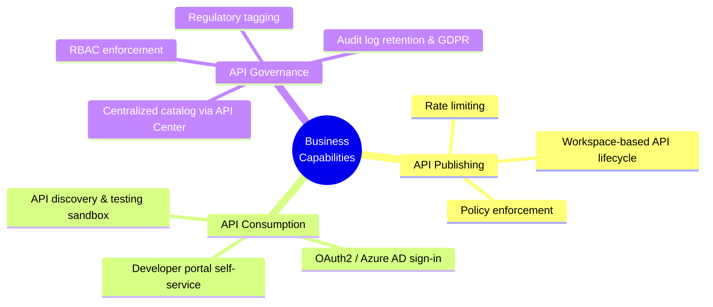
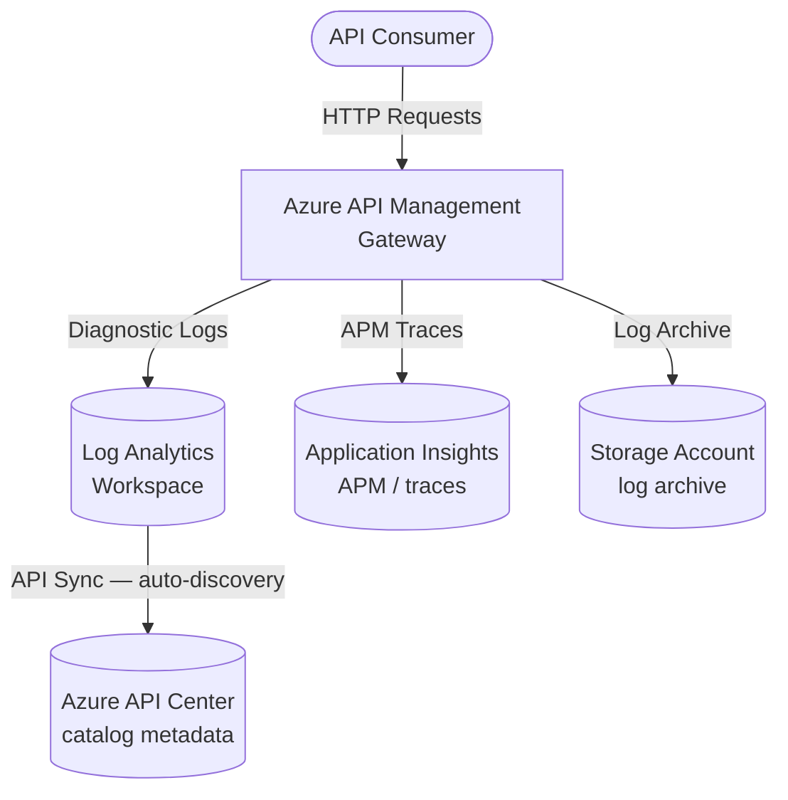
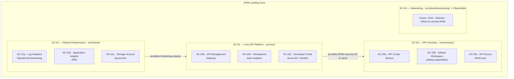
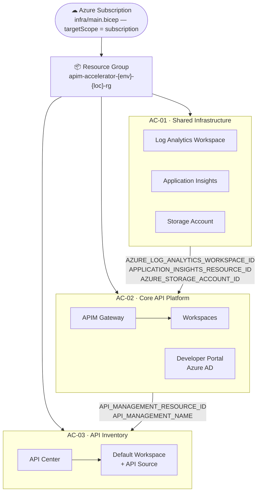
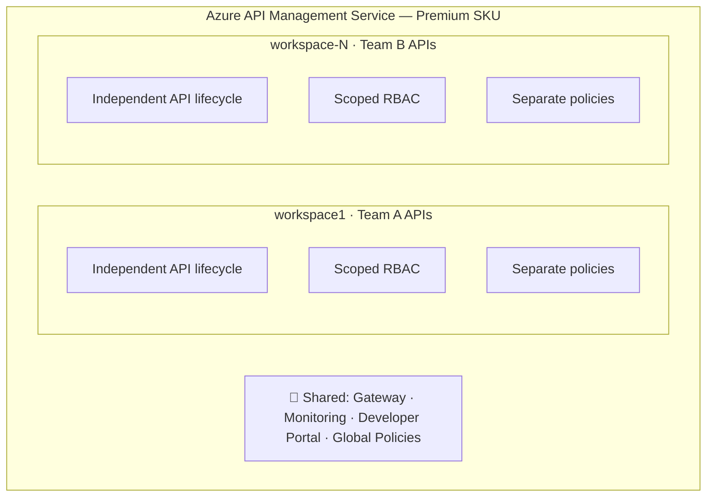
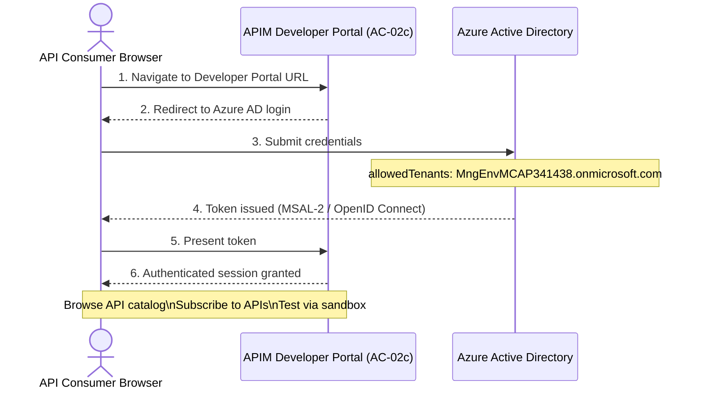
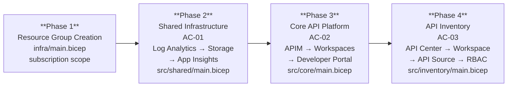
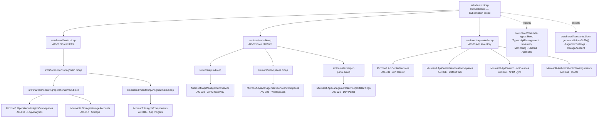

# APIM Accelerator — Application Layer Architecture

### Based on TOGAF Architecture Development Method (ADM) — BDAT Model

| Attribute            | Value                                 |
| -------------------- | ------------------------------------- |
| **Document Version** | 1.0.0                                 |
| **Date**             | April 15, 2026                        |
| **Author**           | Cloud Platform Team                   |
| **Solution**         | APIM Accelerator (`apim-accelerator`) |
| **Classification**   | Internal — Architecture Reference     |
| **Status**           | Baseline                              |

---

## Table of Contents

1. [Executive Summary](#1-executive-summary)
2. [Architecture Scope and Principles](#2-architecture-scope-and-principles)
3. [Business Architecture (B)](#3-business-architecture-b)
4. [Data Architecture (D)](#4-data-architecture-d)
5. [Application Architecture (A)](#5-application-architecture-a)
6. [Technology Architecture (T)](#6-technology-architecture-t)
7. [Architecture Decisions and Constraints](#7-architecture-decisions-and-constraints)
8. [Architecture Roadmap](#8-architecture-roadmap)
9. [Appendix — Module Dependency Map](#9-appendix--module-dependency-map)

---

## 1. Executive Summary

The **APIM Accelerator** is an Azure landing-zone reference implementation that provisions a production-grade **API Management** platform using Azure Developer CLI (`azd`) and Azure Bicep Infrastructure-as-Code. The solution provides a complete, repeatable deployment of API gateway, observability, governance, and developer-experience capabilities across multiple environments (`dev`, `test`, `staging`, `uat`, `prod`).

This document captures the architecture of the solution according to the **TOGAF Business–Data–Application–Technology (BDAT)** layered model, focusing specifically on the **Application Architecture** domain while providing sufficient context from the other three domains to make the architecture self-contained and traceable.

---

## 2. Architecture Scope and Principles

### 2.1 Scope

| Dimension             | Boundary                                                                                                            |
| --------------------- | ------------------------------------------------------------------------------------------------------------------- |
| **In-scope**          | Azure infrastructure provisioning, API gateway, observability, API inventory, developer portal, workspace isolation |
| **Out-of-scope**      | Business application code, API backend services, end-user front-ends                                                |
| **Deployment target** | Azure subscription (subscription-scoped Bicep deployment)                                                           |
| **Environments**      | dev · test · staging · uat · prod                                                                                   |

### 2.2 Guiding Architecture Principles

| #    | Principle                              | Rationale                                                                                                       |
| ---- | -------------------------------------- | --------------------------------------------------------------------------------------------------------------- |
| P-01 | **Infrastructure as Code**             | All resources are declared in Bicep; no manual portal changes.                                                  |
| P-02 | **Security by default**                | Managed Identities replace credentials; RBAC is minimal-privilege.                                              |
| P-03 | **Observability first**                | Monitoring stack (Log Analytics + Application Insights) is deployed before any platform service.                |
| P-04 | **Environment parity**                 | A single parameterized template covers all environments, preventing configuration drift.                        |
| P-05 | **Team isolation without duplication** | Workspaces provide logical API isolation within a shared APIM instance, reducing cost and operational overhead. |
| P-06 | **Governance-driven inventory**        | Azure API Center is the authoritative catalog for API discovery and compliance.                                 |
| P-07 | **Least-privilege RBAC**               | Role assignments are scoped at the resource-group level and use built-in roles where possible.                  |

---

## 3. Business Architecture (B)

### 3.1 Business Motivation and Drivers

| Driver                     | Description                                                                                                          |
| -------------------------- | -------------------------------------------------------------------------------------------------------------------- |
| **API-first strategy**     | The organization (Contoso) exposes digital capabilities as APIs to internal teams, partners, and external consumers. |
| **Operational efficiency** | A shared, governed API platform reduces duplicated gateway infrastructure across business units.                     |
| **Regulatory compliance**  | GDPR-tagged workloads require auditable access and documented data flows (`RegulatoryCompliance: GDPR`).             |
| **Cost transparency**      | Chargeback model (`Dedicated`) and budget codes (`FY25-Q1-InitiativeX`) enable per-unit cost attribution.            |
| **Developer experience**   | A self-service developer portal reduces the friction for API consumers and accelerates adoption.                     |

### 3.2 Stakeholders

| Role                      | Concern                                                        |
| ------------------------- | -------------------------------------------------------------- |
| **Cloud Platform Team**   | Deploy, operate, and evolve the APIM landing zone              |
| **API Producers**         | Publish, version, and document APIs within assigned workspaces |
| **API Consumers**         | Discover, subscribe to, and test APIs via developer portal     |
| **Security / Compliance** | Enforce RBAC, audit logging, and regulatory tagging            |
| **Finance / FinOps**      | Cost attribution via tags (`CostCenter`, `BudgetCode`)         |
| **IT Management**         | Governance, service availability, and SLA assurance            |

### 3.3 Business Capabilities Enabled



---

## 4. Data Architecture (D)

### 4.1 Data Domains

The APIM Accelerator manages three distinct data domains:

| Domain                           | Description                                                                    | Storage                                              |
| -------------------------------- | ------------------------------------------------------------------------------ | ---------------------------------------------------- |
| **Operational Telemetry**        | Diagnostic logs, gateway traces, metrics from APIM and all platform components | Log Analytics Workspace + Storage Account (archival) |
| **Application Performance Data** | Request/response latency, failure rates, dependency maps                       | Application Insights                                 |
| **API Catalog Metadata**         | API definitions, versions, environments, compliance attributes                 | Azure API Center                                     |

### 4.2 Data Flow Overview



### 4.3 Data Sensitivity and Governance

| Data Element        | Classification | Retention                    | Mechanism                            |
| ------------------- | -------------- | ---------------------------- | ------------------------------------ |
| Gateway access logs | Internal       | Long-term archival           | Storage Account                      |
| Performance traces  | Internal       | Configurable (Log Analytics) | Application Insights → Log Analytics |
| Instrumentation key | **Secret**     | N/A                          | Secure output (`@secure()`)          |
| API definitions     | Internal       | Persistent                   | Azure API Center                     |
| Resource tags       | Internal       | Persistent                   | Azure Resource Manager               |

> **Note:** The instrumentation key is exposed only as a `@secure()` Bicep output to prevent accidental logging in CI/CD pipelines.

---

## 5. Application Architecture (A)

This is the primary domain of this document. The application architecture describes the logical application components, their responsibilities, their interfaces, and their interaction patterns.

### 5.1 Logical Application Components

The solution is decomposed into four logical application components aligned to the Bicep module hierarchy:



### 5.2 Application Component Catalog

#### AC-01 — Shared Infrastructure Component

| Attribute            | Value                       |
| -------------------- | --------------------------- |
| **ID**               | AC-01                       |
| **Name**             | Shared Infrastructure       |
| **Module**           | `src/shared/main.bicep`     |
| **Scope**            | Resource Group              |
| **Deployment order** | 1 (first — no dependencies) |

**Sub-components:**

| ID     | Sub-Component              | Module                                         | Azure Resource Type                        | Responsibility                                                                                                |
| ------ | -------------------------- | ---------------------------------------------- | ------------------------------------------ | ------------------------------------------------------------------------------------------------------------- |
| AC-01a | Log Analytics Workspace    | `src/shared/monitoring/operational/main.bicep` | `Microsoft.OperationalInsights/workspaces` | Centralizes all diagnostic logs and enables Kusto queries across all platform components                      |
| AC-01b | Application Insights       | `src/shared/monitoring/insights/main.bicep`    | `Microsoft.Insights/components`            | Application Performance Monitoring (APM) — tracks request rates, failure rates, latency, and dependency calls |
| AC-01c | Diagnostic Storage Account | `src/shared/monitoring/operational/main.bicep` | `Microsoft.Storage/storageAccounts`        | Long-term log archival for compliance and audit; receives diagnostic exports from APIM                        |

**Interfaces provided:**

- `AZURE_LOG_ANALYTICS_WORKSPACE_ID` → consumed by AC-02
- `APPLICATION_INSIGHTS_RESOURCE_ID` → consumed by AC-02
- `APPLICATION_INSIGHTS_NAME` → consumed by AC-02
- `APPLICATION_INSIGHTS_INSTRUMENTATION_KEY` _(secure)_ → consumed by AC-02
- `AZURE_STORAGE_ACCOUNT_ID` → consumed by AC-02

---

#### AC-02 — Core API Platform Component

| Attribute            | Value                                                           |
| -------------------- | --------------------------------------------------------------- |
| **ID**               | AC-02                                                           |
| **Name**             | Core API Platform                                               |
| **Module**           | `src/core/main.bicep`                                           |
| **Scope**            | Resource Group                                                  |
| **Deployment order** | 2 (depends on AC-01)                                            |
| **SKU**              | Premium (configurable: Basic, Standard, Consumption, Developer) |
| **Capacity**         | 1 scale unit (configurable 1–10 for Premium)                    |

**Sub-components:**

| ID     | Sub-Component          | Module                            | Azure Resource Type                                                    | Responsibility                                                                                            |
| ------ | ---------------------- | --------------------------------- | ---------------------------------------------------------------------- | --------------------------------------------------------------------------------------------------------- |
| AC-02a | API Management Service | `src/core/apim.bicep`             | `Microsoft.ApiManagement/service`                                      | Core API gateway: routing, policy enforcement, rate limiting, authentication, caching, TLS termination    |
| AC-02b | Workspaces             | `src/core/workspaces.bicep`       | `Microsoft.ApiManagement/service/workspaces`                           | Logical isolation of API sets per team or project within the shared APIM instance                         |
| AC-02c | Developer Portal       | `src/core/developer-portal.bicep` | `Microsoft.ApiManagement/service/portalsettings` + `identityProviders` | Self-service portal for API discovery, testing, and subscription management; secured by Azure AD (MSAL-2) |

**Interfaces provided:**

- `API_MANAGEMENT_RESOURCE_ID` → consumed by AC-03
- `API_MANAGEMENT_NAME` → consumed by AC-03 and AC-02c

**Interfaces consumed:**

- `AZURE_LOG_ANALYTICS_WORKSPACE_ID` ← AC-01a
- `APPLICATION_INSIGHTS_RESOURCE_ID` ← AC-01b
- `AZURE_STORAGE_ACCOUNT_ID` ← AC-01c

**Security sub-components of AC-02a:**

| Feature                     | Implementation                                                                         |
| --------------------------- | -------------------------------------------------------------------------------------- |
| Managed Identity            | `SystemAssigned` (default); supports `UserAssigned`                                    |
| Diagnostic Settings         | Sends `allLogs` + `allMetrics` to Log Analytics and Storage Account                    |
| Application Insights Logger | Connected via `applicationInsIghtsResourceId`                                          |
| RBAC                        | Reader role (`acdd72a7-...`) assigned to APIM service identity                         |
| Network Access              | `publicNetworkAccess: true` by default; configurable to `false` for private deployment |
| VNet Integration            | `None` by default; configurable to `External` or `Internal`                            |

---

#### AC-03 — API Inventory Component

| Attribute            | Value                      |
| -------------------- | -------------------------- |
| **ID**               | AC-03                      |
| **Name**             | API Inventory              |
| **Module**           | `src/inventory/main.bicep` |
| **Scope**            | Resource Group             |
| **Deployment order** | 3 (depends on AC-02)       |

**Sub-components:**

| ID     | Sub-Component          | Azure Resource Type                                  | Responsibility                                                                                                       |
| ------ | ---------------------- | ---------------------------------------------------- | -------------------------------------------------------------------------------------------------------------------- |
| AC-03a | API Center Service     | `Microsoft.ApiCenter/services`                       | Authoritative catalog for all APIs; enables governance, compliance tracking, and API discovery across the enterprise |
| AC-03b | Default Workspace      | `Microsoft.ApiCenter/services/workspaces`            | Organizational container within API Center; separates APIs by team or domain                                         |
| AC-03c | API Source Integration | `Microsoft.ApiCenter/services/workspaces/apiSources` | Links the APIM service to API Center for automatic API discovery and synchronization                                 |
| AC-03d | Role Assignments       | `Microsoft.Authorization/roleAssignments`            | Grants `API Center Data Reader` and `API Center Compliance Manager` roles to the API Center managed identity         |

**Interfaces consumed:**

- `API_MANAGEMENT_RESOURCE_ID` ← AC-02
- `API_MANAGEMENT_NAME` ← AC-02

---

#### AC-04 — Networking Component _(Placeholder)_

| Attribute  | Value                              |
| ---------- | ---------------------------------- |
| **ID**     | AC-04                              |
| **Name**   | Networking                         |
| **Module** | `src/shared/networking/main.bicep` |
| **Status** | **Placeholder — not yet active**   |

**Planned capabilities:**

- Azure Virtual Network (VNet) with dedicated subnets for APIM internal deployment
- Network Security Groups (NSG) with APIM-specific rules
- Private Endpoints for Log Analytics and Storage
- VNet peering to backend API services

---

### 5.3 Application Interaction Diagram



### 5.4 Application Services Catalog

| Service ID | Service Name         | Type                          | Consumer                     | Protocol | Authentication                    |
| ---------- | -------------------- | ----------------------------- | ---------------------------- | -------- | --------------------------------- |
| SVC-01     | API Gateway          | Pass-through / transformation | External API consumers       | HTTPS    | OAuth2, subscriptions keys, mTLS  |
| SVC-02     | Developer Portal     | Web application               | API developers and consumers | HTTPS    | Azure AD (MSAL-2, OpenID Connect) |
| SVC-03     | APIM Management API  | REST API                      | Platform operators           | HTTPS    | Azure RBAC (ARM)                  |
| SVC-04     | API Center Catalog   | REST API + Portal             | API governance teams         | HTTPS    | Azure RBAC                        |
| SVC-05     | Diagnostic Pipeline  | Event stream                  | Observability system         | Internal | Managed Identity                  |
| SVC-06     | Log Analytics Query  | REST/KQL                      | Platform operators           | HTTPS    | Azure RBAC                        |
| SVC-07     | Application Insights | APM stream                    | Monitoring dashboards        | Internal | Instrumentation Key               |

### 5.5 Workspace Isolation Model

The Premium SKU of APIM enables **workspace-based multi-tenancy** within a single service instance:



Benefits:

- **Cost efficiency** — one Premium instance vs. multiple APIM instances per team
- **Centralized governance** — shared policies, monitoring, and portal
- **Team autonomy** — independent API publish/version/deprecate cycle per workspace

### 5.6 Developer Portal Authentication Flow



---

## 6. Technology Architecture (T)

### 6.1 Azure Services Summary

| Service                             | Azure Resource Type                        | Role                                         | SKU / Tier               |
| ----------------------------------- | ------------------------------------------ | -------------------------------------------- | ------------------------ |
| **API Management**                  | `Microsoft.ApiManagement/service`          | API gateway, policy engine, developer portal | Premium (configurable)   |
| **Log Analytics Workspace**         | `Microsoft.OperationalInsights/workspaces` | Centralized log store and query engine       | PerGB2018                |
| **Application Insights**            | `Microsoft.Insights/components`            | APM, distributed tracing, live metrics       | Standard (linked to LAW) |
| **Storage Account**                 | `Microsoft.Storage/storageAccounts`        | Diagnostic log archival                      | Standard LRS (StorageV2) |
| **API Center**                      | `Microsoft.ApiCenter/services`             | API catalog and governance                   | Standard                 |
| **Virtual Network** _(placeholder)_ | `Microsoft.ScVmm/virtualNetworks`          | Network isolation _(future)_                 | N/A                      |

### 6.2 Identity and Security Architecture

| Component               | Identity Type                     | Roles Assigned                                                    |
| ----------------------- | --------------------------------- | ----------------------------------------------------------------- |
| API Management Service  | SystemAssigned Managed Identity   | Reader (`acdd72a7-3385-48ef-bd42-f606fba81ae7`) on resource group |
| API Center Service      | SystemAssigned Managed Identity   | API Center Data Reader; API Center Compliance Manager             |
| Log Analytics Workspace | SystemAssigned Managed Identity   | Self-managed                                                      |
| Developer Portal        | Azure AD Application Registration | OpenID Connect / MSAL-2                                           |

### 6.3 Deployment Technology Stack

| Layer                        | Technology                                                                       |
| ---------------------------- | -------------------------------------------------------------------------------- |
| **IaC Language**             | Azure Bicep 2.x                                                                  |
| **Deployment CLI**           | Azure Developer CLI (`azd`) — `azd up`, `azd provision`, `azd deploy`            |
| **Orchestration script**     | POSIX shell (`pre-provision.sh`)                                                 |
| **Deployment scope**         | Azure Subscription (`targetScope = 'subscription'`)                              |
| **Configuration**            | YAML (`infra/settings.yaml`) loaded via `loadYamlContent()`                      |
| **Naming convention**        | `{solutionName}-{uniqueSuffix}-{resourceType}`                                   |
| **Unique suffix generation** | Deterministic — derived from subscription ID + resource group ID + location hash |

### 6.4 Resource Naming Convention

```
Resource Group:   {solutionName}-{envName}-{location}-rg
                  e.g., apim-accelerator-prod-eastus-rg

APIM Service:     {solutionName}-{uniqueSuffix}-apim
                  e.g., apim-accelerator-abc123-apim

Storage Account:  {solutionName}{uniqueSuffix}sa   (max 24 chars, no hyphens)

Log Analytics:    {solutionName}-{uniqueSuffix}-law

App Insights:     {solutionName}-{uniqueSuffix}-ai
```

### 6.5 Deployment Sequence



### 6.6 Governance Tags Applied to All Resources

| Tag Key                | Example Value                  | Purpose                               |
| ---------------------- | ------------------------------ | ------------------------------------- |
| `environment`          | `prod`                         | Environment classification            |
| `managedBy`            | `bicep`                        | IaC provenance                        |
| `templateVersion`      | `2.0.0`                        | Template version traceability         |
| `CostCenter`           | `CC-1234`                      | Cost allocation                       |
| `BusinessUnit`         | `IT`                           | Organizational unit                   |
| `Owner`                | `evilazaro@gmail.com`          | Accountability                        |
| `ApplicationName`      | `APIM Platform`                | Workload identification               |
| `ProjectName`          | `APIMForAll`                   | Initiative traceability               |
| `ServiceClass`         | `Critical`                     | Criticality / SLA tier                |
| `RegulatoryCompliance` | `GDPR`                         | Compliance classification             |
| `ChargebackModel`      | `Dedicated`                    | FinOps model                          |
| `BudgetCode`           | `FY25-Q1-InitiativeX`          | Budget attribution                    |
| `lz-component-type`    | `core` / `shared`              | Landing zone component classification |
| `component`            | `apiManagement` / `monitoring` | Component identifier                  |

---

## 7. Architecture Decisions and Constraints

### 7.1 Architecture Decision Records (ADR)

| ADR    | Decision                            | Rationale                                                          | Trade-off                                                  |
| ------ | ----------------------------------- | ------------------------------------------------------------------ | ---------------------------------------------------------- |
| ADR-01 | **Premium SKU for APIM**            | Enables workspaces, multi-region, VNet integration, and higher SLA | Higher cost vs. Standard/Basic                             |
| ADR-02 | **Subscription-scope deployment**   | Allows cross-RG management and consistent resource-group naming    | Requires `Owner` or `Contributor` at subscription level    |
| ADR-03 | **SystemAssigned Managed Identity** | No credential management; identity lifecycle tied to resource      | Cannot be shared across resources                          |
| ADR-04 | **YAML for environment settings**   | Human-readable; separates configuration from infrastructure        | Requires `loadYamlContent()` support in Bicep              |
| ADR-05 | **Deterministic unique suffix**     | Reproducible deployments without collisions across environments    | Requires consistent input parameters                       |
| ADR-06 | **API Center for catalog**          | Provides governance, compliance, and automated discovery from APIM | Separate service cost; not available in all regions        |
| ADR-07 | **Networking as placeholder**       | VNet integration deferred; reduces initial complexity              | APIM is public-facing by default until VNet is implemented |

### 7.2 Constraints

| Constraint                                                    | Impact                                              |
| ------------------------------------------------------------- | --------------------------------------------------- |
| APIM Premium SKU requires at least 1 scale unit               | Minimum viable capacity, not cost-optimized for dev |
| Workspaces are a Premium-only feature                         | Lower SKUs cannot use workspace isolation           |
| Developer portal OAuth2 requires an Azure AD app registration | Must be pre-created out-of-band                     |
| Storage account names max 24 characters, no hyphens           | Naming logic must handle truncation                 |
| API Center has limited regional availability                  | May constrain deployment location choices           |

---

## 8. Architecture Roadmap

| Phase                         | Capability                                                                                     | Module(s) Affected                                        |
| ----------------------------- | ---------------------------------------------------------------------------------------------- | --------------------------------------------------------- |
| **Now (Baseline)**            | Shared monitoring, APIM Premium, workspaces, developer portal (Azure AD), API Center inventory | All current modules                                       |
| **Next — Security Hardening** | Private APIM (`virtualNetworkType: Internal`), disable public network access                   | `src/core/apim.bicep`, `src/shared/networking/main.bicep` |
| **Next — Networking**         | VNet + subnets + NSG for private APIM, Private Endpoints for Log Analytics and Storage         | `src/shared/networking/main.bicep` (activate placeholder) |
| **Future — Policy**           | Azure Policy for tag enforcement, APIM policy sets, throttling defaults                        | New module `src/governance/`                              |
| **Future — CI/CD**            | GitHub Actions / Azure DevOps pipeline integration with `azd`                                  | `.github/workflows/`, `.azdo/pipelines/`                  |
| **Future — Multi-region**     | APIM Premium multi-region with Traffic Manager                                                 | `src/core/apim.bicep` (premium multi-region params)       |

---

## 9. Appendix — Module Dependency Map



---

_This document was generated from workspace analysis of the APIM Accelerator repository (`Evilazaro/APIM-Accelerator`, branch `main`) on April 15, 2026. It reflects the architecture as implemented in Bicep IaC and is intended as a living document to be updated alongside the codebase._
