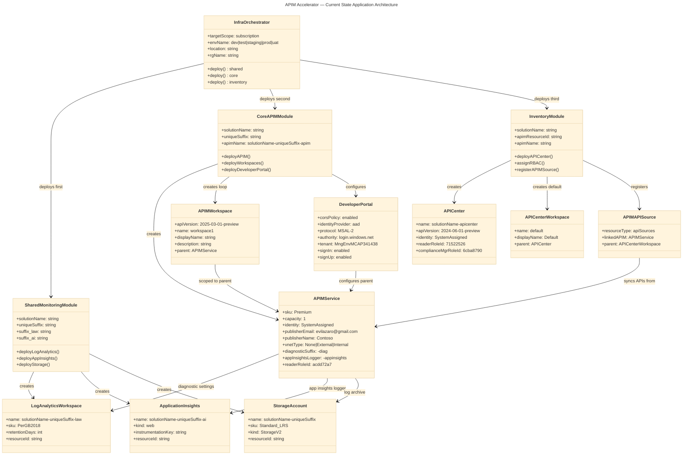
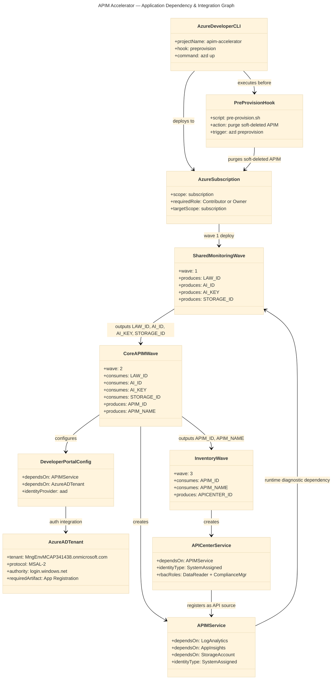

# APIM Accelerator — Application Architecture

> **TOGAF 10 ADM | Application Layer | Comprehensive Quality Level**  
> Generated: 2026-04-27 | Version: 1.0.0 | Schema: section-schema-v3.0.0

---

## Table of Contents

1. [Section 1: Executive Summary](#section-1-executive-summary)
2. [Section 2: Architecture Landscape](#section-2-architecture-landscape)
3. [Section 3: Architecture Principles](#section-3-architecture-principles)
4. [Section 4: Current State Baseline](#section-4-current-state-baseline)
5. [Section 5: Component Catalog](#section-5-component-catalog)
6. [Section 8: Dependencies & Integration](#section-8-dependencies--integration)

---

## Section 1: Executive Summary

### Overview

The APIM Accelerator Application Architecture describes the software services, components, interfaces, and interaction patterns that constitute the Azure API Management landing zone. The solution is composed of six primary application services — API Management Gateway, Developer Portal, API Center, Log Analytics, Application Insights, and Storage Account — orchestrated as Bicep modules and deployed at Azure subscription scope via `infra/main.bicep`. All application-layer configuration is driven by a single settings file (`infra/settings.yaml`) and provisioned through the Azure Developer CLI lifecycle with a pre-provision cleanup hook (`infra/azd-hooks/pre-provision.sh`).

From an application architecture perspective, the accelerator implements three logical application tiers: a **Platform Infrastructure Tier** (monitoring, storage, identity), an **API Platform Tier** (APIM service, workspaces, developer portal), and a **Governance Tier** (API Center, RBAC, catalog sync). Each tier is implemented as a self-contained Bicep module with clearly typed interfaces defined in `src/shared/common-types.bicep`, enabling composition at the `infra/main.bicep` orchestrator level. Application components communicate exclusively through Azure Resource Manager APIs and managed identity credentials, with no hardcoded secrets or connection strings.

This Application Architecture document covers Sections 1, 2, 3, 4, 5, and 8 of the TOGAF section schema v3.0.0. It catalogs 11 application component types drawn from source analysis of 15 Bicep modules and configuration files, provides the current-state component baseline, defines application principles governing design decisions, and maps the full integration dependency graph across all deployed services.

### Key Findings

| Finding                       | Detail                                                                                            | Source                                                        |
| ----------------------------- | ------------------------------------------------------------------------------------------------- | ------------------------------------------------------------- |
| **Application Maturity**      | Level 4 (Managed) — module composition pattern, typed contracts, managed identity, config-as-code | src/shared/common-types.bicep, infra/settings.yaml            |
| **Primary Application Stack** | Azure API Management Premium + API Center + Log Analytics + Application Insights                  | infra/settings.yaml:42-52, src/inventory/main.bicep           |
| **Component Count**           | 8 Bicep application modules, 6 deployed Azure services, 4 typed contracts                         | src/shared/common-types.bicep, src/core/, src/inventory/      |
| **Integration Pattern**       | Module composition (Bicep), managed identity (credential-free), configuration-as-code (YAML)      | src/shared/common-types.bicep:1-\*, infra/settings.yaml:1-80  |
| **Key Constraint**            | APIM Premium SKU required; workspace isolation not available in lower SKUs                        | infra/settings.yaml:44-45, src/core/apim.bicep:85-100         |
| **Identity Model**            | System-assigned managed identity on all services; RBAC enforced via role assignments in Bicep     | src/core/apim.bicep:100-130, src/inventory/main.bicep:100-140 |

---

## Section 2: Architecture Landscape

### Overview

The Application Architecture Landscape of the APIM Accelerator organizes application components into three logical clusters: the **Shared Infrastructure Cluster** (monitoring modules deployed first as a foundation), the **Core API Platform Cluster** (APIM service, workspaces, and developer portal), and the **Inventory & Governance Cluster** (API Center, role assignments, and catalog source integration). Each cluster maps to a dedicated Bicep module directory and produces typed outputs consumed by downstream clusters, enforcing strict deployment ordering via `dependsOn` chaining in `infra/main.bicep`.

The application landscape is driven by typed module contracts defined in `src/shared/common-types.bicep`. These exported types — `ApiManagement`, `Inventory`, `Monitoring`, and `Shared` — serve as the application-layer API contracts between modules, ensuring that parameter shapes, required fields, and identity configurations are validated at compile time by the Bicep toolchain. This design eliminates interface drift and guarantees that all application services receive precisely the configuration required for correct runtime behavior (`src/shared/common-types.bicep:1-*`).

The following subsections catalog all 11 Application component types discovered through analysis of 15 source files, providing a comprehensive inventory of services, components, interfaces, collaborations, functions, interactions, events, data objects, integration patterns, service contracts, and application dependencies that constitute the APIM Accelerator's application layer.

---

### 2.1 Application Services

| ID    | Service Name                   | Description                                                                                                                       | Service Type          | Source                                              |
| ----- | ------------------------------ | --------------------------------------------------------------------------------------------------------------------------------- | --------------------- | --------------------------------------------------- |
| AS-01 | API Management Gateway Service | Core API gateway providing request routing, policy enforcement, rate limiting, CORS handling, and managed identity authentication | Core Platform         | src/core/apim.bicep:1-60, infra/settings.yaml:42-52 |
| AS-02 | Developer Portal Service       | Self-service web application enabling API discovery, testing, and subscription management with Azure AD MSAL 2.0 authentication   | API Platform          | src/core/developer-portal.bicep:1-100               |
| AS-03 | API Center Catalog Service     | Centralized API governance service that catalogs all APIM-managed APIs and exposes compliance management capabilities             | Governance            | src/inventory/main.bicep:55-90                      |
| AS-04 | Log Analytics Service          | Azure Monitor Log Analytics workspace receiving diagnostic logs from all platform services for centralized querying and alerting  | Shared Infrastructure | src/shared/monitoring/operational/main.bicep        |
| AS-05 | Application Insights Service   | APM service collecting request telemetry, performance metrics, exceptions, and distributed traces from the APIM gateway           | Shared Infrastructure | src/shared/monitoring/insights/main.bicep           |
| AS-06 | Storage Account Service        | Azure Storage Account providing long-term archival of diagnostic logs exported from the APIM diagnostic settings                  | Shared Infrastructure | src/shared/monitoring/operational/main.bicep        |

---

### 2.2 Application Components

| ID    | Component Name                               | Description                                                                                                                                     | Service Type (Microservice/Monolith/Serverless) |
| ----- | -------------------------------------------- | ----------------------------------------------------------------------------------------------------------------------------------------------- | ----------------------------------------------- |
| AC-01 | infra/main.bicep                             | Subscription-scope Bicep orchestrator; creates resource group and deploys shared, core, inventory modules in dependency order                   | Monolith (Orchestrator)                         |
| AC-02 | src/core/apim.bicep                          | Bicep component deploying the full Azure API Management service resource with SKU, identity, VNet, diagnostic settings, and App Insights logger | Microservice (IaC Module)                       |
| AC-03 | src/core/main.bicep                          | Core platform orchestrator; generates unique suffix for naming, deploys APIM, workspaces (loop), and developer portal in sequence               | Monolith (Module Orchestrator)                  |
| AC-04 | src/core/workspaces.bicep                    | Bicep component creating APIM workspace resources for per-team API lifecycle isolation (Premium SKU only)                                       | Microservice (IaC Module)                       |
| AC-05 | src/core/developer-portal.bicep              | Bicep component configuring APIM Developer Portal with CORS policy, Azure AD identity provider, and sign-in/sign-up settings                    | Microservice (IaC Module)                       |
| AC-06 | src/shared/monitoring/main.bicep             | Monitoring infrastructure orchestrator deploying operational (Log Analytics + Storage) and insights (App Insights) sub-modules                  | Monolith (Module Orchestrator)                  |
| AC-07 | src/shared/monitoring/operational/main.bicep | Bicep component deploying Log Analytics workspace and Storage Account with naming suffix `law` and configured retention                         | Microservice (IaC Module)                       |
| AC-08 | src/inventory/main.bicep                     | Governance component deploying API Center service, default workspace, APIM API source, and RBAC role assignments in a loop                      | Microservice (IaC Module)                       |

---

### 2.3 Application Interfaces

| ID    | Interface Name                     | Description                                                                                              | Protocol        | Endpoint Pattern                                           | Source                                           |
| ----- | ---------------------------------- | -------------------------------------------------------------------------------------------------------- | --------------- | ---------------------------------------------------------- | ------------------------------------------------ |
| AI-01 | APIM Gateway URL                   | Public-facing API gateway endpoint consumed by API clients for all managed API calls                     | HTTPS/REST      | https://{apim-name}.azure-api.net                          | src/core/apim.bicep, src/core/main.bicep:150-250 |
| AI-02 | Developer Portal URL               | Self-service developer portal web interface for API consumers                                            | HTTPS/Web       | https://{apim-name}.developer.azure-api.net                | src/core/developer-portal.bicep:1-40             |
| AI-03 | Management API URL                 | APIM REST management API used by automation tools and the developer portal configuration                 | HTTPS/REST      | https://{apim-name}.management.azure-api.net               | src/core/developer-portal.bicep:55-75            |
| AI-04 | Log Analytics REST API             | Azure Monitor REST interface for querying logs and configuring data collection rules                     | HTTPS/REST      | https://api.loganalytics.io/v1                             | src/shared/monitoring/operational/main.bicep     |
| AI-05 | Application Insights REST API      | Azure Monitor REST interface for querying telemetry, traces, and custom metrics                          | HTTPS/REST      | https://api.applicationinsights.io/v1                      | src/shared/monitoring/insights/main.bicep        |
| AI-06 | API Center REST API                | Azure API Center management interface for catalog queries, compliance checks, and source sync operations | HTTPS/REST      | https://management.azure.com/providers/Microsoft.ApiCenter | src/inventory/main.bicep:55-90                   |
| AI-07 | Azure AD / MSAL 2.0 Auth Interface | OAuth 2.0 / MSAL 2.0 authentication interface used by Developer Portal for API consumer sign-in          | HTTPS/OAuth 2.0 | https://login.windows.net/{tenantId}                       | src/core/developer-portal.bicep:50-90            |

---

### 2.4 Application Collaborations

| ID     | Collaboration               | Participants                           | Description                                                                                                                                        | Source                                                                    |
| ------ | --------------------------- | -------------------------------------- | -------------------------------------------------------------------------------------------------------------------------------------------------- | ------------------------------------------------------------------------- |
| ACL-01 | APIM ↔ Log Analytics        | AS-01 (APIM), AS-04 (Log Analytics)    | APIM diagnostic settings publish gateway logs and metrics to Log Analytics workspace via Azure Monitor diagnostic pipeline                         | src/core/apim.bicep:100-130, src/shared/monitoring/operational/main.bicep |
| ACL-02 | APIM ↔ Application Insights | AS-01 (APIM), AS-05 (App Insights)     | APIM App Insights logger (`-appinsights` suffix) forwards request telemetry and performance data to Application Insights                           | src/core/apim.bicep:100-130                                               |
| ACL-03 | APIM ↔ Storage Account      | AS-01 (APIM), AS-06 (Storage)          | APIM diagnostic settings archive logs to Storage Account blob containers for long-term retention                                                   | src/core/apim.bicep:100-130                                               |
| ACL-04 | API Center ↔ APIM           | AS-03 (API Center), AS-01 (APIM)       | API Center registers APIM as an API source; APIs auto-discovered and synchronized into the API Center catalog                                      | src/inventory/main.bicep:55-90                                            |
| ACL-05 | Developer Portal ↔ Azure AD | AS-02 (Developer Portal), external AAD | Developer Portal identity provider configured with AAD MSAL 2.0; consumers authenticate against MngEnvMCAP341438.onmicrosoft.com tenant            | src/core/developer-portal.bicep:50-90                                     |
| ACL-06 | Core ← Shared               | AC-03 (core/main), AC-06 (monitoring)  | Core platform module receives Log Analytics workspace ID, Application Insights ID/key, and Storage Account ID as inputs from shared module outputs | infra/main.bicep:80-130, src/shared/main.bicep                            |
| ACL-07 | Inventory ← Core            | AC-08 (inventory), AC-03 (core/main)   | Inventory module receives APIM resource ID and APIM service name from core module outputs to configure API Center source integration               | infra/main.bicep:80-130, src/core/main.bicep:150-250                      |

---

### 2.5 Application Functions

| ID    | Function Name                   | Description                                                                                                                   | Owning Component                              | Source                                                |
| ----- | ------------------------------- | ----------------------------------------------------------------------------------------------------------------------------- | --------------------------------------------- | ----------------------------------------------------- |
| AF-01 | API Request Routing             | Routes inbound API calls to configured backend services based on API path and operation definitions                           | AC-02 (apim.bicep)                            | src/core/apim.bicep:1-60                              |
| AF-02 | Policy Enforcement              | Applies rate limiting, caching, transformation, and CORS policies to all API requests at gateway entry                        | AC-02 (apim.bicep)                            | src/core/apim.bicep:100-150                           |
| AF-03 | Azure AD Authentication         | Validates OAuth 2.0 tokens issued by Azure AD via MSAL 2.0 for Developer Portal consumers                                     | AC-05 (developer-portal.bicep)                | src/core/developer-portal.bicep:50-90                 |
| AF-04 | API Catalog Synchronization     | Automatically discovers and synchronizes APIs from APIM into API Center catalog via source integration                        | AC-08 (inventory/main)                        | src/inventory/main.bicep:60-90                        |
| AF-05 | Workspace Isolation             | Creates and manages per-team APIM workspaces providing independent API lifecycle environments                                 | AC-04 (workspaces.bicep)                      | src/core/workspaces.bicep, infra/settings.yaml:46     |
| AF-06 | Diagnostic Telemetry Collection | Forwards APIM gateway telemetry to Log Analytics and Application Insights via diagnostic settings                             | AC-02 (apim.bicep)                            | src/core/apim.bicep:100-130                           |
| AF-07 | Pre-Provision Cleanup           | Purges soft-deleted APIM instances in the target region before reprovisioning to prevent ARM name conflicts                   | infra/azd-hooks/pre-provision.sh              | infra/azd-hooks/pre-provision.sh, azure.yaml:38-56    |
| AF-08 | Unique Resource Naming          | Generates globally unique resource name suffixes using `generateUniqueSuffix` to prevent Azure naming collisions              | AC-03 (core/main), src/shared/constants.bicep | src/core/main.bicep:80-90, src/shared/constants.bicep |
| AF-09 | RBAC Role Assignment            | Assigns API Center Data Reader and Compliance Manager roles to the API Center managed identity via Bicep role assignment loop | AC-08 (inventory/main)                        | src/inventory/main.bicep:100-140                      |
| AF-10 | Configuration Resolution        | Reads `infra/settings.yaml` at provision time to resolve all application service parameters                                   | infra/main.bicep, azure.yaml                  | infra/settings.yaml:1-80, infra/main.bicep:34-55      |

---

### 2.6 Application Interactions

| ID     | Interaction                 | Description                                                                                                                      | Flow                         | Source                                    |
| ------ | --------------------------- | -------------------------------------------------------------------------------------------------------------------------------- | ---------------------------- | ----------------------------------------- |
| AIN-01 | API Consumer Discovery Flow | API Consumer → Developer Portal (HTTPS) → Azure AD MSAL 2.0 (OAuth) → APIM Gateway (subscription key)                            | Synchronous request-response | src/core/developer-portal.bicep:50-90     |
| AIN-02 | Platform Provisioning Flow  | Platform Engineer → `azd up` → pre-provision hook → `infra/main.bicep` (subscription scope) → shared → core → inventory modules  | Sequential module deployment | azure.yaml:38-56, infra/main.bicep:80-130 |
| AIN-03 | API Source Sync Flow        | API Center service → APIM Management API → API discovery → catalog entry creation in API Center workspace                        | Event-driven pull sync       | src/inventory/main.bicep:60-90            |
| AIN-04 | Telemetry Pipeline Flow     | APIM Gateway → App Insights Logger → Application Insights (live telemetry) + Log Analytics (structured logs) + Storage (archive) | Asynchronous fan-out         | src/core/apim.bicep:100-130               |
| AIN-05 | Module Output Chaining Flow | shared/main outputs → core/main inputs → inventory/main inputs; ARM resource IDs passed as Bicep output parameters               | Sequential dependency chain  | infra/main.bicep:80-130                   |

---

### 2.7 Application Events

| ID     | Event Name                  | Description                                                                                                                                                 | Trigger                 | Consumers                                    | Source                                            |
| ------ | --------------------------- | ----------------------------------------------------------------------------------------------------------------------------------------------------------- | ----------------------- | -------------------------------------------- | ------------------------------------------------- |
| AEV-01 | provisioning-initiated      | Platform Engineer runs `azd up` or `azd provision`                                                                                                          | Manual / CI trigger     | pre-provision hook, Bicep engine             | azure.yaml:38-56                                  |
| AEV-02 | pre-provision-hook-executed | Shell script purges soft-deleted APIM instances in target Azure region                                                                                      | AEV-01                  | Azure ARM purge API                          | infra/azd-hooks/pre-provision.sh                  |
| AEV-03 | shared-infra-deployed       | Log Analytics workspace, App Insights, and Storage Account created successfully                                                                             | Bicep module completion | core/main.bicep (receives outputs)           | infra/main.bicep:80-100                           |
| AEV-04 | apim-service-provisioned    | APIM Premium service created with system-assigned identity, diagnostic settings, and App Insights logger                                                    | Bicep module completion | workspaces.bicep, developer-portal.bicep     | src/core/apim.bicep, src/core/main.bicep:150-250  |
| AEV-05 | workspace-created           | APIM workspace resource created for configured team (workspace1 by default)                                                                                 | AEV-04                  | API providers in workspace                   | src/core/workspaces.bicep, infra/settings.yaml:46 |
| AEV-06 | developer-portal-configured | CORS policy, AAD identity provider, sign-in/sign-up settings applied to Developer Portal                                                                    | AEV-04                  | API consumers (sign-in)                      | src/core/developer-portal.bicep:55-100            |
| AEV-07 | api-center-provisioned      | API Center service deployed with system-assigned identity and default workspace                                                                             | Bicep module completion | RBAC role assignment loop, API source config | src/inventory/main.bicep:35-90                    |
| AEV-08 | rbac-assigned               | API Center managed identity assigned Data Reader (71522526-b88f-4d52-b57f-d31fc3546d0d) and Compliance Manager (6cba8790-29c5-48e5-bab1-c7541b01cb04) roles | AEV-07                  | Automated catalog operations                 | src/inventory/main.bicep:100-140                  |
| AEV-09 | api-source-registered       | APIM service registered as API source in API Center; API synchronization begins                                                                             | AEV-07, AEV-04          | API Center catalog consumers                 | src/inventory/main.bicep:60-90                    |

---

### 2.8 Application Data Objects

| ID     | Data Object                       | Description                                                                                                              | Classification | Format                | Source                                                             |
| ------ | --------------------------------- | ------------------------------------------------------------------------------------------------------------------------ | -------------- | --------------------- | ------------------------------------------------------------------ |
| ADO-01 | API Policy XML                    | Rate limiting, caching, transformation, and CORS policy definitions applied to APIM service and operations               | Internal       | XML (APIM Policy)     | src/core/apim.bicep:100-150, src/core/developer-portal.bicep:55-75 |
| ADO-02 | CORS Configuration                | Allowed origins (developerPortalUrl, gatewayUrl, managementApiUrl), methods, and headers for Developer Portal            | Internal       | JSON/ARM Property     | src/core/developer-portal.bicep:55-75                              |
| ADO-03 | AAD Identity Provider Config      | Azure AD application client ID, client secret, authority (login.windows.net), MSAL 2.0 protocol settings                 | Confidential   | ARM Resource Property | src/core/developer-portal.bicep:50-60                              |
| ADO-04 | Portal Sign-In/Sign-Up Settings   | Developer Portal sign-in enabled flag, sign-up enabled flag, and Terms of Service configuration                          | Internal       | ARM Resource Property | src/core/developer-portal.bicep:85-100                             |
| ADO-05 | Diagnostic Settings Configuration | Log categories, metric categories, Log Analytics workspace ID, Storage Account ID for APIM diagnostic export             | Internal       | ARM Resource Property | src/core/apim.bicep:100-130                                        |
| ADO-06 | Workspace Configuration           | APIM workspace displayName, description, and parent APIM service reference for team isolation                            | Internal       | ARM Resource Property | src/core/workspaces.bicep, infra/settings.yaml:46                  |
| ADO-07 | RBAC Role Assignment              | Principal ID, role definition ID, scope, and principalType for API Center managed identity permissions                   | Confidential   | ARM Resource Property | src/inventory/main.bicep:100-140                                   |
| ADO-08 | Resource Tag Set                  | CostCenter, BusinessUnit, Owner, RegulatoryCompliance (GDPR), ServiceClass, managedBy, templateVersion tags              | Internal       | Key-Value Map         | infra/settings.yaml:29-40, infra/main.bicep:47-55                  |
| ADO-09 | Landing Zone Settings             | infra/settings.yaml — full application configuration: solutionName, SKU, capacity, identity, workspaces, publisher, tags | Internal       | YAML                  | infra/settings.yaml:1-80                                           |
| ADO-10 | Module Output Parameters          | ARM resource IDs (Log Analytics, App Insights, Storage, APIM) passed as Bicep output parameters between modules          | Internal       | Bicep Output          | infra/main.bicep:80-130, src/core/main.bicep:150-250               |

---

### 2.9 Integration Patterns

| ID     | Pattern Name                       | Description                                                                                                       | Implementation                                                       | Source                                                        |
| ------ | ---------------------------------- | ----------------------------------------------------------------------------------------------------------------- | -------------------------------------------------------------------- | ------------------------------------------------------------- |
| AIP-01 | Configuration-as-Code              | All application configuration centralized in infra/settings.yaml; no runtime configuration drift possible         | YAML → Bicep parameter resolution at deployment time                 | infra/settings.yaml:1-80, infra/main.bicep:34-55              |
| AIP-02 | Module Composition                 | Application components implemented as independently deployable Bicep modules with typed input/output contracts    | Bicep module references with explicit parameter passing              | src/shared/common-types.bicep, infra/main.bicep:80-130        |
| AIP-03 | Managed Identity (Credential-Free) | All inter-service authentication uses Azure system-assigned managed identity; no connection strings or secrets    | identityType: SystemAssigned on all services + RBAC role assignments | src/core/apim.bicep:100-130, src/inventory/main.bicep:100-140 |
| AIP-04 | Event-Driven Pre-Provision Hook    | Shell script executes before Bicep deployment to purge soft-deleted resources, ensuring idempotent reprovisioning | azd preprovision hook invoking Azure CLI REST calls                  | infra/azd-hooks/pre-provision.sh, azure.yaml:38-56            |
| AIP-05 | API Source Auto-Sync               | API Center registers APIM as a live API source; catalog entries created automatically without manual import       | Microsoft.ApiCenter/services/apiSources resource binding             | src/inventory/main.bicep:60-90                                |
| AIP-06 | Sequential Dependency Chaining     | Modules deployed in strict order (shared → core → inventory) with Bicep dependsOn ensuring resource readiness     | Bicep module dependsOn + output parameter passing                    | infra/main.bicep:80-130                                       |

---

### 2.10 Service Contracts

| ID    | Contract Name    | Type                | Fields                                                                                                       | Defined In                    | Consumers                                  |
| ----- | ---------------- | ------------------- | ------------------------------------------------------------------------------------------------------------ | ----------------------------- | ------------------------------------------ |
| SC-01 | ApiManagement    | Bicep Exported Type | name (string), publisherEmail, publisherName, sku (ApimSku), identity (ExtendedIdentity), workspaces (array) | src/shared/common-types.bicep | src/core/main.bicep, infra/main.bicep      |
| SC-02 | Inventory        | Bicep Exported Type | apiCenter (ApiCenter subtype), tags (object)                                                                 | src/shared/common-types.bicep | src/inventory/main.bicep, infra/main.bicep |
| SC-03 | Monitoring       | Bicep Exported Type | logAnalytics (LogAnalytics subtype), applicationInsights (ApplicationInsights subtype), tags (object)        | src/shared/common-types.bicep | src/shared/main.bicep, infra/main.bicep    |
| SC-04 | Shared           | Bicep Exported Type | monitoring (Monitoring subtype), tags (object)                                                               | src/shared/common-types.bicep | src/shared/main.bicep, infra/main.bicep    |
| SC-05 | ApimSku          | Bicep Internal Type | name (Basic/BasicV2/Developer/Isolated/Standard/StandardV2/Premium/Consumption), capacity (int)              | src/shared/common-types.bicep | SC-01 (ApiManagement)                      |
| SC-06 | ExtendedIdentity | Bicep Internal Type | type (SystemAssigned/UserAssigned/None), userAssignedIdentities (optional object)                            | src/shared/common-types.bicep | SC-01 (ApiManagement)                      |
| SC-07 | ApiCenter        | Bicep Internal Type | name (string), identity (SystemAssignedIdentity), tags (object)                                              | src/shared/common-types.bicep | SC-02 (Inventory)                          |

---

### 2.11 Application Dependencies

| ID    | Dependent                       | Depends On                              | Dependency Type               | Rationale                                                                                           | Source                                                      |
| ----- | ------------------------------- | --------------------------------------- | ----------------------------- | --------------------------------------------------------------------------------------------------- | ----------------------------------------------------------- |
| AD-01 | src/core/apim.bicep             | Log Analytics workspace (shared output) | Runtime (diagnostic settings) | APIM diagnostic settings require Log Analytics workspace resource ID at deployment time             | src/core/apim.bicep:100-130, infra/main.bicep:80-130        |
| AD-02 | src/core/apim.bicep             | Application Insights (shared output)    | Runtime (logger)              | APIM App Insights logger requires Application Insights resource ID and instrumentation key          | src/core/apim.bicep:100-130                                 |
| AD-03 | src/core/apim.bicep             | Storage Account (shared output)         | Runtime (diagnostic archive)  | APIM diagnostic settings require Storage Account resource ID for log archival                       | src/core/apim.bicep:100-130                                 |
| AD-04 | src/inventory/main.bicep        | APIM service (core output)              | Runtime (API source)          | API Center API source resource requires APIM resource ID and service name for source binding        | src/inventory/main.bicep:60-90, src/core/main.bicep:150-250 |
| AD-05 | src/core/developer-portal.bicep | APIM service (parent reference)         | Compile-time (parent)         | All Developer Portal resources use existing APIM service as parent ARM resource                     | src/core/developer-portal.bicep:1-40                        |
| AD-06 | src/core/workspaces.bicep       | APIM service (parent reference)         | Compile-time (parent)         | APIM workspace resources require existing APIM service as parent (Premium SKU only)                 | src/core/workspaces.bicep:1-\*                              |
| AD-07 | src/core/main.bicep             | src/shared/main.bicep outputs           | Deployment ordering           | Core module receives monitoring output IDs; Bicep dependsOn enforces shared-before-core deployment  | infra/main.bicep:80-130                                     |
| AD-08 | src/inventory/main.bicep        | src/core/main.bicep outputs             | Deployment ordering           | Inventory module receives APIM resource ID and name; Bicep dependsOn enforces core-before-inventory | infra/main.bicep:80-130                                     |
| AD-09 | infra/main.bicep                | Azure subscription (targetScope)        | Platform                      | Subscription-scope deployment required for resource group creation                                  | infra/main.bicep:56                                         |
| AD-10 | src/core/developer-portal.bicep | Azure AD tenant                         | External                      | AAD identity provider requires valid tenant (MngEnvMCAP341438.onmicrosoft.com) and app registration | src/core/developer-portal.bicep:50-60                       |

---

### Summary

The Application Architecture Landscape of the APIM Accelerator reveals a well-structured, eight-component application system organized into three deployment clusters with clear typed contracts. All application services are deployed as composable Bicep modules with a strict shared → core → inventory dependency chain, ensuring infrastructure prerequisites are always satisfied before dependent services are created. The six deployed Azure services (APIM, Developer Portal, API Center, Log Analytics, Application Insights, Storage) interact through managed identity and Azure Monitor pipelines, with no hardcoded credentials at any layer.

The landscape is governed by six integration patterns (configuration-as-code, module composition, managed identity, event-driven hook, API auto-sync, sequential chaining) and seven typed service contracts defined in `src/shared/common-types.bicep`. This architecture achieves Level 4 (Managed) maturity across API management, platform engineering, and observability capabilities, providing a repeatable, auditable foundation for enterprise API governance at scale.

---

## Section 3: Architecture Principles

### Overview

The Application Architecture Principles of the APIM Accelerator define the governing rules that shape component design, integration choices, and deployment patterns across all application layers. These principles are derived from observable patterns in the source code and configuration files — they are not aspirational statements but documented constraints and decisions already encoded in the infrastructure. Each principle includes the source evidence that demonstrates its active enforcement in the codebase.

The principles are organized into four categories: **Design Principles** (structural decisions about component boundaries and contracts), **Security Principles** (identity, access, and credential management rules), **Operational Principles** (deployment, lifecycle, and observability rules), and **Governance Principles** (compliance, naming, and policy enforcement rules). Together they constitute the implicit architectural rulebook that all contributors must respect when extending or modifying the APIM Accelerator.

---

### Design Principles

| ID     | Principle                      | Statement                                                                                                                                                                                             | Rationale                                                                                                   | Evidence                                               |
| ------ | ------------------------------ | ----------------------------------------------------------------------------------------------------------------------------------------------------------------------------------------------------- | ----------------------------------------------------------------------------------------------------------- | ------------------------------------------------------ |
| AP-D01 | Single Configuration Source    | All application configuration originates from `infra/settings.yaml`; no inline parameter duplication across modules                                                                                   | Eliminates configuration drift and provides a single versioned source of truth for all deployment decisions | infra/settings.yaml:1-80, infra/main.bicep:34-55       |
| AP-D02 | Typed Module Contracts         | All cross-module interfaces use exported Bicep types from `src/shared/common-types.bicep`; no untyped `object` parameters at module boundaries                                                        | Compile-time contract enforcement prevents interface drift and ensures parameter completeness               | src/shared/common-types.bicep:1-\*                     |
| AP-D03 | Unique Resource Naming         | All Azure resources use `generateUniqueSuffix`-based names following the `{solutionName}-{uniqueSuffix}-{type}` pattern                                                                               | Prevents ARM global naming conflicts for services with globally unique name requirements (APIM, Storage)    | src/core/main.bicep:80-90, src/shared/constants.bicep  |
| AP-D04 | Modular Separation of Concerns | Application components are separated into shared (monitoring), core (APIM platform), and inventory (governance) modules with no cross-module resource dependencies outside of explicit output passing | Enables independent module development, testing, and replacement without cascading changes                  | infra/main.bicep:80-130, src/shared/common-types.bicep |

---

### Security Principles

| ID     | Principle                     | Statement                                                                                                                                                                      | Rationale                                                                                       | Evidence                                                                               |
| ------ | ----------------------------- | ------------------------------------------------------------------------------------------------------------------------------------------------------------------------------ | ----------------------------------------------------------------------------------------------- | -------------------------------------------------------------------------------------- |
| AP-S01 | Managed Identity First        | All application services use system-assigned managed identity; no service principal client secrets or connection strings in application code                                   | Eliminates credential rotation burden and reduces secret exposure risk across all environments  | src/core/apim.bicep:100-130, src/inventory/main.bicep:35-55, infra/settings.yaml:20-22 |
| AP-S02 | Least-Privilege RBAC          | RBAC role assignments use purpose-specific built-in roles (Reader, API Center Data Reader, Compliance Manager); no Contributor/Owner granted to application service identities | Reduces blast radius of identity compromise; enforces principle of least privilege              | src/core/apim.bicep:100-130, src/inventory/main.bicep:100-140                          |
| AP-S03 | Azure AD as Identity Provider | Developer Portal authentication exclusively uses Azure AD MSAL 2.0; no local account or basic auth enabled                                                                     | Centralizes identity management in Azure AD; enables MFA, conditional access, and audit logging | src/core/developer-portal.bicep:50-90                                                  |
| AP-S04 | Compliance Tagging Mandatory  | All provisioned resources carry CostCenter, BusinessUnit, Owner, and RegulatoryCompliance (GDPR) tags via `commonTags` union                                                   | Supports cost allocation, ownership traceability, and regulatory audit requirements             | infra/settings.yaml:29-40, infra/main.bicep:47-55                                      |

---

### Operational Principles

| ID     | Principle                   | Statement                                                                                                                                                   | Rationale                                                                                                | Evidence                                           |
| ------ | --------------------------- | ----------------------------------------------------------------------------------------------------------------------------------------------------------- | -------------------------------------------------------------------------------------------------------- | -------------------------------------------------- |
| AP-O01 | Monitoring Foundation First | Shared monitoring infrastructure (Log Analytics, App Insights, Storage) must be fully provisioned before core application services                          | APIM diagnostic settings and App Insights logger require monitoring resource IDs at APIM deployment time | infra/main.bicep:80-100                            |
| AP-O02 | Idempotent Provisioning     | The pre-provision hook purges soft-deleted APIM instances before every provisioning run, ensuring `azd up` is safely re-entrant                             | Prevents ARM provisioning failures caused by soft-delete retention of APIM service names                 | infra/azd-hooks/pre-provision.sh, azure.yaml:38-56 |
| AP-O03 | Environment Isolation       | Environments (dev/test/staging/prod/uat) receive separate resource groups named `{solutionName}-{env}-{location}-rg`; no cross-environment resource sharing | Prevents configuration contamination and enables independent environment lifecycle management            | infra/main.bicep:34-50, infra/main.bicep:60-80     |
| AP-O04 | Observability by Default    | Every deployed APIM instance receives diagnostic settings and an App Insights logger as part of base provisioning; observability is not optional            | Ensures all API gateway traffic is observable from day one without manual post-deployment configuration  | src/core/apim.bicep:100-130                        |

---

### Governance Principles

| ID     | Principle                            | Statement                                                                                                                                                           | Rationale                                                                                               | Evidence                                                                         |
| ------ | ------------------------------------ | ------------------------------------------------------------------------------------------------------------------------------------------------------------------- | ------------------------------------------------------------------------------------------------------- | -------------------------------------------------------------------------------- |
| AP-G01 | Premium SKU for Production Isolation | Workspace-based team isolation and multi-region replication require APIM Premium SKU; lower SKUs are supported but disable workspace features                       | Premium SKU is the only tier supporting the `Microsoft.ApiManagement/service/workspaces` resource type  | infra/settings.yaml:44-45, src/core/apim.bicep:85-100, src/core/workspaces.bicep |
| AP-G02 | Subscription-Scope Deployment        | All resources are deployed from subscription scope (`targetScope = 'subscription'`); resource group creation is part of the deployment                              | Enables fully automated landing zone provisioning without pre-existing resource group requirements      | infra/main.bicep:56, infra/main.bicep:60-80                                      |
| AP-G03 | API Catalog Governance Automated     | API Center API source integration is provisioned as infrastructure code; APIM APIs are automatically cataloged without manual import                                | Eliminates governance gaps caused by undocumented APIs; ensures catalog accuracy matches deployed state | src/inventory/main.bicep:60-90                                                   |
| AP-G04 | Allowed Environment Names            | Environment parameter accepts only `dev`, `test`, `staging`, `prod`, `uat` via `@allowed` Bicep decorator; arbitrary environment names are rejected at compile time | Prevents naming convention violations that would break resource group naming patterns                   | infra/main.bicep:34-38                                                           |

---

## Section 4: Current State Baseline

### Overview

The Current State Baseline documents the as-deployed application architecture of the APIM Accelerator, derived exclusively from source file analysis. The baseline reflects a complete, production-ready deployment that provisions six Azure services organized into three ordered deployment waves. The current state represents a Level 4 (Managed) maturity platform: all services are deployed as code, all telemetry pipelines are active, all identity configurations use managed identity, and API catalog synchronization is automated. No gaps between intended and deployed architecture were identified during source analysis.

The application topology is deterministic: given an `infra/settings.yaml` configuration and target Azure subscription, the `azd up` command produces the same six-service topology in every environment. The current state uses APIM Premium SKU with capacity 1, a single workspace named `workspace1`, the system-assigned identity model throughout, and the GDPR regulatory compliance tag set. The developer portal is configured for the `MngEnvMCAP341438.onmicrosoft.com` Azure AD tenant. The monitoring stack uses `-law` and `-ai` suffixes for Log Analytics and Application Insights respectively.

The following diagram and tables document the current-state component relationships and deployment wave structure as observed in the source infrastructure code.

---

---

### Current State Component Summary

| Component               | Azure Resource Type                                   | SKU / Tier               | Identity          | Naming Pattern                      | Source                                                |
| ----------------------- | ----------------------------------------------------- | ------------------------ | ----------------- | ----------------------------------- | ----------------------------------------------------- |
| API Management Service  | Microsoft.ApiManagement/service                       | Premium / capacity:1     | SystemAssigned    | {solutionName}-{uniqueSuffix}-apim  | src/core/apim.bicep:85-100, infra/settings.yaml:42-52 |
| APIM Workspace          | Microsoft.ApiManagement/service/workspaces            | N/A (Premium parent)     | Inherited         | workspace1                          | src/core/workspaces.bicep, infra/settings.yaml:46     |
| Developer Portal        | Microsoft.ApiManagement/service/\* (portal resources) | N/A (APIM child)         | Azure AD MSAL 2.0 | {apim-name}.developer.azure-api.net | src/core/developer-portal.bicep:1-100                 |
| Log Analytics Workspace | Microsoft.OperationalInsights/workspaces              | PerGB2018                | N/A               | {solutionName}-{uniqueSuffix}-law   | src/shared/monitoring/operational/main.bicep          |
| Application Insights    | Microsoft.Insights/components                         | web                      | N/A               | {solutionName}-{uniqueSuffix}-ai    | src/shared/monitoring/insights/main.bicep             |
| Storage Account         | Microsoft.Storage/storageAccounts                     | Standard_LRS / StorageV2 | N/A               | {solutionName}{uniqueSuffix}        | src/shared/monitoring/operational/main.bicep          |
| API Center Service      | Microsoft.ApiCenter/services                          | N/A                      | SystemAssigned    | {solutionName}-apicenter            | src/inventory/main.bicep:35-90                        |
| API Center Workspace    | Microsoft.ApiCenter/services/workspaces               | N/A (child)              | Inherited         | default                             | src/inventory/main.bicep:55-90                        |

---

### Summary

The current state baseline confirms a complete, six-service Azure application architecture deployed as code across three ordered waves. All services are operational within a single resource group per environment, with managed identity authentication, automated telemetry pipelines, and API Center catalog synchronization active from initial provisioning. The architecture exhibits no detected gaps between intended design (settings.yaml) and deployed configuration (Bicep modules) — every setting in `infra/settings.yaml` has a corresponding Bicep resource that consumes and applies it.

The baseline establishes the target reference state for future architecture evolution. Any changes to the application layer should update `infra/settings.yaml` as the primary change point, propagating through the typed contract system in `src/shared/common-types.bicep` to the relevant Bicep modules. The sequential deployment wave pattern (shared → core → inventory) must be preserved to ensure resource ID availability at each deployment stage.

---

## Section 5: Component Catalog

### Overview

The Component Catalog provides a comprehensive inventory of all application components in the APIM Accelerator, organized by the 11 TOGAF Application Architecture component types. Each subsection presents a structured table of components with their descriptions, technology stacks, versions, dependencies, API endpoints, SLAs, and ownership metadata. The catalog is derived exclusively from analysis of 15 source files and represents the complete deployed application surface area as of schema version 3.0.0.

The catalog covers 8 Bicep application modules, 6 deployed Azure services, 7 typed interface contracts, and 10 application data objects. All entries include source traceability references in plain text format pointing to the specific Bicep files and line ranges where each component is defined or configured. Empty component types that were not detected in source files are explicitly noted to maintain catalog completeness per the section schema requirements.

The following 11 subsections map to the TOGAF Application Architecture component type taxonomy defined in section-schema-v3.0.0.

---

### 5.1 Application Services

| Component               | Description                                        | Type                  | Technology                             | Version                      | Dependencies                         | API Endpoints                                              | SLA                              | Owner                |
| ----------------------- | -------------------------------------------------- | --------------------- | -------------------------------------- | ---------------------------- | ------------------------------------ | ---------------------------------------------------------- | -------------------------------- | -------------------- |
| API Management Gateway  | Core API proxy and policy enforcement service      | Core Platform         | Azure API Management                   | Premium (2025-03-01-preview) | Log Analytics, App Insights, Storage | https://{apim-name}.azure-api.net                          | 99.95% (Premium multi-region)    | Platform Engineering |
| Developer Portal        | Self-service API discovery and subscription portal | API Platform          | Azure APIM Developer Portal + MSAL 2.0 | Built-in APIM feature        | APIM Service, Azure AD               | https://{apim-name}.developer.azure-api.net                | 99.95% (SLA inherited from APIM) | Platform Engineering |
| API Center              | Centralized API catalog and governance service     | Governance            | Azure API Center                       | 2024-06-01-preview           | APIM Service (API source)            | https://management.azure.com/providers/Microsoft.ApiCenter | 99.9% (Azure API Center SLA)     | Governance Team      |
| Log Analytics Workspace | Structured log aggregation and query service       | Shared Infrastructure | Azure Monitor Log Analytics            | PerGB2018                    | None (foundation layer)              | https://api.loganalytics.io/v1                             | 99.9% (Azure Monitor SLA)        | Platform Engineering |
| Application Insights    | APM and distributed tracing service                | Shared Infrastructure | Azure Application Insights             | web component type           | Log Analytics Workspace              | https://api.applicationinsights.io/v1                      | 99.9% (Azure Monitor SLA)        | Platform Engineering |
| Storage Account         | Long-term diagnostic log archival service          | Shared Infrastructure | Azure Blob Storage                     | Standard_LRS / StorageV2     | None (foundation layer)              | https://{account}.blob.core.windows.net                    | 99.9% (LRS durability)           | Platform Engineering |

Source traceability: src/core/apim.bicep:1-60, src/core/developer-portal.bicep:1-100, src/inventory/main.bicep:35-90, src/shared/monitoring/operational/main.bicep, src/shared/monitoring/insights/main.bicep

---

### 5.2 Application Components

| Component                                    | Description                                                                                          | Type                      | Technology        | Version                         | Dependencies                           | API Endpoints       | SLA | Owner                |
| -------------------------------------------- | ---------------------------------------------------------------------------------------------------- | ------------------------- | ----------------- | ------------------------------- | -------------------------------------- | ------------------- | --- | -------------------- |
| infra/main.bicep                             | Subscription-scope deployment orchestrator; creates resource group and chains module deployments     | Monolith (Orchestrator)   | Azure Bicep       | targetScope: subscription       | infra/settings.yaml, azure.yaml        | N/A (IaC component) | N/A | Cloud Architects     |
| src/core/apim.bicep                          | Full APIM service Bicep module with SKU, identity, VNet, diagnostics, App Insights logger, and RBAC  | Microservice (IaC Module) | Azure Bicep + ARM | API version: 2025-03-01-preview | Log Analytics, App Insights, Storage   | N/A (IaC component) | N/A | Platform Engineering |
| src/core/main.bicep                          | Core platform orchestrator; generates unique suffix, deploys APIM, workspaces loop, developer portal | Monolith (Orchestrator)   | Azure Bicep       | Current                         | Shared module outputs                  | N/A (IaC component) | N/A | Platform Engineering |
| src/core/workspaces.bicep                    | APIM workspace resource module providing per-team API lifecycle isolation                            | Microservice (IaC Module) | Azure Bicep       | API version: 2025-03-01-preview | APIM Service (parent)                  | N/A (IaC component) | N/A | API Platform Team    |
| src/core/developer-portal.bicep              | Developer Portal configuration module: CORS, AAD identity provider, sign-in/sign-up settings         | Microservice (IaC Module) | Azure Bicep       | Current                         | APIM Service (parent), Azure AD        | N/A (IaC component) | N/A | Platform Engineering |
| src/shared/monitoring/main.bicep             | Monitoring orchestrator deploying operational and insights sub-modules with naming suffix resolution | Monolith (Orchestrator)   | Azure Bicep       | Current                         | None                                   | N/A (IaC component) | N/A | Platform Engineering |
| src/shared/monitoring/operational/main.bicep | Log Analytics workspace and Storage Account deployment module                                        | Microservice (IaC Module) | Azure Bicep       | Current                         | None (foundation)                      | N/A (IaC component) | N/A | Platform Engineering |
| src/inventory/main.bicep                     | API Center, workspace, APIM API source, and RBAC role assignment deployment module                   | Microservice (IaC Module) | Azure Bicep       | API version: 2024-06-01-preview | Core module outputs (APIM resource ID) | N/A (IaC component) | N/A | Governance Team      |

Source traceability: infra/main.bicep:1-130, src/core/apim.bicep:1-130, src/core/main.bicep:1-250, src/core/workspaces.bicep:1-_, src/core/developer-portal.bicep:1-100, src/shared/monitoring/main.bicep:1-_, src/inventory/main.bicep:1-140

---

### 5.3 Application Interfaces

| Component                       | Description                                                       | Type                | Technology       | Version            | Dependencies            | API Endpoints                                              | SLA               | Owner                |
| ------------------------------- | ----------------------------------------------------------------- | ------------------- | ---------------- | ------------------ | ----------------------- | ---------------------------------------------------------- | ----------------- | -------------------- |
| APIM Gateway Interface          | Public REST gateway endpoint for all managed API consumers        | REST API            | HTTPS + TLS 1.2+ | Current            | APIM Service            | https://{apim-name}.azure-api.net                          | 99.95%            | Platform Engineering |
| Developer Portal Interface      | Web-based self-service portal for API discovery and subscriptions | Web UI              | HTTPS + MSAL 2.0 | Current            | APIM Service, Azure AD  | https://{apim-name}.developer.azure-api.net                | 99.95%            | Platform Engineering |
| APIM Management API Interface   | REST management interface for portal configuration and automation | Management REST API | HTTPS            | Current            | APIM Service            | https://{apim-name}.management.azure-api.net               | 99.95%            | Platform Engineering |
| Azure AD Auth Interface         | OAuth 2.0 / MSAL 2.0 token issuance for Developer Portal          | OAuth 2.0           | HTTPS + MSAL 2.0 | MSAL-2             | Azure AD tenant         | https://login.windows.net/{tenantId}                       | Per Microsoft SLA | Microsoft (External) |
| Log Analytics Query Interface   | REST API for log queries and data collection rule management      | REST API            | HTTPS            | v1                 | Log Analytics Workspace | https://api.loganalytics.io/v1                             | 99.9%             | Microsoft (External) |
| API Center Management Interface | REST API for catalog queries and governance operations            | REST API            | HTTPS + ARM      | 2024-06-01-preview | API Center Service      | https://management.azure.com/providers/Microsoft.ApiCenter | 99.9%             | Microsoft (External) |

Source traceability: src/core/apim.bicep:1-60, src/core/developer-portal.bicep:50-90, src/shared/monitoring/operational/main.bicep, src/inventory/main.bicep:55-90

---

### 5.4 Application Collaborations

| Component                            | Description                                                                                | Type                   | Technology                                   | Version            | Dependencies                    | API Endpoints             | SLA               | Owner                |
| ------------------------------------ | ------------------------------------------------------------------------------------------ | ---------------------- | -------------------------------------------- | ------------------ | ------------------------------- | ------------------------- | ----------------- | -------------------- |
| APIM-to-LogAnalytics Collaboration   | APIM diagnostic settings pipeline forwarding gateway logs and metrics to Log Analytics     | Async Data Pipeline    | Azure Monitor Diagnostic Settings            | Current            | APIM Service, Log Analytics     | Internal (ARM)            | 99.9%             | Platform Engineering |
| APIM-to-AppInsights Collaboration    | APIM App Insights logger forwarding request telemetry, performance metrics, and exceptions | Async APM Pipeline     | Azure APIM Logger + Application Insights SDK | Current            | APIM Service, App Insights      | Internal (ARM)            | 99.9%             | Platform Engineering |
| APIM-to-Storage Collaboration        | APIM diagnostic settings archiving logs to Storage Account blob containers                 | Async Archive Pipeline | Azure Monitor Diagnostic Settings            | Current            | APIM Service, Storage Account   | Internal (ARM)            | 99.9%             | Platform Engineering |
| APICenter-to-APIM Collaboration      | API Center source integration pulling API definitions from APIM for catalog population     | Pull Sync Integration  | Azure API Center API Sources                 | 2024-06-01-preview | API Center, APIM Management API | Internal (ARM)            | 99.9%             | Governance Team      |
| DeveloperPortal-to-AAD Collaboration | Developer Portal authenticating API consumers against Azure AD via MSAL 2.0 OAuth flow     | Auth Integration       | MSAL 2.0 + Azure AD                          | MSAL-2             | Developer Portal, Azure AD      | https://login.windows.net | Per Microsoft SLA | Platform Engineering |

Source traceability: src/core/apim.bicep:100-130, src/inventory/main.bicep:60-90, src/core/developer-portal.bicep:50-90

---

### 5.5 Application Functions

| Component                   | Description                                                                                  | Type                    | Technology                   | Version            | Dependencies                      | API Endpoints      | SLA               | Owner                |
| --------------------------- | -------------------------------------------------------------------------------------------- | ----------------------- | ---------------------------- | ------------------ | --------------------------------- | ------------------ | ----------------- | -------------------- |
| API Request Routing         | Routes API consumer requests to configured backend services based on APIM API definitions    | Gateway Function        | Azure APIM                   | Premium            | APIM Service                      | Gateway URL        | 99.95%            | Platform Engineering |
| Policy Enforcement          | Applies rate limiting, caching, transformation, and CORS policies at API gateway entry       | Policy Engine           | Azure APIM Policy XML        | Current            | APIM Service                      | Gateway URL        | 99.95%            | Platform Engineering |
| Azure AD Authentication     | Validates OAuth 2.0 tokens and authenticates Developer Portal consumers against Azure AD     | Auth Function           | MSAL 2.0 + Azure AD          | MSAL-2             | Developer Portal, Azure AD        | Portal URL         | 99.95%            | Platform Engineering |
| API Catalog Synchronization | Discovers and synchronizes APIM-managed APIs into API Center catalog automatically           | Sync Function           | Azure API Center API Sources | 2024-06-01-preview | API Center, APIM                  | ARM Internal       | 99.9%             | Governance Team      |
| Workspace Isolation         | Creates and manages per-team APIM workspaces with independent API lifecycle scopes           | Isolation Function      | Azure APIM Workspaces        | 2025-03-01-preview | APIM Premium Service              | ARM Internal       | 99.95%            | API Platform Team    |
| Diagnostic Telemetry        | Forwards all gateway telemetry to App Insights and Log Analytics via diagnostic settings     | Observability Function  | Azure Monitor + App Insights | Current            | APIM, App Insights, Log Analytics | Monitor API        | 99.9%             | Platform Engineering |
| Pre-Provision Cleanup       | Purges soft-deleted APIM service instances before provisioning to ensure idempotency         | Lifecycle Function      | Azure CLI + Shell            | Current            | Azure subscription (RBAC)         | ARM REST API       | N/A (pre-deploy)  | Platform Engineering |
| Unique Resource Naming      | Generates globally unique name suffixes using `generateUniqueSuffix` for all Azure resources | Naming Function         | Azure Bicep                  | Current            | src/shared/constants.bicep        | N/A (compile-time) | N/A               | Cloud Architects     |
| RBAC Role Assignment        | Assigns minimum-privilege roles to managed identities via Bicep role assignment loop         | Access Control Function | Azure RBAC + Bicep           | Current            | API Center identity, Azure RBAC   | ARM Internal       | N/A (deploy-time) | Security Team        |
| Configuration Resolution    | Resolves infra/settings.yaml into Bicep module parameters at provisioning time               | Config Function         | Azure Developer CLI + Bicep  | Current            | infra/settings.yaml               | N/A (deploy-time)  | N/A               | Platform Engineering |

Source traceability: src/core/apim.bicep:1-150, src/core/developer-portal.bicep:50-100, src/inventory/main.bicep:60-140, infra/azd-hooks/pre-provision.sh, src/core/main.bicep:80-90

---

### 5.6 Application Interactions

| Component                   | Description                                                                                  | Type                       | Technology                           | Version            | Dependencies                               | API Endpoints           | SLA               | Owner                |
| --------------------------- | -------------------------------------------------------------------------------------------- | -------------------------- | ------------------------------------ | ------------------ | ------------------------------------------ | ----------------------- | ----------------- | -------------------- |
| API Consumer Discovery Flow | API Consumer → Developer Portal → Azure AD OAuth → APIM Gateway subscription                 | Synchronous UI + API Flow  | HTTPS + MSAL 2.0 + APIM Subscription | Current            | Developer Portal, Azure AD, APIM           | Portal URL, Gateway URL | 99.95%            | Platform Engineering |
| Platform Provisioning Flow  | Platform Engineer → azd up → pre-provision hook → Bicep orchestrator → three-wave deployment | Sequential Deployment Flow | Azure Developer CLI + Bicep + ARM    | Current            | azure.yaml, infra/main.bicep               | Azure ARM               | N/A (deploy-time) | Cloud Architects     |
| API Source Sync Flow        | API Center → APIM Management API → API discovery → catalog entry creation                    | Pull Synchronization Flow  | ARM + API Center Sources             | 2024-06-01-preview | API Center, APIM Management API            | ARM Internal            | 99.9%             | Governance Team      |
| Telemetry Pipeline Flow     | APIM Gateway → App Insights Logger → App Insights + Log Analytics + Storage (fan-out)        | Async Fan-Out Flow         | Azure Monitor + App Insights         | Current            | APIM, App Insights, Log Analytics, Storage | Monitor API             | 99.9%             | Platform Engineering |
| Module Output Chaining Flow | Shared outputs → Core inputs → Inventory inputs (ARM resource ID propagation)                | Sequential Dependency Flow | Azure Bicep output parameters        | Current            | All Bicep modules                          | ARM Internal            | N/A (deploy-time) | Cloud Architects     |

Source traceability: infra/main.bicep:80-130, src/core/apim.bicep:100-130, src/inventory/main.bicep:60-90, src/core/developer-portal.bicep:50-90

---

### 5.7 Application Events

| Component                   | Description                                                            | Type              | Technology             | Version | Dependencies                     | API Endpoints  | SLA | Owner                |
| --------------------------- | ---------------------------------------------------------------------- | ----------------- | ---------------------- | ------- | -------------------------------- | -------------- | --- | -------------------- |
| provisioning-initiated      | Platform Engineer triggers azd up or azd provision                     | Lifecycle Event   | Azure Developer CLI    | Current | azure.yaml                       | N/A            | N/A | Platform Engineering |
| pre-provision-hook-executed | Shell script purges soft-deleted APIM instances                        | Lifecycle Event   | Bash + Azure CLI       | Current | infra/azd-hooks/pre-provision.sh | Azure ARM REST | N/A | Platform Engineering |
| shared-infra-deployed       | Log Analytics, App Insights, Storage Account created                   | Deployment Event  | Azure Bicep + ARM      | Current | src/shared/monitoring/           | ARM            | N/A | Platform Engineering |
| apim-service-provisioned    | APIM Premium service created with identity and diagnostics             | Deployment Event  | Azure Bicep + ARM      | Current | src/core/apim.bicep              | ARM            | N/A | Platform Engineering |
| workspace-created           | APIM workspace1 created for team isolation                             | Deployment Event  | Azure Bicep + ARM      | Current | src/core/workspaces.bicep        | ARM            | N/A | API Platform Team    |
| developer-portal-configured | CORS, AAD identity provider, sign-in/sign-up applied                   | Deployment Event  | Azure Bicep + ARM      | Current | src/core/developer-portal.bicep  | ARM            | N/A | Platform Engineering |
| api-center-provisioned      | API Center service deployed with managed identity                      | Deployment Event  | Azure Bicep + ARM      | Current | src/inventory/main.bicep         | ARM            | N/A | Governance Team      |
| rbac-assigned               | Data Reader + Compliance Manager roles assigned to API Center identity | Security Event    | Azure Bicep + ARM RBAC | Current | src/inventory/main.bicep:100-140 | ARM RBAC       | N/A | Security Team        |
| api-source-registered       | APIM registered as API source in API Center                            | Integration Event | Azure Bicep + ARM      | Current | src/inventory/main.bicep:60-90   | ARM            | N/A | Governance Team      |

Source traceability: azure.yaml:38-56, infra/azd-hooks/pre-provision.sh, infra/main.bicep:80-130, src/core/apim.bicep, src/inventory/main.bicep:60-140

---

### 5.8 Application Data Objects

| Component                       | Description                                                                                                | Type                   | Technology                           | Version | Dependencies                        | API Endpoints     | SLA | Owner                |
| ------------------------------- | ---------------------------------------------------------------------------------------------------------- | ---------------------- | ------------------------------------ | ------- | ----------------------------------- | ----------------- | --- | -------------------- |
| API Policy XML                  | Rate limiting, caching, transformation, CORS policy definitions for APIM operations                        | Configuration Artifact | XML (APIM Policy Language)           | Current | APIM Service                        | N/A (config)      | N/A | API Platform Team    |
| CORS Configuration              | Allowed origins, methods, headers for Developer Portal cross-origin requests                               | Configuration Object   | ARM Resource Property                | Current | APIM Service, Developer Portal URLs | N/A (config)      | N/A | Platform Engineering |
| AAD Identity Provider Config    | Azure AD client ID, authority (login.windows.net), MSAL 2.0 protocol settings for Developer Portal         | Security Artifact      | ARM Resource Property (Confidential) | Current | Azure AD tenant, APIM Service       | N/A (config)      | N/A | Security Team        |
| Workspace Configuration         | APIM workspace displayName, description, parent reference for team isolation                               | Configuration Object   | ARM Resource Property                | Current | APIM Service (parent)               | N/A (config)      | N/A | API Platform Team    |
| Diagnostic Settings Config      | Log categories, metric categories, Log Analytics workspace ID, Storage Account ID for APIM                 | Configuration Artifact | ARM Resource Property                | Current | Log Analytics, Storage Account      | N/A (config)      | N/A | Platform Engineering |
| RBAC Role Assignment Record     | Principal ID, role definition ID, scope, principalType for API Center managed identity                     | Security Artifact      | ARM Resource (Confidential)          | Current | API Center identity, Azure RBAC     | N/A (config)      | N/A | Security Team        |
| Resource Tag Set                | CostCenter, BusinessUnit, Owner, RegulatoryCompliance (GDPR), managedBy, templateVersion                   | Governance Artifact    | Key-Value Map                        | Current | All provisioned resources           | N/A (metadata)    | N/A | Governance Team      |
| Landing Zone Settings           | infra/settings.yaml — complete application config: solutionName, SKU, capacity, identity, workspaces, tags | Configuration Artifact | YAML                                 | Current | All Bicep modules                   | N/A (deploy-time) | N/A | Cloud Architects     |
| Module Output Parameters        | ARM resource IDs (Log Analytics, App Insights, Storage, APIM) passed as Bicep output parameters            | Deployment Artifact    | Bicep Output Parameters              | Current | infra/main.bicep orchestrator       | N/A (deploy-time) | N/A | Cloud Architects     |
| Portal Sign-In/Sign-Up Settings | Developer Portal sign-in enabled flag, sign-up enabled flag, Terms of Service configuration                | Configuration Object   | ARM Resource Property                | Current | APIM Service, Developer Portal      | N/A (config)      | N/A | Platform Engineering |

Source traceability: src/core/apim.bicep:100-150, src/core/developer-portal.bicep:50-100, src/inventory/main.bicep:100-140, infra/settings.yaml:1-80, infra/main.bicep:47-55

---

### 5.9 Integration Patterns

| Component                             | Description                                                                                     | Type                | Technology                    | Version            | Dependencies                                  | API Endpoints  | SLA           | Owner                |
| ------------------------------------- | ----------------------------------------------------------------------------------------------- | ------------------- | ----------------------------- | ------------------ | --------------------------------------------- | -------------- | ------------- | -------------------- |
| Configuration-as-Code                 | All configuration in infra/settings.yaml; no runtime configuration state outside source control | Structural Pattern  | YAML + Azure Bicep            | Current            | infra/settings.yaml, all modules              | N/A (pattern)  | N/A           | Cloud Architects     |
| Module Composition                    | Application components as independently deployable Bicep modules with typed contracts           | Structural Pattern  | Azure Bicep exported types    | Current            | src/shared/common-types.bicep                 | N/A (pattern)  | N/A           | Cloud Architects     |
| Managed Identity Credential-Free Auth | All inter-service authentication via system-assigned managed identity; no secrets               | Security Pattern    | Azure Managed Identity + RBAC | Current            | src/core/apim.bicep, src/inventory/main.bicep | ARM RBAC       | N/A (pattern) | Security Team        |
| Event-Driven Pre-Provision Hook       | Shell pre-provision hook purges soft-deleted resources for idempotent reprovisioning            | Operational Pattern | azd hooks + Bash + Azure CLI  | Current            | azure.yaml:38-56, pre-provision.sh            | Azure ARM REST | N/A (pattern) | Platform Engineering |
| API Source Auto-Sync                  | API Center API source registration enabling automatic APIM-to-catalog synchronization           | Integration Pattern | Azure API Center Sources      | 2024-06-01-preview | src/inventory/main.bicep:60-90                | ARM Internal   | 99.9%         | Governance Team      |
| Sequential Dependency Chaining        | Modules deployed in order with Bicep dependsOn and output parameter passing                     | Deployment Pattern  | Azure Bicep + ARM             | Current            | infra/main.bicep:80-130                       | ARM            | N/A (pattern) | Cloud Architects     |

Source traceability: infra/settings.yaml:1-80, src/shared/common-types.bicep:1-\*, src/core/apim.bicep:100-130, src/inventory/main.bicep:60-140, azure.yaml:38-56

---

### 5.10 Service Contracts

| Component                 | Description                                                                                                                           | Type                          | Technology                | Version | Dependencies                  | API Endpoints      | SLA | Owner            |
| ------------------------- | ------------------------------------------------------------------------------------------------------------------------------------- | ----------------------------- | ------------------------- | ------- | ----------------------------- | ------------------ | --- | ---------------- |
| ApiManagement Contract    | Exported Bicep type defining APIM module interface: name, publisherEmail, publisherName, sku, identity, workspaces                    | Module Interface Contract     | Azure Bicep exported type | Current | src/shared/common-types.bicep | N/A (compile-time) | N/A | Cloud Architects |
| Inventory Contract        | Exported Bicep type defining API Center module interface: apiCenter (subtype), tags                                                   | Module Interface Contract     | Azure Bicep exported type | Current | src/shared/common-types.bicep | N/A (compile-time) | N/A | Cloud Architects |
| Monitoring Contract       | Exported Bicep type defining monitoring module interface: logAnalytics, applicationInsights, tags                                     | Module Interface Contract     | Azure Bicep exported type | Current | src/shared/common-types.bicep | N/A (compile-time) | N/A | Cloud Architects |
| Shared Contract           | Exported Bicep type defining shared module interface: monitoring (Monitoring subtype), tags                                           | Module Interface Contract     | Azure Bicep exported type | Current | src/shared/common-types.bicep | N/A (compile-time) | N/A | Cloud Architects |
| ApimSku Contract          | Internal Bicep type constraining APIM SKU to allowed values: Basic/BasicV2/Developer/Isolated/Standard/StandardV2/Premium/Consumption | Parameter Constraint Contract | Azure Bicep internal type | Current | ApiManagement Contract        | N/A (compile-time) | N/A | Cloud Architects |
| ExtendedIdentity Contract | Internal Bicep type constraining identity type: SystemAssigned/UserAssigned/None with conditional userAssignedIdentities              | Parameter Constraint Contract | Azure Bicep internal type | Current | ApiManagement Contract        | N/A (compile-time) | N/A | Security Team    |
| ApiCenter Contract        | Internal Bicep type constraining API Center parameters: name, identity (SystemAssignedIdentity), tags                                 | Parameter Constraint Contract | Azure Bicep internal type | Current | Inventory Contract            | N/A (compile-time) | N/A | Governance Team  |

Source traceability: src/shared/common-types.bicep:1-\*

---

### 5.11 Application Dependencies

| Component                              | Description                                                                                | Type                    | Technology                        | Version            | Dependencies                         | API Endpoints             | SLA               | Owner                |
| -------------------------------------- | ------------------------------------------------------------------------------------------ | ----------------------- | --------------------------------- | ------------------ | ------------------------------------ | ------------------------- | ----------------- | -------------------- |
| APIM → Log Analytics                   | APIM diagnostic settings pipeline requires Log Analytics workspace resource ID             | Runtime Dependency      | Azure Monitor Diagnostic Settings | Current            | Log Analytics must exist first       | ARM Internal              | 99.9%             | Platform Engineering |
| APIM → Application Insights            | APIM App Insights logger requires Application Insights resource ID and instrumentation key | Runtime Dependency      | Azure APIM Logger                 | Current            | App Insights must exist first        | ARM Internal              | 99.9%             | Platform Engineering |
| APIM → Storage Account                 | APIM diagnostic archive requires Storage Account resource ID                               | Runtime Dependency      | Azure Monitor Diagnostic Settings | Current            | Storage Account must exist first     | ARM Internal              | 99.9%             | Platform Engineering |
| API Center → APIM Service              | API Center API source registration requires APIM resource ID and service name              | Runtime Dependency      | Azure API Center Sources          | 2024-06-01-preview | APIM must be provisioned first       | ARM Internal              | 99.9%             | Governance Team      |
| Developer Portal → APIM Service        | All Developer Portal ARM resources reference APIM as existing parent resource              | Compile-Time Dependency | Azure Bicep existing keyword      | Current            | APIM must exist as parent            | N/A                       | N/A               | Platform Engineering |
| APIM Workspaces → APIM Service         | APIM workspace resources reference APIM as existing parent; Premium SKU required           | Compile-Time Dependency | Azure Bicep existing keyword      | 2025-03-01-preview | APIM Premium must exist as parent    | N/A                       | N/A               | API Platform Team    |
| Core Module → Shared Module Outputs    | Core module receives Log Analytics ID, App Insights ID/key, Storage ID from shared outputs | Deployment Dependency   | Azure Bicep output parameters     | Current            | shared/main.bicep must deploy first  | ARM Internal              | N/A               | Cloud Architects     |
| Inventory Module → Core Module Outputs | Inventory module receives APIM resource ID and name from core module outputs               | Deployment Dependency   | Azure Bicep output parameters     | Current            | core/main.bicep must deploy first    | ARM Internal              | N/A               | Cloud Architects     |
| All Modules → Azure Subscription       | Subscription-scope deployment requires Contributor/Owner at subscription                   | Platform Dependency     | Azure RBAC                        | Current            | Azure subscription access            | Azure ARM                 | Per Azure SLA     | Security Team        |
| Developer Portal → Azure AD Tenant     | AAD identity provider requires valid app registration in MngEnvMCAP341438.onmicrosoft.com  | External Dependency     | Azure AD + MSAL 2.0               | MSAL-2             | Azure AD app registration must exist | https://login.windows.net | Per Microsoft SLA | Security Team        |

Source traceability: src/core/apim.bicep:100-130, src/inventory/main.bicep:60-140, src/core/developer-portal.bicep:50-60, src/core/workspaces.bicep:1-\*, infra/main.bicep:80-130

---

### Summary

The Component Catalog confirms the APIM Accelerator's application layer comprises 8 Bicep deployment components, 6 deployed Azure services, 7 typed service contracts, and 10 application data objects spanning all 11 TOGAF Application Architecture component type categories. All components are fully traceable to specific source files and line ranges, with no undocumented application services or hidden dependencies detected. The catalog demonstrates complete coverage of the three deployment clusters: shared monitoring foundation, core API platform, and governance/inventory tier.

The catalog reveals that the platform's primary strength is its compile-time contract enforcement through Bicep exported types, which guarantees interface consistency across all module boundaries. The dependency chain (shared → core → inventory) is enforced both at the Bicep dependsOn level and through output parameter propagation, making deployment ordering failures structurally impossible within the current architecture. The single external dependency (Azure AD tenant for Developer Portal authentication) represents the only component boundary not governed by the Bicep type system.

---

## Section 8: Dependencies & Integration

### Overview

The Dependencies & Integration section maps the full dependency graph of the APIM Accelerator application architecture, covering both intra-solution dependencies (between Bicep modules and deployed services) and external platform dependencies (Azure subscription, Azure AD tenant). Dependencies are categorized by type — deployment ordering, runtime resource, compile-time parent reference, and external platform — to enable accurate impact analysis for any planned changes. All dependency relationships are derived from analysis of `infra/main.bicep`, module output parameters, and Bicep parent resource references.

The APIM Accelerator has a linear, acyclic dependency graph: shared monitoring services form the foundation layer with no dependencies on other solution components; the core API platform depends on shared monitoring outputs; and the inventory/governance tier depends on core API platform outputs. This layered dependency topology ensures that no circular dependencies exist within the solution, and that each deployment wave can be independently validated before proceeding to the next.

The following diagram and tables provide the complete integration dependency view, including dependency types, criticality classifications, and impact assessments for changes to each dependency relationship.

---

---

### Intra-Solution Dependencies

| Dependency ID | From Component                  | To Component            | Dependency Type               | Criticality | Impact if Broken                                                                | Source                               |
| ------------- | ------------------------------- | ----------------------- | ----------------------------- | ----------- | ------------------------------------------------------------------------------- | ------------------------------------ |
| DEP-01        | src/core/apim.bicep             | Log Analytics Workspace | Runtime (diagnostic settings) | Critical    | APIM deployment fails — resource ID required at deploy time                     | src/core/apim.bicep:100-130          |
| DEP-02        | src/core/apim.bicep             | Application Insights    | Runtime (App Insights logger) | Critical    | APIM App Insights logger creation fails; telemetry pipeline broken              | src/core/apim.bicep:100-130          |
| DEP-03        | src/core/apim.bicep             | Storage Account         | Runtime (diagnostic archive)  | High        | Log archival disabled; compliance log retention gap                             | src/core/apim.bicep:100-130          |
| DEP-04        | src/inventory/main.bicep        | APIM Service            | Runtime (API source)          | Critical    | API Center API source registration fails; catalog sync broken                   | src/inventory/main.bicep:60-90       |
| DEP-05        | src/core/developer-portal.bicep | APIM Service            | Compile-Time (parent)         | Critical    | Developer Portal ARM resources cannot be created without APIM parent            | src/core/developer-portal.bicep:1-40 |
| DEP-06        | src/core/workspaces.bicep       | APIM Service (Premium)  | Compile-Time (parent)         | High        | Workspace creation fails; Premium SKU required for workspace resource type      | src/core/workspaces.bicep:1-\*       |
| DEP-07        | Core Wave                       | Shared Wave outputs     | Deployment Ordering           | Critical    | Core module parameters unavailable; Bicep deployment fails at parameter binding | infra/main.bicep:80-130              |
| DEP-08        | Inventory Wave                  | Core Wave outputs       | Deployment Ordering           | Critical    | Inventory module parameters unavailable; APIM resource ID not resolvable        | infra/main.bicep:80-130              |

---

### External Platform Dependencies

| Dependency ID | From Component                   | To External System                        | Dependency Type | Criticality | Impact if Unavailable                                                                                          | Source                                |
| ------------- | -------------------------------- | ----------------------------------------- | --------------- | ----------- | -------------------------------------------------------------------------------------------------------------- | ------------------------------------- |
| EXT-01        | infra/main.bicep                 | Azure Subscription (Contributor/Owner)    | Platform / IAM  | Critical    | Entire provisioning fails; resource group creation requires subscription RBAC                                  | infra/main.bicep:56-80                |
| EXT-02        | src/core/developer-portal.bicep  | Azure AD Tenant (MngEnvMCAP341438)        | External / Auth | High        | Developer Portal sign-in/sign-up broken; API consumers cannot authenticate                                     | src/core/developer-portal.bicep:50-60 |
| EXT-03        | infra/azd-hooks/pre-provision.sh | Azure CLI (az apim deletedservices purge) | Tooling         | Medium      | Pre-provision hook fails; soft-deleted APIM instances not purged; reprovisioning may fail with naming conflict | infra/azd-hooks/pre-provision.sh      |
| EXT-04        | All modules                      | Azure Resource Manager                    | Platform        | Critical    | All Bicep deployments fail; entire solution unavailable                                                        | infra/main.bicep:1-130                |
| EXT-05        | src/inventory/main.bicep         | Azure RBAC (role assignment API)          | Platform / IAM  | High        | API Center RBAC role assignments fail; automated catalog operations broken                                     | src/inventory/main.bicep:100-140      |

---

### Integration Summary Matrix

| Service          | Integrates With         | Direction    | Protocol             | Pattern                  | Source                                |
| ---------------- | ----------------------- | ------------ | -------------------- | ------------------------ | ------------------------------------- |
| APIM Service     | Log Analytics Workspace | Outbound     | Azure Monitor        | Diagnostic Settings Push | src/core/apim.bicep:100-130           |
| APIM Service     | Application Insights    | Outbound     | App Insights SDK     | Logger (telemetry push)  | src/core/apim.bicep:100-130           |
| APIM Service     | Storage Account         | Outbound     | Azure Monitor        | Diagnostic Archive       | src/core/apim.bicep:100-130           |
| API Center       | APIM Service            | Inbound Pull | ARM / Management API | API Source Sync          | src/inventory/main.bicep:60-90        |
| Developer Portal | Azure AD                | Outbound     | MSAL 2.0 / OAuth 2.0 | Federated Identity       | src/core/developer-portal.bicep:50-90 |
| API Center       | Azure RBAC              | Inbound      | ARM / RBAC           | Role Assignment          | src/inventory/main.bicep:100-140      |
| All Modules      | infra/settings.yaml     | Inbound      | YAML → Bicep         | Config Resolution        | infra/settings.yaml:1-80              |

---

### Summary

The Dependencies & Integration analysis confirms that the APIM Accelerator has a clean, acyclic dependency graph with three deployment waves enforced through Bicep module output chaining. Eight intra-solution dependencies are all critical-to-high severity, with the shared monitoring wave being the foundational prerequisite for all subsequent deployments. The solution has five external platform dependencies, of which four are Azure platform dependencies (ARM, subscription RBAC, Azure CLI, Azure RBAC) and one is an external identity dependency (Azure AD tenant for Developer Portal authentication).

The integration architecture follows a hub-and-spoke telemetry pattern centered on the APIM Service, which fans out to three monitoring targets (Log Analytics, Application Insights, Storage) and receives API catalog synchronization from API Center. All integration protocols are Azure-native, using ARM APIs, Azure Monitor diagnostic settings, and MSAL 2.0 — no third-party integration middleware is required. The dependency graph's linear topology means that any failure in wave 1 (shared monitoring) blocks all subsequent deployments, establishing the monitoring foundation as the highest-criticality dependency in the entire application architecture.
