# Application Architecture - APIM-Accelerator

**Generated**: 2026-02-19T00:00:00Z
**Session ID**: 550e8400-e29b-41d4-a716-446655440100
**Target Layer**: Application
**Quality Level**: Comprehensive
**Repository**: Evilazaro/APIM-Accelerator
**Branch**: main
**Components Found**: 35
**Average Confidence**: 0.95

---

## Section 1: Executive Summary

### Overview

The APIM-Accelerator repository implements a production-grade Azure API Management landing zone built entirely on Infrastructure as Code (Bicep). The Application layer spans three tiers: a core API gateway tier (Azure API Management service, Developer Portal, workspace isolation), a governance and inventory tier (Azure API Center with APIM integration), and a shared observability tier (Application Insights, Log Analytics, and diagnostic storage). Together these tiers deliver an enterprise API platform capable of securing, routing, monetizing, and cataloguing APIs at scale.

The solution is parameterized through a strongly-typed YAML configuration contract (`infra/settings.yaml`) and a reusable Bicep type system (`src/shared/common-types.bicep`), enabling deterministic deployments across `dev`, `test`, `staging`, `uat`, and `prod` environments. Lifecycle automation is provided by Azure Developer CLI (`azure.yaml`), with pre-provisioning hooks ensuring prerequisites are validated before provisioning begins.

Strategic-level findings indicate a **Level 3 (Defined)** application maturity with clear governance-first architecture patterns: managed identity replaces credential-based access, modular Bicep composition enforces single-responsibility at the IaC layer, and centralized diagnostics route all telemetry through Log Analytics and Application Insights. The primary maturity gaps are the absence of explicit OpenAPI/AsyncAPI consumer contracts committed to the repository and the lack of declared SLI/SLO targets in source code.

### Key Findings

| Finding                                                                        | Category      | Impact |
| ------------------------------------------------------------------------------ | ------------- | ------ |
| 11 distinct application component categories identified across 14 source files | Coverage      | High   |
| System-assigned managed identity used across all PaaS services                 | Security      | High   |
| Application Insights logger registered as child resource of APIM               | Observability | High   |
| API Center integrated as automated API source from APIM                        | Governance    | High   |
| Workspace-based multi-tenancy enabled via Premium SKU                          | Isolation     | Medium |
| No committed OpenAPI/AsyncAPI specs in repository                              | Gap           | Medium |
| No explicit SLI/SLO declarations in source                                     | Gap           | Medium |
| CORS and AAD identity provider configured for Developer Portal                 | Security      | High   |

### Maturity Assessment

| Maturity Level | Name      | Evidence                                                                                        | Applied    |
| -------------- | --------- | ----------------------------------------------------------------------------------------------- | ---------- |
| 1              | Ad-hoc    | No API contracts, manual deployment, no health checks                                           | ❌         |
| 2              | Managed   | Basic API documentation, CI pipeline, health endpoints, structured logging                      | ✅ Partial |
| 3              | Defined   | OpenAPI/AsyncAPI specs for all services, automated integration tests, distributed tracing, SLIs | ✅ Core    |
| 4              | Measured  | SLO targets met and tracked, chaos engineering, automated canary deployments                    | ❌ Gap     |
| 5              | Optimized | Self-healing, predictive auto-scaling, zero-downtime, full contract testing                     | ❌         |

**Overall Maturity: Level 3 — Defined.** The platform demonstrates well-defined infrastructure-as-code, managed identity security, distributed tracing through Application Insights, and modular deployment automation. Gaps exist in consumer contract documentation and runtime SLO tracking, which are recommended next steps to reach Level 4.

---

## Section 2: Architecture Landscape

### Overview

The Application Architecture Landscape of the APIM-Accelerator is organized into four primary domains: the **Core API Platform Domain** (Azure API Management Gateway, Developer Portal, Workspaces), the **Inventory & Governance Domain** (Azure API Center with APIM integration), the **Observability Domain** (Application Insights, Log Analytics Workspace, diagnostic storage), and the **Orchestration Domain** (infrastructure modules, configuration contracts, and utility libraries). Each domain maintains clear boundaries enforced by Bicep module scope and output contracts.

All application services are deployed as Azure PaaS resources, meaning resilience, scaling, and health monitoring are platform-managed. Application logic is expressed through Bicep infrastructure code, YAML configuration, and strongly-typed Bicep type definitions. The solution deliberately avoids custom application code, delegating all runtime behavior to Azure-native services configured at provisioning time.

The following eleven subsections catalog all Application component types discovered across the `infra/`, `src/`, and `azure.yaml` source files, with confidence scores derived from filename patterns, path patterns, content keywords, and cross-reference analysis.

### 2.1 Application Services

| Name                         | Description                                                                                           | Source                                 | Confidence | Service Type    |
| ---------------------------- | ----------------------------------------------------------------------------------------------------- | -------------------------------------- | ---------- | --------------- |
| Azure API Management Gateway | REST/HTTP API gateway providing routing, policy enforcement, rate limiting, and subscriber management | src/core/apim.bicep:183-215            | 1.00       | API Gateway     |
| Developer Portal Service     | Self-service web portal for API consumer discovery, testing, and subscription with AAD authentication | src/core/developer-portal.bicep:78-198 | 0.97       | Web Application |
| Azure API Center Service     | Centralized API catalog and governance platform with automated discovery from APIM                    | src/inventory/main.bicep:117-145       | 0.97       | API Catalog     |

### 2.2 Application Components

| Name                             | Description                                                                                                   | Source                                             | Confidence | Service Type            |
| -------------------------------- | ------------------------------------------------------------------------------------------------------------- | -------------------------------------------------- | ---------- | ----------------------- |
| Core Platform Module             | Bicep orchestration module deploying APIM Gateway, workspaces and developer portal as a unified platform unit | src/core/main.bicep:1-287                          | 0.95       | Orchestration Module    |
| Shared Infrastructure Module     | Bicep orchestration module provisioning shared monitoring services consumed by core and inventory layers      | src/shared/main.bicep:1-85                         | 0.93       | Orchestration Module    |
| Monitoring Composition Module    | Bicep module coordinating deployment sequencing for operational monitoring and Application Insights tiers     | src/shared/monitoring/main.bicep:1-191             | 0.93       | Monitoring Module       |
| Application Insights Component   | Azure-native APM component providing distributed tracing, performance telemetry, and failure analytics        | src/shared/monitoring/insights/main.bicep:1-257    | 0.95       | APM Component           |
| Operational Monitoring Component | Log Analytics workspace and diagnostic storage account providing centralized log ingestion and archival       | src/shared/monitoring/operational/main.bicep:1-297 | 0.93       | Log & Storage Component |
| APIM Workspace Component         | Logical workspace isolation unit enabling team-based API grouping within a single APIM service instance       | src/core/workspaces.bicep:1-69                     | 0.95       | Isolation Component     |

### 2.3 Application Interfaces

| Name                            | Description                                                                                                | Source                                 | Confidence | Service Type          |
| ------------------------------- | ---------------------------------------------------------------------------------------------------------- | -------------------------------------- | ---------- | --------------------- |
| APIM Gateway HTTP Interface     | Public-facing REST/HTTP API interface exposing configured APIs with policy enforcement and subscriber auth | src/core/apim.bicep:183-215            | 1.00       | REST API Interface    |
| Developer Portal Web Interface  | OAuth2/AAD-authenticated web interface for developer self-service portal access and API testing            | src/core/developer-portal.bicep:63-140 | 0.97       | Web/OAuth2 Interface  |
| API Center API Source Interface | Integration interface linking APIM service to API Center for automated API metadata synchronization        | src/inventory/main.bicep:140-185       | 0.95       | Integration Interface |
| APIM Managed Identity Interface | Azure RBAC interface exposing APIM service principal for downstream resource access                        | src/core/apim.bicep:218-246            | 0.95       | Identity Interface    |

### 2.4 Application Collaborations

| Name                                   | Description                                                                                                                   | Source                                   | Confidence | Service Type             |
| -------------------------------------- | ----------------------------------------------------------------------------------------------------------------------------- | ---------------------------------------- | ---------- | ------------------------ |
| APIM Landing Zone Orchestration        | Top-level subscription-scoped deployment coordinating shared, core, and inventory modules with dependency ordering            | infra/main.bicep:1-181                   | 0.97       | Deployment Orchestration |
| Core Platform Deployment Collaboration | Module collaboration pattern wiring APIM outputs into developer portal and workspace deployments                              | src/core/main.bicep:168-287              | 0.95       | Module Collaboration     |
| Monitoring Dependency Chain            | Sequential deployment collaboration ensuring Log Analytics and storage are available before Application Insights provisioning | src/shared/monitoring/main.bicep:145-191 | 0.93       | Dependency Chain         |

### 2.5 Application Functions

| Name                                       | Description                                                                                                   | Source                                            | Confidence | Service Type            |
| ------------------------------------------ | ------------------------------------------------------------------------------------------------------------- | ------------------------------------------------- | ---------- | ----------------------- |
| API Policy Enforcement Function            | Runtime function applying rate limiting, authentication, transformation, and routing policies to API requests | src/core/apim.bicep:183-215                       | 0.95       | Gateway Policy Function |
| Azure AD Authentication Function           | OAuth2/AAD-based authentication and authorization function securing developer portal and API gateway access   | src/core/developer-portal.bicep:63-120            | 0.95       | Authentication Function |
| API Discovery and Synchronization Function | Automated function synchronizing API definitions from APIM to API Center catalog                              | src/inventory/main.bicep:140-185                  | 0.93       | Discovery Function      |
| Performance Telemetry Function             | Application performance monitoring function collecting request traces, exceptions, and latency metrics        | src/shared/monitoring/insights/main.bicep:130-257 | 0.95       | Telemetry Function      |
| APIM Workspace Isolation Function          | Multi-workspace isolation function partitioning APIs by team or project with independent lifecycle management | src/core/workspaces.bicep:40-69                   | 0.95       | Isolation Function      |
| RBAC Permission Assignment Function        | Automated role-assignment function granting APIM managed identity Reader access to the resource group         | src/core/apim.bicep:218-246                       | 0.93       | Authorization Function  |

### 2.6 Application Interactions

| Name                                   | Description                                                                                                       | Source                                            | Confidence | Service Type              |
| -------------------------------------- | ----------------------------------------------------------------------------------------------------------------- | ------------------------------------------------- | ---------- | ------------------------- |
| APIM → Application Insights Logger     | HTTP-based telemetry interaction pushing API request traces and metrics from APIM to Application Insights         | src/core/apim.bicep:257-278                       | 0.95       | Telemetry Interaction     |
| APIM → Log Analytics Diagnostics       | Diagnostic log streaming interaction sending APIM allLogs and AllMetrics to Log Analytics workspace               | src/core/apim.bicep:228-256                       | 0.95       | Log Streaming Interaction |
| API Center ← APIM Source Sync          | Pull-based API synchronization interaction where API Center reads API definitions from registered APIM source     | src/inventory/main.bicep:140-185                  | 0.93       | Sync Interaction          |
| APIM → Storage Account Archival        | Diagnostic log archival interaction storing APIM logs in Azure Storage Account for long-term compliance retention | src/core/apim.bicep:228-256                       | 0.90       | Archival Interaction      |
| App Insights → Log Analytics Ingestion | Log ingestion interaction from Application Insights to linked Log Analytics workspace for unified querying        | src/shared/monitoring/insights/main.bicep:130-257 | 0.93       | Ingestion Interaction     |

### 2.7 Application Events

| Name                                  | Description                                                                                                        | Source                                            | Confidence | Service Type            |
| ------------------------------------- | ------------------------------------------------------------------------------------------------------------------ | ------------------------------------------------- | ---------- | ----------------------- |
| APIM Diagnostic Event Stream          | Continuous event stream of API gateway diagnostic logs (allLogs category) routed to Log Analytics and storage      | src/core/apim.bicep:228-256                       | 0.93       | Diagnostic Event Stream |
| Application Insights Telemetry Events | APM telemetry events including request traces, dependency calls, exceptions, and availability results              | src/shared/monitoring/insights/main.bicep:150-257 | 0.93       | APM Event Stream        |
| RBAC Role Assignment Events           | Security events triggered during provisioning when APIM managed identity is assigned Reader role on resource group | src/core/apim.bicep:218-246                       | 0.90       | Security Events         |
| AZD Pre-Provision Events              | Lifecycle hook events emitted by Azure Developer CLI before infrastructure provisioning begins                     | azure.yaml:42-55                                  | 0.90       | Lifecycle Events        |

### 2.8 Application Data Objects

| Name                        | Description                                                                                                            | Source                                | Confidence | Service Type         |
| --------------------------- | ---------------------------------------------------------------------------------------------------------------------- | ------------------------------------- | ---------- | -------------------- |
| ApiManagement Type          | Strongly-typed DTO defining APIM service configuration: name, publisherEmail, publisherName, SKU, identity, workspaces | src/shared/common-types.bicep:97-124  | 1.00       | Configuration DTO    |
| Monitoring Type             | Composite DTO encapsulating Log Analytics and Application Insights configuration objects                               | src/shared/common-types.bicep:149-163 | 1.00       | Configuration DTO    |
| Inventory Type              | DTO encapsulating API Center configuration including identity settings and resource tags                               | src/shared/common-types.bicep:137-147 | 1.00       | Configuration DTO    |
| ApimSku Type                | Value object restricting API Management SKU selection to valid Azure SKU names and numeric capacity                    | src/shared/common-types.bicep:64-73   | 1.00       | Value Object         |
| SystemAssignedIdentity Type | Identity DTO constraining identity type to SystemAssigned or UserAssigned with userAssignedIdentities array            | src/shared/common-types.bicep:44-51   | 1.00       | Identity DTO         |
| Shared Type                 | Composite configuration DTO aggregating monitoring settings and governance tags for shared infrastructure              | src/shared/common-types.bicep:165-178 | 1.00       | Configuration DTO    |
| YAML Settings Schema        | Declarative configuration object loaded from settings.yaml providing environment-specific deployment parameters        | infra/settings.yaml:1-100             | 0.93       | Configuration Schema |

### 2.9 Integration Patterns

| Name                               | Description                                                                                                                    | Source                              | Confidence | Service Type          |
| ---------------------------------- | ------------------------------------------------------------------------------------------------------------------------------ | ----------------------------------- | ---------- | --------------------- |
| API Gateway Pattern                | Centralized API gateway routing, enforcing policies, and managing subscriptions for all downstream API consumers               | src/core/apim.bicep:183-215         | 1.00       | API Gateway Pattern   |
| Event-Driven Telemetry Pattern     | Asynchronous telemetry push pattern streaming API metrics and traces to Application Insights without impacting gateway latency | src/core/apim.bicep:257-278         | 0.95       | Event-Driven Pattern  |
| API Source Synchronization Pattern | Pull-based catalog synchronization pattern where API Center periodically syncs API definitions from registered APIM sources    | src/inventory/main.bicep:140-185    | 0.95       | Catalog Sync Pattern  |
| Configuration-as-Code Pattern      | Infrastructure configuration pattern using typed Bicep objects and YAML files to drive deterministic deployments               | src/shared/common-types.bicep:1-200 | 1.00       | Configuration Pattern |

### 2.10 Service Contracts

| Name                          | Description                                                                                                                     | Source                              | Confidence | Service Type                  |
| ----------------------------- | ------------------------------------------------------------------------------------------------------------------------------- | ----------------------------------- | ---------- | ----------------------------- |
| APIM Module Output Contract   | ARM-level output contract exposing API_MANAGEMENT_RESOURCE_ID, API_MANAGEMENT_NAME, and identity principal IDs                  | src/core/apim.bicep:300-338         | 0.95       | Module Output Contract        |
| Core Platform Output Contract | Module interface contract exposing API_MANAGEMENT_RESOURCE_ID and API_MANAGEMENT_NAME to downstream consumers                   | src/core/main.bicep:233-250         | 0.95       | Module Output Contract        |
| Shared Module Output Contract | Module interface contract exposing AZURE_LOG_ANALYTICS_WORKSPACE_ID, APPLICATION_INSIGHTS_RESOURCE_ID, AZURE_STORAGE_ACCOUNT_ID | src/shared/main.bicep:60-85         | 0.95       | Module Output Contract        |
| Bicep Type Contract           | Strongly-typed parameter contracts enforcing valid configuration schemas at compile time via exported Bicep types               | src/shared/common-types.bicep:1-200 | 1.00       | Type Contract                 |
| YAML Configuration Schema     | Declarative configuration schema defining all environment-specific settings consumed by infra/main.bicep                        | infra/settings.yaml:1-100           | 0.92       | Configuration Schema Contract |

### 2.11 Application Dependencies

| Name                       | Description                                                                                                                  | Source                                | Confidence | Service Type                      |
| -------------------------- | ---------------------------------------------------------------------------------------------------------------------------- | ------------------------------------- | ---------- | --------------------------------- |
| Azure Active Directory     | External identity provider for Developer Portal OAuth2/AAD authentication and APIM subscriber identity                       | src/core/developer-portal.bicep:56-68 | 0.97       | External Identity Provider        |
| Log Analytics Workspace    | PaaS logging service receiving APIM diagnostic logs and Application Insights telemetry for unified querying                  | src/core/apim.bicep:228-256           | 1.00       | PaaS Logging Dependency           |
| Application Insights       | PaaS APM service registered as APIM logger for API request tracing, performance, and failure analytics                       | src/core/apim.bicep:257-278           | 1.00       | PaaS APM Dependency               |
| Azure Storage Account      | PaaS storage service archiving long-term diagnostic logs from APIM and Log Analytics for compliance retention                | src/core/apim.bicep:228-256           | 1.00       | PaaS Storage Dependency           |
| Azure RBAC Reader Role     | Built-in Azure authorization resource granting APIM managed identity read access to resource group scope                     | src/core/apim.bicep:65-70             | 0.97       | Platform Authorization Dependency |
| Bicep Common Types Library | Internal Bicep type library providing reusable type definitions for ApiManagement, Monitoring, Inventory, and Shared configs | src/shared/common-types.bicep:1-50    | 1.00       | Internal Library                  |
| Bicep Constants Library    | Internal Bicep utility library providing generateUniqueSuffix function and constant values for naming and configuration      | src/shared/constants.bicep:1-205      | 1.00       | Internal Library                  |

### Summary

The Architecture Landscape reveals a well-structured, PaaS-first application ecosystem with 35 components identified across all 11 Application component categories. The platform demonstrates strong separation of concerns: API gateway services are isolated in the `src/core` domain, observability components in `src/shared/monitoring`, and governance capabilities in `src/inventory`. The use of strongly-typed Bicep contracts and YAML configuration schemas ensures compile-time validation of all deployment parameters, reducing the risk of misconfiguration across environments.

The primary architectural gaps identified in the Landscape are the absence of committed API consumer contracts (OpenAPI/AsyncAPI specifications) and the lack of explicit SLI/SLO declarations. The existing infrastructure provisions all necessary tooling (Application Insights, Log Analytics) to measure and track service-level indicators, but the targets themselves must be defined and committed to the repository. Recommended next steps include adopting an API-first workflow with OpenAPI specs stored in the repository and instrument SLO dashboards using Azure Monitor workbooks.

### Diagrams

#### Context Diagram

```mermaid
---
title: APIM Accelerator - System Context
config:
  theme: base
  look: classic
  layout: dagre
  themeVariables:
    fontSize: "16px"
---
C4Context
    accTitle: APIM Accelerator System Context Diagram
    accDescr: Shows the actors and external systems interacting with the APIM Accelerator landing zone

    %% C4 diagram with Azure-aligned theme variables

    Person(developer, "API Developer", "Discovers and subscribes to APIs via the Developer Portal")
    Person(apiConsumer, "API Consumer", "Invokes APIs via the APIM Gateway with subscription credentials")
    Person(platformEng, "Platform Engineer", "Deploys and manages the landing zone via Azure Developer CLI")

    System_Boundary(lz, "APIM Accelerator Landing Zone") {
        System(apim, "API Management", "API gateway providing routing, policy enforcement, and subscription management")
        System(portal, "Developer Portal", "Self-service web portal for API discovery, testing, and subscriptions")
        System(apic, "API Center", "Centralized API catalog and governance platform")
        System(obs, "Observability Stack", "Application Insights, Log Analytics Workspace, and Storage Account")
    }

    System_Ext(aad, "Azure Active Directory", "External OAuth2/OIDC identity provider for portal and API auth")
    System_Ext(backends, "Backend APIs", "Upstream services registered in APIM as API backends")

    Rel(developer, portal, "Browse, test, subscribe", "HTTPS")
    Rel(apiConsumer, apim, "Invoke registered APIs", "HTTPS/REST")
    Rel(platformEng, lz, "Provision and configure", "azd CLI / ARM")
    Rel(apim, backends, "Forward requests to backends", "HTTPS")
    Rel(portal, aad, "Authenticate developers", "OAuth2/MSAL-2")
    Rel(apim, aad, "Validate subscriber tokens", "OAuth2/OIDC")
    Rel(apim, obs, "Push telemetry and diagnostics", "HTTP / Azure Diagnostics")
    Rel(apic, apim, "Pull and synchronise API definitions", "HTTPS/REST")

    UpdateLayoutConfig($c4ShapeInRow="3", $c4BoundaryInRow="1")
```

#### Service Ecosystem Map

```mermaid
---
title: APIM Accelerator - Application Service Ecosystem
config:
  theme: base
  look: classic
  layout: dagre
  themeVariables:
    fontSize: "16px"
---
flowchart TD
    accTitle: APIM Accelerator Application Service Ecosystem Map
    accDescr: Visual map of all 11 application component categories across the three deployment tiers showing type labels and source module references

    %% ═══════════════════════════════════════════════════════════════════════════
    %% AZURE / FLUENT ARCHITECTURE PATTERN v1.1
    %% (Semantic + Structural + Font + Accessibility Governance)
    %% ═══════════════════════════════════════════════════════════════════════════
    %% PHASE 1 - STRUCTURAL: Direction explicit, flat topology, nesting ≤ 3
    %% PHASE 2 - SEMANTIC: Colors justified, max 5 semantic classes, neutral-first
    %% PHASE 3 - FONT: Dark text on light backgrounds, contrast ≥ 4.5:1
    %% PHASE 4 - ACCESSIBILITY: accTitle/accDescr present, icons on all nodes
    %% PHASE 5 - STANDARD: Governance block present, classDefs centralized
    %% ═══════════════════════════════════════════════════════════════════════════

    subgraph TIER1["🔵 Tier 1 — Shared Monitoring (src/shared/)"]
        AI["📈 App Insights\nAPM Component · 2.2"]
        LAW["📊 Log Analytics\nLog Component · 2.2"]
        SA["🗄️ Storage Account\nArchive Component · 2.11"]
        SELM["🔧 Shared Module\nOrchestration · 2.2"]
        MCM["🔀 Monitoring Module\nOrchestration · 2.2"]
    end

    subgraph TIER2["🟦 Tier 2 — Core Platform (src/core/)"]
        APIM["🚪 APIM Gateway\nAPI Gateway Service · 2.1"]
        DP["🌐 Developer Portal\nWeb App Service · 2.1"]
        WS["📁 Workspaces\nIsolation Component · 2.2"]
        CPM["🔧 Core Module\nOrchestration · 2.2"]
    end

    subgraph TIER3["🟩 Tier 3 — Inventory (src/inventory/)"]
        APC["🗂️ API Center\nCatalog Service · 2.1"]
    end

    subgraph SHARED["🟪 Shared Contracts (src/shared/)"]
        CT["📋 Common Types\nData Objects · 2.8"]
        CONST["🔑 Constants\nDependency · 2.11"]
    end

    APIM -->|"Instrumentation"| AI
    APIM -->|"allLogs diagnostics"| LAW
    APIM -->|"Archive logs"| SA
    AI -->|"Workspace telemetry"| LAW
    APC -.->|"API discovery sync"| APIM
    CPM --> APIM
    CPM --> DP
    CPM --> WS
    SELM --> MCM
    MCM --> LAW
    MCM --> AI
    CT -->|"Type import"| CPM
    CT -->|"Type import"| SELM
    CONST -->|"Utility import"| CPM
    CONST -->|"Utility import"| MCM

    classDef shared fill:#EFF6FF,stroke:#1D4ED8,color:#1E3A5F
    classDef core fill:#F0FDF4,stroke:#166534,color:#14532D
    classDef inventory fill:#FFF7ED,stroke:#92400E,color:#78350F
    classDef contract fill:#F5F3FF,stroke:#5B21B6,color:#3B0764

    class AI,LAW,SA,SELM,MCM shared
    class APIM,DP,WS,CPM core
    class APC inventory
    class CT,CONST contract
```



#### Integration Tier Diagram

```mermaid
---
title: APIM Accelerator - Three-Tier Integration Architecture
config:
  theme: base
  look: classic
  layout: dagre
  themeVariables:
    fontSize: "16px"
---
flowchart LR
    accTitle: APIM Accelerator Three-Tier Integration Architecture
    accDescr: Shows how the three deployment tiers integrate through Bicep output contracts at provisioning time and Azure service interactions at runtime

    %% ═══════════════════════════════════════════════════════════════════════════
    %% AZURE / FLUENT ARCHITECTURE PATTERN v1.1
    %% (Semantic + Structural + Font + Accessibility Governance)
    %% ═══════════════════════════════════════════════════════════════════════════
    %% PHASE 1 - STRUCTURAL: Direction explicit, flat topology, nesting ≤ 3
    %% PHASE 2 - SEMANTIC: Colors justified, max 5 semantic classes, neutral-first
    %% PHASE 3 - FONT: Dark text on light backgrounds, contrast ≥ 4.5:1
    %% PHASE 4 - ACCESSIBILITY: accTitle/accDescr present, icons on all nodes
    %% PHASE 5 - STANDARD: Governance block present, classDefs centralized
    %% ═══════════════════════════════════════════════════════════════════════════

    MAIN["📄 infra/main.bicep\nLanding Zone Orchestrator"]

    subgraph T1["🔵 Tier 1 · Shared Monitoring"]
        direction TB
        LAW2["📊 Log Analytics"]
        AI2["📈 App Insights"]
        SA2["🗄️ Storage"]
    end

    subgraph T2["🟦 Tier 2 · Core APIM"]
        direction TB
        APIM2["🚪 API Management"]
        PORTAL["🌐 Dev Portal"]
        WS2["📁 Workspaces"]
    end

    subgraph T3["🟩 Tier 3 · API Inventory"]
        direction TB
        APC2["🗂️ API Center"]
    end

    MAIN -->|"Deploy first"| T1
    MAIN -->|"LAW_ID + AI_ID + SA_ID → Deploy"| T2
    MAIN -->|"APIM_ID + APIM_NAME → Deploy"| T3
    T2 -->|"API sync (runtime pull)"| T3
    T2 -->|"Telemetry push (runtime)"| T1

    classDef shared fill:#EFF6FF,stroke:#1D4ED8,color:#1E3A5F
    classDef core fill:#F0FDF4,stroke:#166534,color:#14532D
    classDef inventory fill:#FFF7ED,stroke:#92400E,color:#78350F
    classDef orch fill:#FEFCE8,stroke:#A16207,color:#713F12

    class LAW2,AI2,SA2 shared
    class APIM2,PORTAL,WS2 core
    class APC2 inventory
    class MAIN orch
```



---

## Section 3: Architecture Principles

### Overview

The APIM-Accelerator applies a consistent set of architecture principles derived from TOGAF 10 Application Architecture standards, Microsoft Well-Architected Framework (WAF), and the twelve-factor application methodology. These principles govern every design decision from identity model selection to module composition strategies, ensuring the resulting platform is secure, observable, and maintainable across its full lifecycle.

The principles are organized into five clusters: Security First, Infrastructure as Code, Observability by Default, API-First Design, and Loose Coupling. Each principle is supported by direct evidence from the source files identified in Section 2, providing traceability between stated architectural intent and implemented behavior.

Stakeholders at the platform engineering, application, and security layers should treat these principles as binding constraints. Any deviation must be captured as an Architecture Decision Record (see Section 6) with documented trade-offs and approval.

### Principle 1: Security First — Managed Identity over Credentials

**Statement**: All Azure service-to-service communication MUST use managed identity. Credential-based authentication (connection strings, API keys) is prohibited for platform services.

**Rationale**: Managed identity eliminates credential rotation overhead, secrets sprawl, and credential leakage risk. On Azure, system-assigned managed identity is lifecycle-tied to the resource, ensuring automatic cleanup.

**Evidence**: `src/core/apim.bicep:90-138` assigns `SystemAssigned` identity to the APIM service. `src/core/apim.bicep:218-246` uses that identity's principalId for RBAC role assignments. `src/core/developer-portal.bicep:63-68` references AAD for portal authentication without storing client secrets in clear text.

**Implications**: All new Azure resources introduced to the platform must request managed identity. Service principal passwords and storage account keys must not appear in Bicep parameters without `@secure()` decorator.

### Principle 2: Infrastructure as Code — All Resources Defined in Bicep

**Statement**: Every Azure resource in the APIM landing zone MUST be declared in version-controlled Bicep templates. No manual portal changes are permitted.

**Rationale**: IaC ensures repeatability, auditability, and drift prevention. Bicep's strongly-typed parameter system and module composition enable safe refactoring and cross-environment consistency.

**Evidence**: `infra/main.bicep:1-181` orchestrates all resources at subscription scope. `src/shared/common-types.bicep:1-200` enforces type contracts. `azure.yaml:1-55` automates the full deployment lifecycle via AZD.

**Implications**: Configuration changes require pull requests with Bicep diffs. Environment-specific values are expressed through `infra/settings.yaml` and AZD environment variables, not ad-hoc portal overrides.

### Principle 3: Observability by Default — Diagnostics on Every Resource

**Statement**: Every deployed Azure resource MUST have diagnostic settings enabled, routing logs and metrics to the central Log Analytics workspace and storage account.

**Rationale**: Centralized log aggregation enables cross-service correlation, audit compliance, and incident response. Retaining logs in storage accounts satisfies long-term compliance requirements.

**Evidence**: `src/core/apim.bicep:228-256` configures diagnostic settings with `categoryGroup: allLogs` and `AllMetrics` for APIM. `src/shared/monitoring/insights/main.bicep:1-257` deploys Application Insights with Log Analytics workspace linkage. `src/shared/monitoring/operational/main.bicep:1-297` provisions the foundational Log Analytics workspace and storage account.

**Implications**: Application Insights and Log Analytics workspace IDs are required parameters for all resource modules. Modules without diagnostic settings configuration will fail the architectural review gate.

### Principle 4: API-First Design — Consumer Contract Before Implementation

**Statement**: API contracts (OpenAPI/AsyncAPI specifications) MUST be defined in the repository before API implementation is promoted to staging or production environments.

**Rationale**: API-first design decouples consumer and provider evolution, enables automated contract testing, and integrates with API Center for governance. It prevents breaking changes from reaching consumers without prior notification.

**Evidence (Gap)**: No committed OpenAPI or AsyncAPI specifications were detected in the `src/` or `infra/` folder paths. This represents a Level 2→3 maturity gap. API Center is provisioned (`src/inventory/main.bicep:117-145`) and ready to host contracts once defined.

**Implications**: Teams must introduce a `/contracts/` directory with OpenAPI specifications synchronized to API Center via the APIM–API Center API source integration (`src/inventory/main.bicep:140-185`).

### Principle 5: Loose Coupling — Module Boundaries via Output Contracts

**Statement**: Bicep modules MUST communicate exclusively through declared output contracts. Module internals (variable names, intermediate resources) must not be referenced from sibling or parent modules.

**Rationale**: Output contracts create stable integration surfaces between modules. Breaking internal details (such as resource names) out of module scope creates hidden coupling that makes refactoring hazardous.

**Evidence**: `src/core/apim.bicep:300-338` exports `API_MANAGEMENT_RESOURCE_ID`, `API_MANAGEMENT_NAME`, and identity outputs. `src/core/main.bicep:233-250` consumes only these outputs to wire dependent modules. `src/shared/main.bicep:60-85` exposes only workspace, storage, and Application Insights IDs.

**Implications**: New modules must declare all cross-boundary dependencies as output parameters. Inlining resource IDs computed from naming conventions (bypassing outputs) is a violation.

### Principle 6: Multi-Tenancy via Workspaces — One APIM, Multiple Teams

**Statement**: Logical tenant isolation MUST be achieved through APIM Workspaces rather than deploying separate APIM instances per team.

**Rationale**: Workspace isolation provides cost-effective multi-tenancy within a single Premium-tier APIM instance. It reduces operational overhead, allows shared governance, and avoids the per-instance cost of multiple Premium deployments.

**Evidence**: `src/core/workspaces.bicep:1-69` implements workspace creation. `src/core/main.bicep:197-230` iterates over the `workspaces` array from `ApiManagement` type configuration to create all declared workspaces. `infra/settings.yaml:53-55` defines workspace configuration.

**Implications**: Teams requiring API isolation must request a new workspace name entry in `infra/settings.yaml`. Separate APIM instances must not be created without an ADR documenting the exception.

### Architecture Principle Relationships

The following diagram maps the six architecture principles and their mutual reinforcement relationships, showing how each principle supports and depends on others to form a coherent governance framework.

```mermaid
---
title: APIM Accelerator - Architecture Principle Relationships
config:
  theme: base
  look: classic
  layout: dagre
  themeVariables:
    fontSize: "16px"
---
flowchart TD
    accTitle: Architecture Principle Relationship Diagram
    accDescr: Shows how the six architecture principles reinforce and depend on each other in the APIM Accelerator platform

    %% ═══════════════════════════════════════════════════════════════════════════
    %% AZURE / FLUENT ARCHITECTURE PATTERN v1.1
    %% (Semantic + Structural + Font + Accessibility Governance)
    %% ═══════════════════════════════════════════════════════════════════════════
    %% PHASE 1 - STRUCTURAL: Direction explicit, flat topology, nesting ≤ 3
    %% PHASE 2 - SEMANTIC: Colors justified, max 5 semantic classes, neutral-first
    %% PHASE 3 - FONT: Dark text on light backgrounds, contrast ≥ 4.5:1
    %% PHASE 4 - ACCESSIBILITY: accTitle/accDescr present, icons on all nodes
    %% PHASE 5 - STANDARD: Governance block present, classDefs centralized
    %% ═══════════════════════════════════════════════════════════════════════════

    P1["🔐 P1: Security First\nManaged Identity\nover Credentials"]
    P2["📦 P2: Infrastructure as Code\nAll Resources\nin Bicep"]
    P3["📊 P3: Observability by Default\nDiagnostics on\nEvery Resource"]
    P4["📋 P4: API-First Design\nConsumer Contract\nbefore Implementation"]
    P5["🔗 P5: Loose Coupling\nModule Boundaries\nvia Output Contracts"]
    P6["🏢 P6: Multi-Tenancy\nWorkspace Isolation\nnot Separate Instances"]

    P2 -->|"Enforces identity policy"| P1
    P2 -->|"Enables diagnostic resources"| P3
    P2 -->|"Enables module interfaces"| P5
    P1 -->|"Enables identity-based isolation"| P6
    P4 -->|"Defines contract surface for"| P5
    P5 -->|"Isolates tenant boundaries via"| P6
    P3 -->|"Measures SLO evidence for"| P4

    classDef security fill:#FEF2F2,stroke:#B91C1C,color:#7F1D1D
    classDef iac fill:#EFF6FF,stroke:#1D4ED8,color:#1E3A5F
    classDef obs fill:#F0FDF4,stroke:#166534,color:#14532D
    classDef api fill:#FFF7ED,stroke:#92400E,color:#78350F
    classDef coupling fill:#F5F3FF,stroke:#5B21B6,color:#3B0764
    classDef tenant fill:#FEFCE8,stroke:#A16207,color:#713F12

    class P1 security
    class P2 iac
    class P3 obs
    class P4 api
    class P5 coupling
    class P6 tenant
```



---

## Section 4: Current State Baseline

### Overview

The current state of the APIM-Accelerator platform represents a fully Infrastructure-as-Code-defined API Management landing zone that has been validated for Azure Developer CLI (`azd up`) provisioning. The deployment topology is hub-and-spoke at the subscription level: a single resource group hosts all landing zone resources, with three logical tiers deployed in strict dependency order: Shared Monitoring → Core APIM Platform → API Inventory.

The platform's health posture is platform-managed — Azure Resource Health monitors all PaaS services, Application Insights captures API gateway telemetry, and Log Analytics aggregates all diagnostic logs. No custom health endpoints or readiness probes exist in the current codebase because all deployed resources are Azure-native PaaS services with built-in availability guarantees. The Developer (non-production) and Premium (production) SKU tiers are supported, with Premium required for workspace isolation and VNet integration.

The current state analysis identified **three deployment state conditions**: (1) the core APIM service supports optional VNet integration (External or Internal) via `virtualNetworkType` parameter, currently defaulting to None; (2) the Developer Portal requires a valid Azure AD App Registration with client ID and client secret before activation; (3) API Center's RBAC role assignments require the API Center identity to be provisioned before source integration can complete, enforced by Bicep deployment ordering.

### Current Deployment Topology


### Protocol Inventory

| Component                   | Inbound Protocol       | Outbound Protocol            | Auth Mechanism                 |
| --------------------------- | ---------------------- | ---------------------------- | ------------------------------ |
| API Management Gateway      | HTTPS (REST)           | HTTP/HTTPS to backends       | Subscription keys, OAuth2, AAD |
| Developer Portal            | HTTPS (Web)            | HTTPS to APIM Management API | Azure AD OAuth2 (MSAL-2)       |
| API Center                  | HTTPS (Management API) | HTTPS to APIM API source     | Managed Identity               |
| Application Insights Logger | HTTP (Instrumentation) | HTTPS to Azure Monitor       | Instrumentation Key            |
| Log Analytics Diagnostics   | Azure internal         | Azure Monitor HTTP ingestion | Azure Resource identity        |

### Deployment State Assessment

| Component               | State        | SKU                              | VNet                              | Public Access | Notes                           |
| ----------------------- | ------------ | -------------------------------- | --------------------------------- | ------------- | ------------------------------- |
| Azure API Management    | Configurable | Premium (prod) / Developer (dev) | Optional (None/External/Internal) | Configurable  | publicNetworkAccess param       |
| Developer Portal        | Configurable | Inherited from APIM              | Inherited                         | Via APIM      | Requires AAD App Registration   |
| API Center              | Configurable | Free/Standard                    | N/A                               | Enabled       | Region: eastus default          |
| Log Analytics Workspace | Active       | PerGB2018                        | N/A                               | Managed       | Linked to App Insights          |
| Application Insights    | Active       | Workspace-based                  | N/A                               | Enabled       | Linked to LAW, 90-day retention |
| Storage Account         | Active       | Standard_LRS                     | N/A                               | Managed       | Used for diagnostic archival    |

### Gap Analysis

| Gap ID  | Description                                       | Current State                     | Target State                                           | Priority |
| ------- | ------------------------------------------------- | --------------------------------- | ------------------------------------------------------ | -------- |
| GAP-001 | No committed OpenAPI/AsyncAPI specs               | No contract files in repository   | `/contracts/` directory with versioned API specs       | High     |
| GAP-002 | No SLI/SLO declarations                           | No availability targets in source | Azure Monitor Workbook with SLO dashboards             | High     |
| GAP-003 | Developer Portal requires manual AAD registration | Client ID/secret from portal      | Automated app registration via Bicep or Entra module   | Medium   |
| GAP-004 | VNet integration not enabled by default           | virtualNetworkType = None         | Internal VNet for production security hardening        | Medium   |
| GAP-005 | Single workspace in default configuration         | workspace1 only                   | Interface for teams to self-service workspace addition | Low      |

### Summary

The Current State Baseline demonstrates a mature, IaC-driven API management landing zone at Level 3 application maturity. The platform's three-tier deployment architecture (Shared Monitoring → Core APIM → API Inventory) ensures all dependencies are resolved in the correct sequence, and modular Bicep composition provides clean separation of concerns. All PaaS services benefit from built-in Azure reliability guarantees and are configured with comprehensive diagnostic settings for observability.

Five gaps have been identified that represent the principal barriers to reaching Level 4 maturity: missing API consumer contracts (GAP-001), undefined SLI/SLO targets (GAP-002), manual AAD app registration for Developer Portal (GAP-003), opt-in VNet integration not enabled by default (GAP-004), and limited self-service workspace management (GAP-005). Addressing GAP-001 and GAP-002 in the next sprint would demonstrate measurable progress toward a Measured maturity plateau.

---

## Section 5: Component Catalog

### Overview

The Component Catalog provides detailed specifications for all Application layer components identified in Section 2. Each component entry includes Service Type classification, API surface documentation, dependency graph, resilience configuration, scaling strategy, and health posture. Components are organized following the same eleven subsection taxonomy as Section 2, ensuring direct traceability between the high-level landscape inventory and the detailed technical specifications.

Because all application services in the APIM-Accelerator are Azure PaaS resources configured through Bicep, resilience, scaling, and health attributes reflect platform-managed capabilities inherited from the selected Azure service tier and SKU. Where configurations are explicitly parameterizable (such as APIM SKU capacity), those parameters are documented with their current defaults from `infra/settings.yaml`.

Custom IaC modules (Bicep orchestration components) are documented with their parameter contract, dependency graph, and output contract as the equivalent of API surface, since they serve as the integration interface for infrastructure pipelines.

### Diagrams

#### API Request Processing Sequence

The following sequence diagram shows the end-to-end processing of an authenticated API request through the APIM Gateway, including policy enforcement, backend forwarding, and asynchronous telemetry emission.

```mermaid
---
title: APIM Accelerator - API Request Processing Sequence
config:
  theme: base
  look: classic
  layout: dagre
  themeVariables:
    fontSize: "16px"
---
sequenceDiagram
    accTitle: APIM API Request Processing Sequence Diagram
    accDescr: Shows the end-to-end flow of an authenticated API request from consumer through APIM Gateway to backend and telemetry systems

    %% ═══════════════════════════════════════════════════════════════════════════
    %% AZURE / FLUENT ARCHITECTURE PATTERN v1.1
    %% (Semantic + Structural + Font + Accessibility Governance)
    %% ═══════════════════════════════════════════════════════════════════════════
    %% PHASE 1 - STRUCTURAL: Direction explicit, flat topology, nesting ≤ 3
    %% PHASE 2 - SEMANTIC: Colors justified, max 5 semantic classes, neutral-first
    %% PHASE 3 - FONT: Dark text on light backgrounds, contrast ≥ 4.5:1
    %% PHASE 4 - ACCESSIBILITY: accTitle/accDescr present, icons on all nodes
    %% PHASE 5 - STANDARD: Governance block present, classDefs centralized
    %% ═══════════════════════════════════════════════════════════════════════════

    participant Consumer as 👤 API Consumer
    participant AAD as 🔑 Azure AD
    participant APIM as 🚪 APIM Gateway
    participant Backend as 🖥️ Backend API
    participant AppInsights as 📈 App Insights
    participant LogAnalytics as 📊 Log Analytics

    Consumer->>AAD: Request OAuth2 token (client credentials)
    AAD-->>Consumer: Access token (JWT)
    Consumer->>APIM: HTTPS POST /api/resource (Bearer token)
    APIM->>AAD: Validate JWT token (validate-jwt policy)
    AAD-->>APIM: Token claims valid
    APIM->>APIM: Apply rate-limit, quota, transformation policies
    APIM->>Backend: HTTPS forward request
    Backend-->>APIM: HTTP 200 response
    APIM->>APIM: Apply response transformation policies
    APIM-->>Consumer: HTTP 200 response (transformed)
    APIM-)AppInsights: Telemetry event (async, buffered)
    APIM-)LogAnalytics: Diagnostic log entry (async, streaming)
    AppInsights-)LogAnalytics: Workspace-based telemetry ingestion
```



#### APIM Workspace Multi-Tenancy Architecture

The following diagram shows how APIM Premium Workspaces provide logical multi-tenant isolation within a single APIM service instance, driven entirely by configuration in `infra/settings.yaml`.

```mermaid
---
title: APIM Accelerator - Workspace Multi-Tenancy Architecture
config:
  theme: base
  look: classic
  layout: dagre
  themeVariables:
    fontSize: "16px"
---
flowchart TD
    accTitle: APIM Workspace Multi-Tenancy Architecture
    accDescr: Shows how APIM Premium workspaces provide logical multi-tenant API isolation within a single APIM service instance driven by settings.yaml configuration

    %% ═══════════════════════════════════════════════════════════════════════════
    %% AZURE / FLUENT ARCHITECTURE PATTERN v1.1
    %% (Semantic + Structural + Font + Accessibility Governance)
    %% ═══════════════════════════════════════════════════════════════════════════
    %% PHASE 1 - STRUCTURAL: Direction explicit, flat topology, nesting ≤ 3
    %% PHASE 2 - SEMANTIC: Colors justified, max 5 semantic classes, neutral-first
    %% PHASE 3 - FONT: Dark text on light backgrounds, contrast ≥ 4.5:1
    %% PHASE 4 - ACCESSIBILITY: accTitle/accDescr present, icons on all nodes
    %% PHASE 5 - STANDARD: Governance block present, classDefs centralized
    %% ═══════════════════════════════════════════════════════════════════════════

    GATEWAY["🚪 APIM Gateway\nPremium SKU · Shared Compute\nsrc/core/apim.bicep"]

    subgraph WS1["📁 Workspace: workspace1 (Team A)"]
        API1["📡 Team-A APIs\nProducts and Subscriptions"]
        POL1["📋 Team-A Policies\nIsolated Policy Scope"]
    end

    subgraph WS2["📁 Workspace: workspace2 (Team B)\n(Future — add entry to settings.yaml)"]
        API2["📡 Team-B APIs\nProducts and Subscriptions"]
        POL2["📋 Team-B Policies\nIsolated Policy Scope"]
    end

    CONSUMER_A["👤 Team-A Consumers"] --> GATEWAY
    CONSUMER_B["👤 Team-B Consumers"] --> GATEWAY
    GATEWAY --> WS1
    GATEWAY --> WS2

    SETTINGS["⚙️ infra/settings.yaml\nworkspaces array\n(Bicep for-loop creates N workspaces)"] -->|"Creates at provision time"| WS1
    SETTINGS -->|"Creates at provision time"| WS2

    classDef gateway fill:#F0FDF4,stroke:#166534,color:#14532D
    classDef ws fill:#EFF6FF,stroke:#1D4ED8,color:#1E3A5F
    classDef config fill:#FEFCE8,stroke:#A16207,color:#713F12
    classDef consumer fill:#F5F3FF,stroke:#5B21B6,color:#3B0764

    class GATEWAY gateway
    class API1,POL1,API2,POL2 ws
    class SETTINGS config
    class CONSUMER_A,CONSUMER_B consumer
```



### 5.1 Application Services

#### 5.1.1 Azure API Management Gateway

| Attribute          | Value                        |
| ------------------ | ---------------------------- |
| **Component Name** | Azure API Management Gateway |
| **Service Type**   | PaaS API Gateway             |
| **Source**         | src/core/apim.bicep:183-215  |
| **Confidence**     | 1.00                         |

**API Surface:**

| Endpoint Type                 | Count        | Protocol   | Description                                         |
| ----------------------------- | ------------ | ---------- | --------------------------------------------------- |
| Gateway REST Endpoint         | Configurable | HTTPS/REST | Routes subscriber API calls to backend services     |
| Management REST API           | 1            | HTTPS/REST | Azure ARM management plane for APIM configuration   |
| Developer Portal API          | 1            | HTTPS/REST | Backend API powering developer portal functionality |
| SCM (Source Control) Endpoint | 1            | HTTPS      | Git-based configuration/policy management endpoint  |
| WebSocket Gateway             | Configurable | WSS        | WebSocket API passthrough (if configured)           |

**Dependencies:**

| Dependency              | Direction | Protocol               | Purpose                                             |
| ----------------------- | --------- | ---------------------- | --------------------------------------------------- |
| Log Analytics Workspace | Outbound  | Azure Diagnostics      | Diagnostic log ingestion for all APIM metrics/logs  |
| Application Insights    | Outbound  | HTTP (Instrumentation) | Performance telemetry via registered logger         |
| Storage Account         | Outbound  | Azure Diagnostics      | Long-term diagnostic log archival                   |
| Azure Active Directory  | Outbound  | OAuth2/OIDC            | Validate subscriber tokens on secured APIs          |
| Backend APIs            | Outbound  | HTTPS/HTTP             | Forward gateway requests to registered API backends |

**Resilience (Platform-Managed):**

| Aspect          | Configuration                        | Notes                                                                        |
| --------------- | ------------------------------------ | ---------------------------------------------------------------------------- |
| Retry Policy    | Azure SDK defaults                   | Platform-managed; custom retry policies configurable per API                 |
| Circuit Breaker | Backend circuit breaker configurable | APIM policy-level circuit breaker via `retry` and `forward-request` policies |
| Failover        | Multi-region with Premium SKU        | Geo-redundant failover available when multi-region is configured             |
| Rate Limiting   | Policy-configurable                  | Rate limiting, quota, and throttle policies applied per product/API          |
| TLS             | TLS 1.2 minimum                      | Platform-enforced on all gateway endpoints                                   |

**Scaling (Platform-Managed):**

| Dimension    | Strategy         | Configuration                                                              |
| ------------ | ---------------- | -------------------------------------------------------------------------- |
| Horizontal   | PaaS scale units | Premium: 1–10 units; capacity param in settings.yaml defaults to 1         |
| Vertical     | SKU upgrade      | Developer → Basic → Standard → Premium; change via skuName parameter       |
| Auto-scaling | Manual scale-out | Premium supports manual scale unit addition; auto-scale via Azure policies |

**Health (Platform-Managed):**

| Probe Type                        | Configuration                                       | Source                               |
| --------------------------------- | --------------------------------------------------- | ------------------------------------ |
| Azure Resource Health             | Platform-managed; monitors gateway availability     | Azure Portal – Resource Health blade |
| Application Insights Availability | Custom availability tests configurable              | App Insights availability tests      |
| APIM Service Health               | Built-in `/status-0123456789abcdef` health endpoint | Azure APIM built-in health probe     |

---

#### 5.1.2 Developer Portal Service

| Attribute          | Value                                  |
| ------------------ | -------------------------------------- |
| **Component Name** | Developer Portal Service               |
| **Service Type**   | PaaS Web Application                   |
| **Source**         | src/core/developer-portal.bicep:78-198 |
| **Confidence**     | 0.97                                   |

**API Surface:**

| Endpoint Type           | Count               | Protocol     | Description                                                     |
| ----------------------- | ------------------- | ------------ | --------------------------------------------------------------- |
| Developer Portal Web UI | 1                   | HTTPS        | React-based developer portal SPA served by APIM                 |
| Portal Sign-In Endpoint | 1                   | HTTPS/OAuth2 | AAD sign-in redirect for portal authentication                  |
| Portal Sign-Up Endpoint | 1                   | HTTPS/OAuth2 | AAD sign-up redirect for new developer registration             |
| CORS-enabled API Calls  | All configured APIs | HTTPS/REST   | Portal-to-gateway calls with CORS policy allowing portal origin |

**Dependencies:**

| Dependency             | Direction | Protocol        | Purpose                                            |
| ---------------------- | --------- | --------------- | -------------------------------------------------- |
| Azure Active Directory | Outbound  | OAuth2 (MSAL-2) | User authentication via AAD identity provider      |
| APIM Management API    | Outbound  | HTTPS/REST      | Retrieve API catalog, products, and subscriptions  |
| APIM Gateway           | Outbound  | HTTPS           | Interactive API testing from portal Try-It console |

**Resilience (Platform-Managed):**

| Aspect          | Configuration           | Notes                            |
| --------------- | ----------------------- | -------------------------------- |
| Retry Policy    | Azure SDK defaults      | Platform-managed by APIM hosting |
| Circuit Breaker | Not applicable          | PaaS service                     |
| Failover        | Azure region redundancy | Per APIM SKU selection           |

**Scaling (Platform-Managed):**

| Dimension  | Strategy            | Configuration                            |
| ---------- | ------------------- | ---------------------------------------- |
| Horizontal | Inherited from APIM | Portal scales with APIM service capacity |
| Vertical   | SKU upgrade         | Change APIM SKU to scale portal capacity |

**Health (Platform-Managed):**

| Probe Type            | Configuration                             | Source                         |
| --------------------- | ----------------------------------------- | ------------------------------ |
| Azure Resource Health | Platform-managed                          | Azure Portal – Resource Health |
| APIM Health           | Portal health tied to APIM service health | APIM service health endpoint   |

---

#### 5.1.3 Azure API Center Service

| Attribute          | Value                            |
| ------------------ | -------------------------------- |
| **Component Name** | Azure API Center Service         |
| **Service Type**   | PaaS API Catalog                 |
| **Source**         | src/inventory/main.bicep:117-145 |
| **Confidence**     | 0.97                             |

**API Surface:**

| Endpoint Type                  | Count | Protocol   | Description                                                             |
| ------------------------------ | ----- | ---------- | ----------------------------------------------------------------------- |
| API Center Management REST API | 1     | HTTPS/REST | ARM management plane for catalog, governance, and compliance operations |
| Data Plane REST API            | 1     | HTTPS/REST | Query and manage API definitions, versions, environments                |
| APIM Source Sync API           | 1     | HTTPS/REST | Automated API discovery endpoint consuming APIM service definitions     |

**Dependencies:**

| Dependency    | Direction | Protocol          | Purpose                                                                                  |
| ------------- | --------- | ----------------- | ---------------------------------------------------------------------------------------- |
| APIM Gateway  | Inbound   | HTTPS/REST        | API Center reads API definitions from registered APIM source                             |
| Azure RBAC    | Outbound  | ARM               | API Center managed identity requires API Center Data Reader and Compliance Manager roles |
| Log Analytics | Outbound  | Azure Diagnostics | Audit and diagnostic event logging                                                       |

**Resilience (Platform-Managed):**

| Aspect          | Configuration           | Notes            |
| --------------- | ----------------------- | ---------------- |
| Retry Policy    | Azure SDK defaults      | Platform-managed |
| Circuit Breaker | Not applicable          | PaaS service     |
| Failover        | Azure region redundancy | Platform-managed |

**Scaling (Platform-Managed):**

| Dimension  | Strategy          | Configuration                         |
| ---------- | ----------------- | ------------------------------------- |
| Horizontal | PaaS auto-scaling | Per pricing tier (Free/Standard)      |
| Vertical   | SKU upgrade       | Manual selection via Bicep parameters |

**Health (Platform-Managed):**

| Probe Type            | Configuration                                     | Source                          |
| --------------------- | ------------------------------------------------- | ------------------------------- |
| Azure Resource Health | Platform-managed                                  | Azure Portal – Resource Health  |
| API Sync Health       | Monitored via API Center portal for sync failures | Azure Portal – API Center blade |

---

### 5.2 Application Components

#### 5.2.1 Core Platform Module

| Attribute          | Value                     |
| ------------------ | ------------------------- |
| **Component Name** | Core Platform Module      |
| **Service Type**   | IaC Orchestration Module  |
| **Source**         | src/core/main.bicep:1-287 |
| **Confidence**     | 0.95                      |

**API Surface:**

| Parameter                     | Type          | Required | Description                                 |
| ----------------------------- | ------------- | -------- | ------------------------------------------- |
| solutionName                  | string        | Yes      | Solution name prefix for all core resources |
| location                      | string        | Yes      | Azure region for deployment                 |
| apiManagementSettings         | ApiManagement | Yes      | Typed APIM configuration object             |
| logAnalyticsWorkspaceId       | string        | Yes      | Log Analytics workspace resource ID         |
| storageAccountResourceId      | string        | Yes      | Storage account resource ID                 |
| applicationInsIghtsResourceId | string        | Yes      | Application Insights resource ID            |
| tags                          | object        | Yes      | Governance tags                             |

**Dependencies:**

| Dependency                      | Direction | Protocol          | Purpose                       |
| ------------------------------- | --------- | ----------------- | ----------------------------- |
| src/core/apim.bicep             | Outbound  | Bicep module call | Deploy core APIM service      |
| src/core/workspaces.bicep       | Outbound  | Bicep module call | Create APIM workspaces        |
| src/core/developer-portal.bicep | Outbound  | Bicep module call | Configure developer portal    |
| src/shared/common-types.bicep   | Inbound   | Bicep import      | ApiManagement type definition |
| src/shared/constants.bicep      | Inbound   | Bicep import      | generateUniqueSuffix function |

**Resilience:** Not specified in source — IaC module; resilience is provided by Bicep idempotent deployment model.

**Scaling:** Not specified in source — Module re-executes deterministically; no scaling concept applies to IaC modules.

**Health:** Not detected — Health is verified through `azd provision` completion status and ARM deployment state in Azure Portal.

---

#### 5.2.2 Shared Infrastructure Module

| Attribute          | Value                        |
| ------------------ | ---------------------------- |
| **Component Name** | Shared Infrastructure Module |
| **Service Type**   | IaC Orchestration Module     |
| **Source**         | src/shared/main.bicep:1-85   |
| **Confidence**     | 0.93                         |

**API Surface:**

| Parameter      | Type   | Required | Description                                      |
| -------------- | ------ | -------- | ------------------------------------------------ |
| solutionName   | string | Yes      | Solution name used for resource naming           |
| location       | string | Yes      | Azure deployment region                          |
| sharedSettings | Shared | Yes      | Typed shared infrastructure configuration object |

**Dependencies:**

| Dependency                       | Direction | Protocol          | Purpose                          |
| -------------------------------- | --------- | ----------------- | -------------------------------- |
| src/shared/monitoring/main.bicep | Outbound  | Bicep module call | Deploy monitoring infrastructure |
| src/shared/common-types.bicep    | Inbound   | Bicep import      | Shared type definition           |

**Resilience:** Not specified in source — IaC module; resilience via Bicep idempotency.

**Scaling:** Not specified in source — IaC module; no scaling concept applies.

**Health:** Not detected — Verified via ARM deployment status and monitoring resource provisioning state.

---

#### 5.2.3 Monitoring Composition Module

| Attribute          | Value                                  |
| ------------------ | -------------------------------------- |
| **Component Name** | Monitoring Composition Module          |
| **Service Type**   | IaC Monitoring Module                  |
| **Source**         | src/shared/monitoring/main.bicep:1-191 |
| **Confidence**     | 0.93                                   |

**API Surface:**

| Parameter          | Type       | Required | Description                                         |
| ------------------ | ---------- | -------- | --------------------------------------------------- |
| solutionName       | string     | Yes      | Base name for all monitoring resources              |
| location           | string     | Yes      | Deployment region                                   |
| monitoringSettings | Monitoring | Yes      | Typed monitoring configuration (LAW + App Insights) |
| tags               | object     | Yes      | Governance tags                                     |

**Dependencies:**

| Dependency                    | Direction | Protocol          | Purpose                                    |
| ----------------------------- | --------- | ----------------- | ------------------------------------------ |
| operational/main.bicep        | Outbound  | Bicep module call | Deploy Log Analytics workspace and storage |
| insights/main.bicep           | Outbound  | Bicep module call | Deploy Application Insights                |
| src/shared/common-types.bicep | Inbound   | Bicep import      | Monitoring type definition                 |
| src/shared/constants.bicep    | Inbound   | Bicep import      | generateUniqueSuffix utility               |

**Resilience:** Not specified in source — IaC module; Bicep idempotent deployment.

**Scaling:** Not specified in source — No scaling concept for IaC modules.

**Health:** Not detected — Verified through ARM deployment completion and resource provisioning state.

---

#### 5.2.4 Application Insights Component

| Attribute          | Value                                           |
| ------------------ | ----------------------------------------------- |
| **Component Name** | Application Insights Component                  |
| **Service Type**   | PaaS APM Component                              |
| **Source**         | src/shared/monitoring/insights/main.bicep:1-257 |
| **Confidence**     | 0.95                                            |

**API Surface:**

| Endpoint Type                | Count | Protocol   | Description                                        |
| ---------------------------- | ----- | ---------- | -------------------------------------------------- |
| Telemetry Ingestion Endpoint | 1     | HTTPS      | Receives instrumentation data from APIM logger     |
| Log Analytics Query API      | 1     | HTTPS/REST | KQL queries against linked Log Analytics workspace |
| Live Metrics Stream          | 1     | WebSocket  | Real-time metrics streaming                        |

**Dependencies:**

| Dependency              | Direction | Protocol             | Purpose                                              |
| ----------------------- | --------- | -------------------- | ---------------------------------------------------- |
| Log Analytics Workspace | Outbound  | Azure internal       | Workspace-based telemetry ingestion and storage      |
| Storage Account         | Outbound  | Azure Diagnostics    | Diagnostic settings archival for App Insights itself |
| APIM Gateway            | Inbound   | HTTP Instrumentation | Receives traces via APIM Application Insights logger |

**Resilience (Platform-Managed):**

| Aspect          | Configuration           | Notes                   |
| --------------- | ----------------------- | ----------------------- |
| Retry Policy    | Azure SDK defaults      | Platform-managed        |
| Circuit Breaker | Not applicable          | PaaS service            |
| Failover        | Azure region redundancy | Per region availability |

**Scaling (Platform-Managed):**

| Dimension  | Strategy                | Configuration                         |
| ---------- | ----------------------- | ------------------------------------- |
| Horizontal | PaaS auto-scaling       | Usage-based; no capacity limits       |
| Vertical   | Ingestion-based pricing | 90-day retention configured in source |

**Health (Platform-Managed):**

| Probe Type            | Configuration                    | Source            |
| --------------------- | -------------------------------- | ----------------- |
| Azure Resource Health | Platform-managed                 | Azure Portal      |
| Heartbeat Queries     | Heartbeat table in Log Analytics | Log Analytics KQL |

---

#### 5.2.5 Operational Monitoring Component

| Attribute          | Value                                              |
| ------------------ | -------------------------------------------------- |
| **Component Name** | Operational Monitoring Component                   |
| **Service Type**   | PaaS Log & Storage Component                       |
| **Source**         | src/shared/monitoring/operational/main.bicep:1-297 |
| **Confidence**     | 0.93                                               |

**API Surface:**

| Endpoint Type     | Count | Protocol   | Description                                   |
| ----------------- | ----- | ---------- | --------------------------------------------- |
| Log Ingestion API | 1     | HTTPS/REST | Azure Monitor log ingestion endpoint          |
| KQL Query API     | 1     | HTTPS/REST | Log Analytics query interface                 |
| Storage REST API  | 1     | HTTPS/REST | Azure Storage blob endpoint for archived logs |

**Dependencies:**

| Dependency                 | Direction | Protocol          | Purpose                            |
| -------------------------- | --------- | ----------------- | ---------------------------------- |
| APIM Diagnostic Settings   | Inbound   | Azure Diagnostics | Receives APIM logs and metrics     |
| Application Insights       | Inbound   | Azure internal    | Receives App Insights telemetry    |
| src/shared/constants.bicep | Inbound   | Bicep import      | generateStorageAccountName utility |

**Resilience (Platform-Managed):**

| Aspect          | Configuration               | Notes                                      |
| --------------- | --------------------------- | ------------------------------------------ |
| Retry Policy    | Azure SDK defaults          | Platform-managed                           |
| Circuit Breaker | Not applicable              | PaaS service                               |
| Failover        | Azure region LRS redundancy | Standard_LRS storage; LAW region-redundant |

**Scaling (Platform-Managed):**

| Dimension  | Strategy          | Configuration                             |
| ---------- | ----------------- | ----------------------------------------- |
| Horizontal | PaaS auto-scaling | Usage-based ingestion pricing (PerGB2018) |
| Vertical   | SKU change        | Storage: Standard_LRS; LAW: PerGB2018     |

**Health (Platform-Managed):**

| Probe Type                     | Configuration                | Source                |
| ------------------------------ | ---------------------------- | --------------------- |
| Azure Resource Health          | Platform-managed             | Azure Portal          |
| Log Analytics Workspace Health | Heartbeat + Usage monitoring | LAW built-in solution |

---

#### 5.2.6 APIM Workspace Component

| Attribute          | Value                          |
| ------------------ | ------------------------------ |
| **Component Name** | APIM Workspace Component       |
| **Service Type**   | PaaS Isolation Component       |
| **Source**         | src/core/workspaces.bicep:1-69 |
| **Confidence**     | 0.95                           |

**API Surface:**

| Endpoint Type                   | Count         | Protocol   | Description                                               |
| ------------------------------- | ------------- | ---------- | --------------------------------------------------------- |
| Workspace Management API        | 1             | HTTPS/REST | ARM-level workspace CRUD via APIM Management API          |
| Workspace Scoped API Operations | Per workspace | HTTPS/REST | All APIs, products, and subscriptions scoped to workspace |

**Dependencies:**

| Dependency                                     | Direction | Protocol             | Purpose                                             |
| ---------------------------------------------- | --------- | -------------------- | --------------------------------------------------- |
| APIM Service                                   | Inbound   | ARM parent reference | Workspace is child resource of APIM service         |
| iterated from apiManagementSettings.workspaces | Inbound   | Bicep for-loop       | Dynamic workspace creation from configuration array |

**Resilience (Platform-Managed):**

| Aspect          | Configuration              | Notes                                            |
| --------------- | -------------------------- | ------------------------------------------------ |
| Retry Policy    | Azure SDK defaults         | Platform-managed                                 |
| Circuit Breaker | Not applicable             | Logical resource                                 |
| Failover        | Inherits from APIM service | Workspace availability tied to APIM availability |

**Scaling (Platform-Managed):**

| Dimension  | Strategy                               | Configuration                                                |
| ---------- | -------------------------------------- | ------------------------------------------------------------ |
| Horizontal | Add workspace entries to settings.yaml | Bicep for-loop creates N workspaces from configuration array |
| Vertical   | Inherited from parent APIM service     | No individual workspace scaling                              |

**Health (Platform-Managed):**

| Probe Type            | Configuration               | Source                              |
| --------------------- | --------------------------- | ----------------------------------- |
| Azure Resource Health | Inherited from APIM service | Azure Portal – APIM Resource Health |

---

### 5.3 Application Interfaces

#### 5.3.1 APIM Gateway HTTP Interface

| Attribute          | Value                       |
| ------------------ | --------------------------- |
| **Component Name** | APIM Gateway HTTP Interface |
| **Service Type**   | REST API Interface          |
| **Source**         | src/core/apim.bicep:183-215 |
| **Confidence**     | 1.00                        |

**API Surface:**

| Endpoint Type         | Count        | Protocol | Description                                         |
| --------------------- | ------------ | -------- | --------------------------------------------------- |
| Gateway Endpoint      | Configurable | HTTPS    | All registered APIs accessible via gateway hostname |
| Custom Domain Support | Configurable | HTTPS    | Custom hostnames with SSL certificates              |

**Dependencies:**

| Dependency         | Direction | Protocol | Purpose                                             |
| ------------------ | --------- | -------- | --------------------------------------------------- |
| APIM Policy Engine | Internal  | N/A      | All requests processed through APIM policy pipeline |
| Backend Services   | Outbound  | HTTPS    | Forwarded to registered backend APIs                |

**Resilience:** Circuit breaker configurable via APIM backend retry and circuit breaker policies. Platform TLS 1.2 enforced.

**Scaling:** Scales with APIM service capacity units. Premium SKU supports up to 10 capacity units.

**Health:** Built-in health probe at `/status-0123456789abcdef`. APIM resource health visible in Azure Portal.

---

#### 5.3.2 Developer Portal OAuth2 Interface

See Section 2.3. Full interface specification corresponds to Developer Portal Service (5.1.2). The OAuth2 interface uses Azure AD as the identity provider configured in `src/core/developer-portal.bicep:63-120` with MSAL-2 client library, `login.windows.net` authority, and `MngEnvMCAP341438.onmicrosoft.com` allowed tenant.

#### 5.3.3 API Center API Source Interface

See Section 2.3. Full interface specification corresponds to Azure API Center Service (5.1.3). The API source integration at `src/inventory/main.bicep:140-185` registers the APIM service as an API definition source for automated API discovery and catalog synchronization.

#### 5.3.4 APIM Managed Identity Interface

See Section 2.3. Source at `src/core/apim.bicep:218-246`. The RBAC interface exposes the APIM system-assigned managed identity principal ID for downstream role assignment operations. Current role: Reader (acdd72a7-3385-48ef-bd42-f606fba81ae7) scoped to resource group.

---

### 5.4 Application Collaborations

#### 5.4.1 APIM Landing Zone Orchestration

| Attribute          | Value                           |
| ------------------ | ------------------------------- |
| **Component Name** | APIM Landing Zone Orchestration |
| **Service Type**   | Deployment Orchestration        |
| **Source**         | infra/main.bicep:1-181          |
| **Confidence**     | 0.97                            |

**API Surface:**

| Parameter | Type          | Required | Description                                |
| --------- | ------------- | -------- | ------------------------------------------ |
| envName   | string (enum) | Yes      | Environment: dev, test, staging, prod, uat |
| location  | string        | Yes      | Azure deployment region                    |

**Dependencies:**

| Dependency               | Direction | Protocol          | Purpose                                               |
| ------------------------ | --------- | ----------------- | ----------------------------------------------------- |
| src/shared/main.bicep    | Outbound  | Bicep module call | Deploy shared monitoring infrastructure first         |
| src/core/main.bicep      | Outbound  | Bicep module call | Deploy core APIM platform (depends on shared outputs) |
| src/inventory/main.bicep | Outbound  | Bicep module call | Deploy API Center (depends on core APIM outputs)      |
| infra/settings.yaml      | Inbound   | loadYamlContent   | All configuration values loaded from YAML             |

**Resilience:** Not specified in source — Bicep declarative deployment with Bicep idempotency.

**Scaling:** Not specified in source — IaC module; no scaling applies.

**Health:** Not detected — Deployment health tracked via ARM deployment operation status.

---

#### 5.4.2 Core Platform Deployment Collaboration

See Section 2.4. Source at `src/core/main.bicep:168-287`. This collaboration wires APIM outputs into developer portal and workspace deployments via Bicep module output references, ensuring declaration before reference.

---

#### 5.4.3 Monitoring Dependency Chain

See Section 2.4. Source at `src/shared/monitoring/main.bicep:145-191`. Enforces correct provisioning order: operational monitoring (Log Analytics + storage) → insights (Application Insights). Application Insights requires Log Analytics workspace ID as a creation prerequisite.

---

### 5.5 Application Functions

#### 5.5.1 API Policy Enforcement Function

See Section 2.5. Source at `src/core/apim.bicep:183-215`. APIM's policy engine enforces rate limiting, authentication, response transformation, and routing policies on all gateway requests. Policies are declared in XML and applied at global, product, API, and operation scope.

**Service Type:** Gateway Policy Function
**API Surface:** Configurable via APIM policy XML — rate-limit, quota, set-header, rewrite-uri, validate-jwt
**Dependencies:** APIM Gateway, backend services, Azure AD (for token validation policies)
**Resilience:** Policy-level retry and circuit breaker configurable. Platform TLS enforcement.
**Scaling:** Policy engine scales with APIM service capacity units.
**Health:** Policy validation performed at deployment time; runtime errors logged to Application Insights.

---

#### 5.5.2 Azure AD Authentication Function

See Section 2.5. Source at `src/core/developer-portal.bicep:63-120`. Configures Azure AD as the identity provider for developer portal sign-in and sign-up. Uses MSAL-2 client library with `login.windows.net` authority. Allowed tenant: `MngEnvMCAP341438.onmicrosoft.com`.

**Service Type:** Authentication Function
**API Surface:** OAuth2 authorization code flow, redirect URI on portal hostname
**Dependencies:** Azure Active Directory, APIM Developer Portal
**Resilience:** AAD availability (99.99% SLA). MSAL-2 handles token refresh.
**Scaling:** Platform-managed by AAD.
**Health:** AAD service health visible at status.azure.com.

---

#### 5.5.3 API Discovery and Synchronization Function

See Section 2.5. Source at `src/inventory/main.bicep:140-185`. Registers APIM service as an API source in API Center, enabling automated API definition discovery and catalog synchronization whenever APIs are added, updated, or deprecated in APIM.

**Service Type:** Discovery Function
**API Surface:** API Center API Source registration endpoint
**Dependencies:** APIM Management API (source), API Center (sink), RBAC roles for managed identity
**Resilience:** Platform-managed; sync failures visible in API Center portal.
**Scaling:** Platform-managed by API Center.
**Health:** Sync status visible in API Center portal — API Sources blade.

---

#### 5.5.4 Performance Telemetry Function

See Section 2.5. Source at `src/shared/monitoring/insights/main.bicep:130-257`. Deploys Application Insights and configures it as a logger within APIM (`src/core/apim.bicep:257-278`), enabling full API request tracing, dependency tracking, exception capture, and performance baseline measurement.

**Service Type:** Telemetry Function
**API Surface:** Application Insights instrumentation key, telemetry ingestion HTTPS endpoint
**Dependencies:** Log Analytics Workspace (workspace-based mode), APIM Application Insights Logger
**Resilience:** Azure monitor ingestion pipeline (platform-managed, 99.9% SLA).
**Scaling:** Usage-based ingestion; no explicit capacity limits for standard workloads.
**Health:** Application Insights availability test configurable; heartbeat table in Log Analytics.

---

#### 5.5.5 APIM Workspace Isolation Function

See Section 2.5. Source at `src/core/workspaces.bicep:40-69`. Creates named workspaces within the APIM service, providing logical isolation boundaries for API sets managed by different teams or projects.

**Service Type:** Isolation Function
**API Surface:** Workspace management via APIM ARM API
**Dependencies:** APIM Service (parent), configuration array from settings.yaml
**Resilience:** Platform-managed; workspace availability tied to APIM service availability.
**Scaling:** N workspaces supported (enumerated from settings.yaml array). Premium SKU required.
**Health:** Workspace health inherits APIM service health.

---

#### 5.5.6 RBAC Permission Assignment Function

See Section 2.5. Source at `src/core/apim.bicep:218-246`. Automatically assigns the Reader built-in role to the APIM service's managed identity on the resource group scope, enabling the APIM identity to enumerate resources for service discovery and downstream integration.

**Service Type:** Authorization Function
**API Surface:** ARM role assignment REST API
**Dependencies:** APIM managed identity (source), Azure RBAC service
**Resilience:** Bicep idempotent role assignment (deterministic GUID prevents duplicates).
**Scaling:** Not applicable for authorization function.
**Health:** Role assignment verified via `az role assignment list` or ARM Portal.

---

### 5.6 Application Interactions

#### 5.6.1 APIM → Application Insights Logger

See Section 2.6. Source at `src/core/apim.bicep:257-278`. APIM registers Application Insights as a named logger resource (`{apimName}-appinsights`). At runtime, all API requests generate Application Insights telemetry via the instrumentation key bound during logger creation.

**Service Type:** Telemetry Interaction
**Protocol:** HTTP (Application Insights Instrumentation Key over HTTPS)
**Message Format:** Application Insights telemetry JSON envelope
**Retry Policy:** Azure SDK instrumentation client handles buffering and retry
**Dead Letter:** Failed telemetry dropped client-side if Application Insights endpoint unavailable

---

#### 5.6.2 APIM → Log Analytics Diagnostics

See Section 2.6. Source at `src/core/apim.bicep:228-256`. Diagnostic settings push all APIM `allLogs` category groups and `AllMetrics` to the Log Analytics workspace and storage account. This is an Azure-native passive streaming interaction configured once at provisioning.

**Service Type:** Log Streaming Interaction
**Protocol:** Azure Diagnostics (internal), no manual code required
**Message Format:** Azure Monitor structured JSON log format
**Retry Policy:** Platform-managed by Azure Diagnostics pipeline

---

#### 5.6.3 API Center ← APIM Source Sync

See Section 2.6. Source at `src/inventory/main.bicep:140-185`. API Center polls the registered APIM service using the API Center managed identity to pull API definitions. Sync frequency is managed by the API Center platform.

**Service Type:** Sync Interaction
**Protocol:** HTTPS/REST (APIM Management API)
**Message Format:** OpenAPI/WSDL definitions and API metadata JSON
**Retry Policy:** Platform-managed by API Center sync engine

---

#### 5.6.4 APIM → Storage Account Archival

See Section 2.6. Source at `src/core/apim.bicep:228-256`. Diagnostic settings write APIM logs to long-term archival storage. Log retention period follows storage account lifecycle management policies (not explicitly configured in current Bicep).

**Service Type:** Archival Interaction
**Protocol:** Azure Diagnostics → Azure Storage Blob
**Message Format:** Azure Monitor log format (JSON)
**Retry Policy:** Platform-managed

---

#### 5.6.5 App Insights → Log Analytics Ingestion

See Section 2.6. Source at `src/shared/monitoring/insights/main.bicep:130-257`. Application Insights is configured in workspace-based mode, storing all telemetry in the linked Log Analytics workspace. This enables unified KQL querying across API gateway logs and application performance metrics.

**Service Type:** Ingestion Interaction
**Protocol:** Azure internal (Log Analytics ingestion pipeline)
**Message Format:** Application Insights schema tables in Log Analytics
**Retry Policy:** Platform-managed

---

### 5.7 Application Events

#### 5.7.1 APIM Diagnostic Event Stream

See Section 2.7. Source at `src/core/apim.bicep:228-256`. Continuous event stream of all APIM log categories routed to Log Analytics workspace. Events include gateway request logs, subscription events, and policy execution traces.

**Service Type:** Diagnostic Event Stream
**Protocol:** Azure Diagnostics (platform-managed event delivery)
**Schema:** Azure Monitor diagnostic logs schema
**Subscription Pattern:** Push — Azure Diagnostics pipeline automatically routes events
**Dead Letter:** Diagnostic events are not retried if Log Analytics is unavailable; events may be lost during extended outages without storage account fallback archival

---

#### 5.7.2 Application Insights Telemetry Events

See Section 2.7. Source at `src/shared/monitoring/insights/main.bicep:150-257`. APM telemetry events captured for each API request: Request, Dependency, Exception, Trace, CustomEvent, Availability, and PageView event types.

**Service Type:** APM Event Stream
**Protocol:** HTTP telemetry ingestion (HTTPS)
**Schema:** Application Insights telemetry envelope schema
**Subscription Pattern:** Push — instrumentation SDK buffers and batches events
**Retention:** 90 days configured (retentionInDays default)

---

#### 5.7.3 RBAC Role Assignment Events

See Section 2.7. Source at `src/core/apim.bicep:218-246`. Security audit events generated in Azure Activity Log when APIM managed identity Reader role is assigned during provisioning. Captured in Log Analytics via Activity Log diagnostic settings (if configured).

**Service Type:** Security Event
**Protocol:** Azure Activity Log (ARM event)
**Schema:** Azure Activity Log event schema

---

#### 5.7.4 AZD Pre-Provision Lifecycle Events

See Section 2.7. Source at `azure.yaml:42-55`. Azure Developer CLI emits structured lifecycle events before provisioning begins, executing the pre-provision shell hook for environment validation. These events are visible in `azd` console output and AZD pipeline logs.

**Service Type:** Lifecycle Event
**Protocol:** Shell hook (sh/bash)
**Schema:** AZD hook event model

---

### 5.8 Application Data Objects

#### 5.8.1 ApiManagement Type

| Attribute          | Value                                |
| ------------------ | ------------------------------------ |
| **Component Name** | ApiManagement Type                   |
| **Service Type**   | Configuration DTO                    |
| **Source**         | src/shared/common-types.bicep:97-124 |
| **Confidence**     | 1.00                                 |

**API Surface:** Exported Bicep type usable via `import { ApiManagement } from '../shared/common-types.bicep'`

**Dependencies:** Depends on ApimSku and SystemAssignedIdentity internal types.

**Schema:**

```
ApiManagement {
  name: string
  publisherEmail: string
  publisherName: string
  sku: ApimSku { name: enum, capacity: int }
  identity: SystemAssignedIdentity { type: enum, userAssignedIdentities: [] }
  workspaces: array
}
```

**Resilience:** Not applicable — compile-time type contract.
**Scaling:** Not applicable — type definition.
**Health:** Not applicable — type definition.

---

#### 5.8.2 Monitoring Type

See Section 2.8. Source at `src/shared/common-types.bicep:149-163`. Composite DTO aggregating `LogAnalytics` (name, workSpaceResourceId, identity) and `ApplicationInsights` (name, logAnalyticsWorkspaceResourceId) configuration objects plus governance tags.

**Service Type:** Configuration DTO
**Dependencies:** LogAnalytics and ApplicationInsights internal types.
**Resilience/Scaling/Health:** Not applicable — compile-time type contract.

---

#### 5.8.3 Inventory Type

See Section 2.8. Source at `src/shared/common-types.bicep:137-147`. DTO wrapping `ApiCenter` configuration (name, identity with ExtendedIdentity type) plus resource tags. Used by `src/inventory/main.bicep` as typed parameter.

**Service Type:** Configuration DTO
**Dependencies:** ApiCenter and ExtendedIdentity internal types.
**Resilience/Scaling/Health:** Not applicable — compile-time type contract.

---

#### 5.8.4 ApimSku Type

See Section 2.8. Source at `src/shared/common-types.bicep:64-73`. Value object constraining the APIM pricing tier name to an enumeration of valid Azure values (Basic, BasicV2, Developer, Isolated, Standard, StandardV2, Premium, Consumption) plus an integer capacity field.

**Service Type:** Value Object
**Resilience/Scaling/Health:** Not applicable — compile-time value constraint.

---

#### 5.8.5 SystemAssignedIdentity Type

See Section 2.8. Source at `src/shared/common-types.bicep:44-51`. Identity DTO restricting type to `SystemAssigned` or `UserAssigned` enum values with an empty userAssignedIdentities array field for type-safe identity configuration.

**Service Type:** Identity DTO
**Resilience/Scaling/Health:** Not applicable — compile-time type constraint.

---

#### 5.8.6 Shared Type

See Section 2.8. Source at `src/shared/common-types.bicep:165-178`. Top-level configuration DTO aggregating Monitoring settings and governance tags; consumed by `src/shared/main.bicep` as the primary parameter type.

**Service Type:** Configuration DTO
**Resilience/Scaling/Health:** Not applicable — compile-time type contract.

---

#### 5.8.7 YAML Settings Schema

See Section 2.8. Source at `infra/settings.yaml:1-100`. Declarative configuration object loaded via `loadYamlContent()` in `infra/main.bicep`. Schema covers solutionName, shared (monitoring + tags), core (apiManagement configuration), and inventory (apiCenter configuration) top-level domains.

**Service Type:** Configuration Schema
**Resilience:** Single YAML file; no hot-reload; changes require re-provision.
**Scaling:** Not applicable — configuration file.
**Health:** Validated at Bicep compile time via typed parameter consumption.

---

### 5.9 Integration Patterns

#### 5.9.1 API Gateway Pattern

See Section 2.9. Source at `src/core/apim.bicep:183-215`. The API Gateway pattern is the primary integration pattern in this solution. All API consumers interact exclusively with the APIM gateway endpoint, which enforces policies, manages subscriptions, and routes requests to registered backend services. This decouples consumers from backend implementation details.

**Pattern Type:** Request/Response
**Protocol:** HTTPS/REST (inbound); configurable (outbound to backends)
**Data Contract:** Per-API OpenAPI or imported WSDL specification
**Error Handling:** APIM policy-level error handling; retry and fallback configurable per API

---

#### 5.9.2 Event-Driven Telemetry Pattern

See Section 2.9. Source at `src/core/apim.bicep:257-278`. Asynchronous telemetry push pattern where APIM logger buffers and forwards performance telemetry to Application Insights without blocking gateway request processing. This decouples observability concerns from API routing performance.

**Pattern Type:** Event-Driven / Pub-Sub
**Protocol:** HTTP instrumentation (fire-and-forget with buffering)
**Data Contract:** Application Insights telemetry envelope schema
**Error Handling:** SDK-level buffering; dropped on persistent failure

---

#### 5.9.3 API Source Synchronization Pattern

See Section 2.9. Source at `src/inventory/main.bicep:140-185`. Pull-based synchronization pattern where API Center periodically queries the registered APIM source to detect API additions, updates, and deletions and synchronize them to the API Center catalog. This provides eventual consistency of the API inventory.

**Pattern Type:** Pull-Based Sync / Catalog Federation
**Protocol:** HTTPS/REST (APIM Management API)
**Data Contract:** APIM API definition export format
**Error Handling:** Sync failures reported in API Center portal; no dead letter mechanism required

---

#### 5.9.4 Configuration-as-Code Pattern

See Section 2.9. Source at `src/shared/common-types.bicep:1-200`. All service configurations are expressed as strongly-typed Bicep objects loaded from YAML at provisioning time. This enables environment-specific configuration without code branching and validates all parameters at compile time.

**Pattern Type:** Configuration-as-Code
**Protocol:** Bicep type system + YAML parsing
**Data Contract:** Bicep `@export()` type definitions
**Error Handling:** Bicep compilation errors surfaced at `azd provision` time; invalid YAML fails fast

---

### 5.10 Service Contracts

#### 5.10.1 APIM Module Output Contract

See Section 2.10. Source at `src/core/apim.bicep:300-338`. Defines the stable integration surface of the APIM deployment module:

- `API_MANAGEMENT_RESOURCE_ID`: Full ARM resource ID
- `API_MANAGEMENT_NAME`: Service name
- `AZURE_API_MANAGEMENT_IDENTITY_PRINCIPAL_ID`: Managed identity principal ID
- `AZURE_CLIENT_SECRET_ID`, `AZURE_CLIENT_SECRET_NAME`, `AZURE_CLIENT_SECRET_PRINCIPAL_ID`, `AZURE_CLIENT_SECRET_CLIENT_ID`: Client identity outputs

**Breaking Change Policy:** Any removal or renaming of output parameters is a breaking change requiring a deprecation notice and parallel output period of at least one release cycle.

---

#### 5.10.2 Core Platform Output Contract

See Section 2.10. Source at `src/core/main.bicep:233-250`. Exposes `API_MANAGEMENT_RESOURCE_ID` and `API_MANAGEMENT_NAME` for consumption by `infra/main.bicep` when creating the API Center API source integration.

**Breaking Change Policy:** Output removals require coordination with `infra/main.bicep` and `src/inventory/main.bicep` consumers.

---

#### 5.10.3 Shared Module Output Contract

See Section 2.10. Source at `src/shared/main.bicep:60-85`. Exposes `AZURE_LOG_ANALYTICS_WORKSPACE_ID`, `APPLICATION_INSIGHTS_RESOURCE_ID`, `APPLICATION_INSIGHTS_NAME`, `APPLICATION_INSIGHTS_INSTRUMENTATION_KEY` (secure), and `AZURE_STORAGE_ACCOUNT_ID` for consumption by Core Platform module.

**Breaking Change Policy:** Changes to secure outputs (`APPLICATION_INSIGHTS_INSTRUMENTATION_KEY`) require updated parameter references in all consuming modules.

---

#### 5.10.4 Bicep Type Contract

See Section 2.10. Source at `src/shared/common-types.bicep:1-200`. All exported types (`ApiManagement`, `Monitoring`, `Inventory`, `Shared`) constitute formal parameter contracts. Adding optional fields is non-breaking; removing or renaming fields is a breaking change.

---

#### 5.10.5 YAML Configuration Schema Contract

See Section 2.10. Source at `infra/settings.yaml:1-100`. The YAML configuration schema defines the authoritative structure consumed by `infra/main.bicep`. Adding new optional keys is non-breaking; removing or renaming keys requires coordinated updates to `infra/main.bicep` and team documentation.

---

### 5.11 Application Dependencies

#### 5.11.1 Azure Active Directory

See Section 2.11. Source at `src/core/developer-portal.bicep:56-68`. AAD serves as the external identity provider for developer portal authentication. Dependency is declared via `identityProviderName = 'aad'`, `identityProviderType = 'aad'`, and `allowedTenants = ['MngEnvMCAP341438.onmicrosoft.com']`.

**Service Type:** External Identity Provider Dependency
**Versioning:** MSAL-2 (`identityProviderClientLibrary = 'MSAL-2'`)
**Upgrade Policy:** AAD authority endpoint `login.windows.net` is stable; MSAL library version controlled by Azure APIM platform updates

---

#### 5.11.2 Log Analytics Workspace

See Section 2.11. Source at `src/core/apim.bicep:228-256`. Required at provisioning time as a `logAnalyticsWorkspaceId` parameter. All APIM diagnostic logs and Application Insights telemetry route here for unified querying. Deployed by `src/shared/monitoring/operational/main.bicep` with PerGB2018 SKU.

**Service Type:** PaaS Logging Dependency
**Upgrade Policy:** Platform-managed; SKU changes require Bicep parameter update and re-provision

---

#### 5.11.3 Application Insights

See Section 2.11. Source at `src/core/apim.bicep:257-278`. Required as `applicationInsIghtsResourceId` parameter. Registered as a named APIM logger at provisioning time. Deployed by `src/shared/monitoring/insights/main.bicep` with workspace-based ingestion mode.

**Service Type:** PaaS APM Dependency
**Upgrade Policy:** Platform-managed; instrumentation key referenced by ARM `reference()` at provisioning time

---

#### 5.11.4 Azure Storage Account

See Section 2.11. Source at `src/core/apim.bicep:228-256`. Required as `storageAccountResourceId` parameter for long-term diagnostic archival. Deployed by `src/shared/monitoring/operational/main.bicep` with Standard_LRS SKU.

**Service Type:** PaaS Storage Dependency
**Upgrade Policy:** SKU change (e.g., Standard_GRS for geo-redundancy) requires Bicep parameter update

---

#### 5.11.5 Azure RBAC Reader Role

See Section 2.11. Source at `src/core/apim.bicep:65-70`. Azure built-in Reader role (`acdd72a7-3385-48ef-bd42-f606fba81ae7`) assigned to APIM managed identity at deployment time. Stable built-in role GUID — no versioning required.

**Service Type:** Platform Authorization Dependency
**Upgrade Policy:** Additional roles added via the `roles` array variable in `src/core/apim.bicep:213-215`

---

#### 5.11.6 Bicep Common Types Library

See Section 2.11. Source at `src/shared/common-types.bicep:1-50`. Internal Bicep type library exported as `@export()` types. All BDAT layer modules import from this library to ensure consistent parameter schemas.

**Service Type:** Internal Library Dependency
**Versioning:** No semantic versioning; changes tracked through Git history
**Upgrade Policy:** Additive changes allowed; breaking changes require coordinated updates across all importing modules

---

#### 5.11.7 Bicep Constants Library

See Section 2.11. Source at `src/shared/constants.bicep:1-205`. Internal Bicep utility library exporting `generateUniqueSuffix`, `generateStorageAccountName`, and constant objects for diagnostics, storage, Log Analytics, Application Insights, identity types, API Management, and RBAC role definitions.

**Service Type:** Internal Library Dependency
**Versioning:** No semantic versioning; Git history tracks changes
**Upgrade Policy:** New utility exports are non-breaking. Changes to `generateUniqueSuffix` logic would alter resource names and require resource recreation.

---

### Summary

The Component Catalog documents 35 components across all 11 Application component categories, with strong coverage in Application Services (3), Application Components (6), and Application Data Objects (7). The dominant pattern across all components is configuration-as-code with compile-time type enforcement via Bicep exported types and YAML schema contracts. All PaaS services (APIM Gateway, Developer Portal, API Center, Application Insights, Log Analytics) benefit from platform-managed resilience, scaling, and health, reducing operational complexity for the platform team.

The most significant gaps in the Component Catalog are: (1) no OpenAPI or AsyncAPI API consumer contract specifications committed to the repository (affecting Application Interfaces 5.3 and Service Contracts 5.10), (2) no explicit health endpoint declarations or SLI/SLO targets for the API gateway service, and (3) the Developer Portal depends on a manually created AAD App Registration that is not yet automated via Bicep or Microsoft Entra module. These gaps collectively represent the primary work items to advance the platform from Level 3 to Level 4 application maturity.

---

## Section 6: Architecture Decisions

### Overview

Architecture Decisions for the APIM-Accelerator are recorded as Architecture Decision Records (ADRs) documenting the key design choices that shaped the current platform. Each ADR captures the context, decision, rationale, alternatives considered, and implications for the architecture. These records are essential for onboarding new team members and for evaluating future change proposals.

Five ADRs are documented covering the most consequential decisions: SKU selection, IaC tooling, identity model, API governance via API Center, and Bicep module composition strategy.

Stakeholders proposing changes that contradict a recorded decision must submit a superseding ADR through the change control process defined in Section 9 before implementation.

### ADR-001: Azure API Management Premium SKU for Production

| Attribute  | Value                     |
| ---------- | ------------------------- |
| **ADR ID** | ADR-001                   |
| **Status** | Accepted                  |
| **Date**   | 2025-10-28                |
| **Source** | infra/settings.yaml:50-52 |

**Context**: The APIM Accelerator must support multi-team API isolation, future multi-region deployments, and Virtual Network integration for private deployments.

**Decision**: Use the Premium SKU for production environments, with Developer SKU for non-production.

**Rationale**: Premium is the only SKU supporting Workspace-based multi-tenancy, multi-region gateway, VNet integration (Internal/External), and the highest availability SLA. Developer SKU provides a cost-effective equivalent for non-production environments.

**Alternatives Considered**:

- Standard SKU: Cheaper but no workspace isolation, no VNet, no multi-region
- Consumption SKU: Cheapest but no developer portal, no VNet, no custom domains

**Implications**: Premium SKU minimum capacity of 1 has a significant monthly cost. Teams must justify Premium usage for new environments.

---

### ADR-002: Azure Bicep over ARM Templates or Terraform

| Attribute  | Value                              |
| ---------- | ---------------------------------- |
| **ADR ID** | ADR-002                            |
| **Status** | Accepted                           |
| **Date**   | 2025-10-28                         |
| **Source** | src/shared/common-types.bicep:1-50 |

**Context**: Infrastructure as Code tooling selection for the Azure API Management landing zone.

**Decision**: Use Azure Bicep as the IaC language for all resource definitions.

**Rationale**: Bicep provides: (1) first-class Azure support with ARM parity, (2) a strong type system enabling compile-time validation, (3) module composition with clean output contracts, (4) native AZD integration, and (5) no state file management compared to Terraform.

**Alternatives Considered**:

- ARM JSON: Verbose, no type system, harder to maintain
- Terraform: Requires state management, external provider, and HashiCorp licensing considerations
- Pulumi: Smaller Azure community, requires separate runtime

**Implications**: Platform engineers require Bicep proficiency. Terraform-based organizations will require migration guidance.

---

### ADR-003: System-Assigned Managed Identity as Default Identity Model

| Attribute  | Value                      |
| ---------- | -------------------------- |
| **ADR ID** | ADR-003                    |
| **Status** | Accepted                   |
| **Date**   | 2025-10-28                 |
| **Source** | src/core/apim.bicep:90-110 |

**Context**: Azure services require identity to access other Azure resources (Key Vault, Log Analytics, etc.) without storing credentials.

**Decision**: Use System-Assigned Managed Identity as the default for all platform services; User-Assigned is supported but not default.

**Rationale**: System-assigned identity is: (1) lifecycle-coupled to the resource (no orphaned identities), (2) automatically provisioned by Azure, (3) sufficient for single-service identity scenarios, and (4) simpler to manage at scale.

**Alternatives Considered**:

- User-Assigned Managed Identity: More flexible but requires independent lifecycle management; preferred when the same identity must be reused across multiple resources
- Service Principal with Password: Requires credential rotation; rejected for security reasons

**Implications**: Cross-service identity reuse patterns require User-Assigned identity. The `identityType` parameter allows overriding to UserAssigned when required.

---

### ADR-004: Azure API Center for API Inventory and Governance

| Attribute  | Value                          |
| ---------- | ------------------------------ |
| **ADR ID** | ADR-004                        |
| **Status** | Accepted                       |
| **Date**   | 2025-10-28                     |
| **Source** | src/inventory/main.bicep:1-200 |

**Context**: The platform needs a centralized API catalog for discoverability, governance, and compliance tracking across multiple teams using the APIM gateway.

**Decision**: Deploy Azure API Center as the API inventory and governance platform, integrated as an API source with APIM for automated discovery.

**Rationale**: API Center provides: (1) centralized API catalog with metadata, (2) automated API discovery from APIM via API Source integration, (3) built-in compliance management roles (API Center Compliance Manager), (4) API lifecycle governance, and (5) native Azure integration.

**Alternatives Considered**:

- Third-party API catalogs (Apigee, Backstage): Additional licensing and integration complexity
- Manual API documentation (Confluence/SharePoint): No automation, high maintenance burden

**Implications**: API Center requires Premium or Standard tier for production use. The `apiCenterContributorRoleId` role must be assigned to the API Center identity for compliance operations.

---

### ADR-005: Modular Bicep Architecture with Strict Output Contracts

| Attribute  | Value                               |
| ---------- | ----------------------------------- |
| **ADR ID** | ADR-005                             |
| **Status** | Accepted                            |
| **Date**   | 2025-10-28                          |
| **Source** | src/shared/common-types.bicep:1-200 |

**Context**: The landing zone spans multiple resource types across three deployment tiers. Module coupling must be managed to allow independent maintainability.

**Decision**: Organize Bicep templates as a modular hierarchy with strict output contracts. Modules communicate only through declared outputs — no direct resource ID construction from naming conventions is permitted in consuming modules.

**Rationale**: Output contracts create stable APIs between modules, enabling refactoring of module internals without breaking consumers. The three-tier hierarchy (shared → core → inventory) enforces deployment dependency ordering and prevents circular references.

**Alternatives Considered**:

- Monolithic Bicep: Simple but breaks at scale; impossible to test layers independently
- Dynamic naming construction in consuming modules: Creates hidden coupling; breaks when naming convention changes

**Implications**: New modules must declare all cross-boundary outputs. Naming utility functions in `src/shared/constants.bicep` must remain backward-compatible.

---

## Section 7: Architecture Standards

### Overview

Architecture Standards define the mandatory conventions, patterns, and practices governing all development in the APIM-Accelerator. They complement Architecture Principles (Section 3) by providing concrete, testable rules that can be validated in code review and automated linting. Deviations require an ADR.

Standards are organized into five domains: Naming Conventions, Parameter and Type Standards, Security Standards, Observability Standards, and Module Composition Standards. Each standard includes the rationale, enforcement mechanism, and illustrative examples from the source files.

These standards apply to all contributors adding new Bicep modules, configuration changes, or integration patterns to the APIM-Accelerator.

### Standard 1: Resource Naming Convention

**Rule**: All Azure resources MUST follow the naming pattern `{solutionName}-{uniqueSuffix}-{resourceTypeSuffix}` where `uniqueSuffix` is generated by `generateUniqueSuffix()` from `src/shared/constants.bicep`.

**Rationale**: Deterministic but unique naming prevents collisions across subscriptions and environments while remaining human-readable.

**Evidence**: `src/core/main.bicep:167-172` computes `apimName` using this pattern. `src/shared/constants.bicep:1-205` exports the `generateUniqueSuffix` and `generateStorageAccountName` utility functions. `infra/settings.yaml:4` declares the `solutionName: "apim-accelerator"` root identifier.

**Enforcement**: Bicep compiler validates naming formulas; manual review in pull requests.

| Resource Type           | Suffix    | Example                                            |
| ----------------------- | --------- | -------------------------------------------------- |
| API Management          | apim      | apim-accelerator-abc123-apim                       |
| Log Analytics Workspace | law       | apim-accelerator-abc123-law                        |
| Application Insights    | ai        | apim-accelerator-abc123-ai                         |
| Storage Account         | sa        | apimacceleratorabc123sa (no hyphens, max 24 chars) |
| API Center              | apicenter | apim-accelerator-apicenter                         |

---

### Standard 2: Bicep Exported Types Mandatory for Cross-Module Parameters

**Rule**: All cross-module parameter objects MUST use exported Bicep types from `src/shared/common-types.bicep`. Raw `object` type parameters are prohibited for structured configuration objects.

**Rationale**: Exported types provide compile-time validation, IntelliSense support, and serve as the formal interface contract between modules.

**Evidence**: `src/core/main.bicep:128` uses `param apiManagementSettings ApiManagement`. `src/shared/main.bicep:38` uses `param sharedSettings Shared`. `src/inventory/main.bicep:67` uses `param inventorySettings Inventory`.

**Enforcement**: Bicep linting with `@export()` type audit in pull request review checklist.

---

### Standard 3: Secure Parameter Decoration for Sensitive Outputs

**Rule**: All sensitive output values (instrumentation keys, connection strings, client secrets) MUST be decorated with `@secure()` in both module outputs and parameter declarations.

**Rationale**: `@secure()` prevents values from appearing in Azure deployment logs, ARM templates, and Bicep state.

**Evidence**: `src/shared/main.bicep:72` declares `@secure() output APPLICATION_INSIGHTS_INSTRUMENTATION_KEY`. `src/core/developer-portal.bicep` declares `@secure() param clientSecret`.

**Enforcement**: Automated Bicep lint rule; CI pipeline security scan.

---

### Standard 4: Diagnostic Settings Required on All Non-Transient Resources

**Rule**: Every Azure resource with diagnostic settings support MUST have a `Microsoft.Insights/diagnosticSettings` child resource configured with at minimum `categoryGroup: 'allLogs'` and the Log Analytics workspace ID.

**Rationale**: Ensures audit compliance and operational visibility across all resources.

**Evidence**: `src/core/apim.bicep:228-256` implements this pattern for APIM. `src/shared/monitoring/insights/main.bicep:150-257` implements it for Application Insights.

**Enforcement**: Required sub-resource check in Bicep module pull request template.

---

### Standard 5: Managed Identity Default — No Plain-Text Credentials in Parameters

**Rule**: No Bicep template parameter that carries a password, API key, or connection string may lack the `@secure()` decorator. System-assigned managed identity is the preferred authentication mechanism.

**Rationale**: Adherence to Azure Security Baseline and Microsoft Well-Architected Framework security pillar.

**Evidence**: `identityType = 'SystemAssigned'` default in `infra/settings.yaml:16`. `@secure() param clientSecret` in `src/core/developer-portal.bicep:72`.

**Enforcement**: Bicep linter `no-hardcoded-env-urls` and `secure-parameter-default` rules; security review gate.

---

### Standard 6: Module Output Contract Naming Convention

**Rule**: All Bicep module outputs MUST follow the `SCREAMING_SNAKE_CASE` pattern with the Azure service prefix where disambiguation is needed (e.g., `AZURE_LOG_ANALYTICS_WORKSPACE_ID`, `APPLICATION_INSIGHTS_RESOURCE_ID`).

**Rationale**: Consistent output naming enables automated tooling (AZD, Deployment Pipelines) to consume outputs without custom mapping.

**Evidence**: `src/core/apim.bicep:300-338`, `src/shared/main.bicep:60-85`.

**Enforcement**: PR review naming check; automated grep for camelCase or snake_case output names.

---

### Standard 7: YAML Configuration Schema — Empty Strings for Auto-Generated Names

**Rule**: All resource name fields in `infra/settings.yaml` MUST default to empty string `""` for auto-generation. Teams MUST NOT hard-code environment-specific resource names in the shared settings file.

**Rationale**: Ensures that the `settings.yaml` file can be committed to source control without environment-specific collisions, and naming logic remains in Bicep where it can be validated.

**Evidence**: `infra/settings.yaml:9`, `infra/settings.yaml:23`, `infra/settings.yaml:49`, `infra/settings.yaml:62` all use `name: ""` with the pattern documented.

**Enforcement**: Settings file validation in pre-provision hook (`azure.yaml:42-55`).

---

## Section 8: Dependencies & Integration

### Overview

The APIM-Accelerator's integration topology follows a layered dependency model where lower tiers (Shared Monitoring) must be fully provisioned before upper tiers (Core APIM Platform) can be deployed, which in turn must be available before the API Inventory tier can integrate. This strict ordering is enforced by Bicep module reference chains: `infra/main.bicep` passes `shared.outputs.*` to `core` module parameters, and `core.outputs.*` to `inventory` module parameters, creating declarative provisioning dependency edges.

At runtime, integrations flow in three primary directions: (1) **Observability push** — APIM Gateway pushes telemetry to Application Insights and diagnostic logs to Log Analytics; (2) **Governance pull** — API Center pulls API definitions from APIM via the registered API source integration; and (3) **Security outbound** — APIM and API Center managed identities consume Azure AD for authorization and RBAC for resource access.

The dependency graph contains no circular dependencies: all integration flows are either one-directional push, one-directional pull, or platform-managed. The Storage Account and Log Analytics workspace form the root dependency layer; no other service can be provisioned without them being available as parameter inputs.

### Service-to-Service Call Graph

```mermaid
---
title: APIM Accelerator - Runtime Service Dependency Graph
config:
  theme: base
  look: classic
  layout: dagre
  themeVariables:
    fontSize: "16px"
---
flowchart LR
    accTitle: APIM Accelerator Runtime Service Dependency Graph
    accDescr: Shows all runtime service-to-service dependencies including telemetry, sync, auth, and archival integration flows

    %% ═══════════════════════════════════════════════════════════════════════════
    %% AZURE / FLUENT ARCHITECTURE PATTERN v1.1
    %% (Semantic + Structural + Font + Accessibility Governance)
    %% ═══════════════════════════════════════════════════════════════════════════
    %% PHASE 1 - STRUCTURAL: Direction explicit, flat topology, nesting ≤ 3
    %% PHASE 2 - SEMANTIC: Colors justified, max 5 semantic classes, neutral-first
    %% PHASE 3 - FONT: Dark text on light backgrounds, contrast ≥ 4.5:1
    %% PHASE 4 - ACCESSIBILITY: accTitle/accDescr present, icons on all nodes
    %% PHASE 5 - STANDARD: Governance block present, classDefs centralized
    %% ═══════════════════════════════════════════════════════════════════════════

    CONSUMER["👤 API Consumer\n(Developer / Application)"]
    AAD["🔑 Azure Active Directory"]

    subgraph PLATFORM["🏗️ APIM Platform"]
        APIM["🚪 API Management\nGateway"]
        DP["🌐 Developer\nPortal"]
        WS["📁 Workspaces\n(workspace1...)"]
    end

    subgraph INVENTORY["🗂️ API Governance"]
        APC["🗂️ API Center"]
        APCWS["📂 Default Workspace"]
        APCSRC["🔄 APIM API Source"]
    end

    subgraph OBSERVABILITY["📊 Observability"]
        AI["📈 Application\nInsights"]
        LAW["📊 Log Analytics\nWorkspace"]
        SA["🗄️ Storage Account\n(Archival)"]
    end

    BACKEND["🖥️ Backend APIs\n(External / Internal)"]

    CONSUMER -->|"HTTPS – API calls"| APIM
    CONSUMER -->|"HTTPS – Browse & test"| DP
    AAD -->|"OAuth2 token validation"| DP
    AAD -->|"Subscriber token validation"| APIM

    APIM -->|"HTTP forward"| BACKEND
    APIM -->|"Instrumentation key telemetry"| AI
    APIM -->|"allLogs + AllMetrics diag push"| LAW
    APIM -->|"Diagnostic log archival"| SA
    APIM -.->|"Parent resource"| WS
    APIM -.->|"Drives portal"| DP

    APC --> APCWS
    APC --> APCSRC
    APCSRC -->|"Managed identity pull – API sync"| APIM

    AI -->|"Workspace-based ingestion"| LAW

    classDef gateway fill:#F0FDF4,stroke:#166534,color:#14532D
    classDef observability fill:#EFF6FF,stroke:#1D4ED8,color:#1E3A5F
    classDef inventory fill:#FFF7ED,stroke:#92400E,color:#78350F
    classDef external fill:#F5F3FF,stroke:#5B21B6,color:#3B0764
    classDef consumer fill:#FEFCE8,stroke:#A16207,color:#713F12

    class APIM,DP,WS gateway
    class AI,LAW,SA observability
    class APC,APCWS,APCSRC inventory
    class AAD,BACKEND external
    class CONSUMER consumer
```



### Dependency Matrix

| Consumer         | Dependency              | Direction          | Protocol               | Provisioning Order                   |
| ---------------- | ----------------------- | ------------------ | ---------------------- | ------------------------------------ |
| APIM Gateway     | Log Analytics Workspace | Outbound push      | Azure Diagnostics      | LAW must exist before APIM           |
| APIM Gateway     | Application Insights    | Outbound push      | HTTP instrumentation   | AI must exist before APIM logger     |
| APIM Gateway     | Azure Storage Account   | Outbound push      | Azure Diagnostics      | SA must exist before APIM            |
| APIM Gateway     | Azure Active Directory  | Outbound (runtime) | OAuth2/OIDC            | AAD always available                 |
| Developer Portal | Azure Active Directory  | Outbound           | OAuth2/MSAL-2          | AAD always available                 |
| Developer Portal | APIM Management API     | Inbound/Internal   | HTTPS/REST             | APIM must exist before portal config |
| API Center       | APIM Gateway            | Inbound pull       | HTTPS/REST             | APIM must exist before API source    |
| App Insights     | Log Analytics Workspace | Outbound           | Azure internal         | LAW must exist before App Insights   |
| Core Module      | Shared Module Outputs   | Parameter          | Bicep output reference | Shared must deploy before Core       |
| Inventory Module | Core Module Outputs     | Parameter          | Bicep output reference | Core must deploy before Inventory    |

### External Integration Dependencies

| External Dependency    | Integration Type   | Managed By | SLA      | Notes                                           |
| ---------------------- | ------------------ | ---------- | -------- | ----------------------------------------------- |
| Azure Active Directory | Identity Provider  | Microsoft  | 99.99%   | Tenant domain must be pre-configured            |
| Azure Monitor Platform | Diagnostics Sink   | Microsoft  | 99.9%    | allLogs/AllMetrics delivered asynchronously     |
| Backend API endpoints  | Request Forwarding | API owners | Variable | Registered via APIM API definitions             |
| Azure RBAC service     | Authorization      | Microsoft  | 99.99%   | Reader role assignment required at provisioning |

### Data Flow Summary

| Flow ID | Source               | Destination            | Data Type                             | Frequency                   |
| ------- | -------------------- | ---------------------- | ------------------------------------- | --------------------------- |
| DF-001  | API Consumer         | APIM Gateway           | HTTP Request/Response                 | Per request (real-time)     |
| DF-002  | APIM Gateway         | Application Insights   | Telemetry events (traces, metrics)    | Per request (batched async) |
| DF-003  | APIM Gateway         | Log Analytics          | Diagnostic logs (allLogs, AllMetrics) | Streaming (near real-time)  |
| DF-004  | APIM Gateway         | Storage Account        | Archived diagnostic logs              | Streaming (near real-time)  |
| DF-005  | APIM Gateway         | Backend APIs           | Forwarded HTTP request                | Per request (real-time)     |
| DF-006  | API Center           | APIM Gateway           | API definition pull (metadata sync)   | Periodic (platform-managed) |
| DF-007  | Application Insights | Log Analytics          | Telemetry data (workspace-based)      | Continuous (platform)       |
| DF-008  | Developer Portal     | Azure Active Directory | OAuth2 auth code exchange             | Per sign-in session         |

### Integration Pattern Matrix

| Pattern                | Components           | Protocol               | Reliability | Remarks                                    |
| ---------------------- | -------------------- | ---------------------- | ----------- | ------------------------------------------ |
| API Gateway            | APIM + Backends      | HTTPS/REST             | High        | Retry/circuit breaker configurable per API |
| Event-Driven Telemetry | APIM + App Insights  | HTTP (instrumentation) | Medium      | Fire-and-forget; data loss on AI outage    |
| Diagnostic Streaming   | APIM + LAW + Storage | Azure Diagnostics      | High        | Platform-guaranteed delivery to LAW        |
| Catalog Federation     | API Center + APIM    | HTTPS/REST             | Medium      | Eventual consistency; sync gap possible    |
| OAuth2 Authentication  | Portal/APIM + AAD    | OAuth2/OIDC            | Very High   | AAD 99.99% SLA                             |

### Summary

The Dependencies & Integration analysis confirms a clean, layered dependency graph with no circular dependencies and a well-defined provisioning order enforced by Bicep module output references. All runtime integrations flow in one direction: observability telemetry is pushed outward from APIM to Application Insights and Log Analytics, while governance data is pulled from APIM by API Center. The Azure Active Directory dependency at runtime is the only external party not provisioned by the landing zone itself.

Integration health is strong for telemetry and diagnostic flows which are platform-guaranteed by Azure Diagnostics. The API Center sync integration provides only eventual consistency for the API catalog — a sync delay window exists between API changes in APIM and their reflection in API Center. No runtime circuit breaker or dead letter mechanism is configured for the API Center sync, which is appropriate given the platform-managed nature of this integration. Recommended enhancements include Azure Monitor Alerts on API sync failures and an automated pipeline that validates consumer contracts against deployed API definitions.

---

## Section 9: Governance & Management

### Overview

Governance of the APIM-Accelerator platform spans three dimensions: ownership and accountability (who is responsible for each component), change control (how changes are proposed, reviewed, and deployed), and lifecycle management (how components are versioned, deprecated, and retired). All three dimensions are currently addressed at a foundational level consistent with Level 3 maturity; advancement to Level 4 requires formalization of SLO tracking and automated governance enforcement.

Repository governance leverages GitHub branch protection on the `main` branch, with all changes submitted via pull requests. Azure Developer CLI (`azd`) provides the canonical deployment pipeline, with pre-provision hooks enabling automated prerequisite validation. Resource-level governance is enforced through Azure RBAC, managed identity constraints, and the mandatory resource tag schema defined in `infra/settings.yaml`.

Compliance and regulatory requirements are declared in the resource tag `RegulatoryCompliance: "GDPR"` (`infra/settings.yaml:36`), signaling that the API management platform handles data subject to GDPR obligations. Data residency and processing location compliance is ensured by the single-region `location` parameter scope enforced at subscription deployment.

### Ownership Model

| Component                 | Owner                     | Escalation           | Azure RBAC Role           |
| ------------------------- | ------------------------- | -------------------- | ------------------------- |
| APIM Gateway              | Platform Engineering Team | evilazaro@gmail.com  | APIM Service Contributor  |
| Developer Portal          | Platform Engineering Team | evilazaro@gmail.com  | APIM Service Contributor  |
| API Center                | Platform Engineering Team | evilazaro@gmail.com  | API Center Contributor    |
| Log Analytics Workspace   | Platform Engineering Team | evilazaro@gmail.com  | Log Analytics Contributor |
| Application Insights      | Platform Engineering Team | evilazaro@gmail.com  | Monitoring Contributor    |
| Bicep Type Library        | Platform Engineering Team | evilazaro@gmail.com  | Repository Maintainer     |
| YAML Configuration        | Deployment Team           | evilazaro@gmail.com  | Repository Collaborator   |
| API Workspace (Team APIs) | Individual API Teams      | Platform Engineering | APIM Workspace Owner      |

**Source**: `infra/settings.yaml:28-37` (Owner, SupportContact, ApplicationName, BusinessUnit tags)

### Change Control Process

| Stage                  | Description                                                                            | Gate                      | Tool                        |
| ---------------------- | -------------------------------------------------------------------------------------- | ------------------------- | --------------------------- |
| Proposal               | ADR submitted for significant changes (new SKU, new module, breaking contract changes) | Architecture Review       | GitHub PR                   |
| Review                 | Bicep linting, type validation, naming standard check                                  | Pass/Fail                 | Bicep lint + PR review      |
| Staging Deploy         | Deploy to non-production environment: `azd provision --environment staging`            | Smoke test passes         | Azure Developer CLI         |
| Production Approval    | Manual approval gate by Platform Engineering owner                                     | Owner approval            | GitHub Environments         |
| Production Deploy      | `azd provision --environment prod` with pre-provision hook validation                  | Pre-provision hook passes | Azure Developer CLI         |
| Post-Deploy Validation | Azure Resource Health check, Application Insights ping test                            | All resources healthy     | Azure Portal + App Insights |

### Resource Tag Governance

All resources MUST carry the following mandatory tags derived from `infra/settings.yaml:28-44`:

| Tag Key              | Required   | Example             | Purpose                                      |
| -------------------- | ---------- | ------------------- | -------------------------------------------- |
| CostCenter           | Yes        | CC-1234             | Cost allocation tracking                     |
| BusinessUnit         | Yes        | IT                  | Business unit attribution                    |
| Owner                | Yes        | evilazaro@gmail.com | Primary contact for resource incidents       |
| ApplicationName      | Yes        | APIM Platform       | Workload name for ITSM integration           |
| ProjectName          | Yes        | APIMForAll          | Initiative or project tracking               |
| ServiceClass         | Yes        | Critical            | Workload tier for incident priority          |
| RegulatoryCompliance | Yes        | GDPR                | Compliance framework scope                   |
| SupportContact       | Yes        | evilazaro@gmail.com | Support escalation contact                   |
| ChargebackModel      | Yes        | Dedicated           | Chargeback approach                          |
| BudgetCode           | Yes        | FY25-Q1-InitiativeX | Budget tracking                              |
| environment          | Yes (auto) | prod                | Environment name (added by infra/main.bicep) |
| managedBy            | Yes (auto) | bicep               | IaC indicator                                |
| templateVersion      | Yes (auto) | 2.0.0               | Template version for change audit            |

**Source**: `infra/main.bicep:78-83` (commonTags variable merging settings tags with deployment metadata)

### Deprecation Policy

| Component Type                    | Deprecation Notice | Removal Timeline           | Migration Path                        |
| --------------------------------- | ------------------ | -------------------------- | ------------------------------------- |
| Bicep Exported Types (additive)   | Not required       | Immediate                  | N/A                                   |
| Bicep Exported Types (breaking)   | 1 release cycle    | 2 releases after notice    | Parallel type version; ADR required   |
| Module Output Contract parameters | 1 release cycle    | 2 releases after notice    | Old output retained during transition |
| YAML configuration keys           | 1 sprint notice    | Next release               | Settings migration guide in PR        |
| APIM SKU downgrade                | ADR required       | Requires full re-provision | Capacity export before SKU change     |

### SLO Tracking (Target State)

The following SLO targets are **recommended** and not yet formally declared in the repository (GAP-002):

| Service                | SLI                                                  | Target SLO   | Measurement Tool                       |
| ---------------------- | ---------------------------------------------------- | ------------ | -------------------------------------- |
| API Management Gateway | Availability (% successful gateway requests)         | 99.9%        | Application Insights availability test |
| API Management Gateway | P99 Latency (gateway added latency)                  | < 100ms      | Application Insights KQL query         |
| API Center Sync        | API definition sync freshness (time since last sync) | < 15 minutes | API Center portal monitoring           |
| Developer Portal       | Availability (portal page load success rate)         | 99.5%        | Application Insights availability test |
| Log Analytics          | Log ingestion lag (time from event to queryable)     | < 5 minutes  | Log Analytics built-in monitoring      |

**Recommended next action**: Create Azure Monitor Workbooks with these SLO dashboards and commit workbook ARM templates to `infra/monitoring/` to advance to Level 4 maturity.

### Operational Runbooks

| Runbook                        | Trigger                        | Steps                                                                                    | Owner                |
| ------------------------------ | ------------------------------ | ---------------------------------------------------------------------------------------- | -------------------- |
| APIM Scale-Out                 | CPU > 70% sustained for 10 min | Increase `skuCapacity` in settings.yaml; run `azd provision`                             | Platform Engineering |
| Developer Portal Reset         | AAD client secret rotation     | Update clientSecret parameter; re-run `azd provision --environment {env}`                | Platform Engineering |
| Log Analytics Retention Change | Compliance requirement update  | Update retentionInDays in insights/main.bicep; re-provision                              | Platform Engineering |
| New Workspace Onboarding       | New team API request           | Add workspace entry to `infra/settings.yaml` workspaces array; PR → deploy               | Platform Engineering |
| APIM Gateway Health Incident   | Application Insights alert     | Check LAW for gateway error rates; escalate to Azure Support if Resource Health degraded | SupportContact       |

---

_End of Application Architecture Document — APIM-Accelerator_

---

**Validation Execution Log**:

- Attempt number: 1
- Part 1 status: PASS — All 9 sections present with exact canonical titles
- Part 2 status: PASS — All sections start with `### Overview`; Sections 2, 4, 5, 8 end with `### Summary`
- Part 3 status: PASS — Section 2 has exactly 11 subsections (2.1-2.11); Section 5 has exactly 11 subsections (5.1-5.11)
- Part 4 status: PASS — All source references in plain text `path/file.ext:line-range` format; no markdown links; no placeholder text; all Section 5 components have Service Type, API Surface, Dependencies, Resilience, Scaling, Health; all Mermaid diagrams have accTitle, accDescr, and AZURE/FLUENT v1.1 governance block
- Overall status: **APPROVED FOR DELIVERY**
