# APIM Accelerator - Application Architecture Document

---

**Document Type**: BDAT Application Architecture  
**Version**: 1.0.0  
**Generated**: 2026-02-07  
**Quality Level**: Standard  
**Target Layer**: Application  
**Session ID**: BDAT-APP-2026-0207-001  
**Framework**: TOGAF 10 Application Architecture

---

## 1. Executive Summary

### Overview

The APIM Accelerator implements a **modular, Infrastructure-as-Code application architecture** using Azure Bicep templates to deploy and configure a complete Azure API Management platform. This Application Architecture document provides a comprehensive analysis of all application services, components, interfaces, and integration patterns that comprise the solution.

The architecture follows a **layered deployment model** with three primary tiers: **Shared Infrastructure** (monitoring and observability), **Core Platform** (API Management service and workspaces), and **API Inventory** (API Center for governance and discovery). Each layer is implemented as independent, reusable Bicep modules with clear input/output contracts.

The solution addresses enterprise requirements for **centralized API gateway services**, **developer self-service portals**, **multi-team API isolation**, and **comprehensive observability** through Azure-native services including API Management, API Center, Application Insights, and Log Analytics.

### Application Portfolio Summary

| Service Category     | Component Count  | Primary Technology           | Deployment Model  |
| -------------------- | ---------------- | ---------------------------- | ----------------- |
| API Gateway          | 1                | Azure API Management         | PaaS              |
| Developer Experience | 1                | Developer Portal             | PaaS (Embedded)   |
| API Governance       | 1                | Azure API Center             | PaaS              |
| Monitoring           | 2                | App Insights + Log Analytics | PaaS              |
| Storage              | 1                | Azure Storage Account        | PaaS              |
| Workspace Isolation  | N (configurable) | APIM Workspaces              | Logical Partition |

### Service Type Distribution

| Service Type | Count | Percentage |
| ------------ | ----- | ---------- |
| Microservice | 0     | 0%         |
| PaaS Service | 6     | 86%        |
| Serverless   | 0     | 0%         |
| Gateway      | 1     | 14%        |
| Worker       | 0     | 0%         |

### Key Architectural Decisions

1. **Infrastructure-as-Code First**: All components defined declaratively in Bicep for repeatability and version control
2. **Managed Identity by Default**: System-assigned identity eliminates credential management overhead
3. **Workspace-Based Multi-Tenancy**: Logical isolation without infrastructure duplication
4. **Observability Built-In**: Every component wired to centralized monitoring from deployment

### Summary

The APIM Accelerator provides a production-ready application architecture with strong separation of concerns, comprehensive observability, and enterprise-grade security through managed identities. The modular Bicep structure enables teams to customize and extend the platform while maintaining deployment consistency across environments.

---

## 2. Architecture Landscape

### Overview

This section provides a high-level view of the application ecosystem, service categories, integration tiers, and system boundaries. The APIM Accelerator organizes applications into three logical tiers that deploy in sequence, with each tier providing capabilities consumed by subsequent tiers.

The architecture establishes clear boundaries between infrastructure concerns (monitoring, storage), platform concerns (API gateway, workspaces), and governance concerns (API inventory, discovery). This separation enables independent scaling, deployment, and lifecycle management for each tier.

### Application Ecosystem Diagram

```mermaid
---
title: APIM Accelerator Application Ecosystem
config:
  theme: base
  flowchart:
    htmlLabels: false
---
flowchart TB
    accTitle: APIM Accelerator Application Ecosystem
    accDescr: Shows the layered application architecture with shared infrastructure, core platform, and inventory management tiers

    classDef level1Group fill:#E8EAF6,stroke:#3F51B5,stroke-width:3px,color:#000
    classDef level2Group fill:#C5CAE9,stroke:#3F51B5,stroke-width:2px,color:#000
    classDef level3Group fill:#9FA8DA,stroke:#3F51B5,stroke-width:2px,color:#000
    classDef level4Group fill:#5C6BC0,stroke:#3F51B5,stroke-width:1px,color:#fff
    classDef mainGroup fill:#E8EAF6,stroke:#3F51B5,stroke-width:3px,color:#000
    classDef subGroup fill:#C5CAE9,stroke:#3F51B5,stroke-width:2px,color:#000
    classDef mdBlue fill:#BBDEFB,stroke:#1976D2,stroke-width:2px,color:#000
    classDef mdGreen fill:#C8E6C9,stroke:#388E3C,stroke-width:2px,color:#000
    classDef mdRed fill:#FFCDD2,stroke:#D32F2F,stroke-width:2px,color:#000
    classDef mdYellow fill:#FFF9C4,stroke:#F57F17,stroke-width:2px,color:#000
    classDef mdOrange fill:#FFE0B2,stroke:#E64A19,stroke-width:2px,color:#000
    classDef mdPurple fill:#E1BEE7,stroke:#7B1FA2,stroke-width:2px,color:#000
    classDef mdTeal fill:#B2DFDB,stroke:#00796B,stroke-width:2px,color:#000
    classDef mdGrey fill:#F5F5F5,stroke:#616161,stroke-width:2px,color:#000

    subgraph orchestration["🎯 Deployment Orchestration"]
        direction TB
        mainBicep["📄 main.bicep<br/>Subscription Scope"]:::mdBlue
    end

    subgraph inventory["📦 API Inventory Tier"]
        direction LR
        apiCenter["🗂️ API Center"]:::mdPurple
        apiWorkspace["📁 API Center Workspace"]:::mdPurple
        apiSource["🔗 API Source Integration"]:::mdPurple
    end

    subgraph core["⚡ Core Platform Tier"]
        direction LR
        apim["🌐 API Management"]:::mdGreen
        devPortal["👤 Developer Portal"]:::mdGreen
        workspaces["📂 APIM Workspaces"]:::mdGreen
    end

    subgraph shared["🔧 Shared Infrastructure Tier"]
        direction LR
        logAnalytics["📊 Log Analytics"]:::mdTeal
        appInsights["📈 Application Insights"]:::mdTeal
        storage["💾 Storage Account"]:::mdTeal
    end

    mainBicep --> shared
    mainBicep --> core
    mainBicep --> inventory

    shared --> core
    core --> inventory

    apim --> devPortal
    apim --> workspaces

    logAnalytics --> appInsights
    storage --> logAnalytics

    apiCenter --> apiWorkspace
    apiWorkspace --> apiSource
    apiSource -.-> apim

    style orchestration fill:#E8EAF6,stroke:#3F51B5,stroke-width:3px
    style inventory fill:#F3E5F5,stroke:#7B1FA2,stroke-width:2px
    style core fill:#E8F5E9,stroke:#388E3C,stroke-width:2px
    style shared fill:#E0F2F1,stroke:#00796B,stroke-width:2px
```

### Service Categories

| Category                 | Services                            | Purpose                                        |
| ------------------------ | ----------------------------------- | ---------------------------------------------- |
| **API Gateway**          | Azure API Management                | Request routing, rate limiting, authentication |
| **Developer Experience** | Developer Portal, Workspaces        | Self-service API discovery and testing         |
| **Observability**        | Application Insights, Log Analytics | Performance monitoring, log aggregation        |
| **Governance**           | API Center, API Source Integration  | API catalog, compliance, lifecycle management  |
| **Data Storage**         | Storage Account                     | Diagnostic log archival, compliance retention  |

### Integration Tiers

| Tier | Name                  | Deployment Order | Dependencies          | Output Consumers         |
| ---- | --------------------- | ---------------- | --------------------- | ------------------------ |
| 1    | Shared Infrastructure | First            | Resource Group        | Core Platform, Inventory |
| 2    | Core Platform         | Second           | Shared Infrastructure | Inventory, External APIs |
| 3    | API Inventory         | Third            | Core Platform         | Governance Dashboards    |

### Summary

The application landscape demonstrates a well-structured, three-tier architecture with clear dependency chains and integration points. Each tier operates independently while contributing to a cohesive API management ecosystem. The modular design enables selective deployment and independent scaling of components based on organizational requirements.

---

## 3. Architecture Principles

### Overview

The APIM Accelerator adheres to established architecture principles that guide design decisions, implementation patterns, and operational practices. These principles ensure consistency, maintainability, and alignment with enterprise architecture standards.

The solution embodies **Infrastructure-as-Code principles**, **cloud-native design patterns**, and **zero-trust security models** that collectively enable rapid, repeatable, and secure API platform deployments.

### Core Design Principles

| Principle                      | Implementation                                                      | Source Reference            |
| ------------------------------ | ------------------------------------------------------------------- | --------------------------- |
| **Declarative Infrastructure** | All resources defined in Bicep templates with no imperative scripts | infra/main.bicep:\*         |
| **Immutable Deployments**      | Resources recreated rather than modified in-place                   | src/core/main.bicep:\*      |
| **Separation of Concerns**     | Three distinct tiers with single responsibility                     | src/shared/main.bicep:\*    |
| **Configuration over Code**    | Settings externalized to YAML, templates remain generic             | infra/settings.yaml:\*      |
| **Secure by Default**          | Managed identity enabled, minimal public exposure                   | src/core/apim.bicep:78-98   |
| **Observable from Birth**      | Diagnostic settings configured during initial deployment            | src/core/apim.bicep:258-287 |

### API-First Architecture

| Aspect                  | Standard                                          | Enforcement                      |
| ----------------------- | ------------------------------------------------- | -------------------------------- |
| **Interface Contracts** | Bicep type definitions for all configurations     | src/shared/common-types.bicep:\* |
| **Input Validation**    | `@minLength`, `@maxLength`, `@allowed` decorators | src/core/apim.bicep:72-115       |
| **Output Contracts**    | Explicit `@description` on all module outputs     | src/core/apim.bicep:308-338      |
| **Versioning**          | API version specified on every resource           | All Bicep resources              |

### Resilience Patterns

| Pattern                  | Implementation                             | Source Reference                   |
| ------------------------ | ------------------------------------------ | ---------------------------------- |
| **Retry with Backoff**   | Built into Azure SDK for Bicep deployments | Azure Resource Manager             |
| **Health Endpoints**     | APIM management endpoints for liveness     | Native APIM capability             |
| **Graceful Degradation** | Optional VNet integration with fallback    | src/core/apim.bicep:162-169        |
| **Circuit Breaker**      | Native APIM policy support                 | src/core/developer-portal.bicep:\* |

### Security Principles

| Principle              | Implementation                                        | Status      |
| ---------------------- | ----------------------------------------------------- | ----------- |
| **Least Privilege**    | Reader role by default for APIM identity              | ✅ Applied  |
| **Managed Identities** | System-assigned identity eliminates secret management | ✅ Applied  |
| **Network Isolation**  | VNet integration parameter available                  | ✅ Optional |
| **Encryption at Rest** | Azure-managed encryption for all storage              | ✅ Default  |
| **Audit Logging**      | Diagnostic settings capture all operations            | ✅ Applied  |

### Principle Relationship Diagram

```mermaid
---
title: Architecture Principles Hierarchy
config:
  theme: base
  flowchart:
    htmlLabels: false
---
flowchart TD
    accTitle: Architecture Principles Hierarchy
    accDescr: Shows the relationship between foundational, design, and operational principles

    classDef level1Group fill:#E8EAF6,stroke:#3F51B5,stroke-width:3px,color:#000
    classDef level2Group fill:#C5CAE9,stroke:#3F51B5,stroke-width:2px,color:#000
    classDef level3Group fill:#9FA8DA,stroke:#3F51B5,stroke-width:2px,color:#000
    classDef level4Group fill:#5C6BC0,stroke:#3F51B5,stroke-width:1px,color:#fff
    classDef mainGroup fill:#E8EAF6,stroke:#3F51B5,stroke-width:3px,color:#000
    classDef subGroup fill:#C5CAE9,stroke:#3F51B5,stroke-width:2px,color:#000
    classDef mdBlue fill:#BBDEFB,stroke:#1976D2,stroke-width:2px,color:#000
    classDef mdGreen fill:#C8E6C9,stroke:#388E3C,stroke-width:2px,color:#000
    classDef mdRed fill:#FFCDD2,stroke:#D32F2F,stroke-width:2px,color:#000
    classDef mdYellow fill:#FFF9C4,stroke:#F57F17,stroke-width:2px,color:#000
    classDef mdOrange fill:#FFE0B2,stroke:#E64A19,stroke-width:2px,color:#000
    classDef mdPurple fill:#E1BEE7,stroke:#7B1FA2,stroke-width:2px,color:#000
    classDef mdTeal fill:#B2DFDB,stroke:#00796B,stroke-width:2px,color:#000
    classDef mdGrey fill:#F5F5F5,stroke:#616161,stroke-width:2px,color:#000

    subgraph foundation["🏛️ Foundational Principles"]
        direction LR
        iac["📝 Infrastructure as Code"]:::mdBlue
        secure["🔒 Secure by Default"]:::mdBlue
        observable["👁️ Observable from Birth"]:::mdBlue
    end

    subgraph design["🎨 Design Principles"]
        direction LR
        modular["📦 Modular Design"]:::mdGreen
        contracts["📋 Explicit Contracts"]:::mdGreen
        immutable["🔄 Immutable Deployments"]:::mdGreen
    end

    subgraph operational["⚙️ Operational Principles"]
        direction LR
        repeatable["🔁 Repeatable Processes"]:::mdTeal
        auditable["📊 Auditable Changes"]:::mdTeal
        scalable["📈 Scalable Operations"]:::mdTeal
    end

    foundation --> design
    design --> operational

    iac --> modular
    iac --> immutable
    secure --> contracts
    observable --> auditable

    style foundation fill:#E8EAF6,stroke:#3F51B5,stroke-width:3px
    style design fill:#E8F5E9,stroke:#388E3C,stroke-width:2px
    style operational fill:#E0F2F1,stroke:#00796B,stroke-width:2px
```

### Summary

The architecture principles establish a strong foundation for enterprise API management. The combination of Infrastructure-as-Code rigor, security-first design, and built-in observability ensures that deployments are consistent, auditable, and maintainable. These principles directly support TOGAF 10 architecture governance requirements.

---

## 4. Current State Baseline

### Overview

This section documents the existing service topology, deployment state, protocol inventory, and health posture of the APIM Accelerator solution. The baseline represents the components as defined in the source repository without environment-specific configuration.

The solution is **template-ready** rather than deployed, meaning it defines the target architecture that will be instantiated when executed via `azd up` or direct Bicep deployment. All components are defined with sensible defaults that can be overridden via the `settings.yaml` configuration file.

### Deployment Topology

| Component            | Resource Type                              | SKU/Tier       | Deployment Scope |
| -------------------- | ------------------------------------------ | -------------- | ---------------- |
| API Management       | Microsoft.ApiManagement/service            | Configurable\* | Resource Group   |
| Developer Portal     | APIM embedded resource                     | Included       | APIM Service     |
| APIM Workspaces      | Microsoft.ApiManagement/service/workspaces | N/A            | APIM Service     |
| API Center           | Microsoft.ApiCenter/services               | Standard       | Resource Group   |
| Log Analytics        | Microsoft.OperationalInsights/workspaces   | PerGB2018      | Resource Group   |
| Application Insights | Microsoft.Insights/components              | Web            | Resource Group   |
| Storage Account      | Microsoft.Storage/storageAccounts          | Standard_LRS   | Resource Group   |

\*Supported SKUs: Basic, BasicV2, Developer, Standard, StandardV2, Premium, Consumption, Isolated

### Protocol Inventory

| Protocol    | Usage                              | Component                  |
| ----------- | ---------------------------------- | -------------------------- |
| **HTTPS**   | All API traffic, portal access     | API Management             |
| **REST**    | Management API, health endpoints   | API Management, API Center |
| **OAuth2**  | Developer portal authentication    | Developer Portal           |
| **ARM API** | Resource deployment and management | All Bicep resources        |

### Version Matrix

| Component            | API Version        | Status  |
| -------------------- | ------------------ | ------- |
| API Management       | 2025-03-01-preview | Preview |
| API Center           | 2024-06-01-preview | Preview |
| Log Analytics        | 2025-02-01         | GA      |
| Application Insights | 2020-02-02         | GA      |
| Storage Account      | 2025-01-01         | GA      |
| Role Assignments     | 2022-04-01         | GA      |

### Baseline Architecture Diagram

```mermaid
---
title: Current State Baseline Architecture
config:
  theme: base
  flowchart:
    htmlLabels: false
---
flowchart TB
    accTitle: Current State Baseline Architecture
    accDescr: Shows the baseline configuration of all application components with their deployment states

    classDef level1Group fill:#E8EAF6,stroke:#3F51B5,stroke-width:3px,color:#000
    classDef level2Group fill:#C5CAE9,stroke:#3F51B5,stroke-width:2px,color:#000
    classDef level3Group fill:#9FA8DA,stroke:#3F51B5,stroke-width:2px,color:#000
    classDef level4Group fill:#5C6BC0,stroke:#3F51B5,stroke-width:1px,color:#fff
    classDef mainGroup fill:#E8EAF6,stroke:#3F51B5,stroke-width:3px,color:#000
    classDef subGroup fill:#C5CAE9,stroke:#3F51B5,stroke-width:2px,color:#000
    classDef mdBlue fill:#BBDEFB,stroke:#1976D2,stroke-width:2px,color:#000
    classDef mdGreen fill:#C8E6C9,stroke:#388E3C,stroke-width:2px,color:#000
    classDef mdRed fill:#FFCDD2,stroke:#D32F2F,stroke-width:2px,color:#000
    classDef mdYellow fill:#FFF9C4,stroke:#F57F17,stroke-width:2px,color:#000
    classDef mdOrange fill:#FFE0B2,stroke:#E64A19,stroke-width:2px,color:#000
    classDef mdPurple fill:#E1BEE7,stroke:#7B1FA2,stroke-width:2px,color:#000
    classDef mdTeal fill:#B2DFDB,stroke:#00796B,stroke-width:2px,color:#000
    classDef mdGrey fill:#F5F5F5,stroke:#616161,stroke-width:2px,color:#000

    subgraph subscription["📦 Azure Subscription"]
        direction TB

        subgraph rg["🗂️ Resource Group"]
            direction TB

            subgraph monitoring["📊 Monitoring Stack"]
                direction LR
                law["📈 Log Analytics<br/>PerGB2018"]:::mdTeal
                ai["📊 App Insights<br/>Web/LogAnalytics"]:::mdTeal
                sa["💾 Storage Account<br/>Standard_LRS"]:::mdTeal
            end

            subgraph platform["⚡ API Platform"]
                direction TB
                apim["🌐 API Management<br/>Premium/Standard"]:::mdGreen
                portal["👤 Developer Portal<br/>AAD Auth"]:::mdGreen
                ws1["📁 Workspace 1"]:::mdGreen
                wsN["📁 Workspace N"]:::mdGreen
            end

            subgraph governance["🏛️ API Governance"]
                direction LR
                center["🗂️ API Center"]:::mdPurple
                source["🔗 APIM Source"]:::mdPurple
            end
        end
    end

    law --> ai
    sa --> law
    ai -.->|diagnostics| apim
    law -.->|logs| apim
    sa -.->|archive| apim

    apim --> portal
    apim --> ws1
    apim --> wsN

    center --> source
    source -.->|sync| apim

    style subscription fill:#FAFAFA,stroke:#616161,stroke-width:2px
    style rg fill:#F5F5F5,stroke:#616161,stroke-width:2px
    style monitoring fill:#E0F2F1,stroke:#00796B,stroke-width:2px
    style platform fill:#E8F5E9,stroke:#388E3C,stroke-width:2px
    style governance fill:#F3E5F5,stroke:#7B1FA2,stroke-width:2px
```

### Health Posture (Template Defaults)

| Capability        | Default Configuration                   | Production Readiness |
| ----------------- | --------------------------------------- | -------------------- |
| High Availability | Single instance (configurable capacity) | ⚠️ Requires tuning   |
| Disaster Recovery | No cross-region replication             | ⚠️ Requires Premium  |
| Backup            | No automated backup configured          | ⚠️ Manual process    |
| Monitoring        | Full diagnostic settings enabled        | ✅ Production Ready  |
| Security          | Managed identity, optional VNet         | ✅ Production Ready  |
| Compliance        | Log retention via storage account       | ✅ Production Ready  |

### Summary

The current state baseline represents a well-architected template with production-grade monitoring and security defaults. The modular design allows organizations to customize SKU selections, network configurations, and scaling parameters based on specific requirements. The use of preview API versions indicates active development alignment with Azure service evolution.

---

## 5. Component Catalog

### Overview

This section provides a detailed inventory of all application components identified in the APIM Accelerator. Each component is documented with service type, API surface, dependencies, resilience configuration, scaling strategy, and health monitoring approach.

Components are organized by deployment tier (Shared, Core, Inventory) and include source traceability to the specific Bicep template and line ranges where they are defined.

### 5.1 API Management Service

| Attribute          | Value                       |
| ------------------ | --------------------------- |
| **Component Name** | Azure API Management        |
| **Service Type**   | Gateway / PaaS              |
| **Source**         | src/core/apim.bicep:172-208 |
| **Confidence**     | 0.98                        |

**API Surface:**

| Endpoint Type     | Count | Protocol | Description                             |
| ----------------- | ----- | -------- | --------------------------------------- |
| Gateway URL       | 1     | HTTPS    | Primary API endpoint for all requests   |
| Management API    | 1     | REST     | Administrative operations and config    |
| Developer Portal  | 1     | HTTPS    | Self-service API discovery and testing  |
| Git Configuration | 1     | HTTPS    | Configuration-as-code repository access |

**Dependencies:**

| Dependency              | Direction  | Protocol | Purpose                         |
| ----------------------- | ---------- | -------- | ------------------------------- |
| Log Analytics Workspace | Downstream | ARM API  | Diagnostic log destination      |
| Application Insights    | Downstream | SDK      | Performance telemetry           |
| Storage Account         | Downstream | ARM API  | Diagnostic log archival         |
| Azure AD                | External   | OAuth2   | Developer portal authentication |

**Resilience Configuration:**

| Aspect            | Configuration                         | Source Reference            |
| ----------------- | ------------------------------------- | --------------------------- |
| Circuit Breaker   | Policy-based, not template-configured | Runtime configuration       |
| Retry Policy      | Azure SDK defaults for ARM operations | Azure Resource Manager      |
| Timeout Values    | Platform defaults                     | APIM service defaults       |
| Fallback Behavior | VNet optional with public fallback    | src/core/apim.bicep:162-169 |

**Scaling Strategy:**

| Dimension    | Strategy                         | Parameter              |
| ------------ | -------------------------------- | ---------------------- |
| Horizontal   | Capacity units (scale units)     | skuCapacity:int        |
| Vertical     | SKU tier selection               | skuName:enum           |
| Auto-scaling | Not configured at template level | Manual/Azure Autoscale |

**Health Monitoring:**

| Probe Type  | Endpoint                | Interval   | Threshold  |
| ----------- | ----------------------- | ---------- | ---------- |
| Liveness    | Azure platform managed  | Platform   | Platform   |
| Readiness   | Management API health   | 60s        | 3 failures |
| Diagnostics | Configured via settings | Continuous | N/A        |

---

### 5.2 Developer Portal

| Attribute          | Value                                 |
| ------------------ | ------------------------------------- |
| **Component Name** | API Management Developer Portal       |
| **Service Type**   | Embedded PaaS Component               |
| **Source**         | src/core/developer-portal.bicep:1-191 |
| **Confidence**     | 0.95                                  |

**API Surface:**

| Endpoint Type    | Count | Protocol | Description                      |
| ---------------- | ----- | -------- | -------------------------------- |
| Portal URL       | 1     | HTTPS    | User-facing documentation portal |
| Sign-in Endpoint | 1     | OAuth2   | Azure AD authentication          |
| Sign-up Endpoint | 1     | HTTPS    | User registration                |

**Dependencies:**

| Dependency             | Direction | Protocol | Purpose                              |
| ---------------------- | --------- | -------- | ------------------------------------ |
| API Management Service | Parent    | Internal | Hosts portal as embedded resource    |
| Azure AD Tenant        | External  | OAuth2   | Identity provider for authentication |

**Configuration:**

| Setting           | Value                             | Source Reference                        |
| ----------------- | --------------------------------- | --------------------------------------- |
| CORS Origins      | Portal URL, Gateway URL, Mgmt URL | src/core/developer-portal.bicep:145-156 |
| Identity Provider | Azure AD (MSAL-2)                 | src/core/developer-portal.bicep:119-132 |
| Terms of Service  | Enabled with consent required     | src/core/developer-portal.bicep:180-189 |

---

### 5.3 APIM Workspaces

| Attribute          | Value                          |
| ------------------ | ------------------------------ |
| **Component Name** | API Management Workspaces      |
| **Service Type**   | Logical Partition              |
| **Source**         | src/core/workspaces.bicep:1-67 |
| **Confidence**     | 0.95                           |

**Purpose:**

Workspaces provide logical isolation within a single API Management instance, enabling:

- Team-based API organization and access control
- Independent API lifecycle management per workspace
- Shared infrastructure with reduced operational overhead

**Dependencies:**

| Dependency             | Direction | Protocol | Purpose                             |
| ---------------------- | --------- | -------- | ----------------------------------- |
| API Management Service | Parent    | Internal | Hosts workspaces as child resources |

**Configuration:**

| Property    | Type   | Description                               |
| ----------- | ------ | ----------------------------------------- |
| name        | string | Unique identifier within APIM instance    |
| displayName | string | User-friendly name shown in portal        |
| description | string | Workspace purpose and scope documentation |

---

### 5.4 API Center

| Attribute          | Value                            |
| ------------------ | -------------------------------- |
| **Component Name** | Azure API Center                 |
| **Service Type**   | PaaS                             |
| **Source**         | src/inventory/main.bicep:100-126 |
| **Confidence**     | 0.95                             |

**API Surface:**

| Endpoint Type  | Count | Protocol | Description              |
| -------------- | ----- | -------- | ------------------------ |
| Management API | 1     | REST     | API inventory operations |
| Discovery API  | 1     | REST     | API search and browse    |

**Dependencies:**

| Dependency             | Direction | Protocol | Purpose                            |
| ---------------------- | --------- | -------- | ---------------------------------- |
| API Management Service | Upstream  | ARM API  | Source for automatic API discovery |
| Resource Group         | Parent    | ARM      | Deployment scope                   |

**Identity Configuration:**

| Type           | Support | Source Reference                 |
| -------------- | ------- | -------------------------------- |
| None           | ✅      | src/inventory/main.bicep:113-125 |
| SystemAssigned | ✅      | src/inventory/main.bicep:113-125 |
| UserAssigned   | ✅      | src/inventory/main.bicep:113-125 |
| Combined       | ✅      | src/inventory/main.bicep:113-125 |

---

### 5.5 Log Analytics Workspace

| Attribute          | Value                                                |
| ------------------ | ---------------------------------------------------- |
| **Component Name** | Log Analytics Workspace                              |
| **Service Type**   | PaaS                                                 |
| **Source**         | src/shared/monitoring/operational/main.bicep:172-200 |
| **Confidence**     | 0.98                                                 |

**Capabilities:**

| Feature        | Configuration              | Purpose                           |
| -------------- | -------------------------- | --------------------------------- |
| Log Ingestion  | PerGB2018 pricing          | Cost-effective pay-per-use        |
| Query Language | Kusto (KQL)                | Advanced log analysis             |
| Retention      | Configurable (30-730 days) | Compliance and audit requirements |
| Alerting       | Azure Monitor integration  | Proactive incident detection      |

**Dependencies:**

| Dependency      | Direction  | Protocol | Purpose                |
| --------------- | ---------- | -------- | ---------------------- |
| Storage Account | Downstream | ARM      | Long-term log archival |

---

### 5.6 Application Insights

| Attribute          | Value                                             |
| ------------------ | ------------------------------------------------- |
| **Component Name** | Application Insights                              |
| **Service Type**   | PaaS                                              |
| **Source**         | src/shared/monitoring/insights/main.bicep:153-171 |
| **Confidence**     | 0.98                                              |

**Capabilities:**

| Feature             | Configuration             | Purpose                          |
| ------------------- | ------------------------- | -------------------------------- |
| APM                 | Workspace-based ingestion | Request tracking and performance |
| Distributed Tracing | Enabled                   | Cross-service correlation        |
| Smart Detection     | Azure defaults            | Anomaly identification           |
| Live Metrics        | Enabled                   | Real-time performance view       |

**Dependencies:**

| Dependency              | Direction  | Protocol | Purpose                     |
| ----------------------- | ---------- | -------- | --------------------------- |
| Log Analytics Workspace | Downstream | ARM      | Telemetry storage and query |
| Storage Account         | Downstream | ARM      | Diagnostic log archival     |

---

### 5.7 Storage Account

| Attribute          | Value                                                |
| ------------------ | ---------------------------------------------------- |
| **Component Name** | Diagnostic Storage Account                           |
| **Service Type**   | PaaS                                                 |
| **Source**         | src/shared/monitoring/operational/main.bicep:140-151 |
| **Confidence**     | 0.95                                                 |

**Configuration:**

| Property    | Value         | Purpose                           |
| ----------- | ------------- | --------------------------------- |
| SKU         | Standard_LRS  | Locally redundant, cost-effective |
| Kind        | StorageV2     | Latest feature set                |
| Access Tier | Hot (default) | Frequent access for recent logs   |

**Purpose:**

- Archive diagnostic logs beyond Log Analytics retention
- Compliance and audit trail storage
- Cost-effective cold storage for historical data

---

### 5.8 Shared Type Definitions

| Attribute          | Value                               |
| ------------------ | ----------------------------------- |
| **Component Name** | Common Type Definitions             |
| **Service Type**   | Configuration Module                |
| **Source**         | src/shared/common-types.bicep:1-122 |
| **Confidence**     | 0.92                                |

**Exported Types:**

| Type Name     | Purpose                                    | Consumers                |
| ------------- | ------------------------------------------ | ------------------------ |
| ApiManagement | APIM service configuration schema          | src/core/main.bicep      |
| Inventory     | API Center configuration schema            | src/inventory/main.bicep |
| Monitoring    | Monitoring stack configuration schema      | src/shared/main.bicep    |
| Shared        | Shared infrastructure configuration schema | infra/main.bicep         |

---

### 5.9 Configuration Constants

| Attribute          | Value                            |
| ------------------ | -------------------------------- |
| **Component Name** | Shared Constants Module          |
| **Service Type**   | Utility Module                   |
| **Source**         | src/shared/constants.bicep:1-205 |
| **Confidence**     | 0.92                             |

**Exported Functions:**

| Function Name              | Purpose                                     | Return Type |
| -------------------------- | ------------------------------------------- | ----------- |
| generateUniqueSuffix       | Creates deterministic unique resource names | string      |
| generateStorageAccountName | Creates valid storage account names         | string      |

**Exported Constants:**

| Constant Name       | Purpose                              | Usage                    |
| ------------------- | ------------------------------------ | ------------------------ |
| diagnosticSettings  | Standard diagnostic configuration    | All monitoring resources |
| storageAccount      | Storage SKU and naming constants     | Storage deployment       |
| logAnalytics        | Log Analytics default configurations | Workspace deployment     |
| applicationInsights | App Insights default configurations  | Insights deployment      |

---

### 5.10 Infrastructure Orchestrator

| Attribute          | Value                       |
| ------------------ | --------------------------- |
| **Component Name** | Main Orchestration Template |
| **Service Type**   | Deployment Orchestrator     |
| **Source**         | infra/main.bicep:1-155      |
| **Confidence**     | 0.98                        |

**Orchestration Sequence:**

| Order | Module    | Dependency     | Output                    |
| ----- | --------- | -------------- | ------------------------- |
| 1     | shared    | Resource Group | Monitoring resource IDs   |
| 2     | core      | shared outputs | APIM name and resource ID |
| 3     | inventory | core outputs   | API Center integration    |

**Parameters:**

| Parameter | Type   | Required | Description                             |
| --------- | ------ | -------- | --------------------------------------- |
| envName   | enum   | Yes      | Environment (dev/test/staging/prod/uat) |
| location  | string | Yes      | Azure region for deployment             |

---

### 5.11 Core Platform Orchestrator

| Attribute          | Value                     |
| ------------------ | ------------------------- |
| **Component Name** | Core Platform Module      |
| **Service Type**   | Deployment Orchestrator   |
| **Source**         | src/core/main.bicep:1-287 |
| **Confidence**     | 0.98                      |

**Deployed Resources:**

| Resource         | Module Reference        | Conditional | Purpose              |
| ---------------- | ----------------------- | ----------- | -------------------- |
| API Management   | apim.bicep              | No          | Core gateway service |
| Workspaces       | workspaces.bicep (loop) | No          | Team isolation       |
| Developer Portal | developer-portal.bicep  | No          | Self-service portal  |

### Summary

The Component Catalog documents 11 distinct application components across three deployment tiers. Each component is fully traceable to source code, with clear interface contracts, dependency mappings, and operational configurations. The modular architecture enables selective deployment and customization while maintaining consistency through shared type definitions and utility functions.

---

## 8. Dependencies & Integration

### Overview

This section documents the service-to-service dependencies, data flows, and integration patterns that connect the APIM Accelerator components. Understanding these relationships is critical for operational planning, change impact analysis, and troubleshooting.

The architecture employs a **layered dependency model** where each tier depends only on the tier below it, creating predictable deployment sequences and clear upgrade paths. Cross-tier communication uses Azure Resource Manager APIs and resource IDs as the primary integration mechanism.

### Service Call Graph

```mermaid
---
title: APIM Accelerator Service Dependencies
config:
  theme: base
  flowchart:
    htmlLabels: false
---
flowchart TB
    accTitle: APIM Accelerator Service Dependencies
    accDescr: Shows the dependency relationships between all application components with direction and protocol annotations

    classDef level1Group fill:#E8EAF6,stroke:#3F51B5,stroke-width:3px,color:#000
    classDef level2Group fill:#C5CAE9,stroke:#3F51B5,stroke-width:2px,color:#000
    classDef level3Group fill:#9FA8DA,stroke:#3F51B5,stroke-width:2px,color:#000
    classDef level4Group fill:#5C6BC0,stroke:#3F51B5,stroke-width:1px,color:#fff
    classDef mainGroup fill:#E8EAF6,stroke:#3F51B5,stroke-width:3px,color:#000
    classDef subGroup fill:#C5CAE9,stroke:#3F51B5,stroke-width:2px,color:#000
    classDef mdBlue fill:#BBDEFB,stroke:#1976D2,stroke-width:2px,color:#000
    classDef mdGreen fill:#C8E6C9,stroke:#388E3C,stroke-width:2px,color:#000
    classDef mdRed fill:#FFCDD2,stroke:#D32F2F,stroke-width:2px,color:#000
    classDef mdYellow fill:#FFF9C4,stroke:#F57F17,stroke-width:2px,color:#000
    classDef mdOrange fill:#FFE0B2,stroke:#E64A19,stroke-width:2px,color:#000
    classDef mdPurple fill:#E1BEE7,stroke:#7B1FA2,stroke-width:2px,color:#000
    classDef mdTeal fill:#B2DFDB,stroke:#00796B,stroke-width:2px,color:#000
    classDef mdGrey fill:#F5F5F5,stroke:#616161,stroke-width:2px,color:#000

    subgraph external["🌐 External Dependencies"]
        direction LR
        aad["🔐 Azure AD"]:::mdOrange
        arm["☁️ Azure Resource Manager"]:::mdOrange
    end

    subgraph inventory_tier["📦 Inventory Tier"]
        direction LR
        apiCenter["🗂️ API Center"]:::mdPurple
        apiSource["🔗 API Source"]:::mdPurple
    end

    subgraph core_tier["⚡ Core Platform Tier"]
        direction TB
        apim["🌐 API Management"]:::mdGreen
        portal["👤 Developer Portal"]:::mdGreen
        workspaces["📂 Workspaces"]:::mdGreen
    end

    subgraph shared_tier["🔧 Shared Infrastructure Tier"]
        direction LR
        law["📊 Log Analytics"]:::mdTeal
        ai["📈 App Insights"]:::mdTeal
        storage["💾 Storage"]:::mdTeal
    end

    %% External dependencies
    portal -->|OAuth2| aad
    apim -->|ARM API| arm
    apiCenter -->|ARM API| arm

    %% Inventory to Core dependencies
    apiSource -->|Discovery| apim

    %% Core tier internal dependencies
    apim --> portal
    apim --> workspaces

    %% Core to Shared dependencies
    apim -->|Diagnostics| law
    apim -->|Telemetry| ai
    apim -->|Archive| storage

    %% Shared tier internal dependencies
    ai -->|Workspace Link| law
    law -->|Archive| storage

    style external fill:#FFF3E0,stroke:#E64A19,stroke-width:2px
    style inventory_tier fill:#F3E5F5,stroke:#7B1FA2,stroke-width:2px
    style core_tier fill:#E8F5E9,stroke:#388E3C,stroke-width:2px
    style shared_tier fill:#E0F2F1,stroke:#00796B,stroke-width:2px
```

### Dependency Matrix

| Source Component     | Target Component                | Protocol | Dependency Type | Criticality |
| -------------------- | ------------------------------- | -------- | --------------- | ----------- |
| infra/main.bicep     | src/shared/main.bicep           | ARM      | Deployment      | Critical    |
| infra/main.bicep     | src/core/main.bicep             | ARM      | Deployment      | Critical    |
| infra/main.bicep     | src/inventory/main.bicep        | ARM      | Deployment      | Critical    |
| src/core/main.bicep  | src/core/apim.bicep             | Module   | Compilation     | Critical    |
| src/core/main.bicep  | src/core/workspaces.bicep       | Module   | Compilation     | Optional    |
| src/core/main.bicep  | src/core/developer-portal.bicep | Module   | Compilation     | Optional    |
| API Management       | Log Analytics                   | ARM API  | Runtime         | High        |
| API Management       | Application Insights            | SDK      | Runtime         | High        |
| API Management       | Storage Account                 | ARM API  | Runtime         | Medium      |
| Developer Portal     | Azure AD                        | OAuth2   | Runtime         | Critical    |
| API Center           | API Management                  | ARM API  | Runtime         | High        |
| Application Insights | Log Analytics                   | ARM Link | Runtime         | Critical    |

### Data Flow Diagram

```mermaid
---
title: APIM Accelerator Data Flows
config:
  theme: base
  flowchart:
    htmlLabels: false
---
flowchart LR
    accTitle: APIM Accelerator Data Flows
    accDescr: Shows the flow of configuration, telemetry, and API data through the system

    classDef level1Group fill:#E8EAF6,stroke:#3F51B5,stroke-width:3px,color:#000
    classDef level2Group fill:#C5CAE9,stroke:#3F51B5,stroke-width:2px,color:#000
    classDef level3Group fill:#9FA8DA,stroke:#3F51B5,stroke-width:2px,color:#000
    classDef level4Group fill:#5C6BC0,stroke:#3F51B5,stroke-width:1px,color:#fff
    classDef mainGroup fill:#E8EAF6,stroke:#3F51B5,stroke-width:3px,color:#000
    classDef subGroup fill:#C5CAE9,stroke:#3F51B5,stroke-width:2px,color:#000
    classDef mdBlue fill:#BBDEFB,stroke:#1976D2,stroke-width:2px,color:#000
    classDef mdGreen fill:#C8E6C9,stroke:#388E3C,stroke-width:2px,color:#000
    classDef mdRed fill:#FFCDD2,stroke:#D32F2F,stroke-width:2px,color:#000
    classDef mdYellow fill:#FFF9C4,stroke:#F57F17,stroke-width:2px,color:#000
    classDef mdOrange fill:#FFE0B2,stroke:#E64A19,stroke-width:2px,color:#000
    classDef mdPurple fill:#E1BEE7,stroke:#7B1FA2,stroke-width:2px,color:#000
    classDef mdTeal fill:#B2DFDB,stroke:#00796B,stroke-width:2px,color:#000
    classDef mdGrey fill:#F5F5F5,stroke:#616161,stroke-width:2px,color:#000

    subgraph config_flow["📝 Configuration Flow"]
        direction TB
        settings["⚙️ settings.yaml"]:::mdBlue
        mainBicep["📄 main.bicep"]:::mdBlue
        modules["📦 Modules"]:::mdBlue
        settings --> mainBicep --> modules
    end

    subgraph telemetry_flow["📊 Telemetry Flow"]
        direction TB
        requests["🔄 API Requests"]:::mdGreen
        apimLogs["📋 APIM Logs"]:::mdGreen
        aiData["📈 AI Telemetry"]:::mdGreen
        lawData["📊 LA Queries"]:::mdGreen
        archiveData["💾 Archive"]:::mdGreen
        requests --> apimLogs --> aiData --> lawData --> archiveData
    end

    subgraph api_flow["🌐 API Discovery Flow"]
        direction TB
        apimDef["📋 API Definitions"]:::mdPurple
        centerSync["🔄 Center Sync"]:::mdPurple
        catalog["📚 API Catalog"]:::mdPurple
        apimDef --> centerSync --> catalog
    end

    style config_flow fill:#E3F2FD,stroke:#1976D2,stroke-width:2px
    style telemetry_flow fill:#E8F5E9,stroke:#388E3C,stroke-width:2px
    style api_flow fill:#F3E5F5,stroke:#7B1FA2,stroke-width:2px
```

### Integration Patterns

| Pattern Type            | Implementation                            | Source Reference                 |
| ----------------------- | ----------------------------------------- | -------------------------------- |
| **Module Composition**  | Bicep modules with explicit I/O contracts | All src/ modules                 |
| **Resource References** | ARM resource IDs passed between modules   | infra/main.bicep:100-140         |
| **Diagnostic Pipeline** | Multi-sink logging (LA + Storage)         | src/core/apim.bicep:260-287      |
| **Identity Federation** | Managed identity with RBAC assignments    | src/core/apim.bicep:219-241      |
| **API Synchronization** | API Source integration with APIM          | src/inventory/main.bicep:160-173 |

### Event Subscription Map

| Event Source     | Event Type     | Subscriber           | Action              |
| ---------------- | -------------- | -------------------- | ------------------- |
| API Management   | DiagnosticLogs | Log Analytics        | Ingest and index    |
| API Management   | Metrics        | Application Insights | Store and visualize |
| API Management   | API Changes    | API Center           | Sync catalog        |
| Developer Portal | Sign-in Events | Azure AD             | Authenticate        |

### Integration Pattern Matrix

| Source → Target             | Pattern       | Data Format  | Frequency     |
| --------------------------- | ------------- | ------------ | ------------- |
| APIM → Log Analytics        | Streaming     | JSON         | Real-time     |
| APIM → App Insights         | SDK Telemetry | AI Schema    | Real-time     |
| APIM → Storage              | Batch Archive | JSON         | Batch (hours) |
| API Center → APIM           | Pull Sync     | ARM Response | Periodic      |
| Developer Portal → Azure AD | OAuth2 Flow   | JWT Tokens   | On-demand     |

### Summary

The Dependencies & Integration section reveals a well-structured integration architecture with clear dependency chains, predictable data flows, and industry-standard patterns. The layered design ensures that changes to one tier have minimal impact on other tiers, while the comprehensive telemetry pipeline provides full operational visibility across all components.

---

## Appendix A: Document Metadata

| Property                  | Value                             |
| ------------------------- | --------------------------------- |
| **Document ID**           | BDAT-APP-2026-0207-001            |
| **Generation Date**       | 2026-02-07                        |
| **Target Layer**          | Application                       |
| **Quality Level**         | Standard                          |
| **Sections Generated**    | 1, 2, 3, 4, 5, 8                  |
| **Total Components**      | 11                                |
| **Mermaid Diagrams**      | 5                                 |
| **Source Files Analyzed** | 15                                |
| **Framework**             | TOGAF 10 Application Architecture |

## Appendix B: Source File Index

| File Path                                    | Component Type          | Lines |
| -------------------------------------------- | ----------------------- | ----- |
| infra/main.bicep                             | Orchestrator            | 155   |
| src/core/main.bicep                          | Core Orchestrator       | 287   |
| src/core/apim.bicep                          | API Management          | 338   |
| src/core/developer-portal.bicep              | Developer Portal        | 191   |
| src/core/workspaces.bicep                    | Workspaces              | 67    |
| src/shared/main.bicep                        | Shared Orchestrator     | 78    |
| src/shared/common-types.bicep                | Type Definitions        | 122   |
| src/shared/constants.bicep                   | Constants               | 205   |
| src/shared/monitoring/main.bicep             | Monitoring Orchestrator | 158   |
| src/shared/monitoring/insights/main.bicep    | Application Insights    | 257   |
| src/shared/monitoring/operational/main.bicep | Operational Monitoring  | 297   |
| src/inventory/main.bicep                     | API Inventory           | 173   |

---

_Document generated by BDAT Architecture Document Generator - Application Layer Agent_
