# BDAT Architecture - Business Layer

## Document Information

| Attribute          | Value                            |
| ------------------ | -------------------------------- |
| **Document Title** | BDAT Business Layer Architecture |
| **Version**        | 1.0.0                            |
| **Date**           | 2026-02-13                       |
| **Status**         | Draft                            |
| **Target Layer**   | Business                         |
| **Quality Level**  | Standard                         |
| **Author**         | APIM Accelerator Team            |
| **Classification** | Internal                         |

---

## Table of Contents

1. [Executive Summary](#1-executive-summary)
2. [Business Context](#2-business-context)
3. [Business Capabilities](#3-business-capabilities)
4. [Business Services](#4-business-services)
5. [Business Processes](#5-business-processes)
6. [Business Information](#6-business-information)
7. [Business Architecture Decisions](#8-business-architecture-decisions)

---

## 1. Executive Summary

### 1.1 Purpose

This document defines the **Business Layer architecture** for the APIM-Accelerator platform, establishing the business capabilities, services, and processes that enable enterprise-grade API management and governance across the organization.

### 1.2 Scope

The Business Layer encompasses:

- **Business Capabilities**: Core API management functions (publication, consumption, governance)
- **Business Services**: Workspace-based multi-tenancy, developer portal services, API catalog
- **Business Processes**: API lifecycle management, governance enforcement, consumer onboarding
- **Business Information**: API metadata, governance policies, usage analytics, compliance data

### 1.3 Key Business Objectives

| Objective                           | Description                                                              | Success Criteria                                           |
| ----------------------------------- | ------------------------------------------------------------------------ | ---------------------------------------------------------- |
| **Accelerate Time-to-Market**       | Reduce API deployment cycles from weeks to days                          | Deploy production APIs in <30 minutes                      |
| **Enable Self-Service Consumption** | Empower developers with self-service API discovery and testing           | 80% of API consumers onboard without support tickets       |
| **Enforce Governance at Scale**     | Centralize policy enforcement across all API workspaces                  | 100% compliance with security and data governance policies |
| **Multi-Tenant Isolation**          | Support multiple business units with secure workspace separation         | Zero cross-workspace data leakage incidents                |
| **API Monetization**                | Enable business units to publish and monetize APIs internally/externally | Track usage by consumer and charge back to business units  |

### 1.4 Business Layer Overview

```mermaid
---
title: "APIM Business Layer - High-Level Architecture"
config:
  theme: base
  themeVariables:
    fontSize: '16px'
  flowchart:
    htmlLabels: false
    curve: cardinal
---
flowchart TB
    accTitle: APIM Business Layer - High-Level Architecture
    accDescr: Business capabilities organized into API Publication, API Consumption, API Governance domains and Platform Services with cross-domain data flows and relationships

    %% ═══════════════════════════════════════════════════════════════════════════
    %% AZURE / FLUENT ARCHITECTURE PATTERN v1.1
    %% (Semantic + Structural + Font + Accessibility Governance)
    %% ═══════════════════════════════════════════════════════════════════════════
    %% PHASE 1 - STRUCTURAL: TB direction explicit, 1-level nesting, 4 subgraphs, 12 nodes
    %%   Topology: Publication (3 nodes) + Consumption (3 nodes) + Governance (3 nodes) + Platform (3 nodes)
    %%   Direction: Top-to-bottom showing domain separation and integration points
    %% PHASE 2 - SEMANTIC: 4 colors (azureGreen, azureBlue, azureOrange, neutralGrey) within 5 limit
    %%   azureGreen: Publication domain (API deployment and management)
    %%   azureBlue: Consumption domain (developer experience)
    %%   azureOrange: Governance domain (compliance and policies)
    %%   neutralGrey: Platform services (shared infrastructure)
    %% PHASE 3 - FONT: Dark text #323130 on light backgrounds ensuring WCAG AA (4.5:1)
    %%   azureGreen #323130 on #DFF6DD (5.1:1 contrast)
    %%   azureBlue #323130 on #DEECF9 (6.4:1 contrast)
    %%   azureOrange #323130 on #FDE7E9 (5.2:1 contrast)
    %%   neutralGrey #323130 on #F3F2F1 (4.8:1 contrast)
    %% PHASE 4 - ACCESSIBILITY: accTitle/accDescr present, icons on all 12 content nodes
    %%   Screen reader context with domain descriptions and node icons for semantic clarity
    %% PHASE 5 - STANDARD: v1.1 format, 4 subgraphs with style directives, 4 classDefs centralized
    %%   Subgraph fills: #FFFFFF (neutral) with semantic stroke colors per domain
    %%   Node fills: 100-level colors for optimal readability and WCAG compliance
    %% ═══════════════════════════════════════════════════════════════════════════

    %% Business Domains
    subgraph publication["📤 API Publication Domain"]
        PUB_WS["📁 Workspace Management"]:::azureGreen
        PUB_API["🚀 API Deployment"]:::azureGreen
        PUB_VER["🔢 Version Management"]:::azureGreen
    end

    subgraph consumption["📥 API Consumption Domain"]
        CON_PORT["📖 Developer Portal"]:::azureBlue
        CON_SUB["🔑 Subscription Management"]:::azureBlue
        CON_TEST["🧪 API Testing & Discovery"]:::azureBlue
    end

    subgraph governance["🛡️ API Governance Domain"]
        GOV_CAT["📚 API Catalog"]:::azureOrange
        GOV_POL["📜 Policy Enforcement"]:::azureOrange
        GOV_COMP["✅ Compliance Monitoring"]:::azureOrange
    end

    subgraph platform["⚙️ Platform Services"]
        PLAT_MON["📊 Analytics & Monitoring"]:::neutralGrey
        PLAT_SEC["🔒 Security & Identity"]:::neutralGrey
        PLAT_BILL["💰 Usage Tracking"]:::neutralGrey
    end

    %% Cross-domain relationships
    PUB_API -->|"Registered"| GOV_CAT
    GOV_CAT -->|"Discoverable via"| CON_PORT
    GOV_POL -->|"Applied to"| PUB_API
    CON_SUB -->|"Access control"| PUB_API
    PUB_API -->|"Telemetry"| PLAT_MON
    CON_PORT -->|"Auth via"| PLAT_SEC
    PLAT_MON -->|"Drives"| PLAT_BILL

    %% Centralized classDefs
    classDef azureGreen fill:#DFF6DD,stroke:#0B6A0B,stroke-width:2px,color:#323130
    classDef azureBlue fill:#DEECF9,stroke:#004578,stroke-width:2px,color:#323130
    classDef azureOrange fill:#FDE7E9,stroke:#A4262C,stroke-width:2px,color:#323130
    classDef neutralGrey fill:#F3F2F1,stroke:#605E5C,stroke-width:2px,color:#323130

    %% Subgraph styling (4 subgraphs = 4 style directives)
    style publication fill:#FFFFFF,stroke:#0B6A0B,stroke-width:3px
    style consumption fill:#FFFFFF,stroke:#004578,stroke-width:3px
    style governance fill:#FFFFFF,stroke:#A4262C,stroke-width:3px
    style platform fill:#FFFFFF,stroke:#605E5C,stroke-width:2px
```



---

## 2. Business Context

### 2.1 Business Problem Statement

Organizations struggle with **API sprawl**, **inconsistent governance**, and **slow time-to-market** when deploying API-based integrations:

| Challenge                        | Impact                                                                             | Current State                                                             |
| -------------------------------- | ---------------------------------------------------------------------------------- | ------------------------------------------------------------------------- |
| **Decentralized API Management** | Teams deploy APIs without standardization, creating security and compliance risks  | 40+ disparate API endpoints across business units with no central catalog |
| **Manual Onboarding**            | API consumers require 2-4 weeks of support engagement to integrate                 | 60% of developer support tickets related to API access and documentation  |
| **Governance Gaps**              | No centralized policy enforcement leads to data exposure and compliance violations | 15+ security incidents annually from misconfigured API access controls    |
| **Multi-Tenant Complexity**      | Shared infrastructure without proper isolation limits scalability                  | Cannot support SaaS business model due to tenant data leakage concerns    |

### 2.2 Business Solution

The **APIM-Accelerator Business Layer** provides a **unified API platform** with:

✅ **Centralized API Gateway**: Single entry point for all API traffic with consistent security policies  
✅ **Self-Service Developer Portal**: Automated API discovery, documentation, and subscription management  
✅ **Workspace-Based Multi-Tenancy**: Logical isolation enabling secure multi-team and multi-customer deployments  
✅ **Automated Governance**: Centralized policy enforcement through API Center with compliance monitoring  
✅ **Usage-Based Billing**: Track API consumption per workspace/consumer for internal chargeback or external monetization

### 2.3 Stakeholders

| Stakeholder Group                   | Role                                                     | Key Concerns                                                 |
| ----------------------------------- | -------------------------------------------------------- | ------------------------------------------------------------ |
| **API Publishers** (Internal Teams) | Deploy and manage APIs for internal/external consumption | Fast deployment, versioning support, usage analytics         |
| **API Consumers** (Developers)      | Integrate with published APIs in applications            | Self-service discovery, clear documentation, sandbox testing |
| **Platform Operators**              | Manage APIM infrastructure and platform policies         | Reliability, scalability, monitoring, cost optimization      |
| **Governance & Compliance**         | Ensure APIs meet security/regulatory requirements        | Policy enforcement, audit trails, compliance reporting       |
| **Business Unit Leaders**           | Own specific API product lines                           | Revenue tracking, SLA management, customer satisfaction      |
| **Enterprise Architects**           | Define API standards and reference architectures         | Consistency across domains, technology alignment             |

### 2.4 Business Requirements

| Requirement ID | Category      | Requirement                                            | Priority |
| -------------- | ------------- | ------------------------------------------------------ | -------- |
| **BR-001**     | Availability  | API Management platform uptime ≥99.95%                 | P0       |
| **BR-002**     | Performance   | API gateway latency <50ms (p95)                        | P0       |
| **BR-003**     | Scalability   | Support 10,000+ APIs across 100+ workspaces            | P1       |
| **BR-004**     | Security      | All APIs protected by OAuth2/OpenID Connect            | P0       |
| **BR-005**     | Governance    | 100% API compliance with data classification policies  | P0       |
| **BR-006**     | Self-Service  | Developers onboard to APIs within 24 hours             | P1       |
| **BR-007**     | Multi-Tenancy | Workspace isolation with zero cross-tenant data access | P0       |
| **BR-008**     | Monetization  | Track usage per consumer for chargeback/billing        | P2       |
| **BR-009**     | Observability | Real-time API analytics and alerting                   | P1       |
| **BR-010**     | Compliance    | Audit logs retained for 7 years                        | P0       |

---

## 3. Business Capabilities

### 3.1 Capability Map

The APIM Business Layer delivers four core capability domains:

```mermaid
---
title: "APIM Business Capability Map"
config:
  theme: base
  themeVariables:
    fontSize: '16px'
  flowchart:
    htmlLabels: false
    curve: cardinal
---
flowchart TB
    accTitle: APIM Business Capability Map
    accDescr: Core business capabilities organized into API Lifecycle Management, Developer Experience, Governance and Compliance, and Platform Operations domains with cross-capability relationships showing integration points

    %% ═══════════════════════════════════════════════════════════════════════════
    %% AZURE / FLUENT ARCHITECTURE PATTERN v1.1
    %% (Semantic + Structural + Font + Accessibility Governance)
    %% ═══════════════════════════════════════════════════════════════════════════
    %% PHASE 1 - STRUCTURAL: TB direction explicit, 1-level nesting, 4 subgraphs, 16 nodes
    %%   Topology: Lifecycle (4 nodes) + Experience (4 nodes) + Governance (4 nodes) + Operations (4 nodes)
    %%   Direction: Top-to-bottom showing capability flow from lifecycle through operations
    %% PHASE 2 - SEMANTIC: 4 colors (azureGreen, azureBlue, azureOrange, neutralGrey) within 5 limit
    %%   azureGreen: Lifecycle capabilities (API management)
    %%   azureBlue: Developer experience capabilities (consumer-facing)
    %%   azureOrange: Governance capabilities (compliance and security)
    %%   neutralGrey: Operations capabilities (platform infrastructure)
    %% PHASE 3 - FONT: Dark text #323130 on light backgrounds ensuring WCAG AA (4.5:1)
    %%   azureGreen #323130 on #DFF6DD (5.1:1 contrast)
    %%   azureBlue #323130 on #DEECF9 (6.4:1 contrast)
    %%   azureOrange #323130 on #FDE7E9 (5.2:1 contrast)
    %%   neutralGrey #323130 on #F3F2F1 (4.8:1 contrast)
    %% PHASE 4 - ACCESSIBILITY: accTitle/accDescr present, icons on all 16 content nodes
    %%   Screen reader context describes capability map structure and relationships
    %% PHASE 5 - STANDARD: v1.1 format, 4 subgraphs with style directives, 4 classDefs centralized
    %%   Subgraph fills: #FFFFFF with semantic stroke colors matching domain purpose
    %%   Node fills: 100-level colors for optimal contrast and readability
    %% ═══════════════════════════════════════════════════════════════════════════

    subgraph lifecycle["🔄 API Lifecycle Management"]
        LC_PUB["📤 API Publication"]:::azureGreen
        LC_VER["🔢 Version Control"]:::azureGreen
        LC_RET["🗄️ API Retirement"]:::azureGreen
        LC_WS["📁 Workspace Provisioning"]:::azureGreen
    end

    subgraph experience["👥 Developer Experience"]
        DX_PORT["📖 Self-Service Portal"]:::azureBlue
        DX_DOC["📝 Interactive Docs"]:::azureBlue
        DX_SUB["🔑 Subscription Mgmt"]:::azureBlue
        DX_SAND["🧪 Sandbox Testing"]:::azureBlue
    end

    subgraph governance["🛡️ Governance & Compliance"]
        GOV_CAT["📚 API Catalog"]:::azureOrange
        GOV_POL["📜 Policy Management"]:::azureOrange
        GOV_COMP["✅ Compliance"]:::azureOrange
        GOV_AUD["🔍 Audit & Reporting"]:::azureOrange
    end

    subgraph operations["⚙️ Platform Operations"]
        OPS_MON["📊 Monitoring"]:::neutralGrey
        OPS_SEC["🔒 Security Control"]:::neutralGrey
        OPS_PERF["⚡ Performance"]:::neutralGrey
        OPS_BILL["💰 Usage Tracking"]:::neutralGrey
    end

    %% Capability relationships
    LC_PUB -->|"Registers in"| GOV_CAT
    GOV_CAT -->|"Exposed via"| DX_PORT
    GOV_POL -->|"Applied during"| LC_PUB
    DX_SUB -->|"Controls access to"| LC_PUB
    OPS_MON -->|"Tracks"| LC_PUB
    OPS_SEC -->|"Protects"| DX_PORT
    OPS_BILL -->|"Driven by"| OPS_MON

    %% Centralized classDefs (4 semantic colors)
    classDef azureGreen fill:#DFF6DD,stroke:#0B6A0B,stroke-width:2px,color:#323130
    classDef azureBlue fill:#DEECF9,stroke:#004578,stroke-width:2px,color:#323130
    classDef azureOrange fill:#FDE7E9,stroke:#A4262C,stroke-width:2px,color:#323130
    classDef neutralGrey fill:#F3F2F1,stroke:#605E5C,stroke-width:2px,color:#323130

    %% Subgraph styling (4 subgraphs = 4 style directives)
    style lifecycle fill:#FFFFFF,stroke:#0B6A0B,stroke-width:3px
    style experience fill:#FFFFFF,stroke:#004578,stroke-width:3px
    style governance fill:#FFFFFF,stroke:#A4262C,stroke-width:3px
    style operations fill:#FFFFFF,stroke:#605E5C,stroke-width:2px
```



### 3.2 Capability Descriptions

#### 3.2.1 API Lifecycle Management

**Purpose**: Manage the complete lifecycle of APIs from conception to retirement

| Capability                       | Description                                                                      | Business Value                                                |
| -------------------------------- | -------------------------------------------------------------------------------- | ------------------------------------------------------------- |
| **API Publication & Deployment** | Deploy APIs to APIM with automated configuration, security policies, and routing | Reduce deployment time from weeks to minutes                  |
| **Version & Revision Control**   | Manage multiple API versions with backward compatibility support                 | Enable breaking changes without disrupting existing consumers |
| **API Deprecation & Retirement** | Graceful sunsetting of legacy APIs with consumer migration support               | Reduce technical debt while maintaining service continuity    |
| **Workspace Provisioning**       | Create isolated workspace environments for teams/business units                  | Enable multi-tenant operation with secure isolation           |

#### 3.2.2 Developer Experience

**Purpose**: Empower API consumers with self-service tools and comprehensive documentation

| Capability                    | Description                                                          | Business Value                                        |
| ----------------------------- | -------------------------------------------------------------------- | ----------------------------------------------------- |
| **Self-Service Portal**       | Developer-facing portal for API discovery, subscription, and testing | Reduce onboarding time from 2-4 weeks to 24 hours     |
| **Interactive Documentation** | OpenAPI/Swagger-based docs with live API testing capability          | 70% reduction in API integration support tickets      |
| **Subscription Management**   | Automated API key provisioning and subscription lifecycle            | Enable self-service without manual approval workflows |
| **Sandbox Testing**           | Isolated test environments for safe API integration development      | Catch integration issues before production deployment |

#### 3.2.3 Governance & Compliance

**Purpose**: Centralize API governance and ensure regulatory compliance

| Capability                  | Description                                                           | Business Value                                      |
| --------------------------- | --------------------------------------------------------------------- | --------------------------------------------------- |
| **API Catalog & Discovery** | Centralized registry of all APIs with searchable metadata             | Single source of truth for enterprise API inventory |
| **Policy Management**       | Define and enforce policies (rate limiting, security, transformation) | Consistent governance across all API workspaces     |
| **Compliance Enforcement**  | Automated validation against security/data classification policies    | Prevent non-compliant APIs from reaching production |
| **Audit & Reporting**       | Comprehensive audit trails and compliance dashboards                  | Meet regulatory requirements (SOC2, GDPR, HIPAA)    |

#### 3.2.4 Platform Operations

**Purpose**: Ensure platform reliability, security, and performance

| Capability                    | Description                                                | Business Value                                        |
| ----------------------------- | ---------------------------------------------------------- | ----------------------------------------------------- |
| **Monitoring & Analytics**    | Real-time telemetry, usage dashboards, and alerting        | Proactive issue detection and resolution              |
| **Security & Access Control** | OAuth2/OIDC, managed identities, role-based access control | Zero-trust security model with least-privilege access |
| **Performance Optimization**  | Caching, rate limiting, and load balancing                 | Maintain <50ms latency at scale                       |
| **Usage Tracking & Billing**  | Per-workspace/consumer usage metrics for chargeback        | Enable API monetization and cost allocation           |

---

## 4. Business Services

### 4.1 Service Architecture

The Business Layer exposes services through a **workspace-based multi-tenancy model**:

```mermaid
---
title: "APIM Business Services Architecture"
config:
  theme: base
  themeVariables:
    fontSize: '16px'
  flowchart:
    htmlLabels: false
    curve: cardinal
---
flowchart TB
    accTitle: APIM Business Services Architecture
    accDescr: Multi-tenant workspace architecture showing shared platform services at top tier with three isolated workspace domains containing APIs and policies, demonstrating service registration, discoverability, and telemetry flows

    %% ═══════════════════════════════════════════════════════════════════════════
    %% AZURE / FLUENT ARCHITECTURE PATTERN v1.1
    %% (Semantic + Structural + Font + Accessibility Governance)
    %% ═══════════════════════════════════════════════════════════════════════════
    %% PHASE 1 - STRUCTURAL: TB direction explicit, 1-level nesting, 4 subgraphs, 13 nodes
    %%   Topology: Shared (4 nodes) + WS1 (3 nodes) + WS2 (3 nodes) + WS3 (3 nodes)
    %%   Direction: Top-to-bottom showing shared services with workspace isolation below
    %% PHASE 2 - SEMANTIC: 3 colors (azureBlue, azureGreen, azureOrange) + 1 neutral within 5 limit
    %%   azureBlue: Shared portal services
    %%   azureGreen: Workspace APIs (business logic)
    %%   azureOrange: Governance policies
    %%   neutralGrey: Infrastructure services (auth, monitoring)
    %% PHASE 3 - FONT: Dark text #323130 on light backgrounds ensuring WCAG AA (4.5:1)
    %%   azureBlue #323130 on #DEECF9 (6.4:1 contrast)
    %%   azureGreen #323130 on #DFF6DD (5.1:1 contrast)
    %%   azureOrange #323130 on #FDE7E9 (5.2:1 contrast)
    %%   neutralGrey #323130 on #F3F2F1 (4.8:1 contrast)
    %% PHASE 4 - ACCESSIBILITY: accTitle/accDescr present, icons on all 13 content nodes
    %%   Screen reader describes multi-tenant architecture with service isolation
    %% PHASE 5 - STANDARD: v1.1 format, 4 subgraphs with style directives, 4 classDefs centralized
    %%   Subgraph fills: #FFFFFF with semantic strokes (blue shared, green workspaces)
    %%   Node fills: 100-level colors for WCAG AA compliance
    %% ═══════════════════════════════════════════════════════════════════════════

    subgraph shared["🏢 Shared Platform Services"]
        SHARED_PORT["📖 Developer Portal"]:::azureBlue
        SHARED_CAT["📚 API Catalog"]:::azureOrange
        SHARED_AUTH["🔑 Authentication"]:::neutralGrey
        SHARED_MON["📊 Monitoring"]:::neutralGrey
    end

    subgraph ws1["📁 Workspace: Sales APIs"]
        WS1_API1["🚀 CRM API v2.1"]:::azureGreen
        WS1_API2["🚀 Leads API v1.0"]:::azureGreen
        WS1_POL["📜 Policies"]:::azureOrange
    end

    subgraph ws2["📁 Workspace: Finance APIs"]
        WS2_API1["🚀 Invoicing API v3.0"]:::azureGreen
        WS2_API2["🚀 Payments API v2.5"]:::azureGreen
        WS2_POL["📜 Policies"]:::azureOrange
    end

    subgraph ws3["📁 Workspace: Partner APIs"]
        WS3_API1["🚀 Portal API v1.2"]:::azureGreen
        WS3_API2["🚀 Webhook API v1.0"]:::azureGreen
        WS3_POL["📜 Policies"]:::azureOrange
    end

    %% Service relationships
    WS1_API1 -->|"Registered in"| SHARED_CAT
    WS1_API2 -->|"Registered in"| SHARED_CAT
    WS2_API1 -->|"Registered in"| SHARED_CAT
    WS2_API2 -->|"Registered in"| SHARED_CAT
    WS3_API1 -->|"Registered in"| SHARED_CAT
    WS3_API2 -->|"Registered in"| SHARED_CAT

    SHARED_CAT -->|"Discoverable via"| SHARED_PORT
    SHARED_AUTH -->|"Secures"| SHARED_PORT

    WS1_API1 -->|"Telemetry"| SHARED_MON
    WS1_API2 -->|"Telemetry"| SHARED_MON
    WS2_API1 -->|"Telemetry"| SHARED_MON
    WS2_API2 -->|"Telemetry"| SHARED_MON
    WS3_API1 -->|"Telemetry"| SHARED_MON
    WS3_API2 -->|"Telemetry"| SHARED_MON

    WS1_POL -->|"Applied to"| WS1_API1
    WS1_POL -->|"Applied to"| WS1_API2
    WS2_POL -->|"Applied to"| WS2_API1
    WS2_POL -->|"Applied to"| WS2_API2
    WS3_POL -->|"Applied to"| WS3_API1
    WS3_POL -->|"Applied to"| WS3_API2

    %% Centralized classDefs (4 semantic colors)
    classDef azureGreen fill:#DFF6DD,stroke:#0B6A0B,stroke-width:2px,color:#323130
    classDef azureBlue fill:#DEECF9,stroke:#004578,stroke-width:2px,color:#323130
    classDef azureOrange fill:#FDE7E9,stroke:#A4262C,stroke-width:2px,color:#323130
    classDef neutralGrey fill:#F3F2F1,stroke:#605E5C,stroke-width:2px,color:#323130

    %% Subgraph styling (4 subgraphs = 4 style directives)
    style shared fill:#FFFFFF,stroke:#004578,stroke-width:3px
    style ws1 fill:#FFFFFF,stroke:#0B6A0B,stroke-width:2px
    style ws2 fill:#FFFFFF,stroke:#0B6A0B,stroke-width:2px
    style ws3 fill:#FFFFFF,stroke:#0B6A0B,stroke-width:2px
```



### 4.2 Core Business Services

#### 4.2.1 Workspace Management Service

**Description**: Provision and manage isolated workspaces for business units, teams, or external partners.

| Attribute          | Value                                                            |
| ------------------ | ---------------------------------------------------------------- |
| **Service Owner**  | Platform Operations Team                                         |
| **Consumers**      | Business Unit Leaders, Platform Admins                           |
| **SLA**            | 99.95% availability                                              |
| **Key Operations** | Create workspace, assign APIs, configure policies, manage access |

**Business Rules**:

- Each workspace must be associated with a business unit or cost center for billing
- Workspace names must follow naming convention: `{businessUnit}-{purpose}-apis`
- Default policies applied: rate limiting (1000 req/min), OAuth2 authentication
- Cross-workspace API calls not permitted (isolation enforcement)

#### 4.2.2 Developer Portal Service

**Description**: Self-service portal enabling API discovery, documentation browsing, subscription management, and interactive testing.

| Attribute          | Value                                                         |
| ------------------ | ------------------------------------------------------------- |
| **Service Owner**  | Developer Experience Team                                     |
| **Consumers**      | Internal Developers, External Partners                        |
| **SLA**            | 99.9% availability                                            |
| **Key Operations** | Browse APIs, generate API keys, test endpoints, download SDKs |

**Business Rules**:

- All users must authenticate via Azure AD (internal) or Azure AD B2C (external)
- Subscription approval workflow required for production API access
- Sandbox keys auto-generated; production keys require manual approval
- API key rotation enforced every 90 days

#### 4.2.3 API Catalog Service

**Description**: Centralized registry of all published APIs with governance metadata, versioning, and lifecycle status.

| Attribute          | Value                                                                   |
| ------------------ | ----------------------------------------------------------------------- |
| **Service Owner**  | API Governance Team                                                     |
| **Consumers**      | API Publishers, Developers, Architects                                  |
| **SLA**            | 99.95% availability                                                     |
| **Key Operations** | Register API, search catalog, retrieve API metadata, track deprecations |

**Business Rules**:

- All APIs must include OpenAPI/Swagger specification
- APIs classified by data sensitivity: Public, Internal, Confidential, Restricted
- Deprecated APIs marked in catalog with sunset date (minimum 6 months notice)
- Breaking changes require major version increment

#### 4.2.4 Policy Enforcement Service

**Description**: Apply and enforce governance policies (security, rate limiting, transformation) across all API workspaces.

| Attribute          | Value                                                                 |
| ------------------ | --------------------------------------------------------------------- |
| **Service Owner**  | Security & Governance Team                                            |
| **Consumers**      | API Publishers, Platform Operators                                    |
| **SLA**            | 99.99% availability (critical security function)                      |
| **Key Operations** | Apply policies, validate requests, enforce quotas, transform payloads |

**Business Rules**:

- Platform-level policies override workspace-level policies
- All APIs enforced with minimum policies: OAuth2, rate limiting, IP filtering
- Confidential/Restricted APIs require additional encryption and audit logging
- Policy changes apply immediately; no restart required

#### 4.2.5 Analytics & Monitoring Service

**Description**: Provide real-time and historical insights into API usage, performance, and health.

| Attribute          | Value                                                                |
| ------------------ | -------------------------------------------------------------------- |
| **Service Owner**  | Platform Operations Team                                             |
| **Consumers**      | Business Unit Leaders, Operations, Developers                        |
| **SLA**            | 99.9% availability                                                   |
| **Key Operations** | Query usage metrics, generate reports, configure alerts, export data |

**Business Rules**:

- Metrics aggregated at 1-minute intervals for real-time dashboards
- Historical data retained for 13 months (compliance requirement)
- Alerts triggered on: error rate >5%, latency >100ms, quota exceeded
- Usage reports generated monthly for chargeback/billing

---

## 5. Business Processes

### 5.1 Process Overview

Key business processes supported by the APIM platform:

````mermaid
---
title: "APIM Business Processes"
config:
  theme: base
  themeVariables:
    fontSize: '16px'
  flowchart:
    htmlLabels: false
    curve: cardinal
---
flowchart LR
    accTitle: APIM Business Processes Overview
    accDescr: End-to-end business processes showing sequential flow from API publication through governance review, developer onboarding, usage monitoring, and API retirement lifecycle stages

    %% ═══════════════════════════════════════════════════════════════════════════
    %% AZURE / FLUENT ARCHITECTURE PATTERN v1.1
    %% (Semantic + Structural + Font + Accessibility Governance)
    %% ═══════════════════════════════════════════════════════════════════════════
    %% PHASE 1 - STRUCTURAL: LR direction explicit, flat topology, 7 nodes in linear sequence
    %%   Topology: Start → Proc1 → Proc3 → Proc2 → Proc4 → Proc5 → End
    %%   Direction: Left-to-right showing temporal process progression
    %% PHASE 2 - SEMANTIC: 3 colors (azureGreen, azureBlue, azureOrange) + 1 neutral within 5 limit
    %%   azureGreen: API lifecycle processes (publication, retirement)
    %%   azureBlue: Developer-facing processes (onboarding)
    %%   azureOrange: Governance processes (review)
    %%   neutralGrey: Infrastructure processes (monitoring, start/end markers)
    %% PHASE 3 - FONT: Dark text #323130 on light backgrounds ensuring WCAG AA (4.5:1)
    %%   azureGreen #323130 on #DFF6DD (5.1:1 contrast)
    %%   azureBlue #323130 on #DEECF9 (6.4:1 contrast)
    %%   azureOrange #323130 on #FDE7E9 (5.2:1 contrast)
    %%   neutralGrey #323130 on #F3F2F1 (4.8:1 contrast)
    %% PHASE 4 - ACCESSIBILITY: accTitle/accDescr present, icons on all 7 nodes
    %%   Screen reader describes linear process flow with clear stage transitions
    %% PHASE 5 - STANDARD: v1.1 format, no subgraphs (flat), 4 classDefs centralized
    %%   Node fills: 100-level colors for optimal readability
    %%   All nodes use semantic icons matching process type
    %% ═══════════════════════════════════════════════════════════════════════════

    START["🚀 Process Start"]:::neutralGrey

    PROC1["📤 API Publication"]:::azureGreen
    PROC2["👥 Developer Onboarding"]:::azureBlue
    PROC3["🛡️ Governance Review"]:::azureOrange
    PROC4["📊 Usage Monitoring"]:::neutralGrey
    PROC5["🗄️ API Retirement"]:::azureGreen

    END["✅ Process Complete"]:::neutralGrey

    START --> PROC1
    PROC1 --> PROC3
    PROC3 --> PROC2
    PROC2 --> PROC4
    PROC4 --> PROC5
    PROC5 --> END

    %% Centralized classDefs (4 semantic colors)
**Frequency**: On-demand (avg 20 APIs/month across organization)

**Process Flow**:

```mermaid
---
title: "API Publication Process"
config:
  theme: base
  themeVariables:
    fontSize: '16px'
  flowchart:
    htmlLabels: false
    curve: cardinal
---
flowchart TD
    accTitle: API Publication Process Workflow
    accDescr: Detailed step-by-step workflow for publishing APIs from OpenAPI specification definition through validation, testing, governance approval, and production deployment with error handling and retry loops

    %% ═══════════════════════════════════════════════════════════════════════════
    %% AZURE / FLUENT ARCHITECTURE PATTERN v1.1
    %% (Semantic + Structural + Font + Accessibility Governance)
    %% ═══════════════════════════════════════════════════════════════════════════
    %% PHASE 1 - STRUCTURAL: TD direction explicit, flat topology, 15 nodes (8 process + 3 decision + 2 terminal + 2 error)
    %%   Topology: Linear flow with decision branches and error retry loop
    %%   Direction: Top-to-down showing temporal progression through publication stages
    %% PHASE 2 - SEMANTIC: 3 colors (azureGreen, azureBlue, azureOrange) + 1 neutral within 5 limit
    %%   azureGreen: API deployment steps (define, deploy, publish success)
    %%   azureBlue: Testing steps (integration tests, developer portal)
    %%   azureOrange: Governance steps (validation, approval, catalog)
    %%   neutralGrey: Control flow (start, error handling)
    %% PHASE 3 - FONT: Dark text #323130 on light backgrounds ensuring WCAG AA (4.5:1)
    %%   azureGreen #323130 on #DFF6DD (5.1:1 contrast)
    %%   azureBlue #323130 on #DEECF9 (6.4:1 contrast)
    %%   azureOrange #323130 on #FDE7E9 (5.2:1 contrast)
    %%   neutralGrey #323130 on #F3F2F1 (4.8:1 contrast)
    %% PHASE 4 - ACCESSIBILITY: accTitle/accDescr present, icons on all 15 nodes
    %%   Screen reader describes publication workflow with decision points and error paths
    %% PHASE 5 - STANDARD: v1.1 format, no subgraphs (flat workflow), 4 classDefs centralized
    %%   Node fills: 100-level colors for WCAG compliance
    %%   Decision nodes use diamond shape with appropriate semantic colors
    %% ═══════════════════════════════════════════════════════════════════════════

    START["🚀 Start: Dev commits API"]:::neutralGrey

    STEP1["📝 Define OpenAPI Spec"]:::azureGreen
    STEP2["🔍 Validate Spec"]:::azureOrange
    DECISION1{"✅ Valid?"}:::azureOrange
    STEP3["🏗️ Deploy to Dev"]:::azureGreen
    STEP4["🧪 Run Tests"]:::azureBlue
    DECISION2{"✅ Tests Pass?"}:::azureOrange
    STEP5["📋 Governance Review"]:::azureOrange
    DECISION3{"🛡️ Approved?"}:::azureOrange
    STEP6["🚀 Deploy to Prod"]:::azureGreen
    STEP7["📚 Register in Catalog"]:::azureOrange
    STEP8["📖 Publish to Portal"]:::azureBlue

    END["✅ API Published"]:::azureGreen
    ERROR["❌ Fix Issues & Retry"]:::neutralGrey

    START --> STEP1
    STEP1 --> STEP2
    STEP2 --> DECISION1
    DECISION1 -->|"Yes"| STEP3
    DECISION1 -->|"No"| ERROR
    STEP3 --> STEP4
    STEP4 --> DECISION2
    DECISION2 -->|"Yes"| STEP5
    DECISION2 -->|"No"| ERROR
    STEP5 --> DECISION3
    DECISION3 -->|"Yes"| STEP6
    DECISION3 -->|"No"| ERROR
    STEP6 --> STEP7
    STEP7 --> STEP8
    STEP8 --> END
    ERROR --> STEP1

    %% Centralized classDefs (4 semantic colors)
5. **Submit Governance Review**: Security, compliance, and architecture review
6. **Deploy to Production**: API promoted to production workspace
7. **Register in API Catalog**: API metadata ingested into API Center
8. **Publish to Developer Portal**: API made discoverable to consumers

**Business Rules**:

- APIs handling Confidential/Restricted data require manual governance approval
- Public/Internal APIs auto-approve if compliance checks pass
- Production deployment allowed only during change windows (Tue-Thu, 10am-2pm UTC)
- Rollback triggered automatically if error rate >10% within 15 minutes of deployment

#### 5.2.2 Developer Onboarding Process

**Process Owner**: API Consumer (Internal Developer / Partner Developer)
**Duration**: 15 minutes (self-service) to 24 hours (approval required)
**Frequency**: Continuous (avg 50 new developers/month)

**Process Flow**:

1. Developer authenticates to Developer Portal (Azure AD / Azure AD B2C)
2. Searches API Catalog for required APIs
3. Reviews API documentation and tests in sandbox environment
4. Requests API subscription (sandbox keys auto-approved, production requires approval)
5. Receives API key and integrates into application
6. Monitors usage via developer dashboard

**Business Rules**:

- Internal developers auto-approved for sandbox access
- External partners require business sponsor approval for production access
- Production API keys expire after 90 days (automatic rotation)
- Developers rate-limited to prevent abuse (1000 req/min default)

#### 5.2.3 Governance Review Process

**Process Owner**: API Governance Team
**Duration**: 2 hours (automated) to 2 business days (manual review)
**Frequency**: Every API publication/update

**Process Flow**:

1. API specification submitted via governance workflow
2. Automated compliance checks:
   - OpenAPI schema validation
   - Security policy compliance (OAuth2 required)
   - Data classification check
   - Naming convention validation
3. Manual review (if required):
   - Architecture review for complex APIs
   - Security review for Confidential/Restricted data
   - Legal review for external-facing APIs
4. Approval/rejection with feedback
5. API publisher notified of decision

**Business Rules**:

- Public/Internal APIs with no PII/PHI: auto-approved
- Confidential/Restricted APIs: mandatory manual review
- Rejected APIs blocked from production deployment
- Governance decisions logged for audit compliance

#### 5.2.4 Usage Monitoring Process

**Process Owner**: Platform Operations Team
**Duration**: Continuous (real-time monitoring)
**Frequency**: Ongoing

**Process Flow**:

1. API gateway captures telemetry (requests, latency, errors, quotas)
2. Metrics streamed to Application Insights and Log Analytics
3. Real-time dashboards display health metrics
4. Alerts triggered on threshold violations
5. Operations team investigates and remediates issues
6. Monthly usage reports generated for business units (chargeback/billing)

**Business Rules**:

- Metrics aggregated every 1 minute for real-time dashboards
- Alerts escalate to on-call engineer within 5 minutes
- Historical data retained for 13 months
- Usage reports published by 5th business day of each month

#### 5.2.5 API Retirement Process

**Process Owner**: API Publisher (Business Unit Team)
**Duration**: 6-12 months (minimum 6-month deprecation period)
**Frequency**: Periodic (avg 5 APIs/quarter)

**Process Flow**:

1. API marked as "Deprecated" in API Catalog with sunset date
2. Notification sent to all API subscribers
3. Migration guide published in Developer Portal
4. 6-month grace period for consumers to migrate
5. API moved to "Retired" status (returns HTTP 410 Gone)
6. API removed from catalog after 90-day sunset period

**Business Rules**:

- Minimum 6-month notice required before retirement
- Breaking changes require major version increment (not retirement)
- Retired APIs return HTTP 410 with migration guidance
- API metadata retained for 7 years (audit compliance)

---

## 6. Business Information

### 6.1 Information Architecture

The Business Layer manages critical API-related information assets:

```mermaid
---
title: "APIM Business Information Model"
config:
  theme: base
  themeVariables:
    fontSize: '16px'
  flowchart:
    htmlLabels: false
    curve: cardinal
---
flowchart TB
    accTitle: APIM Business Information Model
    accDescr: Information entities and relationships showing API Catalog with definitions and versions, Workspace configuration with policies and teams, Subscription management with keys and quotas, and Telemetry data with metrics, logs, and alerts

    %% ═══════════════════════════════════════════════════════════════════════════
    %% AZURE / FLUENT ARCHITECTURE PATTERN v1.1
    %% (Semantic + Structural + Font + Accessibility Governance)
    %% ═══════════════════════════════════════════════════════════════════════════
    %% PHASE 1 - STRUCTURAL: TB direction explicit, 1-level nesting, 4 subgraphs, 12 nodes
    %%   Topology: Catalog (3 nodes) + Workspace (3 nodes) + Subscription (3 nodes) + Telemetry (3 nodes)
    %%   Direction: Top-to-bottom showing information entity groupings and relationships
    %% PHASE 2 - SEMANTIC: 3 colors (azureGreen, azureBlue, azureOrange) + 1 neutral within 5 limit
    %%   azureGreen: API artifacts (definition, version, spec)
    %%   azureBlue: Consumer entities (subscription, team members)
    %%   azureOrange: Governance entities (policies, alerts)
    %%   neutralGrey: Infrastructure data (keys, quotas, metrics, logs)
    %% PHASE 3 - FONT: Dark text #323130 on light backgrounds ensuring WCAG AA (4.5:1)
    %%   azureGreen #323130 on #DFF6DD (5.1:1 contrast)
    %%   azureBlue #323130 on #DEECF9 (6.4:1 contrast)
    %%   azureOrange #323130 on #FDE7E9 (5.2:1 contrast)
    %%   neutralGrey #323130 on #F3F2F1 (4.8:1 contrast)
    %% PHASE 4 - ACCESSIBILITY: accTitle/accDescr present, icons on all 12 content nodes
    %%   Screen reader describes information model with entity groupings and relationships
    %% PHASE 5 - STANDARD: v1.1 format, 4 subgraphs with style directives, 4 classDefs centralized
    %%   Subgraph fills: #FFFFFF with semantic strokes matching entity domain
    %%   Node fills: 100-level colors for WCAG compliance
    %% ═══════════════════════════════════════════════════════════════════════════

    subgraph catalog["📚 API Catalog"]
        API["🚀 API Definition"]:::azureGreen
        VER["🔢 API Version"]:::azureGreen
        SPEC["📝 OpenAPI Spec"]:::azureGreen
    end

    subgraph workspace["📁 Workspace"]
        WS["📁 Workspace Config"]:::azureOrange
        POL["📜 Policies"]:::azureOrange
        TEAM["👥 Team Members"]:::azureBlue
    end

    subgraph subscription["🔑 Subscription"]
        SUB["🔑 API Subscription"]:::azureBlue
        KEY["🔐 API Keys"]:::neutralGrey
        QUOTA["📊 Usage Quota"]:::neutralGrey
    end

    subgraph telemetry["📊 Telemetry"]
        METRICS["📈 Usage Metrics"]:::neutralGrey
        LOGS["📋 Audit Logs"]:::neutralGrey
        ALERTS["🚨 Alerts"]:::azureOrange
    end

    %% Relationships
    WS -->|"Contains"| API
    API -->|"Has versions"| VER
    API -->|"Defined by"| SPEC
    WS -->|"Enforces"| POL
    WS -->|"Assigned to"| TEAM

    SUB -->|"Subscribes to"| API
    SUB -->|"Uses"| KEY
    SUB -->|"Subject to"| QUOTA

    API -->|"Generates"| METRICS
    API -->|"Produces"| LOGS
    METRICS -->|"Triggers"| ALERTS

    %% Centralized classDefs (4 semantic colors)
    classDef azureGreen fill:#DFF6DD,stroke:#0B6A0B,stroke-width:2px,color:#323130
    classDef azureBlue fill:#DEECF9,stroke:#004578,stroke-width:2px,color:#323130
    classDef azureOrange fill:#FDE7E9,stroke:#A4262C,stroke-width:2px,color:#323130
    classDef neutralGrey fill:#F3F2F1,stroke:#605E5C,stroke-width:2px,color:#323130

    %% Subgraph styling (4 subgraphs = 4 style directives)
| -------------------- | --------------- | -------------------------------- | -------------------------------------------------- |
| `apiId`              | UUID            | Unique API identifier            | `550e8400-e29b-41d4-a716-446655440000`             |
| `name`               | String          | Human-readable API name          | `Customer CRM API`                                 |
| `version`            | SemanticVersion | API version (major.minor.patch)  | `2.1.0`                                            |
| `status`             | Enum            | Lifecycle status                 | `Active`, `Deprecated`, `Retired`                  |
| `dataClassification` | Enum            | Data sensitivity                 | `Public`, `Internal`, `Confidential`, `Restricted` |
| `workspaceId`        | UUID            | Parent workspace ID              | `abc-123-def-456`                                  |
| `publishedDate`      | DateTime        | Publication timestamp            | `2026-02-13T10:30:00Z`                             |
| `sunsetDate`         | DateTime        | Deprecation date (if applicable) | `2027-02-13T10:30:00Z`                             |

**Data Source**: API Center (Microsoft.ApiCenter/services)
**Data Owner**: API Publisher (Business Unit Team)
**Retention Policy**: 7 years (regulatory compliance)

#### 6.2.2 Workspace Configuration

**Description**: Logical container for organizing APIs by business unit, team, or partner.

| Attribute      | Type            | Description                 | Example                              |
| -------------- | --------------- | --------------------------- | ------------------------------------ |
| `workspaceId`  | UUID            | Unique workspace identifier | `abc-123-def-456`                    |
| `name`         | String          | Workspace name              | `sales-crm-apis`                     |
| `businessUnit` | String          | Owning business unit        | `Sales Operations`                   |
| `costCenter`   | String          | Cost center for billing     | `CC-12345`                           |
| `policies`     | Array<PolicyId> | Applied governance policies | `[rate-limit-1000, oauth2-required]` |
| `teamMembers`  | Array<UserId>   | Authorized users            | `[user@contoso.com, ...]`            |

**Data Source**: API Management Workspaces (Microsoft.ApiManagement/service/workspaces)
**Data Owner**: Business Unit Leader
**Retention Policy**: Active as long as workspace exists

#### 6.2.3 API Subscription

**Description**: Grants a developer/application access to consume APIs with associated quotas and keys.

| Attribute        | Type               | Description                      | Example                                |
| ---------------- | ------------------ | -------------------------------- | -------------------------------------- |
| `subscriptionId` | UUID               | Unique subscription identifier   | `xyz-789-ghi-012`                      |
| `subscriberId`   | UUID               | Developer/application ID         | `user@partner.com`                     |
| `apiId`          | UUID               | Subscribed API                   | `550e8400-e29b-41d4-a716-446655440000` |
| `environment`    | Enum               | Target environment               | `Sandbox`, `Production`                |
| `primaryKey`     | String (encrypted) | Primary API key                  | `********************************`     |
| `secondaryKey`   | String (encrypted) | Secondary API key (for rotation) | `********************************`     |
| `quotaLimit`     | Integer            | Max requests per minute          | `1000`                                 |
| `expirationDate` | DateTime           | Key expiration date              | `2026-05-13T10:30:00Z`                 |

**Data Source**: API Management Subscriptions (Microsoft.ApiManagement/service/subscriptions)
**Data Owner**: API Consumer (Developer)
**Retention Policy**: 90 days after expiration

#### 6.2.4 Usage Metrics

**Description**: Telemetry data capturing API usage, performance, and health.

| Attribute          | Type     | Description                         | Example                                |
| ------------------ | -------- | ----------------------------------- | -------------------------------------- |
| `timestamp`        | DateTime | Metric timestamp                    | `2026-02-13T10:35:22Z`                 |
| `apiId`            | UUID     | API identifier                      | `550e8400-e29b-41d4-a716-446655440000` |
| `subscriptionId`   | UUID     | Consumer subscription               | `xyz-789-ghi-012`                      |
| `requestCount`     | Integer  | Number of requests (1-min interval) | `150`                                  |
| `errorCount`       | Integer  | Failed requests                     | `3`                                    |
| `avgLatency`       | Float    | Average latency (ms)                | `45.7`                                 |
| `p95Latency`       | Float    | 95th percentile latency (ms)        | `89.2`                                 |
| `bytesTransferred` | Long     | Total data transferred (bytes)      | `524288`                               |

**Data Source**: Application Insights, Log Analytics
**Data Owner**: Platform Operations Team
**Retention Policy**: 13 months (performance data), 7 years (audit logs)

### 6.3 Data Classification

| Classification   | Description                                | Examples                              | Policies                                                                |
| ---------------- | ------------------------------------------ | ------------------------------------- | ----------------------------------------------------------------------- |
| **Public**       | Information intended for public disclosure | Public documentation, marketing APIs  | OAuth2 optional, no encryption required                                 |
| **Internal**     | Information restricted to employees        | Employee directory API, intranet APIs | OAuth2 required, TLS 1.2+ required                                      |
| **Confidential** | Sensitive business information             | Customer PII, financial data          | OAuth2 + claims-based authz, field-level encryption, audit logging      |
| **Restricted**   | Highly regulated data                      | PHI (HIPAA), PCI data, trade secrets  | Multi-factor auth, tokenization, dedicated workspace, compliance review |

---

## 8. Business Architecture Decisions

### 8.1 Key Architecture Decisions

| Decision ID | Decision                                                | Rationale                                                                  | Impact                                                                      |
| ----------- | ------------------------------------------------------- | -------------------------------------------------------------------------- | --------------------------------------------------------------------------- |
| **BAD-001** | **Adopt workspace-based multi-tenancy**                 | Balance cost efficiency (single APIM instance) with isolation requirements | Enables 100+ teams to share infrastructure while maintaining data isolation |
| **BAD-002** | **Enforce OAuth2 as minimum authentication**            | Zero-trust security model requires strong authentication                   | All APIs protected by default; API keys supported for sandbox only          |
| **BAD-003** | **Centralize governance through API Center**            | Single source of truth for API inventory and compliance                    | Prevents shadow APIs and governance drift                                   |
| **BAD-004** | **Deploy Premium tier for production**                  | SLA, multi-region, and VNet requirements mandate Premium                   | Higher cost offset by reliability and compliance benefits                   |
| **BAD-005** | **Automate deployment via Azure DevOps/GitHub Actions** | Manual deployments error-prone and slow                                    | Reduce deployment time from days to minutes                                 |
| **BAD-006** | **Use Application Insights for telemetry**              | Deep APM integration with APIM                                             | Real-time diagnostics and transaction tracing                               |
| **BAD-007** | **Implement usage-based chargeback**                    | Drive accountability for API costs                                         | Business units fund API development based on actual usage                   |
| **BAD-008** | **Enforce 6-month deprecation notice**                  | Allow consumers time to migrate                                            | Reduces breaking change impact on production workloads                      |

### 8.2 Trade-offs and Considerations

#### 8.2.1 Shared APIM Instance vs. Multiple Instances

**Decision**: Single APIM instance with workspace isolation

| Approach                         | Pros                                                                                                            | Cons                                                                            |
| -------------------------------- | --------------------------------------------------------------------------------------------------------------- | ------------------------------------------------------------------------------- |
| **Single Shared Instance**       | ✅ Lower cost ($2,700/month vs. $10,800+ for 4 instances)<br>✅ Centralized governance<br>✅ Simpler operations | ❌ Potential noisy neighbor issues<br>❌ Requires robust workspace isolation    |
| **Multiple Dedicated Instances** | ✅ Complete isolation<br>✅ Independent scaling                                                                 | ❌ 4x cost increase<br>❌ Governance fragmentation<br>❌ Operational complexity |

**Chosen**: Single shared instance with workspace isolation enforced through policies and RBAC.

#### 8.2.2 Self-Service vs. Approval-Based Onboarding

**Decision**: Hybrid model (sandbox auto-approval, production requires approval)

| Approach              | Pros                                         | Cons                                                |
| --------------------- | -------------------------------------------- | --------------------------------------------------- |
| **Full Self-Service** | ✅ Fastest onboarding<br>✅ Minimal friction | ❌ Security risks<br>❌ Abuse potential             |
| **Approval-Required** | ✅ Strong governance<br>✅ Audit trail       | ❌ Slow onboarding (2-4 weeks)<br>❌ Support burden |

**Chosen**: Sandbox auto-approval for experimentation; production access requires business sponsor approval.

#### 8.2.3 OpenAPI-First vs. Code-First API Design

**Decision**: OpenAPI-first (contract-first) approach

| Approach          | Pros                                                                            | Cons                                                         |
| ----------------- | ------------------------------------------------------------------------------- | ------------------------------------------------------------ |
| **OpenAPI-First** | ✅ Contract-driven design<br>✅ Better documentation<br>✅ Automated validation | ❌ Upfront specification effort<br>❌ Tooling learning curve |
| **Code-First**    | ✅ Faster initial development<br>✅ Familiar to developers                      | ❌ Inconsistent documentation<br>❌ Harder to govern         |

**Chosen**: OpenAPI-first to ensure consistent API design and enable automated governance checks.

### 8.3 Future Business Considerations

| Consideration                | Description                                                           | Timeline |
| ---------------------------- | --------------------------------------------------------------------- | -------- |
| **API Monetization**         | Enable external revenue generation from API products                  | Q3 2026  |
| **Multi-Region Deployment**  | Deploy APIM in multiple Azure regions for DR and latency optimization | Q4 2026  |
| **AI-Powered API Discovery** | Use semantic search for intelligent API recommendations               | Q1 2027  |
| **GraphQL Federation**       | Support GraphQL APIs in addition to REST                              | Q2 2027  |
| **API Marketplace**          | Internal marketplace for API reuse across business units              | Q3 2027  |

---

## Appendices

### Appendix A: Glossary

| Term                      | Definition                                                                                        |
| ------------------------- | ------------------------------------------------------------------------------------------------- |
| **API Management (APIM)** | Azure service providing API gateway, developer portal, and governance capabilities                |
| **Workspace**             | Logical container isolating APIs for different teams/business units within a single APIM instance |
| **Developer Portal**      | Self-service portal for API discovery, documentation, and subscription management                 |
| **API Center**            | Azure service providing centralized API catalog and governance                                    |
| **Policy**                | Configurable rule applied to APIs (e.g., rate limiting, transformation, security)                 |
| **Subscription**          | Grant of access to consume an API with associated API keys and quotas                             |
| **OpenAPI**               | Standard specification format for describing REST APIs                                            |

### Appendix B: References

1. [Azure API Management Documentation](https://learn.microsoft.com/azure/api-management/)
2. [Azure API Center Documentation](https://learn.microsoft.com/azure/api-center/)
3. [OpenAPI Specification](https://spec.openapis.org/oas/latest.html)
4. [APIM-Accelerator GitHub Repository](https://github.com/Evilazaro/APIM-Accelerator)
5. [Azure Well-Architected Framework - API Management](https://learn.microsoft.com/azure/well-architected/service-guides/api-management)

### Appendix C: Document Change History

| Version | Date       | Author                | Changes                              |
| ------- | ---------- | --------------------- | ------------------------------------ |
| 1.0.0   | 2026-02-13 | APIM Accelerator Team | Initial BDAT Business Layer document |

---

**Document Status**: Draft
**Next Review Date**: 2026-03-13
**Document Owner**: Enterprise Architecture Team
**Approval Required**: Chief Architect, VP of Engineering

---

_This document is part of the APIM-Accelerator BDAT Architecture Documentation series._
````
